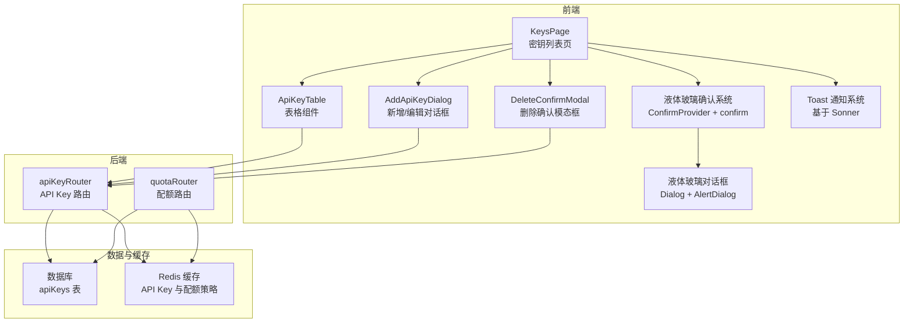
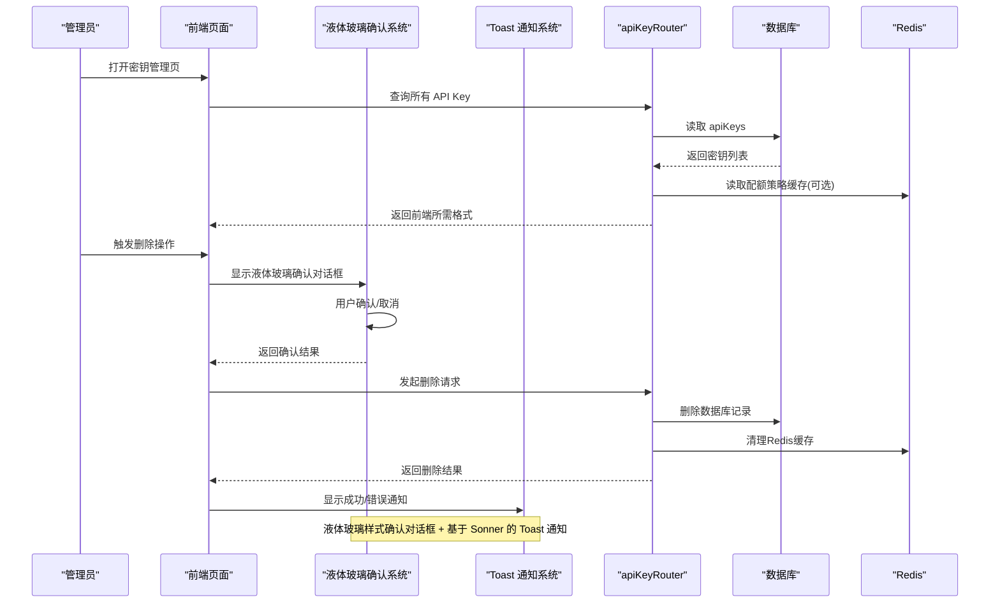
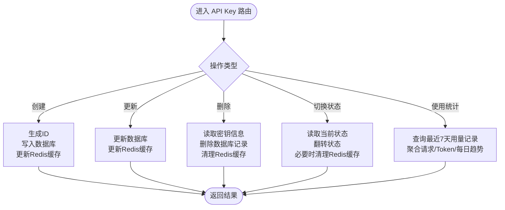
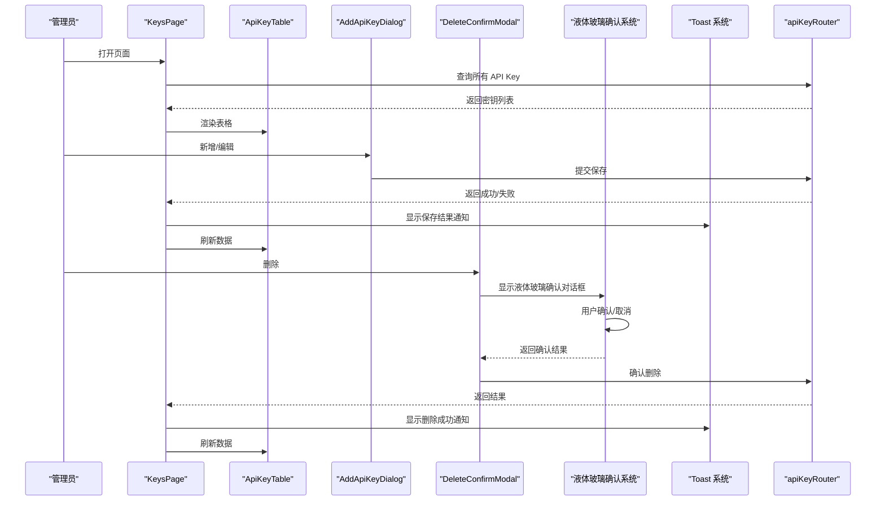
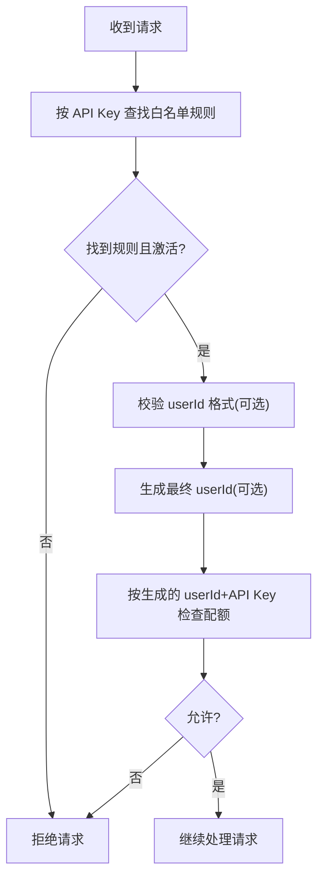
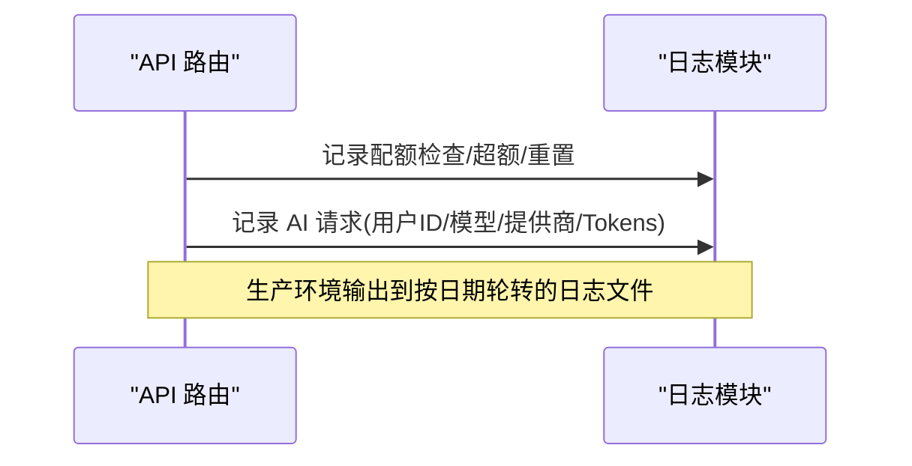
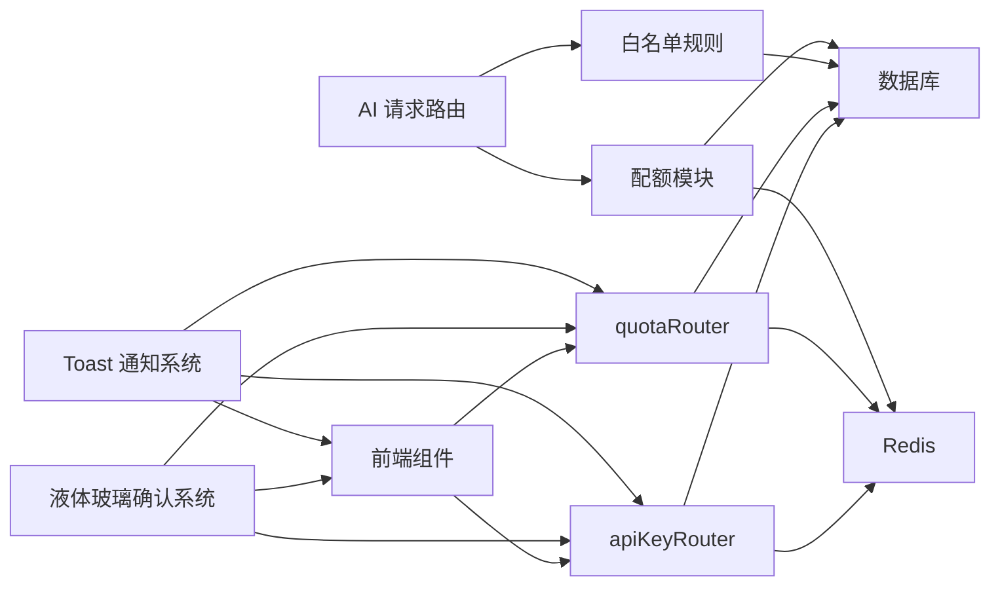

# API Key 管理

<cite>
**本文档引用的文件**
- [src/server/api/routers/api-key.ts](file://src/server/api/routers/api-key.ts)
- [src/app/(dashboard)/keys/page.tsx](file://src/app/(dashboard)/keys/page.tsx)
- [src/app/(dashboard)/keys/components/add-api-key-dialog.tsx](file://src/app/(dashboard)/keys/components/add-api-key-dialog.tsx)
- [src/app/(dashboard)/keys/components/api-key-table.tsx](file://src/app/(dashboard)/keys/components/api-key-table.tsx)
- [src/app/(dashboard)/keys/components/delete-confirm-modal.tsx](file://src/app/(dashboard)/keys/components/delete-confirm-modal.tsx)
- [src/components/ui/confirm.tsx](file://src/components/ui/confirm.tsx)
- [src/components/ui/dialog.tsx](file://src/components/ui/dialog.tsx)
- [src/components/ui/alert-dialog.tsx](file://src/components/ui/alert-dialog.tsx)
- [src/components/ui/sonner.tsx](file://src/components/ui/sonner.tsx)
- [src/app/layout.tsx](file://src/app/layout.tsx)
- [src/lib/database.ts](file://src/lib/database.ts)
- [src/lib/redis.ts](file://src/lib/redis.ts)
- [src/lib/types.ts](file://src/lib/types.ts)
- [src/lib/quota.ts](file://src/lib/quota.ts)
- [src/server/api/routers/quota.ts](file://src/server/api/routers/quota.ts)
- [src/lib/logger.ts](file://src/lib/logger.ts)
- [src/pages/api/ai/chat/stream.ts](file://src/pages/api/ai/chat/stream.ts)
- [src/server/api/routers/ai.ts](file://src/server/api/routers/ai.ts)
- [src/types/api-key.ts](file://src/types/api-key.ts)
</cite>

## 更新摘要
**变更内容**
- 集成新的液体玻璃样式确认对话框系统，替代了原有的 DeleteConfirmModal 组件
- 采用现代化的 ConfirmProvider 和 confirm 函数提供统一的确认操作体验
- 优化用户反馈机制：使用 toast.success() 和 toast.error() 提供更直观的用户体验
- 改进删除操作：确保 API Key 表格组件使用正确的 originId 字段进行删除
- 增强前端交互体验：通过液体玻璃效果的对话框提供沉浸式的确认操作
- 修复 API Key 表格组件状态切换 ID 错误：从 key.id 更改为 key.originId

## 目录
1. [简介](#简介)
2. [项目结构](#项目结构)
3. [核心组件](#核心组件)
4. [架构总览](#架构总览)
5. [详细组件分析](#详细组件分析)
6. [依赖关系分析](#依赖关系分析)
7. [性能考虑](#性能考虑)
8. [故障排除指南](#故障排除指南)
9. [结论](#结论)
10. [附录](#附录)

## 简介
本文件面向管理员与开发者，系统性阐述 API Key 管理系统的实现与使用。内容涵盖密钥的生成、验证、状态管理与生命周期控制；密钥绑定策略（白名单规则）、提供商关联、权限控制与使用统计；密钥轮换机制、安全策略配置、批量管理操作与审计日志记录。同时提供具体 API 调用示例与管理界面使用指南，帮助管理员高效、安全地管理 API Key。

**更新** 系统现已集成全新的液体玻璃样式确认对话框系统，提供现代化的用户体验。该系统基于 ConfirmProvider 和 confirm 函数，采用 Radix UI 对话框组件，具备毛玻璃效果和动画过渡。Toast 通知系统已完全集成，替代传统的错误/成功消息显示。

## 项目结构
API Key 管理涉及三层：前端页面与对话框、后端 tRPC 路由层、数据库与缓存层。前端负责展示与交互，tRPC 路由负责业务编排与参数校验，数据库与缓存负责持久化与高性能读取。新的液体玻璃样式确认对话框系统通过 ConfirmProvider 全局集成，为所有页面提供统一的确认操作体验。

**图表来源**
- [src/app/(dashboard)/keys/page.tsx](file://src/app/(dashboard)/keys/page.tsx#L1-L140)
- [src/app/(dashboard)/keys/components/api-key-table.tsx](file://src/app/(dashboard)/keys/components/api-key-table.tsx#L1-L194)
- [src/components/ui/confirm.tsx:34-111](file://src/components/ui/confirm.tsx#L34-L111)
- [src/components/ui/dialog.tsx:30-56](file://src/components/ui/dialog.tsx#L30-L56)
- [src/components/ui/alert-dialog.tsx:30-50](file://src/components/ui/alert-dialog.tsx#L30-L50)

**章节来源**
- [src/app/(dashboard)/keys/page.tsx](file://src/app/(dashboard)/keys/page.tsx#L1-L140)
- [src/server/api/routers/api-key.ts:68-377](file://src/server/api/routers/api-key.ts#L68-L377)

## 核心组件
- **API Key 路由层**：提供获取、创建、更新、删除、切换状态与使用统计等接口，统一进行输入校验与状态转换。
- **数据库层**：提供 API Key 的增删改查与按提供商筛选，以及用量记录与白名单规则的读写。
- **缓存层**：Redis 缓存 API Key 与配额策略，提升读取性能并支持快速轮换。
- **前端页面**：提供密钥列表、新增/编辑、删除确认与状态切换的可视化操作，集成液体玻璃样式确认对话框系统和 Toast 通知系统。
- **配额与审计**：基于 Redis 的配额检查与记录，结合日志系统实现审计追踪。
- **液体玻璃确认系统**：基于 ConfirmProvider 和 confirm 函数的现代化确认对话框系统，提供统一的用户反馈层。
- **Toast 通知系统**：基于 Sonner 库的现代化通知组件，提供成功、错误、警告等多类型反馈。

**更新** 新增液体玻璃样式确认对话框系统，采用 ConfirmProvider 和 confirm 函数实现统一的确认操作体验。系统现已完全集成液体玻璃效果的对话框组件，提供毛玻璃背景、阴影和动画过渡。

**章节来源**
- [src/server/api/routers/api-key.ts:68-377](file://src/server/api/routers/api-key.ts#L68-L377)
- [src/lib/database.ts:19-81](file://src/lib/database.ts#L19-L81)
- [src/lib/redis.ts:18-43](file://src/lib/redis.ts#L18-L43)
- [src/app/(dashboard)/keys/page.tsx](file://src/app/(dashboard)/keys/page.tsx#L1-L140)
- [src/components/ui/confirm.tsx:34-111](file://src/components/ui/confirm.tsx#L34-L111)
- [src/components/ui/sonner.tsx:1-46](file://src/components/ui/sonner.tsx#L1-L46)

## 架构总览
系统采用 tRPC 作为前后端通信桥梁，前端通过 tRPC 客户端调用后端路由，后端路由访问数据库与缓存完成业务处理。白名单规则与配额策略贯穿请求链路，确保密钥绑定与权限控制。液体玻璃样式确认对话框系统作为统一的用户交互层，提供沉浸式的确认操作体验。Toast 通知系统作为统一的用户反馈层，提供即时的操作结果反馈。

**图表来源**
- [src/server/api/routers/api-key.ts:68-377](file://src/server/api/routers/api-key.ts#L68-L377)
- [src/lib/database.ts:19-81](file://src/lib/database.ts#L19-L81)
- [src/lib/redis.ts:18-43](file://src/lib/redis.ts#L18-L43)
- [src/components/ui/confirm.tsx:34-111](file://src/components/ui/confirm.tsx#L34-L111)
- [src/components/ui/sonner.tsx:1-46](file://src/components/ui/sonner.tsx#L1-L46)

## 详细组件分析

### API Key 路由与业务流程
- **输入校验与状态转换**：使用 Zod Schema 对输入进行严格校验，提供前后端状态映射函数，保证存储与展示一致。
- **生命周期管理**：
  - **创建**：生成唯一 ID，写入数据库，更新 Redis 缓存。
  - **更新**：写入数据库，更新 Redis 缓存。
  - **删除**：先读取密钥信息，删除数据库记录，清理 Redis 缓存。
  - **切换状态**：读取当前状态并翻转，禁用时清理 Redis 缓存。
- **使用统计**：按最近七天用量记录聚合请求总数、Token 数与每日趋势。

**图表来源**
- [src/server/api/routers/api-key.ts:68-377](file://src/server/api/routers/api-key.ts#L68-L377)

**章节来源**
- [src/server/api/routers/api-key.ts:68-377](file://src/server/api/routers/api-key.ts#L68-L377)

### 前端页面与交互
- **KeysPage**：集中管理 tRPC 查询与变更，处理加载状态，集成液体玻璃样式确认对话框系统和 Toast 通知系统，触发刷新。
- **AddApiKeyDialog**：表单校验（名称、API Key 必填），动态占位符与提供商提示，支持新增与编辑。
- **ApiKeyTable**：展示密钥列表，支持复制、启用/禁用、编辑、删除与测试按钮，使用 Toast 进行即时反馈。**更新**：已修复状态切换使用正确的 originId 字段。
- **DeleteConfirmModal**：基于液体玻璃样式的二次确认删除对话框，提供毛玻璃背景和阴影效果，防止误操作。**更新**：该组件已被新的 confirm() 函数系统替代。
- **液体玻璃确认系统**：基于 ConfirmProvider 和 confirm 函数的现代化确认对话框系统，提供统一的用户交互体验。
- **Toast 通知系统**：基于 Sonner 的现代化通知组件，提供成功、错误、警告等多类型反馈。

**更新** KeysPage 组件已完全迁移到基于液体玻璃样式确认对话框系统，移除了传统的 DeleteConfirmModal 组件。API Key 表格组件已修复状态切换 ID 错误，从 key.id 更改为 key.originId。液体玻璃样式确认对话框系统提供毛玻璃效果、阴影和动画过渡，增强用户体验。

**图表来源**
- [src/app/(dashboard)/keys/page.tsx](file://src/app/(dashboard)/keys/page.tsx#L1-L140)
- [src/app/(dashboard)/keys/components/add-api-key-dialog.tsx](file://src/app/(dashboard)/keys/components/add-api-key-dialog.tsx#L1-L273)
- [src/app/(dashboard)/keys/components/api-key-table.tsx](file://src/app/(dashboard)/keys/components/api-key-table.tsx#L1-L194)
- [src/app/(dashboard)/keys/components/delete-confirm-modal.tsx](file://src/app/(dashboard)/keys/components/delete-confirm-modal.tsx#L1-L54)
- [src/components/ui/confirm.tsx:34-111](file://src/components/ui/confirm.tsx#L34-L111)
- [src/components/ui/sonner.tsx:1-46](file://src/components/ui/sonner.tsx#L1-L46)

**章节来源**
- [src/app/(dashboard)/keys/page.tsx](file://src/app/(dashboard)/keys/page.tsx#L1-L140)
- [src/app/(dashboard)/keys/components/add-api-key-dialog.tsx](file://src/app/(dashboard)/keys/components/add-api-key-dialog.tsx#L1-L273)
- [src/app/(dashboard)/keys/components/api-key-table.tsx](file://src/app/(dashboard)/keys/components/api-key-table.tsx#L1-L194)
- [src/app/(dashboard)/keys/components/delete-confirm-modal.tsx](file://src/app/(dashboard)/keys/components/delete-confirm-modal.tsx#L1-L54)
- [src/components/ui/confirm.tsx:34-111](file://src/components/ui/confirm.tsx#L34-L111)
- [src/components/ui/sonner.tsx:1-46](file://src/components/ui/sonner.tsx#L1-L46)

### 液体玻璃样式确认对话框系统
- **ConfirmProvider**：全局提供确认对话框服务，维护确认状态和回调函数，支持 Promise 风格的异步调用。
- **confirm 函数**：统一的确认对话框入口，支持字符串和选项对象两种调用方式，提供一致的用户体验。
- **液体玻璃效果**：采用毛玻璃背景（backdrop-blur）、半透明边框和阴影效果，营造现代感的视觉体验。
- **动画过渡**：使用 cubic-bezier 曲线和持续时间属性，提供流畅的打开/关闭动画。
- **主题适配**：自动适配明暗主题，确保在不同界面下都有良好的可读性。
- **变体支持**：支持默认和破坏性（destructive）两种样式变体，用于不同类型的确认操作。

**更新** 新增液体玻璃样式确认对话框系统，提供现代化的用户交互体验。该系统基于 ConfirmProvider 和 confirm 函数，采用 Radix UI 对话框组件，具备毛玻璃效果、阴影和动画过渡。

**图表来源**
- [src/components/ui/confirm.tsx:113-127](file://src/components/ui/confirm.tsx#L113-L127)
- [src/components/ui/confirm.tsx:34-111](file://src/components/ui/confirm.tsx#L34-L111)

**章节来源**
- [src/components/ui/confirm.tsx:34-111](file://src/components/ui/confirm.tsx#L34-L111)
- [src/components/ui/confirm.tsx:113-127](file://src/components/ui/confirm.tsx#L113-L127)

### 确认对话框系统迁移详解
**更新** 系统已完成从 DeleteConfirmModal 到 confirm() 函数系统的迁移，提供更统一的确认对话框体验。

- **迁移前**：使用独立的 DeleteConfirmModal 组件，需要手动管理状态和事件处理。
- **迁移后**：使用全局的 ConfirmProvider 和 confirm 函数，提供统一的确认对话框入口。
- **集成方式**：在应用根布局中通过 ConfirmProvider 包装整个应用，确保所有页面都能使用确认对话框功能。
- **调用方式**：通过 confirm({ title, description, onConfirm }) 方式调用，支持 Promise 风格的异步处理。
- **样式保持**：新系统完全保持液体玻璃样式效果，包括毛玻璃背景、阴影和动画过渡。

**章节来源**
- [src/app/(dashboard)/keys/page.tsx:65-75](file://src/app/(dashboard)/keys/page.tsx#L65-L75)
- [src/app/layout.tsx:54-56](file://src/app/layout.tsx#L54-L56)
- [src/components/ui/confirm.tsx:155-169](file://src/components/ui/confirm.tsx#L155-L169)

### 密钥绑定策略与提供商关联
- **白名单规则**：每个 API Key 可绑定一条白名单规则，规则包含匹配模式、优先级与策略名称，支持按 userId 格式校验与占位符生成最终 userId。
- **提供商映射**：前端字符串映射到数据库枚举，确保一致性。
- **校验流程**：请求到达时先按 API Key 查找白名单规则，再进行格式校验与 userId 生成，最终使用生成的 userId 与 API Key 组合进行配额检查。

**图表来源**
- [src/lib/database.ts:456-545](file://src/lib/database.ts#L456-L545)
- [src/server/api/routers/api-key.ts:29-66](file://src/server/api/routers/api-key.ts#L29-L66)
- [src/pages/api/ai/chat/stream.ts:42-86](file://src/pages/api/ai/chat/stream.ts#L42-L86)
- [src/server/api/routers/ai.ts:131-174](file://src/server/api/routers/ai.ts#L131-L174)

**章节来源**
- [src/lib/database.ts:456-545](file://src/lib/database.ts#L456-L545)
- [src/server/api/routers/api-key.ts:29-66](file://src/server/api/routers/api-key.ts#L29-L66)
- [src/pages/api/ai/chat/stream.ts:42-86](file://src/pages/api/ai/chat/stream.ts#L42-L86)
- [src/server/api/routers/ai.ts:131-174](file://src/server/api/routers/ai.ts#L131-L174)

### 权限控制与配额策略
- **配额策略**：支持按 Token 或请求次数两种模式，包含每日/每月限额与每分钟请求限制（RPM）。
- **策略绑定**：通过白名单规则与配额策略关联，按 API Key 直接获取策略并缓存。
- **配额检查**：按用户 ID 与 API Key 组合维度累加，支持 Token 模式与请求次数模式，均受 RPM 限制。
- **用量记录**：记录到 Redis 与数据库，支持重置与统计。

**图表来源**
- [src/lib/quota.ts:18-76](file://src/lib/quota.ts#L18-L76)
- [src/lib/quota.ts:79-200](file://src/lib/quota.ts#L79-L200)
- [src/lib/quota.ts:203-260](file://src/lib/quota.ts#L203-L260)
- [src/server/api/routers/quota.ts:39-221](file://src/server/api/routers/quota.ts#L39-L221)

**章节来源**
- [src/lib/quota.ts:18-76](file://src/lib/quota.ts#L18-L76)
- [src/lib/quota.ts:79-200](file://src/lib/quota.ts#L79-L200)
- [src/lib/quota.ts:203-260](file://src/lib/quota.ts#L203-L260)
- [src/server/api/routers/quota.ts:39-221](file://src/server/api/routers/quota.ts#L39-L221)

### 使用统计与审计日志
- **使用统计**：API Key 路由提供最近七天的请求与 Token 聚合，支持按日期分组的趋势图数据。
- **审计日志**：统一的日志模块记录配额检查、AI 请求与认证事件，生产环境按日期轮转文件，便于审计与问题排查。

**图表来源**
- [src/server/api/routers/api-key.ts:324-377](file://src/server/api/routers/api-key.ts#L324-L377)
- [src/lib/logger.ts:125-183](file://src/lib/logger.ts#L125-L183)

**章节来源**
- [src/server/api/routers/api-key.ts:324-377](file://src/server/api/routers/api-key.ts#L324-L377)
- [src/lib/logger.ts:125-183](file://src/lib/logger.ts#L125-L183)

### Toast 通知系统集成
- **统一通知入口**：所有用户操作反馈通过 Toast 系统呈现，提供一致的用户体验。
- **多类型通知**：支持成功、错误、警告、信息等不同类型的视觉反馈。
- **主题适配**：自动适配明暗主题，确保在不同界面下都有良好的可读性。
- **图标系统**：集成 Lucide 图标库，为不同类型的通知提供相应的视觉标识。

**更新** 新增基于 Sonner 的 Toast 通知系统，作为统一的用户反馈机制。系统已在全局布局中集成 Toaster 组件，确保所有页面都能使用通知功能。

**章节来源**
- [src/components/ui/sonner.tsx:1-46](file://src/components/ui/sonner.tsx#L1-L46)
- [src/app/layout.tsx:1-58](file://src/app/layout.tsx#L1-L58)

### 液体玻璃对话框组件
- **Dialog 组件**：基础对话框容器，提供毛玻璃背景效果和动画过渡，支持自定义类名和子组件。
- **AlertDialog 组件**：确认对话框专用组件，采用液体玻璃样式，提供确认和取消按钮。
- **动画效果**：使用 cubic-bezier 曲线和持续时间属性，提供流畅的打开/关闭动画。
- **视觉效果**：毛玻璃背景（backdrop-blur-2xl）、半透明边框（border-white/30）、阴影效果（shadow-[...]）。
- **响应式设计**：支持移动端和桌面端的适配，确保在不同设备上的良好体验。

**更新** 新增液体玻璃样式对话框组件，提供现代化的视觉效果和交互体验。Dialog 和 AlertDialog 组件都采用了毛玻璃背景和阴影效果。

**章节来源**
- [src/components/ui/dialog.tsx:30-56](file://src/components/ui/dialog.tsx#L30-L56)
- [src/components/ui/alert-dialog.tsx:30-50](file://src/components/ui/alert-dialog.tsx#L30-L50)

## 依赖关系分析
- **路由依赖**：API Key 路由依赖数据库与 Redis；配额路由依赖 Redis 与数据库；AI 请求路由依赖白名单规则与配额模块。
- **数据一致性**：状态切换与删除会同步清理 Redis 缓存，避免脏读。
- **前后端耦合**：前端通过 tRPC 调用后端，参数与返回值由 Zod Schema 与类型定义约束，降低耦合风险。
- **确认系统集成**：液体玻璃确认系统通过 ConfirmProvider 全局集成，为所有页面提供统一的确认操作体验。
- **通知系统集成**：Toast 通知系统通过全局布局集成，为所有页面提供统一的反馈机制。

**图表来源**
- [src/server/api/routers/api-key.ts:68-377](file://src/server/api/routers/api-key.ts#L68-L377)
- [src/server/api/routers/quota.ts:39-221](file://src/server/api/routers/quota.ts#L39-L221)
- [src/lib/database.ts:19-81](file://src/lib/database.ts#L19-L81)
- [src/lib/redis.ts:18-43](file://src/lib/redis.ts#L18-L43)
- [src/server/api/routers/ai.ts:131-174](file://src/server/api/routers/ai.ts#L131-L174)
- [src/components/ui/confirm.tsx:34-111](file://src/components/ui/confirm.tsx#L34-L111)
- [src/components/ui/sonner.tsx:1-46](file://src/components/ui/sonner.tsx#L1-L46)

**章节来源**
- [src/server/api/routers/api-key.ts:68-377](file://src/server/api/routers/api-key.ts#L68-L377)
- [src/server/api/routers/quota.ts:39-221](file://src/server/api/routers/quota.ts#L39-L221)
- [src/lib/database.ts:19-81](file://src/lib/database.ts#L19-L81)
- [src/lib/redis.ts:18-43](file://src/lib/redis.ts#L18-L43)
- [src/server/api/routers/ai.ts:131-174](file://src/server/api/routers/ai.ts#L131-L174)
- [src/components/ui/confirm.tsx:34-111](file://src/components/ui/confirm.tsx#L34-L111)
- [src/components/ui/sonner.tsx:1-46](file://src/components/ui/sonner.tsx#L1-L46)

## 性能考虑
- **缓存优先**：API Key 与配额策略通过 Redis 缓存，减少数据库压力；删除/切换状态时主动清理缓存，保证一致性。
- **异步容错**：Redis 更新失败仅记录警告，不影响主流程。
- **时间窗口**：用量与 RPM 以分钟/天为单位，避免热点时段竞争。
- **批量操作**：建议通过配额路由统一重置策略或用户配额，减少重复扫描与删除。
- **Toast 性能**：Toast 通知系统采用轻量级实现，不会对页面性能造成显著影响。
- **确认系统性能**：液体玻璃确认系统采用 React 状态管理，Promise 异步处理，性能开销最小化。

**更新** Toast 通知系统和液体玻璃确认系统均采用轻量级实现，确保不影响页面性能。确认系统通过 ConfirmProvider 单例模式管理状态，避免重复实例化。

## 故障排除指南
- **API Key 无法使用**
  - 检查状态是否为"活跃"，若为"禁用"需先切换状态。
  - 确认白名单规则已绑定且处于"激活"状态。
  - 核对 userId 格式是否满足规则中的正则表达式。
- **配额不足**
  - 查看配额策略的 limitType 与限额设置，确认是否达到每日或 RPM 限制。
  - 使用配额路由重置用户在某 API Key 下的配额。
- **删除失败**
  - 确认 API Key 是否存在；若不存在会返回"未找到"错误。
- **液体玻璃确认对话框问题**
  - 检查全局布局中是否正确引入了 ConfirmProvider 组件。
  - 确认 confirm 函数的调用方式是否正确。
  - 检查浏览器是否支持 backdrop-filter 属性。
- **Toast 通知问题**
  - 检查全局布局中是否正确引入了 Toaster 组件。
  - 确认网络连接正常，Toast 通知系统能够正常工作。
- **状态切换错误**
  - **更新** 确保使用正确的 originId 字段进行状态切换，而非 key.id。
- **日志定位**
  - 查看日志模块输出的配额检查与 AI 请求记录，定位异常原因。

**更新** 新增液体玻璃确认对话框系统故障排除指南和状态切换错误的故障排除指导。新增 confirm 函数调用方式检查和 backdrop-filter 属性支持检查。

**章节来源**
- [src/server/api/routers/api-key.ts:272-322](file://src/server/api/routers/api-key.ts#L272-L322)
- [src/lib/database.ts:456-545](file://src/lib/database.ts#L456-L545)
- [src/lib/quota.ts:79-200](file://src/lib/quota.ts#L79-L200)
- [src/server/api/routers/quota.ts:66-87](file://src/server/api/routers/quota.ts#L66-L87)
- [src/lib/logger.ts:125-183](file://src/lib/logger.ts#L125-L183)
- [src/components/ui/confirm.tsx:113-127](file://src/components/ui/confirm.tsx#L113-L127)
- [src/components/ui/sonner.tsx:1-46](file://src/components/ui/sonner.tsx#L1-L46)

## 结论
本系统通过 tRPC、数据库与 Redis 的协同，实现了 API Key 的全生命周期管理与严格的权限控制。白名单规则与配额策略解耦设计，既保证灵活性又兼顾性能。配合完善的审计日志、现代化的 Toast 通知系统和液体玻璃样式确认对话框系统，管理员可以高效、安全地管理密钥并保障系统稳定运行。

**更新** 新的液体玻璃样式确认对话框系统提供了更直观、一致的用户反馈体验，进一步提升了系统的易用性和专业性。Toast 通知系统和液体玻璃确认系统均采用现代化设计，提供沉浸式的用户体验。API Key 表格组件的 ID 错误修复确保了操作的准确性和可靠性。

## 附录

### API 调用示例（路径参考）
- 获取所有 API Key
  - 路径：[src/server/api/routers/api-key.ts:69-95](file://src/server/api/routers/api-key.ts#L69-L95)
- 根据 ID 获取 API Key
  - 路径：[src/server/api/routers/api-key.ts:97-129](file://src/server/api/routers/api-key.ts#L97-L129)
- 创建 API Key
  - 路径：[src/server/api/routers/api-key.ts:131-175](file://src/server/api/routers/api-key.ts#L131-L175)
- 更新 API Key
  - 路径：[src/server/api/routers/api-key.ts:177-225](file://src/server/api/routers/api-key.ts#L177-L225)
- 删除 API Key
  - 路径：[src/server/api/routers/api-key.ts:227-270](file://src/server/api/routers/api-key.ts#L227-L270)
- 切换 API Key 状态
  - 路径：[src/server/api/routers/api-key.ts:272-322](file://src/server/api/routers/api-key.ts#L272-L322)
- 获取 API Key 使用统计
  - 路径：[src/server/api/routers/api-key.ts:324-377](file://src/server/api/routers/api-key.ts#L324-L377)
- 获取用户今日使用情况
  - 路径：[src/server/api/routers/quota.ts:40-64](file://src/server/api/routers/quota.ts#L40-L64)
- 重置用户配额
  - 路径：[src/server/api/routers/quota.ts:66-87](file://src/server/api/routers/quota.ts#L66-L87)

### 管理界面使用指南
- 打开"API 密钥管理"页面，查看现有密钥列表。
- 点击"添加密钥"，填写名称、提供商、API Key、可选 Base URL 与状态，提交保存。
- 在列表中可复制密钥、切换状态、编辑或删除。
- 如需测试密钥有效性，可在表格中点击"测试"按钮（若后端提供相应能力）。
- 所有操作都会通过 Toast 通知系统提供即时反馈，包括成功、错误或警告信息。
- **更新** 删除操作会弹出液体玻璃样式确认对话框，提供毛玻璃背景和阴影效果，确保操作安全性。
- **更新** 状态切换操作使用正确的 originId 字段，确保操作的准确性。

### 液体玻璃确认对话框系统配置
- **全局集成**：在应用根布局中引入 ConfirmProvider 组件，确保所有页面都能使用确认对话框功能。
- **主题适配**：自动检测系统主题，提供明暗两种外观模式。
- **动画效果**：支持自定义动画持续时间和缓动函数，提供流畅的用户体验。
- **样式定制**：可通过 className 属性自定义确认对话框的外观样式。
- **变体支持**：支持默认和破坏性两种样式变体，用于不同类型的确认操作。

**更新** 新增液体玻璃确认对话框系统配置说明和使用指南。系统提供完整的样式定制和动画配置选项。

**章节来源**
- [src/app/(dashboard)/keys/page.tsx](file://src/app/(dashboard)/keys/page.tsx#L1-L140)
- [src/app/(dashboard)/keys/components/add-api-key-dialog.tsx](file://src/app/(dashboard)/keys/components/add-api-key-dialog.tsx#L1-L273)
- [src/app/(dashboard)/keys/components/api-key-table.tsx](file://src/app/(dashboard)/keys/components/api-key-table.tsx#L1-L194)
- [src/components/ui/confirm.tsx:34-111](file://src/components/ui/confirm.tsx#L34-L111)
- [src/app/layout.tsx:1-58](file://src/app/layout.tsx#L1-L58)

### 液体玻璃对话框组件使用指南
- **Dialog 组件**：适用于信息展示和简单确认场景，提供毛玻璃背景和阴影效果。
- **AlertDialog 组件**：适用于重要操作确认场景，如删除、重置等破坏性操作。
- **动画配置**：支持自定义动画持续时间和缓动函数，提供流畅的用户体验。
- **样式定制**：可通过 className 属性自定义对话框的外观样式，支持圆角、阴影等效果。
- **响应式设计**：支持移动端和桌面端的适配，确保在不同设备上的良好体验。

**更新** 新增液体玻璃对话框组件使用指南，涵盖 Dialog 和 AlertDialog 组件的使用场景和配置方法。

**章节来源**
- [src/components/ui/dialog.tsx:30-56](file://src/components/ui/dialog.tsx#L30-L56)
- [src/components/ui/alert-dialog.tsx:30-50](file://src/components/ui/alert-dialog.tsx#L30-L50)

### 确认对话框系统迁移指南
**更新** 新增确认对话框系统迁移指南，帮助开发者理解从 DeleteConfirmModal 到 confirm() 函数系统的迁移过程。

- **迁移目标**：统一确认对话框体验，提供更好的用户交互。
- **迁移步骤**：
  1. 在应用根布局中添加 ConfirmProvider 包装
  2. 移除 DeleteConfirmModal 组件
  3. 将删除操作改为使用 confirm() 函数
  4. 保持液体玻璃样式不变
- **兼容性**：新系统完全向后兼容，无需修改现有业务逻辑
- **优势**：统一的确认对话框入口，更好的可维护性

**章节来源**
- [src/app/(dashboard)/keys/page.tsx:65-75](file://src/app/(dashboard)/keys/page.tsx#L65-L75)
- [src/app/layout.tsx:54-56](file://src/app/layout.tsx#L54-L56)
- [src/components/ui/confirm.tsx:155-169](file://src/components/ui/confirm.tsx#L155-L169)