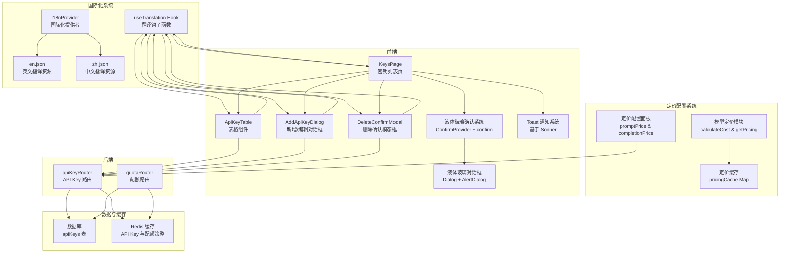
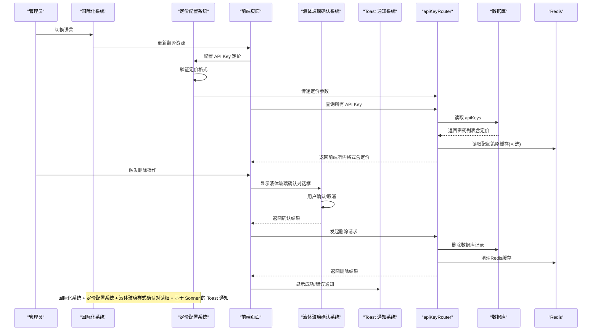
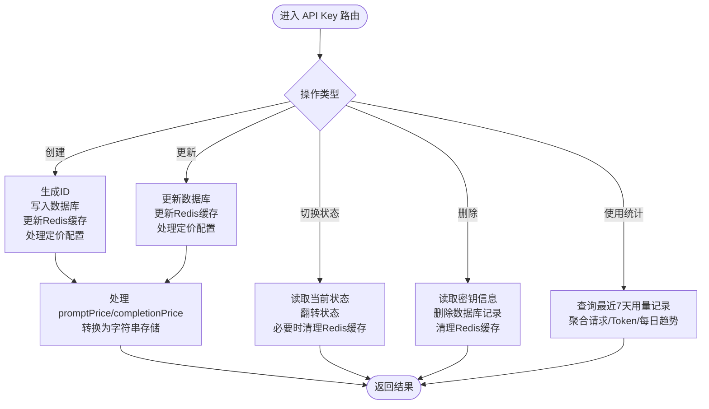
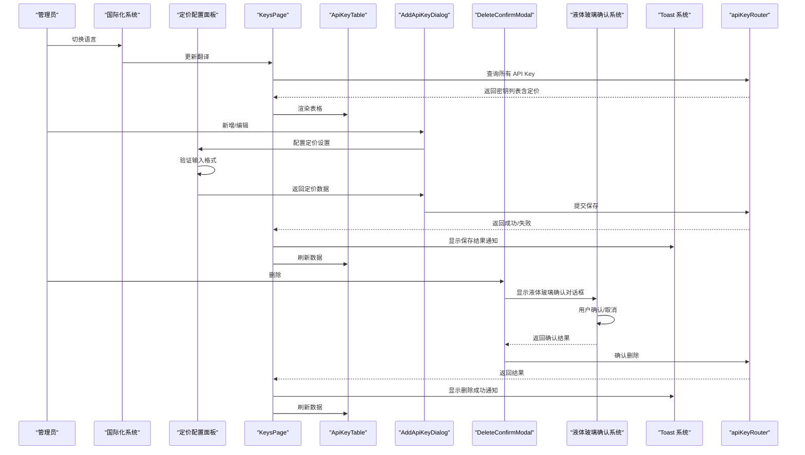
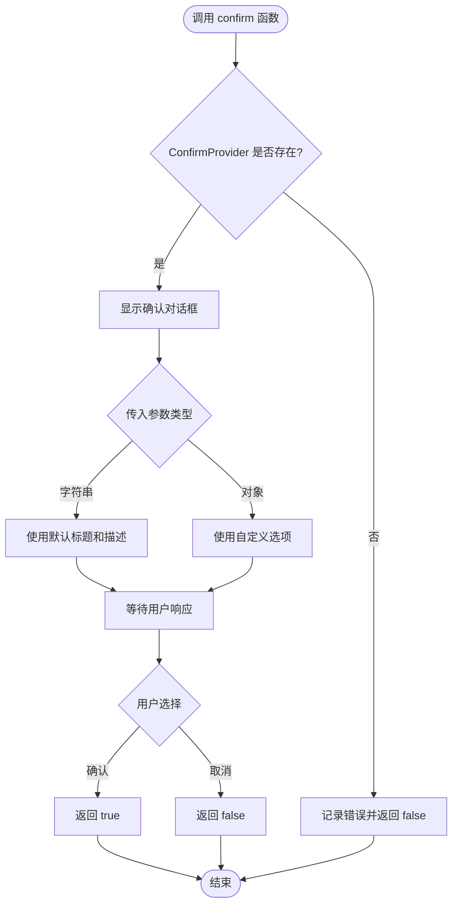
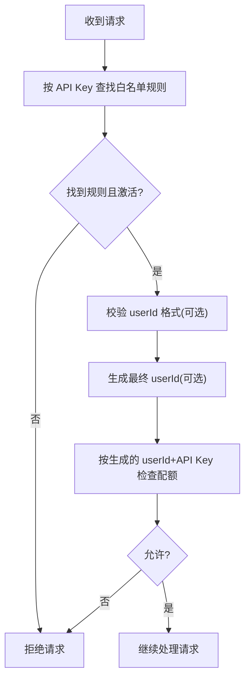
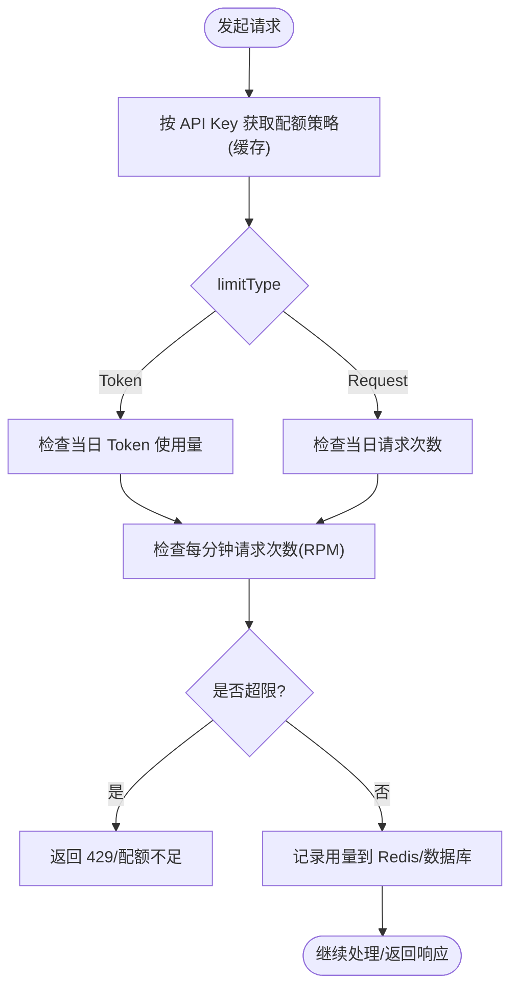
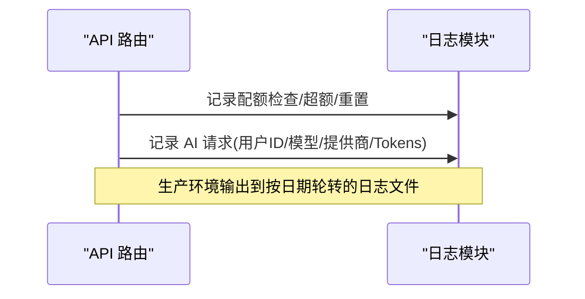
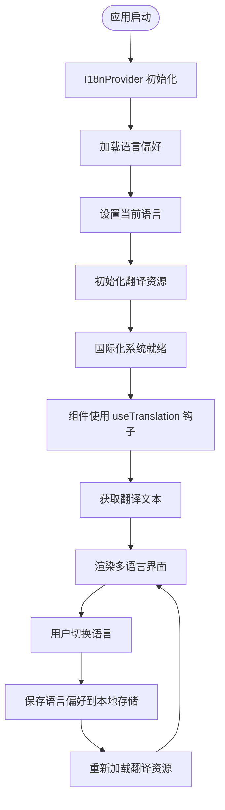
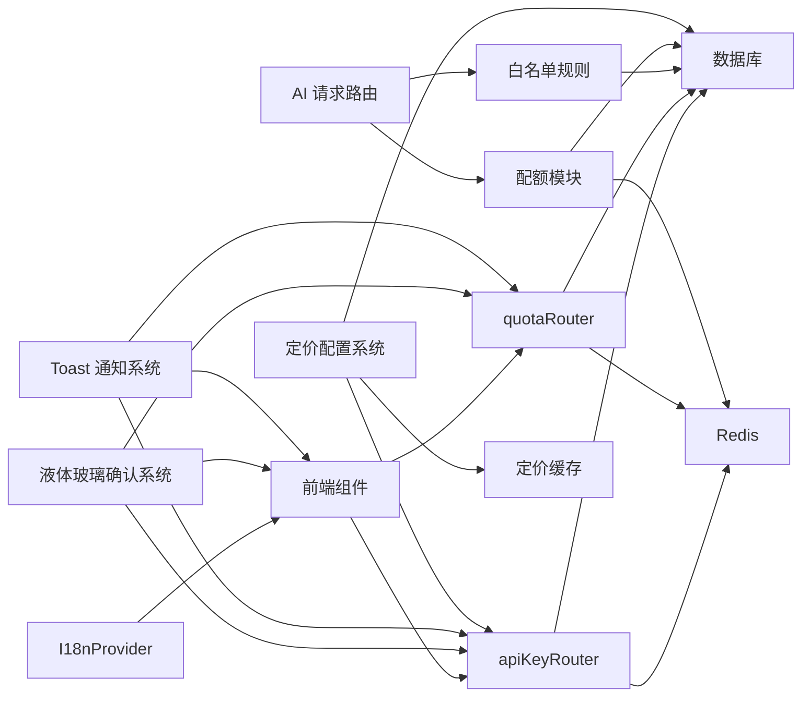

# API Key 管理

<cite>
**本文档引用的文件**
- [src/server/api/routers/api-key.ts](file://src/server/api/routers/api-key.ts)
- [src/app/(dashboard)/keys/page.tsx](file://src/app/(dashboard)/keys/page.tsx)
- [src/app/(dashboard)/keys/components/add-api-key-dialog.tsx](file://src/app/(dashboard)/keys/components/add-api-key-dialog.tsx)
- [src/app/(dashboard)/keys/components/api-key-table.tsx](file://src/app/(dashboard)/keys/components/api-key-table.tsx)
- [src/app/(dashboard)/keys/components/delete-confirm-modal.tsx](file://src/app/(dashboard)/keys/components/delete-confirm-modal.tsx)
- [src/components/ui/confirm.tsx](file://src/components/ui/confirm.tsx)
- [src/components/ui/dialog.tsx](file://src/components/ui/dialog.tsx)
- [src/components/ui/alert-dialog.tsx](file://src/components/ui/alert-dialog.tsx)
- [src/components/ui/sonner.tsx](file://src/components/ui/sonner.tsx)
- [src/app/layout.tsx](file://src/app/layout.tsx)
- [src/i18n/client.tsx](file://src/i18n/client.tsx)
- [src/messages/en.json](file://src/messages/en.json)
- [src/messages/zh.json](file://src/messages/zh.json)
- [src/lib/database.ts](file://src/lib/database.ts)
- [src/lib/redis.ts](file://src/lib/redis.ts)
- [src/lib/types.ts](file://src/lib/types.ts)
- [src/lib/quota.ts](file://src/lib/quota.ts)
- [src/server/api/routers/quota.ts](file://src/server/api/routers/quota.ts)
- [src/lib/logger.ts](file://src/lib/logger.ts)
- [src/pages/api/ai/chat/stream.ts](file://src/pages/api/ai/chat/stream.ts)
- [src/server/api/routers/ai.ts](file://src/server/api/routers/ai.ts)
- [src/types/api-key.ts](file://src/types/api-key.ts)
- [src/lib/schema.ts](file://src/lib/schema.ts)
- [src/lib/model-pricing.ts](file://src/lib/model-pricing.ts)
</cite>

## 更新摘要
**变更内容**
- 定价配置系统集成：新增 promptPrice 和 completionPrice 字段支持 API Key 定价配置
- 前端定价配置界面：新增可折叠的定价配置面板，支持输入自定义定价
- 后端数据转换：增强 API Key 路由处理，支持定价数据的转换与存储
- 翻译资源完善：新增定价配置相关的多语言翻译键值
- 数据库模式扩展：API Keys 表新增定价相关字段定义

## 目录
1. [简介](#简介)
2. [项目结构](#项目结构)
3. [核心组件](#核心组件)
4. [架构总览](#架构总览)
5. [详细组件分析](#详细组件分析)
6. [定价配置系统](#定价配置系统)
7. [国际化系统](#国际化系统)
8. [依赖关系分析](#依赖关系分析)
9. [性能考虑](#性能考虑)
10. [故障排除指南](#故障排除指南)
11. [结论](#结论)
12. [附录](#附录)

## 简介
本文件面向管理员与开发者，系统性阐述 API Key 管理系统的实现与使用。内容涵盖密钥的生成、验证、状态管理与生命周期控制；密钥绑定策略（白名单规则）、提供商关联、权限控制与使用统计；密钥轮换机制、安全策略配置、批量管理操作与审计日志记录。同时提供具体 API 调用示例与管理界面使用指南，帮助管理员高效、安全地管理 API Key。

**更新** 系统已完成定价配置系统的集成，支持为每个 API Key 设置自定义的输入和输出 Token 定价。新增的定价配置功能允许管理员根据不同提供商或特定需求设置差异化的成本计算标准，为后续的成本分析和配额管理提供更精确的数据支持。

## 项目结构
API Key 管理涉及三层：前端页面与对话框、后端 tRPC 路由层、数据库与缓存层。前端负责展示与交互，tRPC 路由负责业务编排与参数校验，数据库与缓存负责持久化与高性能读取。新增的定价配置系统通过 API Key 路由层与数据库层的协作，实现了灵活的定价策略管理。国际化系统通过 I18nProvider 全局集成，为所有页面提供统一的多语言支持。

**图表来源**
- [src/lib/model-pricing.ts:46-97](file://src/lib/model-pricing.ts#L46-L97)
- [src/lib/model-pricing.ts:113-146](file://src/lib/model-pricing.ts#L113-L146)
- [src/i18n/client.tsx:53-86](file://src/i18n/client.tsx#L53-L86)
- [src/messages/en.json:120-125](file://src/messages/en.json#L120-L125)
- [src/messages/zh.json:120-125](file://src/messages/zh.json#L120-L125)
- [src/app/(dashboard)/keys/components/add-api-key-dialog.tsx:257-311](file://src/app/(dashboard)/keys/components/add-api-key-dialog.tsx#L257-L311)

**章节来源**
- [src/lib/model-pricing.ts:46-97](file://src/lib/model-pricing.ts#L46-L97)
- [src/i18n/client.tsx:53-86](file://src/i18n/client.tsx#L53-L86)
- [src/app/(dashboard)/keys/page.tsx](file://src/app/(dashboard)/keys/page.tsx#L1-L145)
- [src/server/api/routers/api-key.ts:68-377](file://src/server/api/routers/api-key.ts#L68-L377)

## 核心组件
- **API Key 路由层**：提供获取、创建、更新、删除、切换状态与使用统计等接口，统一进行输入校验与状态转换。**更新**：新增定价配置字段的处理，支持 promptPrice 和 completionPrice 的转换与存储。
- **数据库层**：提供 API Key 的增删改查与按提供商筛选，以及用量记录与白名单规则的读写。**更新**：数据库模式已扩展支持定价相关字段，包括 decimal 类型的精度和规模定义。
- **缓存层**：Redis 缓存 API Key 与配额策略，提升读取性能并支持快速轮换。
- **前端页面**：提供密钥列表、新增/编辑、删除确认与状态切换的可视化操作，集成液体玻璃样式确认对话框系统和 Toast 通知系统，支持多语言界面。**更新**：新增定价配置面板，支持可折叠的定价设置界面。
- **定价配置系统**：基于模型定价模块的成本计算功能，支持自定义 API Key 定价与系统默认定价的优先级处理。**新增**：提供完整的定价配置管理功能。
- **国际化系统**：通过 I18nProvider 提供统一的多语言支持，支持中英文双语切换，翻译资源完整覆盖 API Key 管理相关界面元素。
- **配额与审计**：基于 Redis 的配额检查与记录，结合日志系统实现审计追踪。
- **液体玻璃确认系统**：基于 ConfirmProvider 和 confirm 函数的现代化确认对话框系统，提供统一的用户反馈层。
- **Toast 通知系统**：基于 Sonner 库的现代化通知组件，提供成功、错误、警告等多类型反馈。

**更新** 新增定价配置系统作为核心组件之一，提供灵活的 API Key 定价管理功能。系统支持自定义定价与系统默认定价的优先级处理，通过缓存机制提升性能。

**章节来源**
- [src/server/api/routers/api-key.ts:68-377](file://src/server/api/routers/api-key.ts#L68-L377)
- [src/lib/database.ts:19-81](file://src/lib/database.ts#L19-L81)
- [src/lib/redis.ts:18-43](file://src/lib/redis.ts#L18-L43)
- [src/lib/model-pricing.ts:46-97](file://src/lib/model-pricing.ts#L46-L97)
- [src/i18n/client.tsx:53-86](file://src/i18n/client.tsx#L53-L86)
- [src/messages/en.json:120-125](file://src/messages/en.json#L120-L125)
- [src/messages/zh.json:120-125](file://src/messages/zh.json#L120-L125)

## 架构总览
系统采用 tRPC 作为前后端通信桥梁，前端通过 tRPC 客户端调用后端路由，后端路由访问数据库与缓存完成业务处理。白名单规则与配额策略贯穿请求链路，确保密钥绑定与权限控制。新增的定价配置系统通过 API Key 路由层与数据库层的协作，实现了灵活的定价策略管理。国际化系统通过 I18nProvider 全局集成，为所有页面提供统一的多语言支持。

**图表来源**
- [src/lib/model-pricing.ts:56-68](file://src/lib/model-pricing.ts#L56-L68)
- [src/lib/model-pricing.ts:113-146](file://src/lib/model-pricing.ts#L113-L146)
- [src/i18n/client.tsx:73-80](file://src/i18n/client.tsx#L73-L80)
- [src/server/api/routers/api-key.ts:68-377](file://src/server/api/routers/api-key.ts#L68-L377)
- [src/lib/database.ts:19-81](file://src/lib/database.ts#L19-L81)
- [src/lib/redis.ts:18-43](file://src/lib/redis.ts#L18-L43)
- [src/components/ui/confirm.tsx:34-111](file://src/components/ui/confirm.tsx#L34-L111)
- [src/components/ui/sonner.tsx:1-46](file://src/components/ui/sonner.tsx#L1-L46)

## 详细组件分析

### API Key 路由与业务流程
- **输入校验与状态转换**：使用 Zod Schema 对输入进行严格校验，提供前后端状态映射函数，保证存储与展示一致。
- **生命周期管理**：
  - **创建**：生成唯一 ID，写入数据库，更新 Redis 缓存。
  - **更新**：写入数据库，更新 Redis 缓存。
  - **删除**：先读取密钥信息，删除数据库记录，清理 Redis 缓存。
  - **切换状态**：读取当前状态并翻转，禁用时清理 Redis 缓存。
- **使用统计**：按最近七天用量记录聚合请求总数、Token 数与每日趋势。
- **定价配置处理**：**更新** 新增对 promptPrice 和 completionPrice 字段的处理，支持数值转换与存储。

**图表来源**
- [src/server/api/routers/api-key.ts:135-185](file://src/server/api/routers/api-key.ts#L135-L185)
- [src/server/api/routers/api-key.ts:187-241](file://src/server/api/routers/api-key.ts#L187-L241)
- [src/server/api/routers/api-key.ts:68-377](file://src/server/api/routers/api-key.ts#L68-L377)

**章节来源**
- [src/server/api/routers/api-key.ts:68-377](file://src/server/api/routers/api-key.ts#L68-L377)

### 前端页面与交互
- **KeysPage**：集中管理 tRPC 查询与变更，处理加载状态，集成液体玻璃样式确认对话框系统和 Toast 通知系统，触发刷新。**更新**：已集成国际化系统，支持多语言界面显示。
- **AddApiKeyDialog**：表单校验（名称、API Key 必填），动态占位符与提供商提示，支持新增与编辑。**更新**：新增定价配置面板，支持可折叠的定价设置界面，包含输入验证和占位符提示。
- **ApiKeyTable**：展示密钥列表，支持复制、启用/禁用、编辑、删除与测试按钮，使用 Toast 进行即时反馈。**更新**：表格列头、操作按钮、状态显示均支持多语言。
- **DeleteConfirmModal**：基于液体玻璃样式的二次确认删除对话框，提供毛玻璃背景和阴影效果，防止误操作。**更新**：确认对话框内容支持多语言切换。
- **液体玻璃确认系统**：基于 ConfirmProvider 和 confirm 函数的现代化确认对话框系统，提供统一的用户交互体验。
- **Toast 通知系统**：基于 Sonner 的现代化通知组件，提供成功、错误、警告等多类型反馈。

**更新** 新增定价配置面板到 AddApiKeyDialog 组件，提供完整的定价设置功能。定价面板采用可折叠设计，包含输入验证、占位符提示和多语言支持。

**图表来源**
- [src/lib/model-pricing.ts:56-68](file://src/lib/model-pricing.ts#L56-L68)
- [src/i18n/client.tsx:73-80](file://src/i18n/client.tsx#L73-L80)
- [src/app/(dashboard)/keys/components/add-api-key-dialog.tsx:257-311](file://src/app/(dashboard)/keys/components/add-api-key-dialog.tsx#L257-L311)
- [src/app/(dashboard)/keys/page.tsx:15-16](file://src/app/(dashboard)/keys/page.tsx#L15-L16)
- [src/app/(dashboard)/keys/components/add-api-key-dialog.tsx:34-36](file://src/app/(dashboard)/keys/components/add-api-key-dialog.tsx#L34-L36)
- [src/app/(dashboard)/keys/components/api-key-table.tsx:22-24](file://src/app/(dashboard)/keys/components/api-key-table.tsx#L22-L24)
- [src/app/(dashboard)/keys/components/delete-confirm-modal.tsx:17-19](file://src/app/(dashboard)/keys/components/delete-confirm-modal.tsx#L17-L19)

**章节来源**
- [src/app/(dashboard)/keys/page.tsx](file://src/app/(dashboard)/keys/page.tsx#L1-L145)
- [src/app/(dashboard)/keys/components/add-api-key-dialog.tsx](file://src/app/(dashboard)/keys/components/add-api-key-dialog.tsx#L1-L334)
- [src/app/(dashboard)/keys/components/api-key-table.tsx](file://src/app/(dashboard)/keys/components/api-key-table.tsx#L1-L183)
- [src/app/(dashboard)/keys/components/delete-confirm-modal.tsx](file://src/app/(dashboard)/keys/components/delete-confirm-modal.tsx#L1-L56)
- [src/components/ui/confirm.tsx:34-111](file://src/components/ui/confirm.tsx#L34-L111)
- [src/components/ui/sonner.tsx:1-46](file://src/components/ui/sonner.tsx#L1-L46)

### API Key 字段命名标准化
**更新** 系统已完成 API Key 字段命名标准化，将 `originId` 和 `originKey` 统一为 `id` 和 `key`，提升代码的一致性和语义清晰度。

- **标准化前**：前端组件使用 `originId` 和 `originKey` 字段，可能导致命名不一致和混淆。
- **标准化后**：统一使用 `id` 和 `key` 字段，提升代码的可读性和维护性。
- **适配范围**：前端表格组件、表单组件、后端路由层和数据库模式均已适配新的字段命名。
- **字段含义**：
  - `id`：API Key 的唯一标识符
  - `key`：实际的 API 密钥值
  - `maskId`：脱敏后的 ID 显示
  - `maskKey`：脱敏后的密钥显示
- **定价字段**：**新增** `promptPrice` 和 `completionPrice` 字段，用于存储自定义定价信息。

**章节来源**
- [src/types/api-key.ts:1-24](file://src/types/api-key.ts#L1-L24)
- [src/app/(dashboard)/keys/components/api-key-table.tsx:41-72](file://src/app/(dashboard)/keys/components/api-key-table.tsx#L41-L72)
- [src/app/(dashboard)/keys/components/add-api-key-dialog.tsx:36-44](file://src/app/(dashboard)/keys/components/add-api-key-dialog.tsx#L36-L44)
- [src/server/api/routers/api-key.ts:75-85](file://src/server/api/routers/api-key.ts#L75-L85)

### 液体玻璃样式确认对话框系统
- **ConfirmProvider**：全局提供确认对话框服务，维护确认状态和回调函数，支持 Promise 风格的异步调用。
- **confirm 函数**：统一的确认对话框入口，支持字符串和选项对象两种调用方式，提供一致的用户体验。
- **液体玻璃效果**：采用毛玻璃背景（backdrop-blur）、半透明边框和阴影效果，营造现代感的视觉体验。
- **动画过渡**：使用 cubic-bezier 曲线和持续时间属性，提供流畅的打开/关闭动画。
- **主题适配**：自动适配明暗主题，确保在不同界面下都有良好的可读性。
- **变体支持**：支持默认和破坏性（destructive）两种样式变体，用于不同类型的确认操作。

**更新** 新增液体玻璃样式确认对话框系统，提供现代化的用户交互体验。该系统基于 ConfirmProvider 和 confirm 函数，采用 Radix UI 对话框组件，具备毛玻璃效果、阴影和动画过渡。

**图表来源**
- [src/components/ui/confirm.tsx:113-127](file://src/components/ui/confirm.tsx#L113-L127)
- [src/components/ui/confirm.tsx:34-111](file://src/components/ui/confirm.tsx#L34-L111)

**章节来源**
- [src/components/ui/confirm.tsx:34-111](file://src/components/ui/confirm.tsx#L34-L111)
- [src/components/ui/confirm.tsx:113-127](file://src/components/ui/confirm.tsx#L113-L127)

### 确认对话框系统迁移详解
**更新** 系统已完成从 DeleteConfirmModal 到 confirm() 函数系统的迁移，提供更统一的确认对话框体验。

- **迁移前**：使用独立的 DeleteConfirmModal 组件，需要手动管理状态和事件处理。
- **迁移后**：使用全局的 ConfirmProvider 和 confirm 函数，提供统一的确认对话框入口。
- **集成方式**：在应用根布局中通过 ConfirmProvider 包装整个应用，确保所有页面都能使用确认对话框功能。
- **调用方式**：通过 confirm({ title, description, onConfirm }) 方式调用，支持 Promise 风格的异步处理。
- **样式保持**：新系统完全保持液体玻璃样式效果，包括毛玻璃背景、阴影和动画过渡。

**章节来源**
- [src/app/(dashboard)/keys/page.tsx:65-75](file://src/app/(dashboard)/keys/page.tsx#L65-L75)
- [src/app/layout.tsx:54-56](file://src/app/layout.tsx#L54-L56)
- [src/components/ui/confirm.tsx:155-169](file://src/components/ui/confirm.tsx#L155-L169)

### 密钥绑定策略与提供商关联
- **白名单规则**：每个 API Key 可绑定一条白名单规则，规则包含匹配模式、优先级与策略名称，支持按 userId 格式校验与占位符生成最终 userId。
- **提供商映射**：前端字符串映射到数据库枚举，确保一致性。
- **校验流程**：请求到达时先按 API Key 查找白名单规则，再进行格式校验与 userId 生成，最终使用生成的 userId 与 API Key 组合进行配额检查。

**图表来源**
- [src/lib/database.ts:456-545](file://src/lib/database.ts#L456-L545)
- [src/server/api/routers/api-key.ts:29-66](file://src/server/api/routers/api-key.ts#L29-L66)
- [src/pages/api/ai/chat/stream.ts:42-86](file://src/pages/api/ai/chat/stream.ts#L42-L86)
- [src/server/api/routers/ai.ts:131-174](file://src/server/api/routers/ai.ts#L131-L174)

**章节来源**
- [src/lib/database.ts:456-545](file://src/lib/database.ts#L456-L545)
- [src/server/api/routers/api-key.ts:29-66](file://src/server/api/routers/api-key.ts#L29-L66)
- [src/pages/api/ai/chat/stream.ts:42-86](file://src/pages/api/ai/chat/stream.ts#L42-L86)
- [src/server/api/routers/ai.ts:131-174](file://src/server/api/routers/ai.ts#L131-L174)

### 权限控制与配额策略
- **配额策略**：支持按 Token 或请求次数两种模式，包含每日/每月限额与每分钟请求限制（RPM）。
- **策略绑定**：通过白名单规则与配额策略关联，按 API Key 直接获取策略并缓存。
- **配额检查**：按用户 ID 与 API Key 组合维度累加，支持 Token 模式与请求次数模式，均受 RPM 限制。
- **用量记录**：记录到 Redis 与数据库，支持重置与统计。

**图表来源**
- [src/lib/quota.ts:18-76](file://src/lib/quota.ts#L18-L76)
- [src/lib/quota.ts:79-200](file://src/lib/quota.ts#L79-L200)
- [src/lib/quota.ts:203-260](file://src/lib/quota.ts#L203-L260)
- [src/server/api/routers/quota.ts:39-221](file://src/server/api/routers/quota.ts#L39-L221)

**章节来源**
- [src/lib/quota.ts:18-76](file://src/lib/quota.ts#L18-L76)
- [src/lib/quota.ts:79-200](file://src/lib/quota.ts#L79-L200)
- [src/lib/quota.ts:203-260](file://src/lib/quota.ts#L203-L260)
- [src/server/api/routers/quota.ts:39-221](file://src/server/api/routers/quota.ts#L39-L221)

### 使用统计与审计日志
- **使用统计**：API Key 路由提供最近七天的请求与 Token 聚合，支持按日期分组的趋势图数据。
- **审计日志**：统一的日志模块记录配额检查、AI 请求与认证事件，生产环境按日期轮转文件，便于审计与问题排查。

**图表来源**
- [src/server/api/routers/api-key.ts:324-377](file://src/server/api/routers/api-key.ts#L324-L377)
- [src/lib/logger.ts:125-183](file://src/lib/logger.ts#L125-L183)

**章节来源**
- [src/server/api/routers/api-key.ts:324-377](file://src/server/api/routers/api-key.ts#L324-L377)
- [src/lib/logger.ts:125-183](file://src/lib/logger.ts#L125-L183)

### Toast 通知系统集成
- **统一通知入口**：所有用户操作反馈通过 Toast 系统呈现，提供一致的用户体验。
- **多类型通知**：支持成功、错误、警告、信息等不同类型的视觉反馈。
- **主题适配**：自动适配明暗主题，确保在不同界面下都有良好的可读性。
- **图标系统**：集成 Lucide 图标库，为不同类型的通知提供相应的视觉标识。

**更新** 新增基于 Sonner 的 Toast 通知系统，作为统一的用户反馈机制。系统已在全局布局中集成 Toaster 组件，确保所有页面都能使用通知功能。

**章节来源**
- [src/components/ui/sonner.tsx:1-46](file://src/components/ui/sonner.tsx#L1-L46)
- [src/app/layout.tsx:1-58](file://src/app/layout.tsx#L1-L58)

### 液体玻璃对话框组件
- **Dialog 组件**：基础对话框容器，提供毛玻璃背景效果和动画过渡，支持自定义类名和子组件。
- **AlertDialog 组件**：确认对话框专用组件，采用液体玻璃样式，提供确认和取消按钮。
- **动画效果**：使用 cubic-bezier 曲线和持续时间属性，提供流畅的打开/关闭动画。
- **视觉效果**：毛玻璃背景（backdrop-blur-2xl）、半透明边框（border-white/30）、阴影效果（shadow-[...]）。
- **响应式设计**：支持移动端和桌面端的适配，确保在不同设备上的良好体验。

**更新** 新增液体玻璃样式对话框组件，提供现代化的视觉效果和交互体验。Dialog 和 AlertDialog 组件都采用了毛玻璃背景和阴影效果。

**章节来源**
- [src/components/ui/dialog.tsx:30-56](file://src/components/ui/dialog.tsx#L30-L56)
- [src/components/ui/alert-dialog.tsx:30-50](file://src/components/ui/alert-dialog.tsx#L30-L50)

## 定价配置系统

### 定价配置字段与数据转换
**更新** 系统已完全集成定价配置功能，支持为每个 API Key 设置自定义的输入和输出 Token 定价。

- **字段定义**：
  - `promptPrice`：输入 Token 价格（美元/百万 tokens），decimal 类型，精度10，小数位6
  - `completionPrice`：输出 Token 价格（美元/百万 tokens），decimal 类型，精度10，小数位6
- **数据转换**：
  - 前端输入：number 类型，支持小数点后6位精度
  - 后端存储：转换为字符串存储到数据库
  - 前端展示：从数据库读取后转换为 number 类型
- **验证规则**：
  - 最小值：0
  - 步长：0.000001（6位小数精度）
  - 可选字段：留空表示使用系统默认定价

**章节来源**
- [src/server/api/routers/api-key.ts:85-86](file://src/server/api/routers/api-key.ts#L85-L86)
- [src/server/api/routers/api-key.ts:120-121](file://src/server/api/routers/api-key.ts#L120-L121)
- [src/server/api/routers/api-key.ts:151-152](file://src/server/api/routers/api-key.ts#L151-L152)
- [src/server/api/routers/api-key.ts:197-198](file://src/server/api/routers/api-key.ts#L197-L198)
- [src/lib/schema.ts:50-52](file://src/lib/schema.ts#L50-L52)

### 前端定价配置界面
**更新** 新增完整的定价配置面板，提供直观的用户界面。

- **界面设计**：
  - 可折叠面板：通过 ChevronDown 图标控制展开/收起
  - 两列布局：输入 Token 价格和输出 Token 价格分别在左右列
  - 占位符提示：显示默认值示例（如 2.5、10.0）
  - 描述信息：显示美元/百万 tokens 的单位说明
- **交互功能**：
  - 实时验证：输入格式验证，支持小数点输入
  - 空值处理：留空表示使用系统默认定价
  - 数据绑定：双向数据绑定，实时更新表单状态
- **多语言支持**：
  - 定价配置标题："Pricing Configuration (Optional)"
  - 描述文本："Set custom pricing for this API Key for cost calculation. Leave empty to use system default pricing"
  - 字段标签："Input Token Price"、"Output Token Price"
  - 单位说明："USD per million tokens"

**章节来源**
- [src/app/(dashboard)/keys/components/add-api-key-dialog.tsx:257-311](file://src/app/(dashboard)/keys/components/add-api-key-dialog.tsx#L257-L311)
- [src/messages/en.json:120-125](file://src/messages/en.json#L120-L125)
- [src/messages/zh.json:120-125](file://src/messages/zh.json#L120-L125)

### 后端定价处理逻辑
**更新** 新增定价配置的后端处理逻辑，确保数据的正确转换与存储。

- **创建时处理**：
  - 输入验证：检查 promptPrice 和 completionPrice 的数值有效性
  - 类型转换：将 number 转换为字符串存储到数据库
  - 空值处理：undefined/null 转换为 null 存储
- **更新时处理**：
  - 支持部分字段更新：只更新提供的定价字段
  - 数据一致性：保持其他字段不变
- **查询时转换**：
  - 数据库读取：decimal 类型自动转换为字符串
  - 前端转换：parseFloat 转换为 number 类型
  - 空值处理：null 转换为 undefined 返回给前端

**章节来源**
- [src/server/api/routers/api-key.ts:135-185](file://src/server/api/routers/api-key.ts#L135-L185)
- [src/server/api/routers/api-key.ts:187-241](file://src/server/api/routers/api-key.ts#L187-L241)
- [src/server/api/routers/api-key.ts:75-86](file://src/server/api/routers/api-key.ts#L75-L86)
- [src/server/api/routers/api-key.ts:111-122](file://src/server/api/routers/api-key.ts#L111-L122)

### 成本计算与模型定价
**更新** 新增基于定价配置的成本计算功能，支持自定义定价与系统默认定价的优先级处理。

- **优先级规则**：
  1. API Key 自定义定价（最高优先级）
  2. 模型级别定价（中等优先级）
  3. 系统默认定价（最低优先级）
- **计算公式**：
  - 成本 = (promptTokens / 1,000,000 × promptPrice) + (completionTokens / 1,000,000 × completionPrice)
- **缓存机制**：
  - 内存缓存：pricingCache Map 提升查询性能
  - 自动更新：数据库更新时清除相关缓存
  - 错误处理：默认定价回退机制

**章节来源**
- [src/lib/model-pricing.ts:56-68](file://src/lib/model-pricing.ts#L56-L68)
- [src/lib/model-pricing.ts:73-97](file://src/lib/model-pricing.ts#L73-L97)
- [src/lib/model-pricing.ts:113-146](file://src/lib/model-pricing.ts#L113-L146)

### 数据库模式扩展
**更新** 数据库模式已扩展支持定价配置功能。

- **API Keys 表扩展**：
  - `prompt_price`：decimal(10,6)，默认 0
  - `completion_price`：decimal(10,6)，默认 0
  - 支持 NULL 值，表示使用系统默认定价
- **模型定价表**：
  - `model`：模型名称（标准化处理）
  - `provider`：提供商名称
  - `prompt_price`：decimal(10,6)，默认 0
  - `completion_price`：decimal(10,6)，默认 0
  - `is_active`：启用状态标志
- **类型定义**：
  - TypeScript 接口：定义强类型的数据结构
  - Drizzle ORM：提供类型安全的数据库操作

**章节来源**
- [src/lib/schema.ts:42-55](file://src/lib/schema.ts#L42-L55)
- [src/lib/schema.ts:57-70](file://src/lib/schema.ts#L57-L70)
- [src/types/api-key.ts:13-16](file://src/types/api-key.ts#L13-L16)

## 国际化系统

### I18nProvider 国际化提供者
- **全局集成**：在应用根布局中通过 I18nProvider 包装整个应用，确保所有页面都能使用国际化功能。
- **语言切换**：支持中英文双语切换，语言偏好存储在本地存储中，实现持久化记忆。
- **翻译资源**：内置完整的中英文翻译资源，覆盖导航、通用、认证、仪表板、API Key、配额、用户等模块。
- **嵌套键值**：支持嵌套的对象结构，如 ApiKey.title、Common.save 等层级化翻译键。
- **回退机制**：当翻译键不存在时，自动回退到原始键值，并在控制台发出警告。

**更新** 新增定价配置相关的多语言翻译键值，支持完整的定价配置界面国际化。

**图表来源**
- [src/i18n/client.tsx:53-86](file://src/i18n/client.tsx#L53-L86)
- [src/app/layout.tsx:48-53](file://src/app/layout.tsx#L48-L53)

**章节来源**
- [src/i18n/client.tsx:53-86](file://src/i18n/client.tsx#L53-L86)
- [src/app/layout.tsx:48-53](file://src/app/layout.tsx#L48-L53)

### 翻译资源结构
- **导航模块**：包含仪表板、调试、配额管理、API 密钥、用户策略管理等导航项的多语言翻译。
- **通用模块**：提供首页、设置、退出登录、个人资料、保存、取消、删除、编辑、创建、搜索、筛选、重置、加载中、无数据、确认、关闭、语言、配额限制等通用词汇的翻译。
- **认证模块**：包含登录、登录标题、登录副标题、邮箱、密码、记住我、忘记密码、登录、登出、登录失败、登录错误、登录中等认证相关文本的翻译。
- **仪表板模块**：提供仪表板标题、副标题、总用户数、请求数、Token 消耗、活跃用户、最近活动、近期请求趋势、请求地区分布、模型使用分布、最近 IP 请求记录、数据更新时间等界面元素的翻译。
- **API Key 模块**：完整覆盖 API Key 管理的所有界面元素，包括标题、添加密钥、名称、提供商、API Key、基础 URL、状态、创建时间、最后使用、操作、启用、禁用、编辑、删除、复制到剪贴板、创建 API Key、编辑 API Key、删除 API Key、删除确认标题、删除确认、删除警告、删除中、创建成功、更新成功、删除成功、状态切换成功、创建失败、更新失败、删除失败、状态切换失败、无 API 密钥、添加第一个 API 密钥、保存、取消、保存中、API Key 描述、基础 URL 描述、**新增** 定价配置、输入 Token 价格、输出 Token 价格、美元/百万 tokens 等。
- **配额模块**：提供配额管理相关的策略名称、描述、限制类型、Token 限制、请求次数限制、每日限制、每月限制、RPM 限制、令牌单位、请求单位、创建时间、操作、无配额策略、添加第一个配额策略、最大上下文长度、查看详情等翻译。
- **用户模块**：包含用户策略管理的标题、添加规则、编辑白名单规则、创建白名单规则、删除确认、规则创建成功、规则更新成功、规则删除成功、规则状态切换成功、创建失败、更新失败、删除失败、状态切换失败、用户名、邮箱、角色、状态、管理员、普通用户、激活、未激活等翻译。

**更新** 新增定价配置相关的翻译键值，包括定价配置标题、描述、字段标签和单位说明等完整翻译支持。

**章节来源**
- [src/messages/en.json:110-125](file://src/messages/en.json#L110-L125)
- [src/messages/zh.json:110-125](file://src/messages/zh.json#L110-L125)

### 组件国际化集成
- **useTranslation 钩子**：提供 t 函数用于获取翻译文本，支持字符串和对象类型的翻译键。
- **API Key 页面**：标题、添加按钮、加载状态、删除确认等全部支持多语言。
- **新增/编辑对话框**：表单标签、占位符、按钮文本、描述信息等完整国际化。**更新**：新增定价配置面板的多语言支持。
- **API Key 表格**：列头、状态显示、操作按钮、空状态消息等均支持多语言。
- **删除确认模态框**：确认标题、警告信息、按钮文本等支持多语言切换。
- **侧边栏底部**：语言切换按钮、主题切换、用户菜单等界面元素支持多语言。

**更新** 所有核心组件均已集成国际化功能，包括新增的定价配置面板。API Key 页面、对话框、表格等关键界面元素均已完成多语言改造。

**章节来源**
- [src/app/(dashboard)/keys/page.tsx:15-16](file://src/app/(dashboard)/keys/page.tsx#L15-L16)
- [src/app/(dashboard)/keys/components/add-api-key-dialog.tsx:34-36](file://src/app/(dashboard)/keys/components/add-api-key-dialog.tsx#L34-L36)
- [src/app/(dashboard)/keys/components/api-key-table.tsx:22-24](file://src/app/(dashboard)/keys/components/api-key-table.tsx#L22-L24)
- [src/app/(dashboard)/keys/components/delete-confirm-modal.tsx:17-19](file://src/app/(dashboard)/keys/components/delete-confirm-modal.tsx#L17-L19)
- [src/components/dashboard-layout/sidebar-footer.tsx:123-124](file://src/components/dashboard-layout/sidebar-footer.tsx#L123-L124)

### 语言切换功能
- **实时切换**：用户可以在侧边栏底部的语言切换区域实时切换中英文界面。
- **持久化存储**：语言偏好自动保存到本地存储，刷新页面后保持上次选择的语言。
- **HTML 属性更新**：切换语言时自动更新 HTML 元素的 lang 属性，支持屏幕阅读器等辅助技术。
- **组件响应**：所有使用 useTranslation 钩子的组件会自动响应语言变化，重新渲染多语言界面。
- **主题适配**：语言切换不影响明暗主题设置，两者独立控制。

**更新** 新增完整的语言切换功能，支持实时中英文切换，数据持久化存储，组件自动响应语言变化。

**章节来源**
- [src/i18n/client.tsx:73-80](file://src/i18n/client.tsx#L73-L80)
- [src/components/dashboard-layout/sidebar-footer.tsx:140-161](file://src/components/dashboard-layout/sidebar-footer.tsx#L140-L161)

## 依赖关系分析
- **路由依赖**：API Key 路由依赖数据库与 Redis；配额路由依赖 Redis 与数据库；AI 请求路由依赖白名单规则与配额模块。
- **数据一致性**：状态切换与删除会同步清理 Redis 缓存，避免脏读。
- **前后端耦合**：前端通过 tRPC 调用后端，参数与返回值由 Zod Schema 与类型定义约束，降低耦合风险。
- **确认系统集成**：液体玻璃确认系统通过 ConfirmProvider 全局集成，为所有页面提供统一的确认操作体验。
- **通知系统集成**：Toast 通知系统通过全局布局集成，为所有页面提供统一的反馈机制。
- **国际化系统集成**：I18nProvider 通过全局布局集成，为所有页面提供统一的多语言支持。
- **定价系统集成**：**新增** 定价配置系统通过 API Key 路由层与数据库层的协作，实现灵活的定价策略管理。

**图表来源**
- [src/lib/model-pricing.ts:46-97](file://src/lib/model-pricing.ts#L46-L97)
- [src/i18n/client.tsx:53-86](file://src/i18n/client.tsx#L53-L86)
- [src/server/api/routers/api-key.ts:68-377](file://src/server/api/routers/api-key.ts#L68-L377)
- [src/server/api/routers/quota.ts:39-221](file://src/server/api/routers/quota.ts#L39-L221)
- [src/lib/database.ts:19-81](file://src/lib/database.ts#L19-L81)
- [src/lib/redis.ts:18-43](file://src/lib/redis.ts#L18-L43)
- [src/server/api/routers/ai.ts:131-174](file://src/server/api/routers/ai.ts#L131-L174)
- [src/components/ui/confirm.tsx:34-111](file://src/components/ui/confirm.tsx#L34-L111)
- [src/components/ui/sonner.tsx:1-46](file://src/components/ui/sonner.tsx#L1-L46)

**章节来源**
- [src/lib/model-pricing.ts:46-97](file://src/lib/model-pricing.ts#L46-L97)
- [src/i18n/client.tsx:53-86](file://src/i18n/client.tsx#L53-L86)
- [src/server/api/routers/api-key.ts:68-377](file://src/server/api/routers/api-key.ts#L68-L377)
- [src/server/api/routers/quota.ts:39-221](file://src/server/api/routers/quota.ts#L39-L221)
- [src/lib/database.ts:19-81](file://src/lib/database.ts#L19-L81)
- [src/lib/redis.ts:18-43](file://src/lib/redis.ts#L18-L43)
- [src/server/api/routers/ai.ts:131-174](file://src/server/api/routers/ai.ts#L131-L174)
- [src/components/ui/confirm.tsx:34-111](file://src/components/ui/confirm.tsx#L34-L111)
- [src/components/ui/sonner.tsx:1-46](file://src/components/ui/sonner.tsx#L1-L46)

## 性能考虑
- **缓存优先**：API Key 与配额策略通过 Redis 缓存，减少数据库压力；删除/切换状态时主动清理缓存，保证一致性。
- **异步容错**：Redis 更新失败仅记录警告，不影响主流程。
- **时间窗口**：用量与 RPM 以分钟/天为单位，避免热点时段竞争。
- **批量操作**：建议通过配额路由统一重置策略或用户配额，减少重复扫描与删除。
- **Toast 性能**：Toast 通知系统采用轻量级实现，不会对页面性能造成显著影响。
- **确认系统性能**：液体玻璃确认系统采用 React 状态管理，Promise 异步处理，性能开销最小化。
- **国际化性能**：I18nProvider 采用本地存储缓存语言偏好，避免频繁的网络请求；翻译资源按需加载，支持懒加载优化。
- **组件优化**：useTranslation 钩子函数使用 useCallback 优化，避免不必要的组件重渲染。
- **定价缓存性能**：**新增** 定价配置系统使用内存缓存（pricingCache），避免重复的数据库查询，提升成本计算性能。

**更新** 新增定价配置系统的性能考虑，包括内存缓存机制、数据库查询优化和错误回退处理。

## 故障排除指南
- **API Key 无法使用**
  - 检查状态是否为"活跃"，若为"禁用"需先切换状态。
  - 确认白名单规则已绑定且处于"激活"状态。
  - 核对 userId 格式是否满足规则中的正则表达式。
- **配额不足**
  - 查看配额策略的 limitType 与限额设置，确认是否达到每日或 RPM 限制。
  - 使用配额路由重置用户在某 API Key 下的配额。
- **删除失败**
  - 确认 API Key 是否存在；若不存在会返回"未找到"错误。
- **液体玻璃确认对话框问题**
  - 检查全局布局中是否正确引入了 ConfirmProvider 组件。
  - 确认 confirm 函数的调用方式是否正确。
  - 检查浏览器是否支持 backdrop-filter 属性。
- **Toast 通知问题**
  - 检查全局布局中是否正确引入了 Toaster 组件。
  - 确认网络连接正常，Toast 通知系统能够正常工作。
- **字段命名错误**
  - **更新** 确保使用标准化的 `id` 和 `key` 字段进行操作，而非旧的 `originId` 和 `originKey`。
- **状态切换错误**
  - **更新** 确保使用正确的 `key.id` 字段进行状态切换，而非其他字段。
- **国际化问题**
  - **更新** 检查 I18nProvider 是否正确集成到应用根布局中。
  - 确认翻译键是否存在，检查 messages 文件中的键值对。
  - 检查浏览器语言设置，确认语言切换功能正常工作。
  - 确认本地存储中的语言偏好设置是否正确。
- **定价配置问题**
  - **新增** 检查 API Key 的 promptPrice 和 completionPrice 字段格式是否正确（数字类型，最多6位小数）。
  - 确认定价字段是否为可选，留空表示使用系统默认定价。
  - 检查数据库中定价字段的 decimal 类型定义是否正确。
  - 确认定价缓存是否正常工作，必要时清除缓存后重试。
- **日志定位**
  - 查看日志模块输出的配额检查与 AI 请求记录，定位异常原因。

**更新** 新增定价配置相关的故障排除指南，包括字段格式验证、数据库类型检查、缓存机制测试等。

**章节来源**
- [src/server/api/routers/api-key.ts:272-322](file://src/server/api/routers/api-key.ts#L272-L322)
- [src/lib/database.ts:456-545](file://src/lib/database.ts#L456-L545)
- [src/lib/quota.ts:79-200](file://src/lib/quota.ts#L79-L200)
- [src/server/api/routers/quota.ts:66-87](file://src/server/api/routers/quota.ts#L66-L87)
- [src/lib/logger.ts:125-183](file://src/lib/logger.ts#L125-L183)
- [src/components/ui/confirm.tsx:113-127](file://src/components/ui/confirm.tsx#L113-L127)
- [src/components/ui/sonner.tsx:1-46](file://src/components/ui/sonner.tsx#L1-L46)
- [src/i18n/client.tsx:113-127](file://src/i18n/client.tsx#L113-L127)

## 结论
本系统通过 tRPC、数据库与 Redis 的协同，实现了 API Key 的全生命周期管理与严格的权限控制。白名单规则与配额策略解耦设计，既保证灵活性又兼顾性能。配合完善的审计日志、现代化的 Toast 通知系统、液体玻璃样式确认对话框系统和全新的国际化系统，管理员可以高效、安全地管理密钥并保障系统稳定运行。

**更新** 新增的定价配置系统提供了灵活的 API Key 定价管理功能，支持自定义定价与系统默认定价的优先级处理。系统通过内存缓存机制提升性能，通过数据库模式扩展支持精确的定价存储。完整的多语言支持确保了全球化的用户体验，而增强的国际化系统为所有界面元素提供了统一的翻译资源。

## 附录

### API 调用示例（路径参考）
- 获取所有 API Key
  - 路径：[src/server/api/routers/api-key.ts:69-95](file://src/server/api/routers/api-key.ts#L69-L95)
- 根据 ID 获取 API Key
  - 路径：[src/server/api/routers/api-key.ts:97-129](file://src/server/api/routers/api-key.ts#L97-L129)
- 创建 API Key
  - 路径：[src/server/api/routers/api-key.ts:131-175](file://src/server/api/routers/api-key.ts#L131-L175)
- 更新 API Key
  - 路径：[src/server/api/routers/api-key.ts:177-225](file://src/server/api/routers/api-key.ts#L177-L225)
- 删除 API Key
  - 路径：[src/server/api/routers/api-key.ts:227-270](file://src/server/api/routers/api-key.ts#L227-L270)
- 切换 API Key 状态
  - 路径：[src/server/api/routers/api-key.ts:272-322](file://src/server/api/routers/api-key.ts#L272-L322)
- 获取 API Key 使用统计
  - 路径：[src/server/api/routers/api-key.ts:324-377](file://src/server/api/routers/api-key.ts#L324-L377)
- 获取用户今日使用情况
  - 路径：[src/server/api/routers/quota.ts:40-64](file://src/server/api/routers/quota.ts#L40-L64)
- 重置用户配额
  - 路径：[src/server/api/routers/quota.ts:66-87](file://src/server/api/routers/quota.ts#L66-L87)

### 管理界面使用指南
- 打开"API 密钥管理"页面，查看现有密钥列表。
- 点击"添加密钥"，填写名称、提供商、API Key、可选 Base URL 与状态，提交保存。
- 在列表中可复制密钥、切换状态、编辑或删除。
- 如需测试密钥有效性，可在表格中点击"测试"按钮（若后端提供相应能力）。
- 所有操作都会通过 Toast 通知系统提供即时反馈，包括成功、错误或警告信息。
- **更新** 删除操作会弹出液体玻璃样式确认对话框，提供毛玻璃背景和阴影效果，确保操作安全性。
- **更新** 状态切换操作使用标准化的 `key.id` 字段，确保操作的准确性和一致性。
- **更新** 支持实时语言切换，在侧边栏底部的语言切换区域可选择中英文界面。
- **新增** 定价配置功能：在新增/编辑对话框中展开"定价配置"面板，输入自定义的输入和输出 Token 价格，支持美元/百万 tokens 的格式。

### API Key 字段命名标准化指南
**更新** 新增 API Key 字段命名标准化使用指南，帮助开发者正确使用新的字段命名规范。

- **标准化字段**：
  - `id`：API Key 的唯一标识符
  - `key`：实际的 API 密钥值
  - `maskId`：脱敏后的 ID 显示
  - `maskKey`：脱敏后的密钥显示
- **定价字段**：**新增**
  - `promptPrice`：输入 Token 价格（美元/百万 tokens）
  - `completionPrice`：输出 Token 价格（美元/百万 tokens）
- **使用规范**：
  - 前端表格组件使用 `key.id` 和 `key.key` 进行显示和操作
  - 表单组件使用 `formData.id` 和 `formData.key` 进行数据绑定
  - 后端路由层使用 `input.id` 和 `input.key` 进行数据处理
  - **新增** 定价字段使用 `formData.promptPrice` 和 `formData.completionPrice`
- **迁移注意事项**：
  - 避免使用旧的 `originId` 和 `originKey` 字段
  - 确保所有组件和路由层都使用标准化的字段命名
  - 检查数据库查询和缓存操作中的字段引用
  - **新增** 确保定价字段的类型转换和验证逻辑正确

**章节来源**
- [src/types/api-key.ts:1-24](file://src/types/api-key.ts#L1-L24)
- [src/app/(dashboard)/keys/components/api-key-table.tsx:127](file://src/app/(dashboard)/keys/components/api-key-table.tsx#L127)
- [src/app/(dashboard)/keys/components/add-api-key-dialog.tsx:118](file://src/app/(dashboard)/keys/components/add-api-key-dialog.tsx#L118)
- [src/server/api/routers/api-key.ts:141](file://src/server/api/routers/api-key.ts#L141)

### 液体玻璃确认对话框系统配置
- **全局集成**：在应用根布局中引入 ConfirmProvider 组件，确保所有页面都能使用确认对话框功能。
- **主题适配**：自动检测系统主题，提供明暗两种外观模式。
- **动画效果**：支持自定义动画持续时间和缓动函数，提供流畅的用户体验。
- **样式定制**：可通过 className 属性自定义确认对话框的外观样式。
- **变体支持**：支持默认和破坏性两种样式变体，用于不同类型的确认操作。

**更新** 新增液体玻璃确认对话框系统配置说明和使用指南。系统提供完整的样式定制和动画配置选项。

**章节来源**
- [src/app/(dashboard)/keys/page.tsx](file://src/app/(dashboard)/keys/page.tsx#L1-L145)
- [src/app/(dashboard)/keys/components/add-api-key-dialog.tsx](file://src/app/(dashboard)/keys/components/add-api-key-dialog.tsx#L1-L334)
- [src/app/(dashboard)/keys/components/api-key-table.tsx](file://src/app/(dashboard)/keys/components/api-key-table.tsx#L1-L183)
- [src/components/ui/confirm.tsx:34-111](file://src/components/ui/confirm.tsx#L34-L111)
- [src/app/layout.tsx:1-58](file://src/app/layout.tsx#L1-L58)

### 液体玻璃对话框组件使用指南
- **Dialog 组件**：适用于信息展示和简单确认场景，提供毛玻璃背景和阴影效果。
- **AlertDialog 组件**：适用于重要操作确认场景，如删除、重置等破坏性操作。
- **动画配置**：支持自定义动画持续时间和缓动函数，提供流畅的用户体验。
- **样式定制**：可通过 className 属性自定义对话框的外观样式，支持圆角、阴影等效果。
- **响应式设计**：支持移动端和桌面端的适配，确保在不同设备上的良好体验。

**更新** 新增液体玻璃对话框组件使用指南，涵盖 Dialog 和 AlertDialog 组件的使用场景和配置方法。

**章节来源**
- [src/components/ui/dialog.tsx:30-56](file://src/components/ui/dialog.tsx#L30-L56)
- [src/components/ui/alert-dialog.tsx:30-50](file://src/components/ui/alert-dialog.tsx#L30-L50)

### 确认对话框系统迁移指南
**更新** 新增确认对话框系统迁移指南，帮助开发者理解从 DeleteConfirmModal 到 confirm() 函数系统的迁移过程。

- **迁移目标**：统一确认对话框体验，提供更好的用户交互。
- **迁移步骤**：
  1. 在应用根布局中添加 ConfirmProvider 包装
  2. 移除 DeleteConfirmModal 组件
  3. 将删除操作改为使用 confirm() 函数
  4. 保持液体玻璃样式不变
- **兼容性**：新系统完全向后兼容，无需修改现有业务逻辑
- **优势**：统一的确认对话框入口，更好的可维护性

**章节来源**
- [src/app/(dashboard)/keys/page.tsx:65-75](file://src/app/(dashboard)/keys/page.tsx#L65-L75)
- [src/app/layout.tsx:54-56](file://src/app/layout.tsx#L54-L56)
- [src/components/ui/confirm.tsx:155-169](file://src/components/ui/confirm.tsx#L155-L169)

### 数据库模式与字段映射
**更新** 新增数据库模式与字段映射说明，展示标准化前后字段的对应关系。

- **数据库字段**（保持不变）：
  - `id`：API Key 的唯一标识符
  - `key`：实际的 API 密钥值
  - `name`：API Key 的名称
  - `provider`：提供商类型
  - `base_url`：自定义基础 URL
  - `status`：状态（ACTIVE/INACTIVE/SUSPENDED）
  - `prompt_price`：**新增** 输入 Token 价格（decimal）
  - `completion_price`：**新增** 输出 Token 价格（decimal）
  - `created_at`：创建时间
  - `updated_at`：更新时间
- **前端字段映射**：
  - `id` ↔ `id`
  - `key` ↔ `key`
  - `maskId` ↔ `maskApiKey(id)`
  - `maskKey` ↔ `maskApiKey(key)`
  - **新增** `promptPrice` ↔ `promptPrice`
  - **新增** `completionPrice` ↔ `completionPrice`
- **标准化优势**：
  - 提升代码一致性
  - 减少命名混淆
  - 便于维护和扩展

**章节来源**
- [src/lib/schema.ts:42-55](file://src/lib/schema.ts#L42-L55)
- [src/server/api/routers/api-key.ts:75-85](file://src/server/api/routers/api-key.ts#L75-L85)
- [src/types/api-key.ts:2-16](file://src/types/api-key.ts#L2-L16)

### 国际化系统配置指南
**更新** 新增国际化系统配置指南，帮助开发者理解和使用多语言功能。

- **I18nProvider 集成**：在应用根布局中通过 I18nProvider 包装整个应用，确保所有页面都能使用国际化功能。
- **翻译资源**：messages 目录包含完整的中英文翻译资源，覆盖所有界面元素。
- **useTranslation 钩子**：组件通过 useTranslation 钩子函数获取翻译文本，支持字符串和对象类型的翻译键。
- **语言切换**：通过 setLocale 函数实现实时语言切换，支持中英文双语环境。
- **本地存储**：语言偏好自动保存到本地存储，刷新页面后保持上次选择的语言。
- **HTML 属性**：切换语言时自动更新 HTML 元素的 lang 属性，支持辅助技术。

**章节来源**
- [src/i18n/client.tsx:53-86](file://src/i18n/client.tsx#L53-L86)
- [src/messages/en.json:110-125](file://src/messages/en.json#L110-L125)
- [src/messages/zh.json:110-125](file://src/messages/zh.json#L110-L125)
- [src/app/layout.tsx:48-53](file://src/app/layout.tsx#L48-L53)

### API Key 翻译资源使用指南
**更新** 新增 API Key 翻译资源使用指南，帮助开发者正确使用多语言功能。

- **翻译键结构**：Api Key 模块包含完整的翻译键值，如 ApiKey.title、ApiKey.createKey、ApiKey.name 等。
- **定价配置翻译**：**新增** 包含 pricingConfig、pricingConfigDesc、promptPrice、completionPrice、pricePerMillion 等键值。
- **动态内容**：支持占位符替换，如 ApiKey.apiKeyDesc 中的 {provider} 占位符。
- **组件集成**：所有 API Key 相关组件均通过 useTranslation 钩子函数获取翻译资源。
- **语言回退**：当翻译键不存在时，自动回退到原始键值，并在控制台发出警告。
- **最佳实践**：建议在组件中统一使用 t 函数获取翻译，避免硬编码文本。

**章节来源**
- [src/messages/en.json:110-125](file://src/messages/en.json#L110-L125)
- [src/messages/zh.json:110-125](file://src/messages/zh.json#L110-L125)
- [src/app/(dashboard)/keys/page.tsx:15-16](file://src/app/(dashboard)/keys/page.tsx#L15-L16)
- [src/app/(dashboard)/keys/components/add-api-key-dialog.tsx:34-36](file://src/app/(dashboard)/keys/components/add-api-key-dialog.tsx#L34-L36)
- [src/app/(dashboard)/keys/components/api-key-table.tsx:22-24](file://src/app/(dashboard)/keys/components/api-key-table.tsx#L22-L24)
- [src/app/(dashboard)/keys/components/delete-confirm-modal.tsx:17-19](file://src/app/(dashboard)/keys/components/delete-confirm-modal.tsx#L17-L19)

### 定价配置系统使用指南
**新增** 定价配置系统的完整使用指南。

- **功能概述**：为每个 API Key 设置自定义的输入和输出 Token 定价，支持美元/百万 tokens 的格式。
- **界面位置**：在新增/编辑 API Key 对话框中，展开"定价配置"面板。
- **输入格式**：
  - 支持整数和小数输入
  - 最多6位小数精度
  - 最小值为 0
  - 留空表示使用系统默认定价
- **优先级规则**：
  1. API Key 自定义定价（最高优先级）
  2. 模型级别定价（中等优先级）
  3. 系统默认定价（最低优先级）
- **成本计算**：成本 = (promptTokens/1,000,000 × promptPrice) + (completionTokens/1,000,000 × completionPrice)
- **缓存机制**：使用内存缓存提升查询性能，数据库更新时自动清除相关缓存
- **最佳实践**：
  - 根据提供商的官方定价设置合理的价格
  - 定期检查和更新定价信息
  - 使用留空功能保持与系统默认定价的一致性

**章节来源**
- [src/app/(dashboard)/keys/components/add-api-key-dialog.tsx:257-311](file://src/app/(dashboard)/keys/components/add-api-key-dialog.tsx#L257-L311)
- [src/lib/model-pricing.ts:56-68](file://src/lib/model-pricing.ts#L56-L68)
- [src/lib/model-pricing.ts:73-97](file://src/lib/model-pricing.ts#L73-L97)
- [src/lib/model-pricing.ts:113-146](file://src/lib/model-pricing.ts#L113-L146)