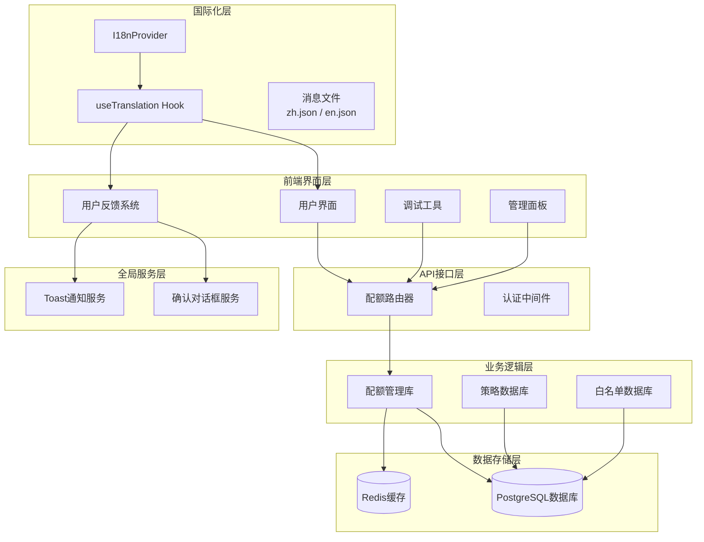
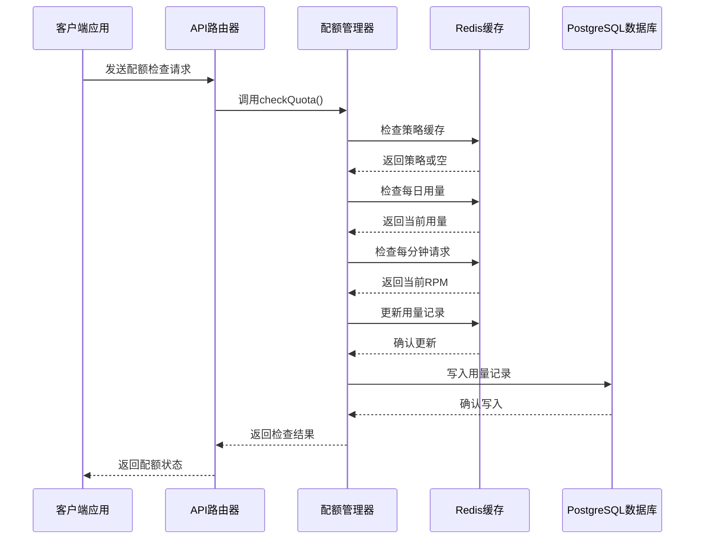
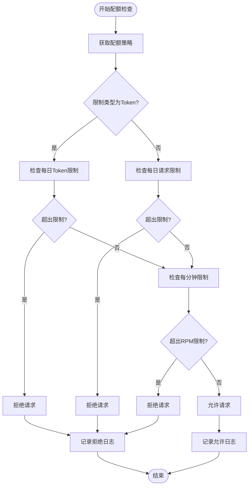
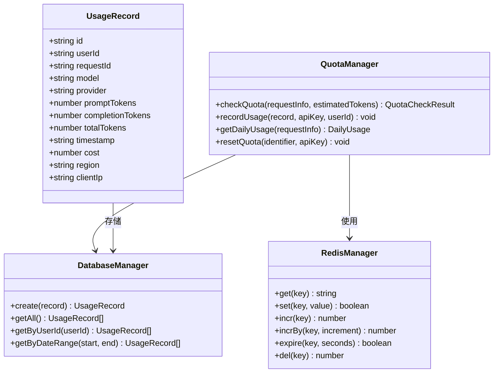
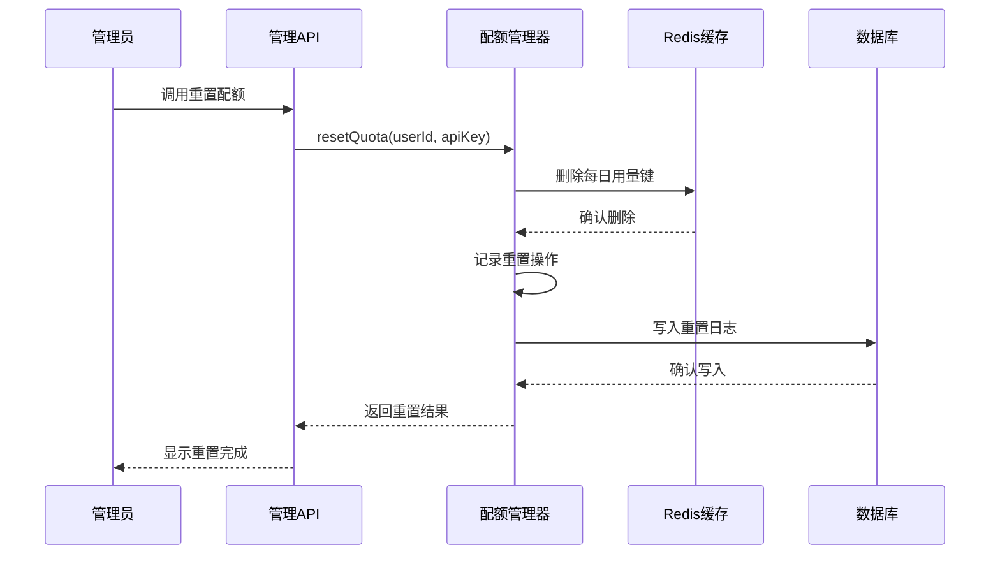
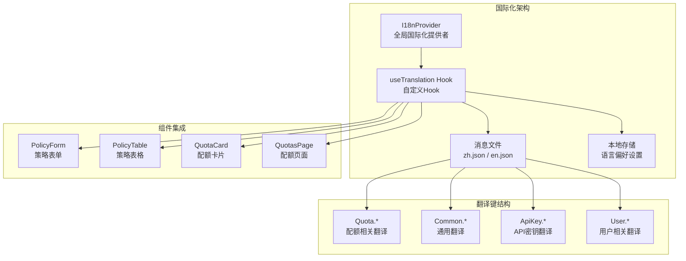
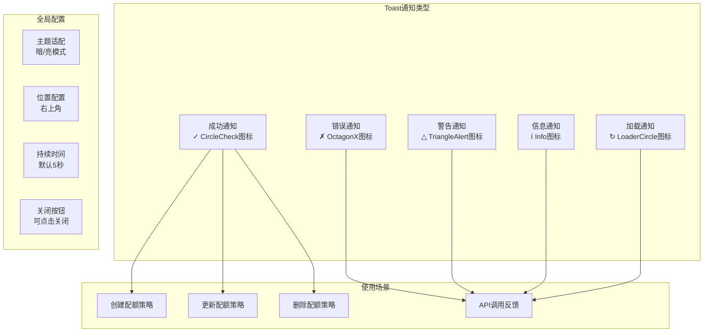
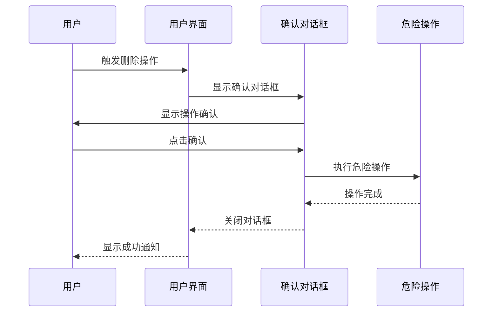
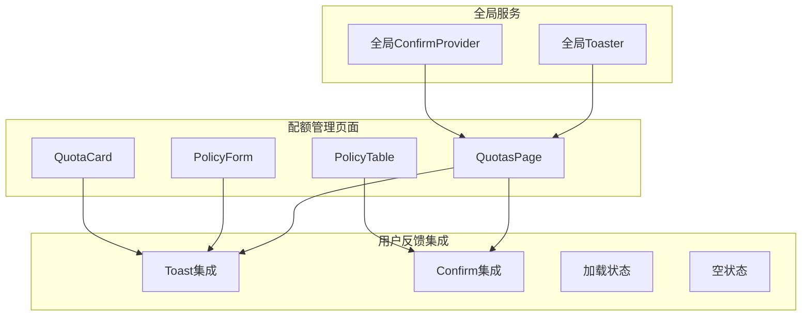
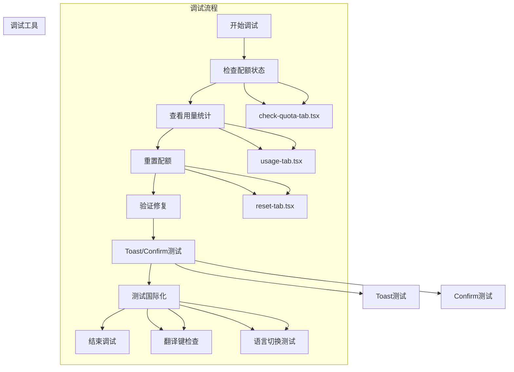

# 智能配额管理系统

<cite>
**本文档引用的文件**
- [src/lib/quota.ts](file://src/lib/quota.ts)
- [src/lib/redis.ts](file://src/lib/redis.ts)
- [src/server/api/routers/quota.ts](file://src/server/api/routers/quota.ts)
- [src/lib/database.ts](file://src/lib/database.ts)
- [src/lib/types.ts](file://src/lib/types.ts)
- [src/lib/logger-middleware.ts](file://src/lib/logger-middleware.ts)
- [src/lib/logger.ts](file://src/lib/logger.ts)
- [src/lib/date.ts](file://src/lib/date.ts)
- [src/app/(dashboard)/quotas/components/policy-form.tsx](file://src/app/(dashboard)/quotas/components/policy-form.tsx)
- [src/app/(dashboard)/quotas/components/policy-table.tsx](file://src/app/(dashboard)/quotas/components/policy-table.tsx)
- [src/app/(dashboard)/quotas/components/quota-card.tsx](file://src/app/(dashboard)/quotas/components/quota-card.tsx)
- [src/app/(dashboard)/quotas/page.tsx](file://src/app/(dashboard)/quotas/page.tsx)
- [src/app/(dashboard)/debug/components/quota-debug/check-quota-tab.tsx](file://src/app/(dashboard)/debug/components/quota-debug/check-quota-tab.tsx)
- [src/app/(dashboard)/debug/components/quota-debug/usage-tab.tsx](file://src/app/(dashboard)/debug/components/quota-debug/usage-tab.tsx)
- [src/app/(dashboard)/debug/components/quota-debug/reset-tab.tsx](file://src/app/(dashboard)/debug/components/quota-debug/reset-tab.tsx)
- [src/components/ui/sonner.tsx](file://src/components/ui/sonner.tsx)
- [src/components/ui/confirm.tsx](file://src/components/ui/confirm.tsx)
- [src/app/layout.tsx](file://src/app/layout.tsx)
- [src/i18n/client.tsx](file://src/i18n/client.tsx)
- [src/messages/zh.json](file://src/messages/zh.json)
- [src/messages/en.json](file://src/messages/en.json)
</cite>

## 更新摘要
**变更内容**
- 新增国际化(i18n)支持，配额策略表单、表格、卡片等组件现已支持中英文双语
- 新增完整的策略创建、编辑、删除等操作的翻译支持
- 集成全局国际化提供者，支持动态语言切换
- 完善Toast通知和确认对话框的多语言支持
- 扩展消息文件，包含配额管理相关的完整翻译键值

## 目录
1. [简介](#简介)
2. [项目结构](#项目结构)
3. [核心组件](#核心组件)
4. [架构概览](#架构概览)
5. [详细组件分析](#详细组件分析)
6. [国际化增强](#国际化增强)
7. [用户反馈机制](#用户反馈机制)
8. [依赖关系分析](#依赖关系分析)
9. [性能考虑](#性能考虑)
10. [故障排除指南](#故障排除指南)
11. [结论](#结论)
12. [附录](#附录)

## 简介

智能配额管理系统是一个基于Redis缓存的高性能配额控制解决方案，支持Token和请求次数双重限制模式。该系统通过白名单规则与配额策略的结合，实现了灵活的用户配额管理功能。

系统的核心特性包括：
- **双重限制模式**：支持Token消耗限制和请求次数限制
- **Redis缓存机制**：采用多级缓存策略提升性能
- **实时监控**：提供配额使用情况的实时查看功能
- **灵活配置**：支持动态调整配额策略和白名单规则
- **安全审计**：完整的配额操作日志记录
- **现代化用户界面**：集成Toast通知和确认对话框，提供优秀的用户体验
- **国际化支持**：完整的中英文双语支持，涵盖所有用户界面元素

## 项目结构

智能配额管理系统采用分层架构设计，主要分为以下层次：



**图表来源**
- [src/i18n/client.tsx:53-86](file://src/i18n/client.tsx#L53-L86)
- [src/app/layout.tsx:48-53](file://src/app/layout.tsx#L48-L53)
- [src/server/api/routers/quota.ts:1-221](file://src/server/api/routers/quota.ts#L1-L221)
- [src/lib/quota.ts:1-327](file://src/lib/quota.ts#L1-L327)

**章节来源**
- [src/i18n/client.tsx:53-86](file://src/i18n/client.tsx#L53-L86)
- [src/app/layout.tsx:48-53](file://src/app/layout.tsx#L48-L53)
- [src/server/api/routers/quota.ts:1-221](file://src/server/api/routers/quota.ts#L1-L221)
- [src/lib/quota.ts:1-327](file://src/lib/quota.ts#L1-L327)

## 核心组件

### 配额策略管理

系统提供了灵活的配额策略配置，支持多种限制模式：

| 配置项 | 类型 | 描述 | 默认值 |
|--------|------|------|--------|
| limitType | enum | 限制类型：token或request | token |
| dailyTokenLimit | number | 每日Token上限 | 5000 |
| monthlyTokenLimit | number | 每月Token上限 | 50000 |
| dailyRequestLimit | number | 每日请求次数上限 | 无（必需） |
| rpmLimit | number | 每分钟请求限制 | 10 |

### Redis缓存策略

系统采用多级缓存机制来优化性能：

```mermaid
graph LR
subgraph "缓存层级"
APIKey[API Key策略缓存<br/>1小时过期]
DailyUsage[每日用量缓存<br/>7天过期]
RPMCache[每分钟请求缓存<br/>2分钟过期]
RequestLog[请求日志缓存<br/>24小时过期]
end
subgraph "Redis键空间"
PolicyKey[policy:apiKey:{id}]
UsageKey[user_quota:{userId}:{date}:{apiKey}]
RpmKey[user_rpm:{userId}:{apiKey}:{minute}]
LogKey[request_log:{userId}:{requestId}]
end
APIKey --> PolicyKey
DailyUsage --> UsageKey
RPMCache --> RpmKey
RequestLog --> LogKey
```

**图表来源**
- [src/lib/redis.ts:18-42](file://src/lib/redis.ts#L18-L42)
- [src/lib/quota.ts:18-57](file://src/lib/quota.ts#L18-L57)

**章节来源**
- [src/lib/types.ts:4-15](file://src/lib/types.ts#L4-L15)
- [src/lib/redis.ts:18-42](file://src/lib/redis.ts#L18-L42)

## 架构概览

系统采用事件驱动的异步架构，通过Redis实现高并发的配额控制：



**图表来源**
- [src/server/api/routers/quota.ts:78-200](file://src/server/api/routers/quota.ts#L78-L200)
- [src/lib/quota.ts:78-200](file://src/lib/quota.ts#L78-L200)

## 详细组件分析

### 配额检查流程

系统实现了严格的配额检查流程，确保资源使用的合规性：



**图表来源**
- [src/lib/quota.ts:78-200](file://src/lib/quota.ts#L78-L200)

#### Token限制模式

Token限制模式适用于基于Token消耗的API服务：

- **每日Token限制**：基于Redis字符串键存储当前Token使用量
- **Token累加**：使用INCRBY命令精确累加Token消耗
- **自动过期**：每日用量键在7天后自动清理

#### 请求次数限制模式

请求次数限制模式适用于按请求次数计费的服务：

- **每日请求计数**：独立的计数器跟踪每日请求量
- **请求验证**：确保每个请求都计入相应的计数器
- **内存优化**：相比Token模式占用更少的内存空间

**章节来源**
- [src/lib/quota.ts:78-200](file://src/lib/quota.ts#L78-L200)

### 用量记录机制

系统提供了完整的用量记录和统计功能：



**图表来源**
- [src/lib/quota.ts:202-260](file://src/lib/quota.ts#L202-L260)
- [src/lib/types.ts:64-77](file://src/lib/types.ts#L64-L77)

#### 实时用量统计

系统支持多维度的用量统计：

| 统计维度 | 数据源 | 更新频率 |
|----------|--------|----------|
| 每日Token使用量 | Redis字符串键 | 实时更新 |
| 每日请求次数 | Redis计数器 | 实时更新 |
| 每分钟请求速率 | Redis计数器 | 实时更新 |
| 用户历史用量 | PostgreSQL数据库 | 异步同步

**章节来源**
- [src/lib/quota.ts:202-296](file://src/lib/quota.ts#L202-L296)

### RPM限制控制

每分钟请求限制(RPM)是系统的重要安全特性：

```mermaid
flowchart LR
subgraph "RPM控制流程"
Request[请求到达] --> GetRPM[获取当前RPM]
GetRPM --> CheckLimit{检查RPM限制}
CheckLimit --> |未超限| IncRPM[增加RPM计数]
CheckLimit --> |已超限| Block[阻止请求]
IncRPM --> SetExpire[设置过期时间]
SetExpire --> Success[请求成功]
Block --> LogBlock[记录阻断]
end
subgraph "Redis配置"
KeyFormat[user_rpm:{userId}:{apiKey}:{minute}]
TTL[120秒]
MaxRequests[每分钟最大请求数]
end
Request --> KeyFormat
KeyFormat --> TTL
KeyFormat --> MaxRequests
```

**图表来源**
- [src/lib/quota.ts:138-156](file://src/lib/quota.ts#L138-L156)
- [src/lib/redis.ts:27-29](file://src/lib/redis.ts#L27-L29)

**章节来源**
- [src/lib/quota.ts:138-156](file://src/lib/quota.ts#L138-L156)

### 配额重置功能

系统提供了灵活的配额重置机制：



**图表来源**
- [src/lib/quota.ts:298-313](file://src/lib/quota.ts#L298-L313)
- [src/server/api/routers/quota.ts:66-87](file://src/server/api/routers/quota.ts#L66-L87)

**章节来源**
- [src/lib/quota.ts:298-313](file://src/lib/quota.ts#L298-L313)

## 国际化增强

系统现已全面支持国际化(i18n)，为不同语言用户提供本地化的界面体验。

### 国际化架构



**图表来源**
- [src/i18n/client.tsx:53-86](file://src/i18n/client.tsx#L53-L86)
- [src/messages/zh.json:111-147](file://src/messages/zh.json#L111-L147)
- [src/messages/en.json:111-147](file://src/messages/en.json#L111-L147)

### 翻译键结构

系统采用层次化的翻译键结构，确保翻译的组织性和可维护性：

| 翻译键前缀 | 用途 | 示例键 | 中文翻译 | 英文翻译 |
|------------|------|--------|----------|----------|
| Quota.* | 配额管理相关 | Quota.title | 配额管理 | Quota Management |
| Quota.createPolicy | 策略创建 | Quota.createPolicy | 创建配额策略 | Create Quota Policy |
| Quota.editPolicy | 策略编辑 | Quota.editPolicy | 编辑配额策略 | Edit Quota Policy |
| Quota.deleteConfirm | 删除确认 | Quota.deleteConfirm | 确定要删除这个配额策略吗？ | Are you sure you want to delete this quota policy? |
| Quota.policyCreated | 创建成功 | Quota.policyCreated | 配额策略创建成功 | Quota policy created successfully |
| Common.* | 通用词汇 | Common.save | 保存 | Save |
| Common.* | 通用词汇 | Common.delete | 删除 | Delete |
| Common.* | 通用词汇 | Common.edit | 编辑 | Edit |

### 配额策略组件国际化

#### 策略表单国际化

策略表单组件现已完全支持国际化，包括：

- **表单字段标签**：策略名称、描述、限制类型等
- **占位符文本**：输入框的提示信息
- **下拉菜单选项**：Token限制、请求次数限制等
- **按钮文本**：保存、取消、创建等操作按钮
- **描述文本**：各种限制类型的说明文字

#### 策略表格国际化

策略表格组件支持以下国际化元素：

- **列标题**：策略名称、描述、限制类型、每日限制等
- **状态标签**：Token限制、请求次数限制的状态显示
- **操作按钮**：编辑、删除按钮的文本
- **空状态**：无数据时的提示信息
- **单位标识**：Tokens、requests等单位的本地化

#### 配额卡片国际化

配额卡片组件支持：

- **卡片标题**：策略名称的显示
- **进度条标签**：每日Token限制、RPM限制、最大上下文长度
- **操作按钮**：编辑、删除按钮的图标和悬停文本
- **详情链接**：查看详情按钮的文本

### 国际化实现细节

#### 自定义Hook实现

系统使用自定义的`useTranslation` Hook来提供国际化功能：

```typescript
// useTranslation Hook实现要点
- 从I18nProvider获取当前语言设置
- 提供t函数用于翻译查找
- 支持嵌套对象的路径访问
- 处理缺失翻译键的回退机制
- 自动更新document.documentElement.lang属性
```

#### 消息文件结构

翻译文件采用标准化的JSON格式，包含完整的中英文对照：

- **zh.json**：中文翻译，包含所有中文界面文本
- **en.json**：英文翻译，包含所有英文界面文本
- **键值对结构**：采用点号分隔的层次化命名
- **占位符支持**：支持动态参数替换

#### 动态语言切换

系统支持运行时的语言切换：

- **本地存储**：使用localStorage保存用户语言偏好
- **HTML属性**：自动更新<html lang>属性
- **组件重新渲染**：语言切换时自动重新渲染所有国际化组件
- **持久化设置**：用户选择的语言设置会持久保存

**章节来源**
- [src/i18n/client.tsx:53-86](file://src/i18n/client.tsx#L53-L86)
- [src/messages/zh.json:111-147](file://src/messages/zh.json#L111-L147)
- [src/messages/en.json:111-147](file://src/messages/en.json#L111-L147)
- [src/app/(dashboard)/quotas/components/policy-form.tsx:89-138](file://src/app/(dashboard)/quotas/components/policy-form.tsx#L89-L138)
- [src/app/(dashboard)/quotas/components/policy-table.tsx:38-168](file://src/app/(dashboard)/quotas/components/policy-table.tsx#L38-L168)
- [src/app/(dashboard)/quotas/components/quota-card.tsx:55-87](file://src/app/(dashboard)/quotas/components/quota-card.tsx#L55-L87)

## 用户反馈机制

系统集成了现代化的用户反馈机制，提供即时的操作反馈和安全保障：

### Toast通知系统

Toast通知系统为用户提供即时的操作反馈，支持多种通知类型：



**图表来源**
- [src/components/ui/sonner.tsx:15-43](file://src/components/ui/sonner.tsx#L15-L43)
- [src/app/(dashboard)/quotas/page.tsx:33-56](file://src/app/(dashboard)/quotas/page.tsx#L33-L56)

#### 通知类型和图标映射

| 通知类型 | 图标 | 使用场景 | 颜色主题 |
|----------|------|----------|----------|
| success | CircleCheck | 成功操作 | 绿色系 |
| error | OctagonX | 错误操作 | 红色系 |
| warning | TriangleAlert | 警告信息 | 黄色系 |
| info | Info | 一般信息 | 蓝色系 |
| loading | LoaderCircle | 加载状态 | 主题色 |

**章节来源**
- [src/components/ui/sonner.tsx:15-43](file://src/components/ui/sonner.tsx#L15-L43)
- [src/app/(dashboard)/quotas/page.tsx:33-56](file://src/app/(dashboard)/quotas/page.tsx#L33-L56)

### 确认对话框系统

确认对话框系统为危险操作提供安全保障，防止误操作：



**图表来源**
- [src/components/ui/confirm.tsx:44-85](file://src/components/ui/confirm.tsx#L44-L85)
- [src/app/(dashboard)/quotas/page.tsx:71-75](file://src/app/(dashboard)/quotas/page.tsx#L71-L75)

#### 确认对话框特性

| 特性 | 描述 | 实现方式 |
|------|------|----------|
| 全局注册 | 应用启动时注册 | ConfirmProvider包装 |
| 异步支持 | 支持Promise操作 | onConfirm回调 |
| 加载状态 | 操作进行中显示加载 | isLoading状态 |
| 错误处理 | 捕获并处理异常 | try-catch包装 |
| 主题适配 | 自动适配明暗主题 | CSS变量 |

**章节来源**
- [src/components/ui/confirm.tsx:44-85](file://src/components/ui/confirm.tsx#L44-L85)
- [src/app/(dashboard)/quotas/page.tsx:71-75](file://src/app/(dashboard)/quotas/page.tsx#L71-L75)

### 用户界面集成

Toast通知和确认对话框在各个页面中的一致性集成：



**图表来源**
- [src/app/(dashboard)/quotas/page.tsx:1-147](file://src/app/(dashboard)/quotas/page.tsx#L1-L147)
- [src/app/layout.tsx:54-56](file://src/app/layout.tsx#L54-L56)

**章节来源**
- [src/app/(dashboard)/quotas/page.tsx:1-147](file://src/app/(dashboard)/quotas/page.tsx#L1-L147)
- [src/app/layout.tsx:54-56](file://src/app/layout.tsx#L54-L56)

## 依赖关系分析

系统各组件之间的依赖关系如下：

```mermaid
graph TB
subgraph "核心依赖"
QuotaLib[src/lib/quota.ts]
RedisLib[src/lib/redis.ts]
DBLib[src/lib/database.ts]
TypeLib[src/lib/types.ts]
end
subgraph "国际化依赖"
I18nProvider[src/i18n/client.tsx]
MessagesZh[src/messages/zh.json]
MessagesEn[src/messages/en.json]
end
subgraph "API层"
QuotaRouter[src/server/api/routers/quota.ts]
end
subgraph "前端组件"
PolicyForm[src/app/(dashboard)/quotas/components/policy-form.tsx]
PolicyTable[src/app/(dashboard)/quotas/components/policy-table.tsx]
QuotaCard[src/app/(dashboard)/quotas/components/quota-card.tsx]
QuotasPage[src/app/(dashboard)/quotas/page.tsx]
DebugTabs[src/app/(dashboard)/debug/components/quota-debug/]
end
subgraph "用户反馈系统"
Sonner[src/components/ui/sonner.tsx]
Confirm[src/components/ui/confirm.tsx]
Layout[src/app/layout.tsx]
end
subgraph "工具类"
Logger[src/lib/logger.ts]
DateUtil[src/lib/date.ts]
LoggerMW[src/lib/logger-middleware.ts]
end
QuotaRouter --> QuotaLib
QuotaLib --> RedisLib
QuotaLib --> DBLib
QuotaLib --> TypeLib
I18nProvider --> PolicyForm
I18nProvider --> PolicyTable
I18nProvider --> QuotaCard
I18nProvider --> QuotasPage
MessagesZh --> I18nProvider
MessagesEn --> I18nProvider
PolicyForm --> QuotaRouter
PolicyTable --> QuotaRouter
QuotaCard --> QuotaRouter
QuotasPage --> QuotaRouter
QuotasPage --> Sonner
QuotasPage --> Confirm
DebugTabs --> QuotaRouter
QuotaLib --> Logger
QuotaLib --> DateUtil
QuotaRouter --> LoggerMW
Layout --> Sonner
Layout --> Confirm
Layout --> I18nProvider
```

**图表来源**
- [src/server/api/routers/quota.ts:1-221](file://src/server/api/routers/quota.ts#L1-L221)
- [src/lib/quota.ts:1-327](file://src/lib/quota.ts#L1-L327)
- [src/i18n/client.tsx:53-86](file://src/i18n/client.tsx#L53-L86)
- [src/app/layout.tsx:4-5](file://src/app/layout.tsx#L4-L5)

**章节来源**
- [src/server/api/routers/quota.ts:1-221](file://src/server/api/routers/quota.ts#L1-L221)
- [src/lib/quota.ts:1-327](file://src/lib/quota.ts#L1-L327)
- [src/i18n/client.tsx:53-86](file://src/i18n/client.tsx#L53-L86)
- [src/app/layout.tsx:4-5](file://src/app/layout.tsx#L4-L5)

## 性能考虑

### 缓存策略优化

系统采用了多层次的缓存策略来确保最佳性能：

1. **策略缓存**：配额策略缓存1小时，减少数据库查询
2. **用量缓存**：每日用量缓存7天，支持跨日期统计
3. **RPM缓存**：每分钟请求缓存2分钟，确保RPM准确性
4. **日志缓存**：请求日志缓存24小时，便于问题追踪

### Redis键设计优化

```mermaid
graph LR
subgraph "键空间设计"
PolicyKey[policy:apiKey:{apiKeyId}] --> TTL1h[1小时TTL]
UsageKey[user_quota:{userId}:{date}:{apiKey}] --> TTL7d[7天TTL]
RequestKey[user_requests:{userId}:{date}:{apiKey}] --> TTL7d[7天TTL]
RPMKey[user_rpm:{userId}:{apiKey}:{minute}] --> TTL2m[2分钟TTL]
LogKey[request_log:{userId}:{requestId}] --> TTL24h[24小时TTL]
end
subgraph "内存优化"
HashKeys[使用Hash键减少内存占用]
TTLManagement[TTL自动管理]
ScanOptimization[SCAN命令优化]
end
PolicyKey --> HashKeys
UsageKey --> HashKeys
RequestKey --> HashKeys
RPMKey --> HashKeys
LogKey --> HashKeys
```

**图表来源**
- [src/lib/redis.ts:18-42](file://src/lib/redis.ts#L18-L42)

### 并发处理优化

系统通过以下机制确保高并发环境下的稳定性：

- **原子操作**：使用Redis原子操作保证计数准确性
- **批量删除**：策略更新时使用SCAN命令批量清理缓存
- **连接池**：Redis客户端自动管理连接池
- **错误隔离**：缓存失败不影响主业务流程

### 用户反馈性能优化

Toast通知和确认对话框系统采用以下优化策略：

- **全局单例**：Toast和Confirm对话框作为全局服务运行
- **轻量级渲染**：使用CSS动画而非复杂JS动画
- **主题缓存**：主题切换时避免重复计算样式
- **防抖处理**：避免频繁触发相同的通知

### 国际化性能优化

国际化系统采用以下优化策略：

- **消息文件缓存**：翻译消息在内存中缓存，避免重复解析
- **懒加载机制**：仅在需要时加载对应语言的消息文件
- **键路径缓存**：嵌套对象的路径查找结果缓存
- **语言切换优化**：语言切换时批量更新所有相关组件
- **本地存储持久化**：避免每次刷新都重新检测语言偏好

## 故障排除指南

### 常见问题及解决方案

| 问题类型 | 症状 | 可能原因 | 解决方案 |
|----------|------|----------|----------|
| 配额检查失败 | 返回配额检查失败 | Redis连接异常 | 检查REDIS_URL配置，重启Redis服务 |
| 策略缓存失效 | 频繁访问数据库 | 缓存键过期或被清理 | 检查缓存TTL设置，确认缓存键格式 |
| 用量统计不准确 | 日志显示负值 | Redis计数器异常 | 执行缓存重置，检查系统时间同步 |
| RPM限制异常 | 偶尔超过限制 | 分钟边界处理问题 | 检查系统时间，确认RPM键格式 |
| Toast通知不显示 | 用户操作无反馈 | Toaster未正确初始化 | 检查layout.tsx中的Toaster组件 |
| 确认对话框无效 | 删除操作无确认 | ConfirmProvider未注册 | 确保ConfirmProvider包裹在根组件中 |
| 翻译文本显示键名 | 页面显示翻译键而不是实际文本 | 翻译键不存在或拼写错误 | 检查messages文件中的键值对 |
| 语言切换无效 | 切换语言后界面不变 | I18nProvider未正确配置 | 确保I18nProvider包裹在根组件中 |
| 国际化组件未更新 | 新增翻译后界面不显示 | 组件未使用useTranslation Hook | 确保组件使用useTranslation Hook |

### 调试工具使用

系统提供了完善的调试工具来帮助问题诊断：



**图表来源**
- [src/app/(dashboard)/debug/components/quota-debug/check-quota-tab.tsx](file://src/app/(dashboard)/debug/components/quota-debug/check-quota-tab.tsx)
- [src/app/(dashboard)/debug/components/quota-debug/usage-tab.tsx](file://src/app/(dashboard)/debug/components/quota-debug/usage-tab.tsx)
- [src/app/(dashboard)/debug/components/quota-debug/reset-tab.tsx](file://src/app/(dashboard)/debug/components/quota-debug/reset-tab.tsx)

**章节来源**
- [src/app/(dashboard)/debug/components/quota-debug/check-quota-tab.tsx](file://src/app/(dashboard)/debug/components/quota-debug/check-quota-tab.tsx)
- [src/app/(dashboard)/debug/components/quota-debug/usage-tab.tsx](file://src/app/(dashboard)/debug/components/quota-debug/usage-tab.tsx)
- [src/app/(dashboard)/debug/components/quota-debug/reset-tab.tsx](file://src/app/(dashboard)/debug/components/quota-debug/reset-tab.tsx)

## 结论

智能配额管理系统通过精心设计的架构和优化的实现，为现代AI应用提供了可靠的配额控制解决方案。系统的主要优势包括：

1. **高性能**：基于Redis的内存存储确保了极低的延迟
2. **灵活性**：支持多种限制模式和动态配置
3. **可观测性**：完整的日志记录和统计功能
4. **可维护性**：清晰的代码结构和完善的测试覆盖
5. **现代化用户体验**：集成Toast通知和确认对话框，提供优秀的用户反馈机制
6. **国际化支持**：完整的中英文双语支持，涵盖所有用户界面元素
7. **可扩展性**：模块化的国际化架构，易于添加新语言支持

该系统特别适合需要精细控制API使用量的AI服务平台，能够有效防止资源滥用并确保服务质量。新增的国际化功能和用户反馈机制进一步提升了系统的易用性和可靠性，为全球用户提供了优质的本地化体验。

## 附录

### 配置示例

#### 基础配置
```yaml
# .env配置示例
REDIS_URL=redis://localhost:6379
NODE_ENV=production
```

#### 配额策略配置示例
```json
{
  "name": "标准用户配额",
  "limitType": "token",
  "dailyTokenLimit": 10000,
  "rpmLimit": 60,
  "description": "标准用户的每日Token配额"
}
```

### 国际化配置

#### 国际化提供者配置
```typescript
// 在根布局中配置国际化
<I18nProvider>
  <Toaster />
  <ConfirmProvider>
    <TRPCProvider>{children}</TRPCProvider>
  </ConfirmProvider>
</I18nProvider>
```

#### 自定义Hook使用示例
```typescript
// 在组件中使用国际化
const { t, locale, setLocale } = useTranslation();

// 获取翻译文本
const policyTitle = t('Quota.title');

// 切换语言
const switchLanguage = () => {
  setLocale(locale === 'zh' ? 'en' : 'zh');
};
```

### 用户反馈配置

#### Toast通知配置
```typescript
// 全局Toast配置
const toastConfig = {
  position: 'top-right' as const,
  duration: 5000,
  closeButton: true,
  richColors: true,
  classNames: {
    toast: 'backdrop-blur-lg',
    description: 'text-sm',
    actionButton: 'rounded-lg',
    cancelButton: 'rounded-lg',
  }
}
```

#### 确认对话框配置
```typescript
// 全局Confirm配置
const confirmConfig = {
  title: '确认操作',
  description: '您确定要执行此操作吗？',
  confirmText: '确认',
  cancelText: '取消',
  variant: 'default' as const,
  onConfirm: async () => {
    // 危险操作逻辑
  }
}
```

### 使用场景

1. **内容生成服务**：基于Token的计费模式
2. **API调用服务**：基于请求次数的计费模式  
3. **混合计费服务**：同时支持Token和请求次数限制
4. **企业级服务**：需要严格配额控制的商业应用
5. **管理后台**：需要丰富用户反馈的管理界面
6. **国际化平台**：面向全球用户的多语言服务

### 最佳实践

1. **缓存策略**：合理设置TTL值，平衡内存使用和查询性能
2. **监控告警**：建立配额使用率的监控和告警机制
3. **容量规划**：根据业务增长预测合理设置配额上限
4. **故障恢复**：制定缓存失效和数据库异常的恢复预案
5. **用户体验**：合理使用Toast通知，避免过度弹窗影响用户体验
6. **安全性**：对危险操作使用确认对话框，防止误操作
7. **主题一致性**：确保Toast和Confirm对话框与整体设计风格一致
8. **国际化维护**：定期检查翻译完整性，及时更新缺失的翻译键
9. **语言切换**：提供便捷的语言切换入口，支持用户偏好设置
10. **性能优化**：利用消息文件缓存和键路径缓存提升国际化性能