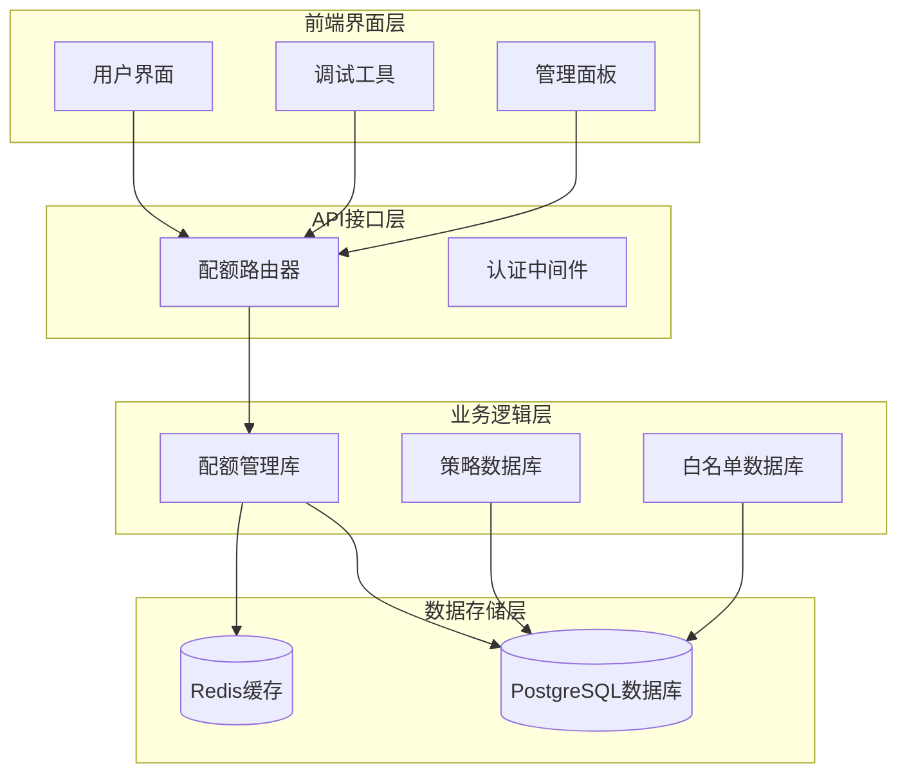
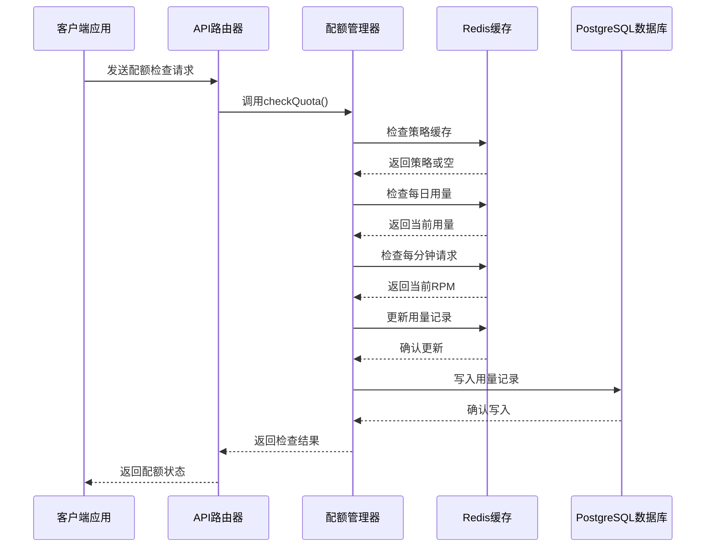
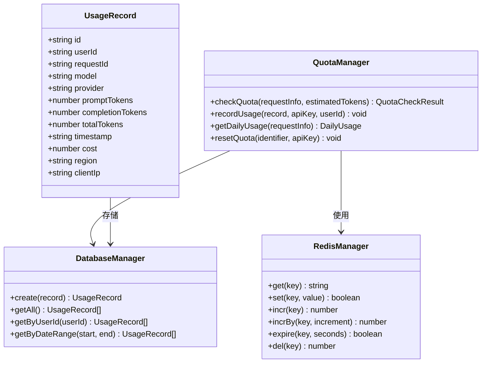
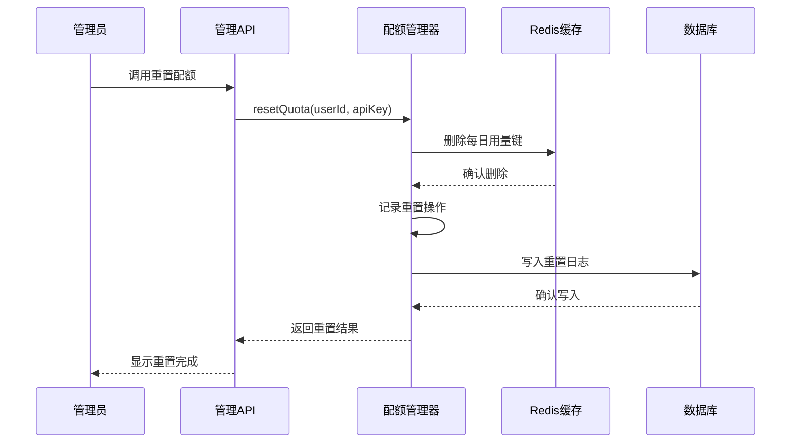
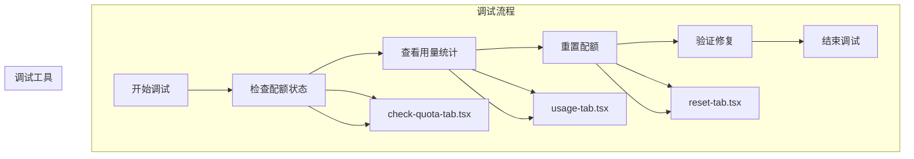

# 智能配额管理系统

<cite>
**本文档引用的文件**
- [src/lib/quota.ts](file://src/lib/quota.ts)
- [src/lib/redis.ts](file://src/lib/redis.ts)
- [src/server/api/routers/quota.ts](file://src/server/api/routers/quota.ts)
- [src/lib/database.ts](file://src/lib/database.ts)
- [src/lib/types.ts](file://src/lib/types.ts)
- [src/lib/logger-middleware.ts](file://src/lib/logger-middleware.ts)
- [src/lib/logger.ts](file://src/lib/logger.ts)
- [src/lib/date.ts](file://src/lib/date.ts)
- [src/app/(dashboard)/quotas/components/policy-form.tsx](file://src/app/(dashboard)/quotas/components/policy-form.tsx)
- [src/app/(dashboard)/quotas/components/policy-table.tsx](file://src/app/(dashboard)/quotas/components/policy-table.tsx)
- [src/app/(dashboard)/debug/components/quota-debug/check-quota-tab.tsx](file://src/app/(dashboard)/debug/components/quota-debug/check-quota-tab.tsx)
- [src/app/(dashboard)/debug/components/quota-debug/usage-tab.tsx](file://src/app/(dashboard)/debug/components/quota-debug/usage-tab.tsx)
- [src/app/(dashboard)/debug/components/quota-debug/reset-tab.tsx](file://src/app/(dashboard)/debug/components/quota-debug/reset-tab.tsx)
</cite>

## 目录
1. [简介](#简介)
2. [项目结构](#项目结构)
3. [核心组件](#核心组件)
4. [架构概览](#架构概览)
5. [详细组件分析](#详细组件分析)
6. [依赖关系分析](#依赖关系分析)
7. [性能考虑](#性能考虑)
8. [故障排除指南](#故障排除指南)
9. [结论](#结论)
10. [附录](#附录)

## 简介

智能配额管理系统是一个基于Redis缓存的高性能配额控制解决方案，支持Token和请求次数双重限制模式。该系统通过白名单规则与配额策略的结合，实现了灵活的用户配额管理功能。

系统的核心特性包括：
- **双重限制模式**：支持Token消耗限制和请求次数限制
- **Redis缓存机制**：采用多级缓存策略提升性能
- **实时监控**：提供配额使用情况的实时查看功能
- **灵活配置**：支持动态调整配额策略和白名单规则
- **安全审计**：完整的配额操作日志记录

## 项目结构

智能配额管理系统采用分层架构设计，主要分为以下层次：



**图表来源**
- [src/server/api/routers/quota.ts](file://src/server/api/routers/quota.ts#L1-L221)
- [src/lib/quota.ts](file://src/lib/quota.ts#L1-L327)

**章节来源**
- [src/server/api/routers/quota.ts](file://src/server/api/routers/quota.ts#L1-L221)
- [src/lib/quota.ts](file://src/lib/quota.ts#L1-L327)

## 核心组件

### 配额策略管理

系统提供了灵活的配额策略配置，支持多种限制模式：

| 配置项 | 类型 | 描述 | 默认值 |
|--------|------|------|--------|
| limitType | enum | 限制类型：token或request | token |
| dailyTokenLimit | number | 每日Token上限 | 5000 |
| monthlyTokenLimit | number | 每月Token上限 | 50000 |
| dailyRequestLimit | number | 每日请求次数上限 | 无（必需） |
| rpmLimit | number | 每分钟请求限制 | 10 |

### Redis缓存策略

系统采用多级缓存机制来优化性能：

```mermaid
graph LR
subgraph "缓存层级"
APIKey[API Key策略缓存<br/>1小时过期]
DailyUsage[每日用量缓存<br/>7天过期]
RPMCache[每分钟请求缓存<br/>2分钟过期]
RequestLog[请求日志缓存<br/>24小时过期]
end
subgraph "Redis键空间"
PolicyKey[policy:apiKey:{id}]
UsageKey[user_quota:{userId}:{date}:{apiKey}]
RpmKey[user_rpm:{userId}:{apiKey}:{minute}]
LogKey[request_log:{userId}:{requestId}]
end
APIKey --> PolicyKey
DailyUsage --> UsageKey
RPMCache --> RpmKey
RequestLog --> LogKey
```

**图表来源**
- [src/lib/redis.ts](file://src/lib/redis.ts#L18-L42)
- [src/lib/quota.ts](file://src/lib/quota.ts#L18-L57)

**章节来源**
- [src/lib/types.ts](file://src/lib/types.ts#L4-L15)
- [src/lib/redis.ts](file://src/lib/redis.ts#L18-L42)

## 架构概览

系统采用事件驱动的异步架构，通过Redis实现高并发的配额控制：



**图表来源**
- [src/server/api/routers/quota.ts](file://src/server/api/routers/quota.ts#L78-L200)
- [src/lib/quota.ts](file://src/lib/quota.ts#L78-L200)

## 详细组件分析

### 配额检查流程

系统实现了严格的配额检查流程，确保资源使用的合规性：


**图表来源**
- [src/lib/quota.ts](file://src/lib/quota.ts#L78-L200)

#### Token限制模式

Token限制模式适用于基于Token消耗的API服务：

- **每日Token限制**：基于Redis字符串键存储当前Token使用量
- **Token累加**：使用INCRBY命令精确累加Token消耗
- **自动过期**：每日用量键在7天后自动清理

#### 请求次数限制模式

请求次数限制模式适用于按请求次数计费的服务：

- **每日请求计数**：独立的计数器跟踪每日请求量
- **请求验证**：确保每个请求都计入相应的计数器
- **内存优化**：相比Token模式占用更少的内存空间

**章节来源**
- [src/lib/quota.ts](file://src/lib/quota.ts#L78-L200)

### 用量记录机制

系统提供了完整的用量记录和统计功能：



**图表来源**
- [src/lib/quota.ts](file://src/lib/quota.ts#L202-L260)
- [src/lib/types.ts](file://src/lib/types.ts#L64-L77)

#### 实时用量统计

系统支持多维度的用量统计：

| 统计维度 | 数据源 | 更新频率 |
|----------|--------|----------|
| 每日Token使用量 | Redis字符串键 | 实时更新 |
| 每日请求次数 | Redis计数器 | 实时更新 |
| 每分钟请求速率 | Redis计数器 | 实时更新 |
| 用户历史用量 | PostgreSQL数据库 | 异步同步 |

**章节来源**
- [src/lib/quota.ts](file://src/lib/quota.ts#L202-L296)

### RPM限制控制

每分钟请求限制(RPM)是系统的重要安全特性：

```mermaid
flowchart LR
subgraph "RPM控制流程"
Request[请求到达] --> GetRPM[获取当前RPM]
GetRPM --> CheckLimit{检查RPM限制}
CheckLimit --> |未超限| IncRPM[增加RPM计数]
CheckLimit --> |已超限| Block[阻止请求]
IncRPM --> SetExpire[设置过期时间]
SetExpire --> Success[请求成功]
Block --> LogBlock[记录阻断]
end
subgraph "Redis配置"
KeyFormat[user_rpm:{userId}:{apiKey}:{minute}]
TTL[120秒]
MaxRequests[每分钟最大请求数]
end
Request --> KeyFormat
KeyFormat --> TTL
KeyFormat --> MaxRequests
```

**图表来源**
- [src/lib/quota.ts](file://src/lib/quota.ts#L138-L156)
- [src/lib/redis.ts](file://src/lib/redis.ts#L27-L29)

**章节来源**
- [src/lib/quota.ts](file://src/lib/quota.ts#L138-L156)

### 配额重置功能

系统提供了灵活的配额重置机制：



**图表来源**
- [src/lib/quota.ts](file://src/lib/quota.ts#L298-L313)
- [src/server/api/routers/quota.ts](file://src/server/api/routers/quota.ts#L66-L87)

**章节来源**
- [src/lib/quota.ts](file://src/lib/quota.ts#L298-L313)

## 依赖关系分析

系统各组件之间的依赖关系如下：

```mermaid
graph TB
subgraph "核心依赖"
QuotaLib[src/lib/quota.ts]
RedisLib[src/lib/redis.ts]
DBLib[src/lib/database.ts]
TypeLib[src/lib/types.ts]
end
subgraph "API层"
QuotaRouter[src/server/api/routers/quota.ts]
end
subgraph "前端组件"
PolicyForm[src/app/(dashboard)/quotas/components/policy-form.tsx]
PolicyTable[src/app/(dashboard)/quotas/components/policy-table.tsx]
DebugTabs[src/app/(dashboard)/debug/components/quota-debug/]
end
subgraph "工具类"
Logger[src/lib/logger.ts]
DateUtil[src/lib/date.ts]
LoggerMW[src/lib/logger-middleware.ts]
end
QuotaRouter --> QuotaLib
QuotaLib --> RedisLib
QuotaLib --> DBLib
QuotaLib --> TypeLib
PolicyForm --> QuotaRouter
PolicyTable --> QuotaRouter
DebugTabs --> QuotaRouter
QuotaLib --> Logger
QuotaLib --> DateUtil
QuotaRouter --> LoggerMW
```

**图表来源**
- [src/server/api/routers/quota.ts](file://src/server/api/routers/quota.ts#L1-L221)
- [src/lib/quota.ts](file://src/lib/quota.ts#L1-L327)

**章节来源**
- [src/server/api/routers/quota.ts](file://src/server/api/routers/quota.ts#L1-L221)
- [src/lib/quota.ts](file://src/lib/quota.ts#L1-L327)

## 性能考虑

### 缓存策略优化

系统采用了多层次的缓存策略来确保最佳性能：

1. **策略缓存**：配额策略缓存1小时，减少数据库查询
2. **用量缓存**：每日用量缓存7天，支持跨日期统计
3. **RPM缓存**：每分钟请求缓存2分钟，确保RPM准确性
4. **日志缓存**：请求日志缓存24小时，便于问题追踪

### Redis键设计优化

```mermaid
graph LR
subgraph "键空间设计"
PolicyKey[policy:apiKey:{apiKeyId}] --> TTL1h[1小时TTL]
UsageKey[user_quota:{userId}:{date}:{apiKey}] --> TTL7d[7天TTL]
RequestKey[user_requests:{userId}:{date}:{apiKey}] --> TTL7d[7天TTL]
RPMKey[user_rpm:{userId}:{apiKey}:{minute}] --> TTL2m[2分钟TTL]
LogKey[request_log:{userId}:{requestId}] --> TTL24h[24小时TTL]
end
subgraph "内存优化"
HashKeys[使用Hash键减少内存占用]
TTLManagement[TTL自动管理]
ScanOptimization[SCAN命令优化]
end
PolicyKey --> HashKeys
UsageKey --> HashKeys
RequestKey --> HashKeys
RPMKey --> HashKeys
LogKey --> HashKeys
```

**图表来源**
- [src/lib/redis.ts](file://src/lib/redis.ts#L18-L42)

### 并发处理优化

系统通过以下机制确保高并发环境下的稳定性：

- **原子操作**：使用Redis原子操作保证计数准确性
- **批量删除**：策略更新时使用SCAN命令批量清理缓存
- **连接池**：Redis客户端自动管理连接池
- **错误隔离**：缓存失败不影响主业务流程

## 故障排除指南

### 常见问题及解决方案

| 问题类型 | 症状 | 可能原因 | 解决方案 |
|----------|------|----------|----------|
| 配额检查失败 | 返回配额检查失败 | Redis连接异常 | 检查REDIS_URL配置，重启Redis服务 |
| 策略缓存失效 | 频繁访问数据库 | 缓存键过期或被清理 | 检查缓存TTL设置，确认缓存键格式 |
| 用量统计不准确 | 日志显示负值 | Redis计数器异常 | 执行缓存重置，检查系统时间同步 |
| RPM限制异常 | 偶尔超过限制 | 分钟边界处理问题 | 检查系统时间，确认RPM键格式 |

### 调试工具使用

系统提供了完善的调试工具来帮助问题诊断：



**图表来源**
- [src/app/(dashboard)/debug/components/quota-debug/check-quota-tab.tsx](file://src/app/(dashboard)/debug/components/quota-debug/check-quota-tab.tsx)
- [src/app/(dashboard)/debug/components/quota-debug/usage-tab.tsx](file://src/app/(dashboard)/debug/components/quota-debug/usage-tab.tsx)
- [src/app/(dashboard)/debug/components/quota-debug/reset-tab.tsx](file://src/app/(dashboard)/debug/components/quota-debug/reset-tab.tsx)

**章节来源**
- [src/app/(dashboard)/debug/components/quota-debug/check-quota-tab.tsx](file://src/app/(dashboard)/debug/components/quota-debug/check-quota-tab.tsx)
- [src/app/(dashboard)/debug/components/quota-debug/usage-tab.tsx](file://src/app/(dashboard)/debug/components/quota-debug/usage-tab.tsx)
- [src/app/(dashboard)/debug/components/quota-debug/reset-tab.tsx](file://src/app/(dashboard)/debug/components/quota-debug/reset-tab.tsx)

## 结论

智能配额管理系统通过精心设计的架构和优化的实现，为现代AI应用提供了可靠的配额控制解决方案。系统的主要优势包括：

1. **高性能**：基于Redis的内存存储确保了极低的延迟
2. **灵活性**：支持多种限制模式和动态配置
3. **可观测性**：完整的日志记录和统计功能
4. **可维护性**：清晰的代码结构和完善的测试覆盖

该系统特别适合需要精细控制API使用量的AI服务平台，能够有效防止资源滥用并确保服务质量。

## 附录

### 配置示例

#### 基础配置
```yaml
# .env配置示例
REDIS_URL=redis://localhost:6379
NODE_ENV=production
```

#### 配额策略配置示例
```json
{
  "name": "标准用户配额",
  "limitType": "token",
  "dailyTokenLimit": 10000,
  "rpmLimit": 60,
  "description": "标准用户的每日Token配额"
}
```

### 使用场景

1. **内容生成服务**：基于Token的计费模式
2. **API调用服务**：基于请求次数的计费模式  
3. **混合计费服务**：同时支持Token和请求次数限制
4. **企业级服务**：需要严格配额控制的商业应用

### 最佳实践

1. **缓存策略**：合理设置TTL值，平衡内存使用和查询性能
2. **监控告警**：建立配额使用率的监控和告警机制
3. **容量规划**：根据业务增长预测合理设置配额上限
4. **故障恢复**：制定缓存失效和数据库异常的恢复预案