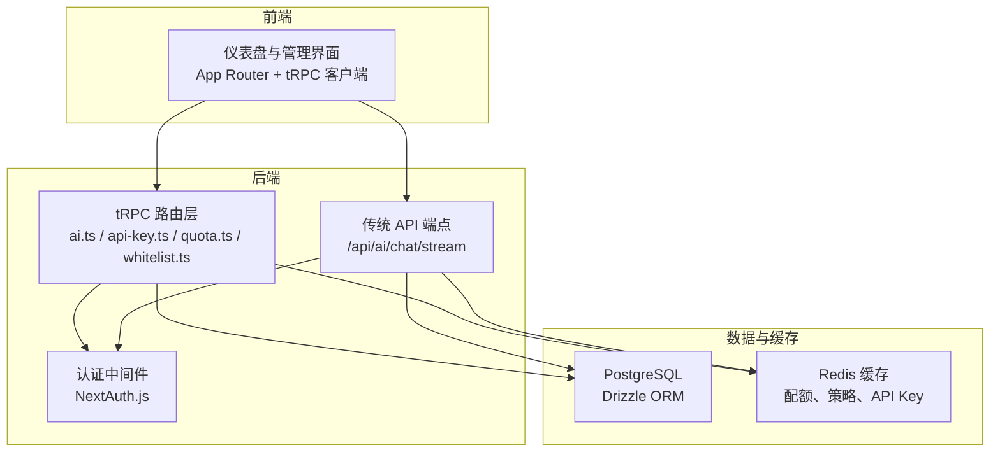
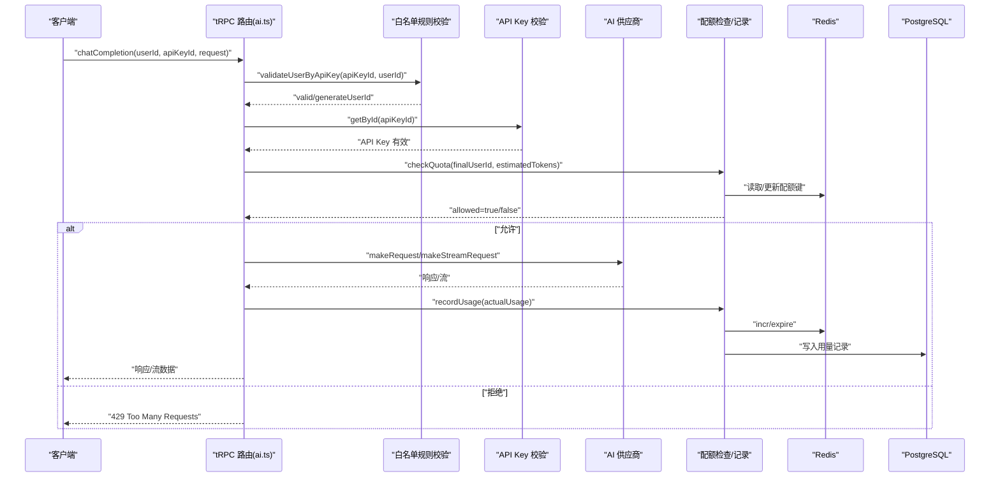
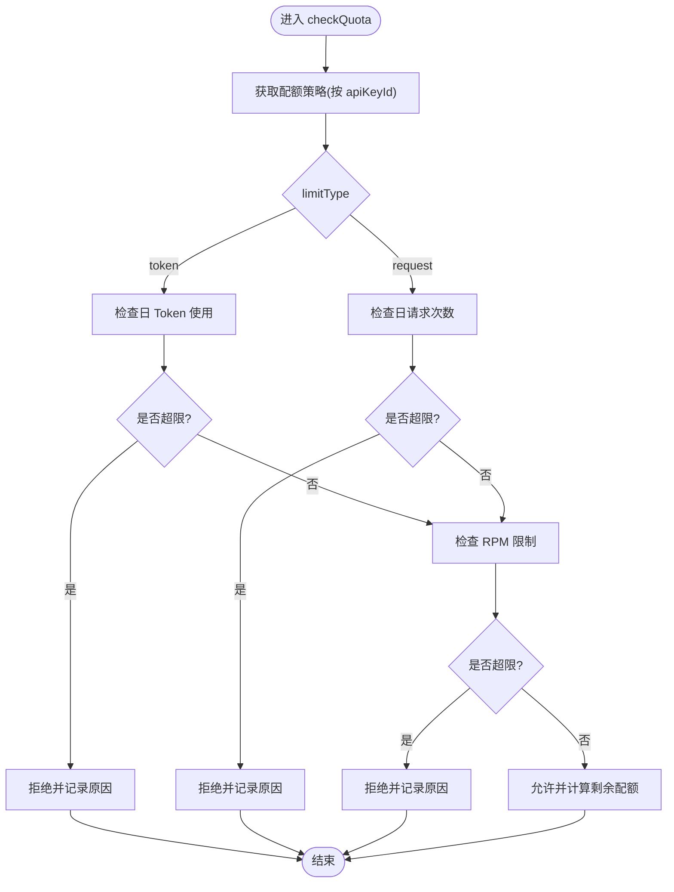
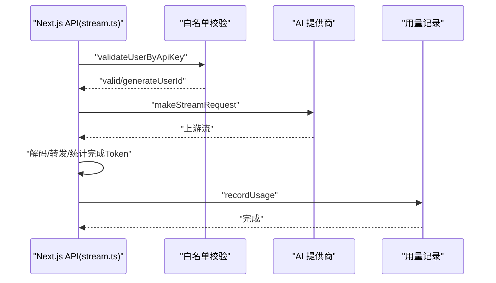
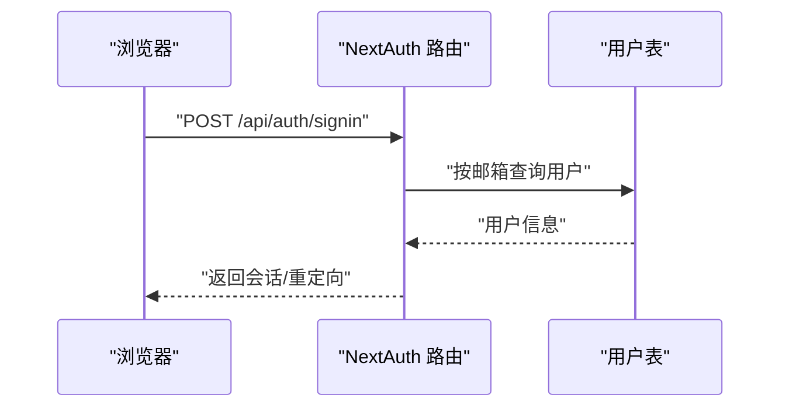
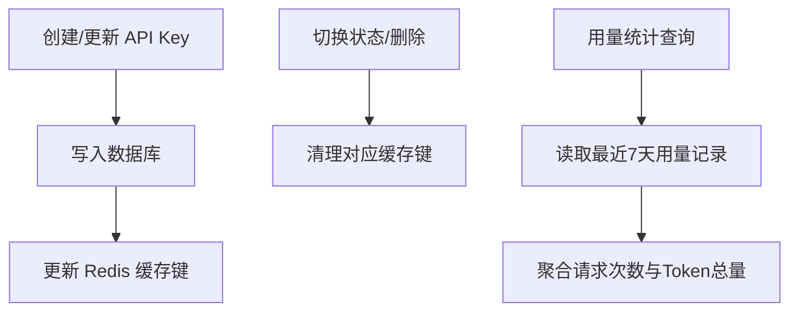
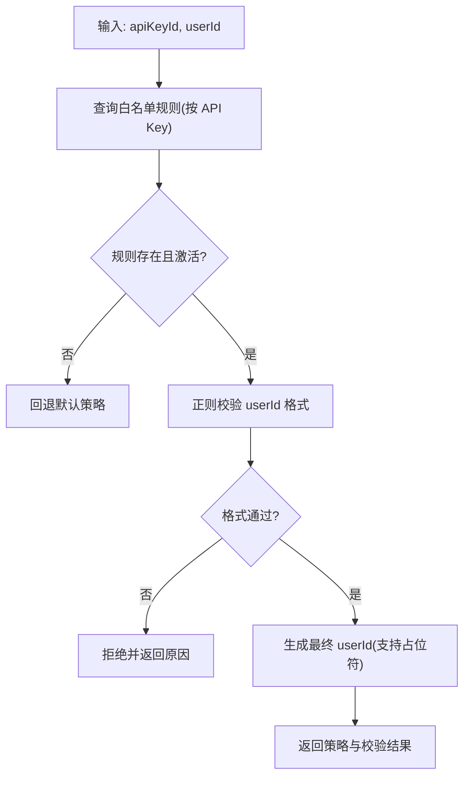
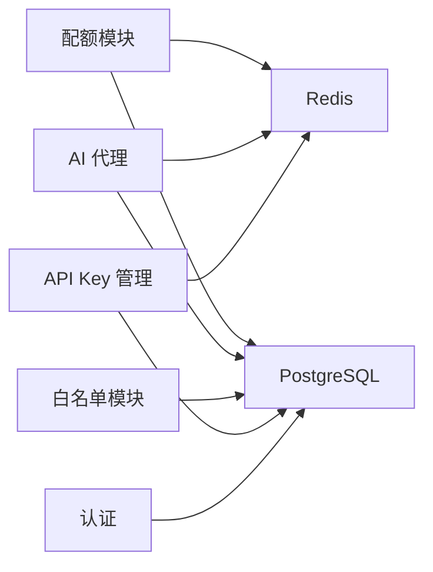

# 核心功能

<cite>
**本文引用的文件**
- [README.md](file://README.md)
- [src/lib/quota.ts](file://src/lib/quota.ts)
- [src/lib/ai-providers.ts](file://src/lib/ai-providers.ts)
- [src/lib/redis.ts](file://src/lib/redis.ts)
- [src/lib/database.ts](file://src/lib/database.ts)
- [src/lib/schema.ts](file://src/lib/schema.ts)
- [src/lib/types.ts](file://src/lib/types.ts)
- [src/pages/api/ai/chat/stream.ts](file://src/pages/api/ai/chat/stream.ts)
- [src/server/api/routers/ai.ts](file://src/server/api/routers/ai.ts)
- [src/server/api/routers/api-key.ts](file://src/server/api/routers/api-key.ts)
- [src/server/api/routers/quota.ts](file://src/server/api/routers/quota.ts)
- [src/server/api/routers/whitelist.ts](file://src/server/api/routers/whitelist.ts)
- [src/auth.ts](file://src/auth.ts)
- [src/app/api/auth/[...nextauth]/route.ts](file://src/app/api/auth/[...nextauth]/route.ts)
</cite>

## 目录
1. [简介](#简介)
2. [项目结构](#项目结构)
3. [核心组件](#核心组件)
4. [架构总览](#架构总览)
5. [详细组件分析](#详细组件分析)
6. [依赖分析](#依赖分析)
7. [性能考虑](#性能考虑)
8. [故障排查指南](#故障排查指南)
9. [结论](#结论)
10. [附录](#附录)

## 简介
本文件面向 AIGate 的使用者与维护者，系统性梳理其核心功能与实现机制，重点覆盖以下方面：
- 智能配额管理：基于 Redis 的实时配额检查与用量记录，支持 Token 与请求次数双维度限制，并具备每分钟速率限制。
- AI 服务代理：统一接入 OpenAI、Anthropic、Google、DeepSeek、Moonshot、Spark 等多家模型厂商，提供同步与流式响应能力。
- 用户认证：基于 NextAuth.js 的凭据认证，支持管理员账户动态配置与会话管理。
- API Key 管理：提供 API Key 的创建、轮换、状态切换与缓存管理，保障高并发下的低延迟访问。
- 白名单控制：通过“白名单规则 + 配额策略”的组合，实现按 API Key 维度的用户校验与策略绑定。

同时，文档解释各功能之间的协作关系与数据流转过程，并提供配置示例与使用指南，帮助快速上手与稳定运维。

## 项目结构
AIGate 采用 Next.js 14 App Router + tRPC 架构，后端通过 tRPC 路由暴露 API，数据层使用 PostgreSQL + Redis，认证采用 NextAuth.js，日志系统基于 Winston + 日志轮转。

图表来源
- [src/server/api/routers/ai.ts](file://src/server/api/routers/ai.ts#L88-L301)
- [src/server/api/routers/api-key.ts](file://src/server/api/routers/api-key.ts#L68-L377)
- [src/server/api/routers/quota.ts](file://src/server/api/routers/quota.ts#L39-L221)
- [src/server/api/routers/whitelist.ts](file://src/server/api/routers/whitelist.ts#L22-L222)
- [src/pages/api/ai/chat/stream.ts](file://src/pages/api/ai/chat/stream.ts#L10-L184)
- [src/lib/database.ts](file://src/lib/database.ts#L1-L692)
- [src/lib/redis.ts](file://src/lib/redis.ts#L1-L43)

章节来源
- [README.md](file://README.md#L1-L83)

## 核心组件
- 智能配额管理：负责策略获取、配额检查、用量记录与剩余配额计算，使用 Redis 实现毫秒级读写。
- AI 服务代理：封装多家模型厂商的请求与流式响应，统一输出 OpenAI 兼容格式；提供 Token 估算。
- 用户认证：基于 NextAuth.js 的凭据认证，限定管理员角色，支持登录页与错误页重定向。
- API Key 管理：提供 CRUD、状态切换与使用统计，同时维护 Redis 缓存以降低数据库压力。
- 白名单控制：按 API Key 绑定白名单规则，支持用户 ID 格式校验与占位符生成，实现灵活的用户标识映射与策略匹配。

章节来源
- [src/lib/quota.ts](file://src/lib/quota.ts#L1-L327)
- [src/lib/ai-providers.ts](file://src/lib/ai-providers.ts#L1-L759)
- [src/auth.ts](file://src/auth.ts#L1-L114)
- [src/server/api/routers/api-key.ts](file://src/server/api/routers/api-key.ts#L68-L377)
- [src/server/api/routers/whitelist.ts](file://src/server/api/routers/whitelist.ts#L22-L222)

## 架构总览
下图展示了从客户端到 tRPC/传统 API、再到 AI 供应商的完整调用链路，以及配额与用量记录的关键节点。

图表来源
- [src/server/api/routers/ai.ts](file://src/server/api/routers/ai.ts#L88-L301)
- [src/lib/database.ts](file://src/lib/database.ts#L332-L545)
- [src/lib/quota.ts](file://src/lib/quota.ts#L78-L200)
- [src/lib/ai-providers.ts](file://src/lib/ai-providers.ts#L12-L759)
- [src/lib/redis.ts](file://src/lib/redis.ts#L18-L43)

## 详细组件分析

### 智能配额管理
- 策略获取
  - 优先通过 API Key ID 获取白名单规则并联动配额策略，支持缓存（1 小时）。
  - 若无匹配规则，回退至默认策略。
- 配额检查
  - 支持两种限制模式：
    - Token 模式：按日累计使用与上限比较，结合每分钟请求限制（RPM）。
    - 请求次数模式：按日请求次数与上限比较，同样受 RPM 限制。
  - 返回允许与否、原因与剩余配额信息。
- 用量记录
  - 根据策略类型分别累加日使用量（Token 或请求次数），并记录每分钟请求次数。
  - 同步写入数据库用量记录，便于统计与审计。
- 剩余配额与重置
  - 提供今日使用情况查询与按用户+API Key 的配额重置能力。

图表来源
- [src/lib/quota.ts](file://src/lib/quota.ts#L78-L200)

章节来源
- [src/lib/quota.ts](file://src/lib/quota.ts#L1-L327)
- [src/lib/redis.ts](file://src/lib/redis.ts#L18-L43)
- [src/lib/database.ts](file://src/lib/database.ts#L332-L545)

### AI 服务代理
- 支持的提供商与模型
  - OpenAI、Anthropic、Google、DeepSeek、Moonshot、Spark，均提供同步与流式响应。
- 统一接口
  - 通过 getProviderByModel 自动选择提供商，估算 Token 消耗，发起请求并转换为 OpenAI 兼容格式。
- 流式处理
  - Next.js 传统 API 端点专门处理流式聊天，将上游 SSE/流转换为标准 SSE 输出，边解码边转发，统计完成阶段的 Token 数量并记录用量。

图表来源
- [src/pages/api/ai/chat/stream.ts](file://src/pages/api/ai/chat/stream.ts#L10-L184)
- [src/lib/ai-providers.ts](file://src/lib/ai-providers.ts#L12-L759)
- [src/lib/quota.ts](file://src/lib/quota.ts#L202-L260)

章节来源
- [src/lib/ai-providers.ts](file://src/lib/ai-providers.ts#L1-L759)
- [src/pages/api/ai/chat/stream.ts](file://src/pages/api/ai/chat/stream.ts#L1-L184)

### 用户认证
- NextAuth.js 凭据认证，限定管理员角色，支持登录页与错误页重定向。
- 会话回调将用户角色与状态注入 JWT 与 Session，便于后续权限控制。

图表来源
- [src/auth.ts](file://src/auth.ts#L1-L114)
- [src/app/api/auth/[...nextauth]/route.ts](file://src/app/api/auth/[...nextauth]/route.ts#L1-L7)

章节来源
- [src/auth.ts](file://src/auth.ts#L1-L114)
- [src/app/api/auth/[...nextauth]/route.ts](file://src/app/api/auth/[...nextauth]/route.ts#L1-L7)

### API Key 管理
- 功能范围
  - 创建、查询、更新、删除、切换状态、获取使用统计。
  - 对外字段掩码显示，内部字段保持完整。
- 缓存策略
  - 按提供商维度缓存活跃 API Key，过期时间 1 小时；状态切换或删除时清理对应缓存键。
- 使用统计
  - 最近 7 天请求次数、Token 总量与按日聚合的使用趋势。

图表来源
- [src/server/api/routers/api-key.ts](file://src/server/api/routers/api-key.ts#L132-L322)
- [src/lib/database.ts](file://src/lib/database.ts#L144-L278)
- [src/lib/redis.ts](file://src/lib/redis.ts#L18-L43)

章节来源
- [src/server/api/routers/api-key.ts](file://src/server/api/routers/api-key.ts#L1-L377)
- [src/lib/database.ts](file://src/lib/database.ts#L1-L692)

### 白名单控制
- 规则约束
  - 每个 API Key 仅能绑定一条白名单规则；规则可启用/禁用，支持优先级排序。
- 用户校验
  - 支持正则校验用户 ID 格式；支持占位符替换（如 @user_id、@api_key、@ip、@any）生成最终用户标识。
- 策略匹配
  - 通过 API Key ID 直接获取绑定的配额策略；若未绑定则回退默认策略。

图表来源
- [src/lib/database.ts](file://src/lib/database.ts#L332-L545)
- [src/server/api/routers/whitelist.ts](file://src/server/api/routers/whitelist.ts#L66-L148)

章节来源
- [src/server/api/routers/whitelist.ts](file://src/server/api/routers/whitelist.ts#L1-L222)
- [src/lib/database.ts](file://src/lib/database.ts#L292-L579)

## 依赖分析
- 组件耦合
  - 配额模块与数据库、Redis 紧密耦合，策略与用量均依赖缓存与持久化。
  - AI 代理模块依赖数据库中的 API Key 与 Redis 缓存，同时通过 tRPC/传统 API 对外提供服务。
  - 白名单模块与配额策略存在一对一绑定关系，通过数据库内连接查询实现。
- 外部依赖
  - Redis：配额、策略、API Key 缓存。
  - PostgreSQL：用户、API Key、用量记录、白名单规则、配额策略等。
  - NextAuth.js：认证与会话。
  - tRPC：类型安全的后端接口层。

图表来源
- [src/lib/quota.ts](file://src/lib/quota.ts#L1-L327)
- [src/lib/ai-providers.ts](file://src/lib/ai-providers.ts#L1-L759)
- [src/lib/database.ts](file://src/lib/database.ts#L1-L692)
- [src/lib/redis.ts](file://src/lib/redis.ts#L1-L43)
- [src/auth.ts](file://src/auth.ts#L1-L114)

章节来源
- [src/lib/schema.ts](file://src/lib/schema.ts#L1-L162)
- [src/lib/types.ts](file://src/lib/types.ts#L1-L118)

## 性能考虑
- Redis 缓存
  - API Key、配额策略、用户策略键均设置合理过期时间，减少数据库压力。
  - 配额检查与用量记录均以原子操作（incr/exp）实现，避免竞争条件。
- 流式响应
  - 传统 API 端点采用流式读取与边解码边转发，降低内存占用与延迟。
- 并发与扫描
  - 策略更新后通过 SCAN + DEL 清理缓存，避免全量失效带来的抖动。

章节来源
- [src/lib/redis.ts](file://src/lib/redis.ts#L1-L43)
- [src/pages/api/ai/chat/stream.ts](file://src/pages/api/ai/chat/stream.ts#L105-L175)
- [src/server/api/routers/quota.ts](file://src/server/api/routers/quota.ts#L15-L37)

## 故障排查指南
- 配额相关
  - 现象：频繁 429。
  - 排查：确认 limitType 与上限配置；检查 Redis 中的当日用量与 RPM 键；核对策略缓存是否被清理。
- 白名单校验
  - 现象：用户校验失败。
  - 排查：确认 API Key 是否绑定有效规则；正则表达式是否正确；占位符替换逻辑是否产生非法值。
- API Key 状态
  - 现象：请求报错“API Key 不存在或已禁用”。
  - 排查：检查数据库状态与 Redis 缓存键是否存在；切换状态后是否及时清理缓存。
- 认证问题
  - 现象：登录失败或会话异常。
  - 排查：核对管理员账户状态与角色；查看 NextAuth 日志；确认 NEXTAUTH_SECRET 配置。

章节来源
- [src/pages/api/ai/chat/stream.ts](file://src/pages/api/ai/chat/stream.ts#L32-L59)
- [src/server/api/routers/ai.ts](file://src/server/api/routers/ai.ts#L108-L154)
- [src/server/api/routers/api-key.ts](file://src/server/api/routers/api-key.ts#L272-L322)
- [src/auth.ts](file://src/auth.ts#L1-L114)

## 结论
AIGate 通过“白名单规则 + 配额策略 + API Key 管理 + AI 代理 + 认证”的组合，实现了灵活可控的 AI 网关能力。其核心优势在于：
- 高性能：Redis 缓存与原子操作保障毫秒级响应。
- 可扩展：多厂商统一接入，策略与规则可按需调整。
- 可运维：完善的日志与统计接口，便于监控与排障。

建议在生产环境中：
- 合理设置配额策略与 RPM，结合业务峰值进行压测优化。
- 定期清理与巡检 Redis 缓存，避免脏数据影响。
- 严格管理 API Key 生命周期，启用最小权限原则与定期轮换。

## 附录

### 配置示例与使用指南
- 管理后台与部署
  - 使用一键脚本进行环境变量交互配置与部署，支持查看状态、日志与更新。
- OpenAI 兼容接口
  - 调用路径：/api/v1/chat/completions，需携带 X-User-ID 与请求体中的 apiKeyId、userId、model、messages 等字段。
- tRPC 接口
  - chatCompletion：支持流式与非流式；流式请使用专用端点。
  - getSupportedModels：查询各提供商支持的模型列表。
  - estimateTokens：估算请求的 Token 消耗。
  - getQuotaInfo：查询配额策略、今日使用与剩余配额。
- API Key 管理
  - 创建/更新时注意提供商与状态映射；删除或切换状态后会自动清理缓存。
- 白名单规则
  - 每个 API Key 仅能绑定一条规则；支持正则校验与占位符生成最终用户标识。

章节来源
- [README.md](file://README.md#L52-L83)
- [src/server/api/routers/ai.ts](file://src/server/api/routers/ai.ts#L88-L301)
- [src/pages/api/ai/chat/stream.ts](file://src/pages/api/ai/chat/stream.ts#L20-L93)
- [src/server/api/routers/api-key.ts](file://src/server/api/routers/api-key.ts#L132-L322)
- [src/server/api/routers/whitelist.ts](file://src/server/api/routers/whitelist.ts#L66-L148)