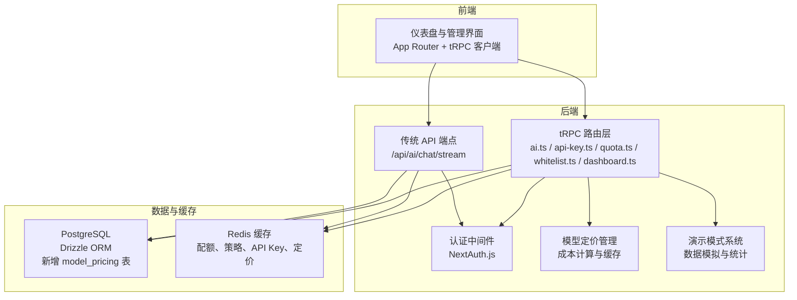
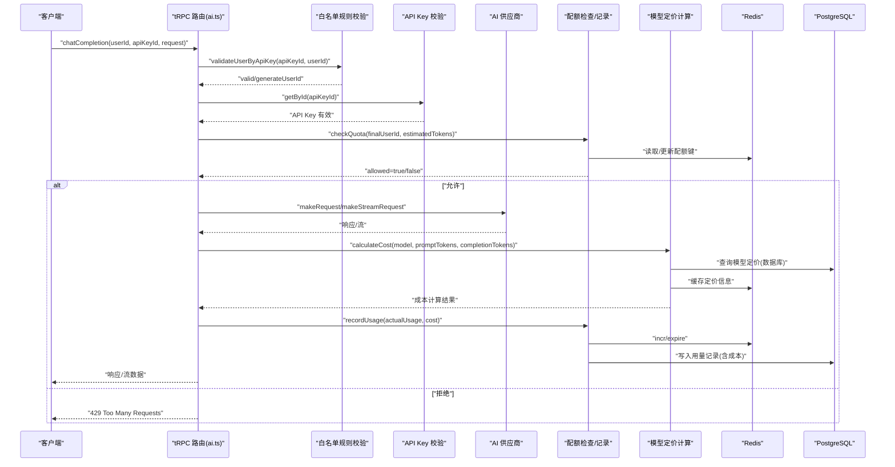
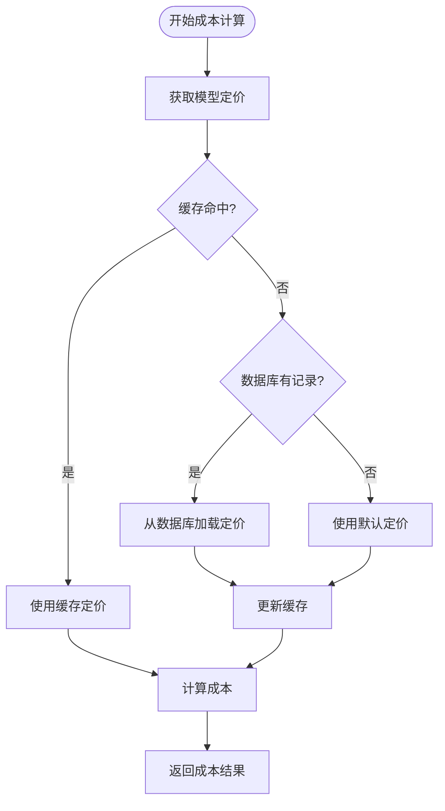
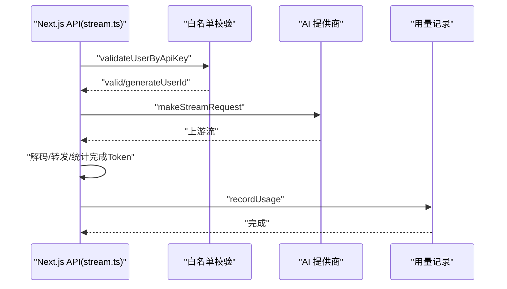
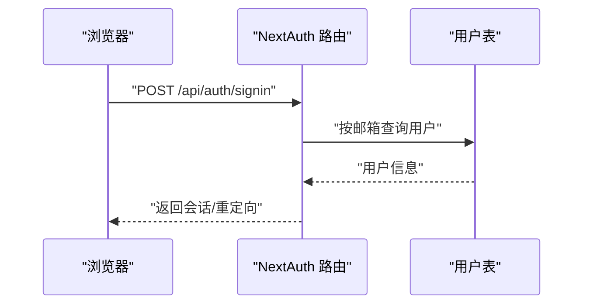
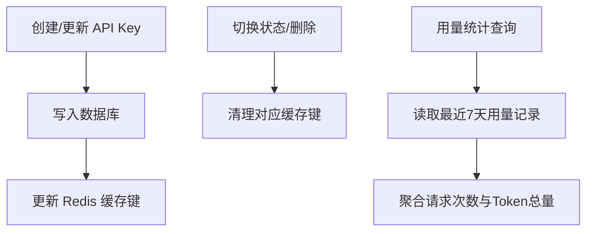
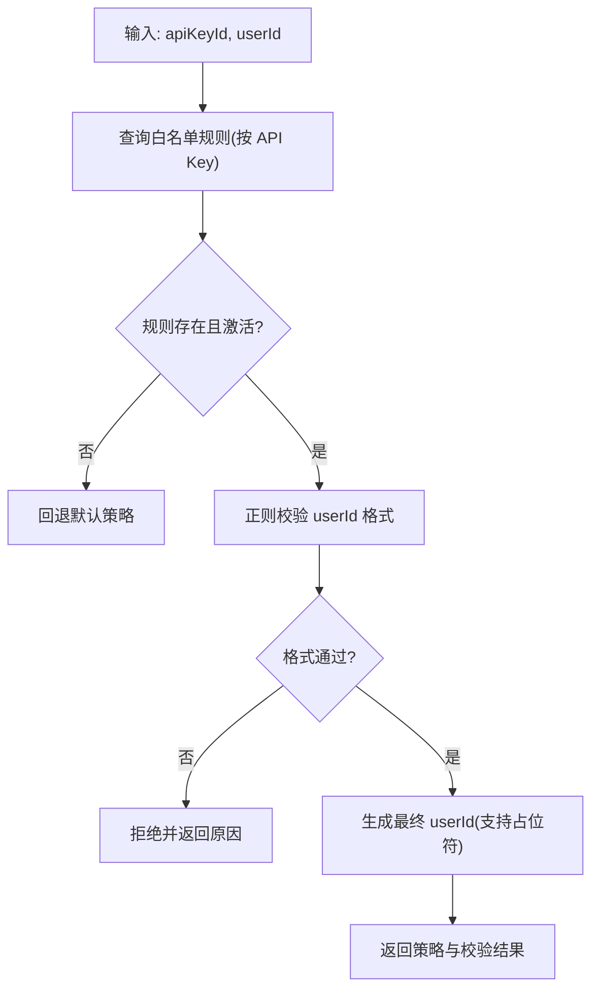
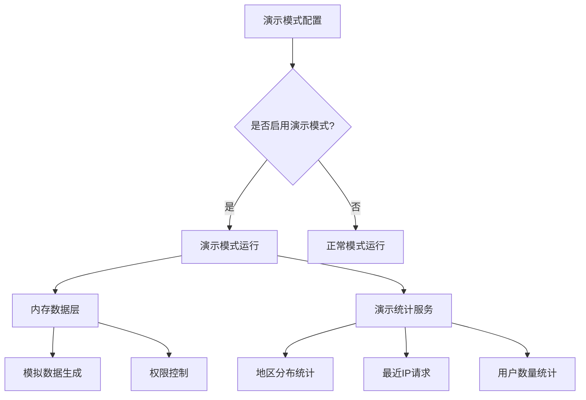
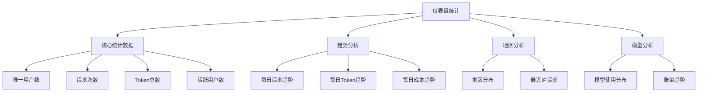
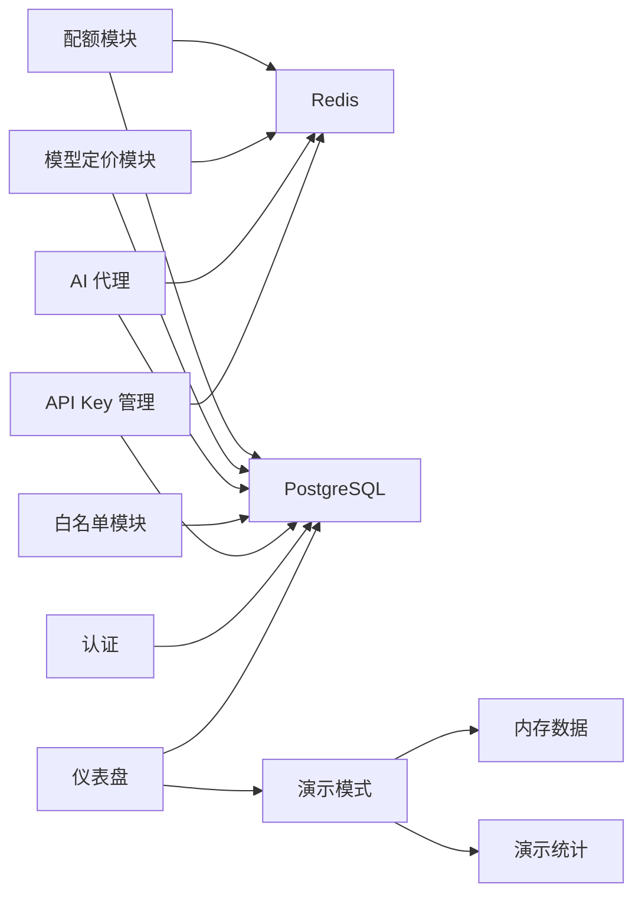

# 核心功能

<cite>
**本文引用的文件**
- [README.md](file://README.md)
- [src/lib/quota.ts](file://src/lib/quota.ts)
- [src/lib/ai-providers.ts](file://src/lib/ai-providers.ts)
- [src/lib/redis.ts](file://src/lib/redis.ts)
- [src/lib/database.ts](file://src/lib/database.ts)
- [src/lib/schema.ts](file://src/lib/schema.ts)
- [src/lib/types.ts](file://src/lib/types.ts)
- [src/lib/model-pricing.ts](file://src/lib/model-pricing.ts)
- [src/lib/demo-config.ts](file://src/lib/demo-config.ts)
- [src/lib/demo-data.ts](file://src/lib/demo-data.ts)
- [src/lib/demo-stats.ts](file://src/lib/demo-stats.ts)
- [src/lib/chat-service.ts](file://src/lib/chat-service.ts)
- [src/pages/api/ai/chat/stream.ts](file://src/pages/api/ai/chat/stream.ts)
- [src/server/api/routers/ai.ts](file://src/server/api/routers/ai.ts)
- [src/server/api/routers/api-key.ts](file://src/server/api/routers/api-key.ts)
- [src/server/api/routers/quota.ts](file://src/server/api/routers/quota.ts)
- [src/server/api/routers/whitelist.ts](file://src/server/api/routers/whitelist.ts)
- [src/server/api/routers/dashboard.ts](file://src/server/api/routers/dashboard.ts)
- [src/auth.ts](file://src/auth.ts)
- [src/app/api/auth/[...nextauth]/route.ts](file://src/app/api/auth/[...nextauth]/route.ts)
</cite>

## 更新摘要
**所做更改**
- 新增模型定价管理系统，支持成本计算和数据库缓存机制
- 改进演示模式系统，支持国际区域分布和更完整的数据统计
- 扩展仪表盘功能，增加账单趋势分析和模型使用分布统计
- 增强用量记录功能，支持成本字段和区域分布统计

## 目录
1. [简介](#简介)
2. [项目结构](#项目结构)
3. [核心组件](#核心组件)
4. [架构总览](#架构总览)
5. [详细组件分析](#详细组件分析)
6. [依赖分析](#依赖分析)
7. [性能考虑](#性能考虑)
8. [故障排查指南](#故障排查指南)
9. [结论](#结论)
10. [附录](#附录)

## 简介
本文件面向 AIGate 的使用者与维护者，系统性梳理其核心功能与实现机制，重点覆盖以下方面：
- 智能配额管理：基于 Redis 的实时配额检查与用量记录，支持 Token 与请求次数双维度限制，并具备每分钟速率限制。
- 模型定价管理：全新的成本计算系统，支持美元/百万 tokens 的定价模式，内置默认定价表和数据库缓存机制。
- AI 服务代理：统一接入 OpenAI、Anthropic、Google、DeepSeek、Moonshot、Spark 等多家模型厂商，提供同步与流式响应能力。
- 用户认证：基于 NextAuth.js 的凭据认证，支持管理员账户动态配置与会话管理。
- API Key 管理：提供 API Key 的创建、轮换、状态切换与缓存管理，保障高并发下的低延迟访问。
- 白名单控制：通过"白名单规则 + 配额策略"的组合，实现按 API Key 维度的用户校验与策略绑定。
- 演示模式系统：改进的演示环境，支持国际区域分布、数据重置和权限控制。
- 仪表盘统计：增强的监控面板，提供用户统计、请求趋势、地区分布、账单分析等功能。

同时，文档解释各功能之间的协作关系与数据流转过程，并提供配置示例与使用指南，帮助快速上手与稳定运维。

## 项目结构
AIGate 采用 Next.js 14 App Router + tRPC 架构，后端通过 tRPC 路由暴露 API，数据层使用 PostgreSQL + Redis，认证采用 NextAuth.js，日志系统基于 Winston + 日志轮转。

**图表来源**
- [src/server/api/routers/ai.ts:88-301](file://src/server/api/routers/ai.ts#L88-L301)
- [src/server/api/routers/api-key.ts:68-377](file://src/server/api/routers/api-key.ts#L68-L377)
- [src/server/api/routers/quota.ts:39-221](file://src/server/api/routers/quota.ts#L39-L221)
- [src/server/api/routers/whitelist.ts:22-222](file://src/server/api/routers/whitelist.ts#L22-L222)
- [src/server/api/routers/dashboard.ts:1-606](file://src/server/api/routers/dashboard.ts#L1-L606)
- [src/lib/model-pricing.ts:1-201](file://src/lib/model-pricing.ts#L1-L201)
- [src/lib/demo-config.ts:1-57](file://src/lib/demo-config.ts#L1-L57)
- [src/pages/api/ai/chat/stream.ts:10-184](file://src/pages/api/ai/chat/stream.ts#L10-L184)
- [src/lib/database.ts:1-692](file://src/lib/database.ts#L1-L692)
- [src/lib/redis.ts:1-43](file://src/lib/redis.ts#L1-L43)

**章节来源**
- [README.md:1-83](file://README.md#L1-L83)

## 核心组件
- 智能配额管理：负责策略获取、配额检查、用量记录与剩余配额计算，使用 Redis 实现毫秒级读写。
- 模型定价管理：全新的成本计算系统，支持美元/百万 tokens 的定价模式，内置默认定价表和数据库缓存机制。
- AI 服务代理：封装多家模型厂商的请求与流式响应，统一输出 OpenAI 兼容格式；提供 Token 估算。
- 用户认证：基于 NextAuth.js 的凭据认证，限定管理员角色，支持登录页与错误页重定向。
- API Key 管理：提供 CRUD、状态切换与使用统计，同时维护 Redis 缓存以降低数据库压力。
- 白名单控制：按 API Key 绑定白名单规则，支持用户 ID 格式校验与占位符生成，实现灵活的用户标识映射与策略匹配。
- 演示模式系统：改进的演示环境，支持国际区域分布、数据重置和权限控制。
- 仪表盘统计：增强的监控面板，提供用户统计、请求趋势、地区分布、账单分析等功能。

**章节来源**
- [src/lib/quota.ts:1-327](file://src/lib/quota.ts#L1-L327)
- [src/lib/model-pricing.ts:1-201](file://src/lib/model-pricing.ts#L1-L201)
- [src/lib/ai-providers.ts:1-759](file://src/lib/ai-providers.ts#L1-L759)
- [src/auth.ts:1-114](file://src/auth.ts#L1-L114)
- [src/server/api/routers/api-key.ts:68-377](file://src/server/api/routers/api-key.ts#L68-L377)
- [src/server/api/routers/whitelist.ts:22-222](file://src/server/api/routers/whitelist.ts#L22-L222)
- [src/lib/demo-config.ts:1-57](file://src/lib/demo-config.ts#L1-L57)
- [src/lib/demo-data.ts:1-457](file://src/lib/demo-data.ts#L1-L457)
- [src/lib/demo-stats.ts:1-117](file://src/lib/demo-stats.ts#L1-L117)

## 架构总览
下图展示了从客户端到 tRPC/传统 API、再到 AI 供应商的完整调用链路，以及配额与用量记录的关键节点。

**图表来源**
- [src/server/api/routers/ai.ts:88-301](file://src/server/api/routers/ai.ts#L88-L301)
- [src/lib/database.ts:332-545](file://src/lib/database.ts#L332-L545)
- [src/lib/quota.ts:78-200](file://src/lib/quota.ts#L78-L200)
- [src/lib/ai-providers.ts:12-759](file://src/lib/ai-providers.ts#L12-L759)
- [src/lib/redis.ts:18-43](file://src/lib/redis.ts#L18-L43)
- [src/lib/model-pricing.ts:55-97](file://src/lib/model-pricing.ts#L55-L97)

## 详细组件分析

### 模型定价管理系统

**更新** 新增完整的模型定价管理功能，支持成本计算和数据库缓存机制

- 默认定价表
  - 内置 20+ 模型的美元/百万 tokens 定价，涵盖 OpenAI、Anthropic、DeepSeek、Google、Moonshot、Spark 等主流厂商。
  - 支持模糊匹配算法，自动处理版本号、日期后缀等模型名称差异。
- 成本计算
  - 基于公式：成本 = (promptTokens / 1,000,000 × promptPrice) + (completionTokens / 1,000,000 × completionPrice)
  - 支持实时计算和批量统计，用于账单分析和成本控制。
- 数据库缓存机制
  - 内存 Map 缓存常用模型定价，避免重复数据库查询。
  - 支持手动清空缓存和自动更新，确保数据一致性。
- API Key 定价覆盖
  - API Key 表新增 promptPrice 和 completionPrice 字段，支持按 API Key 覆盖默认定价。
  - 用量记录中新增 cost 字段，精确记录每次调用的成本。

**图表来源**
- [src/lib/model-pricing.ts:55-97](file://src/lib/model-pricing.ts#L55-L97)
- [src/lib/model-pricing.ts:113-146](file://src/lib/model-pricing.ts#L113-L146)
- [src/lib/model-pricing.ts:151-193](file://src/lib/model-pricing.ts#L151-L193)

**章节来源**
- [src/lib/model-pricing.ts:1-201](file://src/lib/model-pricing.ts#L1-L201)
- [src/lib/schema.ts:57-70](file://src/lib/schema.ts#L57-L70)
- [src/lib/chat-service.ts:1-200](file://src/lib/chat-service.ts#L1-L200)

### 智能配额管理
- 策略获取
  - 优先通过 API Key ID 获取白名单规则并联动配额策略，支持缓存（1 小时）。
  - 若无匹配规则，回退至默认策略。
- 配额检查
  - 支持两种限制模式：
    - Token 模式：按日累计使用与上限比较，结合每分钟请求限制（RPM）。
    - 请求次数模式：按日请求次数与上限比较，同样受 RPM 限制。
  - 返回允许与否、原因与剩余配额信息。
- 用量记录
  - 根据策略类型分别累加日使用量（Token 或请求次数），并记录每分钟请求次数。
  - 同步写入数据库用量记录，便于统计与审计。
- 剩余配额与重置
  - 提供今日使用情况查询与按用户+API Key 的配额重置能力。

**图表来源**
- [src/lib/quota.ts:78-200](file://src/lib/quota.ts#L78-L200)

**章节来源**
- [src/lib/quota.ts:1-327](file://src/lib/quota.ts#L1-L327)
- [src/lib/redis.ts:18-43](file://src/lib/redis.ts#L18-L43)
- [src/lib/database.ts:332-545](file://src/lib/database.ts#L332-L545)

### AI 服务代理
- 支持的提供商与模型
  - OpenAI、Anthropic、Google、DeepSeek、Moonshot、Spark，均提供同步与流式响应。
- 统一接口
  - 通过 getProviderByModel 自动选择提供商，估算 Token 消耗，发起请求并转换为 OpenAI 兼容格式。
- 流式处理
  - Next.js 传统 API 端点专门处理流式聊天，将上游 SSE/流转换为标准 SSE 输出，边解码边转发，统计完成阶段的 Token 数量并记录用量。

**图表来源**
- [src/pages/api/ai/chat/stream.ts:10-184](file://src/pages/api/ai/chat/stream.ts#L10-L184)
- [src/lib/ai-providers.ts:12-759](file://src/lib/ai-providers.ts#L12-L759)
- [src/lib/quota.ts:202-260](file://src/lib/quota.ts#L202-L260)

**章节来源**
- [src/lib/ai-providers.ts:1-759](file://src/lib/ai-providers.ts#L1-L759)
- [src/pages/api/ai/chat/stream.ts:1-184](file://src/pages/api/ai/chat/stream.ts#L1-L184)

### 用户认证
- NextAuth.js 凭据认证，限定管理员角色，支持登录页与错误页重定向。
- 会话回调将用户角色与状态注入 JWT 与 Session，便于后续权限控制。

**图表来源**
- [src/auth.ts:1-114](file://src/auth.ts#L1-L114)
- [src/app/api/auth/[...nextauth]/route.ts](file://src/app/api/auth/[...nextauth]/route.ts#L1-L7)

**章节来源**
- [src/auth.ts:1-114](file://src/auth.ts#L1-L114)
- [src/app/api/auth/[...nextauth]/route.ts](file://src/app/api/auth/[...nextauth]/route.ts#L1-L7)

### API Key 管理
- 功能范围
  - 创建、查询、更新、删除、切换状态、获取使用统计。
  - 对外字段掩码显示，内部字段保持完整。
- 缓存策略
  - 按提供商维度缓存活跃 API Key，过期时间 1 小时；状态切换或删除时清理对应缓存键。
- 使用统计
  - 最近 7 天请求次数、Token 总量与按日聚合的使用趋势。

**图表来源**
- [src/server/api/routers/api-key.ts:132-322](file://src/server/api/routers/api-key.ts#L132-L322)
- [src/lib/database.ts:144-278](file://src/lib/database.ts#L144-L278)
- [src/lib/redis.ts:18-43](file://src/lib/redis.ts#L18-L43)

**章节来源**
- [src/server/api/routers/api-key.ts:1-377](file://src/server/api/routers/api-key.ts#L1-L377)
- [src/lib/database.ts:1-692](file://src/lib/database.ts#L1-L692)

### 白名单控制
- 规则约束
  - 每个 API Key 仅能绑定一条白名单规则；规则可启用/禁用，支持优先级排序。
- 用户校验
  - 支持正则校验用户 ID 格式；支持占位符替换（如 @user_id、@api_key、@ip、@any）生成最终用户标识。
- 策略匹配
  - 通过 API Key ID 直接获取绑定的配额策略；若未绑定则回退默认策略。

**图表来源**
- [src/lib/database.ts:332-545](file://src/lib/database.ts#L332-L545)
- [src/server/api/routers/whitelist.ts:66-148](file://src/server/api/routers/whitelist.ts#L66-L148)

**章节来源**
- [src/server/api/routers/whitelist.ts:1-222](file://src/server/api/routers/whitelist.ts#L1-L222)
- [src/lib/database.ts:292-579](file://src/lib/database.ts#L292-L579)

### 演示模式系统

**更新** 改进的演示模式系统，支持国际区域分布和更完整的数据统计

- 配置管理
  - 支持通过环境变量控制演示模式开关和权限限制。
  - 提供默认用户、演示凭据和数据重置间隔配置。
- 数据模拟
  - 内存存储的完整数据层，支持 API Key、配额策略、使用记录、白名单规则和用户管理。
  - 自动生成包含中国省份和国际地区混合的模拟数据。
- 权限控制
  - 默认只读模式，支持通过配置允许修改操作。
  - 提供统一的权限检查函数，拦截演示模式下的写操作。
- 统计服务
  - 提供地区分布、IP 请求、用户统计等演示数据统计功能。
  - 支持时间范围查询和数据聚合。

**图表来源**
- [src/lib/demo-config.ts:7-51](file://src/lib/demo-config.ts#L7-L51)
- [src/lib/demo-data.ts:19-243](file://src/lib/demo-data.ts#L19-L243)
- [src/lib/demo-stats.ts:19-116](file://src/lib/demo-stats.ts#L19-L116)

**章节来源**
- [src/lib/demo-config.ts:1-57](file://src/lib/demo-config.ts#L1-L57)
- [src/lib/demo-data.ts:1-457](file://src/lib/demo-data.ts#L1-L457)
- [src/lib/demo-stats.ts:1-117](file://src/lib/demo-stats.ts#L1-L117)

### 仪表盘统计

**更新** 增强的仪表盘功能，增加账单趋势分析和模型使用分布统计

- 统计数据
  - 用户数量、请求次数、Token 消耗、活跃用户数等核心指标。
  - 支持时间范围对比和增长率计算。
- 使用趋势
  - 按日统计请求次数、Token 消耗和成本趋势。
  - 支持自定义时间范围和数据聚合。
- 地区分布
  - 支持中国省份和国际地区混合的区域分布统计。
  - 提供请求次数和 Token 消耗的地区分析。
- 账单分析
  - 基于成本字段的账单趋势分析。
  - 支持按日期统计每日成本和 Token 消耗。
- 模型分布
  - 按模型统计 Token 消耗和请求次数。
  - 支持模型使用效率分析。

**图表来源**
- [src/server/api/routers/dashboard.ts:13-220](file://src/server/api/routers/dashboard.ts#L13-L220)
- [src/server/api/routers/dashboard.ts:270-404](file://src/server/api/routers/dashboard.ts#L270-L404)
- [src/server/api/routers/dashboard.ts:544-605](file://src/server/api/routers/dashboard.ts#L544-L605)

**章节来源**
- [src/server/api/routers/dashboard.ts:1-606](file://src/server/api/routers/dashboard.ts#L1-L606)

## 依赖分析
- 组件耦合
  - 配额模块与数据库、Redis 紧密耦合，策略与用量均依赖缓存与持久化。
  - 模型定价模块与数据库、Redis 紧密耦合，支持成本计算和缓存机制。
  - AI 代理模块依赖数据库中的 API Key 与 Redis 缓存，同时通过 tRPC/传统 API 对外提供服务。
  - 白名单模块与配额策略存在一对一绑定关系，通过数据库内连接查询实现。
  - 演示模式系统独立运行，与生产模式通过配置切换。
- 外部依赖
  - Redis：配额、策略、API Key、定价缓存。
  - PostgreSQL：用户、API Key、用量记录、白名单规则、配额策略、模型定价等。
  - NextAuth.js：认证与会话。
  - tRPC：类型安全的后端接口层。

**图表来源**
- [src/lib/quota.ts:1-327](file://src/lib/quota.ts#L1-L327)
- [src/lib/model-pricing.ts:1-201](file://src/lib/model-pricing.ts#L1-L201)
- [src/lib/ai-providers.ts:1-759](file://src/lib/ai-providers.ts#L1-L759)
- [src/lib/database.ts:1-692](file://src/lib/database.ts#L1-L692)
- [src/lib/redis.ts:1-43](file://src/lib/redis.ts#L1-L43)
- [src/auth.ts:1-114](file://src/auth.ts#L1-L114)
- [src/lib/demo-config.ts:1-57](file://src/lib/demo-config.ts#L1-L57)
- [src/lib/demo-data.ts:1-457](file://src/lib/demo-data.ts#L1-L457)
- [src/lib/demo-stats.ts:1-117](file://src/lib/demo-stats.ts#L1-L117)

**章节来源**
- [src/lib/schema.ts:1-182](file://src/lib/schema.ts#L1-L182)
- [src/lib/types.ts:1-118](file://src/lib/types.ts#L1-L118)

## 性能考虑
- Redis 缓存
  - API Key、配额策略、用户策略键均设置合理过期时间，减少数据库压力。
  - 模型定价采用内存 Map 缓存，避免重复数据库查询。
  - 配额检查与用量记录均以原子操作（incr/exp）实现，避免竞争条件。
- 流式响应
  - 传统 API 端点采用流式读取与边解码边转发，降低内存占用与延迟。
- 并发与扫描
  - 策略更新后通过 SCAN + DEL 清理缓存，避免全量失效带来的抖动。
  - 演示模式使用内存数据，避免数据库压力。

**章节来源**
- [src/lib/redis.ts:1-43](file://src/lib/redis.ts#L1-L43)
- [src/pages/api/ai/chat/stream.ts:105-175](file://src/pages/api/ai/chat/stream.ts#L105-L175)
- [src/server/api/routers/quota.ts:15-37](file://src/server/api/routers/quota.ts#L15-L37)
- [src/lib/model-pricing.ts:46-47](file://src/lib/model-pricing.ts#L46-L47)

## 故障排查指南
- 配额相关
  - 现象：频繁 429。
  - 排查：确认 limitType 与上限配置；检查 Redis 中的当日用量与 RPM 键；核对策略缓存是否被清理。
- 模型定价相关
  - 现象：成本计算异常或定价不准确。
  - 排查：确认模型名称标准化是否正确；检查数据库中是否有自定义定价；验证缓存是否更新。
- 白名单校验
  - 现象：用户校验失败。
  - 排查：确认 API Key 是否绑定有效规则；正则表达式是否正确；占位符替换逻辑是否产生非法值。
- API Key 状态
  - 现象：请求报错"API Key 不存在或已禁用"。
  - 排查：检查数据库状态与 Redis 缓存键是否存在；切换状态后是否及时清理缓存。
- 演示模式相关
  - 现象：演示模式功能异常。
  - 排查：确认演示模式配置开关；检查内存数据是否正确初始化；验证权限控制是否生效。
- 认证问题
  - 现象：登录失败或会话异常。
  - 排查：核对管理员账户状态与角色；查看 NextAuth 日志；确认 NEXTAUTH_SECRET 配置。

**章节来源**
- [src/pages/api/ai/chat/stream.ts:32-59](file://src/pages/api/ai/chat/stream.ts#L32-L59)
- [src/server/api/routers/ai.ts:108-154](file://src/server/api/routers/ai.ts#L108-L154)
- [src/server/api/routers/api-key.ts:272-322](file://src/server/api/routers/api-key.ts#L272-L322)
- [src/auth.ts:1-114](file://src/auth.ts#L1-L114)
- [src/lib/model-pricing.ts:139-145](file://src/lib/model-pricing.ts#L139-L145)
- [src/lib/demo-config.ts:38-51](file://src/lib/demo-config.ts#L38-L51)

## 结论
AIGate 通过"白名单规则 + 配额策略 + API Key 管理 + AI 代理 + 认证 + 模型定价 + 演示模式 + 仪表盘统计"的组合，实现了全面的 AI 网关能力。其核心优势在于：
- 高性能：Redis 缓存与原子操作保障毫秒级响应，模型定价缓存提升成本计算效率。
- 可扩展：多厂商统一接入，策略与规则可按需调整，演示模式支持国际化。
- 可运维：完善的日志与统计接口，便于监控与排障，支持成本分析和区域分布统计。
- 成本控制：内置成本计算系统，支持精确的成本核算和预算控制。

建议在生产环境中：
- 合理设置配额策略与 RPM，结合业务峰值进行压测优化。
- 定期清理与巡检 Redis 缓存，避免脏数据影响。
- 严格管理 API Key 生命周期，启用最小权限原则与定期轮换。
- 利用模型定价系统进行成本监控，建立预算预警机制。
- 在演示环境中充分测试新功能，确保生产环境稳定性。

## 附录

### 配置示例与使用指南
- 管理后台与部署
  - 使用一键脚本进行环境变量交互配置与部署，支持查看状态、日志与更新。
- OpenAI 兼容接口
  - 调用路径：/api/v1/chat/completions，需携带 X-User-ID 与请求体中的 apiKeyId、userId、model、messages 等字段。
- tRPC 接口
  - chatCompletion：支持流式与非流式；流式请使用专用端点。
  - getSupportedModels：查询各提供商支持的模型列表。
  - estimateTokens：估算请求的 Token 消耗。
  - getQuotaInfo：查询配额策略、今日使用与剩余配额。
  - getBillingTrend：获取账单趋势数据。
- API Key 管理
  - 创建/更新时注意提供商与状态映射；删除或切换状态后会自动清理缓存。
- 白名单规则
  - 每个 API Key 仅能绑定一条规则；支持正则校验与占位符生成最终用户标识。
- 模型定价管理
  - 支持通过 setModelPricing 设置自定义定价，支持模糊匹配和缓存更新。
  - 使用 calculateCost 进行成本计算，支持美元/百万 tokens 的定价模式。
- 演示模式配置
  - 通过环境变量控制演示模式开关和权限限制。
  - 支持数据重置间隔配置，便于测试和演示。
- 仪表盘统计
  - 支持用户统计、请求趋势、地区分布、账单分析等多维度监控。
  - 提供图表化展示，支持时间范围筛选和数据导出。

**章节来源**
- [README.md:52-83](file://README.md#L52-L83)
- [src/server/api/routers/ai.ts:88-301](file://src/server/api/routers/ai.ts#L88-L301)
- [src/pages/api/ai/chat/stream.ts:20-93](file://src/pages/api/ai/chat/stream.ts#L20-L93)
- [src/server/api/routers/api-key.ts:132-322](file://src/server/api/routers/api-key.ts#L132-L322)
- [src/server/api/routers/whitelist.ts:66-148](file://src/server/api/routers/whitelist.ts#L66-L148)
- [src/lib/model-pricing.ts:55-97](file://src/lib/model-pricing.ts#L55-L97)
- [src/lib/demo-config.ts:6-36](file://src/lib/demo-config.ts#L6-L36)
- [src/server/api/routers/dashboard.ts:1-606](file://src/server/api/routers/dashboard.ts#L1-L606)