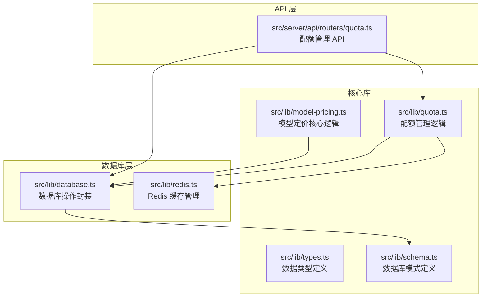
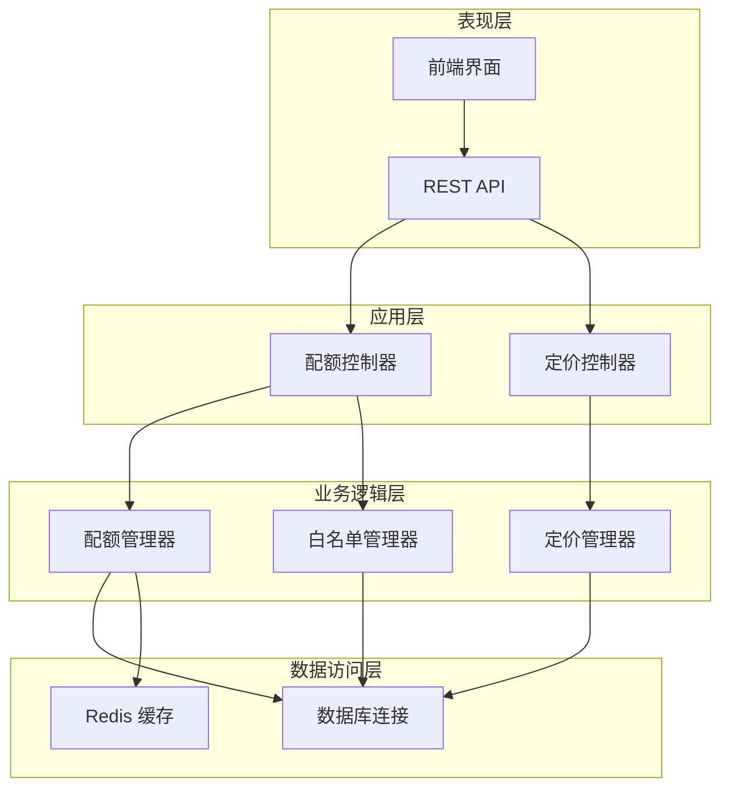
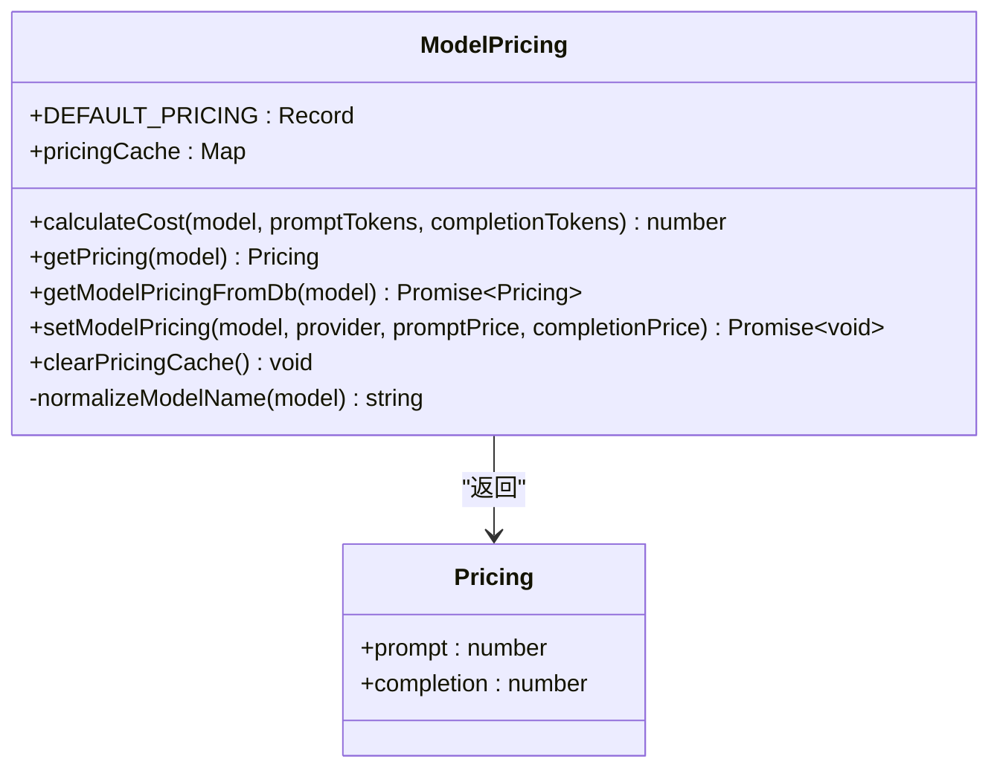
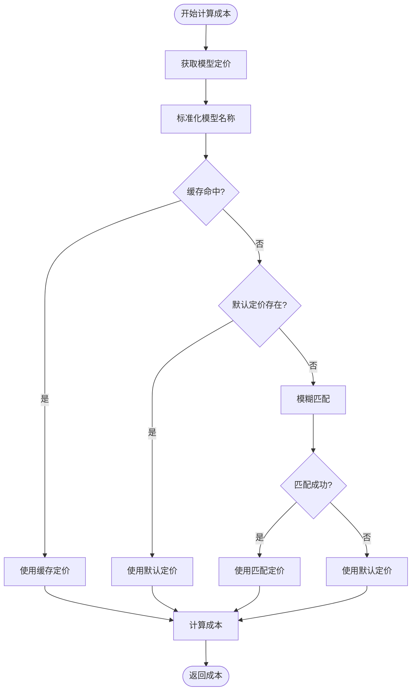
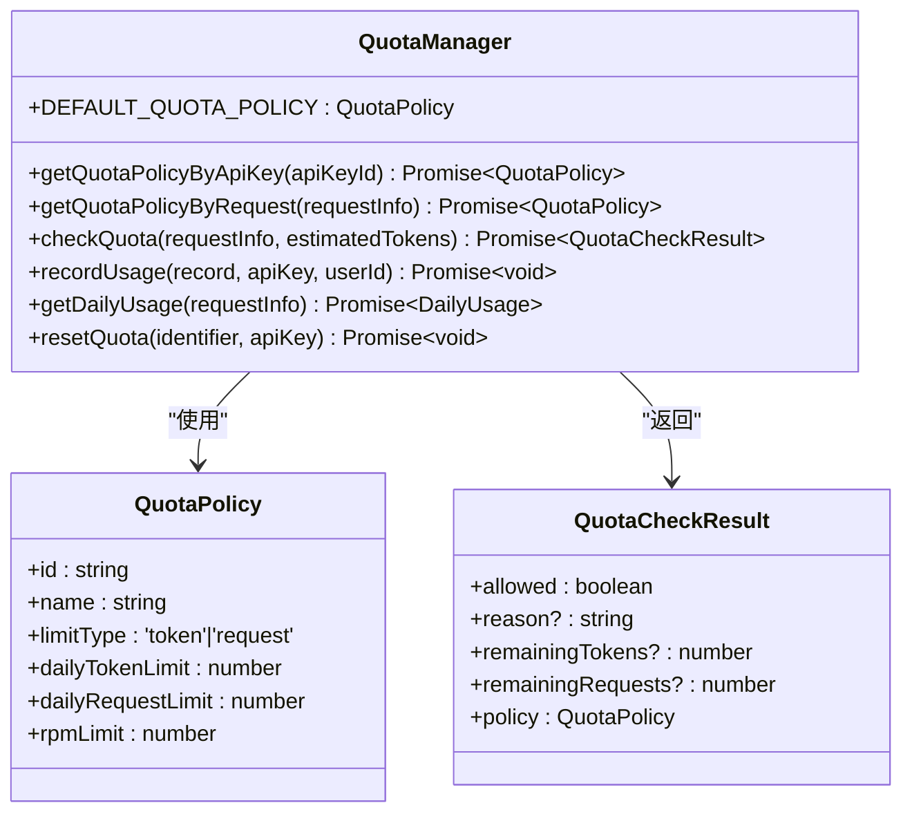
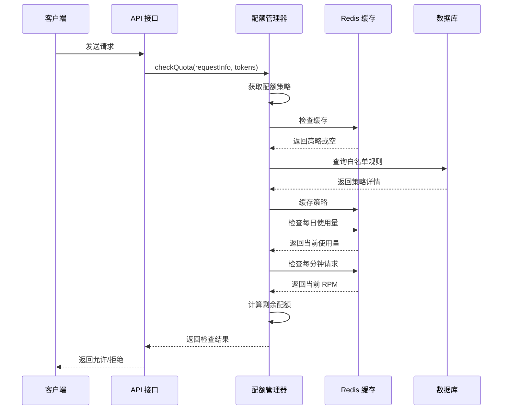
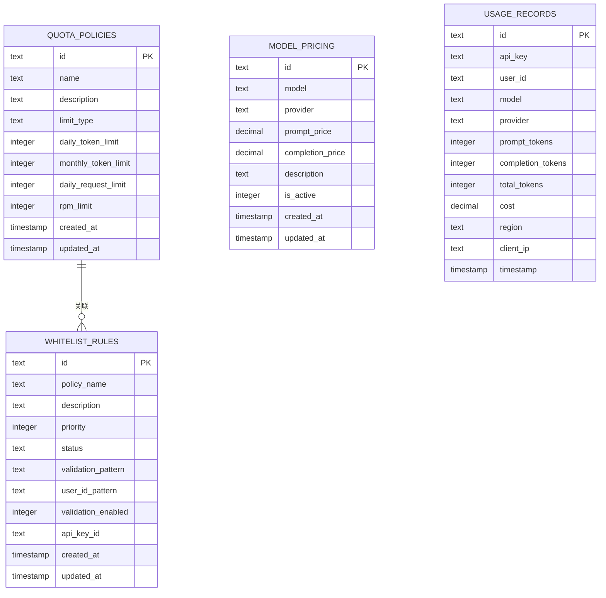
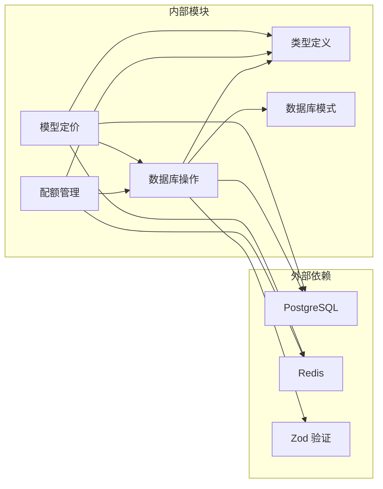

# 模型定价系统

<cite>
**本文档引用的文件**
- [src/lib/model-pricing.ts](file://src/lib/model-pricing.ts)
- [src/lib/quota.ts](file://src/lib/quota.ts)
- [src/server/api/routers/quota.ts](file://src/server/api/routers/quota.ts)
- [src/lib/types.ts](file://src/lib/types.ts)
- [src/lib/schema.ts](file://src/lib/schema.ts)
- [src/lib/database.ts](file://src/lib/database.ts)
- [src/lib/redis.ts](file://src/lib/redis.ts)
</cite>

## 目录
1. [简介](#简介)
2. [项目结构](#项目结构)
3. [核心组件](#核心组件)
4. [架构概览](#架构概览)
5. [详细组件分析](#详细组件分析)
6. [依赖关系分析](#依赖关系分析)
7. [性能考虑](#性能考虑)
8. [故障排除指南](#故障排除指南)
9. [结论](#结论)

## 简介

模型定价系统是 AIGate 项目中的一个核心功能模块，负责管理 AI 模型的定价策略、计算使用成本以及实施配额限制。该系统提供了灵活的定价机制，支持多种 AI 服务提供商，并集成了实时配额管理和成本计算功能。

系统的主要特点包括：
- 支持多种 AI 模型提供商（OpenAI、Anthropic、Google、DeepSeek、Moonshot、Spark）
- 实时成本计算和缓存机制
- 灵活的配额策略管理
- 多维度的使用监控和统计
- 白名单规则验证和用户身份管理

## 项目结构

模型定价系统主要分布在以下目录结构中：

**图表来源**
- [src/lib/model-pricing.ts:1-201](file://src/lib/model-pricing.ts#L1-L201)
- [src/lib/quota.ts:1-327](file://src/lib/quota.ts#L1-L327)
- [src/lib/database.ts:1-850](file://src/lib/database.ts#L1-L850)

**章节来源**
- [src/lib/model-pricing.ts:1-201](file://src/lib/model-pricing.ts#L1-L201)
- [src/lib/quota.ts:1-327](file://src/lib/quota.ts#L1-L327)
- [src/lib/database.ts:1-850](file://src/lib/database.ts#L1-L850)

## 核心组件

### 模型定价管理

模型定价系统的核心功能包括默认定价配置、成本计算、缓存管理和数据库集成。

**章节来源**
- [src/lib/model-pricing.ts:6-44](file://src/lib/model-pricing.ts#L6-L44)
- [src/lib/model-pricing.ts:46-97](file://src/lib/model-pricing.ts#L46-L97)
- [src/lib/model-pricing.ts:113-193](file://src/lib/model-pricing.ts#L113-L193)

### 配额管理系统

配额管理系统提供灵活的使用限制控制，支持基于 token 数量和请求次数的不同限制模式。

**章节来源**
- [src/lib/quota.ts:8-15](file://src/lib/quota.ts#L8-L15)
- [src/lib/quota.ts:17-57](file://src/lib/quota.ts#L17-L57)
- [src/lib/quota.ts:78-200](file://src/lib/quota.ts#L78-L200)

### 数据库架构

系统采用 PostgreSQL 作为主数据库，结合 Redis 实现高性能缓存。

**章节来源**
- [src/lib/schema.ts:28-86](file://src/lib/schema.ts#L28-L86)
- [src/lib/database.ts:103-176](file://src/lib/database.ts#L103-L176)

## 架构概览

模型定价系统采用分层架构设计，实现了清晰的关注点分离：

**图表来源**
- [src/server/api/routers/quota.ts:39-221](file://src/server/api/routers/quota.ts#L39-L221)
- [src/lib/quota.ts:17-57](file://src/lib/quota.ts#L17-L57)
- [src/lib/model-pricing.ts:113-193](file://src/lib/model-pricing.ts#L113-L193)

## 详细组件分析

### 模型定价组件

模型定价组件提供了完整的定价管理功能，包括默认定价配置、成本计算和缓存机制。

**图表来源**
- [src/lib/model-pricing.ts:56-97](file://src/lib/model-pricing.ts#L56-L97)
- [src/lib/model-pricing.ts:113-193](file://src/lib/model-pricing.ts#L113-L193)

#### 成本计算流程

**图表来源**
- [src/lib/model-pricing.ts:56-97](file://src/lib/model-pricing.ts#L56-L97)

**章节来源**
- [src/lib/model-pricing.ts:56-97](file://src/lib/model-pricing.ts#L56-L97)
- [src/lib/model-pricing.ts:102-108](file://src/lib/model-pricing.ts#L102-L108)

### 配额管理组件

配额管理系统提供了灵活的使用限制控制，支持多种限制模式和策略配置。

**图表来源**
- [src/lib/quota.ts:17-57](file://src/lib/quota.ts#L17-L57)
- [src/lib/quota.ts:78-200](file://src/lib/quota.ts#L78-L200)

#### 配额检查流程

**图表来源**
- [src/lib/quota.ts:78-200](file://src/lib/quota.ts#L78-L200)

**章节来源**
- [src/lib/quota.ts:78-200](file://src/lib/quota.ts#L78-L200)
- [src/lib/quota.ts:202-260](file://src/lib/quota.ts#L202-L260)

### 数据库架构组件

系统采用 PostgreSQL 作为主数据库，设计了完整的数据模型和关系映射。

**图表来源**
- [src/lib/schema.ts:28-116](file://src/lib/schema.ts#L28-L116)

**章节来源**
- [src/lib/schema.ts:28-116](file://src/lib/schema.ts#L28-L116)
- [src/lib/database.ts:103-176](file://src/lib/database.ts#L103-L176)

## 依赖关系分析

模型定价系统的依赖关系体现了清晰的分层架构：

**图表来源**
- [src/lib/model-pricing.ts:1-5](file://src/lib/model-pricing.ts#L1-L5)
- [src/lib/quota.ts:1-7](file://src/lib/quota.ts#L1-L7)

**章节来源**
- [src/lib/model-pricing.ts:1-5](file://src/lib/model-pricing.ts#L1-L5)
- [src/lib/quota.ts:1-7](file://src/lib/quota.ts#L1-L7)

## 性能考虑

### 缓存策略

系统采用了多层缓存策略来优化性能：

1. **内存缓存**：模型定价使用 Map 结构缓存，避免重复查询
2. **Redis 缓存**：配额策略和使用数据缓存，支持分布式部署
3. **数据库索引**：关键查询字段建立索引优化查询性能

### 数据库优化

- 使用连接池管理数据库连接
- 实施批量操作减少网络往返
- 合理的数据类型选择优化存储空间

### 异步处理

- Redis 操作采用异步非阻塞模式
- 数据库查询使用 Promise 包装
- 配额检查和成本计算分离处理

## 故障排除指南

### 常见问题及解决方案

#### Redis 连接问题
- **症状**：配额检查失败，日志显示 Redis 连接错误
- **解决方案**：检查 REDIS_URL 环境变量配置，确认 Redis 服务状态

#### 数据库连接问题
- **症状**：模型定价查询失败，数据库操作超时
- **解决方案**：检查数据库连接字符串，验证数据库服务可用性

#### 配额策略冲突
- **症状**：用户收到意外的配额限制
- **解决方案**：检查白名单规则优先级，验证用户匹配逻辑

**章节来源**
- [src/lib/model-pricing.ts:139-145](file://src/lib/model-pricing.ts#L139-L145)
- [src/lib/quota.ts:189-199](file://src/lib/quota.ts#L189-L199)

## 结论

模型定价系统是一个设计精良的完整解决方案，具有以下优势：

1. **模块化设计**：清晰的分层架构便于维护和扩展
2. **高性能实现**：多层缓存策略确保系统响应速度
3. **灵活配置**：支持多种定价模式和配额策略
4. **完整监控**：提供全面的使用统计和日志记录
5. **安全可靠**：完善的错误处理和异常恢复机制

该系统为 AI 应用的成本控制和资源管理提供了坚实的技术基础，能够满足不同规模应用的需求。