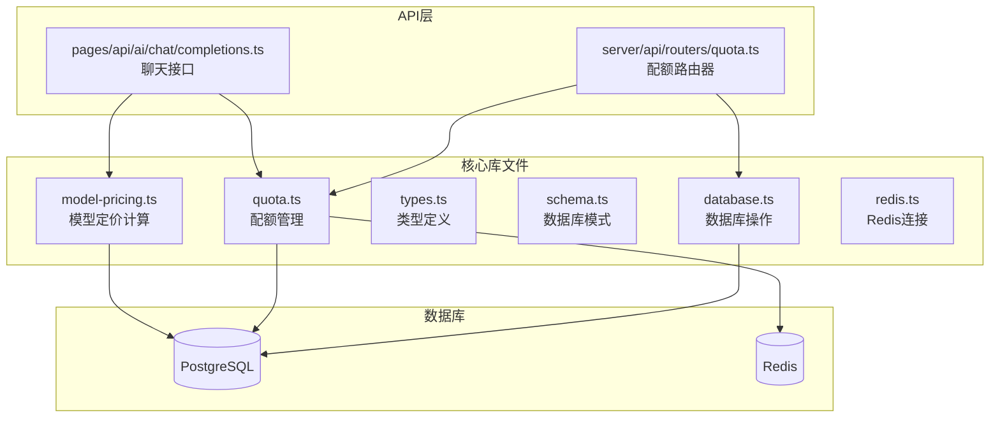
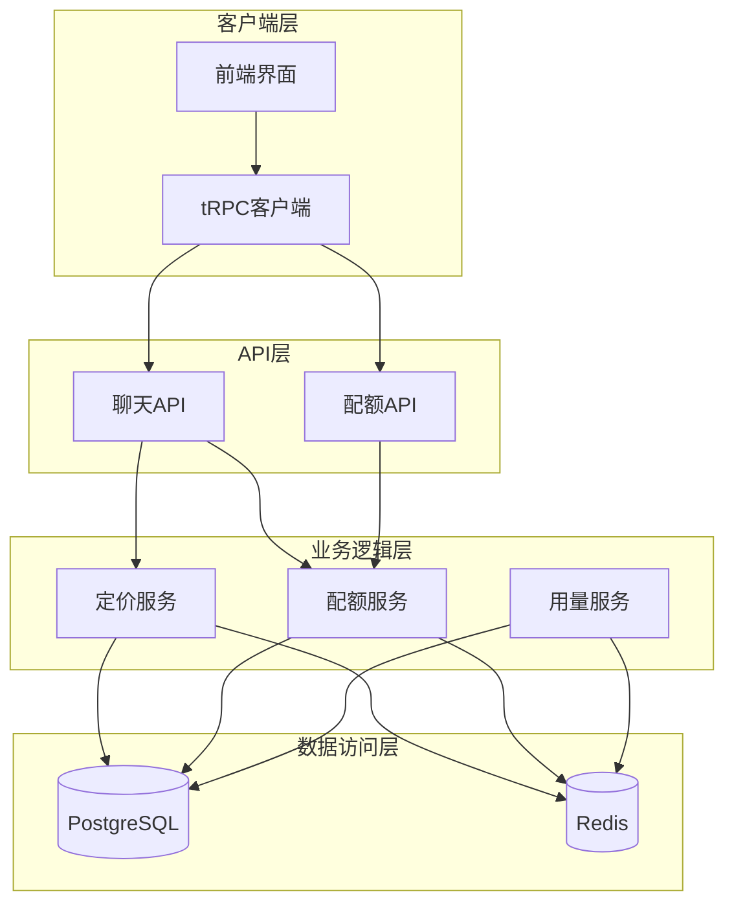
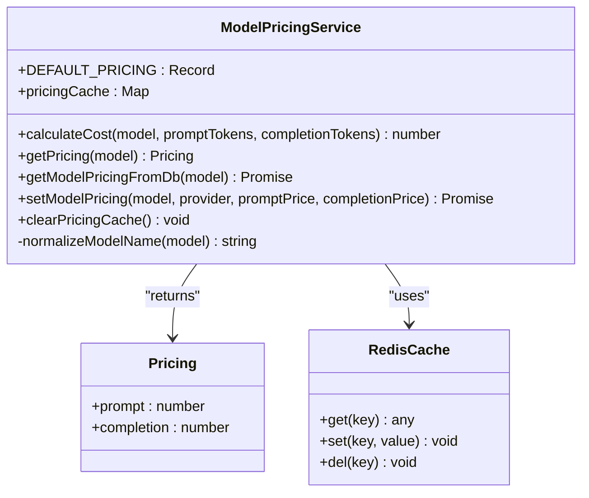
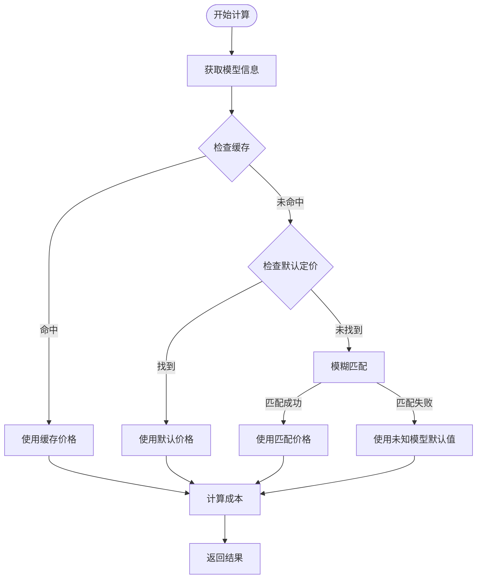
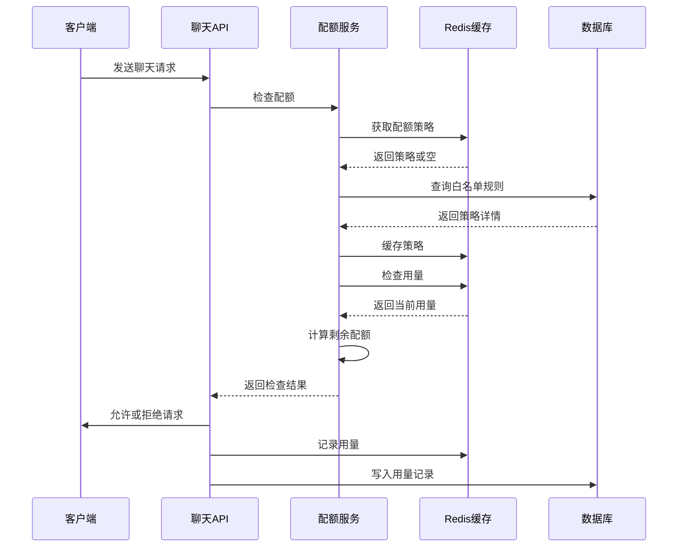
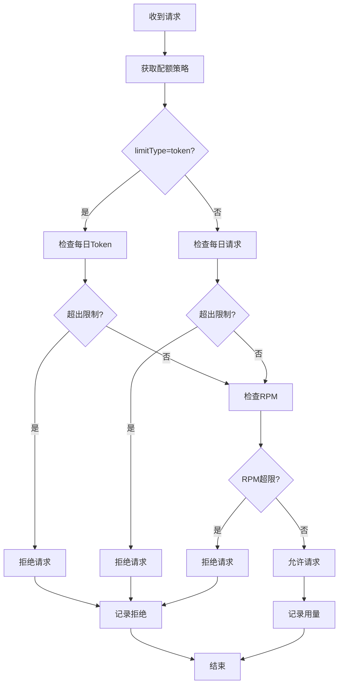
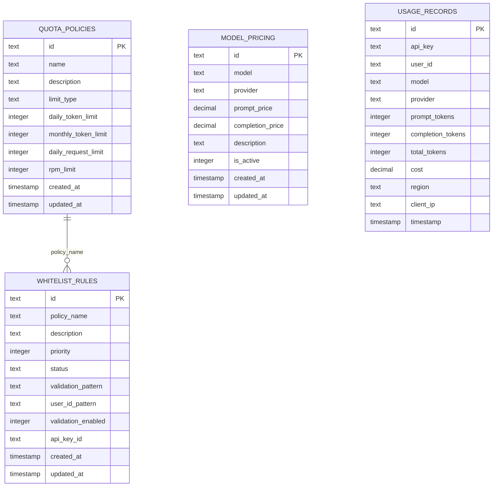
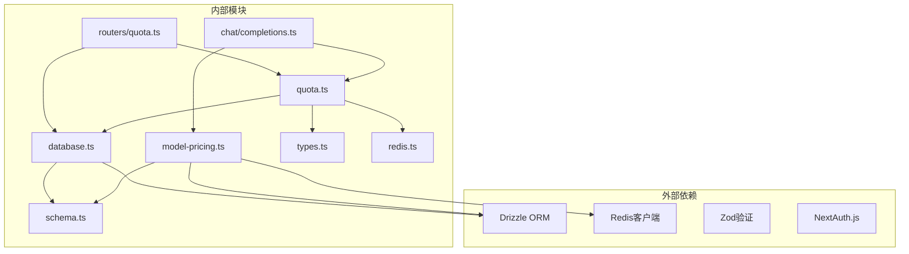

# 模型定价系统

<cite>
**本文档引用的文件**
- [src/lib/model-pricing.ts](file://src/lib/model-pricing.ts)
- [src/lib/quota.ts](file://src/lib/quota.ts)
- [src/server/api/routers/quota.ts](file://src/server/api/routers/quota.ts)
- [src/lib/types.ts](file://src/lib/types.ts)
- [src/lib/schema.ts](file://src/lib/schema.ts)
- [src/lib/database.ts](file://src/lib/database.ts)
- [src/lib/redis.ts](file://src/lib/redis.ts)
- [src/pages/api/ai/chat/completions.ts](file://src/pages/api/ai/chat/completions.ts)
</cite>

## 目录
1. [简介](#简介)
2. [项目结构](#项目结构)
3. [核心组件](#核心组件)
4. [架构概览](#架构概览)
5. [详细组件分析](#详细组件分析)
6. [依赖关系分析](#依赖关系分析)
7. [性能考虑](#性能考虑)
8. [故障排除指南](#故障排除指南)
9. [结论](#结论)

## 简介

模型定价系统是 AIGate 项目中的一个关键模块，负责管理 AI 模型的成本计算、配额控制和用量统计。该系统提供了灵活的定价策略、实时的用量监控和强大的配额管理功能，确保 AI 服务的安全使用和成本控制。

系统采用现代化的技术栈，包括 PostgreSQL 数据库、Redis 缓存、Next.js 框架和 tRPC 接口，实现了高性能的并发处理和实时的数据同步。

## 项目结构

模型定价系统位于项目的 `src/lib` 目录下，主要包含以下核心文件：

**图表来源**
- [src/lib/model-pricing.ts:1-194](file://src/lib/model-pricing.ts#L1-L194)
- [src/lib/quota.ts:1-327](file://src/lib/quota.ts#L1-L327)
- [src/lib/database.ts:1-850](file://src/lib/database.ts#L1-L850)

**章节来源**
- [src/lib/model-pricing.ts:1-194](file://src/lib/model-pricing.ts#L1-L194)
- [src/lib/quota.ts:1-327](file://src/lib/quota.ts#L1-L327)
- [src/lib/database.ts:1-850](file://src/lib/database.ts#L1-L850)

## 核心组件

### 模型定价计算模块

模型定价计算模块提供了精确的成本计算功能，支持多种 AI 模型提供商的价格策略。

**主要特性：**
- 支持 15+ 种主流 AI 模型的默认定价
- 实时成本计算（美元/百万 tokens）
- 模型名称标准化处理
- 缓存机制优化性能

### 配额管理系统

配额管理系统实现了灵活的用量控制机制，支持多种限制模式：

**限制模式：**
- Token 限制：基于 token 数量的配额控制
- 请求次数限制：基于每日请求次数的配额控制
- RPM 限制：每分钟请求频率控制

**缓存策略：**
- Redis 缓存配额策略
- 实时用量统计
- 自动过期机制

**章节来源**
- [src/lib/model-pricing.ts:49-90](file://src/lib/model-pricing.ts#L49-L90)
- [src/lib/quota.ts:79-200](file://src/lib/quota.ts#L79-L200)

## 架构概览

系统采用分层架构设计，实现了清晰的关注点分离：

**图表来源**
- [src/pages/api/ai/chat/completions.ts:24-98](file://src/pages/api/ai/chat/completions.ts#L24-L98)
- [src/server/api/routers/quota.ts:39-221](file://src/server/api/routers/quota.ts#L39-L221)

## 详细组件分析

### 模型定价计算组件

模型定价计算组件是整个系统的核心，负责准确的成本计算和价格管理。

**图表来源**
- [src/lib/model-pricing.ts:66-139](file://src/lib/model-pricing.ts#L66-L139)

#### 成本计算流程

**图表来源**
- [src/lib/model-pricing.ts:49-90](file://src/lib/model-pricing.ts#L49-L90)

**章节来源**
- [src/lib/model-pricing.ts:49-194](file://src/lib/model-pricing.ts#L49-L194)

### 配额管理组件

配额管理组件实现了复杂的用量控制逻辑，支持多种限制模式和动态策略调整。

**图表来源**
- [src/pages/api/ai/chat/completions.ts:58-70](file://src/pages/api/ai/chat/completions.ts#L58-L70)
- [src/lib/quota.ts:79-200](file://src/lib/quota.ts#L79-L200)

#### 配额检查算法

**图表来源**
- [src/lib/quota.ts:79-200](file://src/lib/quota.ts#L79-L200)

**章节来源**
- [src/lib/quota.ts:79-327](file://src/lib/quota.ts#L79-L327)

### 数据库架构

系统使用 PostgreSQL 作为主数据库，存储所有结构化数据，并通过 Redis 实现高性能缓存。

**图表来源**
- [src/lib/schema.ts:28-116](file://src/lib/schema.ts#L28-L116)

**章节来源**
- [src/lib/schema.ts:1-180](file://src/lib/schema.ts#L1-L180)

## 依赖关系分析

系统具有清晰的依赖层次结构，各组件之间的耦合度适中，便于维护和扩展。

**图表来源**
- [src/lib/model-pricing.ts:1-5](file://src/lib/model-pricing.ts#L1-L5)
- [src/lib/quota.ts:1-7](file://src/lib/quota.ts#L1-L7)

**章节来源**
- [src/lib/model-pricing.ts:1-194](file://src/lib/model-pricing.ts#L1-L194)
- [src/lib/quota.ts:1-327](file://src/lib/quota.ts#L1-L327)

## 性能考虑

系统在设计时充分考虑了性能优化，采用了多种技术手段提升响应速度和吞吐量：

### 缓存策略
- Redis 缓存配额策略，减少数据库查询
- 模型定价缓存，避免重复计算
- 自动过期机制，保证数据一致性

### 异步处理
- 流式响应处理，提升用户体验
- 异步用量记录，不影响请求响应
- 并发连接池管理

### 数据库优化
- 合理的索引设计
- 连接池配置
- 事务批量处理

## 故障排除指南

### 常见问题及解决方案

**配额检查失败**
- 检查 Redis 服务连接状态
- 验证配额策略配置
- 查看数据库连接日志

**模型定价错误**
- 确认模型名称标准化处理
- 检查默认定价配置
- 验证数据库连接

**API 响应超时**
- 检查上游 AI 服务状态
- 调整超时参数
- 监控系统资源使用

**章节来源**
- [src/lib/quota.ts:189-200](file://src/lib/quota.ts#L189-L200)
- [src/lib/model-pricing.ts:132-139](file://src/lib/model-pricing.ts#L132-L139)

## 结论

模型定价系统是一个功能完整、架构清晰的 AI 服务管理平台。系统通过合理的分层设计、高效的缓存策略和完善的错误处理机制，为 AI 服务的商业化运营提供了坚实的技术基础。

**主要优势：**
- 支持多种 AI 模型提供商
- 灵活的配额管理策略
- 高性能的缓存和数据库设计
- 完善的监控和日志系统

**未来改进方向：**
- 增加更多 AI 模型的支持
- 优化配额策略的动态调整能力
- 加强安全性和审计功能
- 提升系统的可扩展性