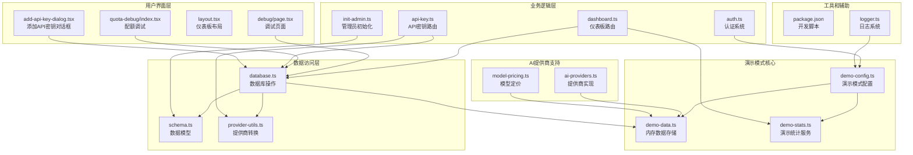
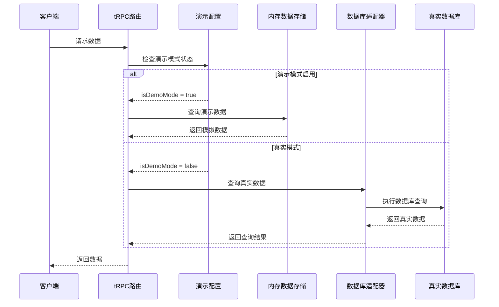
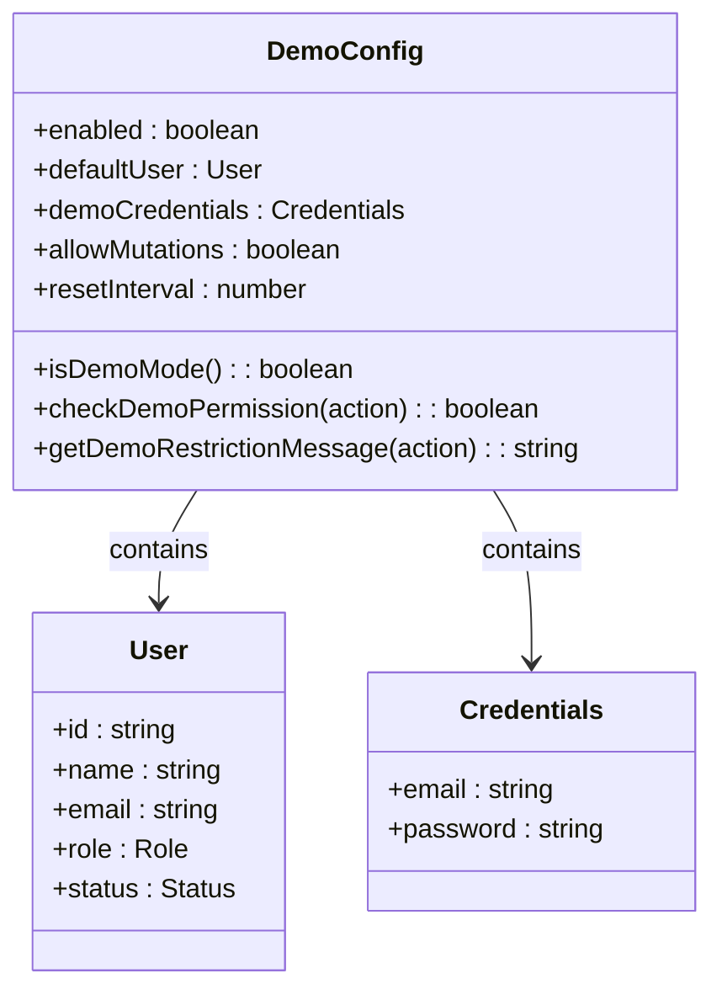
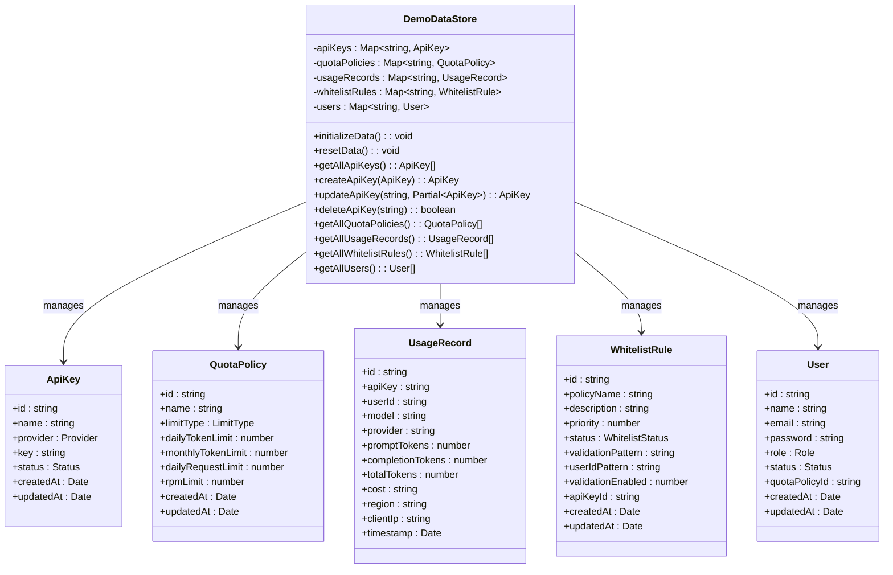
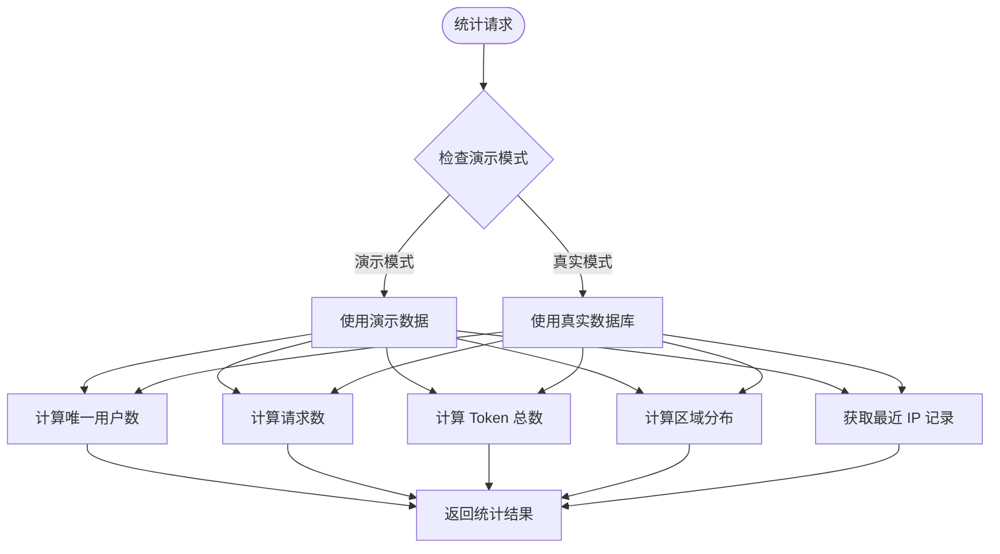
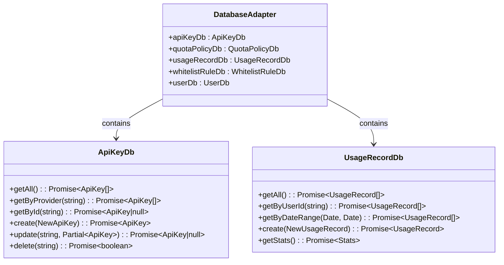
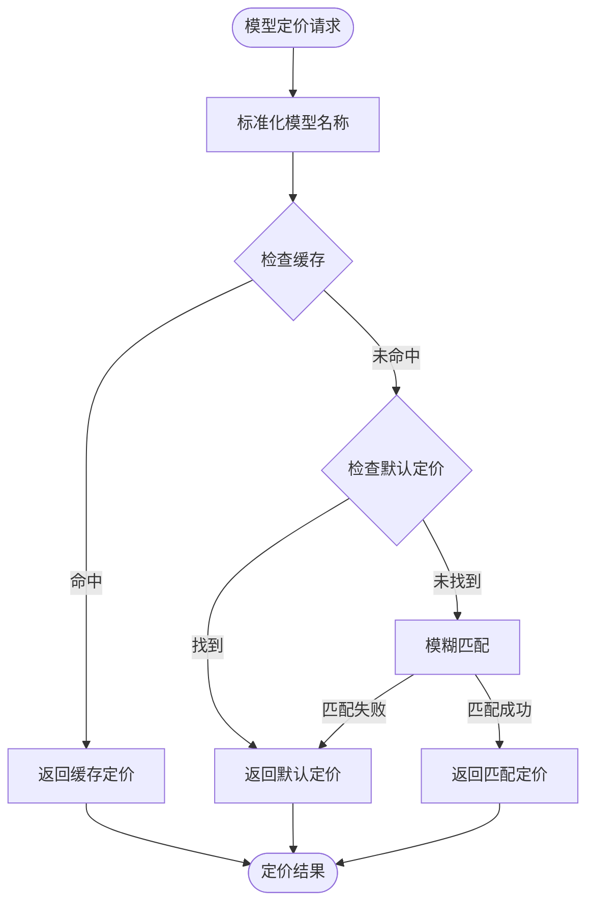
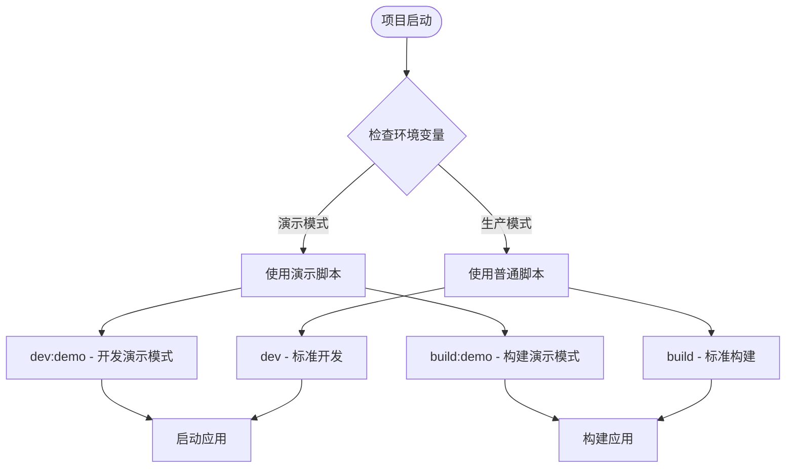
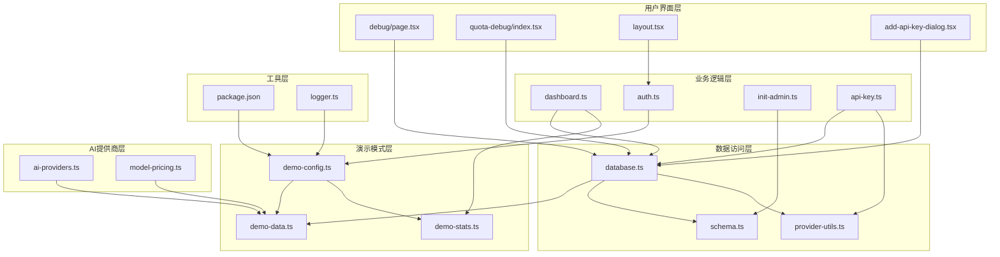

# 演示模式系统

<cite>
**本文档引用的文件**
- [demo-config.ts](file://src/lib/demo-config.ts)
- [demo-data.ts](file://src/lib/demo-data.ts)
- [demo-stats.ts](file://src/lib/demo-stats.ts)
- [dashboard.ts](file://src/server/api/routers/dashboard.ts)
- [database.ts](file://src/lib/database.ts)
- [auth.ts](file://src/auth.ts)
- [page.tsx](file://src/app/(dashboard)/debug/page.tsx)
- [index.tsx](file://src/app/(dashboard)/debug/components/quota-debug/index.tsx)
- [schema.ts](file://src/lib/schema.ts)
- [init-admin.ts](file://src/lib/init-admin.ts)
- [package.json](file://package.json)
- [layout.tsx](file://src/app/(dashboard)/layout.tsx)
- [provider-utils.ts](file://src/lib/provider-utils.ts)
- [logger.ts](file://src/lib/logger.ts)
- [ai-providers.ts](file://src/lib/ai-providers.ts)
- [model-pricing.ts](file://src/lib/model-pricing.ts)
- [api-key.ts](file://src/server/api/routers/api-key.ts)
- [add-api-key-dialog.tsx](file://src/app/(dashboard)/keys/components/add-api-key-dialog.tsx)
</cite>

## 更新摘要
**所做更改**
- 更新了演示数据系统，新增Kimi和MiniMax提供商的演示API密钥
- 替换了原有的Anthropic演示密钥，现在支持OpenAI、Kimi、MiniMax和DeepSeek提供商
- 增强了演示数据的提供商多样性，提供更全面的演示体验
- 更新了演示统计系统以支持新的提供商数据

## 目录
1. [简介](#简介)
2. [项目结构](#项目结构)
3. [核心组件](#核心组件)
4. [架构概览](#架构概览)
5. [详细组件分析](#详细组件分析)
6. [开发和构建脚本](#开发和构建脚本)
7. [依赖关系分析](#依赖关系分析)
8. [性能考虑](#性能考虑)
9. [故障排除指南](#故障排除指南)
10. [结论](#结论)

## 简介

演示模式系统是 AIGate AI 网关管理系统中的一个核心功能模块，旨在为用户提供一个无需真实数据库即可体验完整功能的演示环境。该系统通过内存数据存储、模拟统计数据和简化的工作流程，让用户能够在不配置真实数据库的情况下充分了解系统的各项功能。

演示模式系统的主要特点包括：
- 完全基于内存的数据存储，无需数据库连接
- 自动生成的演示数据和统计信息
- 支持基本的 CRUD 操作（可通过配置允许修改）
- 与真实模式的无缝切换能力
- 完整的仪表板和调试功能
- 增强的权限控制和安全机制
- **新增多提供商支持**：现支持OpenAI、Kimi、MiniMax和DeepSeek等多家AI提供商的演示数据

## 项目结构

演示模式系统在整个项目架构中占据重要地位，主要分布在以下目录结构中：



**图表来源**
- [demo-config.ts:1-57](file://src/lib/demo-config.ts#L1-L57)
- [demo-data.ts:1-471](file://src/lib/demo-data.ts#L1-L471)
- [dashboard.ts:1-513](file://src/server/api/routers/dashboard.ts#L1-L513)
- [package.json:6-18](file://package.json#L6-L18)

**章节来源**
- [demo-config.ts:1-57](file://src/lib/demo-config.ts#L1-L57)
- [demo-data.ts:1-471](file://src/lib/demo-data.ts#L1-L471)
- [dashboard.ts:1-513](file://src/server/api/routers/dashboard.ts#L1-L513)

## 核心组件

演示模式系统由七个核心组件构成，每个组件都有其特定的功能和职责：

### 1. 演示模式配置器 (Demo Config)
负责控制演示模式的启用状态、权限管理和操作限制。

### 2. 内存数据存储 (Demo Data Store)
提供完整的 CRUD 操作能力，支持 API Key、配额策略、使用记录、白名单规则和用户数据的管理。

### 3. 演示统计服务 (Demo Stats)
为仪表板功能提供统计数据，包括用户数统计、请求量统计、Token 消耗统计和区域分布分析。

### 4. 数据库适配器 (Database Adapter)
在演示模式和真实模式之间提供透明的数据访问接口。

### 5. AI提供商支持 (AI Providers)
**新增** 支持多个AI提供商的演示数据，包括OpenAI、Kimi、MiniMax和DeepSeek等。

### 6. 模型定价系统 (Model Pricing)
**新增** 为不同提供商的模型提供演示定价信息。

### 7. 开发构建脚本 (Dev Scripts)
提供专门的开发和构建脚本，支持演示模式的快速启动和部署。

**章节来源**
- [demo-config.ts:6-56](file://src/lib/demo-config.ts#L6-L56)
- [demo-data.ts:20-471](file://src/lib/demo-data.ts#L20-L471)
- [demo-stats.ts:19-111](file://src/lib/demo-stats.ts#L19-L111)
- [database.ts:22-800](file://src/lib/database.ts#L22-L800)
- [ai-providers.ts:288-408](file://src/lib/ai-providers.ts#L288-L408)
- [model-pricing.ts:23-37](file://src/lib/model-pricing.ts#L23-L37)
- [package.json:6-18](file://package.json#L6-L18)

## 架构概览

演示模式系统采用分层架构设计，实现了演示模式与真实模式的无缝切换：



**图表来源**
- [dashboard.ts:49-168](file://src/server/api/routers/dashboard.ts#L49-L168)
- [database.ts:24-26](file://src/lib/database.ts#L24-L26)
- [demo-config.ts:7-9](file://src/lib/demo-config.ts#L7-L9)

## 详细组件分析

### 演示模式配置系统

演示模式配置系统提供了灵活的配置选项和权限控制机制：



**图表来源**
- [demo-config.ts:12-36](file://src/lib/demo-config.ts#L12-L36)
- [demo-config.ts:17-23](file://src/lib/demo-config.ts#L17-L23)
- [demo-config.ts:26-29](file://src/lib/demo-config.ts#L26-L29)

演示模式配置的关键特性包括：

1. **双环境变量支持**：同时支持 `NEXT_PUBLIC_DEMO_MODE` 和 `DEMO_MODE` 环境变量
2. **权限分级控制**：默认只允许读取操作，可通过配置允许修改操作
3. **自动重置机制**：支持按时间间隔自动重置演示数据
4. **演示用户管理**：内置演示用户和管理员凭据

**章节来源**
- [demo-config.ts:6-56](file://src/lib/demo-config.ts#L6-L56)

### 内存数据存储系统

内存数据存储系统实现了完整的数据持久化能力，虽然数据存储在内存中，但提供了与数据库相同的操作接口：



**图表来源**
- [demo-data.ts:20-471](file://src/lib/demo-data.ts#L20-L471)
- [schema.ts:29-83](file://src/lib/schema.ts#L29-L83)

内存数据存储系统的核心优势：

1. **完全内存化**：所有数据存储在内存中，无需数据库连接
2. **初始化数据**：自动创建演示所需的初始数据集
3. **模拟使用记录**：生成随机的使用记录用于演示
4. **完整 CRUD 支持**：提供与数据库相同的 CRUD 操作接口
5. **类型安全**：使用 TypeScript 类型确保数据完整性

**更新** 现在支持多个AI提供商的演示API密钥，包括OpenAI、Kimi、MiniMax和DeepSeek，替代了原有的Anthropic演示密钥

**章节来源**
- [demo-data.ts:20-471](file://src/lib/demo-data.ts#L20-L471)
- [schema.ts:1-162](file://src/lib/schema.ts#L1-L162)

### 演示统计服务

演示统计服务为仪表板功能提供了完整的统计数据支持：



**图表来源**
- [demo-stats.ts:19-111](file://src/lib/demo-stats.ts#L19-L111)
- [dashboard.ts:49-168](file://src/server/api/routers/dashboard.ts#L49-L168)

演示统计服务的功能特性：

1. **唯一用户统计**：基于使用记录统计唯一用户数量
2. **请求量统计**：统计指定时间范围内的请求数量
3. **Token 消耗统计**：计算 Token 总消耗量
4. **区域分布分析**：按地区统计请求分布
5. **最近 IP 记录**：获取最近的 IP 请求记录

**章节来源**
- [demo-stats.ts:19-111](file://src/lib/demo-stats.ts#L19-L111)

### 数据库适配器

数据库适配器实现了演示模式与真实模式之间的透明切换：



**图表来源**
- [database.ts:22-800](file://src/lib/database.ts#L22-L800)

数据库适配器的设计模式：

1. **条件执行**：根据演示模式状态决定使用内存数据还是数据库
2. **接口统一**：保持与真实数据库相同的接口设计
3. **错误处理**：统一的错误处理和回退机制
4. **性能优化**：在演示模式下避免数据库连接开销

**章节来源**
- [database.ts:22-800](file://src/lib/database.ts#L22-L800)

### AI提供商支持系统

**新增** AI提供商支持系统为演示模式提供了多提供商的完整支持：

```mermaid
classDiagram
class AIProviders {
+providers : Record~string, AIProvider~
+openaiProvider : AIProvider
+kimiProvider : AIProvider
+minimaxProvider : AIProvider
+deepseekProvider : AIProvider
+getProviderByModel(string) : AIProvider
+getApiKey(string) : Promise~string|null~
+getApiKeyWithBaseUrl(string) : Promise~{key, baseUrl}|null~
}
class AIProvider {
+name : string
+models : string[]
+makeRequest(ChatCompletionRequest) : Promise~ChatCompletionResponse~
+makeStreamRequest(ChatCompletionRequest) : Promise~ReadableStream~
+estimateTokens(ChatCompletionRequest) : number
}
AIProviders --> AIProvider : manages
```

**图表来源**
- [ai-providers.ts:288-408](file://src/lib/ai-providers.ts#L288-L408)
- [ai-providers.ts:411-431](file://src/lib/ai-providers.ts#L411-L431)

AI提供商支持系统的关键特性：

1. **多提供商支持**：支持OpenAI、Kimi、MiniMax、DeepSeek等多个AI提供商
2. **OpenAI兼容**：Kimi和MiniMax使用OpenAI兼容API
3. **模型映射**：根据模型名称自动选择合适的提供商
4. **流式支持**：所有提供商都支持流式响应
5. **令牌估算**：提供统一的令牌消耗估算功能

**章节来源**
- [ai-providers.ts:288-408](file://src/lib/ai-providers.ts#L288-L408)
- [ai-providers.ts:411-431](file://src/lib/ai-providers.ts#L411-L431)

### 模型定价系统

**新增** 模型定价系统为演示模式提供了详细的模型定价信息：



**图表来源**
- [model-pricing.ts:66-90](file://src/lib/model-pricing.ts#L66-L90)

模型定价系统的关键特性：

1. **多提供商定价**：支持OpenAI、Kimi、MiniMax等多种提供商的模型定价
2. **缓存机制**：使用Map缓存提高定价查询性能
3. **模糊匹配**：支持模型名称的模糊匹配
4. **默认定价**：未知模型使用默认定价策略
5. **成本计算**：提供精确的成本计算功能

**章节来源**
- [model-pricing.ts:23-37](file://src/lib/model-pricing.ts#L23-L37)
- [model-pricing.ts:66-90](file://src/lib/model-pricing.ts#L66-L90)

### 开发和构建脚本

开发和构建脚本提供了专门的演示模式支持：



**图表来源**
- [package.json:6-18](file://package.json#L6-L18)

开发脚本的关键功能：

1. **演示模式专用脚本**：`dev:demo` 和 `build:demo` 提供演示模式支持
2. **环境变量自动设置**：自动设置 `DEMO_MODE=true` 和 `NEXT_PUBLIC_DEMO_MODE=true`
3. **快速开发体验**：无需手动配置即可启动演示模式
4. **构建优化**：针对演示模式的构建优化

**章节来源**
- [package.json:6-18](file://package.json#L6-L18)

## 开发和构建脚本

演示模式系统提供了专门的开发和构建脚本，支持快速启动和部署演示模式：

### 开发脚本

- `npm run dev:demo` - 启动演示模式开发服务器
- `npm run build:demo` - 构建演示模式应用

这些脚本会自动设置必要的环境变量，无需手动配置。

### 构建脚本

- `npm run build` - 标准构建
- `npm run start` - 启动生产服务器

### 数据库管理脚本

- `npm run db:generate` - 生成数据库迁移文件
- `npm run db:push` - 推送数据库结构
- `npm run db:migrate` - 执行数据库迁移
- `npm run db:seed` - 种子数据初始化

**章节来源**
- [package.json:6-18](file://package.json#L6-L18)

## 依赖关系分析

演示模式系统的依赖关系体现了清晰的分层架构：



**图表来源**
- [demo-config.ts:1-57](file://src/lib/demo-config.ts#L1-L57)
- [demo-data.ts:1-471](file://src/lib/demo-data.ts#L1-L471)
- [dashboard.ts:1-513](file://src/server/api/routers/dashboard.ts#L1-L513)

依赖关系的特点：

1. **单向依赖**：演示模式层依赖于数据访问层，但不反向依赖
2. **接口隔离**：各层通过清晰的接口进行通信
3. **配置驱动**：演示模式状态通过配置文件控制
4. **渐进增强**：从简单到复杂的依赖层次

**章节来源**
- [package.json:20-72](file://package.json#L20-L72)

## 性能考虑

演示模式系统在性能方面具有显著优势：

### 内存优化
- 所有数据存储在内存中，避免数据库连接开销
- 使用 Map 数据结构提供 O(1) 的查找性能
- 自动垃圾回收机制确保内存使用效率

### 并发处理
- 支持高并发的内存数据访问
- 无锁设计减少并发冲突
- 异步操作提升响应速度

### 缓存策略
- 内存中的数据天然具备缓存效果
- 减少网络延迟和数据库查询时间
- 适合开发和测试场景的快速迭代

### 开发效率
- 演示模式脚本提供快速启动能力
- 无需数据库配置即可开发
- 支持热重载和实时调试

## 故障排除指南

### 常见问题及解决方案

1. **演示模式未正确启用**
   - 检查环境变量 `NEXT_PUBLIC_DEMO_MODE` 和 `DEMO_MODE`
   - 确认值设置为 `true`
   - 验证环境变量在构建时可用

2. **数据重置问题**
   - 检查 `DEMO_RESET_INTERVAL` 设置
   - 确认定时器正常工作
   - 验证重置逻辑的执行

3. **权限控制异常**
   - 检查 `DEMO_ALLOW_MUTATIONS` 配置
   - 验证权限检查函数的调用
   - 确认演示用户凭据正确

4. **统计数据显示异常**
   - 检查演示数据的生成逻辑
   - 验证统计计算方法
   - 确认时间范围参数正确

5. **开发脚本问题**
   - 检查 npm 脚本配置
   - 确认环境变量正确设置
   - 验证演示模式脚本的执行

6. **AI提供商问题**
   - **新增** 检查提供商名称大小写转换
   - 验证演示API密钥的有效性
   - 确认提供商URL配置正确

**章节来源**
- [demo-config.ts:32-36](file://src/lib/demo-config.ts#L32-L36)
- [demo-config.ts:39-51](file://src/lib/demo-config.ts#L39-L51)
- [package.json:6-18](file://package.json#L6-L18)

### 调试技巧

1. **启用详细日志**
   - 在演示模式下增加日志输出
   - 监控数据访问和操作记录
   - 跟踪权限检查过程

2. **性能监控**
   - 监控内存使用情况
   - 分析数据访问模式
   - 评估统计计算性能

3. **数据一致性检查**
   - 验证内存数据与演示数据的一致性
   - 检查数据转换过程
   - 确认类型安全

4. **开发脚本调试**
   - 使用 `npm run dev:demo` 启动演示模式
   - 检查环境变量注入
   - 验证演示模式功能

5. **AI提供商调试**
   - **新增** 检查提供商转换函数
   - 验证演示API密钥格式
   - 确认流式响应处理

## 结论

演示模式系统为 AIGate AI 网关管理系统提供了强大的演示和测试能力。通过精心设计的架构，系统实现了演示模式与真实模式的无缝切换，既保证了功能的完整性，又提供了优秀的用户体验。

**更新** 系统现已支持多个AI提供商的演示数据，包括OpenAI、Kimi、MiniMax和DeepSeek，替代了原有的Anthropic演示密钥，为用户提供了更全面的演示体验。

系统的主要优势包括：

1. **开发友好**：无需数据库即可体验完整功能
2. **配置灵活**：支持多种配置选项和权限控制
3. **性能优异**：内存存储提供快速响应
4. **扩展性强**：清晰的架构便于功能扩展
5. **维护简便**：单一职责的模块设计降低维护成本
6. **开发高效**：专门的开发脚本提升开发效率
7. **调试便利**：完整的调试工具链支持
8. **多提供商支持**：**新增** 支持多个AI提供商的演示数据

演示模式系统不仅提升了开发效率，也为用户提供了直观的功能预览，是现代 Web 应用开发中不可或缺的重要组件。随着功能的不断完善和优化，演示模式系统将继续为 AIGate 项目的开发和部署提供强有力的支持。