# 演示模式系统

<cite>
**本文档引用的文件**
- [demo-config.ts](file://src/lib/demo-config.ts)
- [demo-data.ts](file://src/lib/demo-data.ts)
- [demo-stats.ts](file://src/lib/demo-stats.ts)
- [dashboard.ts](file://src/server/api/routers/dashboard.ts)
- [database.ts](file://src/lib/database.ts)
- [auth.ts](file://src/auth.ts)
- [page.tsx](file://src/app/(dashboard)/debug/page.tsx)
- [index.tsx](file://src/app/(dashboard)/debug/components/quota-debug/index.tsx)
- [schema.ts](file://src/lib/schema.ts)
- [init-admin.ts](file://src/lib/init-admin.ts)
- [package.json](file://package.json)
- [layout.tsx](file://src/app/(dashboard)/layout.tsx)
- [provider-utils.ts](file://src/lib/provider-utils.ts)
- [logger.ts](file://src/lib/logger.ts)
- [region-heatmap-chart.tsx](file://src/app/(dashboard)/components/region-heatmap-chart.tsx)
- [model-pricing.ts](file://src/lib/model-pricing.ts)
- [add-api-key-dialog.tsx](file://src/app/(dashboard)/keys/components/add-api-key-dialog.tsx)
- [chat-service.ts](file://src/lib/chat-service.ts)
- [api-key.ts](file://src/types/api-key.ts)
- [recent-ip-requests.tsx](file://src/app/(dashboard)/components/recent-ip-requests.tsx)
- [request-context.ts](file://src/lib/request-context.ts)
- [ip-region.ts](file://src/lib/ip-region.ts)
- [completions.ts](file://src/pages/api/ai/chat/completions.ts)
- [stream.ts](file://src/pages/api/ai/chat/stream.ts)
- [global.d.ts](file://src/global.d.ts)
- [types.ts](file://src/lib/types.ts)
</cite>

## 更新摘要
**所做更改**
- 新增请求上下文管理系统，实现统一的客户端IP和区域信息提取
- 演示统计功能现代化改造，增强日期范围过滤和成本统计能力
- 增强的定价配置支持，集成模型定价计算和缓存机制
- 完善的API请求处理流程，支持流式和非流式响应
- 扩展的类型定义，支持完整的请求上下文和用量记录

## 目录
1. [简介](#简介)
2. [项目结构](#项目结构)
3. [核心组件](#核心组件)
4. [架构概览](#架构概览)
5. [详细组件分析](#详细组件分析)
6. [开发和构建脚本](#开发和构建脚本)
7. [依赖关系分析](#依赖关系分析)
8. [性能考虑](#性能考虑)
9. [故障排除指南](#故障排除指南)
10. [结论](#结论)

## 简介

演示模式系统是 AIGate AI 网关管理系统中的一个核心功能模块，旨在为用户提供一个无需真实数据库即可体验完整功能的演示环境。该系统通过内存数据存储、模拟统计数据和简化的工作流程，让用户能够在不配置真实数据库的情况下充分了解系统的各项功能。

**更新** 系统现已集成现代化的请求上下文管理系统，提供统一的客户端IP地址和区域信息提取能力，增强了演示统计功能的成本计算和日期范围过滤能力，并完善了API请求处理流程。

演示模式系统的主要特点包括：
- 完全基于内存的数据存储，无需数据库连接
- 自动生成的演示数据和统计信息，包含70/30的地区分布比例
- 支持基本的 CRUD 操作（可通过配置允许修改）
- 与真实模式的无缝切换能力
- 完整的仪表板和调试功能
- 增强的权限控制和安全机制
- 全面的区域分布分析支持
- **新增** 完整的定价信息支持和成本计算能力
- **新增** 与生产模式一致的日期过滤功能，支持按日期范围精确查询演示数据
- **新增** 统一的请求上下文管理系统，提供标准化的客户端信息提取
- **新增** 现代化的API请求处理流程，支持流式和非流式响应
- **新增** 增强的类型定义，支持完整的请求上下文和用量记录

## 项目结构

演示模式系统在整个项目架构中占据重要地位，主要分布在以下目录结构中：

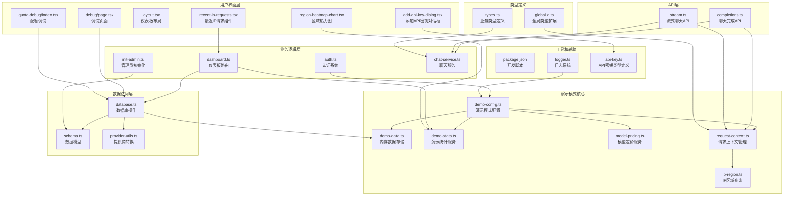

**图表来源**
- [demo-config.ts:1-57](file://src/lib/demo-config.ts#L1-L57)
- [demo-data.ts:1-457](file://src/lib/demo-data.ts#L1-L457)
- [dashboard.ts:1-513](file://src/server/api/routers/dashboard.ts#L1-L513)
- [model-pricing.ts:1-201](file://src/lib/model-pricing.ts#L1-L201)
- [request-context.ts:1-39](file://src/lib/request-context.ts#L1-L39)
- [ip-region.ts:1-101](file://src/lib/ip-region.ts#L1-L101)
- [completions.ts:1-231](file://src/pages/api/ai/chat/completions.ts#L1-L231)
- [stream.ts:1-137](file://src/pages/api/ai/chat/stream.ts#L1-L137)
- [global.d.ts:1-28](file://src/global.d.ts#L1-L28)
- [types.ts:1-121](file://src/lib/types.ts#L1-L121)
- [package.json:6-18](file://package.json#L6-L18)

**章节来源**
- [demo-config.ts:1-57](file://src/lib/demo-config.ts#L1-L57)
- [demo-data.ts:1-457](file://src/lib/demo-data.ts#L1-L457)
- [dashboard.ts:1-513](file://src/server/api/routers/dashboard.ts#L1-L513)

## 核心组件

演示模式系统由九个核心组件构成，每个组件都有其特定的功能和职责：

### 1. 演示模式配置器 (Demo Config)
负责控制演示模式的启用状态、权限管理和操作限制。

### 2. 内存数据存储 (Demo Data Store)
提供完整的 CRUD 操作能力，支持 API Key、配额策略、使用记录、白名单规则和用户数据的管理。**更新** 支持扩展的地区分布数据生成和定价信息配置。

### 3. 演示统计服务 (Demo Stats)
为仪表板功能提供统计数据，包括用户数统计、请求量统计、Token 消耗统计和区域分布分析。**更新** 支持更全面的区域分布统计、成本分析和**新增**的日期范围过滤功能。

### 4. 模型定价服务 (Model Pricing)
**新增** 提供模型定价计算和缓存功能，支持自定义定价覆盖默认定价。

### 5. 请求上下文管理系统 (Request Context)
**新增** 提供统一的客户端IP地址和区域信息提取能力，支持中间件和包装器两种使用方式。

### 6. IP区域查询服务 (IP Region)
**新增** 提供IP地址到地理位置的查询功能，支持代理头和IPv6地址处理。

### 7. 数据库适配器 (Database Adapter)
在演示模式和真实模式之间提供透明的数据访问接口。

### 8. API请求处理器 (API Handlers)
**更新** 提供现代化的API请求处理流程，支持流式和非流式响应，集成请求上下文管理。

### 9. 类型定义系统 (Type Definitions)
**更新** 提供完整的类型定义，支持请求上下文、用量记录和API响应的类型安全。

### 10. 开发构建脚本 (Dev Scripts)
提供专门的开发和构建脚本，支持演示模式的快速启动和部署。

### 11. 区域热力图组件 (Region Heatmap)
**新增** 提供可视化区域分布展示，支持中国地图和世界地图的切换显示。

### 12. 最近IP请求组件 (Recent IP Requests)
**新增** 提供最近IP请求记录的可视化展示，支持分页和日期范围筛选。

**章节来源**
- [demo-config.ts:6-56](file://src/lib/demo-config.ts#L6-L56)
- [demo-data.ts:20-457](file://src/lib/demo-data.ts#L20-L457)
- [demo-stats.ts:19-117](file://src/lib/demo-stats.ts#L19-L117)
- [model-pricing.ts:1-201](file://src/lib/model-pricing.ts#L1-L201)
- [request-context.ts:1-39](file://src/lib/request-context.ts#L1-L39)
- [ip-region.ts:1-101](file://src/lib/ip-region.ts#L1-L101)
- [database.ts:22-800](file://src/lib/database.ts#L22-L800)
- [completions.ts:1-231](file://src/pages/api/ai/chat/completions.ts#L1-L231)
- [stream.ts:1-137](file://src/pages/api/ai/chat/stream.ts#L1-L137)
- [global.d.ts:10-28](file://src/global.d.ts#L10-L28)
- [types.ts:1-121](file://src/lib/types.ts#L1-L121)
- [package.json:6-18](file://package.json#L6-L18)
- [region-heatmap-chart.tsx:1-200](file://src/app/(dashboard)/components/region-heatmap-chart.tsx#L1-L200)
- [recent-ip-requests.tsx:1-225](file://src/app/(dashboard)/components/recent-ip-requests.tsx#L1-L225)

## 架构概览

演示模式系统采用分层架构设计，实现了演示模式与真实模式的无缝切换，并集成了现代化的请求上下文管理系统：

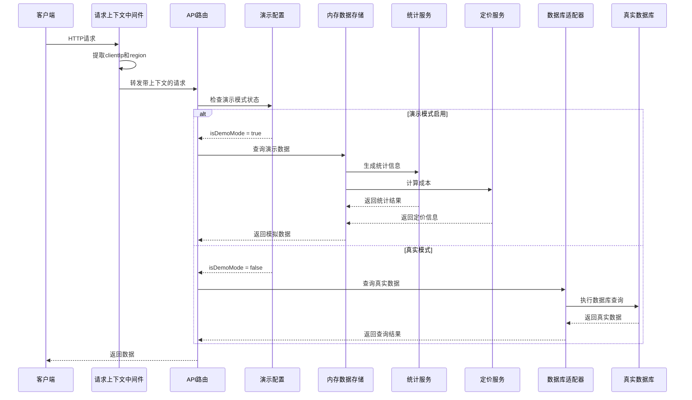

**图表来源**
- [dashboard.ts:49-168](file://src/server/api/routers/dashboard.ts#L49-L168)
- [database.ts:24-26](file://src/lib/database.ts#L24-L26)
- [demo-config.ts:7-9](file://src/lib/demo-config.ts#L7-L9)
- [request-context.ts:9-19](file://src/lib/request-context.ts#L9-L19)

## 详细组件分析

### 请求上下文管理系统

**新增** 请求上下文管理系统提供了统一的客户端信息提取能力，确保所有API请求都能获得标准化的客户端IP地址和区域信息：

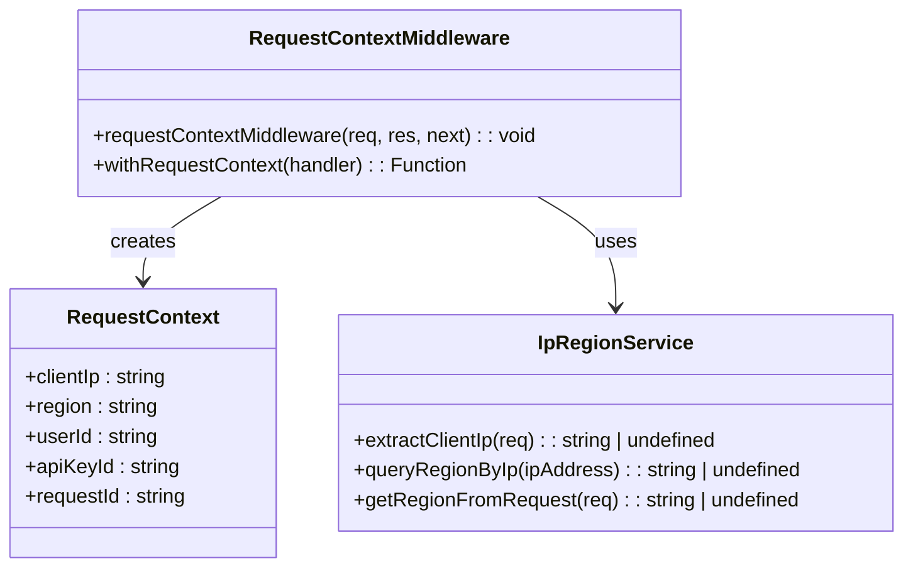

**图表来源**
- [request-context.ts:9-38](file://src/lib/request-context.ts#L9-L38)
- [ip-region.ts:24-78](file://src/lib/ip-region.ts#L24-L78)

请求上下文管理系统的功能特性：

1. **中间件模式**：提供 `requestContextMiddleware` 中间件，自动在请求处理前提取客户端信息
2. **包装器模式**：提供 `withRequestContext` 包装器，支持函数式编程风格
3. **代理头支持**：智能处理 `x-forwarded-for`、`x-real-ip` 等代理头
4. **IPv6兼容**：支持IPv6地址的处理和转换
5. **区域查询**：集成IP2Region库，提供精确的地理位置查询
6. **类型安全**：通过全局类型扩展确保NextApiRequest的类型安全

**章节来源**
- [request-context.ts:1-39](file://src/lib/request-context.ts#L1-L39)
- [ip-region.ts:1-101](file://src/lib/ip-region.ts#L1-L101)
- [global.d.ts:22-27](file://src/global.d.ts#L22-L27)

### 演示统计服务现代化改造

演示统计服务为仪表板功能提供了完整的统计数据支持。**更新** 现在支持更全面的区域分布分析、成本统计和**新增**的日期范围过滤功能：

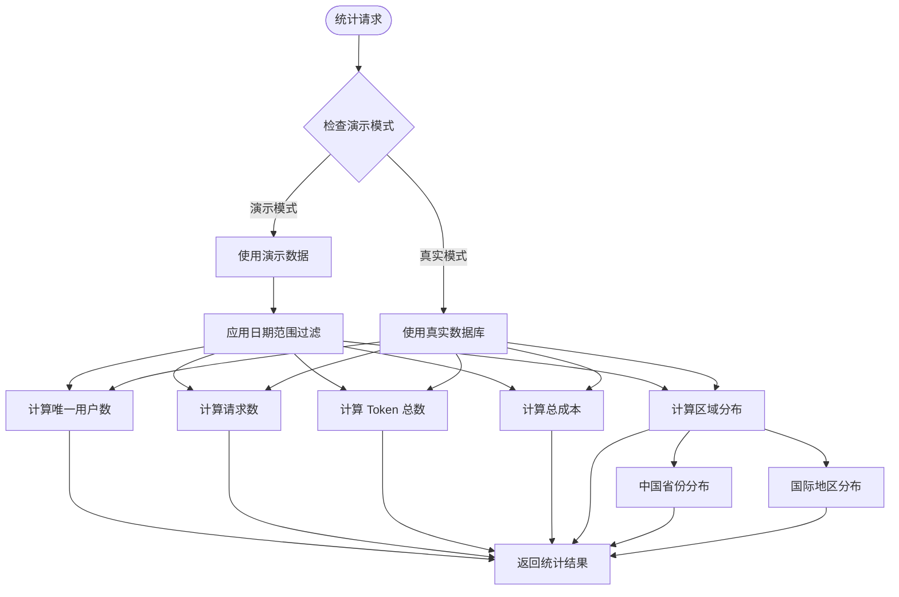

**图表来源**
- [demo-stats.ts:19-117](file://src/lib/demo-stats.ts#L19-L117)
- [dashboard.ts:49-168](file://src/server/api/routers/dashboard.ts#L49-L168)

演示统计服务的功能特性：

1. **唯一用户统计**：基于使用记录统计唯一用户数量
2. **请求量统计**：统计指定时间范围内的请求数量
3. **Token 消耗统计**：计算 Token 总消耗量
4. **新增** 成本统计：**新增** 计算总成本消耗，支持定价配置
5. **区域分布分析**：按地区统计请求分布，支持中国省份和国际地区
6. **最近 IP 记录**：获取最近的 IP 请求记录，**新增** 支持日期范围过滤
7. **70/30 分布支持**：准确反映中国地区占70%，国际地区占30%的真实使用比例
8. **日期范围过滤**：**新增** 支持按自定义日期范围精确过滤统计数据

**更新** 最近IP请求功能增强：
- 新增 `startDate` 和 `endDate` 参数支持
- 与生产模式保持一致的日期过滤逻辑
- 支持精确的时间范围查询
- 默认保留7天的历史数据范围

**章节来源**
- [demo-stats.ts:19-117](file://src/lib/demo-stats.ts#L19-L117)

### 模型定价服务增强

**新增** 模型定价服务提供了完整的定价计算和缓存功能：

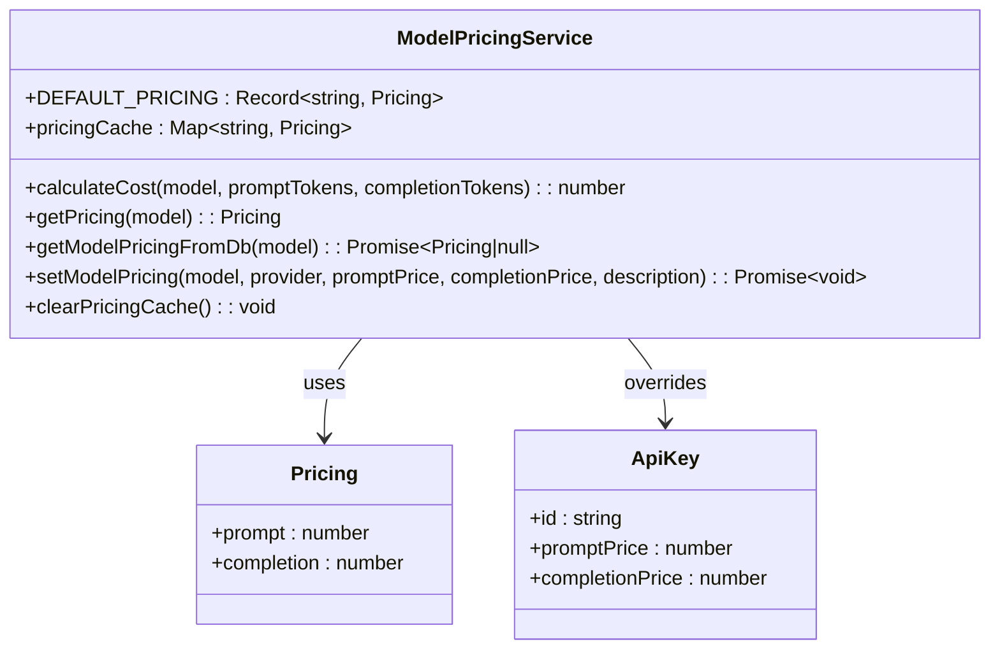

**图表来源**
- [model-pricing.ts:6-201](file://src/lib/model-pricing.ts#L6-L201)

模型定价服务的核心功能：

1. **默认定价配置**：包含主流AI模型的标准定价
2. **缓存机制**：优化定价查询性能
3. **模糊匹配**：支持模型名称的智能匹配
4. **数据库集成**：支持从数据库获取自定义定价
5. **成本计算**：基于定价和Token使用量计算成本
6. **API Key覆盖**：支持API Key级别的自定义定价

**章节来源**
- [model-pricing.ts:1-201](file://src/lib/model-pricing.ts#L1-L201)

### API请求处理流程现代化

**更新** API请求处理流程提供了现代化的请求处理能力，集成了请求上下文管理和统一的响应格式：

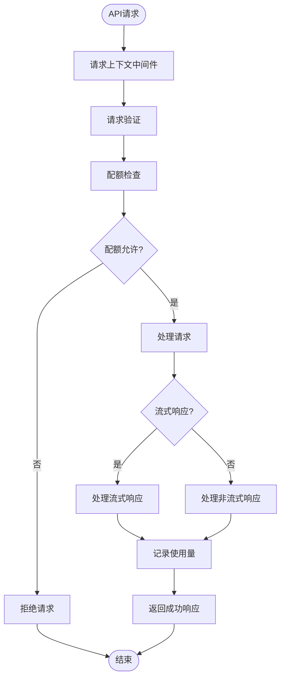

**图表来源**
- [completions.ts:24-98](file://src/pages/api/ai/chat/completions.ts#L24-L98)
- [stream.ts:13-133](file://src/pages/api/ai/chat/stream.ts#L13-L133)

API请求处理流程的功能特性：

1. **请求上下文集成**：自动提取和注入客户端IP和区域信息
2. **统一验证逻辑**：集成API Key验证、白名单检查和用户格式验证
3. **配额检查**：支持基于Token估算的配额检查
4. **流式和非流式支持**：支持OpenAI标准的流式和非流式响应
5. **成本计算**：自动计算请求成本并记录到用量记录
6. **错误处理**：完善的错误处理和响应格式化

**章节来源**
- [completions.ts:1-231](file://src/pages/api/ai/chat/completions.ts#L1-L231)
- [stream.ts:1-137](file://src/pages/api/ai/chat/stream.ts#L1-L137)
- [chat-service.ts:133-158](file://src/lib/chat-service.ts#L133-L158)

### 类型定义系统增强

**更新** 类型定义系统提供了完整的类型安全支持，确保请求上下文和用量记录的类型正确性：

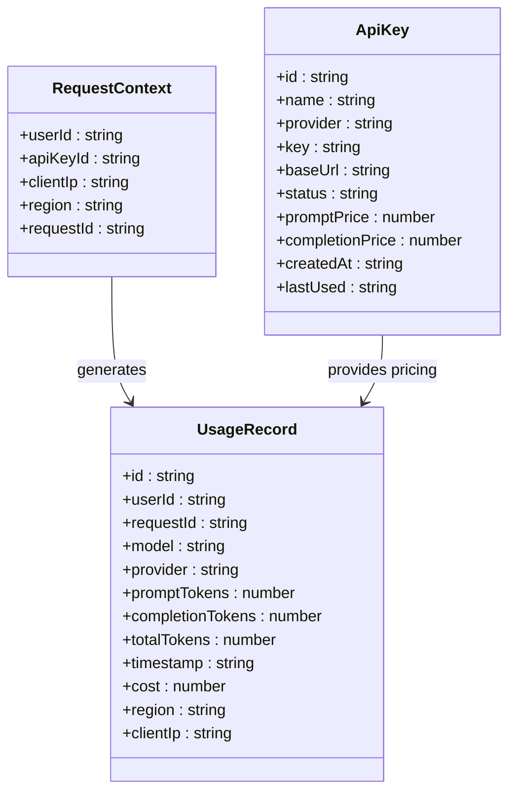

**图表来源**
- [types.ts:18-34](file://src/lib/types.ts#L18-L34)
- [types.ts:66-82](file://src/lib/types.ts#L66-L82)
- [types.ts:18-34](file://src/lib/types.ts#L18-L34)

类型定义系统的核心功能：

1. **请求上下文类型**：定义标准化的请求上下文结构
2. **用量记录类型**：包含成本、区域和IP地址的完整用量记录
3. **API Key类型**：支持自定义定价配置的API Key定义
4. **Zod验证**：提供完整的数据验证和类型推断
5. **类型安全**：确保编译时类型检查和运行时数据验证

**章节来源**
- [types.ts:1-121](file://src/lib/types.ts#L1-L121)
- [global.d.ts:10-28](file://src/global.d.ts#L10-L28)

### 区域热力图组件

**新增** 区域热力图组件提供了可视化区域分布展示功能：

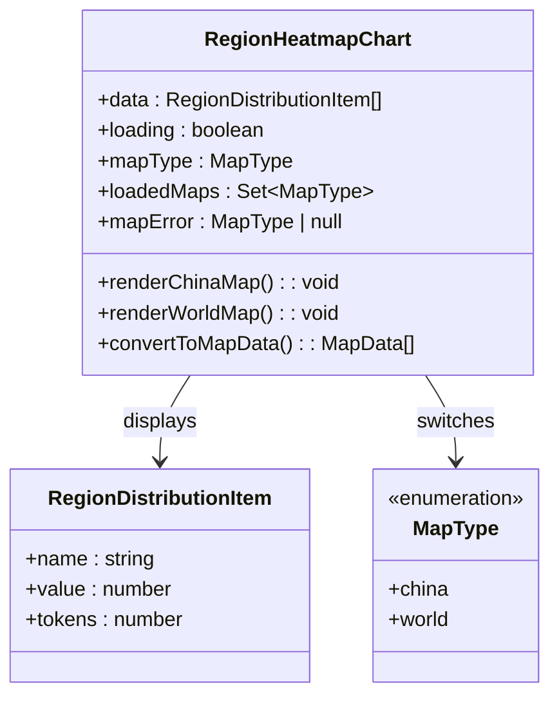

**图表来源**
- [region-heatmap-chart.tsx:108-120](file://src/app/(dashboard)/components/region-heatmap-chart.tsx#L108-L120)

区域热力图组件的核心功能：

1. **双地图支持**：支持中国地图和世界地图的切换显示
2. **数据转换**：将地区分布数据转换为地图可视化的格式
3. **中国省份映射**：支持完整的中国23个省份和地区
4. **国际地区映射**：支持8个主要国际地区的英文名称映射
5. **动态加载**：按需加载地图数据，优化性能
6. **错误处理**：处理地图数据加载失败的情况

**章节来源**
- [region-heatmap-chart.tsx:1-200](file://src/app/(dashboard)/components/region-heatmap-chart.tsx#L1-L200)

### 最近IP请求组件

**新增** 最近IP请求组件提供了最近IP请求记录的可视化展示功能：

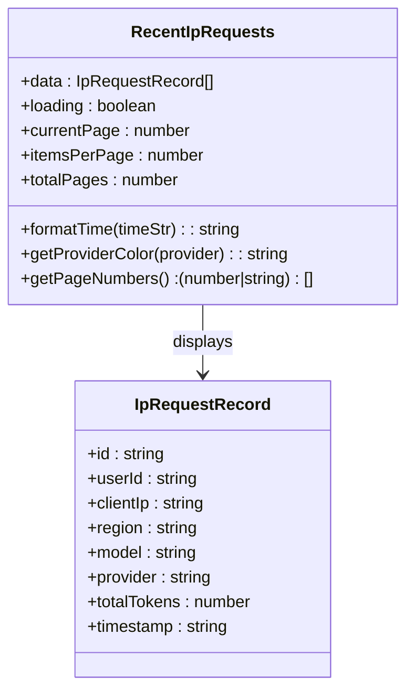

**图表来源**
- [recent-ip-requests.tsx:15-24](file://src/app/(dashboard)/components/recent-ip-requests.tsx#L15-L24)

最近IP请求组件的核心功能：

1. **表格展示**：以表格形式展示最近的IP请求记录
2. **分页功能**：支持分页显示，每页10条记录
3. **时间格式化**：将时间戳格式化为相对时间显示
4. **颜色标识**：根据提供商类型显示不同颜色的标签
5. **搜索功能**：支持IP地址、用户ID等字段的搜索
6. **加载状态**：支持加载状态的视觉反馈

**章节来源**
- [recent-ip-requests.tsx:1-225](file://src/app/(dashboard)/components/recent-ip-requests.tsx#L1-L225)

### 开发和构建脚本

开发和构建脚本提供了专门的演示模式支持：

**图表来源**
- [package.json:6-18](file://package.json#L6-L18)

开发脚本的关键功能：

1. **演示模式专用脚本**：`dev:demo` 和 `build:demo` 提供演示模式支持
2. **环境变量自动设置**：自动设置 `DEMO_MODE=true` 和 `NEXT_PUBLIC_DEMO_MODE=true`
3. **快速开发体验**：无需手动配置即可启动演示模式
4. **构建优化**：针对演示模式的构建优化

**章节来源**
- [package.json:6-18](file://package.json#L6-L18)

### API Key定价配置界面

**新增** API Key定价配置界面提供了完整的定价设置功能：

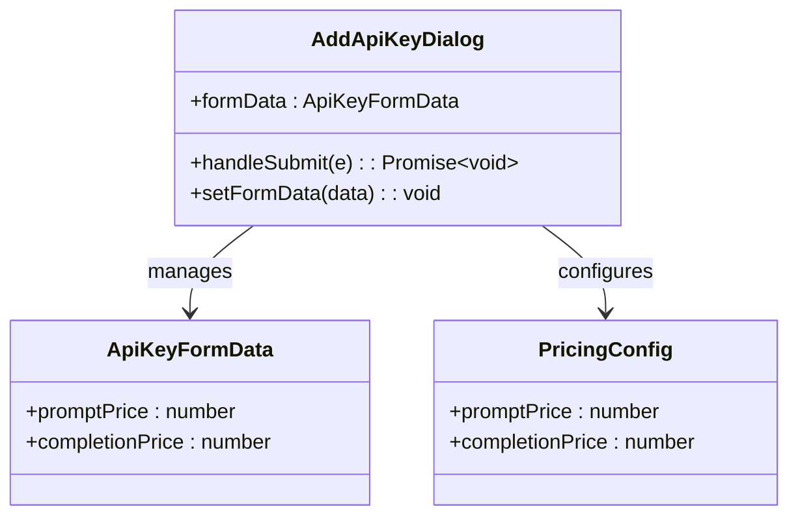

**图表来源**
- [add-api-key-dialog.tsx:257-312](file://src/app/(dashboard)/keys/components/add-api-key-dialog.tsx#L257-L312)

API Key定价配置界面的核心功能：

1. **可折叠定价配置**：支持展开/收起定价设置面板
2. **输入验证**：支持精确到小数点后6位的价格输入
3. **实时预览**：显示价格说明和单位提示
4. **表单集成**：与API Key创建表单无缝集成
5. **默认值支持**：支持继承或覆盖默认定价

**章节来源**
- [add-api-key-dialog.tsx:257-312](file://src/app/(dashboard)/keys/components/add-api-key-dialog.tsx#L257-L312)

## 开发和构建脚本

演示模式系统提供了专门的开发和构建脚本，支持快速启动和部署演示模式：

### 开发脚本

- `npm run dev:demo` - 启动演示模式开发服务器
- `npm run build:demo` - 构建演示模式应用

这些脚本会自动设置必要的环境变量，无需手动配置。

### 构建脚本

- `npm run build` - 标准构建
- `npm run start` - 启动生产服务器

### 数据库管理脚本

- `npm run db:generate` - 生成数据库迁移文件
- `npm run db:push` - 推送数据库结构
- `npm run db:migrate` - 执行数据库迁移
- `npm run db:seed` - 种子数据初始化

**章节来源**
- [package.json:6-18](file://package.json#L6-L18)

## 依赖关系分析

演示模式系统的依赖关系体现了清晰的分层架构：

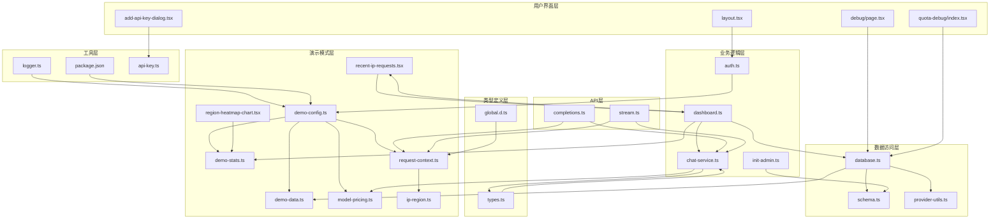

**图表来源**
- [demo-config.ts:1-57](file://src/lib/demo-config.ts#L1-L57)
- [demo-data.ts:1-457](file://src/lib/demo-data.ts#L1-L457)
- [dashboard.ts:1-513](file://src/server/api/routers/dashboard.ts#L1-L513)
- [model-pricing.ts:1-201](file://src/lib/model-pricing.ts#L1-L201)
- [request-context.ts:1-39](file://src/lib/request-context.ts#L1-L39)
- [ip-region.ts:1-101](file://src/lib/ip-region.ts#L1-L101)
- [completions.ts:1-231](file://src/pages/api/ai/chat/completions.ts#L1-L231)
- [stream.ts:1-137](file://src/pages/api/ai/chat/stream.ts#L1-L137)
- [global.d.ts:1-28](file://src/global.d.ts#L1-L28)
- [types.ts:1-121](file://src/lib/types.ts#L1-L121)

依赖关系的特点：

1. **单向依赖**：演示模式层依赖于数据访问层，但不反向依赖
2. **接口隔离**：各层通过清晰的接口进行通信
3. **配置驱动**：演示模式状态通过配置文件控制
4. **渐进增强**：从简单到复杂的依赖层次
5. **可视化集成**：区域热力图组件与统计服务深度集成
6. **定价服务集成**：聊天服务与模型定价服务紧密耦合
7. **UI组件集成**：最近IP请求组件与仪表板路由深度集成
8. **类型安全集成**：全局类型扩展与请求上下文管理集成
9. **API集成**：聊天服务与请求上下文管理集成

**章节来源**
- [package.json:20-72](file://package.json#L20-L72)

## 性能考虑

演示模式系统在性能方面具有显著优势：

### 内存优化
- 所有数据存储在内存中，避免数据库连接开销
- 使用 Map 数据结构提供 O(1) 的查找性能
- 自动垃圾回收机制确保内存使用效率

### 并发处理
- 支持高并发的内存数据访问
- 无锁设计减少并发冲突
- 异步操作提升响应速度

### 缓存策略
- 内存中的数据天然具备缓存效果
- **新增** 定价缓存机制优化成本计算性能
- **新增** 请求上下文缓存减少重复计算
- 减少网络延迟和数据库查询时间
- 适合开发和测试场景的快速迭代

### 开发效率
- 演示模式脚本提供快速启动能力
- 无需数据库配置即可开发
- 支持热重载和实时调试

### 区域数据优化
- **更新** 地区数据生成采用高效的随机分布算法
- **更新** 区域映射使用 Set 和 Map 数据结构优化查找性能
- **更新** 统计计算采用一次遍历完成多个聚合操作
- **新增** 定价计算使用缓存机制提升性能
- **新增** 请求上下文提取使用缓存机制提升性能

### 成本计算优化
- **新增** 定价缓存减少重复计算
- **新增** 模糊匹配优化模型名称查找
- **新增** 默认定价提供快速回退机制

### 日期范围过滤优化
- **新增** 演示统计服务支持高效的日期范围过滤
- **新增** 内存数据结构优化时间范围查询性能
- **新增** 与生产模式保持一致的过滤逻辑

### 请求上下文优化
- **新增** IP地址提取使用缓存机制
- **新增** 区域查询使用IP2Region实例缓存
- **新增** 请求上下文中间件提供高性能的请求处理

### API处理优化
- **新增** 流式响应处理优化内存使用
- **新增** 统一的错误处理机制
- **新增** 类型安全的请求处理流程

## 故障排除指南

### 常见问题及解决方案

1. **演示模式未正确启用**
   - 检查环境变量 `NEXT_PUBLIC_DEMO_MODE` 和 `DEMO_MODE`
   - 确认值设置为 `true`
   - 验证环境变量在构建时可用

2. **数据重置问题**
   - 检查 `DEMO_RESET_INTERVAL` 设置
   - 确认定时器正常工作
   - 验证重置逻辑的执行

3. **权限控制异常**
   - 检查 `DEMO_ALLOW_MUTATIONS` 配置
   - 验证权限检查函数的调用
   - 确认演示用户凭据正确

4. **统计数据显示异常**
   - 检查演示数据的生成逻辑
   - 验证统计计算方法
   - 确认时间范围参数正确

5. **区域分布显示问题**
   - **更新** 检查地区名称映射配置
   - 验证中国省份和国际地区的数据完整性
   - 确认 ECharts 地图数据加载成功

6. **定价配置问题**
   - **新增** 检查API Key的定价字段设置
   - 验证定价数值的有效性和精度
   - 确认默认定价和自定义定价的优先级

7. **成本计算异常**
   - **新增** 检查模型定价缓存状态
   - 验证Token数量和定价的乘法计算
   - 确认成本格式化和精度控制

8. **日期范围过滤问题**
   - **新增** 检查演示统计服务的日期参数传递
   - 验证日期范围的边界条件处理
   - 确认与生产模式的过滤逻辑一致性

9. **请求上下文提取失败**
   - **新增** 检查代理头配置
   - 验证IP地址提取逻辑
   - 确认区域查询功能正常

10. **API请求处理异常**
    - **新增** 检查请求上下文中间件配置
    - 验证请求验证逻辑
    - 确认流式响应处理正常

11. **开发脚本问题**
    - 检查 npm 脚本配置
    - 确认环境变量正确设置
    - 验证演示模式脚本的执行

12. **最近IP请求显示问题**
    - **新增** 检查日期范围参数的传递
    - 验证IP请求记录的数据格式
    - 确认分页功能的正常运行

**章节来源**
- [demo-config.ts:32-36](file://src/lib/demo-config.ts#L32-L36)
- [demo-config.ts:39-51](file://src/lib/demo-config.ts#L39-L51)
- [package.json:6-18](file://package.json#L6-L18)
- [request-context.ts:9-19](file://src/lib/request-context.ts#L9-L19)
- [ip-region.ts:24-78](file://src/lib/ip-region.ts#L24-L78)

### 调试技巧

1. **启用详细日志**
   - 在演示模式下增加日志输出
   - 监控数据访问和操作记录
   - 跟踪权限检查过程

2. **性能监控**
   - 监控内存使用情况
   - 分析数据访问模式
   - 评估统计计算性能

3. **数据一致性检查**
   - 验证内存数据与演示数据的一致性
   - 检查数据转换过程
   - 确认类型安全

4. **区域数据调试**
   - **更新** 检查地区分布的70/30比例是否正确
   - 验证中国省份和国际地区的数据完整性
   - 确认区域映射的准确性

5. **定价配置调试**
   - **新增** 检查API Key的定价字段是否正确保存
   - 验证成本计算公式的准确性
   - 确认定价缓存的更新机制

6. **日期范围过滤调试**
   - **新增** 检查演示统计服务的日期参数处理
   - 验证时间范围查询的边界条件
   - 确认与生产模式的逻辑一致性

7. **请求上下文调试**
   - **新增** 检查代理头的正确提取
   - 验证IP地址和区域信息的准确性
   - 确认类型扩展的正确应用

8. **API处理调试**
   - **新增** 使用 `npm run dev:demo` 启动演示模式
   - 检查环境变量注入
   - 验证演示模式功能

9. **开发脚本调试**
   - 使用 `npm run dev:demo` 启动演示模式
   - 检查环境变量注入
   - 验证演示模式功能

## 结论

演示模式系统为 AIGate AI 网关管理系统提供了强大的演示和测试能力。通过精心设计的架构，系统实现了演示模式与真实模式的无缝切换，并集成了现代化的请求上下文管理系统，既保证了功能的完整性，又提供了优秀的用户体验。

**更新** 系统现已集成九个核心组件，包括请求上下文管理系统、演示统计服务现代化改造、增强的定价配置支持等，形成了完整的演示模式生态系统。

系统的主要优势包括：

1. **开发友好**：无需数据库即可体验完整功能
2. **配置灵活**：支持多种配置选项和权限控制
3. **性能优异**：内存存储提供快速响应
4. **扩展性强**：清晰的架构便于功能扩展
5. **维护简便**：单一职责的模块设计降低维护成本
6. **开发高效**：专门的开发脚本提升开发效率
7. **调试便利**：完整的调试工具链支持
8. **真实场景模拟**：70/30的地区分布比例模拟真实使用场景
9. **可视化支持**：完整的区域热力图展示功能
10. **新增** 完整的定价支持：**新增** 支持API Key级别的自定义定价配置
11. **新增** 成本计算能力：**新增** 集成模型定价服务，支持精确的成本统计
12. **新增** 日期范围过滤功能：**新增** 演示统计服务支持按日期范围精确过滤，与生产模式保持一致的逻辑
13. **新增** 统一的请求上下文管理：**新增** 提供标准化的客户端IP地址和区域信息提取
14. **新增** 现代化的API处理流程：**新增** 支持流式和非流式响应，集成请求上下文管理
15. **新增** 增强的类型安全：**新增** 完整的类型定义系统，确保编译时类型检查

**更新** 演示模式系统现已支持：
- 12个中国主要省份的完整地区覆盖
- 8个国际主要国家的地区支持
- 70/30的真实使用场景分布比例
- 完整的中英文地区名称映射
- 可视化的区域热力图展示
- **新增** 完整的API Key定价配置功能
- **新增** 模型定价计算和缓存机制
- **新增** 成本统计和分析功能
- **新增** 与生产模式一致的日期范围过滤功能
- **新增** 最近IP请求记录的可视化展示
- **新增** 统一的请求上下文管理系统
- **新增** 现代化的API请求处理流程
- **新增** 增强的类型定义系统

演示模式系统不仅提升了开发效率，也为用户提供了直观的功能预览，是现代 Web 应用开发中不可或缺的重要组件。随着功能的不断完善和优化，演示模式系统将继续为 AIGate 项目的开发和部署提供强有力的支持。

**新增** 请求上下文管理系统、演示统计功能现代化改造和增强的定价配置支持的集成，使得演示模式系统能够更好地模拟真实的请求处理场景和成本计算需求，为用户提供了更加完整和实用的演示体验。通过支持统一的客户端信息提取、完整的成本统计和精确的日期范围查询，系统能够适应各种复杂的业务场景需求，为实际生产环境的部署提供了有力的技术支撑。