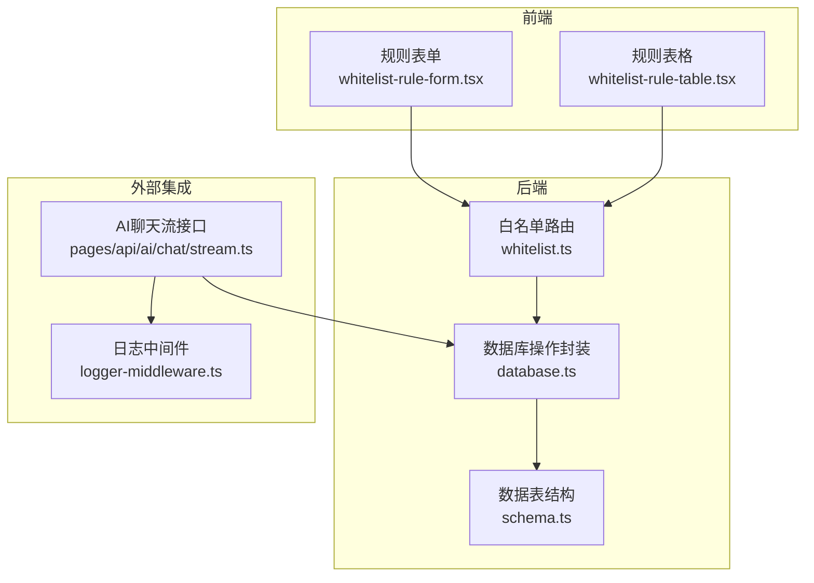
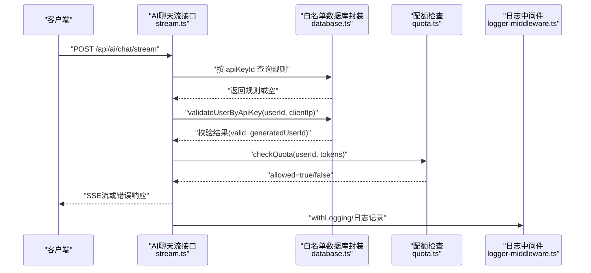
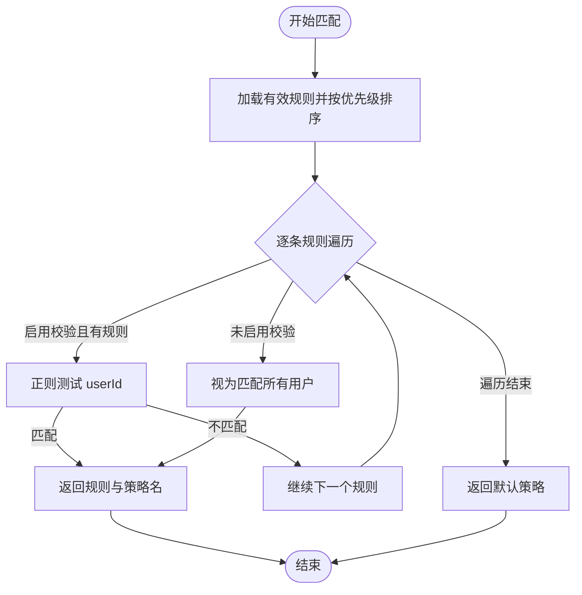
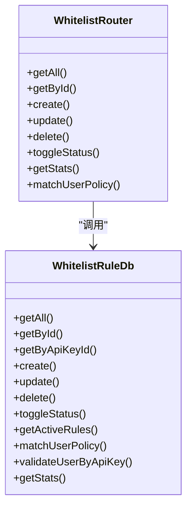
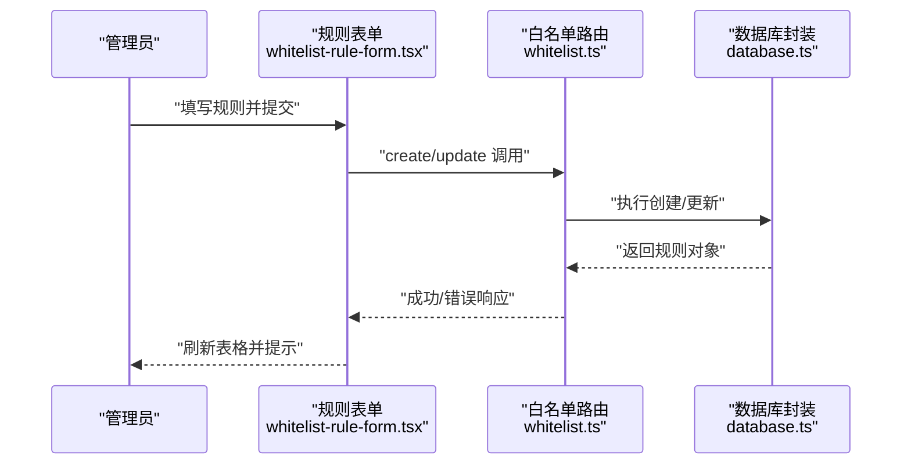
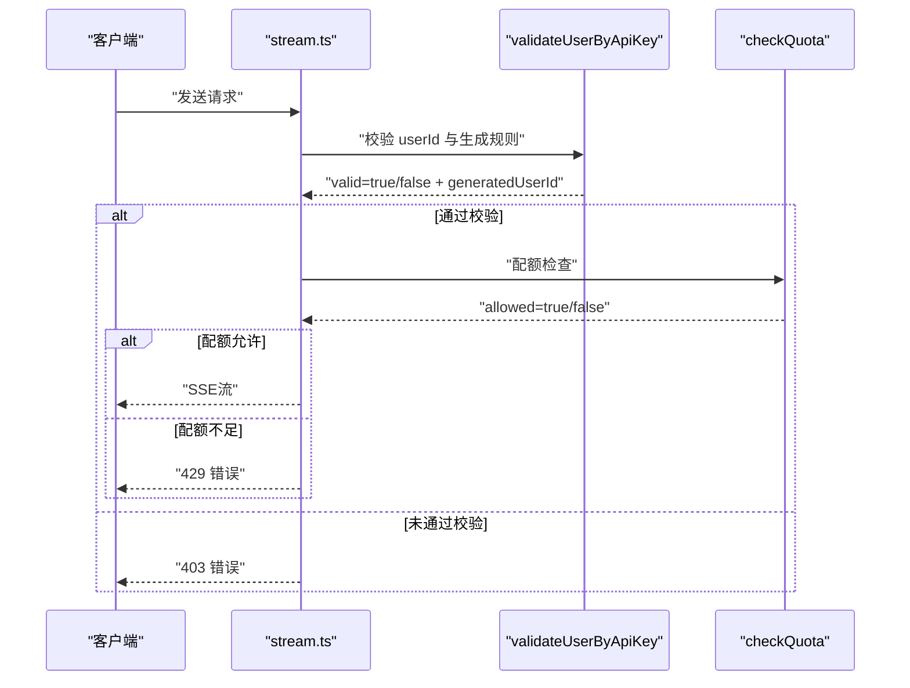
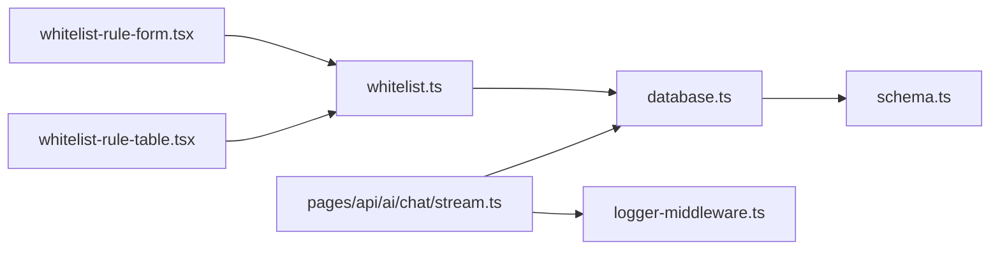

# 白名单控制

<cite>
**本文引用的文件**
- [src/server/api/routers/whitelist.ts](file://src/server/api/routers/whitelist.ts)
- [src/lib/database.ts](file://src/lib/database.ts)
- [src/lib/schema.ts](file://src/lib/schema.ts)
- [src/app/(dashboard)/users/components/whitelist-rule-form.tsx](file://src/app/(dashboard)/users/components/whitelist-rule-form.tsx)
- [src/app/(dashboard)/users/components/whitelist-rule-table.tsx](file://src/app/(dashboard)/users/components/whitelist-rule-table.tsx)
- [src/pages/api/ai/chat/stream.ts](file://src/pages/api/ai/chat/stream.ts)
- [src/lib/logger-middleware.ts](file://src/lib/logger-middleware.ts)
- [README.md](file://README.md)
- [readme/project-description.md](file://readme/project-description.md)
</cite>

## 目录
1. [简介](#简介)
2. [项目结构](#项目结构)
3. [核心组件](#核心组件)
4. [架构总览](#架构总览)
5. [详细组件分析](#详细组件分析)
6. [依赖关系分析](#依赖关系分析)
7. [性能考量](#性能考量)
8. [故障排查指南](#故障排查指南)
9. [结论](#结论)
10. [附录](#附录)

## 简介
本技术文档围绕白名单控制系统展开，系统通过“白名单规则”对用户访问进行精细化控制，涵盖规则配置、匹配算法、访问控制机制、动态规则更新、优先级处理、匹配性能优化、以及与配额控制的协同工作。文档同时提供规则配置示例与使用场景，帮助管理员建立有效的访问控制策略并确保系统安全稳定运行。

## 项目结构
白名单控制涉及三层协作：
- 前端管理界面：规则表单与表格组件，支持规则创建、编辑、启用/禁用与删除。
- 后端 API 层：提供白名单规则的 CRUD、状态切换、策略匹配等接口。
- 数据层：规则持久化、匹配逻辑与统计信息查询。

图表来源
- [src/app/(dashboard)/users/components/whitelist-rule-form.tsx](file://src/app/(dashboard)/users/components/whitelist-rule-form.tsx#L1-L531)
- [src/app/(dashboard)/users/components/whitelist-rule-table.tsx](file://src/app/(dashboard)/users/components/whitelist-rule-table.tsx#L1-L168)
- [src/server/api/routers/whitelist.ts](file://src/server/api/routers/whitelist.ts#L1-L222)
- [src/lib/database.ts](file://src/lib/database.ts#L292-L579)
- [src/lib/schema.ts](file://src/lib/schema.ts#L85-L98)
- [src/pages/api/ai/chat/stream.ts](file://src/pages/api/ai/chat/stream.ts#L1-L184)
- [src/lib/logger-middleware.ts](file://src/lib/logger-middleware.ts#L1-L138)

章节来源
- [src/server/api/routers/whitelist.ts](file://src/server/api/routers/whitelist.ts#L1-L222)
- [src/lib/database.ts](file://src/lib/database.ts#L292-L579)
- [src/lib/schema.ts](file://src/lib/schema.ts#L85-L98)
- [src/app/(dashboard)/users/components/whitelist-rule-form.tsx](file://src/app/(dashboard)/users/components/whitelist-rule-form.tsx#L1-L531)
- [src/app/(dashboard)/users/components/whitelist-rule-table.tsx](file://src/app/(dashboard)/users/components/whitelist-rule-table.tsx#L1-L168)
- [src/pages/api/ai/chat/stream.ts](file://src/pages/api/ai/chat/stream.ts#L1-L184)
- [src/lib/logger-middleware.ts](file://src/lib/logger-middleware.ts#L1-L138)

## 核心组件
- 白名单规则表结构：包含策略名、优先级、状态、校验规则、用户ID生成规则、是否启用校验、关联API Key等字段。
- 规则管理 API：提供获取全部/按ID获取、创建、更新、删除、切换状态、统计、用户策略匹配等能力。
- 匹配与校验逻辑：按优先级顺序遍历有效规则，支持正则校验与占位符生成用户ID；支持按API Key精确匹配规则。
- 前端表单与表格：提供规则配置、预设模板、快捷插入、键盘导航与状态切换。
- 与配额控制协同：在AI聊天流接口中，先校验白名单规则再进行配额检查，确保访问控制与用量限制双保险。

章节来源
- [src/lib/schema.ts](file://src/lib/schema.ts#L85-L98)
- [src/server/api/routers/whitelist.ts](file://src/server/api/routers/whitelist.ts#L22-L221)
- [src/lib/database.ts](file://src/lib/database.ts#L421-L545)
- [src/app/(dashboard)/users/components/whitelist-rule-form.tsx](file://src/app/(dashboard)/users/components/whitelist-rule-form.tsx#L128-L527)
- [src/app/(dashboard)/users/components/whitelist-rule-table.tsx](file://src/app/(dashboard)/users/components/whitelist-rule-table.tsx#L28-L164)
- [src/pages/api/ai/chat/stream.ts](file://src/pages/api/ai/chat/stream.ts#L32-L49)

## 架构总览
白名单控制贯穿“前端配置—后端校验—接口拦截—用量统计”的闭环。下图展示了从请求进入系统到完成白名单校验的关键路径。

图表来源
- [src/pages/api/ai/chat/stream.ts](file://src/pages/api/ai/chat/stream.ts#L32-L86)
- [src/lib/database.ts](file://src/lib/database.ts#L456-L545)
- [src/lib/logger-middleware.ts](file://src/lib/logger-middleware.ts#L32-L67)

## 详细组件分析

### 白名单规则表与匹配算法
- 表结构要点
  - 策略名、描述、优先级、状态、校验规则、用户ID生成规则、是否启用校验、关联API Key。
  - 优先级字段用于决定匹配顺序，数值越大优先级越高。
- 匹配算法
  - 获取所有有效规则并按优先级降序排列。
  - 若规则启用校验且存在校验规则，则使用正则匹配用户ID；否则视为匹配所有用户。
  - 默认策略兜底：若无规则匹配，返回默认策略。
- 用户ID生成
  - 当配置了用户ID生成规则时，支持占位符替换（如@user_id、@api_key、@ip、@any），生成最终的用户ID用于后续配额统计与审计。

图表来源
- [src/lib/database.ts](file://src/lib/database.ts#L421-L449)

章节来源
- [src/lib/schema.ts](file://src/lib/schema.ts#L85-L98)
- [src/lib/database.ts](file://src/lib/database.ts#L408-L449)

### API 路由与规则管理
- 提供的接口
  - 获取全部规则、按ID获取、创建、更新、删除、切换状态、统计、用户策略匹配。
- 关键约束
  - 每个API Key只能绑定一个白名单规则；更新时若目标API Key已被其他规则绑定则拒绝。
  - 创建/更新时将布尔型“启用校验”转换为整型存储。
- 错误处理
  - 使用统一的TRPC错误类型返回，便于前端提示与日志追踪。

图表来源
- [src/server/api/routers/whitelist.ts](file://src/server/api/routers/whitelist.ts#L22-L221)
- [src/lib/database.ts](file://src/lib/database.ts#L293-L579)

章节来源
- [src/server/api/routers/whitelist.ts](file://src/server/api/routers/whitelist.ts#L22-L221)
- [src/lib/database.ts](file://src/lib/database.ts#L317-L393)

### 前端规则表单与表格
- 表单特性
  - 策略选择、描述、优先级、关联API Key、用户ID生成规则、启用校验开关、校验规则。
  - 内置预设模板（如@ip、@email、@uuid、@any等），支持快捷插入与键盘导航。
- 表格特性
  - 展示优先级、策略名、描述、校验规则状态、状态按钮、创建时间与操作列。
  - 支持按优先级排序与状态切换。

图表来源
- [src/app/(dashboard)/users/components/whitelist-rule-form.tsx](file://src/app/(dashboard)/users/components/whitelist-rule-form.tsx#L128-L282)
- [src/server/api/routers/whitelist.ts](file://src/server/api/routers/whitelist.ts#L67-L148)
- [src/lib/database.ts](file://src/lib/database.ts#L354-L393)

章节来源
- [src/app/(dashboard)/users/components/whitelist-rule-form.tsx](file://src/app/(dashboard)/users/components/whitelist-rule-form.tsx#L128-L527)
- [src/app/(dashboard)/users/components/whitelist-rule-table.tsx](file://src/app/(dashboard)/users/components/whitelist-rule-table.tsx#L28-L164)

### 访问控制与实时生效机制
- 在AI聊天流接口中，请求到达后：
  - 先按API Key精确匹配白名单规则，并检查规则状态是否为“激活”。
  - 使用规则中的校验规则与用户ID生成规则进行校验，生成最终用户ID。
  - 通过校验后，再进行配额检查，最后返回SSE流。
- 实时生效：规则变更后，新请求将立即使用最新规则；历史请求不受影响。

图表来源
- [src/pages/api/ai/chat/stream.ts](file://src/pages/api/ai/chat/stream.ts#L32-L86)
- [src/lib/database.ts](file://src/lib/database.ts#L456-L545)

章节来源
- [src/pages/api/ai/chat/stream.ts](file://src/pages/api/ai/chat/stream.ts#L32-L86)
- [src/lib/database.ts](file://src/lib/database.ts#L456-L545)

### 规则优先级处理与匹配性能优化
- 优先级处理
  - 规则按优先级降序排列，优先匹配高优先级规则；启用校验的规则优先进行正则匹配。
- 性能优化建议
  - 将常用规则置于高优先级，减少正则匹配次数。
  - 控制校验规则复杂度，避免回溯风险。
  - 在数据库侧对规则状态与优先级建立索引（建议在schema层面补充索引定义）。
  - 对频繁使用的策略匹配结果进行短期缓存（可在应用层引入缓存层）。

章节来源
- [src/lib/database.ts](file://src/lib/database.ts#L408-L419)
- [src/lib/schema.ts](file://src/lib/schema.ts#L85-L98)

### 动态规则更新与批量导入导出
- 动态更新
  - 通过管理界面的表单进行创建/更新/删除/切换状态，接口层提供统一入口，实时生效。
- 批量导入导出
  - 当前仓库未提供专门的批量导入导出接口；可通过以下方式扩展：
    - 在后端新增批量导入/导出接口，支持CSV/JSON格式。
    - 导入时进行重复键（API Key）冲突检测与校验规则合法性校验。
    - 导出时输出规则清单（含策略名、优先级、状态、校验规则、用户ID生成规则、关联API Key等）。

章节来源
- [src/server/api/routers/whitelist.ts](file://src/server/api/routers/whitelist.ts#L67-L192)
- [src/app/(dashboard)/users/components/whitelist-rule-form.tsx](file://src/app/(dashboard)/users/components/whitelist-rule-form.tsx#L128-L282)

### 规则配置示例与使用场景
- 示例一：按IP白名单
  - 策略名：内网访问
  - 优先级：5
  - 启用校验：是
  - 校验规则：@ip（使用内置占位符）
  - 用户ID生成规则：@ip（将用户ID映射为客户端IP）
  - 关联API Key：特定业务API Key
- 示例二：按邮箱域名白名单
  - 策略名：企业邮箱白名单
  - 优先级：4
  - 启用校验：是
  - 校验规则：@email_domain（使用内置占位符）
  - 用户ID生成规则：@user_id（保持原用户ID）
  - 关联API Key：对应企业API Key
- 示例三：默认策略
  - 策略名：默认策略
  - 优先级：1
  - 启用校验：否
  - 作用：兜底策略，未命中其他规则时使用。

章节来源
- [src/app/(dashboard)/users/components/whitelist-rule-form.tsx](file://src/app/(dashboard)/users/components/whitelist-rule-form.tsx#L50-L126)
- [src/lib/database.ts](file://src/lib/database.ts#L421-L449)

## 依赖关系分析
- 组件耦合
  - 路由层依赖数据库封装；数据库封装依赖表结构定义；前端表单与表格依赖路由提供的接口。
- 外部依赖
  - AI聊天流接口依赖配额检查模块；日志中间件贯穿请求生命周期。
- 循环依赖
  - 未发现循环依赖迹象；模块职责清晰，接口边界明确。

图表来源
- [src/app/(dashboard)/users/components/whitelist-rule-form.tsx](file://src/app/(dashboard)/users/components/whitelist-rule-form.tsx#L1-L531)
- [src/app/(dashboard)/users/components/whitelist-rule-table.tsx](file://src/app/(dashboard)/users/components/whitelist-rule-table.tsx#L1-L168)
- [src/server/api/routers/whitelist.ts](file://src/server/api/routers/whitelist.ts#L1-L222)
- [src/lib/database.ts](file://src/lib/database.ts#L292-L579)
- [src/lib/schema.ts](file://src/lib/schema.ts#L85-L98)
- [src/pages/api/ai/chat/stream.ts](file://src/pages/api/ai/chat/stream.ts#L1-L184)
- [src/lib/logger-middleware.ts](file://src/lib/logger-middleware.ts#L1-L138)

章节来源
- [src/server/api/routers/whitelist.ts](file://src/server/api/routers/whitelist.ts#L1-L222)
- [src/lib/database.ts](file://src/lib/database.ts#L292-L579)
- [src/lib/schema.ts](file://src/lib/schema.ts#L85-L98)
- [src/pages/api/ai/chat/stream.ts](file://src/pages/api/ai/chat/stream.ts#L1-L184)
- [src/lib/logger-middleware.ts](file://src/lib/logger-middleware.ts#L1-L138)

## 性能考量
- 匹配顺序与复杂度
  - 优先级排序与正则匹配的组合应尽量减少不必要的计算；对高频规则采用更严格的校验规则。
- 存储与索引
  - 建议在规则状态与优先级字段上建立索引，提升查询效率。
- 缓存策略
  - 对热点策略匹配结果进行短期缓存，降低数据库压力。
- 日志与监控
  - 使用日志中间件记录关键路径耗时与错误，便于定位性能瓶颈。

## 故障排查指南
- 常见错误与原因
  - API Key未绑定白名单规则：接口返回403，提示未绑定有效规则。
  - 规则未激活：接口返回403，提示规则未激活。
  - 校验规则无效或不匹配：接口返回403，提示用户ID不符合格式。
  - 配额不足：接口返回429，提示配额已用完。
- 排查步骤
  - 检查规则状态与优先级是否正确。
  - 校验校验规则是否为有效正则表达式。
  - 确认API Key与规则的绑定关系是否冲突。
  - 查看日志中间件输出，定位具体失败环节。
- 相关参考
  - AI聊天流接口的错误处理与日志记录。

章节来源
- [src/pages/api/ai/chat/stream.ts](file://src/pages/api/ai/chat/stream.ts#L36-L49)
- [src/lib/logger-middleware.ts](file://src/lib/logger-middleware.ts#L32-L67)

## 结论
白名单控制系统通过“规则优先级+正则校验+用户ID生成”的组合，实现了灵活而强大的访问控制。配合配额检查与日志记录，系统在保障安全的同时具备良好的可观测性与可维护性。建议在生产环境中结合缓存与索引策略进一步优化性能，并通过管理界面实现规则的动态治理与实时生效。

## 附录
- 快速开始与API参考
  - 参考项目README中的API示例与部署说明，了解系统整体能力与调用方式。
- 产品背景与适用场景
  - 参考项目描述文档，了解系统在SaaS、教育平台、内部工具等场景的应用价值。

章节来源
- [README.md](file://README.md#L52-L82)
- [readme/project-description.md](file://readme/project-description.md#L57-L103)