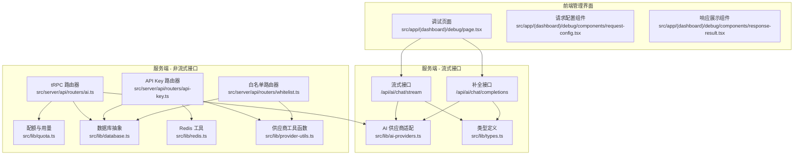
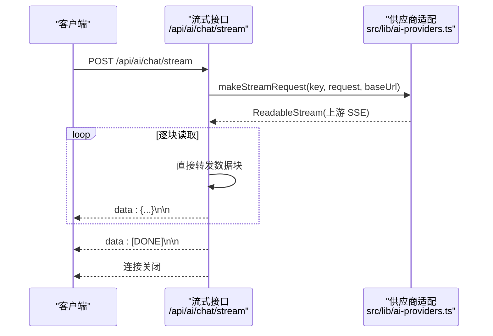
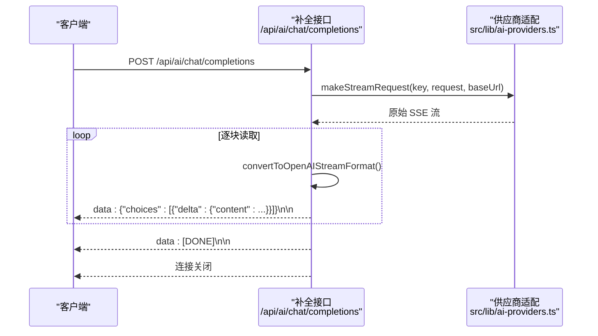
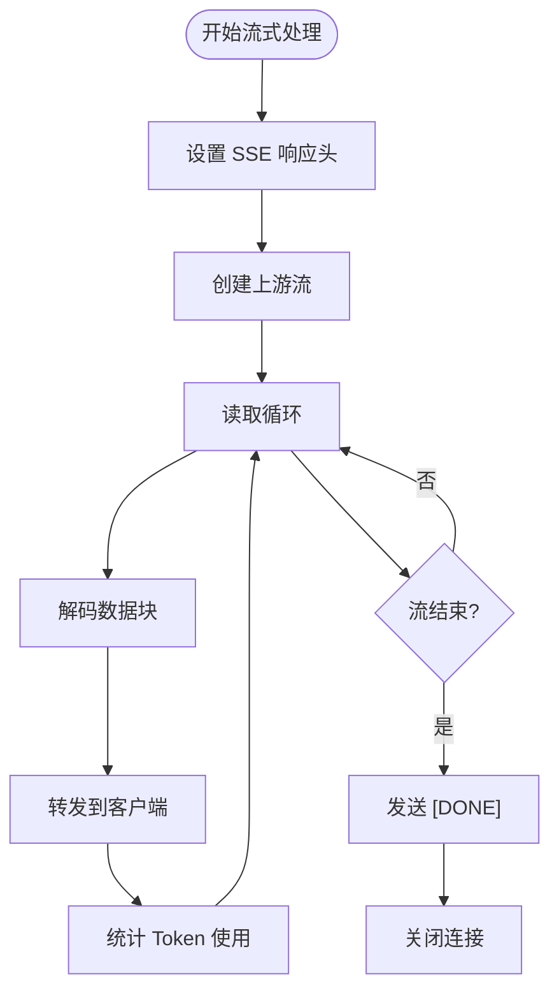
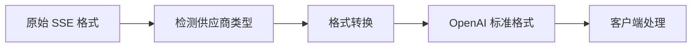

# 流式聊天接口

<cite>
**本文档引用的文件**
- [src/pages/api/ai/chat/stream.ts](file://src/pages/api/ai/chat/stream.ts)
- [src/pages/api/ai/chat/completions.ts](file://src/pages/api/ai/chat/completions.ts)
- [src/lib/ai-providers.ts](file://src/lib/ai-providers.ts)
- [src/lib/types.ts](file://src/lib/types.ts)
- [docs/ai-api.md](file://docs/ai-api.md)
- [src/app/(dashboard)/debug/page.tsx](file://src/app/(dashboard)/debug/page.tsx)
- [src/app/(dashboard)/debug/components/request-config.tsx](file://src/app/(dashboard)/debug/components/request-config.tsx)
- [src/app/(dashboard)/debug/components/response-result.tsx](file://src/app/(dashboard)/debug/components/response-result.tsx)
</cite>

## 更新摘要
**所做更改**
- 新增了两个并行的流式聊天接口实现，提供更完整的 OpenAI 兼容格式支持
- 增强了 SSE 协议支持和流式响应处理机制
- 完善了供应商格式转换和统一输出格式
- 更新了流式接口的详细实现和最佳实践

## 目录
1. [简介](#简介)
2. [项目结构](#项目结构)
3. [核心组件](#核心组件)
4. [架构总览](#架构总览)
5. [详细组件分析](#详细组件分析)
6. [OpenAI 兼容格式支持](#openai-兼容格式支持)
7. [SSE 协议实现](#sse-协议实现)
8. [供应商格式转换](#供应商格式转换)
9. [性能考量](#性能考量)
10. [故障排查指南](#故障排查指南)
11. [结论](#结论)
12. [附录](#附录)

## 简介
本文件面向 AIGate 的流式聊天接口，系统性阐述基于 Server-Sent Events（SSE）的实现原理与工程实践，覆盖以下主题：
- **双接口架构**：同时支持 `/api/ai/chat/stream` 和 `/api/ai/chat/completions` 两个流式聊天端点
- **OpenAI 兼容格式**：完全符合 OpenAI 标准的流式响应格式，包括 SSE 协议支持
- **SSE 流式数据传输机制**：连接管理、错误处理策略和实时渲染优化
- **供应商格式转换**：统一多家 AI 供应商的流式响应格式
- **流式响应处理流程**：数据分块、缓冲与实时渲染优化
- **安全与治理**：身份认证、速率限制、会话管理与配额控制
- **前端集成示例**：EventSource API 和 fetch + ReadableStream 的完整实现
- **性能监控指标**：延迟优化与带宽管理策略
- **调试工具与故障排除**：详细的调试方法和问题诊断

## 项目结构
AIGate 的流式聊天由三层协作构成，现在提供两个并行的流式接口实现：
- **服务端 API 层**：Next.js Pages API 路由负责鉴权、配额与 SSE 响应头设置，将上游供应商流式数据透传给客户端
- **业务逻辑层**：tRPC 路由器提供非流式聊天能力与模型查询、配额估算等辅助能力
- **前端管理界面**：提供调试工具和实时响应展示



**图表来源**
- [src/pages/api/ai/chat/stream.ts](file://src/pages/api/ai/chat/stream.ts#L1-L184)
- [src/pages/api/ai/chat/completions.ts](file://src/pages/api/ai/chat/completions.ts#L1-L350)
- [src/lib/ai-providers.ts](file://src/lib/ai-providers.ts#L1-L759)
- [src/lib/types.ts](file://src/lib/types.ts#L1-L118)

## 核心组件
- **流式接口实现**
  - `/api/ai/chat/stream`：直接透传上游供应商的 SSE 流，无需格式转换
  - `/api/ai/chat/completions`：将上游供应商的流式响应转换为 OpenAI 标准格式
- **AI 供应商适配层**
  - 统一抽象 makeRequest/makeStreamRequest/estimateTokens 接口
  - 内置 OpenAI、Anthropic、Google、DeepSeek、Moonshot、Spark 等多家供应商
  - 对上游 SSE 响应进行格式统一，输出标准化的 SSE 数据块
- **OpenAI 兼容格式转换**
  - 将不同供应商的原始 SSE 格式转换为统一的 OpenAI 标准格式
  - 支持 content_block_delta、message_stop 等事件类型的转换
- **SSE 协议支持**
  - 完整的 Server-Sent Events 协议实现
  - 支持 data 字段、[DONE] 完成信号和错误处理
- **配额与用量管理**
  - 基于复合标识符的配额检查机制
  - 实时 Token 统计和用量记录
- **错误处理与重试**
  - 完善的异常捕获和错误传播机制
  - 支持断线重连和幂等处理

**章节来源**
- [src/pages/api/ai/chat/stream.ts](file://src/pages/api/ai/chat/stream.ts#L1-L184)
- [src/pages/api/ai/chat/completions.ts](file://src/pages/api/ai/chat/completions.ts#L1-L350)
- [src/lib/ai-providers.ts](file://src/lib/ai-providers.ts#L1-L759)

## 架构总览
AIGate 的流式聊天采用"反向代理 + 供应商适配 + 统一输出"的设计，现在提供两种不同的流式处理策略：



**图表来源**
- [src/pages/api/ai/chat/stream.ts](file://src/pages/api/ai/chat/stream.ts#L105-L145)

另一种实现方式（completions 接口）：



**图表来源**
- [src/pages/api/ai/chat/completions.ts](file://src/pages/api/ai/chat/completions.ts#L158-L196)

## 详细组件分析

### 流式接口实现对比

#### /api/ai/chat/stream 接口
- **直接透传模式**：直接转发上游供应商的 SSE 流，无需格式转换
- **性能优势**：减少一次格式转换开销，延迟更低
- **适用场景**：客户端已经能处理供应商特定的 SSE 格式
- **响应格式**：直接使用供应商的原始 SSE 格式

#### /api/ai/chat/completions 接口  
- **格式转换模式**：将上游供应商的流式响应转换为 OpenAI 标准格式
- **兼容性优势**：完全符合 OpenAI 标准，客户端实现更简单
- **适用场景**：需要统一的 OpenAI 兼容格式的客户端
- **响应格式**：统一的 OpenAI 标准格式

**章节来源**
- [src/pages/api/ai/chat/stream.ts](file://src/pages/api/ai/chat/stream.ts#L105-L145)
- [src/pages/api/ai/chat/completions.ts](file://src/pages/api/ai/chat/completions.ts#L158-L196)

### SSE 协议实现

#### 响应头设置
- **Content-Type**: `text/event-stream;charset=UTF-8`
- **Cache-Control**: `no-cache, no-transform`
- **Connection**: `keep-alive`
- **X-Accel-Buffering**: `no`（禁用 Nginx 缓冲）

#### 数据流处理
- **逐块读取**：使用 `ReadableStream.getReader()` 逐块读取上游数据
- **实时转发**：解码后立即写入响应流
- **完成信号**：发送 `data: [DONE]` 标记流结束
- **错误处理**：捕获异常并发送错误消息



**图表来源**
- [src/pages/api/ai/chat/stream.ts](file://src/pages/api/ai/chat/stream.ts#L113-L145)

**章节来源**
- [src/pages/api/ai/chat/stream.ts](file://src/pages/api/ai/chat/stream.ts#L95-L145)
- [src/pages/api/ai/chat/completions.ts](file://src/pages/api/ai/chat/completions.ts#L148-L196)

### OpenAI 兼容格式支持

#### 格式转换机制
- **统一标准**：将不同供应商的 SSE 格式转换为 OpenAI 标准格式
- **Delta 增量**：只传输变化的部分，支持增量渲染
- **完成标记**：使用 `finish_reason` 字段标记生成完成

#### 转换规则
- **OpenAI 原生**：直接透传，无需转换
- **Anthropic**：`content_block_delta` → `choices[0].delta.content`
- **Google**：`candidates[].content.parts[].text` → `choices[0].delta.content`
- **DeepSeek/Moonshot/Spark**：复用 OpenAI 兼容实现

**章节来源**
- [src/pages/api/ai/chat/completions.ts](file://src/pages/api/ai/chat/completions.ts#L312-L349)
- [src/lib/ai-providers.ts](file://src/lib/ai-providers.ts#L194-L276)

## OpenAI 兼容格式支持

### 标准格式规范
AIGate 的流式聊天接口完全符合 OpenAI 的标准格式规范：

#### 基本响应格式
```json
{
  "id": "chatcmpl-1234567890",
  "object": "chat.completion.chunk",
  "created": 1694268800,
  "model": "gpt-4o",
  "choices": [
    {
      "index": 0,
      "delta": {
        "content": "Hello"
      },
      "finish_reason": null
    }
  ]
}
```

#### 完成信号格式
```json
{
  "id": "chatcmpl-1234567890",
  "object": "chat.completion.chunk", 
  "created": 1694268800,
  "model": "gpt-4o",
  "choices": [
    {
      "index": 0,
      "delta": {},
      "finish_reason": "stop"
    }
  ]
}
```

### 客户端集成示例

#### EventSource API 实现
```javascript
const eventSource = new EventSource('/api/ai/chat/stream?userId=user@example.com&apiKeyId=key-id');

let fullContent = '';

eventSource.addEventListener('message', (event) => {
  if (event.data === '[DONE]') {
    console.log('流式响应完成');
    eventSource.close();
    return;
  }

  try {
    const data = JSON.parse(event.data);
    const content = data.choices?.[0]?.delta?.content;
    if (content) {
      fullContent += content;
      // 实时更新 UI
      document.getElementById('response').textContent = fullContent;
    }
  } catch (e) {
    console.error('解析失败:', e);
  }
});

eventSource.addEventListener('error', (event) => {
  console.error('Stream 错误:', event);
  eventSource.close();
});
```

#### fetch + ReadableStream 实现
```javascript
async function streamChat() {
  const response = await fetch('/api/ai/chat/stream', {
    method: 'POST',
    headers: { 'Content-Type': 'application/json' },
    body: JSON.stringify({
      userId: 'user@example.com',
      apiKeyId: 'key-id-abc123',
      request: {
        model: 'gpt-4o',
        messages: [{ role: 'user', content: '讲个故事' }],
        stream: true,
      },
    }),
  });

  const reader = response.body.getReader();
  const decoder = new TextDecoder();
  let fullContent = '';

  try {
    while (true) {
      const { done, value } = await reader.read();
      if (done) break;

      const chunk = decoder.decode(value);
      const lines = chunk.split('\n');

      for (const line of lines) {
        if (line.startsWith('data: ')) {
          const data = line.slice(6);
          if (data === '[DONE]') {
            console.log('完成');
            return;
          }

          try {
            const parsed = JSON.parse(data);
            const content = parsed.choices?.[0]?.delta?.content;
            if (content) {
              fullContent += content;
              console.log('收到:', content);
            }
          } catch (e) {
            // 忽略解析错误
          }
        }
      }
    }
  } finally {
    reader.releaseLock();
  }
}
```

**章节来源**
- [docs/ai-api.md](file://docs/ai-api.md#L275-L379)
- [src/app/(dashboard)/debug/page.tsx](file://src/app/(dashboard)/debug/page.tsx#L291-L379)

## SSE 协议实现

### 协议特性
- **事件驱动**：基于 Server-Sent Events 协议
- **单向通信**：服务器向客户端推送数据
- **自动重连**：客户端自动处理断线重连
- **心跳机制**：保持连接活跃状态

### 数据格式规范
- **数据行**：`data: <JSON>\n\n`
- **完成标记**：`data: [DONE]\n\n`
- **错误格式**：`data: {"error": "..."}\n\n`

### 连接管理
- **长连接**：保持 HTTP 连接开放
- **超时处理**：支持连接超时和重试
- **资源清理**：确保流结束后正确释放资源

**章节来源**
- [src/pages/api/ai/chat/stream.ts](file://src/pages/api/ai/chat/stream.ts#L95-L145)
- [src/pages/api/ai/chat/completions.ts](file://src/pages/api/ai/chat/completions.ts#L148-L196)

## 供应商格式转换

### 转换策略
AIGate 实现了完整的供应商格式转换机制，确保所有供应商的流式响应都能统一为 OpenAI 标准格式：

#### OpenAI 原生支持
- **直接透传**：OpenAI 原生支持 SSE，无需转换
- **完成信号**：自动添加 `[DONE]` 标记

#### Anthropic 格式转换
- **content_block_delta** → `choices[0].delta.content`
- **message_stop** → `finish_reason: "stop"`
- **事件映射**：将 Anthropic 特定事件转换为通用格式

#### Google 格式转换  
- **candidates[].content.parts[].text** → `choices[0].delta.content`
- **finishReason** → `finish_reason`
- **多候选处理**：只使用第一个候选答案

#### DeepSeek/Moonshot/Spark
- **OpenAI 兼容**：这些供应商使用 OpenAI 兼容 API
- **复用实现**：直接使用 OpenAI 的流式实现



**图表来源**
- [src/lib/ai-providers.ts](file://src/lib/ai-providers.ts#L194-L276)

**章节来源**
- [src/lib/ai-providers.ts](file://src/lib/ai-providers.ts#L102-L282)
- [src/lib/ai-providers.ts](file://src/lib/ai-providers.ts#L284-L469)
- [src/lib/ai-providers.ts](file://src/lib/ai-providers.ts#L471-L685)

## 性能考量

### 延迟优化
- **SSE 禁用缓冲**：`X-Accel-Buffering: no` 确保实时传输
- **逐块处理**：避免整包缓冲，降低首包延迟
- **直连上游**：stream 接口直接透传，减少转换开销
- **连接复用**：长连接避免频繁握手开销

### 带宽管理
- **增量渲染**：只传输变化内容，减少网络传输
- **内存优化**：流式处理避免大对象内存占用
- **压缩支持**：可选的 gzip 压缩（取决于上游供应商）
- **背压处理**：客户端处理慢时自动减缓服务器发送速度

### 配额与限流
- **Token 估算**：预估请求消耗，避免超限
- **RPM 控制**：每分钟请求次数限制
- **复合标识符**：`userId:apiKeyId` 精确配额控制
- **异步记录**：用量记录不影响主流程性能

### 缓存策略
- **API Key 缓存**：Redis 缓存活跃 API Key
- **配额策略缓存**：缓存白名单规则和配额策略
- **供应商响应缓存**：对相同请求的结果进行缓存
- **格式转换缓存**：缓存常用的格式转换结果

**章节来源**
- [src/pages/api/ai/chat/stream.ts](file://src/pages/api/ai/chat/stream.ts#L95-L103)
- [src/pages/api/ai/chat/completions.ts](file://src/pages/api/ai/chat/completions.ts#L148-L156)
- [src/lib/ai-providers.ts](file://src/lib/ai-providers.ts#L709-L735)

## 故障排查指南

### 常见错误与解决方案

#### 405 Method Not Allowed
- **原因**：使用了错误的 HTTP 方法
- **解决**：确保使用 POST 方法调用流式接口

#### 400 缺少必要字段
- **原因**：缺少 `userId`、`apiKeyId` 或 `request` 参数
- **解决**：检查请求体格式，确保所有必需字段都已提供

#### 403 用户校验未通过
- **原因**：用户不在白名单中或被禁用
- **解决**：检查白名单规则配置和用户状态

#### 429 配额不足
- **原因**：达到每日 Token 限制或 RPM 限制
- **解决**：等待配额重置或升级用户配额

#### 501 供应商不支持 stream
- **原因**：供应商未实现流式接口
- **解决**：使用非流式接口或更换供应商

### 调试步骤

#### 前端调试
- **浏览器开发者工具**：查看 Network 面板中的 SSE 连接
- **实时日志**：在控制台中监听 message 事件
- **错误处理**：实现 error 事件处理器

#### 后端调试
- **日志分析**：查看流式处理过程中的关键日志
- **配额检查**：确认配额计算和记录正常
- **供应商状态**：检查上游供应商的健康状态

#### 网络调试
- **代理配置**：确保 Nginx 等代理服务器正确配置
- **缓冲设置**：验证 `X-Accel-Buffering: no` 生效
- **超时设置**：调整连接超时和读取超时

### 常见问题解决

#### SSE 连接不断开
- **检查上游**：确认上游供应商正确发送 `[DONE]` 标记
- **服务端处理**：验证服务端正确转发完成信号
- **客户端处理**：确保客户端正确处理 `[DONE]` 事件

#### 格式转换失败
- **解析错误**：检查上游供应商的 SSE 格式
- **转换逻辑**：验证格式转换函数的正确性
- **兼容性**：确认供应商版本支持流式接口

#### 性能问题
- **连接池**：检查上游供应商的连接池配置
- **内存泄漏**：监控长时间运行的内存使用
- **并发控制**：限制同时处理的流式请求数量

**章节来源**
- [src/pages/api/ai/chat/stream.ts](file://src/pages/api/ai/chat/stream.ts#L16-L184)
- [src/pages/api/ai/chat/completions.ts](file://src/pages/api/ai/chat/completions.ts#L124-L130)
- [docs/ai-api.md](file://docs/ai-api.md#L108-L116)

## 结论
AIGate 的流式聊天接口通过双接口架构和完整的 OpenAI 兼容格式支持，实现了对多家供应商的无缝接入与高效透传。两个并行的流式接口设计提供了灵活性和性能优化的选择：

**双接口架构优势**：
- **性能优化**：`/api/ai/chat/stream` 直接透传，延迟更低
- **兼容性**：`/api/ai/chat/completions` 完全 OpenAI 兼容
- **灵活选择**：根据客户端需求选择合适的接口

**OpenAI 兼容格式**：
- **统一标准**：所有供应商响应格式一致
- **简化集成**：客户端实现更加简单
- **生态兼容**：与现有 OpenAI 生态系统无缝对接

**SSE 协议实现**：
- **实时传输**：低延迟的实时数据传输
- **自动重连**：客户端自动处理断线重连
- **错误处理**：完善的异常捕获和错误传播

**供应商格式转换**：
- **统一输出**：消除供应商差异
- **增量渲染**：支持高效的增量内容显示
- **完成标记**：准确的生成完成信号

**性能优化**：
- **缓冲禁用**：确保实时传输特性
- **逐块处理**：降低内存占用和延迟
- **缓存策略**：提升整体系统性能

## 附录

### 安全与治理

#### 身份认证与会话
- **白名单机制**：基于 `userId` 和 `apiKeyId` 的双重验证
- **API Key 管理**：安全的 API Key 存储和轮换
- **会话保护**：防止会话劫持和滥用

#### 配额与限流
- **复合标识符**：`userId:apiKeyId` 精确配额控制
- **RPM 限制**：每分钟请求次数控制
- **Token 限制**：每日 Token 消耗限制
- **异步记录**：用量记录不影响主流程

#### IP 归属地
- **地理位置**：通过 IP2Region 查询省份信息
- **地域统计**：用于地域维度的使用情况统计

**章节来源**
- [src/lib/types.ts](file://src/lib/types.ts#L64-L77)
- [src/lib/quota.ts](file://src/lib/quota.ts#L1-L327)

### 前端集成与用户体验

#### EventSource API 集成
- **自动重连**：客户端自动处理断线重连
- **错误处理**：完善的错误捕获和处理机制
- **进度显示**：实时显示生成进度和状态

#### fetch + ReadableStream 集成
- **现代浏览器**：支持最新的流式 API
- **自定义处理**：客户端可以完全控制流式处理逻辑
- **错误恢复**：支持手动重试和错误恢复

#### 用户体验优化
- **加载状态**：显示加载动画和进度指示
- **错误提示**：友好的错误信息和恢复建议
- **性能监控**：显示延迟和吞吐量指标

**章节来源**
- [docs/ai-api.md](file://docs/ai-api.md#L291-L476)
- [src/app/(dashboard)/debug/page.tsx](file://src/app/(dashboard)/debug/page.tsx#L291-L379)

### 使用示例与最佳实践

#### 推荐使用场景

##### 使用 /api/ai/chat/stream 接口
- **场景**：客户端能处理供应商特定的 SSE 格式
- **优势**：更低的延迟和更好的性能
- **示例**：自定义 SSE 处理器或特定框架集成

##### 使用 /api/ai/chat/completions 接口
- **场景**：需要完全 OpenAI 兼容的格式
- **优势**：简化客户端实现，更好的生态兼容性
- **示例**：React、Vue 等现代前端框架集成

#### 最佳实践

##### 错误处理
```typescript
// 实现完整的错误处理
const eventSource = new EventSource('/api/ai/chat/stream');

eventSource.addEventListener('error', (event) => {
  console.error('流式连接错误:', event);
  // 实现重连逻辑
  setTimeout(() => {
    window.location.reload();
  }, 3000);
});
```

##### 性能优化
```typescript
// 实现背压处理
const reader = response.body.getReader();
const decoder = new TextDecoder();

while (true) {
  const { done, value } = await reader.read();
  if (done) break;
  
  // 实现节流处理
  await throttleProcessing();
}
```

##### 资源清理
```typescript
// 确保正确清理资源
window.addEventListener('beforeunload', () => {
  eventSource.close();
});
```

**章节来源**
- [docs/ai-api.md](file://docs/ai-api.md#L732-L788)
- [src/pages/api/ai/chat/stream.ts](file://src/pages/api/ai/chat/stream.ts#L171-L175)
- [src/pages/api/ai/chat/completions.ts](file://src/pages/api/ai/chat/completions.ts#L222-L226)