# 液体玻璃确认系统

<cite>
**本文档引用的文件**
- [README.md](file://README.md)
- [package.json](file://package.json)
- [src/lib/schema.ts](file://src/lib/schema.ts)
- [drizzle.config.ts](file://drizzle.config.ts)
- [src/app/layout.tsx](file://src/app/layout.tsx)
- [src/lib/quota.ts](file://src/lib/quota.ts)
- [src/lib/database.ts](file://src/lib/database.ts)
- [src/lib/redis.ts](file://src/lib/redis.ts)
- [src/pages/api/ai/chat/completions.ts](file://src/pages/api/ai/chat/completions.ts)
- [src/server/api/routers/ai.ts](file://src/server/api/routers/ai.ts)
- [src/lib/ai-providers.ts](file://src/lib/ai-providers.ts)
- [src/lib/types.ts](file://src/lib/types.ts)
- [src/app/(dashboard)/page.tsx](file://src/app/(dashboard)/page.tsx)
- [src/server/api/root.ts](file://src/server/api/root.ts)
- [src/components/dashboard-layout.tsx](file://src/components/dashboard-layout.tsx)
</cite>

## 目录
1. [简介](#简介)
2. [项目结构](#项目结构)
3. [核心组件](#核心组件)
4. [架构概览](#架构概览)
5. [详细组件分析](#详细组件分析)
6. [依赖关系分析](#依赖关系分析)
7. [性能考虑](#性能考虑)
8. [故障排除指南](#故障排除指南)
9. [结论](#结论)

## 简介

液体玻璃确认系统是一个基于 Next.js 14 + tRPC + Redis 的智能 AI 网关管理系统。该系统采用现代化的液体玻璃设计语言，支持配额控制和多模型代理，为用户提供安全、高效的 AI 服务访问。

### 主要特性

- **智能配额管理**：基于 Redis 的实时配额检查，支持 Token 和请求次数双重限制
- **多模型代理**：统一接入 OpenAI、Anthropic、Google、DeepSeek 等主流 AI 服务商
- **高性能架构**：tRPC 类型安全 API + Redis 缓存，毫秒级响应
- **现代化界面**：液体玻璃设计语言，支持深色模式自动切换
- **安全认证**：NextAuth.js 身份验证，支持管理员账户动态配置
- **实时监控**：仪表板展示请求趋势、地区分布、IP 记录等关键指标

## 项目结构

该项目采用模块化架构设计，主要分为以下几个核心层次：

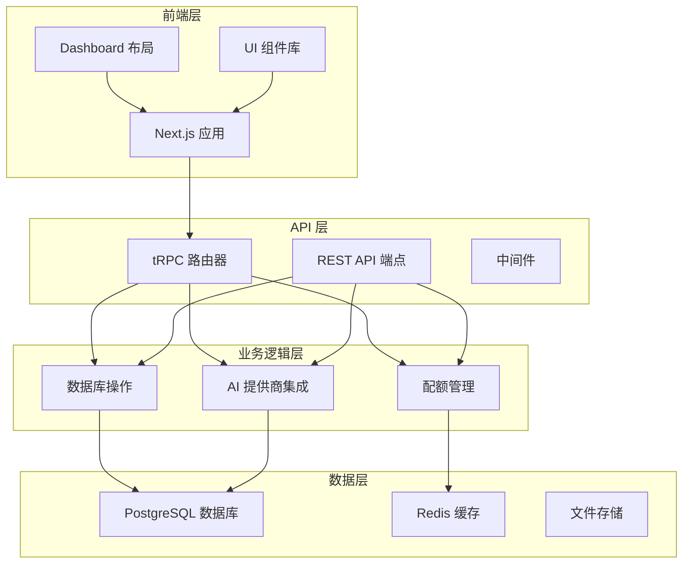

**图表来源**
- [src/app/layout.tsx](file://src/app/layout.tsx#L26-L60)
- [src/server/api/root.ts](file://src/server/api/root.ts#L14-L21)
- [src/lib/database.ts](file://src/lib/database.ts#L1-L692)

**章节来源**
- [README.md](file://README.md#L1-L83)
- [package.json](file://package.json#L1-L91)

## 核心组件

### 数据库架构

系统使用 Drizzle ORM 进行数据库操作，支持 PostgreSQL 数据库的类型安全访问。

#### 核心数据表

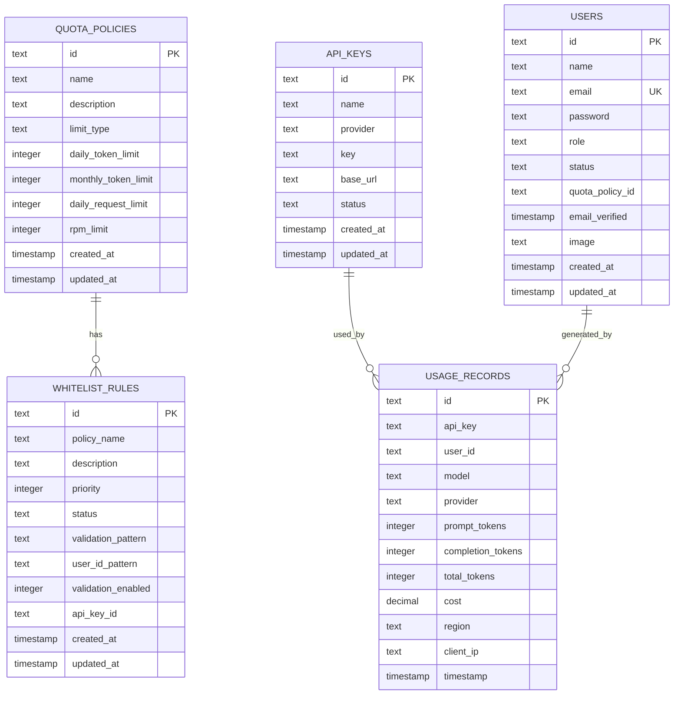

**图表来源**
- [src/lib/schema.ts](file://src/lib/schema.ts#L28-L98)

#### 数据库操作层

系统提供了完整的 CRUD 操作接口，支持以下核心功能：

- **API 密钥管理**：创建、更新、删除和查询 API 密钥
- **配额策略管理**：管理用户配额策略和限制
- **用量记录管理**：跟踪和统计 AI 服务使用情况
- **白名单规则管理**：控制用户访问权限和策略匹配
- **用户管理**：用户注册、认证和权限管理

**章节来源**
- [src/lib/schema.ts](file://src/lib/schema.ts#L1-L162)
- [src/lib/database.ts](file://src/lib/database.ts#L1-L692)

### 配额管理系统

配额管理系统是液体玻璃确认系统的核心组件，负责控制用户对 AI 服务的访问权限和使用限制。

#### 配额检查流程

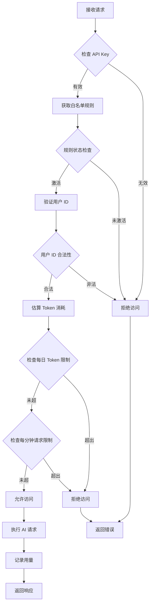

**图表来源**
- [src/lib/quota.ts](file://src/lib/quota.ts#L78-L200)

#### Redis 缓存策略

系统使用 Redis 实现高性能缓存，主要包括：

- **配额策略缓存**：缓存 API Key 对应的配额策略
- **每日用量缓存**：缓存用户的每日 Token 使用量
- **请求次数缓存**：缓存用户的每分钟请求次数
- **API Key 缓存**：缓存活跃的 API Key 信息

**章节来源**
- [src/lib/quota.ts](file://src/lib/quota.ts#L1-L327)
- [src/lib/redis.ts](file://src/lib/redis.ts#L1-L43)

### AI 提供商集成

系统支持多家 AI 服务提供商，通过统一的接口抽象实现标准化访问。

#### 支持的 AI 提供商

| 提供商 | 模型支持 | 流式支持 | 特殊功能 |
|--------|----------|----------|----------|
| OpenAI | gpt-4, gpt-4-turbo, gpt-3.5-turbo | ✅ | 完整功能 |
| Anthropic | claude-3-opus, claude-3-sonnet, claude-3-haiku | ✅ | Claude 系列 |
| Google | gemini-pro, gemini-pro-vision | ✅ | Gemini 系列 |
| DeepSeek | deepseek-chat, deepseek-coder | ✅ | 开源模型 |
| Moonshot | moonshot-v1-8k, moonshot-v1-32k, moonshot-v1-128k | ✅ | 月之暗面 |
| Spark | spark-3.5, spark-3.0, spark-2.0, spark-lite | ✅ | 星火大模型 |

#### 请求处理流程

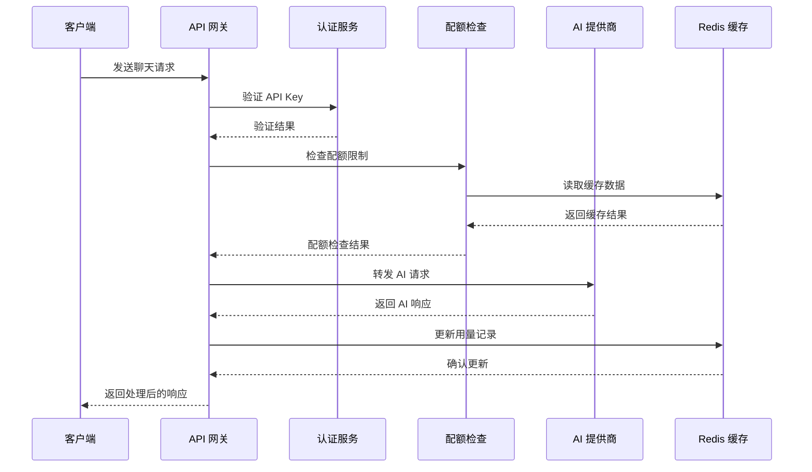

**图表来源**
- [src/pages/api/ai/chat/completions.ts](file://src/pages/api/ai/chat/completions.ts#L10-L131)
- [src/server/api/routers/ai.ts](file://src/server/api/routers/ai.ts#L98-L213)

**章节来源**
- [src/lib/ai-providers.ts](file://src/lib/ai-providers.ts#L1-L759)
- [src/pages/api/ai/chat/completions.ts](file://src/pages/api/ai/chat/completions.ts#L1-L350)

### 仪表板系统

系统提供完整的管理仪表板，展示关键指标和统计数据。

#### 仪表板组件

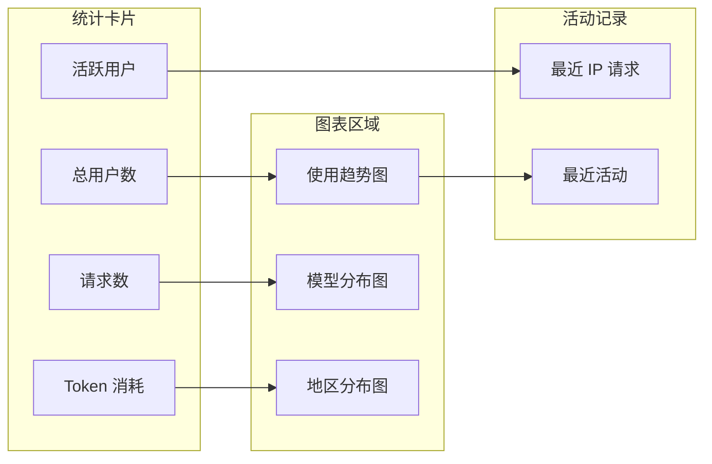

**图表来源**
- [src/app/(dashboard)/page.tsx](file://src/app/(dashboard)/page.tsx#L105-L225)

**章节来源**
- [src/app/(dashboard)/page.tsx](file://src/app/(dashboard)/page.tsx#L1-L230)
- [src/components/dashboard-layout.tsx](file://src/components/dashboard-layout.tsx#L1-L197)

## 架构概览

液体玻璃确认系统采用分层架构设计，确保系统的可维护性和扩展性。

### 整体架构图

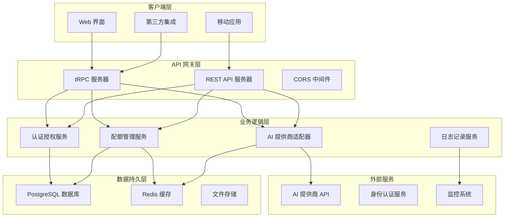

**图表来源**
- [src/server/api/root.ts](file://src/server/api/root.ts#L14-L21)
- [src/app/layout.tsx](file://src/app/layout.tsx#L26-L60)

### 数据流架构

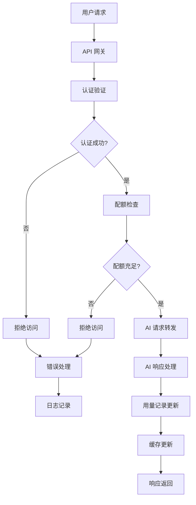

**图表来源**
- [src/pages/api/ai/chat/completions.ts](file://src/pages/api/ai/chat/completions.ts#L20-L131)

**章节来源**
- [src/lib/quota.ts](file://src/lib/quota.ts#L78-L200)
- [src/lib/ai-providers.ts](file://src/lib/ai-providers.ts#L1-L759)

## 详细组件分析

### 配额管理组件

配额管理组件是系统的核心安全机制，确保资源使用的合理控制。

#### 配额策略类型

系统支持两种配额限制模式：

1. **Token 限制模式**：基于 Token 使用量的限制
2. **请求次数限制模式**：基于每日请求次数的限制

#### 配额检查算法

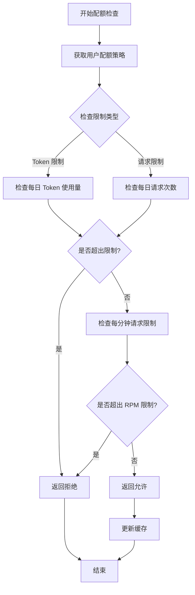

**图表来源**
- [src/lib/quota.ts](file://src/lib/quota.ts#L78-L200)

#### Redis 键命名规范

系统使用标准化的 Redis 键命名规则：

- `user_quota:{userId}:{date}:{apiKey}` - 用户每日 Token 使用量
- `user_requests:{userId}:{date}:{apiKey}` - 用户每日请求次数
- `user_rpm:{userId}:{apiKey}:{minute}` - 用户每分钟请求次数
- `policy:apiKey:{apiKeyId}` - API Key 对应的配额策略
- `api_keys:{provider}` - 提供商的 API Key 缓存

**章节来源**
- [src/lib/quota.ts](file://src/lib/quota.ts#L1-L327)
- [src/lib/redis.ts](file://src/lib/redis.ts#L17-L43)

### 数据库操作组件

数据库操作组件提供完整的数据访问层，支持事务处理和复杂查询。

#### 数据库连接管理

系统使用 Drizzle ORM 进行数据库操作，支持以下特性：

- **类型安全**：编译时类型检查，防止 SQL 注入
- **关系映射**：自动处理表之间的关联关系
- **事务支持**：支持复杂的事务操作
- **查询优化**：自动生成高效的 SQL 查询

#### 数据库迁移

系统使用 Drizzle Kit 进行数据库迁移管理：

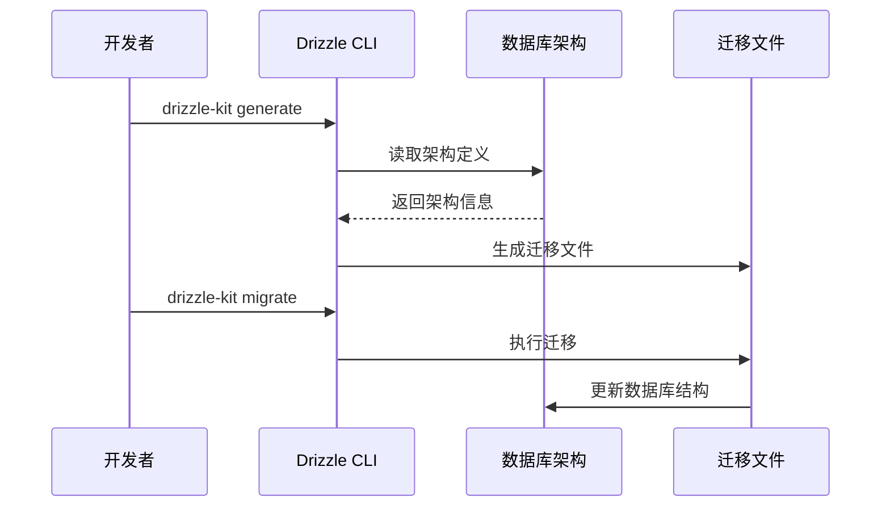

**图表来源**
- [drizzle.config.ts](file://drizzle.config.ts#L1-L11)

**章节来源**
- [src/lib/database.ts](file://src/lib/database.ts#L1-L692)
- [drizzle.config.ts](file://drizzle.config.ts#L1-L11)

### API 网关组件

API 网关组件提供统一的入口点，处理所有外部请求。

#### tRPC 路由器

系统使用 tRPC 实现类型安全的 API 调用：

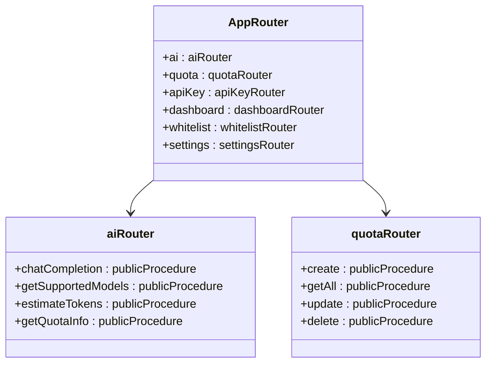

**图表来源**
- [src/server/api/root.ts](file://src/server/api/root.ts#L14-L21)

#### REST API 端点

系统同时提供 REST API 和 tRPC API 两种接口：

- **REST API**：`/api/ai/chat/completions` - 聊天完成接口
- **tRPC API**：`/api/trpc` - 类型安全的 RPC 接口

**章节来源**
- [src/server/api/root.ts](file://src/server/api/root.ts#L1-L25)
- [src/pages/api/ai/chat/completions.ts](file://src/pages/api/ai/chat/completions.ts#L1-L350)

### 用户界面组件

用户界面采用液体玻璃设计语言，提供现代化的用户体验。

#### Dashboard 布局

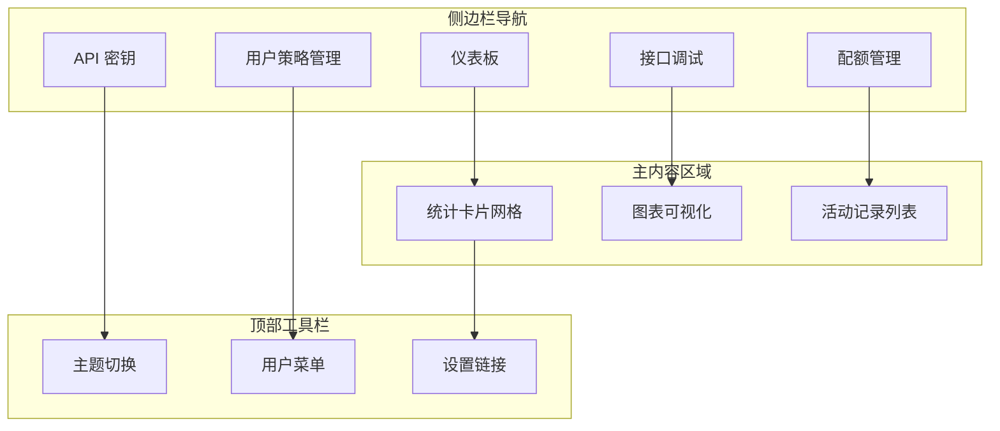

**图表来源**
- [src/components/dashboard-layout.tsx](file://src/components/dashboard-layout.tsx#L25-L51)

#### 响应式设计

系统支持多种设备尺寸，采用 Tailwind CSS 实现响应式布局：

- **移动端**：单列布局，适合小屏幕设备
- **平板设备**：双列布局，平衡信息密度和可读性
- **桌面设备**：多列布局，充分利用屏幕空间

**章节来源**
- [src/components/dashboard-layout.tsx](file://src/components/dashboard-layout.tsx#L1-L197)
- [src/app/(dashboard)/page.tsx](file://src/app/(dashboard)/page.tsx#L1-L230)

## 依赖关系分析

### 外部依赖

系统使用现代 JavaScript 生态系统中的关键依赖项：

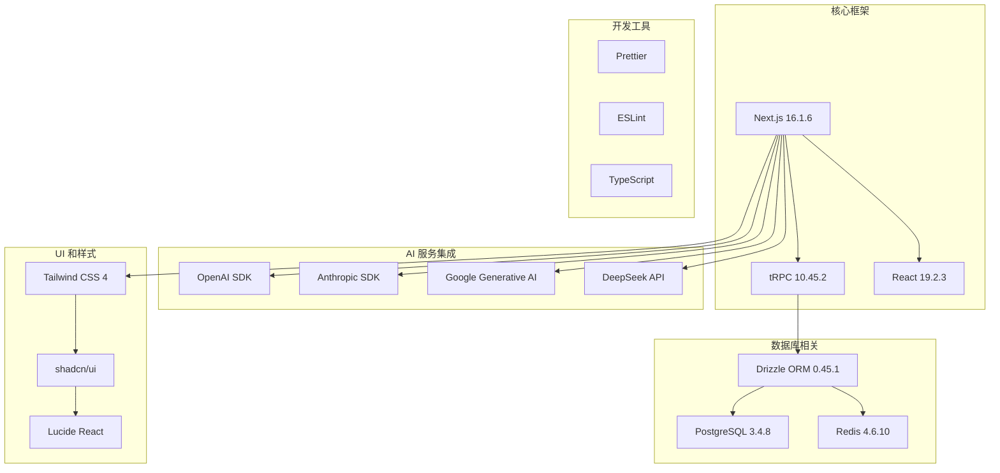

**图表来源**
- [package.json](file://package.json#L18-L69)

### 内部模块依赖

系统内部模块之间存在清晰的依赖关系：

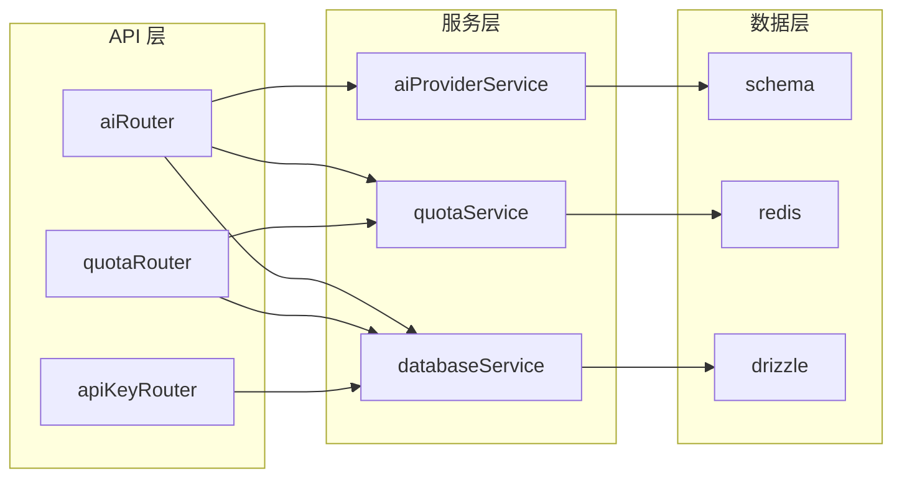

**图表来源**
- [src/server/api/root.ts](file://src/server/api/root.ts#L14-L21)
- [src/lib/quota.ts](file://src/lib/quota.ts#L1-L327)

**章节来源**
- [package.json](file://package.json#L1-L91)

## 性能考虑

### 缓存策略

系统采用多层次缓存策略确保高性能：

1. **Redis 缓存**：热点数据缓存，减少数据库压力
2. **浏览器缓存**：静态资源缓存，提升页面加载速度
3. **CDN 缓存**：全球内容分发网络，加速静态资源访问

### 数据库优化

- **索引优化**：为常用查询字段建立索引
- **连接池**：使用连接池管理数据库连接
- **查询优化**：避免 N+1 查询问题
- **分页查询**：大数据集分页处理

### API 性能

- **流式响应**：支持流式传输，提升用户体验
- **并发控制**：限制并发请求数量
- **超时处理**：合理的超时设置
- **错误重试**：智能的错误重试机制

## 故障排除指南

### 常见问题诊断

#### 配额相关问题

**问题**：用户频繁遇到配额不足错误
**解决方案**：
1. 检查 Redis 连接状态
2. 验证配额策略配置
3. 查看用量记录统计
4. 清理过期缓存数据

#### API Key 问题

**问题**：API Key 无法正常工作
**解决方案**：
1. 验证 API Key 状态（ACTIVE/DISABLED）
2. 检查白名单规则配置
3. 确认提供商支持情况
4. 验证基础 URL 配置

#### 数据库连接问题

**问题**：数据库连接失败
**解决方案**：
1. 检查 DATABASE_URL 配置
2. 验证数据库服务状态
3. 查看连接池配置
4. 检查防火墙设置

### 日志分析

系统提供详细的日志记录功能：

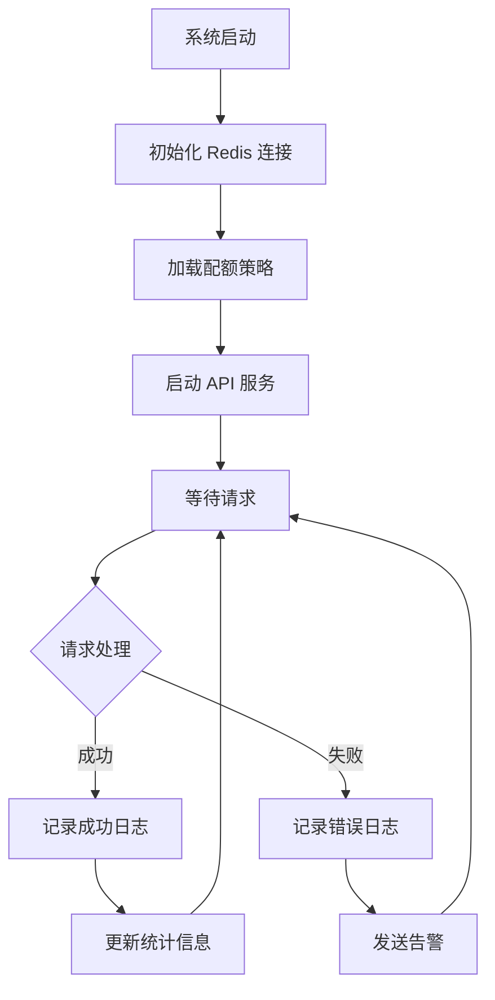

**图表来源**
- [src/app/layout.tsx](file://src/app/layout.tsx#L9-L12)

### 监控指标

系统监控关键性能指标：

- **请求延迟**：API 响应时间
- **错误率**：请求失败比例
- **资源使用**：CPU、内存、磁盘使用率
- **缓存命中率**：Redis 缓存效率

**章节来源**
- [src/lib/quota.ts](file://src/lib/quota.ts#L1-L327)
- [src/lib/database.ts](file://src/lib/database.ts#L1-L692)

## 结论

液体玻璃确认系统是一个功能完整、架构清晰的 AI 网关管理系统。系统采用现代化的技术栈，实现了高性能、高可用、易扩展的设计目标。

### 系统优势

1. **技术先进**：采用最新的 Next.js 16 和 tRPC 技术
2. **架构清晰**：分层设计，职责分离明确
3. **性能优秀**：Redis 缓存 + 数据库优化，响应速度快
4. **安全可靠**：多层认证 + 配额控制，保障系统安全
5. **易于维护**：模块化设计，便于功能扩展和维护

### 未来发展方向

1. **AI 模型扩展**：支持更多 AI 服务提供商
2. **智能路由**：基于负载均衡的智能路由选择
3. **高级监控**：更细粒度的性能监控和告警
4. **自动化运维**：CI/CD 流程和自动化部署
5. **国际化支持**：多语言界面和本地化功能

该系统为 AI 服务的安全访问和高效管理提供了完整的解决方案，适合各种规模的企业和组织使用。