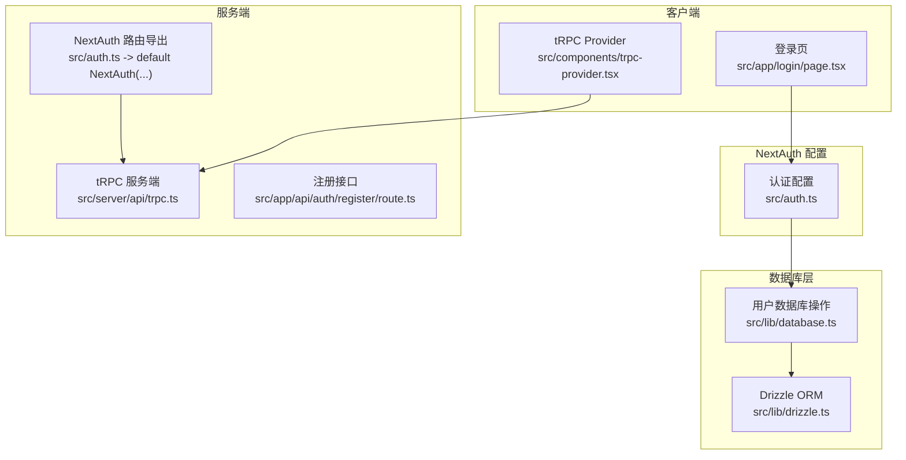
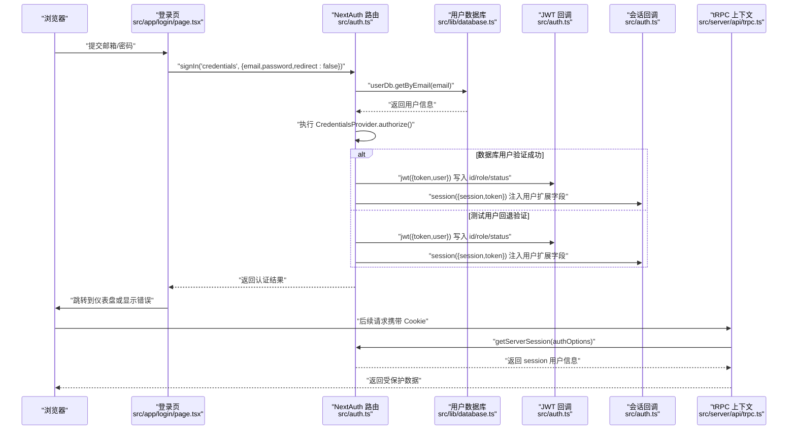
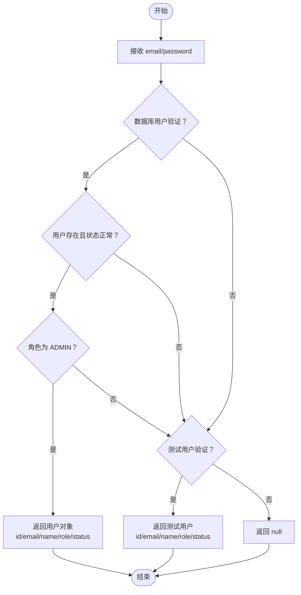
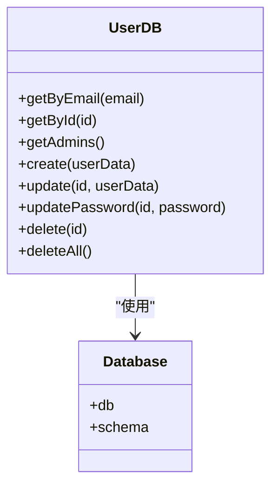
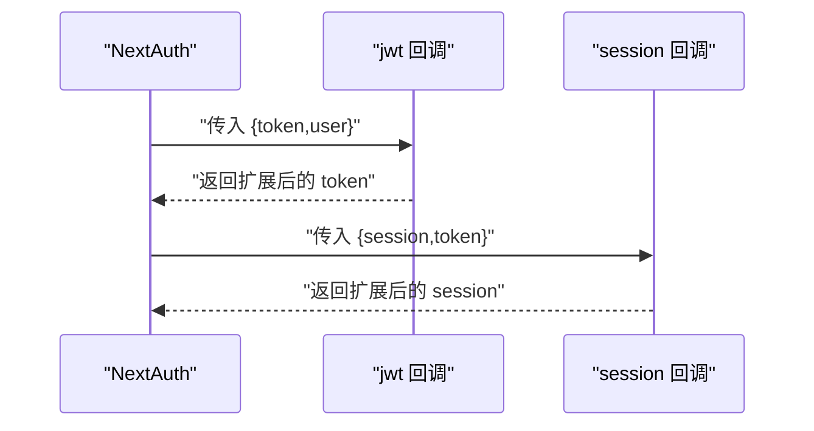
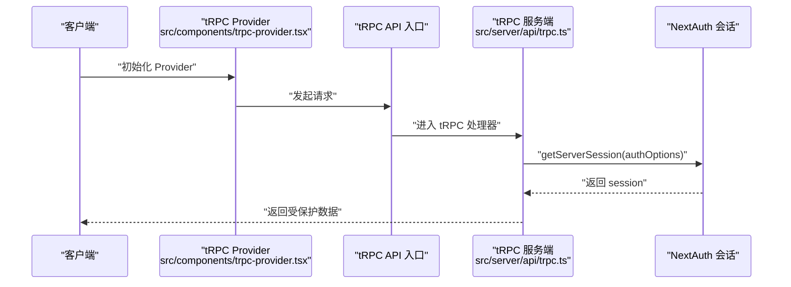
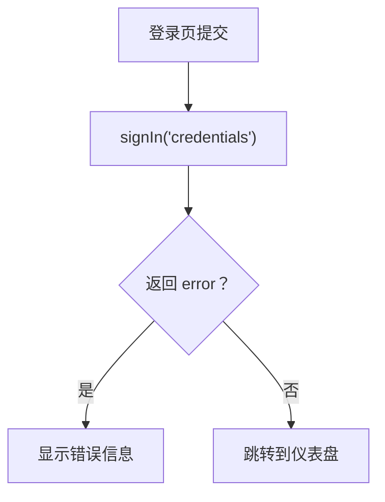
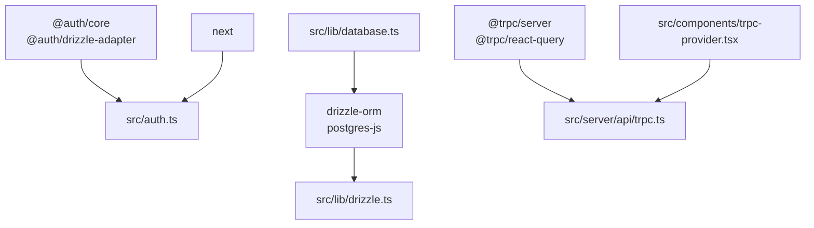

# NextAuth.js 配置与集成

<cite>
**本文档引用的文件**
- [src/auth.ts](file://src/auth.ts)
- [src/lib/database.ts](file://src/lib/database.ts)
- [src/lib/drizzle.ts](file://src/lib/drizzle.ts)
- [package.json](file://package.json)
- [next.config.ts](file://next.config.ts)
- [src/app/login/page.tsx](file://src/app/login/page.tsx)
- [src/app/api/auth/register/route.ts](file://src/app/api/auth/register/route.ts)
- [src/server/api/trpc.ts](file://src/server/api/trpc.ts)
- [src/components/trpc-provider.tsx](file://src/components/trpc-provider.tsx)
</cite>

## 更新摘要
**所做更改**
- 更新认证逻辑部分，反映从环境变量验证改为数据库用户验证的变更
- 新增数据库抽象层集成说明，包括 userDb 模块的使用
- 保留测试用户回退机制的说明
- 更新依赖关系分析，反映新的数据库适配器配置
- 更新故障排除指南，增加数据库连接相关的问题排查

## 目录
1. [简介](#简介)
2. [项目结构](#项目结构)
3. [核心组件](#核心组件)
4. [架构总览](#架构总览)
5. [详细组件分析](#详细组件分析)
6. [依赖关系分析](#依赖关系分析)
7. [性能考虑](#性能考虑)
8. [故障排除指南](#故障排除指南)
9. [结论](#结论)
10. [附录](#附录)

## 简介
本文件面向 NextAuth.js 在本项目中的配置与集成，重点覆盖以下方面：
- 认证配置选项：providers、callbacks、pages、secret 等
- 凭据认证提供者（Credentials Provider）的配置与实现
- JWT 令牌与会话（session）数据流转与扩展
- 与 tRPC 的会话集成与受保护过程（protectedProcedure）校验
- 数据库用户验证与测试用户回退机制
- 完整认证流程实现与最佳实践

## 项目结构
本项目采用 App Router 结构，认证相关代码集中在以下位置：
- NextAuth 配置：src/auth.ts
- 登录页：src/app/login/page.tsx
- 注册后端接口：src/app/api/auth/register/route.ts
- 数据库抽象层：src/lib/database.ts、src/lib/drizzle.ts
- tRPC 服务端集成：src/server/api/trpc.ts
- tRPC 客户端 Provider：src/components/trpc-provider.tsx
- Next 配置：next.config.ts
- 依赖声明：package.json



**图表来源**
- [src/auth.ts](file://src/auth.ts#L1-L114)
- [src/lib/database.ts](file://src/lib/database.ts#L581-L691)
- [src/lib/drizzle.ts](file://src/lib/drizzle.ts#L1-L12)
- [src/app/login/page.tsx](file://src/app/login/page.tsx#L1-L107)
- [src/server/api/trpc.ts](file://src/server/api/trpc.ts#L1-L153)
- [src/components/trpc-provider.tsx](file://src/components/trpc-provider.tsx#L1-L64)

**章节来源**
- [src/auth.ts](file://src/auth.ts#L1-L114)
- [src/lib/database.ts](file://src/lib/database.ts#L1-L692)
- [src/lib/drizzle.ts](file://src/lib/drizzle.ts#L1-L12)
- [src/app/login/page.tsx](file://src/app/login/page.tsx#L1-L107)
- [src/server/api/trpc.ts](file://src/server/api/trpc.ts#L1-L153)
- [src/components/trpc-provider.tsx](file://src/components/trpc-provider.tsx#L1-L64)

## 核心组件
- NextAuth 配置对象：定义 providers、callbacks、pages、secret 等
- 凭据认证提供者：基于 email/password 的自定义授权逻辑，支持数据库用户验证和测试用户回退
- JWT 与会话回调：将用户角色、状态等扩展字段写入 token 与 session
- 数据库抽象层：通过 userDb 模块提供用户查询和管理功能
- tRPC 会话上下文：通过 getServerSession 获取当前用户会话
- 受保护过程：基于会话验证的 tRPC 过程中间件
- 登录页面：前端表单提交与后端认证接口

**章节来源**
- [src/auth.ts](file://src/auth.ts#L6-L107)
- [src/lib/database.ts](file://src/lib/database.ts#L581-L691)
- [src/server/api/trpc.ts](file://src/server/api/trpc.ts#L128-L139)
- [src/app/login/page.tsx](file://src/app/login/page.tsx#L19-L42)

## 架构总览
下图展示了从浏览器发起登录请求到服务端通过数据库验证用户身份并生成会话的整体流程。



**图表来源**
- [src/app/login/page.tsx](file://src/app/login/page.tsx#L19-L42)
- [src/auth.ts](file://src/auth.ts#L14-L81)
- [src/lib/database.ts](file://src/lib/database.ts#L584-L592)
- [src/server/api/trpc.ts](file://src/server/api/trpc.ts#L65-L75)

## 详细组件分析

### NextAuth 配置对象与选项
- providers：配置凭据认证提供者，包含字段定义与授权函数
- callbacks：jwt 与 session 回调，用于在令牌与会话中注入自定义字段
- pages：指定登录页路径
- secret：从环境变量读取密钥，用于加密/解密 JWT

```mermaid
classDiagram
class AuthOptions {
+providers
+callbacks
+pages
+secret
}
class CredentialsProvider {
+name
+credentials
+authorize(credentials)
}
class JWTCallbacks {
+jwt({token,user})
}
class SessionCallbacks {
+session({session,token})
}
AuthOptions --> CredentialsProvider : "包含"
AuthOptions --> JWTCallbacks : "包含"
AuthOptions --> SessionCallbacks : "包含"
```

**图表来源**
- [src/auth.ts](file://src/auth.ts#L6-L107)

**章节来源**
- [src/auth.ts](file://src/auth.ts#L6-L107)

### 凭据认证提供者（Credentials Provider）
- 字段定义：email、password
- 授权逻辑：从数据库查找用户，验证用户存在、密码匹配、状态正常且是管理员；若数据库验证失败，保留测试用户作为备选回退机制
- 前端触发：登录页通过 signIn('credentials', { redirect: false }) 提交凭据

**更新** 认证逻辑已从简单的环境变量验证改为数据库用户验证，同时保留测试用户回退机制



**图表来源**
- [src/auth.ts](file://src/auth.ts#L14-L81)
- [src/app/login/page.tsx](file://src/app/login/page.tsx#L25-L29)

**章节来源**
- [src/auth.ts](file://src/auth.ts#L8-L82)
- [src/app/login/page.tsx](file://src/app/login/page.tsx#L19-L42)

### 数据库抽象层集成
- userDb 模块：提供用户查询、管理功能，包括按邮箱查询、按ID查询、获取管理员列表、创建、更新、删除用户等
- 数据库连接：通过 drizzle-orm 连接 PostgreSQL 数据库
- 验证流程：在认证过程中调用 userDb.getByEmail() 获取用户信息进行验证

**更新** 新增完整的数据库抽象层集成，提供用户数据的持久化存储和管理能力



**图表来源**
- [src/lib/database.ts](file://src/lib/database.ts#L581-L691)
- [src/lib/drizzle.ts](file://src/lib/drizzle.ts#L1-L12)

**章节来源**
- [src/lib/database.ts](file://src/lib/database.ts#L581-L691)
- [src/lib/drizzle.ts](file://src/lib/drizzle.ts#L1-L12)

### JWT 与会话回调
- jwt 回调：当 user 存在时，将 id、role、status 写入 token
- session 回调：将 token 中的扩展字段写回 session.user
- 作用：在客户端与服务端共享用户角色与状态等信息



**图表来源**
- [src/auth.ts](file://src/auth.ts#L84-L101)

**章节来源**
- [src/auth.ts](file://src/auth.ts#L84-L101)

### 会话管理与 tRPC 集成
- 服务端获取会话：在 tRPC 上下文中调用 getServerSession(authOptions)，将 session 注入到 ctx
- 受保护过程：通过中间件校验 ctx.session 是否存在且包含用户信息，否则抛出未授权错误
- 客户端 tRPC Provider：负责设置基础 URL 与链接，与服务端 API 对接



**图表来源**
- [src/components/trpc-provider.tsx](file://src/components/trpc-provider.tsx#L22-L61)
- [src/server/api/trpc.ts](file://src/server/api/trpc.ts#L65-L75)

**章节来源**
- [src/server/api/trpc.ts](file://src/server/api/trpc.ts#L128-L139)
- [src/server/api/trpc.ts](file://src/server/api/trpc.ts#L65-L75)
- [src/components/trpc-provider.tsx](file://src/components/trpc-provider.tsx#L1-L64)

### 登录页面
- 收集 email/password，调用 signIn('credentials')，根据返回结果决定跳转或提示错误
- 支持加载状态和错误处理



**图表来源**
- [src/app/login/page.tsx](file://src/app/login/page.tsx#L19-L42)

**章节来源**
- [src/app/login/page.tsx](file://src/app/login/page.tsx#L1-L107)

## 依赖关系分析
- NextAuth 版本与适配器：依赖 @auth/core 与 @auth/drizzle-adapter（用于数据库适配）
- 数据库连接：使用 drizzle-orm 连接 PostgreSQL 数据库
- Next 配置：启用 reactCompiler 与 standalone 输出
- tRPC 集成：通过 @trpc/server 与 @trpc/react-query，结合 Next.js API 路由

**更新** 依赖关系已更新以反映数据库适配器和 drizzle-orm 的集成



**图表来源**
- [package.json](file://package.json#L18-L62)
- [src/auth.ts](file://src/auth.ts#L1-L114)
- [src/lib/drizzle.ts](file://src/lib/drizzle.ts#L1-L12)
- [src/lib/database.ts](file://src/lib/database.ts#L1-L692)
- [src/server/api/trpc.ts](file://src/server/api/trpc.ts#L1-L153)
- [src/components/trpc-provider.tsx](file://src/components/trpc-provider.tsx#L1-L64)

**章节来源**
- [package.json](file://package.json#L18-L62)
- [next.config.ts](file://next.config.ts#L1-L9)

## 性能考虑
- 会话获取：getServerSession 在每次请求时都会解析 Cookie 并验证 JWT，建议在生产环境使用高性能存储（如 Redis）以减少数据库压力
- 数据库查询：用户验证涉及数据库查询，建议在生产环境使用连接池和适当的索引优化
- tRPC 批处理：客户端使用 httpBatchLink，可减少网络往返次数
- 缓存策略：可在 tRPC 层面设置合理的 staleTime 与 retry，平衡实时性与性能
- 令牌大小：避免在 JWT 中存放过大的用户信息，仅存放必要字段
- 日志记录：认证过程包含详细的日志记录，有助于性能监控和问题排查

**更新** 新增数据库查询性能考虑和日志记录的性能影响

## 故障排除指南
- 登录失败
  - 检查前端 signIn('credentials') 参数是否正确传递 email/password
  - 确认 CredentialsProvider.authorize 返回值与回调逻辑
  - 查看浏览器 Network 面板与服务端日志
  - 验证数据库连接是否正常（检查 DATABASE_URL 环境变量）
- 会话为空
  - 确认 Cookie 是否被正确设置与携带
  - 检查 getServerSession 是否在正确的 Next.js 路由中调用
  - 核对 NEXTAUTH_URL 与部署域名一致
- tRPC 未授权
  - 检查受保护过程中间件是否正确判断 ctx.session.user
  - 确保客户端 Provider 正确指向 /api/trpc
- 环境变量问题
  - NEXTAUTH_SECRET 必须与部署环境一致，不可泄露
  - NEXTAUTH_URL 必须与实际访问域名一致，避免跨域或重定向问题
  - DATABASE_URL 必须指向有效的 PostgreSQL 数据库连接
- 数据库连接问题
  - 检查 DATABASE_URL 格式是否正确
  - 验证数据库服务是否可用
  - 确认用户权限设置正确
- 认证逻辑问题
  - 确认用户状态为 ACTIVE
  - 验证用户角色为 ADMIN
  - 检查测试用户回退机制是否正常工作

**更新** 新增数据库连接和认证逻辑相关的故障排除指导

**章节来源**
- [src/app/login/page.tsx](file://src/app/login/page.tsx#L19-L42)
- [src/server/api/trpc.ts](file://src/server/api/trpc.ts#L128-L139)
- [src/auth.ts](file://src/auth.ts#L105-L107)
- [src/lib/drizzle.ts](file://src/lib/drizzle.ts#L4-L5)

## 结论
本项目基于 NextAuth.js 实现了基于数据库的凭据认证系统，通过回调扩展了 JWT 与会话中的用户角色与状态信息。认证逻辑从简单的环境变量验证升级为完整的数据库用户验证，同时保留测试用户回退机制，确保开发和生产环境的灵活性。配合 tRPC 的受保护过程，实现了前后端一致的认证与授权控制。建议在生产环境中完善数据库适配器、强化安全密钥管理与部署域名配置，并优化会话与缓存策略以提升性能与稳定性。

## 附录

### 环境变量配置清单
- NEXTAUTH_SECRET：NextAuth 加密密钥，必须在生产环境替换为强随机字符串
- NEXTAUTH_URL：NextAuth 重定向与回调使用的完整 URL
- DATABASE_URL：PostgreSQL 连接串（用于 Drizzle ORM）
- REDIS_URL：Redis 连接串（用于缓存）

**更新** 新增 DATABASE_URL 和 REDIS_URL 的说明

**章节来源**
- [src/auth.ts](file://src/auth.ts#L105-L107)
- [src/lib/drizzle.ts](file://src/lib/drizzle.ts#L4-L5)

### 最佳实践
- 使用强随机密钥并妥善保管，定期轮换
- 在生产环境设置 NEXTAUTH_URL 为 HTTPS 且与部署域名一致
- 在 CredentialsProvider.authorize 中使用安全的密码验证（当前实现为简单字符串比较，建议升级为哈希验证）
- 在回调中仅存放必要的用户标识字段，避免 JWT 过大
- 在受保护过程中间件中统一校验 session.user，避免重复校验
- 使用 tRPC 的批处理与缓存策略，减少网络开销
- 实施适当的数据库查询优化和索引策略
- 启用详细的日志记录以便问题排查
- 定期备份数据库和配置文件

**更新** 新增数据库优化和日志记录的最佳实践建议