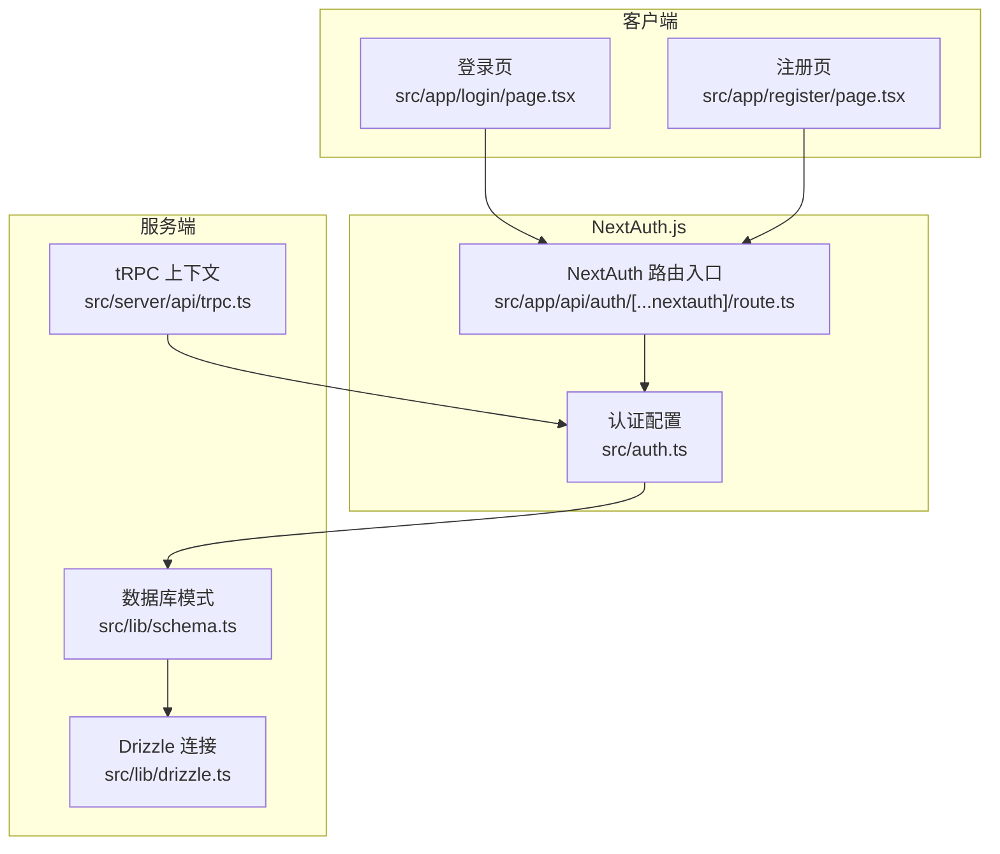
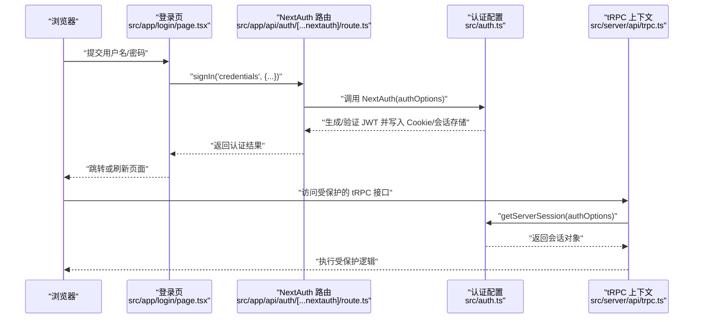
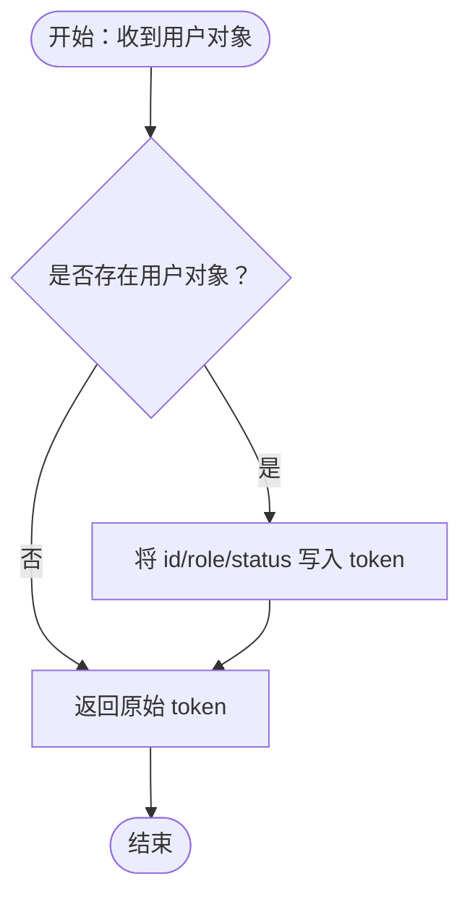
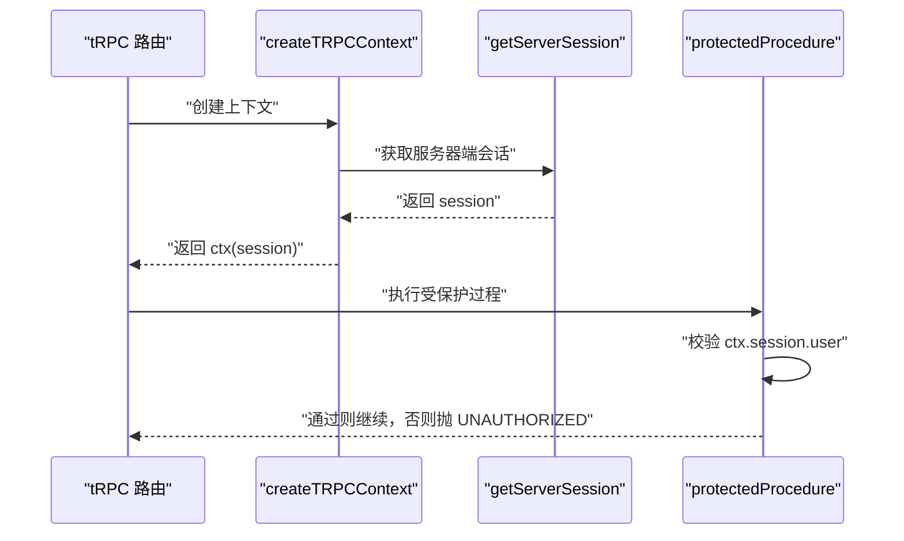
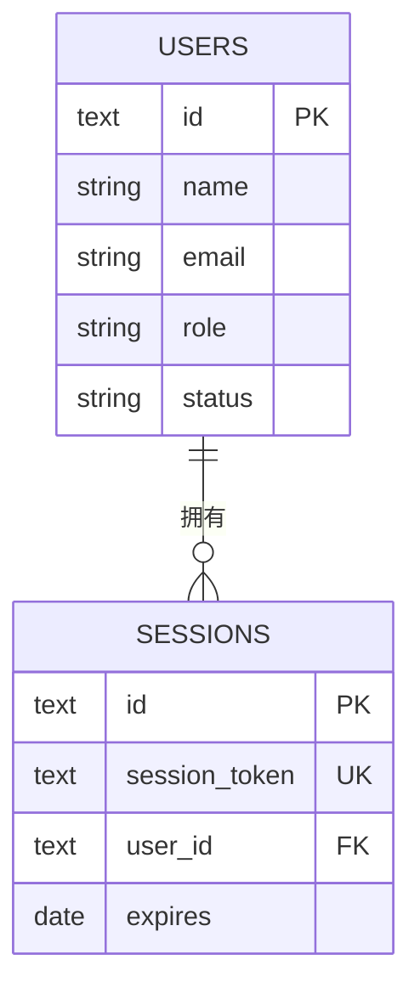
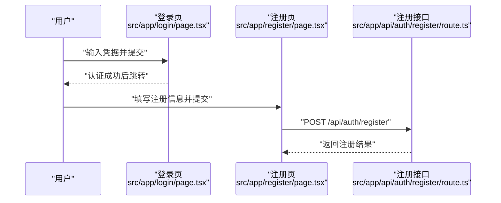
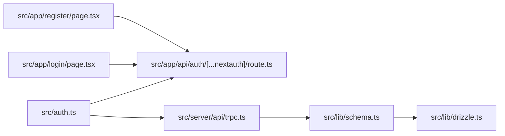

# 会话管理

<cite>
**本文引用的文件**
- [src/auth.ts](file://src/auth.ts)
- [src/app/api/auth/[...nextauth]/route.ts](file://src/app/api/auth/[...nextauth]/route.ts)
- [src/server/api/trpc.ts](file://src/server/api/trpc.ts)
- [src/app/login/page.tsx](file://src/app/login/page.tsx)
- [src/app/register/page.tsx](file://src/app/register/page.tsx)
- [src/app/api/auth/register/route.ts](file://src/app/api/auth/register/route.ts)
- [src/lib/schema.ts](file://src/lib/schema.ts)
- [src/lib/drizzle.ts](file://src/lib/drizzle.ts)
- [src/lib/types.ts](file://src/lib/types.ts)
</cite>

## 目录
1. [引言](#引言)
2. [项目结构](#项目结构)
3. [核心组件](#核心组件)
4. [架构总览](#架构总览)
5. [详细组件分析](#详细组件分析)
6. [依赖关系分析](#依赖关系分析)
7. [性能考量](#性能考量)
8. [故障排查指南](#故障排查指南)
9. [结论](#结论)
10. [附录](#附录)

## 引言
本文件面向希望深入理解并安全实现会话管理的开发者，围绕 NextAuth.js 在本项目中的集成与扩展进行系统化技术说明。内容涵盖会话存储、会话过期与刷新策略、JWT 令牌生成与验证、会话回调函数、会话数据结构与用户信息传递、状态同步机制、安全策略（含 CSRF 与会话劫持防护）、配置项与自定义会话格式、生命周期管理及最佳实践。

## 项目结构
本项目采用 Next.js App Router，会话管理通过 NextAuth.js 提供的认证与会话能力实现，并结合 tRPC 在服务端上下文中注入会话对象。关键位置如下：
- NextAuth 配置与路由入口：src/auth.ts、src/app/api/auth/[...nextauth]/route.ts
- 服务端 tRPC 上下文：src/server/api/trpc.ts
- 客户端登录与注册页面：src/app/login/page.tsx、src/app/register/page.tsx
- 注册接口：src/app/api/auth/register/route.ts
- 数据库模式（含 sessions 表）：src/lib/schema.ts
- 数据库连接与 Drizzle ORM：src/lib/drizzle.ts
- 类型定义：src/lib/types.ts

图表来源
- [src/app/login/page.tsx](file://src/app/login/page.tsx#L1-L100)
- [src/app/register/page.tsx](file://src/app/register/page.tsx#L1-L128)
- [src/app/api/auth/[...nextauth]/route.ts](file://src/app/api/auth/[...nextauth]/route.ts#L1-L7)
- [src/auth.ts](file://src/auth.ts#L1-L56)
- [src/server/api/trpc.ts](file://src/server/api/trpc.ts#L1-L142)
- [src/lib/schema.ts](file://src/lib/schema.ts#L114-L122)
- [src/lib/drizzle.ts](file://src/lib/drizzle.ts#L1-L11)

章节来源
- [src/auth.ts](file://src/auth.ts#L1-L56)
- [src/app/api/auth/[...nextauth]/route.ts](file://src/app/api/auth/[...nextauth]/route.ts#L1-L7)
- [src/server/api/trpc.ts](file://src/server/api/trpc.ts#L1-L142)
- [src/app/login/page.tsx](file://src/app/login/page.tsx#L1-L100)
- [src/app/register/page.tsx](file://src/app/register/page.tsx#L1-L128)
- [src/lib/schema.ts](file://src/lib/schema.ts#L114-L122)
- [src/lib/drizzle.ts](file://src/lib/drizzle.ts#L1-L11)

## 核心组件
- NextAuth 配置与回调
  - 提供凭据认证（Credentials Provider），在 authorize 中完成用户校验并返回用户信息
  - 回调 jwt 与 session 用于将用户角色、状态等字段从 token 同步到 session.user
  - 指定登录页路径与密钥
- NextAuth 路由入口
  - 暴露 GET/POST 到 NextAuth，统一处理认证流程
- tRPC 会话上下文
  - 在每个请求进入 tRPC 前通过 getServerSession 获取会话并注入到 ctx
  - 提供受保护过程（protectedProcedure）以强制校验会话有效性
- 数据库模式
  - 定义 sessions 表，包含会话标识、绑定用户、过期时间等字段
- 客户端交互
  - 登录页使用 next-auth/react 的 signIn 触发认证
  - 注册页通过自定义 API 接口完成用户创建

章节来源
- [src/auth.ts](file://src/auth.ts#L4-L49)
- [src/app/api/auth/[...nextauth]/route.ts](file://src/app/api/auth/[...nextauth]/route.ts#L1-L7)
- [src/server/api/trpc.ts](file://src/server/api/trpc.ts#L55-L64)
- [src/lib/schema.ts](file://src/lib/schema.ts#L114-L122)
- [src/app/login/page.tsx](file://src/app/login/page.tsx#L17-L40)

## 架构总览
下图展示从客户端发起登录到服务端 tRPC 访问会话的完整链路，以及 NextAuth 如何与数据库模式协同工作：

图表来源
- [src/app/login/page.tsx](file://src/app/login/page.tsx#L17-L40)
- [src/app/api/auth/[...nextauth]/route.ts](file://src/app/api/auth/[...nextauth]/route.ts#L1-L7)
- [src/auth.ts](file://src/auth.ts#L4-L49)
- [src/server/api/trpc.ts](file://src/server/api/trpc.ts#L55-L64)

## 详细组件分析

### NextAuth.js 会话配置与回调
- 凭据认证与授权
  - 在 authorize 中对传入凭证进行校验，成功时返回包含 id、email、name、role、status 的用户对象
- JWT 回调
  - 将用户角色与状态写入 token，确保后续可从 token 中读取
- Session 回调
  - 将 token 中的角色与状态同步到 session.user，使客户端与服务端共享一致的用户信息
- 页面与密钥
  - 指定登录页路径；secret 用于签名 JWT，建议在生产环境使用强随机密钥

图表来源
- [src/auth.ts](file://src/auth.ts#L27-L44)

章节来源
- [src/auth.ts](file://src/auth.ts#L11-L44)

### NextAuth 路由入口
- 统一暴露 GET/POST，内部委托给 NextAuth(authOptions)，实现标准 OAuth/凭据认证流程

章节来源
- [src/app/api/auth/[...nextauth]/route.ts](file://src/app/api/auth/[...nextauth]/route.ts#L1-L7)

### tRPC 会话上下文与受保护过程
- 上下文创建
  - 在 createTRPCContext 中调用 getServerSession(authOptions)，并将 session 注入 ctx
- 受保护过程
  - protectedProcedure 校验 ctx.session 是否存在且包含用户信息，否则抛出未授权错误

图表来源
- [src/server/api/trpc.ts](file://src/server/api/trpc.ts#L55-L64)
- [src/server/api/trpc.ts](file://src/server/api/trpc.ts#L117-L128)

章节来源
- [src/server/api/trpc.ts](file://src/server/api/trpc.ts#L55-L64)
- [src/server/api/trpc.ts](file://src/server/api/trpc.ts#L117-L128)

### 会话存储与数据库模式
- sessions 表
  - 包含会话标识、会话令牌、用户绑定、过期时间等字段
  - 与用户表建立外键关系，支持级联删除
- Drizzle 连接
  - 通过 drizzle-orm/postgres-js 连接 PostgreSQL，配合 schema 定义进行 ORM 操作

图表来源
- [src/lib/schema.ts](file://src/lib/schema.ts#L114-L122)
- [src/lib/schema.ts](file://src/lib/schema.ts#L153-L159)
- [src/lib/drizzle.ts](file://src/lib/drizzle.ts#L1-L11)

章节来源
- [src/lib/schema.ts](file://src/lib/schema.ts#L114-L122)
- [src/lib/drizzle.ts](file://src/lib/drizzle.ts#L1-L11)

### 客户端登录与注册
- 登录页
  - 使用 next-auth/react 的 signIn('credentials', {...}) 触发认证，redirect: false 便于前端控制跳转
- 注册页
  - 通过自定义 /api/auth/register 接口创建用户，包含密码加密与默认配额策略关联

图表来源
- [src/app/login/page.tsx](file://src/app/login/page.tsx#L17-L40)
- [src/app/register/page.tsx](file://src/app/register/page.tsx#L14-L41)
- [src/app/api/auth/register/route.ts](file://src/app/api/auth/register/route.ts#L7-L45)

章节来源
- [src/app/login/page.tsx](file://src/app/login/page.tsx#L17-L40)
- [src/app/register/page.tsx](file://src/app/register/page.tsx#L14-L41)
- [src/app/api/auth/register/route.ts](file://src/app/api/auth/register/route.ts#L7-L45)

### 会话数据结构与用户信息传递
- 用户模型
  - 包含 id、name、email、role、status 等字段，用于在会话中传递
- 会话回调
  - 将用户角色与状态从 token 注入 session.user，保证前后端一致

章节来源
- [src/lib/types.ts](file://src/lib/types.ts#L34-L45)
- [src/auth.ts](file://src/auth.ts#L27-L44)

### 会话生命周期与刷新策略
- 默认行为
  - NextAuth 默认使用 JWT 作为会话存储，会话有效期由配置决定
- 刷新策略
  - 当前配置未显式设置刷新相关参数，建议在生产环境根据业务需求配置如 maxAge、updateAge 等，以平衡安全与体验
- 过期处理
  - 服务端受保护过程会在会话无效时直接拒绝请求

章节来源
- [src/auth.ts](file://src/auth.ts#L4-L49)
- [src/server/api/trpc.ts](file://src/server/api/trpc.ts#L117-L128)

### 安全策略与防护
- CSRF 保护
  - NextAuth 默认启用 CSRF 保护，客户端通过 next-auth/react 的 signIn 等方法自动携带 CSRF 相关头或令牌
- 会话劫持防护
  - 使用强随机 secret 签名 JWT；建议启用 SameSite Cookie、HTTPS 传输与安全 Cookie 属性
- 令牌与会话存储
  - JWT 存储于 Cookie 中，避免在本地存储敏感信息；数据库 sessions 表用于服务端持久化（如需）

章节来源
- [src/auth.ts](file://src/auth.ts#L45-L49)

### 自定义会话格式与扩展
- 自定义字段
  - 在 jwt 回调中将用户角色与状态写入 token，在 session 回调中同步到 session.user
- 扩展用户信息
  - 可在 authorize 返回更多用户属性，并在回调中映射到 token/session

章节来源
- [src/auth.ts](file://src/auth.ts#L27-L44)

## 依赖关系分析
- 组件耦合
  - NextAuth 配置被路由入口与 tRPC 上下文共同依赖
  - tRPC 受保护过程依赖 NextAuth 会话校验
  - 数据库模式与 Drizzle 连接为会话持久化提供基础
- 外部依赖
  - next-auth、next-auth/react、drizzle-orm、postgres-js

图表来源
- [src/auth.ts](file://src/auth.ts#L1-L56)
- [src/app/api/auth/[...nextauth]/route.ts](file://src/app/api/auth/[...nextauth]/route.ts#L1-L7)
- [src/server/api/trpc.ts](file://src/server/api/trpc.ts#L1-L142)
- [src/lib/schema.ts](file://src/lib/schema.ts#L114-L122)
- [src/lib/drizzle.ts](file://src/lib/drizzle.ts#L1-L11)
- [src/app/login/page.tsx](file://src/app/login/page.tsx#L1-L100)
- [src/app/register/page.tsx](file://src/app/register/page.tsx#L1-L128)

章节来源
- [src/auth.ts](file://src/auth.ts#L1-L56)
- [src/server/api/trpc.ts](file://src/server/api/trpc.ts#L1-L142)
- [src/lib/schema.ts](file://src/lib/schema.ts#L114-L122)
- [src/lib/drizzle.ts](file://src/lib/drizzle.ts#L1-L11)

## 性能考量
- 会话获取开销
  - 每个 tRPC 请求都会调用 getServerSession，建议在中间层或边缘缓存中减少重复解析
- 数据库查询
  - 若扩展为服务端会话存储，注意 sessions 表的索引与查询优化（如按 session_token 查询）
- 客户端渲染
  - 登录页使用 signIn('credentials', { redirect: false }) 可减少重定向带来的额外请求

## 故障排查指南
- 未授权访问
  - protectedProcedure 抛出 UNAUTHORIZED，检查客户端是否正确登录、Cookie 是否携带、会话是否过期
- 会话为空
  - 确认 createTRPCContext 中 getServerSession 能正常获取会话；检查 NextAuth 路由是否正确暴露
- CSRF 错误
  - 确保使用 next-auth/react 的客户端方法；检查同站策略与 HTTPS 配置
- 令牌签名问题
  - 检查 NEXTAUTH_SECRET 是否设置且一致；避免多实例间密钥不一致

章节来源
- [src/server/api/trpc.ts](file://src/server/api/trpc.ts#L117-L128)
- [src/app/api/auth/[...nextauth]/route.ts](file://src/app/api/auth/[...nextauth]/route.ts#L1-L7)
- [src/auth.ts](file://src/auth.ts#L45-L49)

## 结论
本项目基于 NextAuth.js 实现了完整的会话管理闭环：客户端登录、服务端会话注入、受保护过程校验与数据库模式支撑。通过回调机制实现用户角色与状态在 token 与 session 间的同步，结合 CSRF 与会话劫持防护，可满足大多数 Web 应用的安全与可用性需求。建议在生产环境中完善会话刷新策略、密钥管理与缓存策略，以进一步提升安全性与性能。

## 附录
- 最佳实践清单
  - 使用强随机 NEXTAUTH_SECRET；在多实例部署中保持一致
  - 启用 HTTPS 与安全 Cookie；合理设置 SameSite
  - 在受保护过程前统一校验会话；避免在客户端本地存储敏感令牌
  - 对会话存储进行监控与审计，及时发现异常登录与过期问题
  - 根据业务场景配置会话有效期与刷新策略，权衡安全与用户体验