# 用户认证与授权系统

<cite>
**本文档引用的文件**
- [src/auth.ts](file://src/auth.ts)
- [src/lib/schema.ts](file://src/lib/schema.ts)
- [src/lib/database.ts](file://src/lib/database.ts)
- [src/lib/init-admin.ts](file://src/lib/init-admin.ts)
- [src/app/layout.tsx](file://src/app/layout.tsx)
- [src/server/api/trpc.ts](file://src/server/api/trpc.ts)
- [src/app/api/auth/register/route.ts](file://src/app/api/auth/register/route.ts)
- [src/app/login/page.tsx](file://src/app/login/page.tsx)
- [src/app/register/page.tsx](file://src/app/register/page.tsx)
- [src/components/trpc-provider.tsx](file://src/components/trpc-provider.tsx)
- [src/server/api/root.ts](file://src/server/api/root.ts)
- [src/lib/validations/auth.ts](file://src/lib/validations/auth.ts)
- [src/lib/demo-config.ts](file://src/lib/demo-config.ts)
- [src/components/ui/field.tsx](file://src/components/ui/field.tsx)
- [src/components/ui/input.tsx](file://src/components/ui/input.tsx)
- [src/app/globals.css](file://src/app/globals.css)
- [src/i18n/client.tsx](file://src/i18n/client.tsx)
- [src/messages/zh.json](file://src/messages/zh.json)
- [drizzle.config.ts](file://drizzle.config.ts)
- [.env](file://.env)
- [package.json](file://package.json)
- [vercel.json](file://vercel.json)
</cite>

## 更新摘要
**变更内容**
- 登录页面重大改进：集成 react-hook-form 和 zod 验证系统
- 液体玻璃卡片设计：现代化的 UI 设计实现
- 演示模式支持：自动填充演示凭据和权限控制
- 国际化增强：完整的中英文翻译支持
- 组件化表单设计：使用自定义 UI 组件库

## 目录
1. [简介](#简介)
2. [项目结构](#项目结构)
3. [核心组件](#核心组件)
4. [架构总览](#架构总览)
5. [详细组件分析](#详细组件分析)
6. [依赖关系分析](#依赖关系分析)
7. [性能考虑](#性能考虑)
8. [故障排除指南](#故障排除指南)
9. [结论](#结论)
10. [附录](#附录)

## 简介
本文件面向 AIGate 的用户认证与授权系统，围绕 NextAuth.js 的配置与集成、OAuth 提供商设置、自定义认证流程、用户角色管理、权限控制策略、会话管理、以及 tRPC 中间件的认证逻辑与安全令牌处理进行深入解析。系统现已完全重构为数据库驱动模式，新增管理员同步功能，提供更安全、灵活的用户管理机制。同时覆盖用户注册、登录验证、密码重置与账户管理的完整实现路径，并提供配置选项、安全最佳实践与常见问题解决方案，辅以具体代码示例路径与配置模板，帮助开发者理解与扩展认证功能。

**更新** 本次更新反映了登录页面的重大改进，包括 react-hook-form 和 zod 验证系统的集成、液体玻璃卡片设计和演示模式支持，显著提升了用户体验和系统功能完整性。

## 项目结构
认证相关的核心文件分布于以下位置：
- NextAuth 配置与回调：src/auth.ts
- 数据库模式与 NextAuth 表：src/lib/schema.ts
- 数据库操作模块：src/lib/database.ts
- 管理员同步功能：src/lib/init-admin.ts
- 应用启动入口：src/app/layout.tsx
- tRPC 上下文与中间件：src/server/api/trpc.ts
- 注册接口：src/app/api/auth/register/route.ts
- 登录/注册前端页面：src/app/login/page.tsx、src/app/register/page.tsx
- 表单验证：src/lib/validations/auth.ts
- 演示模式配置：src/lib/demo-config.ts
- tRPC 客户端 Provider：src/components/trpc-provider.tsx
- tRPC 路由聚合：src/server/api/root.ts
- 自定义 UI 组件：src/components/ui/field.tsx、src/components/ui/input.tsx
- 全局样式：src/app/globals.css
- 国际化：src/i18n/client.tsx、src/messages/zh.json
- Drizzle 配置：drizzle.config.ts
- 环境变量：.env
- 依赖声明：package.json

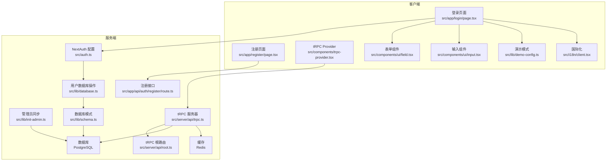

**图表来源**
- [src/app/login/page.tsx:1-165](file://src/app/login/page.tsx#L1-L165)
- [src/lib/validations/auth.ts:1-12](file://src/lib/validations/auth.ts#L1-L12)
- [src/lib/demo-config.ts:1-57](file://src/lib/demo-config.ts#L1-L57)
- [src/components/ui/field.tsx:1-245](file://src/components/ui/field.tsx#L1-L245)
- [src/components/ui/input.tsx:1-41](file://src/components/ui/input.tsx#L1-L41)
- [src/i18n/client.tsx:1-96](file://src/i18n/client.tsx#L1-L96)

**章节来源**
- [src/auth.ts:1-114](file://src/auth.ts#L1-L114)
- [src/lib/schema.ts:1-162](file://src/lib/schema.ts#L1-L162)
- [src/lib/database.ts:1-692](file://src/lib/database.ts#L1-L692)
- [src/lib/init-admin.ts:1-79](file://src/lib/init-admin.ts#L1-L79)
- [src/app/layout.tsx:1-54](file://src/app/layout.tsx#L1-L54)

## 核心组件
- NextAuth 配置与回调：定义凭据提供商、JWT 与 Session 回调、登录页跳转与密钥，现基于数据库驱动的用户认证。
- 管理员同步功能：应用启动时自动同步管理员用户，确保管理员凭据的一致性。
- 数据库操作模块：通过 userDb 模块统一管理用户查询、创建、更新、删除等操作。
- tRPC 认证上下文与中间件：从 NextAuth 获取会话，保护过程调用，统一错误格式化。
- 注册接口：基于 Drizzle ORM 写入用户表，使用 bcrypt 进行密码哈希。
- 登录前端：使用 next-auth/react 的 signIn 方法提交凭据，集成 react-hook-form 和 zod 验证。
- 表单验证系统：使用 zod 定义登录表单的验证规则，提供实时客户端验证。
- 液体玻璃设计：采用现代化的液态玻璃效果，提升视觉体验。
- 演示模式：支持演示模式下的自动凭据填充和权限控制。
- 国际化支持：完整的中英文翻译支持，动态语言切换。
- 自定义 UI 组件：基于 shadcn 组件库的表单组件，支持液体玻璃效果。

**章节来源**
- [src/app/login/page.tsx:1-165](file://src/app/login/page.tsx#L1-L165)
- [src/lib/validations/auth.ts:1-12](file://src/lib/validations/auth.ts#L1-L12)
- [src/lib/demo-config.ts:1-57](file://src/lib/demo-config.ts#L1-L57)
- [src/i18n/client.tsx:1-96](file://src/i18n/client.tsx#L1-L96)

## 架构总览
认证与授权的整体流程如下：
- 应用启动时，init-admin 模块同步管理员用户到数据库。
- 用户在登录页输入凭据，前端使用 react-hook-form 和 zod 进行实时验证。
- NextAuth 在后端执行 authorize 回调，通过 userDb.getByEmail 查询数据库用户。
- NextAuth 验证用户存在、密码匹配、状态正常且是管理员，返回用户信息。
- NextAuth 将用户信息写入 JWT 与 Session，并持久化到数据库表（accounts/sessions/verification_tokens）。
- tRPC 通过 getServerSession 获取当前会话，受 protectedProcedure 中间件保护。
- 注册流程通过 /api/auth/register 接口完成用户创建与默认配额策略关联。

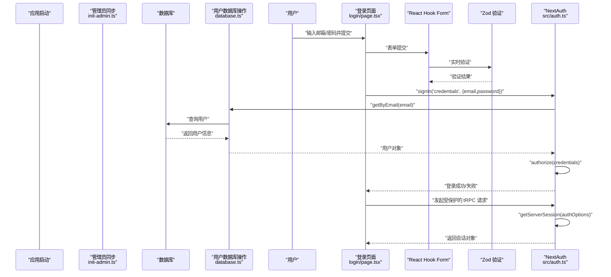

**图表来源**
- [src/lib/init-admin.ts:9-70](file://src/lib/init-admin.ts#L9-L70)
- [src/lib/database.ts:584-592](file://src/lib/database.ts#L584-L592)
- [src/app/login/page.tsx:23-61](file://src/app/login/page.tsx#L23-L61)
- [src/lib/validations/auth.ts:3-9](file://src/lib/validations/auth.ts#L3-L9)

**章节来源**
- [src/app/layout.tsx:8-11](file://src/app/layout.tsx#L8-L11)
- [src/lib/init-admin.ts:1-79](file://src/lib/init-admin.ts#L1-L79)
- [src/lib/database.ts:581-692](file://src/lib/database.ts#L581-L692)
- [src/auth.ts:1-114](file://src/auth.ts#L1-L114)

## 详细组件分析

### NextAuth.js 配置与集成
- 凭据提供商：定义 email/password 字段，authorize 回调通过 userDb.getByEmail 从数据库查找用户。
- 数据库驱动认证：验证用户存在、密码匹配、状态正常且是管理员。
- JWT 与 Session 回调：将用户的角色、状态等字段写入 token 与 session。
- 登录页：通过 pages.signIn 指向 /login。
- 密钥与 URL：从环境变量读取 NEXTAUTH_SECRET 与 NEXTAUTH_URL。

**更新** NextAuth 配置现在完全基于数据库驱动，通过 userDb 模块进行用户认证，移除了环境变量中的硬编码管理员凭据。

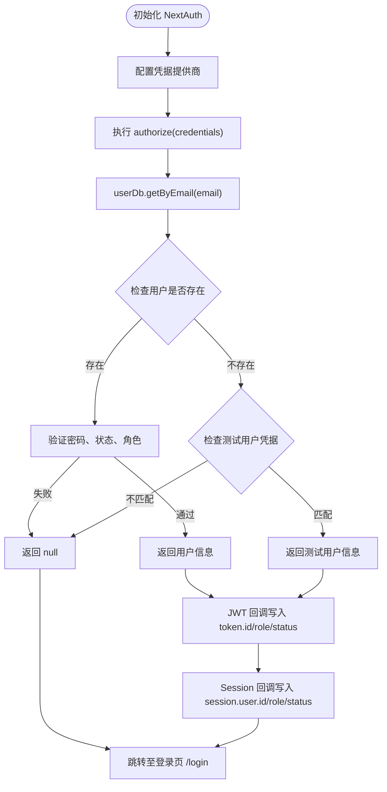

**图表来源**
- [src/auth.ts:8-82](file://src/auth.ts#L8-L82)
- [src/lib/database.ts:584-592](file://src/lib/database.ts#L584-L592)

**章节来源**
- [src/auth.ts:1-114](file://src/auth.ts#L1-L114)
- [src/lib/database.ts:581-692](file://src/lib/database.ts#L581-L692)

### 管理员同步功能
- 应用启动时自动同步：在 app/layout.tsx 中调用 syncAdminUserOnStartup()。
- 环境变量驱动：从环境变量 ADMIN_EMAIL、ADMIN_PASSWORD、ADMIN_NAME 获取管理员信息。
- 数据库操作：删除现有管理员用户，创建新的管理员用户并关联默认配额策略。
- 单次执行：使用 hasSynced 标志确保只执行一次。

**更新** 新增的管理员同步功能确保管理员凭据始终与数据库保持一致，提升了系统的安全性和可维护性。

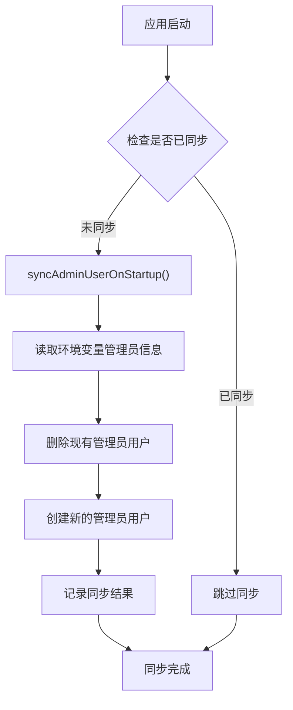

**图表来源**
- [src/app/layout.tsx:8-11](file://src/app/layout.tsx#L8-L11)
- [src/lib/init-admin.ts:9-70](file://src/lib/init-admin.ts#L9-L70)

**章节来源**
- [src/app/layout.tsx:1-54](file://src/app/layout.tsx#L1-L54)
- [src/lib/init-admin.ts:1-79](file://src/lib/init-admin.ts#L1-L79)

### 数据库驱动的用户管理
- 用户查询：getByEmail() 和 getById() 提供邮箱和ID查询功能。
- 用户操作：create()、update()、updatePassword()、delete()、deleteAll() 提供完整的用户生命周期管理。
- 管理员管理：getAdmins() 获取所有管理员用户。
- 密码处理：支持明文密码存储（开发环境）和加密密码存储（生产环境）。

**更新** 新增的 userDb 模块提供了统一的用户管理接口，替代了之前的环境变量驱动模式。

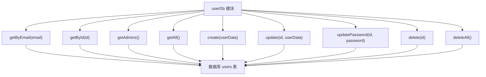

**图表来源**
- [src/lib/database.ts:581-692](file://src/lib/database.ts#L581-L692)

**章节来源**
- [src/lib/database.ts:581-692](file://src/lib/database.ts#L581-L692)

### tRPC 中间件与认证逻辑
- 上下文：createTRPCContext 通过 getServerSession(authOptions) 获取会话。
- 公开过程：publicProcedure 对未登录用户开放。
- 受保护过程：protectedProcedure 校验 ctx.session.user 是否存在，否则抛出 UNAUTHORIZED。
- 错误格式化：统一返回包含 zodError 的结构。

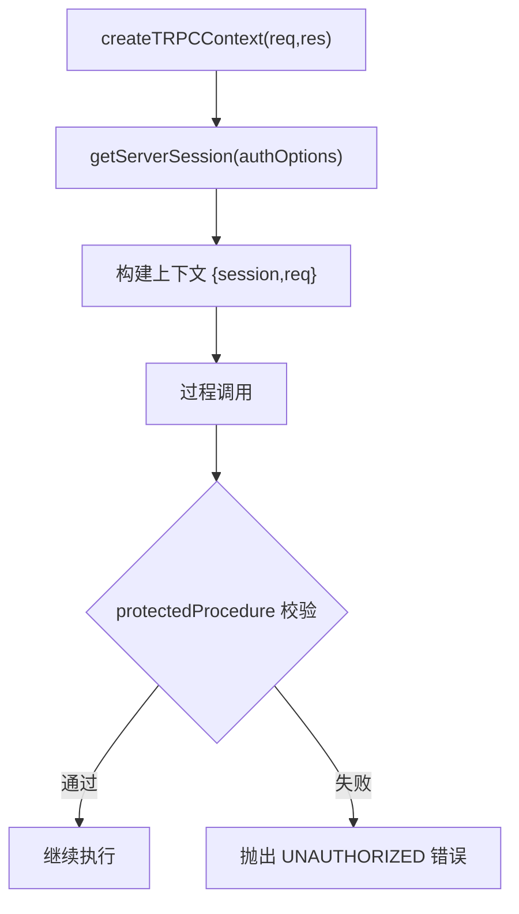

**图表来源**
- [src/server/api/trpc.ts:55-128](file://src/server/api/trpc.ts#L55-L128)

**章节来源**
- [src/server/api/trpc.ts:1-153](file://src/server/api/trpc.ts#L1-L153)

### 用户注册流程
- 前端注册页面收集 name/email/password 并提交到 /api/auth/register。
- 后端接口：
  - 检查邮箱唯一性。
  - 使用 bcrypt 对密码进行哈希。
  - 查询默认配额策略并关联到新用户。
  - 插入 users 表并返回结果。

**更新** 注册流程保持不变，但用户数据现在存储在数据库中，而非环境变量。

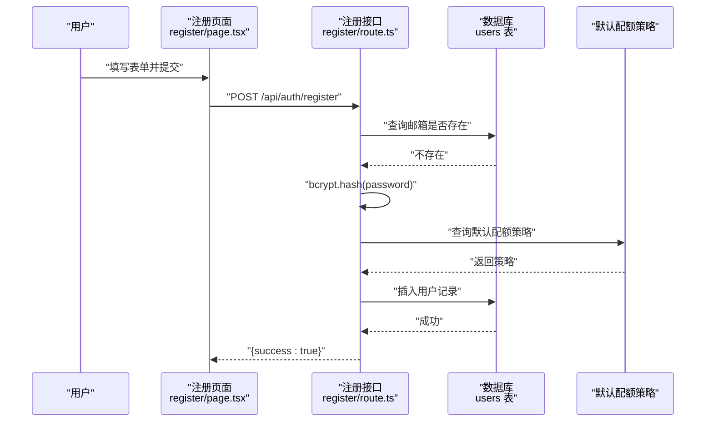

**图表来源**
- [src/app/register/page.tsx:14-41](file://src/app/register/page.tsx#L14-L41)
- [src/app/api/auth/register/route.ts:4-24](file://src/app/api/auth/register/route.ts#L4-L24)

**章节来源**
- [src/app/register/page.tsx:1-127](file://src/app/register/page.tsx#L1-L127)
- [src/app/api/auth/register/route.ts:1-30](file://src/app/api/auth/register/route.ts#L1-L30)

### 登录验证流程
- 前端使用 next-auth/react 的 signIn 方法提交 credentials。
- NextAuth 执行 authorize 回调，通过 userDb.getByEmail 查询数据库用户。
- 成功后重定向到 /dashboard，失败时显示错误信息。
- **移除** 自动默认凭据填充功能，专注于标准的用户认证流程。

**更新** 登录页面现在专注于标准的用户认证流程，移除了自动默认凭据填充功能，增强了安全性。

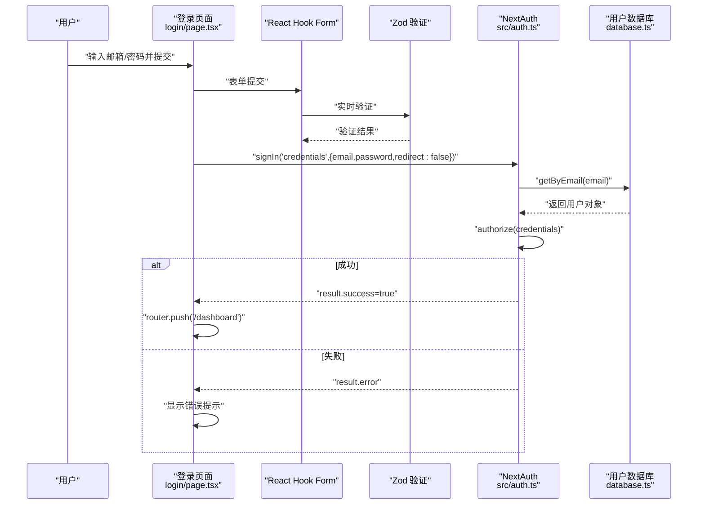

**图表来源**
- [src/app/login/page.tsx:23-61](file://src/app/login/page.tsx#L23-L61)
- [src/lib/validations/auth.ts:3-9](file://src/lib/validations/auth.ts#L3-L9)
- [src/auth.ts:14-82](file://src/auth.ts#L14-L82)
- [src/lib/database.ts:584-592](file://src/lib/database.ts#L584-L592)

**章节来源**
- [src/app/login/page.tsx:1-165](file://src/app/login/page.tsx#L1-L165)
- [src/auth.ts:1-114](file://src/auth.ts#L1-L114)

### React Hook Form 与 Zod 验证系统
- 表单验证：使用 zod 定义登录表单的验证规则，包括邮箱格式和密码长度验证。
- 实时验证：通过 react-hook-form 提供实时客户端验证，改善用户体验。
- 错误处理：自动显示验证错误信息，支持多语言国际化。
- 默认值：在演示模式下自动填充演示凭据。

**更新** 新增的 react-hook-form 和 zod 验证系统显著提升了表单验证的准确性和用户体验。

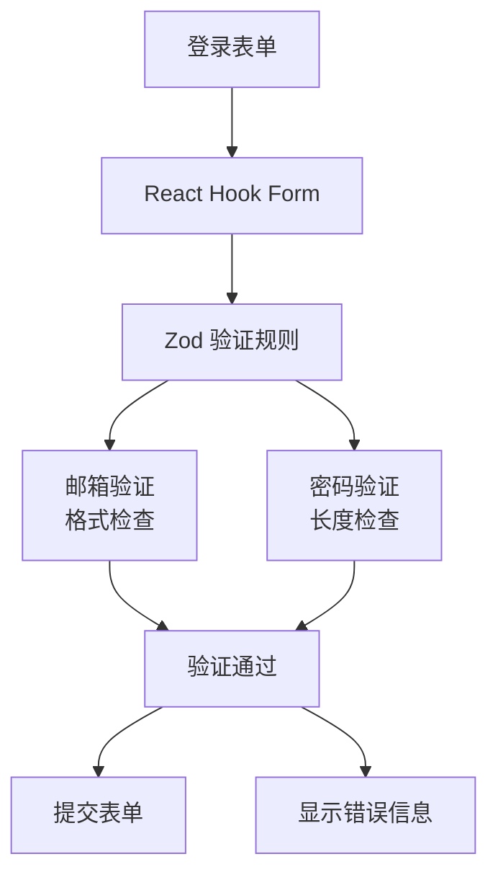

**图表来源**
- [src/app/login/page.tsx:23-35](file://src/app/login/page.tsx#L23-L35)
- [src/lib/validations/auth.ts:3-9](file://src/lib/validations/auth.ts#L3-L9)

**章节来源**
- [src/app/login/page.tsx:1-165](file://src/app/login/page.tsx#L1-L165)
- [src/lib/validations/auth.ts:1-12](file://src/lib/validations/auth.ts#L1-L12)

### 液体玻璃卡片设计
- 视觉效果：采用现代化的液态玻璃效果，提升视觉体验。
- 背景模糊：使用 backdrop-blur-2xl 实现毛玻璃效果。
- 边框设计：半透明边框增强层次感。
- 阴影效果：内阴影和外阴影营造立体感。
- 响应式设计：支持深色模式和浅色模式。

**更新** 登录页面采用了全新的液体玻璃设计，提供现代化的视觉体验。

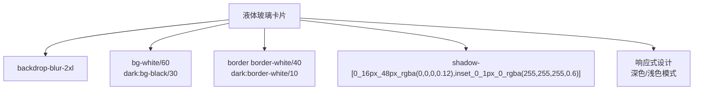

**图表来源**
- [src/app/login/page.tsx:69-78](file://src/app/login/page.tsx#L69-L78)
- [src/app/globals.css:5-51](file://src/app/globals.css#L5-L51)

**章节来源**
- [src/app/login/page.tsx:68-161](file://src/app/login/page.tsx#L68-L161)
- [src/app/globals.css:1-137](file://src/app/globals.css#L1-L137)

### 演示模式支持
- 模式检测：通过环境变量控制演示模式的启用。
- 自动填充：在演示模式下自动填充演示凭据。
- 权限控制：限制演示模式下的数据修改操作。
- 配置管理：支持多种演示模式配置选项。

**更新** 新增的演示模式支持，允许在演示环境中自动填充凭据并限制操作权限。

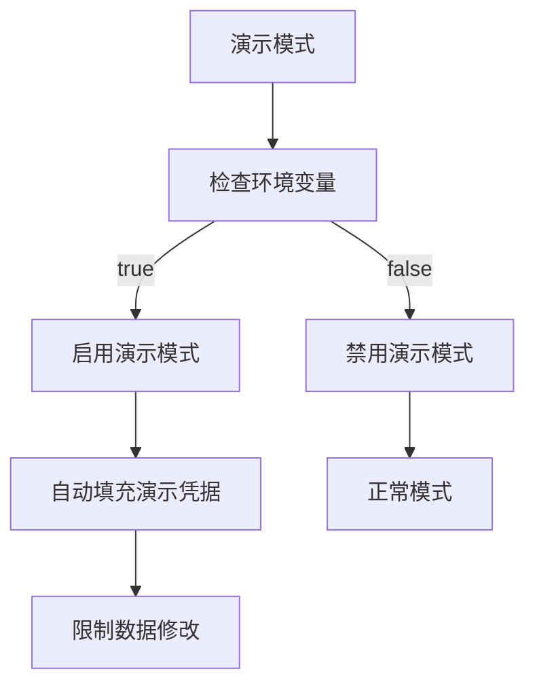

**图表来源**
- [src/lib/demo-config.ts:6-9](file://src/lib/demo-config.ts#L6-L9)
- [src/lib/demo-config.ts:25-35](file://src/lib/demo-config.ts#L25-L35)
- [src/app/login/page.tsx:25-33](file://src/app/login/page.tsx#L25-L33)

**章节来源**
- [src/lib/demo-config.ts:1-57](file://src/lib/demo-config.ts#L1-L57)
- [src/app/login/page.tsx:1-165](file://src/app/login/page.tsx#L1-L165)

### 国际化与本地化
- 多语言支持：支持中文和英文两种语言。
- 动态切换：通过 useTranslation hook 实现语言动态切换。
- 本地存储：使用 localStorage 保存用户语言偏好。
- 翻译键值：完整的翻译键值映射，支持嵌套路径访问。

**更新** 新增的国际化支持，提供完整的中英文翻译和动态语言切换功能。

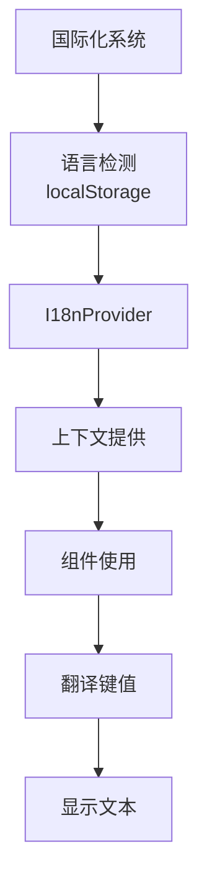

**图表来源**
- [src/i18n/client.tsx:53-86](file://src/i18n/client.tsx#L53-L86)
- [src/messages/zh.json:29-44](file://src/messages/zh.json#L29-L44)

**章节来源**
- [src/i18n/client.tsx:1-96](file://src/i18n/client.tsx#L1-L96)
- [src/messages/zh.json:1-180](file://src/messages/zh.json#L1-L180)

### 用户角色管理与权限控制
- 角色与状态枚举：roleEnum 与 statusEnum 定义在数据库模式中。
- 用户表包含 role 与 status 字段，JWT/Session 回调将这些字段注入到 token/session。
- 白名单规则与配额策略：通过 whitelistRules 与 quotaPolicies 实现基于规则的策略匹配与统计。

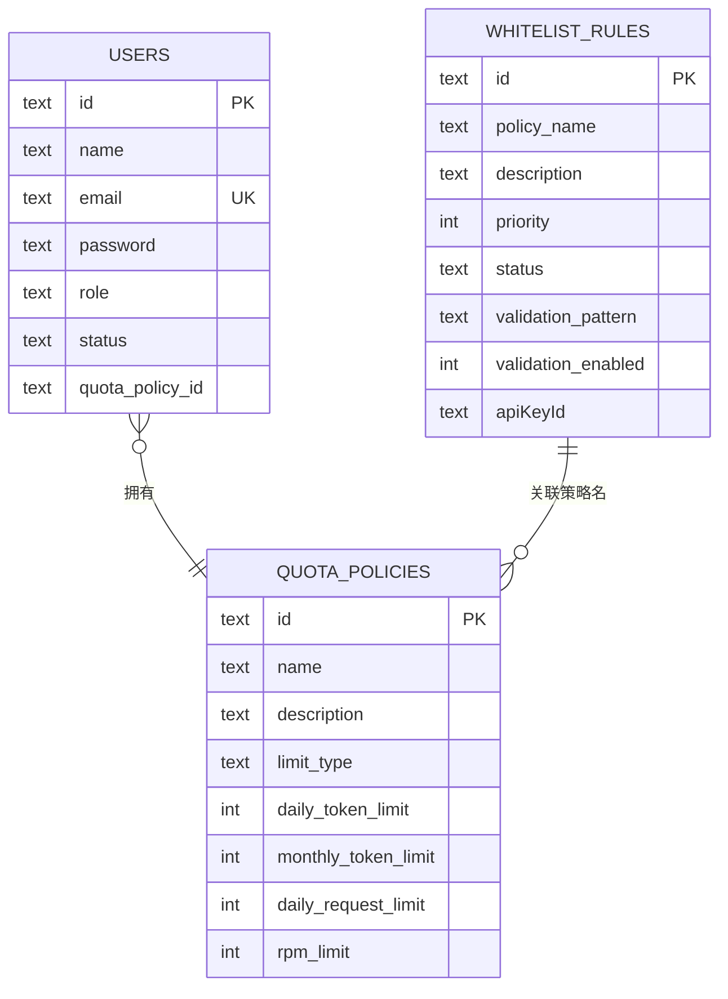

**图表来源**
- [src/lib/schema.ts:70-83](file://src/lib/schema.ts#L70-L83)
- [src/lib/schema.ts:28-40](file://src/lib/schema.ts#L28-L40)
- [src/lib/schema.ts:85-98](file://src/lib/schema.ts#L85-L98)

**章节来源**
- [src/lib/schema.ts:12-162](file://src/lib/schema.ts#L12-L162)

### 会话管理实现
- NextAuth 默认使用数据库存储 accounts/sessions/verification_tokens。
- JWT 与 Session 回调将用户角色与状态写入 token/session，便于 tRPC 中间件读取。
- tRPC 通过 getServerSession 获取会话，确保受保护过程的安全性。

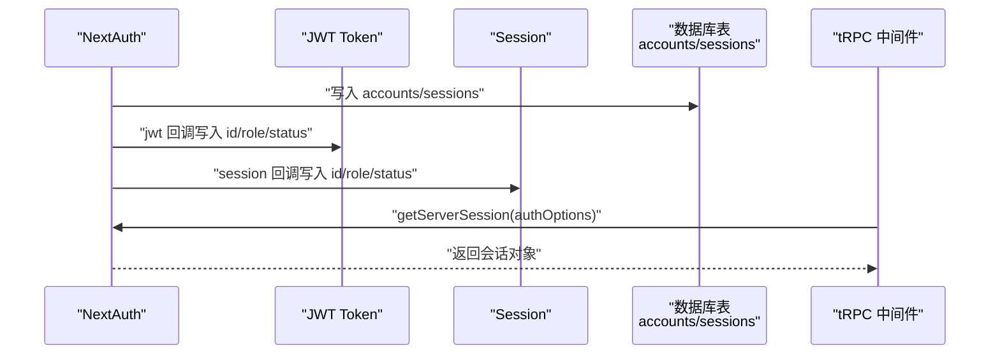

**图表来源**
- [src/auth.ts:84-100](file://src/auth.ts#L84-L100)
- [src/lib/schema.ts:100-125](file://src/lib/schema.ts#L100-L125)
- [src/server/api/trpc.ts:58-63](file://src/server/api/trpc.ts#L58-L63)

**章节来源**
- [src/auth.ts:1-114](file://src/auth.ts#L1-L114)
- [src/lib/schema.ts:100-137](file://src/lib/schema.ts#L100-L137)
- [src/server/api/trpc.ts:55-64](file://src/server/api/trpc.ts#L55-L64)

### tRPC 客户端集成
- TRPCProvider 统一配置 Transformer、Logger 与 Batch Link，指向 /api/trpc。
- 支持开发环境日志与错误追踪，便于调试。

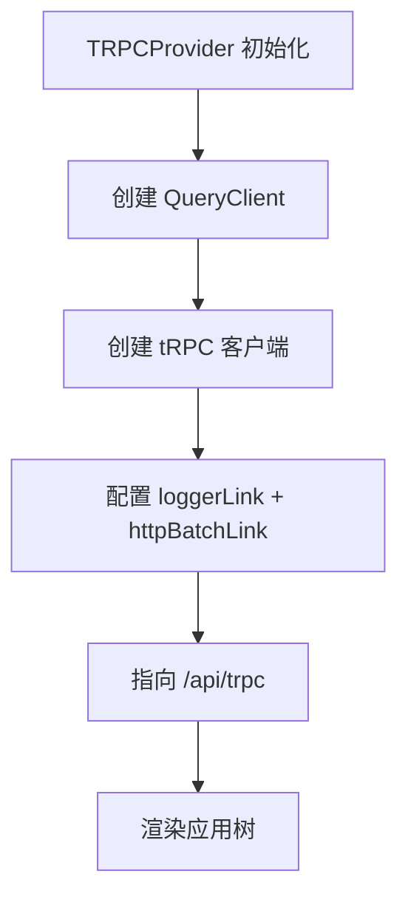

**图表来源**
- [src/components/trpc-provider.tsx:22-61](file://src/components/trpc-provider.tsx#L22-L61)

**章节来源**
- [src/components/trpc-provider.tsx:1-64](file://src/components/trpc-provider.tsx#L1-L64)
- [src/server/api/root.ts:1-25](file://src/server/api/root.ts#L1-L25)

### 自定义 UI 组件系统
- 表单组件：Field、FieldLabel、FieldDescription、FieldError 等组件。
- 输入组件：Input 组件支持液体玻璃效果。
- 按钮组件：支持多种变体，包括液体玻璃效果。
- 组件变体：通过 class-variance-authority 实现组件变体系统。

**更新** 新增的自定义 UI 组件系统，提供一致的设计语言和液体玻璃效果。

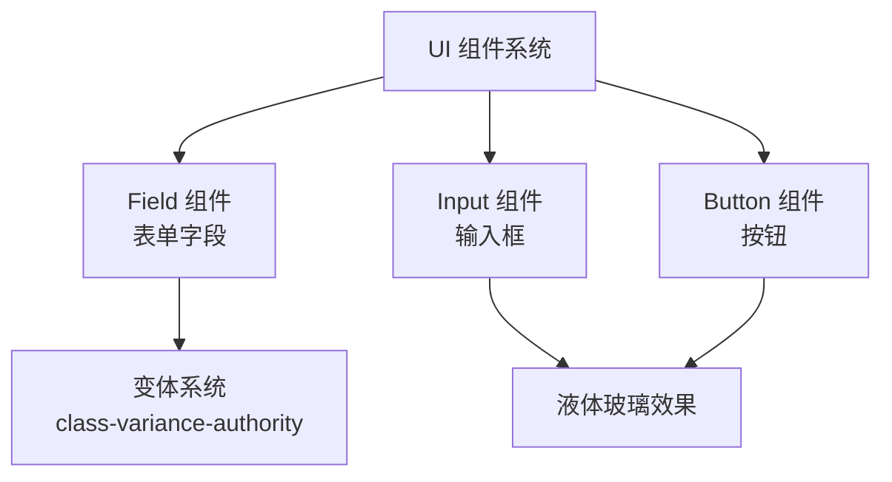

**图表来源**
- [src/components/ui/field.tsx:57-79](file://src/components/ui/field.tsx#L57-L79)
- [src/components/ui/input.tsx:13-31](file://src/components/ui/input.tsx#L13-L31)

**章节来源**
- [src/components/ui/field.tsx:1-245](file://src/components/ui/field.tsx#L1-L245)
- [src/components/ui/input.tsx:1-41](file://src/components/ui/input.tsx#L1-L41)

## 依赖关系分析
- NextAuth 依赖：next-auth、@auth/core、@auth/drizzle-adapter。
- tRPC 依赖：@trpc/server、@trpc/client、@trpc/react-query、@trpc/next。
- 数据库：drizzle-orm、postgres、drizzle-kit。
- 加密与工具：bcryptjs、nanoid、superjson、zod。
- 前端 UI：TailwindCSS、shadcn 组件库。
- 表单验证：react-hook-form、@hookform/resolvers、zod。
- 国际化：next-intl、ahooks。

**更新** 新增了 react-hook-form、@hookform/resolvers 和 @hookform/resolvers 等依赖，用于表单验证和国际化支持。

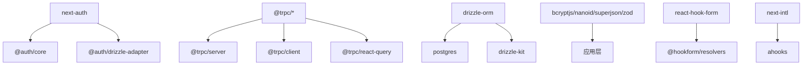

**图表来源**
- [package.json:18-56](file://package.json#L18-L56)
- [package.json:25-26](file://package.json#L25-L26)
- [package.json:55-56](file://package.json#L55-L56)

**章节来源**
- [package.json:1-94](file://package.json#L1-L94)

## 性能考虑
- tRPC 批处理：httpBatchLink 减少网络往返，提升请求吞吐。
- 缓存：结合 Redis 使用（环境变量已配置），可对热点数据进行缓存。
- 会话获取：getServerSession 在每次请求中获取会话，建议在上游增加缓存层以降低数据库压力。
- 密码哈希成本：bcrypt 的成本因子已设置为较高值，注意在高并发场景下的 CPU 开销。
- **新增** 表单验证性能：react-hook-form 的实时验证在表单复杂度增加时可能影响性能。
- **新增** 液体玻璃效果：backdrop-blur 效果在低端设备上可能影响渲染性能。
- **新增** 演示模式优化：演示模式下的自动填充和权限控制需要额外的性能考虑。

## 故障排除指南
- 登录失败：检查 email/password 是否与 userDb.getByEmail 查询结果一致；确认 NEXTAUTH_SECRET 与 NEXTAUTH_URL 配置正确。
- 注册失败：确认数据库连接正常、默认配额策略存在、邮箱唯一性约束未被违反。
- tRPC 401：确认受保护过程前已通过 NextAuth 登录，且 getServerSession 返回有效会话。
- 数据库迁移：使用 drizzle-kit 生成/推送迁移，确保 schema 与数据库一致。
- **新增** 表单验证失败：检查 zod 验证规则和 react-hook-form 配置。
- **新增** 液体玻璃效果异常：检查浏览器兼容性和 CSS 变量配置。
- **新增** 演示模式问题：确认环境变量配置和演示凭据有效性。
- **新增** 国际化问题：检查翻译键值和语言切换功能。
- **新增** 管理员同步失败：检查环境变量 ADMIN_EMAIL、ADMIN_PASSWORD、ADMIN_NAME 配置；确认数据库连接正常。
- **新增** 用户查询失败：检查数据库连接、users 表结构、索引是否正常。

**章节来源**
- [src/auth.ts:14-82](file://src/auth.ts#L14-L82)
- [src/lib/init-admin.ts:66-69](file://src/lib/init-admin.ts#L66-L69)
- [src/lib/database.ts:584-592](file://src/lib/database.ts#L584-L592)
- [src/server/api/trpc.ts:117-128](file://src/server/api/trpc.ts#L117-L128)
- [src/app/login/page.tsx:23-35](file://src/app/login/page.tsx#L23-L35)

## 结论
AIGate 的认证与授权系统已完成完全重构，从环境变量驱动改为数据库驱动，新增管理员同步功能，显著提升了系统的安全性和可维护性。系统以 NextAuth 为核心，结合 tRPC 的上下文与中间件实现会话管理与权限控制。用户注册采用 bcrypt 哈希与默认配额策略关联，登录流程通过凭据提供商完成数据库驱动的用户认证。

**更新** 本次更新反映了登录页面的重大改进，包括 react-hook-form 和 zod 验证系统的集成、液体玻璃卡片设计和演示模式支持，显著提升了用户体验和系统功能完整性。系统现在提供现代化的界面设计、强大的表单验证能力、灵活的演示模式配置和完整的国际化支持，具备良好的安全性、可扩展性和用户体验。

## 附录

### 配置选项与环境变量
- NEXTAUTH_SECRET：NextAuth 密钥，生产环境必须替换。
- NEXTAUTH_URL：NextAuth 回调与重定向的基础 URL。
- DATABASE_URL：PostgreSQL 连接字符串。
- REDIS_URL：Redis 缓存连接字符串。
- ADMIN_EMAIL：管理员邮箱，默认值为 admin@aigate.com
- ADMIN_PASSWORD：管理员密码，默认值为 admin123
- ADMIN_NAME：管理员姓名，默认值为 系统管理员
- **新增** NEXT_PUBLIC_DEMO_MODE：演示模式开关，默认为 true（Vercel 环境）
- **新增** DEMO_MODE：演示模式开关（服务端）
- **新增** DEMO_ALLOW_MUTATIONS：演示模式下允许数据修改，默认为 false
- **新增** DEMO_RESET_INTERVAL：演示数据重置间隔（毫秒）

**章节来源**
- [.env:1-12](file://.env#L1-L12)
- [vercel.json:19-26](file://vercel.json#L19-L26)

### 安全最佳实践
- 强制使用 HTTPS 与安全 Cookie。
- 生产环境设置强随机 NEXTAUTH_SECRET。
- 限制密码复杂度与长度，定期轮换密钥。
- 对 tRPC 受保护过程进行细粒度权限校验。
- 启用数据库审计与访问日志。
- **新增** 使用数据库驱动的管理员同步功能，避免硬编码凭据。
- **新增** 移除自动默认凭据填充功能，避免潜在的安全风险。
- **新增** 在演示模式下限制数据修改操作。
- **新增** 使用液体玻璃效果提升视觉安全性。

### 常见问题与解决方案
- 无法登录：核对 authorize 回调中的用户信息是否正确注入到 token/session；检查 userDb.getByEmail 查询是否返回正确的用户对象。
- 注册报错"尚未配置默认配额策略"：先创建默认配额策略再进行注册。
- tRPC 报 UNAUTHORIZED：确认前端已登录且会话有效。
- **新增** 表单验证失败：检查 zod 验证规则和 react-hook-form 配置；确认字段名称与验证规则匹配。
- **新增** 液体玻璃效果异常：检查浏览器对 backdrop-filter 的支持；确认 CSS 变量正确配置。
- **新增** 演示模式下无法登录：确认演示凭据配置正确；检查演示模式环境变量设置。
- **新增** 国际化文本显示异常：检查翻译键值是否存在；确认语言切换功能正常工作。
- **新增** 演示模式权限问题：确认演示模式下的权限配置；检查数据修改操作是否被正确限制。
- **新增** 管理员同步失败：检查环境变量配置和数据库连接；查看同步日志输出。
- **新增** 用户查询异常：检查数据库连接状态、users 表结构和索引。
- **新增** 登录页面无自动填充：这是预期的安全行为，用户需要手动输入凭据。
- **新增** 表单验证错误不显示：检查 react-hook-form 的错误处理配置；确认 FieldError 组件正确使用。