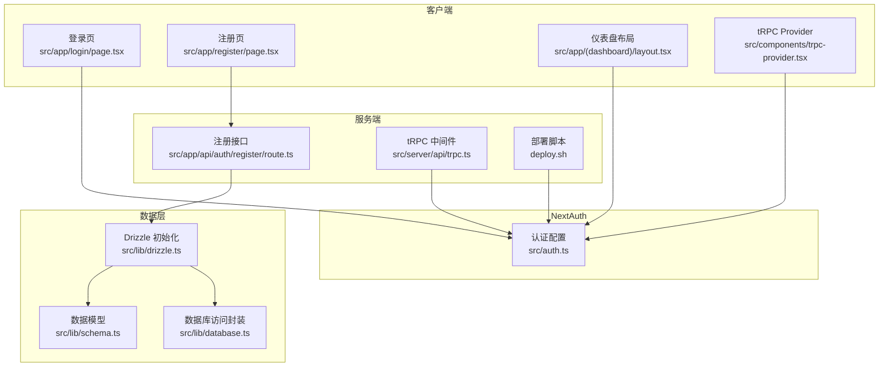
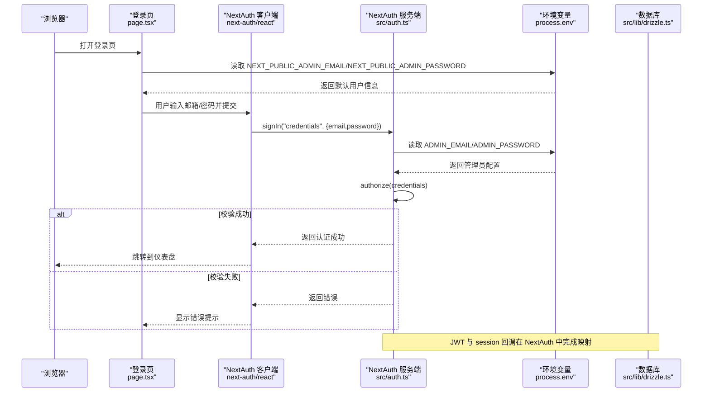
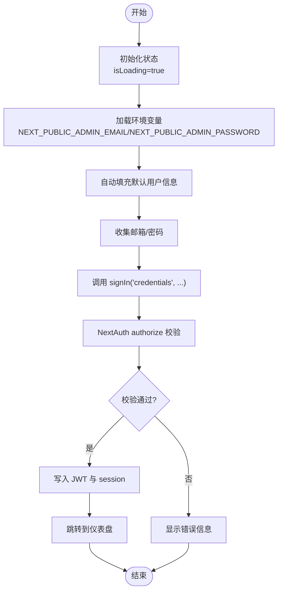
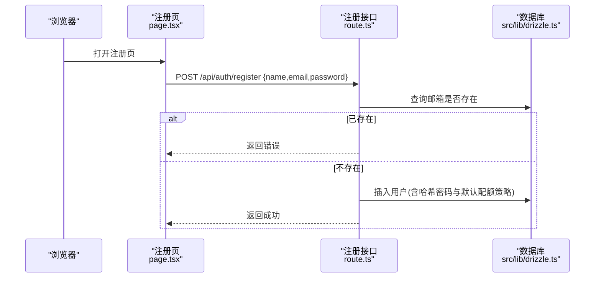
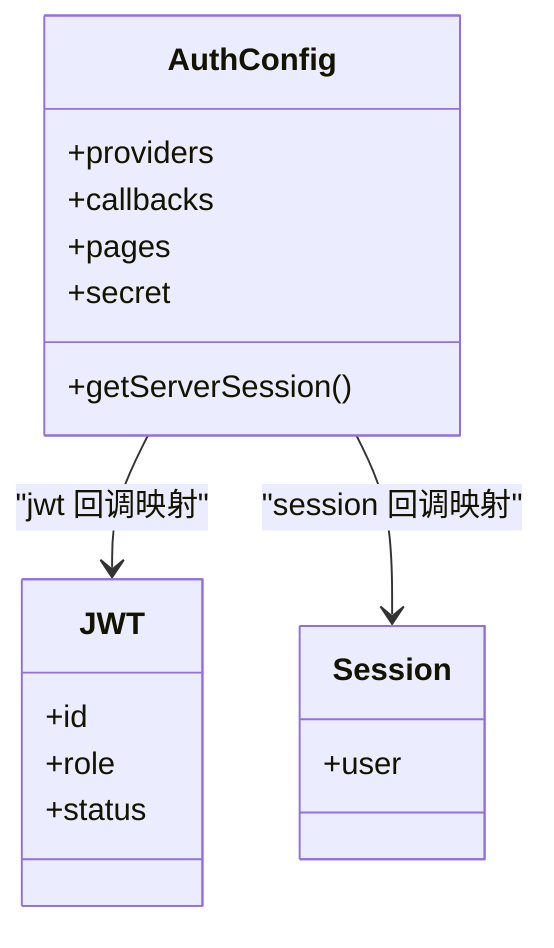
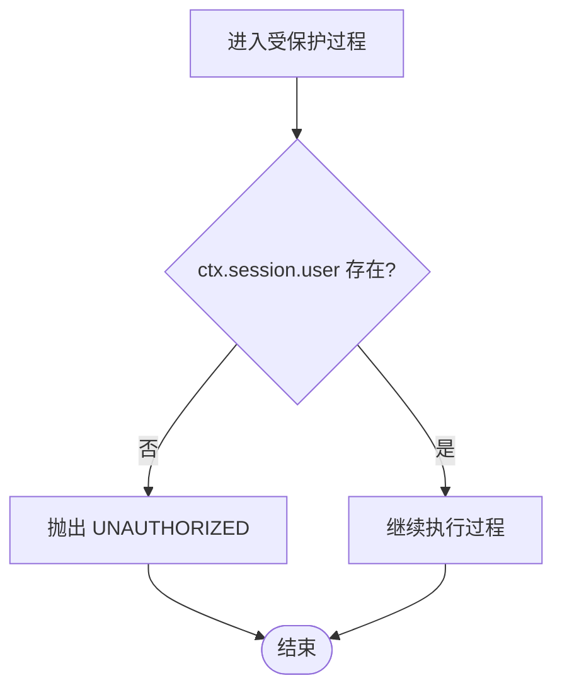
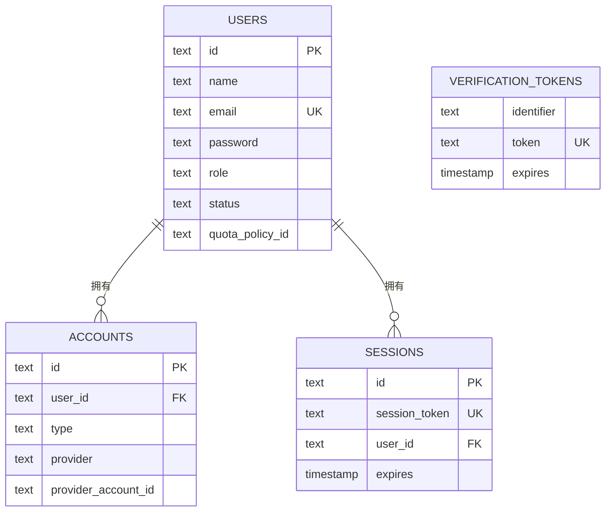
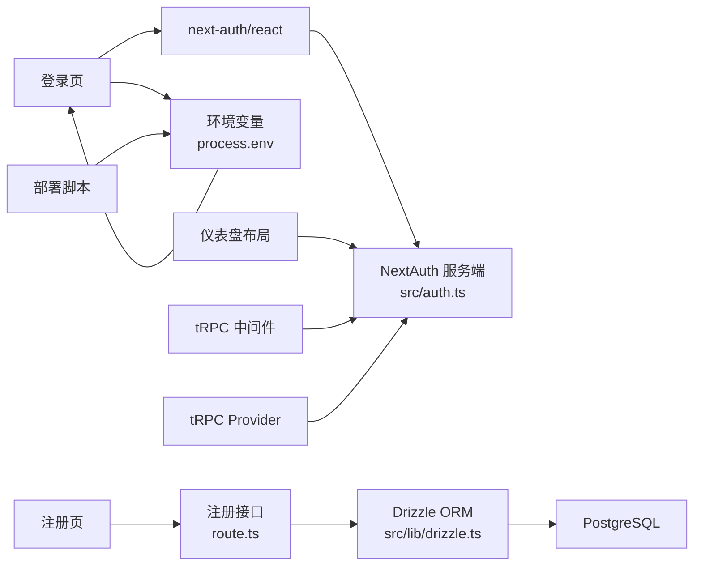

# 用户认证流程

<cite>
**本文引用的文件**
- [src/auth.ts](file://src/auth.ts)
- [src/app/login/page.tsx](file://src/app/login/page.tsx)
- [src/app/register/page.tsx](file://src/app/register/page.tsx)
- [src/app/api/auth/register/route.ts](file://src/app/api/auth/register/route.ts)
- [src/lib/schema.ts](file://src/lib/schema.ts)
- [src/lib/database.ts](file://src/lib/database.ts)
- [src/lib/drizzle.ts](file://src/lib/drizzle.ts)
- [src/app/(dashboard)/layout.tsx](file://src/app/(dashboard)/layout.tsx)
- [src/app/layout.tsx](file://src/app/layout.tsx)
- [src/server/api/trpc.ts](file://src/server/api/trpc.ts)
- [src/components/dashboard-layout.tsx](file://src/components/dashboard-layout.tsx)
- [src/components/trpc-provider.tsx](file://src/components/trpc-provider.tsx)
- [deploy.sh](file://deploy.sh)
</cite>

## 更新摘要
**变更内容**
- 登录页面增强：改进了错误处理机制和环境变量支持
- 加载状态管理：新增初始加载状态和更精确的加载控制
- 环境变量配置：支持从环境变量读取默认用户信息
- 部署脚本：增强了环境变量配置和管理功能

## 目录
1. [简介](#简介)
2. [项目结构](#项目结构)
3. [核心组件](#核心组件)
4. [架构总览](#架构总览)
5. [详细组件分析](#详细组件分析)
6. [依赖关系分析](#依赖关系分析)
7. [性能考量](#性能考量)
8. [故障排查指南](#故障排查指南)
9. [结论](#结论)
10. [附录](#附录)

## 简介
本文件面向开发者，系统性梳理并解释本项目的用户认证与授权体系，覆盖以下方面：
- 凭据认证（用户名/密码）的登录、注册与注销流程
- 授权回调与会话状态管理（JWT 令牌与 session 的映射）
- 登录页与注册页的前端实现、表单验证与错误处理
- 注册后端接口与数据库写入、密码加密与默认配额策略绑定
- 认证中间件与路由保护策略（基于 tRPC 保护过程）
- 权限与状态管理在服务端与客户端的协作方式

## 项目结构
围绕认证的关键目录与文件如下：
- NextAuth 配置与入口：src/auth.ts
- 登录页与注册页：src/app/login/page.tsx、src/app/register/page.tsx
- 注册 API：src/app/api/auth/register/route.ts
- 数据模型与数据库访问：src/lib/schema.ts、src/lib/database.ts、src/lib/drizzle.ts
- 路由保护与 tRPC 中间件：src/server/api/trpc.ts
- 仪表盘布局与重定向：src/app/(dashboard)/layout.tsx、src/components/dashboard-layout.tsx
- 根布局：src/app/layout.tsx
- 环境变量配置：deploy.sh

**图表来源**
- [src/app/login/page.tsx](file://src/app/login/page.tsx#L1-L114)
- [src/app/register/page.tsx](file://src/app/register/page.tsx#L1-L128)
- [src/app/api/auth/register/route.ts](file://src/app/api/auth/register/route.ts#L1-L46)
- [src/auth.ts](file://src/auth.ts#L1-L98)
- [src/server/api/trpc.ts](file://src/server/api/trpc.ts#L1-L138)
- [src/lib/schema.ts](file://src/lib/schema.ts#L1-L159)
- [src/lib/drizzle.ts](file://src/lib/drizzle.ts#L1-L12)
- [src/lib/database.ts](file://src/lib/database.ts#L1-L524)
- [src/app/(dashboard)/layout.tsx](file://src/app/(dashboard)/layout.tsx#L1-L20)
- [src/components/trpc-provider.tsx](file://src/components/trpc-provider.tsx#L1-L64)
- [deploy.sh](file://deploy.sh#L1-L381)

**章节来源**
- [src/auth.ts](file://src/auth.ts#L1-L98)
- [src/app/login/page.tsx](file://src/app/login/page.tsx#L1-L114)
- [src/app/register/page.tsx](file://src/app/register/page.tsx#L1-L128)
- [src/app/api/auth/register/route.ts](file://src/app/api/auth/register/route.ts#L1-L46)
- [src/lib/schema.ts](file://src/lib/schema.ts#L1-L159)
- [src/lib/database.ts](file://src/lib/database.ts#L1-L524)
- [src/lib/drizzle.ts](file://src/lib/drizzle.ts#L1-L12)
- [src/app/(dashboard)/layout.tsx](file://src/app/(dashboard)/layout.tsx#L1-L20)
- [src/server/api/trpc.ts](file://src/server/api/trpc.ts#L1-L138)
- [src/app/layout.tsx](file://src/app/layout.tsx#L1-L51)
- [src/components/trpc-provider.tsx](file://src/components/trpc-provider.tsx#L1-L64)
- [deploy.sh](file://deploy.sh#L1-L381)

## 核心组件
- NextAuth 凭据认证配置与回调：负责凭据校验、JWT 与 session 的映射、登录页跳转与密钥配置
- 登录页：前端表单收集邮箱/密码，调用 next-auth/react 的 signIn 触发凭据认证，支持环境变量配置和改进的错误处理
- 注册页：前端收集姓名/邮箱/密码，提交至 /api/auth/register
- 注册接口：接收 JSON，检查重复、哈希密码、绑定默认配额策略并写入数据库
- 数据模型与访问层：定义 users、accounts、sessions、verification_tokens 等表及关系；封装数据库 CRUD
- 路由保护中间件：基于 tRPC 的 protectedProcedure 实现"仅登录用户可访问"的路由保护
- 仪表盘布局：服务端获取 NextAuth 会话，未登录则重定向至登录页
- 环境变量配置：通过部署脚本管理 ADMIN_EMAIL、ADMIN_PASSWORD 等关键配置

**章节来源**
- [src/auth.ts](file://src/auth.ts#L1-L98)
- [src/app/login/page.tsx](file://src/app/login/page.tsx#L1-L114)
- [src/app/register/page.tsx](file://src/app/register/page.tsx#L1-L128)
- [src/app/api/auth/register/route.ts](file://src/app/api/auth/register/route.ts#L1-L46)
- [src/lib/schema.ts](file://src/lib/schema.ts#L69-L134)
- [src/lib/database.ts](file://src/lib/database.ts#L1-L524)
- [src/server/api/trpc.ts](file://src/server/api/trpc.ts#L107-L128)
- [src/app/(dashboard)/layout.tsx](file://src/app/(dashboard)/layout.tsx#L1-L20)
- [deploy.sh](file://deploy.sh#L91-L192)

## 架构总览
下图展示从浏览器到数据库的认证与授权全链路：

**图表来源**
- [src/app/login/page.tsx](file://src/app/login/page.tsx#L17-L54)
- [src/auth.ts](file://src/auth.ts#L13-L16)
- [src/auth.ts](file://src/auth.ts#L86-L89)

**章节来源**
- [src/app/login/page.tsx](file://src/app/login/page.tsx#L1-L114)
- [src/auth.ts](file://src/auth.ts#L1-L98)

## 详细组件分析

### 登录流程（凭据认证）
- 前端登录页收集邮箱与密码，调用 next-auth/react 的 signIn 并传入 provider 标识与凭据
- NextAuth 服务端在 authorize 回调中执行凭据校验，支持从环境变量读取管理员配置
- 成功后 NextAuth 将用户信息写入 JWT 与 session；失败则返回错误
- 登录成功后前端跳转到仪表盘，失败则显示错误信息

**图表来源**
- [src/app/login/page.tsx](file://src/app/login/page.tsx#L17-L54)
- [src/auth.ts](file://src/auth.ts#L13-L16)

**章节来源**
- [src/app/login/page.tsx](file://src/app/login/page.tsx#L1-L114)
- [src/auth.ts](file://src/auth.ts#L1-L98)

### 注册流程（凭据认证）
- 前端注册页收集姓名、邮箱、密码，提交到 /api/auth/register
- 后端接口解析 JSON，检查邮箱是否已存在
- 对密码进行哈希处理，查询默认配额策略并插入用户记录
- 返回成功或错误响应，前端根据响应更新界面状态

**图表来源**
- [src/app/register/page.tsx](file://src/app/register/page.tsx#L14-L41)
- [src/app/api/auth/register/route.ts](file://src/app/api/auth/register/route.ts#L7-L45)
- [src/lib/drizzle.ts](file://src/lib/drizzle.ts#L1-L12)
- [src/lib/schema.ts](file://src/lib/schema.ts#L69-L82)

**章节来源**
- [src/app/register/page.tsx](file://src/app/register/page.tsx#L1-L128)
- [src/app/api/auth/register/route.ts](file://src/app/api/auth/register/route.ts#L1-L46)
- [src/lib/schema.ts](file://src/lib/schema.ts#L69-L82)
- [src/lib/drizzle.ts](file://src/lib/drizzle.ts#L1-L12)

### 注销流程（概念说明）
- NextAuth 提供标准的登出流程，通常通过客户端调用 signOut 或服务端删除会话
- 本仓库未提供显式的注销页面或接口，但可基于 NextAuth 的标准能力扩展

### 凭据认证的授权逻辑与状态管理
- NextAuth 的 callbacks.jwt 与 callbacks.session 将用户角色与状态从后端映射到 JWT 与 session
- pages.signIn 指定登录页路径，便于认证失败时自动跳转
- 服务端通过 getServerSession 获取会话，用于服务端渲染与路由保护

**图表来源**
- [src/auth.ts](file://src/auth.ts#L68-L85)

**章节来源**
- [src/auth.ts](file://src/auth.ts#L1-L98)

### 登录页面实现、表单验证与错误处理
- **改进的错误处理**：登录页面现在有更完善的错误处理机制，包括网络异常和认证失败的区分处理
- **环境变量支持**：通过 useEffect 钩子从环境变量读取默认用户信息，支持 NEXT_PUBLIC_ADMIN_EMAIL 和 NEXT_PUBLIC_ADMIN_PASSWORD
- **加载状态管理**：新增 isLoading 状态，在初始加载时禁用登录按钮，提供更好的用户体验
- **表单字段**：邮箱、密码，必填
- **错误处理**：捕获 signIn 返回的 error 字段或异常，显示相应的错误信息
- **加载状态**：提交期间禁用按钮，初始加载时也禁用按钮，提升用户体验

**更新** 登录页面现在具备更完善的错误处理机制、环境变量支持和改进的加载状态管理

**章节来源**
- [src/app/login/page.tsx](file://src/app/login/page.tsx#L1-L114)

### 注册页面实现、密码验证与账户激活
- 表单字段：姓名、邮箱、密码，必填
- 错误处理：解析响应体，区分成功与失败消息
- 账户激活：当前注册接口未实现邮箱验证与账户激活逻辑，后续可扩展 verification_tokens 表与邮件发送

**章节来源**
- [src/app/register/page.tsx](file://src/app/register/page.tsx#L1-L128)
- [src/app/api/auth/register/route.ts](file://src/app/api/auth/register/route.ts#L1-L46)
- [src/lib/schema.ts](file://src/lib/schema.ts#L124-L134)

### 认证中间件、路由保护与权限验证
- tRPC 保护过程 protectedProcedure：校验 ctx.session 是否存在且包含用户信息，否则抛出 UNAUTHORIZED
- 可在需要登录态的 API 调用前使用该过程，确保只有已认证用户可访问
- 仪表盘布局在服务端获取会话，若无会话则重定向至登录页

**图表来源**
- [src/server/api/trpc.ts](file://src/server/api/trpc.ts#L117-L128)
- [src/app/(dashboard)/layout.tsx](file://src/app/(dashboard)/layout.tsx#L10-L19)

**章节来源**
- [src/server/api/trpc.ts](file://src/server/api/trpc.ts#L107-L128)
- [src/app/(dashboard)/layout.tsx](file://src/app/(dashboard)/layout.tsx#L1-L20)

### 数据模型与数据库交互
- 用户表 users：包含 id、name、email、password、role、status、quotaPolicyId 等字段
- NextAuth 相关表：accounts、sessions、verification_tokens，支持第三方账号与会话持久化
- 数据库访问封装：提供 API Key、配额策略、用量记录、白名单规则等 CRUD 方法，并包含统计与策略匹配逻辑

**图表来源**
- [src/lib/schema.ts](file://src/lib/schema.ts#L69-L134)

**章节来源**
- [src/lib/schema.ts](file://src/lib/schema.ts#L1-L159)
- [src/lib/database.ts](file://src/lib/database.ts#L1-L524)
- [src/lib/drizzle.ts](file://src/lib/drizzle.ts#L1-L12)

### 环境变量配置与管理
- **管理员配置**：通过 ADMIN_EMAIL 和 ADMIN_PASSWORD 环境变量配置管理员用户信息
- **前端环境变量**：通过 NEXT_PUBLIC_ADMIN_EMAIL 和 NEXT_PUBLIC_ADMIN_PASSWORD 提供给客户端使用
- **部署脚本集成**：deploy.sh 提供交互式配置界面，支持设置管理员邮箱、密码等关键配置
- **默认值支持**：当环境变量未设置时，使用默认值（如 admin@aigate.com、admin123）

**更新** 新增了完整的环境变量配置支持和管理功能

**章节来源**
- [src/auth.ts](file://src/auth.ts#L14-L16)
- [src/app/login/page.tsx](file://src/app/login/page.tsx#L43-L54)
- [deploy.sh](file://deploy.sh#L91-L192)

## 依赖关系分析
- 登录页依赖 next-auth/react 的 signIn，间接依赖 NextAuth 服务端配置
- 登录页通过 useEffect 从环境变量读取默认用户信息
- 注册页通过 fetch 调用 /api/auth/register，后者依赖 Drizzle ORM 与数据库
- 仪表盘布局依赖 getServerSession 进行服务端重定向
- tRPC 中间件依赖 NextAuth 的 getServerSession 与 authOptions
- 部署脚本管理环境变量配置

**图表来源**
- [src/app/login/page.tsx](file://src/app/login/page.tsx#L1-L114)
- [src/auth.ts](file://src/auth.ts#L1-L98)
- [src/app/register/page.tsx](file://src/app/register/page.tsx#L1-L128)
- [src/app/api/auth/register/route.ts](file://src/app/api/auth/register/route.ts#L1-L46)
- [src/lib/drizzle.ts](file://src/lib/drizzle.ts#L1-L12)
- [src/app/(dashboard)/layout.tsx](file://src/app/(dashboard)/layout.tsx#L1-L20)
- [src/server/api/trpc.ts](file://src/server/api/trpc.ts#L1-L138)
- [src/components/trpc-provider.tsx](file://src/components/trpc-provider.tsx#L1-L64)
- [deploy.sh](file://deploy.sh#L1-L381)

**章节来源**
- [src/app/login/page.tsx](file://src/app/login/page.tsx#L1-L114)
- [src/app/register/page.tsx](file://src/app/register/page.tsx#L1-L128)
- [src/app/api/auth/register/route.ts](file://src/app/api/auth/register/route.ts#L1-L46)
- [src/auth.ts](file://src/auth.ts#L1-L98)
- [src/lib/drizzle.ts](file://src/lib/drizzle.ts#L1-L12)
- [src/app/(dashboard)/layout.tsx](file://src/app/(dashboard)/layout.tsx#L1-L20)
- [src/server/api/trpc.ts](file://src/server/api/trpc.ts#L1-L138)
- [src/components/trpc-provider.tsx](file://src/components/trpc-provider.tsx#L1-L64)
- [deploy.sh](file://deploy.sh#L1-L381)

## 性能考量
- 密码哈希成本：注册接口使用较高成本参数以增强安全性，建议结合实际吞吐评估
- 数据库查询：注册前的邮箱重复检查与默认配额策略查询均为单条查询，复杂度低
- tRPC 保护过程：仅做会话存在性校验，开销极小
- **环境变量读取**：登录页面的环境变量读取在客户端执行，性能开销很小
- **加载状态优化**：初始加载状态避免了不必要的计算，提升了用户体验
- 建议：在高并发场景下，对注册接口增加幂等与限流策略；对数据库连接池与索引进行压测优化

## 故障排查指南
- 登录失败
  - 检查前端是否正确传递 email/password
  - 查看 NextAuth authorize 回调是否返回 null
  - 确认 pages.signIn 路径有效
  - **检查环境变量配置**：确认 ADMIN_EMAIL 和 ADMIN_PASSWORD 是否正确设置
- 注册失败
  - 检查邮箱是否已存在
  - 确认默认配额策略是否存在
  - 查看接口返回的错误信息
- 仪表盘无法访问
  - 检查服务端 getServerSession 是否返回会话
  - 确认未登录时的重定向逻辑
- tRPC 报 UNAUTHORIZED
  - 检查客户端是否已登录
  - 确认 ctx.session 是否注入到 tRPC 上下文
- **环境变量问题**
  - 检查 .env 文件中的 ADMIN_EMAIL 和 ADMIN_PASSWORD 配置
  - 确认 NEXT_PUBLIC_ADMIN_EMAIL 和 NEXT_PUBLIC_ADMIN_PASSWORD 是否正确设置
  - 使用部署脚本重新配置环境变量

**章节来源**
- [src/app/login/page.tsx](file://src/app/login/page.tsx#L17-L40)
- [src/app/api/auth/register/route.ts](file://src/app/api/auth/register/route.ts#L11-L28)
- [src/app/(dashboard)/layout.tsx](file://src/app/(dashboard)/layout.tsx#L10-L19)
- [src/server/api/trpc.ts](file://src/server/api/trpc.ts#L117-L128)
- [src/auth.ts](file://src/auth.ts#L14-L16)
- [deploy.sh](file://deploy.sh#L91-L192)

## 结论
本项目采用 NextAuth 凭据认证，结合 tRPC 保护过程与服务端布局重定向，实现了基础而完整的认证与授权闭环。登录与注册流程清晰，数据模型覆盖用户与会话管理。最新更新增强了登录页面的功能，包括更好的错误处理、环境变量支持和改进的加载状态管理。建议后续扩展包括：注册邮件验证与账户激活、更完善的密码强度策略、以及基于角色的细粒度权限控制。

## 附录
- NextAuth 配置要点
  - 凭据提供器与 authorize 回调
  - JWT 与 session 回调映射
  - 登录页重定向
- tRPC 保护过程
  - protectedProcedure 的校验逻辑
  - 在需要登录态的 API 中统一使用
- 数据库与模型
  - users、accounts、sessions、verification_tokens
  - 默认配额策略与用户绑定
- **环境变量配置**
  - ADMIN_EMAIL/ADMIN_PASSWORD：服务器端管理员配置
  - NEXT_PUBLIC_ADMIN_EMAIL/NEXT_PUBLIC_ADMIN_PASSWORD：客户端默认用户配置
  - 通过部署脚本进行交互式配置管理

**章节来源**
- [src/auth.ts](file://src/auth.ts#L1-L98)
- [src/server/api/trpc.ts](file://src/server/api/trpc.ts#L107-L128)
- [src/lib/schema.ts](file://src/lib/schema.ts#L69-L134)
- [src/app/login/page.tsx](file://src/app/login/page.tsx#L43-L54)
- [deploy.sh](file://deploy.sh#L91-L192)