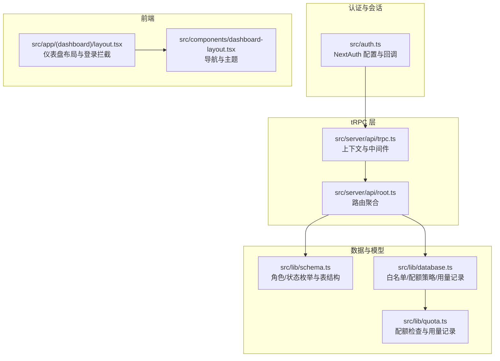
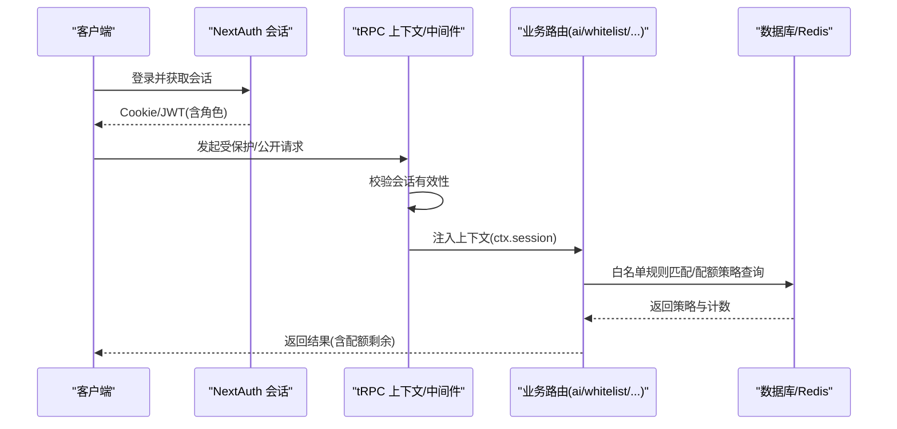
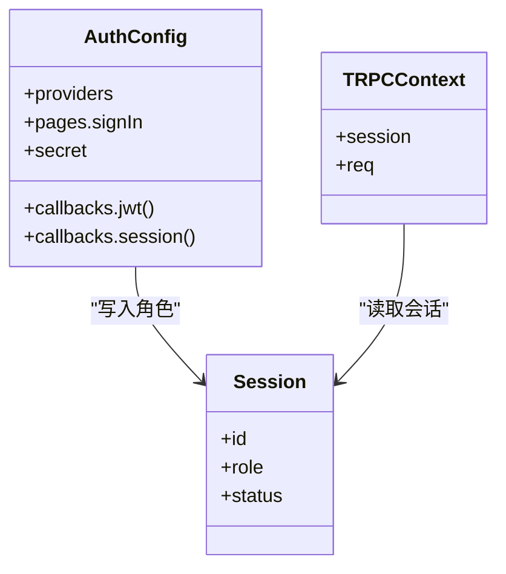
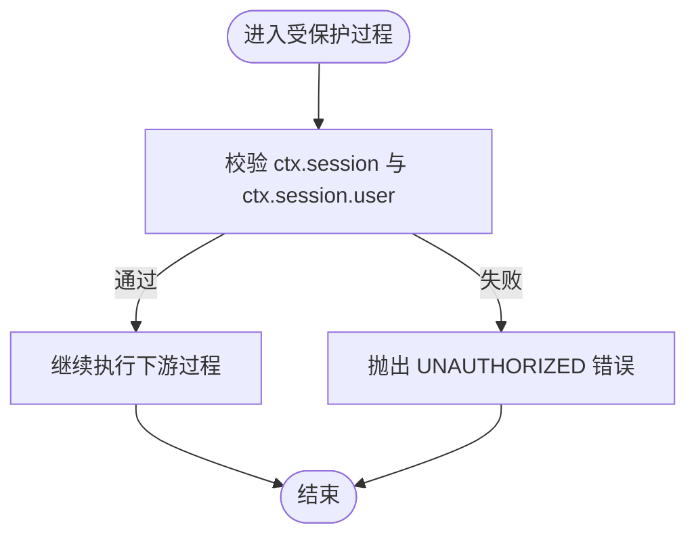
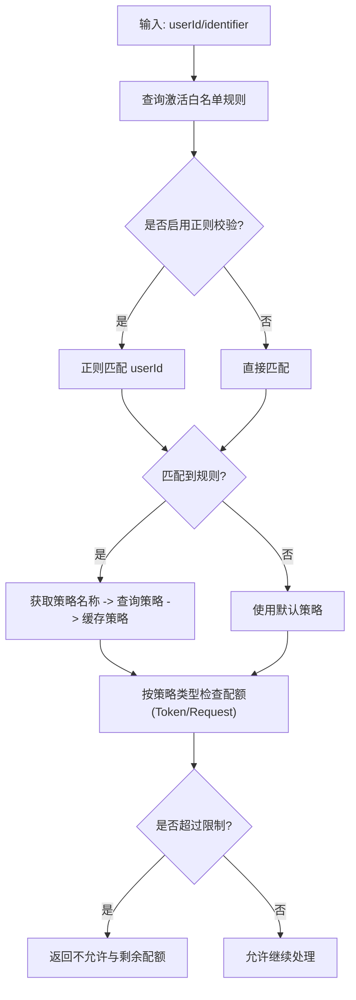
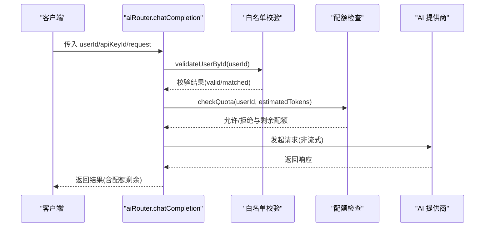
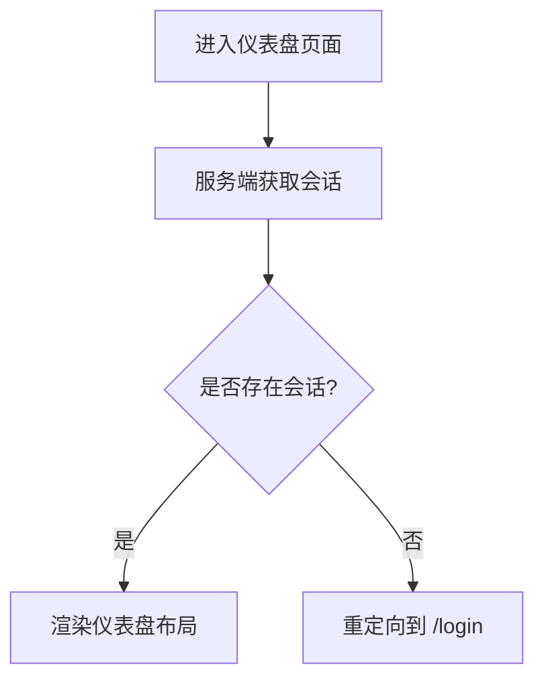
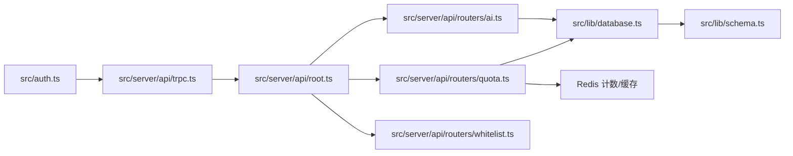

# 角色与权限管理

<cite>
**本文引用的文件**
- [src/auth.ts](file://src/auth.ts)
- [src/server/api/trpc.ts](file://src/server/api/trpc.ts)
- [src/lib/schema.ts](file://src/lib/schema.ts)
- [src/app/api/auth/register/route.ts](file://src/app/api/auth/register/route.ts)
- [src/server/api/root.ts](file://src/server/api/root.ts)
- [src/server/api/routers/ai.ts](file://src/server/api/routers/ai.ts)
- [src/server/api/routers/quota.ts](file://src/server/api/routers/quota.ts)
- [src/lib/types.ts](file://src/lib/types.ts)
- [src/lib/quota.ts](file://src/lib/quota.ts)
- [src/lib/database.ts](file://src/lib/database.ts)
- [src/app/(dashboard)/layout.tsx](file://src/app/(dashboard)/layout.tsx)
- [src/components/dashboard-layout.tsx](file://src/components/dashboard-layout.tsx)
- [src/server/api/routers/whitelist.ts](file://src/server/api/routers/whitelist.ts)
</cite>

## 目录
1. [简介](#简介)
2. [项目结构](#项目结构)
3. [核心组件](#核心组件)
4. [架构总览](#架构总览)
5. [详细组件分析](#详细组件分析)
6. [依赖关系分析](#依赖关系分析)
7. [性能考量](#性能考量)
8. [故障排查指南](#故障排查指南)
9. [结论](#结论)
10. [附录](#附录)

## 简介
本文件面向角色与权限管理，系统化梳理用户角色体系、JWT 与会话中的角色传递、tRPC 中间件的权限验证、白名单与配额策略、以及基于角色的权限控制实现。文档同时提供权限检查流程图、序列图与类图，帮助开发者快速理解并扩展权限系统。

## 项目结构
围绕权限与角色的关键目录与文件如下：
- 认证与会话：NextAuth 配置、会话回调、服务端会话获取
- tRPC 权限：上下文注入、认证中间件、公开/受保护过程
- 数据模型：角色枚举、用户表、配额策略、白名单规则
- 权限检查：白名单匹配、配额策略解析、Redis 计数与记录
- 前端布局：仪表盘布局与登录拦截

图表来源
- [src/auth.ts](file://src/auth.ts#L1-L56)
- [src/server/api/trpc.ts](file://src/server/api/trpc.ts#L1-L142)
- [src/server/api/root.ts](file://src/server/api/root.ts#L1-L23)
- [src/lib/schema.ts](file://src/lib/schema.ts#L1-L159)
- [src/lib/database.ts](file://src/lib/database.ts#L1-L200)
- [src/lib/quota.ts](file://src/lib/quota.ts#L1-L334)
- [src/app/(dashboard)/layout.tsx](file://src/app/(dashboard)/layout.tsx#L1-L20)
- [src/components/dashboard-layout.tsx](file://src/components/dashboard-layout.tsx#L1-L243)

章节来源
- [src/auth.ts](file://src/auth.ts#L1-L56)
- [src/server/api/trpc.ts](file://src/server/api/trpc.ts#L1-L142)
- [src/lib/schema.ts](file://src/lib/schema.ts#L1-L159)
- [src/lib/database.ts](file://src/lib/database.ts#L1-L200)
- [src/lib/quota.ts](file://src/lib/quota.ts#L1-L334)
- [src/app/(dashboard)/layout.tsx](file://src/app/(dashboard)/layout.tsx#L1-L20)
- [src/components/dashboard-layout.tsx](file://src/components/dashboard-layout.tsx#L1-L243)

## 核心组件
- 角色与状态枚举：在数据库层定义角色与状态枚举，确保一致性与约束
- NextAuth 会话与 JWT：在授权成功后将角色写入 token 与 session，供后续中间件与前端使用
- tRPC 中间件：受保护过程强制要求有效会话；公开过程可访问会话但不做角色校验
- 白名单与配额：通过白名单规则匹配用户到策略，结合 Redis 实现高并发配额检查与用量记录
- 注册流程：创建用户时默认赋予 USER 角色并绑定默认配额策略

章节来源
- [src/lib/schema.ts](file://src/lib/schema.ts#L12-L15)
- [src/auth.ts](file://src/auth.ts#L27-L44)
- [src/server/api/trpc.ts](file://src/server/api/trpc.ts#L117-L128)
- [src/lib/quota.ts](file://src/lib/quota.ts#L74-L190)
- [src/app/api/auth/register/route.ts](file://src/app/api/auth/register/route.ts#L30-L38)

## 架构总览
下图展示从请求进入 tRPC 到权限检查与配额控制的整体流程。

图表来源
- [src/auth.ts](file://src/auth.ts#L27-L44)
- [src/server/api/trpc.ts](file://src/server/api/trpc.ts#L55-L64)
- [src/server/api/trpc.ts](file://src/server/api/trpc.ts#L117-L128)
- [src/lib/quota.ts](file://src/lib/quota.ts#L14-L48)
- [src/lib/database.ts](file://src/lib/database.ts#L400-L489)

## 详细组件分析

### 组件一：角色与会话（JWT 与 Session）
- 角色来源：认证回调中将角色写入 token 与 session，保证前后端一致
- 会话读取：tRPC 上下文通过 NextAuth 获取会话，供中间件与过程使用
- 角色字段：在 JWT 与 session 中均携带角色字段，便于中间件与前端判断

图表来源
- [src/auth.ts](file://src/auth.ts#L4-L49)
- [src/server/api/trpc.ts](file://src/server/api/trpc.ts#L24-L64)

章节来源
- [src/auth.ts](file://src/auth.ts#L27-L44)
- [src/server/api/trpc.ts](file://src/server/api/trpc.ts#L55-L64)

### 组件二：tRPC 中间件与权限验证
- 公开过程：无需认证，但仍可读取已登录用户的会话
- 受保护过程：强制校验会话有效性，未通过则抛出未授权错误
- 扩展点：可在受保护中间件内加入角色/权限校验逻辑

图表来源
- [src/server/api/trpc.ts](file://src/server/api/trpc.ts#L117-L128)

章节来源
- [src/server/api/trpc.ts](file://src/server/api/trpc.ts#L107-L128)

### 组件三：白名单与配额策略（权限控制核心）
- 白名单规则：按优先级与启用状态匹配用户，支持正则校验
- 策略匹配：根据匹配结果选择具体配额策略，否则回退默认策略
- 配额检查：支持按 Token 或请求次数两种模式，结合 Redis 计数与过期策略
- 用量记录：记录实际用量并持久化到数据库

图表来源
- [src/lib/database.ts](file://src/lib/database.ts#L400-L489)
- [src/lib/quota.ts](file://src/lib/quota.ts#L14-L48)
- [src/lib/quota.ts](file://src/lib/quota.ts#L74-L190)

章节来源
- [src/lib/database.ts](file://src/lib/database.ts#L387-L489)
- [src/lib/quota.ts](file://src/lib/quota.ts#L14-L190)

### 组件四：API 路由与安全控制
- AI 路由：在调用大模型前进行白名单校验与配额检查，非流式请求走非流式处理
- 配额路由：提供策略 CRUD、用量查询、配额检查与重置等能力
- 白名单路由：提供规则 CRUD、状态切换与统计

图表来源
- [src/server/api/routers/ai.ts](file://src/server/api/routers/ai.ts#L95-L193)
- [src/lib/database.ts](file://src/lib/database.ts#L434-L489)
- [src/lib/quota.ts](file://src/lib/quota.ts#L74-L190)

章节来源
- [src/server/api/routers/ai.ts](file://src/server/api/routers/ai.ts#L85-L193)
- [src/server/api/routers/quota.ts](file://src/server/api/routers/quota.ts#L32-L153)
- [src/server/api/routers/whitelist.ts](file://src/server/api/routers/whitelist.ts#L63-L188)

### 组件五：前端布局与登录拦截
- 仪表盘布局：在服务端获取会话，若无会话则重定向至登录页
- 导航与主题：提供统一导航与主题切换

图表来源
- [src/app/(dashboard)/layout.tsx](file://src/app/(dashboard)/layout.tsx#L10-L19)

章节来源
- [src/app/(dashboard)/layout.tsx](file://src/app/(dashboard)/layout.tsx#L1-L20)
- [src/components/dashboard-layout.tsx](file://src/components/dashboard-layout.tsx#L1-L243)

## 依赖关系分析
- 认证依赖：NextAuth 提供会话与 JWT；tRPC 依赖 NextAuth 的会话上下文
- 数据模型：角色/状态枚举在数据库层统一约束；用户表关联配额策略
- 权限检查：白名单规则与配额策略共同决定访问与限额；Redis 提供高性能计数
- 路由聚合：根路由聚合各业务路由，形成统一入口

图表来源
- [src/auth.ts](file://src/auth.ts#L1-L56)
- [src/server/api/trpc.ts](file://src/server/api/trpc.ts#L1-L142)
- [src/server/api/root.ts](file://src/server/api/root.ts#L1-L23)
- [src/server/api/routers/ai.ts](file://src/server/api/routers/ai.ts#L1-L223)
- [src/server/api/routers/quota.ts](file://src/server/api/routers/quota.ts#L1-L301)
- [src/server/api/routers/whitelist.ts](file://src/server/api/routers/whitelist.ts#L1-L188)
- [src/lib/database.ts](file://src/lib/database.ts#L1-L200)
- [src/lib/schema.ts](file://src/lib/schema.ts#L1-L159)

章节来源
- [src/server/api/root.ts](file://src/server/api/root.ts#L1-L23)
- [src/lib/schema.ts](file://src/lib/schema.ts#L12-L15)

## 性能考量
- Redis 计数：每日 Token/请求计数与 RPM 使用独立键空间，设置合理过期时间，避免内存膨胀
- 缓存策略：策略与用户策略缓存减少数据库压力；变更策略时清理相关缓存键
- 异步记录：用量记录异步处理，不影响主链路响应时间

章节来源
- [src/lib/quota.ts](file://src/lib/quota.ts#L103-L157)
- [src/lib/quota.ts](file://src/lib/quota.ts#L192-L255)
- [src/server/api/routers/ai.ts](file://src/server/api/routers/ai.ts#L67-L69)

## 故障排查指南
- 未授权错误：确认客户端持有有效会话；检查受保护过程的会话校验逻辑
- 配额不足：检查 Redis 中对应键值与过期时间；核对策略类型与限额配置
- 白名单不生效：检查规则启用状态、优先级与正则表达式是否正确
- 注册失败：确认默认配额策略存在；检查密码加密与唯一性约束

章节来源
- [src/server/api/trpc.ts](file://src/server/api/trpc.ts#L117-L128)
- [src/lib/quota.ts](file://src/lib/quota.ts#L114-L157)
- [src/lib/database.ts](file://src/lib/database.ts#L434-L489)
- [src/app/api/auth/register/route.ts](file://src/app/api/auth/register/route.ts#L24-L28)

## 结论
本系统采用“白名单+配额策略”的组合控制模型，结合 NextAuth 的会话与 tRPC 的中间件，实现了从入口到业务过程的多层安全控制。通过 Redis 的高并发计数与缓存，兼顾了性能与灵活性。建议在现有基础上进一步扩展角色细粒度权限与动态权限管理，以满足更复杂的业务场景。

## 附录

### 角色与状态枚举定义
- 角色枚举：USER、ADMIN
- 状态枚举：ACTIVE、INACTIVE、SUSPENDED
- 限制类型：token、request

章节来源
- [src/lib/schema.ts](file://src/lib/schema.ts#L12-L27)

### 用户注册流程（角色与默认策略）
- 注册时默认赋予 USER 角色
- 自动绑定默认配额策略

章节来源
- [src/app/api/auth/register/route.ts](file://src/app/api/auth/register/route.ts#L30-L38)

### 权限检查函数清单
- 白名单匹配：matchUserPolicy、validateUserById
- 配额检查：checkQuota、getDailyUsage、recordUsage
- 策略管理：getAll、create、update、delete

章节来源
- [src/lib/database.ts](file://src/lib/database.ts#L400-L489)
- [src/lib/quota.ts](file://src/lib/quota.ts#L74-L292)
- [src/server/api/routers/quota.ts](file://src/server/api/routers/quota.ts#L172-L300)

### 路由保护与 API 安全控制
- 受保护过程：protectedProcedure
- 公开过程：publicProcedure
- 速率限制占位：rateLimitedProcedure

章节来源
- [src/server/api/trpc.ts](file://src/server/api/trpc.ts#L107-L141)

### 前端仪表盘与登录拦截
- 服务端会话校验与重定向
- 导航与主题切换

章节来源
- [src/app/(dashboard)/layout.tsx](file://src/app/(dashboard)/layout.tsx#L10-L19)
- [src/components/dashboard-layout.tsx](file://src/components/dashboard-layout.tsx#L158-L174)