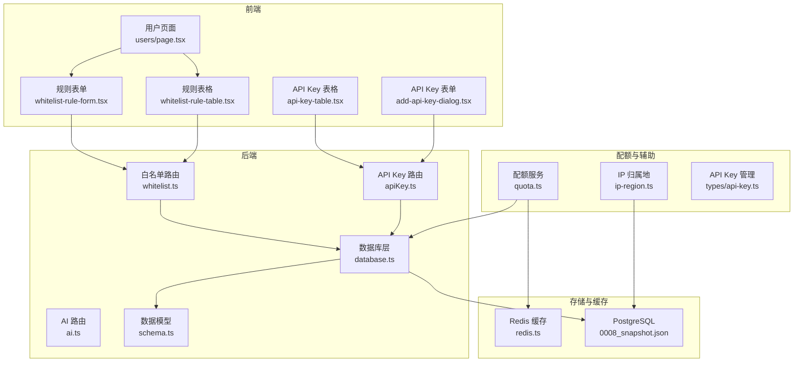
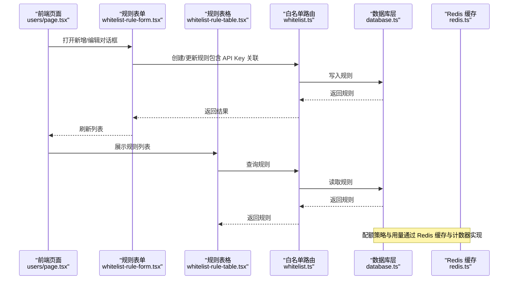
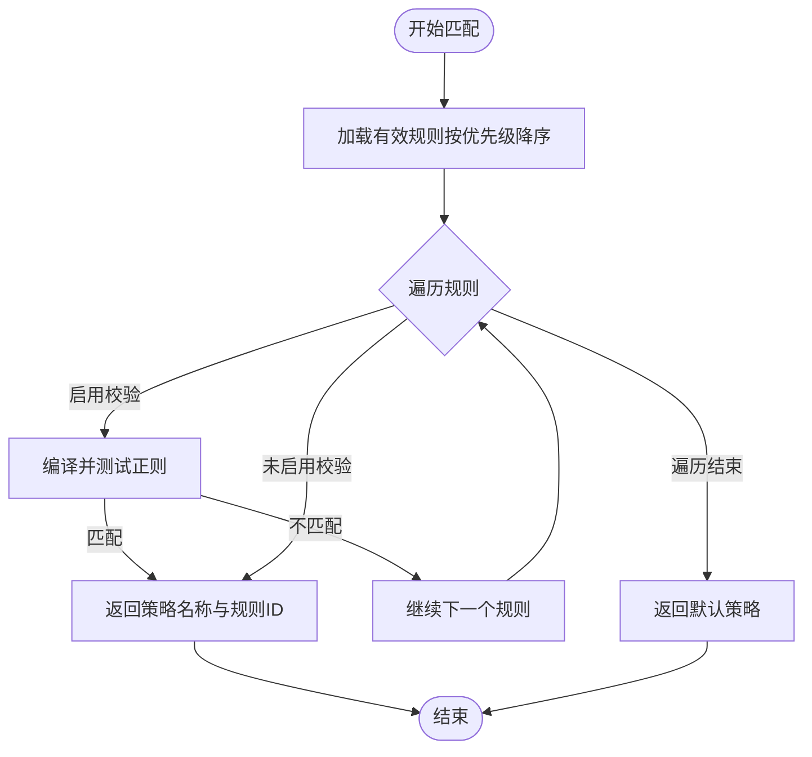
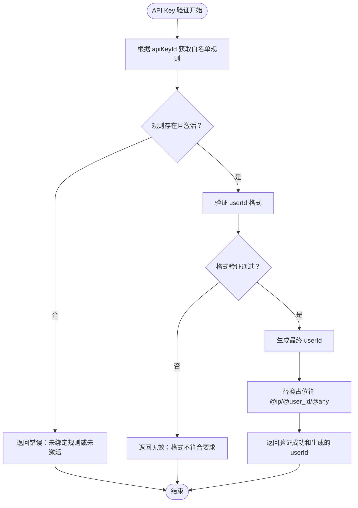
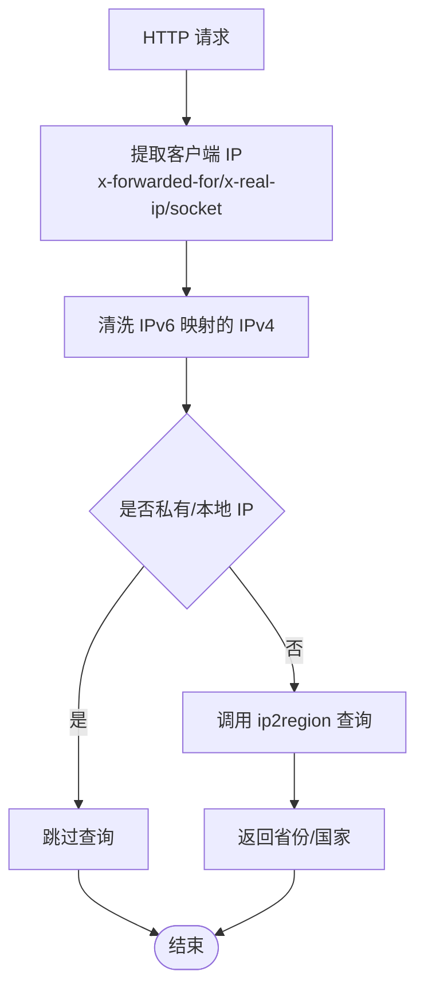
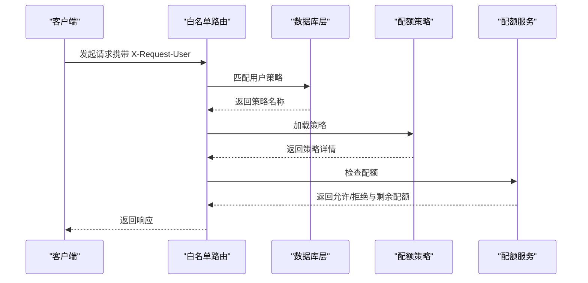
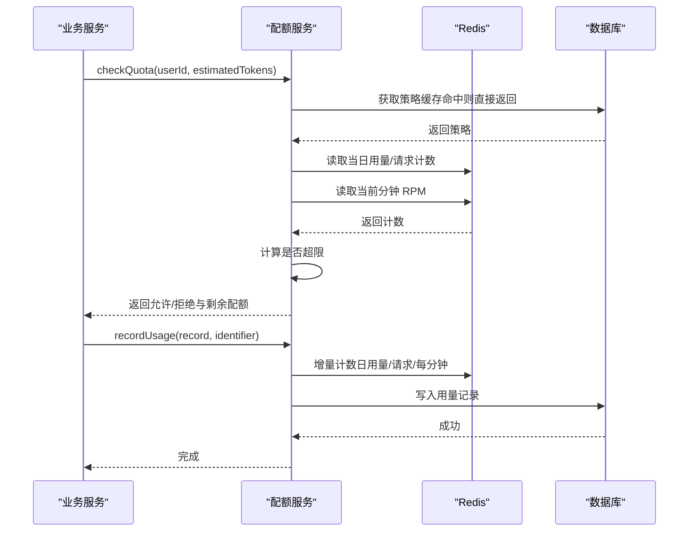
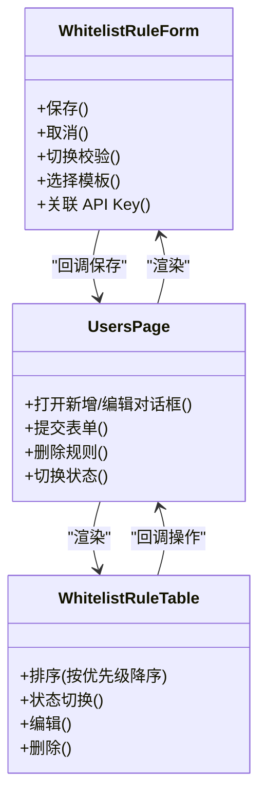
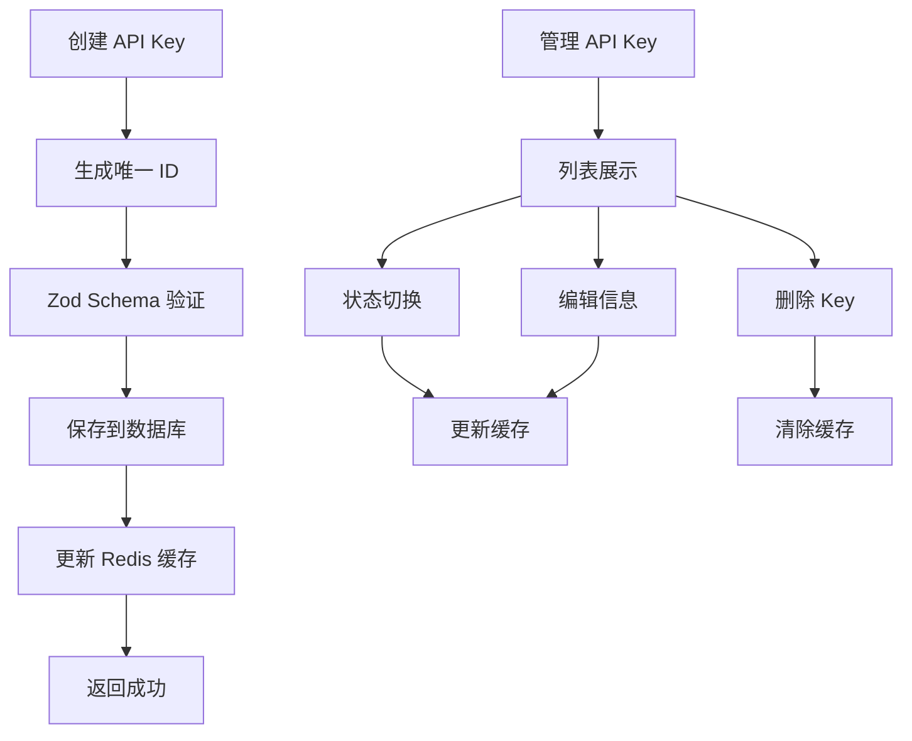
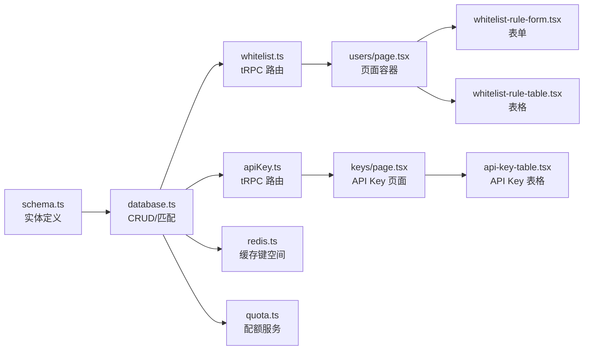

# 白名单管理系统

<cite>
**本文档引用的文件**
- [src/lib/database.ts](file://src/lib/database.ts)
- [src/server/api/routers/whitelist.ts](file://src/server/api/routers/whitelist.ts)
- [src/server/api/routers/ai.ts](file://src/server/api/routers/ai.ts)
- [src/pages/api/ai/chat/stream.ts](file://src/pages/api/ai/chat/stream.ts)
- [src/app/(dashboard)/users/components/whitelist-rule-form.tsx](file://src/app/(dashboard)/users/components/whitelist-rule-form.tsx)
- [src/app/(dashboard)/users/components/whitelist-rule-table.tsx](file://src/app/(dashboard)/users/components/whitelist-rule-table.tsx)
- [src/app/(dashboard)/users/page.tsx](file://src/app/(dashboard)/users/page.tsx)
- [src/app/(dashboard)/keys/components/api-key-table.tsx](file://src/app/(dashboard)/keys/components/api-key-table.tsx)
- [src/server/api/routers/apiKey.ts](file://src/server/api/routers/apiKey.ts)
- [src/lib/quota.ts](file://src/lib/quota.ts)
- [src/lib/redis.ts](file://src/lib/redis.ts)
- [src/lib/ip-region.ts](file://src/lib/ip-region.ts)
- [src/lib/types.ts](file://src/lib/types.ts)
- [src/lib/schema.ts](file://src/lib/schema.ts)
- [src/types/api-key.ts](file://src/types/api-key.ts)
- [drizzle/meta/0008_snapshot.json](file://drizzle/meta/0008_snapshot.json)
</cite>

## 更新摘要
**变更内容**
- 新增 API Key 基础白名单验证系统
- validateUserByApiKey 方法重构以支持 API Key 验证
- API Key 与白名单规则关联功能
- userId 格式生成规则和智能占位符预设
- 前端 API Key 管理界面集成
- 配额系统与 API Key 的集成

## 目录
1. [简介](#简介)
2. [项目结构](#项目结构)
3. [核心组件](#核心组件)
4. [架构总览](#架构总览)
5. [详细组件分析](#详细组件分析)
6. [依赖关系分析](#依赖关系分析)
7. [性能考虑](#性能考虑)
8. [故障排除指南](#故障排除指南)
9. [结论](#结论)
10. [附录](#附录)

## 简介
本文件为 AIGate 白名单管理系统的深度技术文档，围绕白名单规则设计、IP 验证机制、权限控制、与配额系统的集成、API Key 基础验证、配置指南、批量导入导出与模板、自动化脚本以及性能优化策略进行系统化阐述。文档旨在帮助开发者与运维人员快速理解并高效维护该系统。

## 项目结构
白名单系统由前端界面、后端接口、数据库与缓存层协同组成，核心模块包括：
- 规则管理前端：规则表单与表格组件，支持优先级排序、状态切换与校验规则配置
- 白名单路由：提供规则的增删改查、状态切换与策略匹配查询
- API Key 管理：API Key 的创建、更新、删除与状态管理
- 数据库层：基于 Drizzle ORM 的实体模型与 CRUD 操作，含规则匹配与统计
- 缓存层：Redis 实现配额与策略缓存、用量统计与速率限制
- 配额服务：按用户匹配策略并执行多维度配额检查
- IP 归属地解析：提取客户端 IP 并查询归属地

**图表来源**
- [src/app/(dashboard)/users/components/whitelist-rule-form.tsx](file://src/app/(dashboard)/users/components/whitelist-rule-form.tsx#L1-L358)
- [src/app/(dashboard)/users/components/whitelist-rule-table.tsx](file://src/app/(dashboard)/users/components/whitelist-rule-table.tsx#L1-L178)
- [src/app/(dashboard)/users/page.tsx](file://src/app/(dashboard)/users/page.tsx#L1-L146)
- [src/app/(dashboard)/keys/components/api-key-table.tsx](file://src/app/(dashboard)/keys/components/api-key-table.tsx#L1-L179)
- [src/server/api/routers/whitelist.ts](file://src/server/api/routers/whitelist.ts#L1-L221)
- [src/server/api/routers/apiKey.ts](file://src/server/api/routers/apiKey.ts#L1-L393)
- [src/server/api/routers/ai.ts](file://src/server/api/routers/ai.ts#L100-L166)
- [src/lib/database.ts](file://src/lib/database.ts#L308-L582)
- [src/lib/schema.ts](file://src/lib/schema.ts#L28-L161)
- [drizzle/meta/0008_snapshot.json](file://drizzle/meta/0008_snapshot.json#L217-L289)
- [src/lib/redis.ts](file://src/lib/redis.ts#L1-L49)
- [src/lib/quota.ts](file://src/lib/quota.ts#L1-L334)
- [src/lib/ip-region.ts](file://src/lib/ip-region.ts#L1-L101)
- [src/types/api-key.ts](file://src/types/api-key.ts#L1-L19)

**章节来源**
- [src/app/(dashboard)/users/components/whitelist-rule-form.tsx](file://src/app/(dashboard)/users/components/whitelist-rule-form.tsx#L1-L358)
- [src/app/(dashboard)/users/components/whitelist-rule-table.tsx](file://src/app/(dashboard)/users/components/whitelist-rule-table.tsx#L1-L178)
- [src/app/(dashboard)/users/page.tsx](file://src/app/(dashboard)/users/page.tsx#L1-L146)
- [src/app/(dashboard)/keys/components/api-key-table.tsx](file://src/app/(dashboard)/keys/components/api-key-table.tsx#L1-L179)
- [src/server/api/routers/whitelist.ts](file://src/server/api/routers/whitelist.ts#L1-L221)
- [src/server/api/routers/apiKey.ts](file://src/server/api/routers/apiKey.ts#L1-L393)
- [src/server/api/routers/ai.ts](file://src/server/api/routers/ai.ts#L100-L166)
- [src/lib/database.ts](file://src/lib/database.ts#L308-L582)
- [src/lib/schema.ts](file://src/lib/schema.ts#L28-L161)
- [drizzle/meta/0008_snapshot.json](file://drizzle/meta/0008_snapshot.json#L217-L289)
- [src/lib/redis.ts](file://src/lib/redis.ts#L1-L49)
- [src/lib/quota.ts](file://src/lib/quota.ts#L1-L334)
- [src/lib/ip-region.ts](file://src/lib/ip-region.ts#L1-L101)
- [src/types/api-key.ts](file://src/types/api-key.ts#L1-L19)

## 核心组件
- 白名单规则实体与匹配：规则包含优先级、状态、策略名称与可选的校验规则；匹配时按优先级降序遍历，启用校验规则时使用正则匹配用户标识，未启用则视为全匹配；默认策略兜底
- API Key 基础验证：通过 API Key ID 关联白名单规则，支持 userId 格式校验和智能占位符生成
- 配额策略与检查：按用户匹配策略后，执行令牌/请求次数双维度日限额与 RPM 限制检查，支持缓存与 Redis 计数器
- 前端规则管理：提供规则表单与表格，支持优先级排序、状态切换、校验规则模板与快捷输入
- API Key 管理：提供 API Key 的创建、编辑、删除与状态切换功能
- 数据模型与迁移：白名单规则表含策略名、描述、优先级、状态、校验模式、userIdPattern 与 apiKeyId；迁移历史显示字段演进

**章节来源**
- [src/lib/database.ts](file://src/lib/database.ts#L400-L428)
- [src/lib/database.ts](file://src/lib/database.ts#L445-L547)
- [src/lib/quota.ts](file://src/lib/quota.ts#L14-L71)
- [src/app/(dashboard)/users/components/whitelist-rule-form.tsx](file://src/app/(dashboard)/users/components/whitelist-rule-form.tsx#L31-L86)
- [src/app/(dashboard)/users/components/whitelist-rule-table.tsx](file://src/app/(dashboard)/users/components/whitelist-rule-table.tsx#L30-L33)
- [src/lib/schema.ts](file://src/lib/schema.ts#L84-L97)
- [drizzle/meta/0008_snapshot.json](file://drizzle/meta/0008_snapshot.json#L217-L289)

## 架构总览
白名单系统遵循"前端表单/表格 -> tRPC 路由 -> 数据库层 -> 缓存/存储"的分层架构。规则匹配与配额检查在服务端完成，前端仅负责展示与交互。新增的 API Key 基础验证通过 validateUserByApiKey 方法实现。

**图表来源**
- [src/app/(dashboard)/users/page.tsx](file://src/app/(dashboard)/users/page.tsx#L22-L95)
- [src/app/(dashboard)/users/components/whitelist-rule-form.tsx](file://src/app/(dashboard)/users/components/whitelist-rule-form.tsx#L181-L184)
- [src/app/(dashboard)/users/components/whitelist-rule-table.tsx](file://src/app/(dashboard)/users/components/whitelist-rule-table.tsx#L120-L147)
- [src/server/api/routers/whitelist.ts](file://src/server/api/routers/whitelist.ts#L63-L117)
- [src/lib/database.ts](file://src/lib/database.ts#L308-L372)
- [src/lib/redis.ts](file://src/lib/redis.ts#L19-L37)

## 详细组件分析

### 组件一：白名单规则匹配与优先级排序
- 匹配算法：按优先级降序遍历有效规则，若规则启用校验且正则匹配成功则命中；否则视为全匹配；若无规则匹配则返回默认策略
- 冲突解决：高优先级规则优先，同一优先级下按顺序遍历，先命中的即生效
- 动态更新：规则状态切换与更新会立即影响后续匹配

**图表来源**
- [src/lib/database.ts](file://src/lib/database.ts#L400-L428)

**章节来源**
- [src/lib/database.ts](file://src/lib/database.ts#L387-L428)

### 组件二：API Key 基础白名单验证系统
- API Key 关联：每个 API Key 只能绑定一个白名单规则，防止冲突
- validateUserByApiKey 方法：根据 apiKeyId 获取规则，验证 userId 格式，生成最终 userId
- 智能占位符：支持 @ip、@user_id、@any 等占位符替换
- userId 格式生成：根据 userIdPattern 生成最终的 userId，支持 IP 地址和用户标识替换

**图表来源**
- [src/lib/database.ts](file://src/lib/database.ts#L445-L547)

**章节来源**
- [src/lib/database.ts](file://src/lib/database.ts#L445-L547)
- [src/server/api/routers/whitelist.ts](file://src/server/api/routers/whitelist.ts#L72-L81)

### 组件三：IP 验证与归属地查询
- 客户端 IP 提取：优先从代理头获取，回退到 socket 远端地址；对 IPv6 映射的 IPv4 做清洗
- 归属地查询：跳过私有/本地 IP，调用 ip2region 查询省份或国家
- 归属地提取：从请求中自动获取 IP 并查询

**图表来源**
- [src/lib/ip-region.ts](file://src/lib/ip-region.ts#L24-L78)

**章节来源**
- [src/lib/ip-region.ts](file://src/lib/ip-region.ts#L20-L101)

### 组件四：权限控制与访问控制列表管理
- 权限入口：通过 X-Request-User 传递用户标识，结合白名单规则校验
- 规则继承：规则与策略名称关联，策略决定配额限制类型与限额
- 例外处理：未匹配到规则时采用默认策略，避免误拦截
- ACL 管理：前端提供状态切换、优先级排序与校验规则模板，便于精细化控制

**图表来源**
- [src/server/api/routers/whitelist.ts](file://src/server/api/routers/whitelist.ts#L174-L187)
- [src/lib/database.ts](file://src/lib/database.ts#L400-L428)
- [src/lib/quota.ts](file://src/lib/quota.ts#L14-L71)

**章节来源**
- [src/server/api/routers/whitelist.ts](file://src/server/api/routers/whitelist.ts#L174-L187)
- [src/lib/database.ts](file://src/lib/database.ts#L400-L428)
- [src/lib/quota.ts](file://src/lib/quota.ts#L14-L71)

### 组件五：与配额系统的集成
- 策略匹配：按用户邮箱匹配白名单规则，获取策略名称，再从策略集合中定位具体策略
- 多重验证：支持令牌维度日限额与请求次数维度日限额，同时检查 RPM 限制
- 缓存与计数：策略缓存于 Redis，用量与 RPM 计数分别维护键空间，过期策略保证时效性
- 记录与统计：用量记录写入数据库并保留请求日志，支持统计查询

**图表来源**
- [src/lib/quota.ts](file://src/lib/quota.ts#L74-L190)
- [src/lib/redis.ts](file://src/lib/redis.ts#L19-L37)
- [src/lib/database.ts](file://src/lib/database.ts#L217-L220)

**章节来源**
- [src/lib/quota.ts](file://src/lib/quota.ts#L14-L71)
- [src/lib/quota.ts](file://src/lib/quota.ts#L74-L190)
- [src/lib/quota.ts](file://src/lib/quota.ts#L192-L255)
- [src/lib/redis.ts](file://src/lib/redis.ts#L19-L48)
- [src/lib/database.ts](file://src/lib/database.ts#L217-L220)

### 组件六：前端规则配置与模板
- 表单组件：支持策略名称选择、描述、优先级、状态开关与校验规则开关
- 校验规则模板：内置 @ip、@email、@origin 等模板，支持快捷插入与键盘导航
- 表格组件：按优先级降序展示，支持状态切换、编辑与删除
- 页面容器：统一管理对话框、加载状态与 mutations

**图表来源**
- [src/app/(dashboard)/users/components/whitelist-rule-form.tsx](file://src/app/(dashboard)/users/components/whitelist-rule-form.tsx#L91-L184)
- [src/app/(dashboard)/users/components/whitelist-rule-table.tsx](file://src/app/(dashboard)/users/components/whitelist-rule-table.tsx#L27-L147)
- [src/app/(dashboard)/users/page.tsx](file://src/app/(dashboard)/users/page.tsx#L62-L95)

**章节来源**
- [src/app/(dashboard)/users/components/whitelist-rule-form.tsx](file://src/app/(dashboard)/users/components/whitelist-rule-form.tsx#L31-L86)
- [src/app/(dashboard)/users/components/whitelist-rule-table.tsx](file://src/app/(dashboard)/users/components/whitelist-rule-table.tsx#L30-L33)
- [src/app/(dashboard)/users/page.tsx](file://src/app/(dashboard)/users/page.tsx#L62-L95)

### 组件七：API Key 管理系统
- API Key 创建：生成唯一 ID，支持提供商选择、密钥输入和状态管理
- API Key 管理：提供表格展示、状态切换、编辑和删除功能
- 缓存集成：API Key 状态变化时更新 Redis 缓存
- 类型安全：完整的 Zod Schema 验证和 TypeScript 类型定义

**图表来源**
- [src/server/api/routers/apiKey.ts](file://src/server/api/routers/apiKey.ts#L148-L191)
- [src/app/(dashboard)/keys/components/api-key-table.tsx](file://src/app/(dashboard)/keys/components/api-key-table.tsx#L29-L163)

**章节来源**
- [src/server/api/routers/apiKey.ts](file://src/server/api/routers/apiKey.ts#L148-L191)
- [src/app/(dashboard)/keys/components/api-key-table.tsx](file://src/app/(dashboard)/keys/components/api-key-table.tsx#L29-L163)
- [src/types/api-key.ts](file://src/types/api-key.ts#L1-L19)

## 依赖关系分析
- 数据模型：白名单规则表包含策略名、描述、优先级、状态、校验模式、userIdPattern 与 apiKeyId；策略与规则通过名称关联
- 路由依赖：白名单路由依赖数据库层提供的规则 CRUD 与匹配能力，API Key 路由提供完整的密钥管理
- 缓存依赖：配额服务依赖 Redis 键空间与过期策略
- 前端依赖：页面依赖表单与表格组件，组件间通过回调通信

**图表来源**
- [src/lib/schema.ts](file://src/lib/schema.ts#L84-L97)
- [src/lib/database.ts](file://src/lib/database.ts#L308-L372)
- [src/server/api/routers/whitelist.ts](file://src/server/api/routers/whitelist.ts#L1-L221)
- [src/server/api/routers/apiKey.ts](file://src/server/api/routers/apiKey.ts#L1-L393)
- [src/app/(dashboard)/users/page.tsx](file://src/app/(dashboard)/users/page.tsx#L22-L95)
- [src/app/(dashboard)/keys/components/api-key-table.tsx](file://src/app/(dashboard)/keys/components/api-key-table.tsx#L29-L163)
- [src/lib/redis.ts](file://src/lib/redis.ts#L19-L37)
- [src/lib/quota.ts](file://src/lib/quota.ts#L14-L71)

**章节来源**
- [src/lib/schema.ts](file://src/lib/schema.ts#L84-L97)
- [src/lib/database.ts](file://src/lib/database.ts#L308-L372)
- [src/server/api/routers/whitelist.ts](file://src/server/api/routers/whitelist.ts#L1-L221)
- [src/server/api/routers/apiKey.ts](file://src/server/api/routers/apiKey.ts#L1-L393)
- [src/app/(dashboard)/users/page.tsx](file://src/app/(dashboard)/users/page.tsx#L22-L95)
- [src/app/(dashboard)/keys/components/api-key-table.tsx](file://src/app/(dashboard)/keys/components/api-key-table.tsx#L29-L163)
- [src/lib/redis.ts](file://src/lib/redis.ts#L19-L37)
- [src/lib/quota.ts](file://src/lib/quota.ts#L14-L71)

## 性能考虑
- 规则匹配复杂度：线性扫描有效规则，时间复杂度 O(N)，N 为有效规则数量；建议控制规则规模并合理设置优先级
- API Key 验证优化：validateUserByApiKey 方法直接通过 apiKeyId 查询规则，避免全表扫描
- 缓存策略：配额策略与常用数据缓存于 Redis，减少数据库压力；用量与 RPM 计数采用短 TTL，确保实时性
- 并发与锁：Redis 原子计数操作保障并发安全；建议在高并发场景下增加连接池与合理的超时配置
- 数据库索引：规则按优先级与状态查询，建议在相关列建立索引以提升匹配效率
- 前端渲染：表格按优先级降序渲染，避免重复计算；模板选择使用虚拟滚动与防抖优化

## 故障排除指南
- 规则未生效
  - 检查规则状态是否为启用，优先级是否足够高
  - 若启用校验规则，请确认正则表达式正确且能匹配目标用户标识
- API Key 验证失败
  - 确认 API Key 是否已绑定有效的白名单规则
  - 检查 userId 格式是否符合规则中的正则表达式
  - 验证占位符替换是否正确（@ip、@user_id、@any）
- 策略未按预期应用
  - 确认策略名称与规则绑定一致，数据库中存在对应策略
  - 查看策略缓存是否过期，必要时刷新缓存
- 配额检查异常
  - 检查 Redis 连接与键空间命名是否正确
  - 确认用量计数与 RPM 计数键是否存在，TTL 是否过期
- 前端表单问题
  - 校验规则模板无法弹出：检查输入焦点与键盘事件处理
  - 表格状态切换无效：确认 mutations 成功回调与 refetch 调用

**章节来源**
- [src/lib/database.ts](file://src/lib/database.ts#L400-L428)
- [src/lib/database.ts](file://src/lib/database.ts#L445-L547)
- [src/lib/quota.ts](file://src/lib/quota.ts#L74-L190)
- [src/lib/redis.ts](file://src/lib/redis.ts#L19-L37)
- [src/app/(dashboard)/users/components/whitelist-rule-form.tsx](file://src/app/(dashboard)/users/components/whitelist-rule-form.tsx#L160-L175)
- [src/app/(dashboard)/users/components/whitelist-rule-table.tsx](file://src/app/(dashboard)/users/components/whitelist-rule-table.tsx#L93-L106)

## 结论
AIGate 白名单管理系统通过清晰的规则优先级与灵活的校验机制，结合 Redis 缓存与数据库模型，实现了高效的权限控制与配额管理。新增的 API Key 基础验证系统进一步增强了系统的灵活性和安全性，支持按 API Key 维度的精细化控制。前端提供直观的配置界面与模板，便于快速构建与维护策略。建议在生产环境中持续监控规则数量、缓存命中率与 Redis 性能，并定期评估规则有效性以维持系统稳定与高性能。

## 附录

### 白名单规则配置指南
- 规则字段
  - 策略名称：与配额策略名称关联
  - 描述：规则说明
  - 优先级：数值越大优先级越高
  - 状态：启用/禁用
  - 校验规则：启用后需满足正则表达式
  - userIdPattern：用户ID格式模板，支持占位符
  - apiKeyId：关联的 API Key ID
  - 校验规则开关：开启后强制校验
- 配置步骤
  - 在前端页面添加规则，选择策略名称与优先级
  - 如需限制用户范围，启用校验规则并填写正则表达式
  - 关联 API Key 后，系统将通过 validateUserByApiKey 进行验证
  - 保存后规则立即生效，高优先级规则优先匹配
- 验证方法
  - 使用路由提供的策略匹配接口验证用户标识是否命中
  - 检查 Redis 中策略缓存与用量计数键是否存在

**章节来源**
- [src/server/api/routers/whitelist.ts](file://src/server/api/routers/whitelist.ts#L6-L19)
- [src/app/(dashboard)/users/components/whitelist-rule-form.tsx](file://src/app/(dashboard)/users/components/whitelist-rule-form.tsx#L96-L103)
- [src/lib/database.ts](file://src/lib/database.ts#L400-L428)
- [src/lib/redis.ts](file://src/lib/redis.ts#L19-L37)

### API Key 基础验证配置
- API Key 关联规则
  - 每个 API Key 只能绑定一个白名单规则
  - 创建或更新规则时会验证 API Key 的唯一性约束
  - 支持通过 API Key ID 直接获取关联的白名单规则
- userId 格式生成
  - 支持 @ip、@user_id、@any 占位符
  - @ip：替换为客户端 IP 地址
  - @user_id：替换为传入的用户标识
  - @any：替换为传入的用户标识
- 验证流程
  - 首先检查 API Key 是否绑定有效规则
  - 验证 userId 格式是否符合正则表达式
  - 生成最终的 userId 供后续配额检查使用

**章节来源**
- [src/lib/database.ts](file://src/lib/database.ts#L445-L547)
- [src/server/api/routers/whitelist.ts](file://src/server/api/routers/whitelist.ts#L72-L81)
- [src/app/(dashboard)/users/components/whitelist-rule-form.tsx](file://src/app/(dashboard)/users/components/whitelist-rule-form.tsx#L54-L109)

### 规则模板与自动化脚本
- 规则模板
  - @ip：匹配 IPv4 地址
  - @email：匹配邮箱格式
  - @origin：匹配 HTTP Origin
  - @any：匹配任意非空字符串
  - @ip_range：匹配 IP 段格式
  - @email_domain：匹配指定域名邮箱
  - @numeric：匹配纯数字 ID
  - @uuid：匹配 UUID 格式
  - @prefix：匹配带前缀的 ID
  - 更多模板可在表单中通过快捷输入选择
- 自动化脚本
  - 建议编写规则导入/导出脚本，支持 CSV/JSON 格式
  - 导入流程：解析文件 -> 校验字段 -> 调用 tRPC 接口批量创建
  - 导出流程：调用查询接口 -> 过滤状态 -> 序列化输出
  - 注意：导入前备份数据库与 Redis，导入后验证关键规则的优先级与正则

**章节来源**
- [src/app/(dashboard)/users/components/whitelist-rule-form.tsx](file://src/app/(dashboard)/users/components/whitelist-rule-form.tsx#L31-L86)

### 数据模型与迁移
- 白名单规则表结构
  - 字段：id、policy_name、description、priority、status、validation_pattern、userIdPattern、validation_enabled、api_key_id、created_at、updated_at
  - 约束：主键、默认值、枚举类型
- API Key 表结构
  - 字段：id、name、provider、key、base_url、status、created_at、updated_at
  - 约束：主键、默认值、枚举类型
- 迁移历史
  - 初始版本包含 pattern 字段，后续版本演进为 validation_pattern 与 validation_enabled
  - 新增 userIdPattern 字段支持用户ID格式生成
  - 新增 api_key_id 字段支持 API Key 关联
  - 建议在生产环境执行迁移前做好备份与灰度验证

**章节来源**
- [src/lib/schema.ts](file://src/lib/schema.ts#L84-L97)
- [src/lib/schema.ts](file://src/lib/schema.ts#L42-L52)
- [drizzle/meta/0008_snapshot.json](file://drizzle/meta/0008_snapshot.json#L217-L289)