# 仪表板组件

<cite>
**本文引用的文件**
- [src/app/(dashboard)/components/activity-item.tsx](file://src/app/(dashboard)/components/activity-item.tsx)
- [src/app/(dashboard)/components/combined-trend-chart.tsx](file://src/app/(dashboard)/components/combined-trend-chart.tsx)
- [src/app/(dashboard)/components/model-distribution-chart.tsx](file://src/app/(dashboard)/components/model-distribution-chart.tsx)
- [src/app/(dashboard)/components/recent-activity.tsx](file://src/app/(dashboard)/components/recent-activity.tsx)
- [src/app/(dashboard)/components/recent-ip-requests.tsx](file://src/app/(dashboard)/components/recent-ip-requests.tsx)
- [src/app/(dashboard)/components/region-headmap-chart/index.tsx](file://src/app/(dashboard)/components/region-headmap-chart/index.tsx)
- [src/app/(dashboard)/components/region-headmap-chart/utils.ts](file://src/app/(dashboard)/components/region-headmap-chart/utils.ts)
- [src/app/(dashboard)/components/stat-card.tsx](file://src/app/(dashboard)/components/stat-card.tsx)
- [src/app/(dashboard)/page.tsx](file://src/app/(dashboard)/page.tsx)
- [src/app/(dashboard)/reports/page.tsx](file://src/app/(dashboard)/reports/page.tsx)
- [src/components/stat-summary-card.tsx](file://src/components/stat-summary-card.tsx)
- [src/components/dashboard-layout/index.tsx](file://src/components/dashboard-layout/index.tsx)
- [src/components/dashboard-layout/sidebar-nav.tsx](file://src/components/dashboard-layout/sidebar-nav.tsx)
- [src/server/api/routers/dashboard.ts](file://src/server/api/routers/dashboard.ts)
- [src/types/dashboard.ts](file://src/types/dashboard.ts)
- [src/lib/provider-utils.ts](file://src/lib/provider-utils.ts)
- [src/lib/ip-region.ts](file://src/lib/ip-region.ts)
- [src/lib/date.ts](file://src/lib/date.ts)
- [src/lib/utils.ts](file://src/lib/utils.ts)
- [src/components/ui/tabs.tsx](file://src/components/ui/tabs.tsx)
- [src/components/ui/pagination.tsx](file://src/components/ui/pagination.tsx)
- [src/components/date-picker-with-range.tsx](file://src/components/date-picker-with-range.tsx)
- [src/app/globals.css](file://src/app/globals.css)
- [src/messages/en.json](file://src/messages/en.json)
- [src/messages/zh.json](file://src/messages/zh.json)
</cite>

## 更新摘要
**变更内容**
- 新增完整的数据报告中心：包括报表页面、统计汇总卡片组件和区域热力图图表优化
- 新增 StatSummaryCard 统计汇总卡片组件，提供更丰富的数据概览
- 新增 Reports 报表页面，支持详细的使用记录查询、筛选和导出功能
- 新增仪表板布局导航，包含报表页面的导航链接
- **新增**：完整的分页功能实现，包括省略号逻辑、页面导航控制、响应式设计优化
- **新增**：完整的国际化支持，涵盖报表页面、分页组件和导航菜单
- 增强区域热力图的交互性和数据展示能力
- 优化日期范围过滤功能，支持更灵活的时间维度分析
- **更新**：区域热力图组件内部重构，工具函数已移动到独立的utils.ts文件，但组件功能保持不变

## 目录
1. [简介](#简介)
2. [项目结构](#项目结构)
3. [核心组件](#核心组件)
4. [架构总览](#架构总览)
5. [组件详细分析](#组件详细分析)
6. [依赖关系分析](#依赖关系分析)
7. [性能考量](#性能考量)
8. [故障排查指南](#故障排查指南)
9. [结论](#结论)
10. [附录](#附录)

## 简介
本文件系统性梳理仪表板组件的实现与交互，覆盖以下方面：
- 统计卡片、活动项、趋势图、模型分布图、地区热力图、最近 IP 请求表等组件的实现原理与数据绑定
- **新增**：完整的数据报告中心，包括报表页面、统计汇总卡片组件和区域热力图图表优化
- **新增**：StatSummaryCard 统计汇总卡片组件，提供更丰富的数据概览功能
- **新增**：Reports 报表页面，支持详细的使用记录查询、筛选和导出功能
- **新增**：仪表板布局导航，包含报表页面的导航链接
- **新增**：完整的分页功能实现，包括省略号逻辑、页面导航控制、响应式设计优化
- **新增**：完整的国际化支持，涵盖报表页面、分页组件和导航菜单
- 时间格式化算法与提供商颜色映射策略
- 可视化组件的数据处理流程（聚合、分组、归一化）
- 组件配置项、样式定制与响应式设计
- 组件间协作关系与数据流传递机制

## 项目结构
仪表板页面位于应用路由的"仪表板"区域，采用客户端组件与服务端数据结合的方式：
- 页面组件负责日期范围选择、调用 tRPC 接口获取多维数据，并将数据传递给各子组件
- 子组件以可视化为主，部分组件内置分页或切换态（如模型分布的 Token/请求模式）
- **新增**：Reports 报表页面提供详细的使用记录查询和数据导出功能
- **新增**：StatSummaryCard 统计汇总卡片组件，提供更丰富的数据概览
- **新增**：仪表板布局导航，包含报表页面的导航链接
- **新增**：完整的分页功能实现，支持省略号逻辑和响应式设计
- **新增**：完整的国际化支持，多语言界面和本地化数据
- **更新**：区域热力图组件采用模块化架构，工具函数分离到独立文件
- **新增**：lib/utils.ts 提供通用的 CSS 类名合并工具函数

```mermaid
graph TB
Page["页面组件<br/>src/app/(dashboard)/page.tsx"] --> Stats["统计卡片<br/>stat-card.tsx"]
Page --> Trend["使用趋势图<br/>combined-trend-chart.tsx"]
Page --> Distribution["模型分布图<br/>model-distribution-chart.tsx"]
Page --> Heatmap["地区热力图<br/>region-headmap-chart/index.tsx"]
Page --> RecentIP["最近 IP 请求<br/>recent-ip-requests.tsx"]
Page --> RecentAct["最近活动列表<br/>recent-activity.tsx"]
Page --> DatePicker["日期范围选择<br/>date-picker-with-range.tsx"]
Reports["报表页面<br/>src/app/(dashboard)/reports/page.tsx"] --> StatSummary["统计汇总卡片<br/>stat-summary-card.tsx"]
Reports --> Filter["筛选组件<br/>搜索/模型/提供商"]
Reports --> Export["数据导出<br/>CSV 导出功能"]
Reports --> Pagination["分页组件<br/>省略号逻辑/页面导航"]
Layout["仪表板布局<br/>src/components/dashboard-layout/index.tsx"] --> Nav["导航菜单<br/>sidebar-nav.tsx"]
Layout --> Page
Layout --> Reports
Page --> Types["类型定义<br/>src/types/dashboard.ts"]
Page --> LibDate["日期工具<br/>src/lib/date.ts"]
Page --> LibProv["提供商映射<br/>src/lib/provider-utils.ts"]
Page --> LibIP["IP 归属地<br/>src/lib/ip-region.ts"]
Page --> LibUtils["通用工具<br/>src/lib/utils.ts"]
Page --> UI["UI 组件库<br/>tabs.tsx / pagination.tsx"]
Page --> CSS["全局样式<br/>src/app/globals.css"]
Reports --> I18n["国际化支持<br/>多语言消息文件"]
Pagination --> I18n
Nav --> I18n
Heatmap --> HeatmapUtils["区域热力图工具<br/>region-headmap-chart/utils.ts"]
```

**图表来源**
- [src/app/(dashboard)/page.tsx](file://src/app/(dashboard)/page.tsx#L1-L243)
- [src/app/(dashboard)/reports/page.tsx](file://src/app/(dashboard)/reports/page.tsx#L1-L478)
- [src/components/stat-summary-card.tsx:1-76](file://src/components/stat-summary-card.tsx#L1-L76)
- [src/components/dashboard-layout/index.tsx:1-29](file://src/components/dashboard-layout/index.tsx#L1-L29)
- [src/components/dashboard-layout/sidebar-nav.tsx:1-69](file://src/components/dashboard-layout/sidebar-nav.tsx#L1-L69)
- [src/components/ui/pagination.tsx:1-130](file://src/components/ui/pagination.tsx#L1-L130)
- [src/app/(dashboard)/components/region-headmap-chart/index.tsx](file://src/app/(dashboard)/components/region-headmap-chart/index.tsx#L1-L250)
- [src/app/(dashboard)/components/region-headmap-chart/utils.ts](file://src/app/(dashboard)/components/region-headmap-chart/utils.ts#L1-L112)
- [src/lib/utils.ts:1-7](file://src/lib/utils.ts#L1-L7)

**章节来源**
- [src/app/(dashboard)/page.tsx](file://src/app/(dashboard)/page.tsx#L1-L243)
- [src/app/(dashboard)/reports/page.tsx](file://src/app/(dashboard)/reports/page.tsx#L1-L478)

## 核心组件
- 统计卡片：展示关键指标与变化趋势，支持加载态与数值格式化
- 使用趋势图：双 Y 轴折线图，展示请求数与 Token 消耗随时间的变化
- 模型分布图：饼图，支持按 Token 或请求次数进行占比切换
- 地区热力图：基于 ECharts 的中国地图热力图，按省/地区展示请求次数与 Token
- 最近 IP 请求：表格+分页，展示最近请求的来源 IP、归属地、模型、Token 等
- 最近活动：列表渲染最近事件，含时间相对格式化与提供商标签
- **新增**：StatSummaryCard 统计汇总卡片：提供更丰富的数据概览，支持图标、趋势方向和多种样式变体
- **新增**：Reports 报表页面：详细的使用记录查询、筛选、分页和 CSV 导出功能
- **新增**：仪表板布局导航：包含仪表板、报表、调试、配额、密钥、用户管理等导航链接
- **新增**：分页组件：完整的分页功能实现，包括省略号逻辑、页面导航控制、响应式设计优化
- **新增**：国际化支持：完整的多语言界面和本地化数据处理
- **新增**：日期范围选择器：支持预设时间范围（今天、昨天、7天、30天）和自定义日期范围
- **新增**：通用工具函数：提供 CSS 类名合并等通用功能
- 类型与工具：统一的数据结构、提供商映射、IP 归属地查询、日期工具

**章节来源**
- [src/app/(dashboard)/components/stat-card.tsx](file://src/app/(dashboard)/components/stat-card.tsx#L1-L76)
- [src/app/(dashboard)/components/combined-trend-chart.tsx](file://src/app/(dashboard)/components/combined-trend-chart.tsx#L1-L394)
- [src/app/(dashboard)/components/model-distribution-chart.tsx](file://src/app/(dashboard)/components/model-distribution-chart.tsx#L1-L147)
- [src/app/(dashboard)/components/region-headmap-chart/index.tsx](file://src/app/(dashboard)/components/region-headmap-chart/index.tsx#L1-L250)
- [src/app/(dashboard)/components/recent-ip-requests.tsx](file://src/app/(dashboard)/components/recent-ip-requests.tsx#L1-L225)
- [src/app/(dashboard)/components/recent-activity.tsx](file://src/app/(dashboard)/components/recent-activity.tsx#L1-L53)
- [src/components/stat-summary-card.tsx:1-76](file://src/components/stat-summary-card.tsx#L1-L76)
- [src/app/(dashboard)/reports/page.tsx](file://src/app/(dashboard)/reports/page.tsx#L1-L478)
- [src/components/dashboard-layout/sidebar-nav.tsx:1-69](file://src/components/dashboard-layout/sidebar-nav.tsx#L1-L69)
- [src/components/ui/pagination.tsx:1-130](file://src/components/ui/pagination.tsx#L1-L130)
- [src/lib/utils.ts:1-7](file://src/lib/utils.ts#L1-L7)

## 架构总览
仪表板采用"页面调度 + 子组件渲染"的分层架构：
- 页面层：管理日期范围、发起 tRPC 查询、组装数据并传递给子组件
- 子组件层：各自负责数据绑定、ECharts 初始化与重绘、UI 呈现与交互
- 服务端层：通过 tRPC 聚合数据库查询，返回标准化数据
- **新增**：Reports 报表页面提供详细的使用记录查询和数据导出功能
- **新增**：StatSummaryCard 统计汇总卡片组件，提供更丰富的数据概览
- **新增**：仪表板布局导航，包含报表页面的导航链接
- **新增**：完整的分页功能实现，支持省略号逻辑和响应式设计
- **新增**：完整的国际化支持，多语言界面和本地化数据处理
- **新增**：日期范围参数传递机制，支持灵活的时间范围过滤
- **更新**：区域热力图组件采用模块化架构，工具函数分离到独立文件

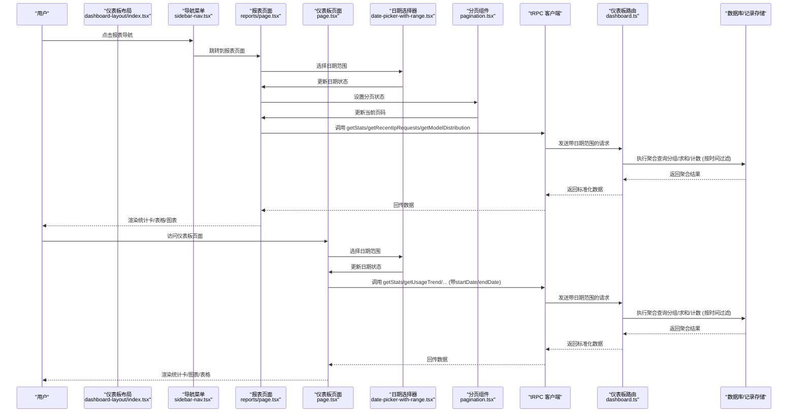

**图表来源**
- [src/components/dashboard-layout/sidebar-nav.tsx:15-19](file://src/components/dashboard-layout/sidebar-nav.tsx#L15-L19)
- [src/app/(dashboard)/reports/page.tsx](file://src/app/(dashboard)/reports/page.tsx#L55-L87)
- [src/app/(dashboard)/page.tsx](file://src/app/(dashboard)/page.tsx#L69-L106)
- [src/components/date-picker-with-range.tsx:31-36](file://src/components/date-picker-with-range.tsx#L31-L36)

## 组件详细分析

### 区域热力图 RegionHeatmapChart
- 功能要点
  - 注册中国地图：首次使用时异步加载 GeoJSON 并注册
  - 视觉映射：按请求次数设置颜色深浅
  - 加载态：遮罩层 + 旋转指示器；错误与空数据提示
  - 响应式：窗口尺寸变化时自动 resize
  - **新增**：支持自定义日期范围的地区分布数据
  - **更新**：工具函数已移动到独立的 utils.ts 文件，提高代码组织性
- 数据处理
  - 将后端返回的地区分布数据映射为 ECharts 所需格式
  - 计算最大值用于视觉映射范围
  - 支持中国地图和世界地图两种视图
  - **更新**：地图工具函数分离到 utils.ts 文件，包括省份映射、国家映射和数据规范化
- 地图切换
  - 通过 Tabs 组件在 China 和 World 视图间切换
  - 支持地图数据的动态加载和注册
  - 错误处理和加载状态管理

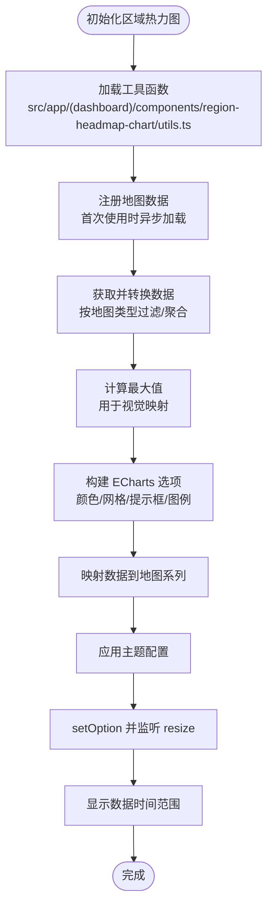

**图表来源**
- [src/app/(dashboard)/components/region-headmap-chart/index.tsx](file://src/app/(dashboard)/components/region-headmap-chart/index.tsx#L79-L171)
- [src/app/(dashboard)/components/region-headmap-chart/utils.ts](file://src/app/(dashboard)/components/region-headmap-chart/utils.ts#L1-L112)

**章节来源**
- [src/app/(dashboard)/components/region-headmap-chart/index.tsx](file://src/app/(dashboard)/components/region-headmap-chart/index.tsx#L1-L250)
- [src/app/(dashboard)/components/region-headmap-chart/utils.ts](file://src/app/(dashboard)/components/region-headmap-chart/utils.ts#L1-L112)

### 区域热力图工具函数 Utils
- **更新**：工具函数已从组件文件中分离到独立的 utils.ts 文件
- 功能要点
  - 地图数据配置：中国和世界地图的 GeoJSON URL
  - 省份名称映射：包含中国大陆所有省份、直辖市、自治区等
  - 数据规范化：去除省份名称中的省、市、自治区等后缀
  - 国家名称映射：中英文国家名称对照表
  - 数据接口定义：RegionDistributionItem 接口定义
- 模块化改进
  - 提高代码复用性和可维护性
  - 减少组件文件体积，专注于业务逻辑
  - 便于单元测试和功能扩展

**章节来源**
- [src/app/(dashboard)/components/region-headmap-chart/utils.ts](file://src/app/(dashboard)/components/region-headmap-chart/utils.ts#L1-L112)

### StatSummaryCard 统计汇总卡片
- 功能要点
  - 提供更丰富的数据概览，支持图标、趋势方向和多种样式变体
  - 支持 up/down/neutral 三种趋势方向的颜色标识
  - 提供三种玻璃卡片样式变体：thin、default、thick
  - 支持加载态：骨架屏动画
  - **新增**：完整的国际化支持，标题和副标题可本地化
- 数据绑定
  - 来自页面层的统计接口返回，字段包括数值、变化百分比与趋势方向
  - 支持自定义图标和副标题显示
  - **新增**：使用 useTranslation Hook 获取本地化文本
- 交互与样式
  - 鼠标悬停放大与阴影增强，玻璃质感背景
  - 不同样式变体提供不同的透明度和阴影效果
  - 图标容器使用渐变与描边，提升可读性
  - **新增**：响应式设计，支持不同屏幕尺寸的布局

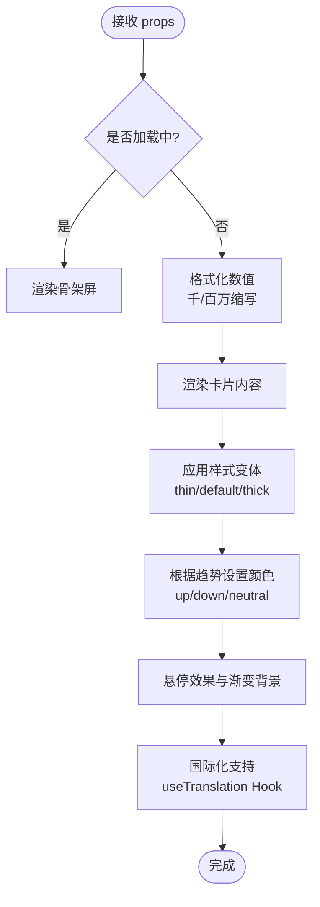

**图表来源**
- [src/components/stat-summary-card.tsx:40-76](file://src/components/stat-summary-card.tsx#L40-L76)

**章节来源**
- [src/components/stat-summary-card.tsx:1-76](file://src/components/stat-summary-card.tsx#L1-L76)

### Reports 报表页面
- 功能要点
  - 提供详细的使用记录查询、筛选和导出功能
  - 支持搜索用户ID、IP地址、地区等关键词
  - 支持按模型和提供商进行筛选
  - 支持 CSV 数据导出
  - 提供统计概览卡片，显示总请求数、Token 消耗、活跃用户等
  - **新增**：完整的分页功能，每页10条记录，支持省略号逻辑
  - **新增**：完整的国际化支持，多语言界面和本地化数据
- 数据处理
  - 使用 trpc.dashboard.getStats 获取统计数据
  - 使用 trpc.dashboard.getRecentIpRequests 获取详细使用记录
  - 使用 trpc.dashboard.getModelDistribution 获取模型分布
  - 支持实时筛选和分页
  - **新增**：使用 useMemo 优化筛选和分页计算性能
- 交互与样式
  - 使用 StatSummaryCard 提供统计概览
  - 支持日期范围选择和多种筛选条件
  - 提供 CSV 导出功能，支持 UTF-8 编码
  - **新增**：响应式设计，支持移动端适配
  - **新增**：分页导航控制，支持前进后退和跳转

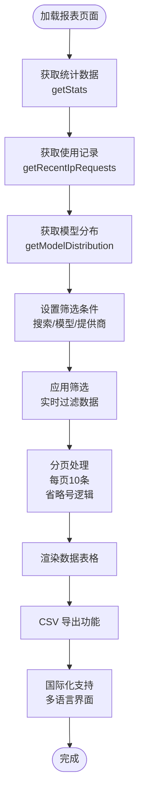

**图表来源**
- [src/app/(dashboard)/reports/page.tsx](file://src/app/(dashboard)/reports/page.tsx#L55-L87)

**章节来源**
- [src/app/(dashboard)/reports/page.tsx](file://src/app/(dashboard)/reports/page.tsx#L1-L478)

### 分页组件 Pagination
- 功能要点
  - **新增**：完整的分页功能实现，支持省略号逻辑
  - **新增**：页面导航控制，支持前进后退和跳转
  - **新增**：响应式设计优化，适配不同屏幕尺寸
  - **新增**：完整的国际化支持，多语言导航文本
- 省略号逻辑
  - 当总页数超过5页时，显示省略号分隔符
  - 根据当前页位置动态插入省略号
  - 支持页面边界情况的特殊处理
- 页面导航控制
  - 支持上一页、下一页导航
  - 支持直接跳转到指定页码
  - 禁用状态下的样式控制
- 交互与样式
  - 使用 useTranslation Hook 获取本地化文本
  - 支持键盘导航和触摸手势
  - 响应式布局，移动端友好

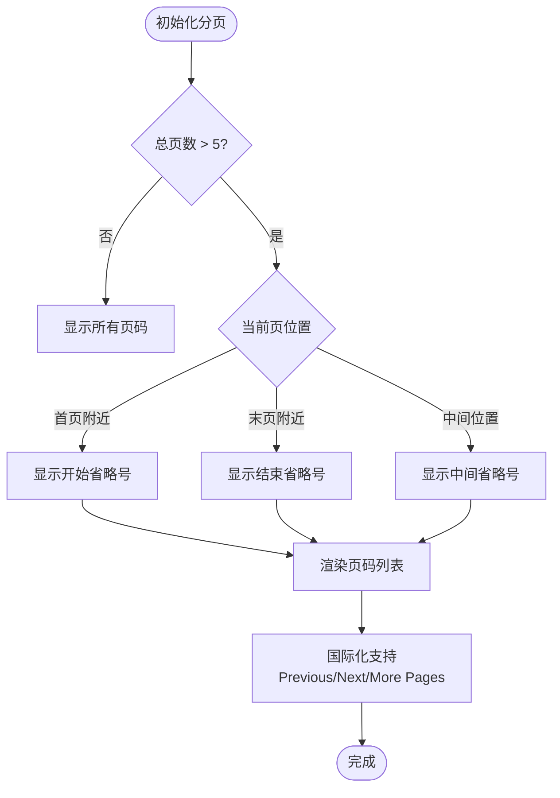

**图表来源**
- [src/components/ui/pagination.tsx:65-118](file://src/components/ui/pagination.tsx#L65-L118)

**章节来源**
- [src/components/ui/pagination.tsx:1-130](file://src/components/ui/pagination.tsx#L1-L130)

### 仪表板布局导航
- 功能要点
  - 提供完整的仪表板导航菜单，包含多个页面链接
  - 支持当前页面高亮显示
  - 支持响应式设计和动画效果
  - **新增**：完整的国际化支持，多语言导航文本显示
- 导航项
  - 仪表板：主页导航
  - 报表：数据报告页面
  - 调试：调试工具页面
  - 配额：配额管理页面
  - 密钥：API密钥管理页面
  - 用户：用户管理页面
- **新增**：使用 useTranslation Hook 获取本地化导航文本
- **新增**：响应式设计，支持不同屏幕尺寸的导航显示

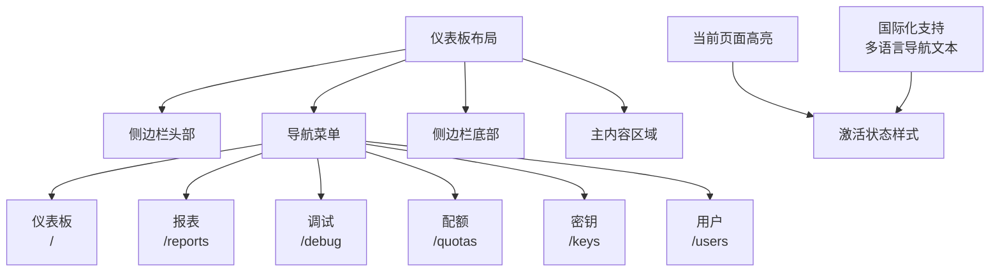

**图表来源**
- [src/components/dashboard-layout/index.tsx:12-28](file://src/components/dashboard-layout/index.tsx#L12-L28)
- [src/components/dashboard-layout/sidebar-nav.tsx:9-40](file://src/components/dashboard-layout/sidebar-nav.tsx#L9-L40)

**章节来源**
- [src/components/dashboard-layout/index.tsx:1-29](file://src/components/dashboard-layout/index.tsx#L1-L29)
- [src/components/dashboard-layout/sidebar-nav.tsx:1-69](file://src/components/dashboard-layout/sidebar-nav.tsx#L1-L69)

### 国际化支持
- **新增**：完整的多语言支持系统
- **新增**：报表页面的国际化实现
- **新增**：分页组件的国际化支持
- **新增**：导航菜单的国际化支持
- **新增**：消息文件的多语言配置
- **新增**：useTranslation Hook 的使用

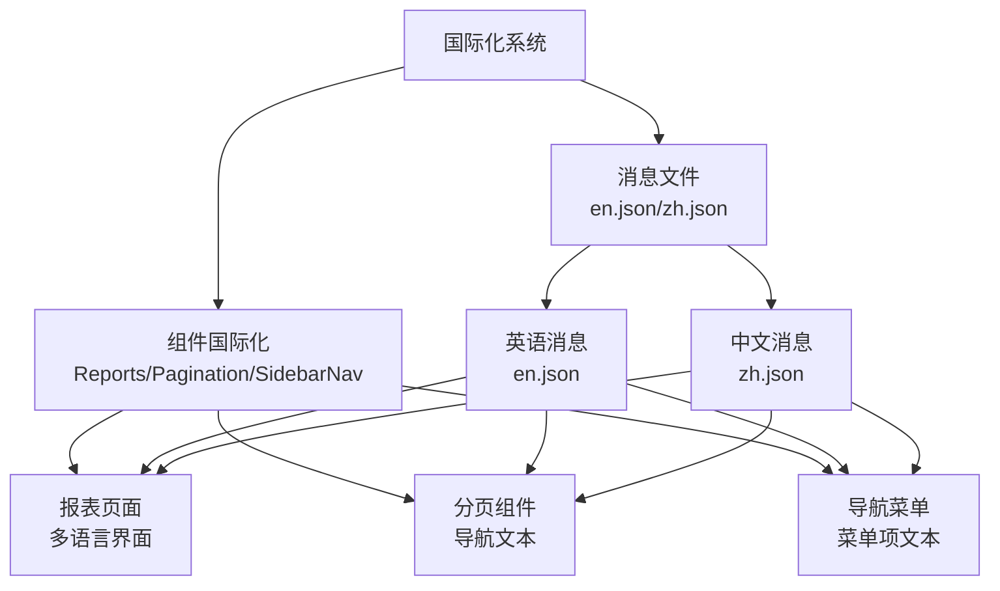

**图表来源**
- [src/messages/en.json:309-336](file://src/messages/en.json#L309-L336)
- [src/messages/zh.json:309-336](file://src/messages/zh.json#L309-L336)

**章节来源**
- [src/messages/en.json:1-338](file://src/messages/en.json#L1-L338)
- [src/messages/zh.json:1-338](file://src/messages/zh.json#L1-L338)

### 日期范围选择器 DatePickerWithRange
- 功能要点
  - 支持预设时间范围：今天、昨天、7天、30天
  - 支持自定义日期范围选择
  - 使用 react-day-picker 组件提供直观的日期选择界面
  - 支持中英文本地化显示
- 数据绑定
  - 通过 onDateRangeChange 回调函数传递选择的日期范围
  - 与页面组件的状态管理集成
- 交互与样式
  - 悬停效果与渐变背景，符合整体设计风格
  - 弹出式日历选择器，支持双月显示

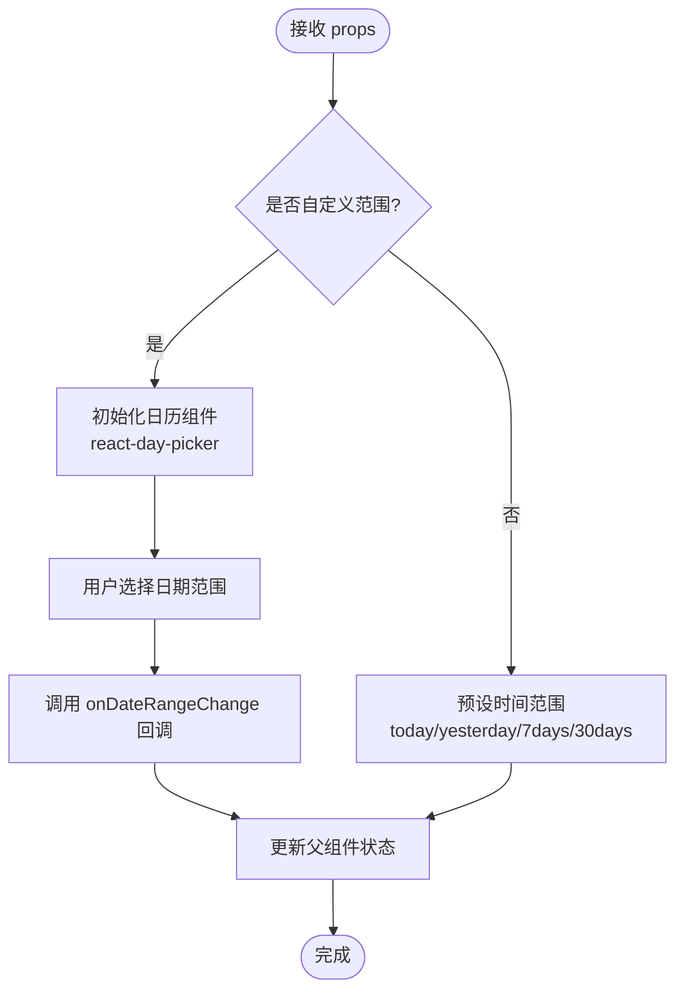

**图表来源**
- [src/components/date-picker-with-range.tsx:26-36](file://src/components/date-picker-with-range.tsx#L26-L36)

**章节来源**
- [src/components/date-picker-with-range.tsx:1-92](file://src/components/date-picker-with-range.tsx#L1-L92)

### 统计卡片 StatCard
- 功能要点
  - 展示标题、数值、变化值与趋势方向图标
  - 数值格式化：千/百万单位缩写与本地化数字
  - 趋势颜色：正向/负向/中性三色
  - 加载态：骨架屏动画
- 数据绑定
  - 来自页面层的统计接口返回，字段包括数值、变化百分比与趋势方向
- 交互与样式
  - 鼠标悬停放大与阴影增强，玻璃质感背景
  - 图标容器使用渐变与描边，提升可读性

**图表来源**
- [src/app/(dashboard)/components/stat-card.tsx](file://src/app/(dashboard)/components/stat-card.tsx#L14-L76)

**章节来源**
- [src/app/(dashboard)/components/stat-card.tsx](file://src/app/(dashboard)/components/stat-card.tsx#L1-L76)

### 使用趋势图 CombinedTrendChart
- 功能要点
  - 双 Y 轴折线图：左轴请求数、右轴 Token 消耗
  - **新增**：支持自定义日期范围的趋势数据展示
  - 主题适配：深浅色模式下颜色与阴影配置不同
  - 响应式：窗口尺寸变化时自动 resize
  - 加载态：遮罩层 + 旋转指示器
- 数据处理
  - X 轴：日期字符串本地化显示（月份简称+日）
  - Y 轴：请求数（左）与 Token（右），右轴支持千位缩写显示
  - 面积填充：使用线性渐变增强视觉层次
  - **新增**：显示数据时间范围信息
- 时间主题
  - 通过系统主题监听动态切换主题配置

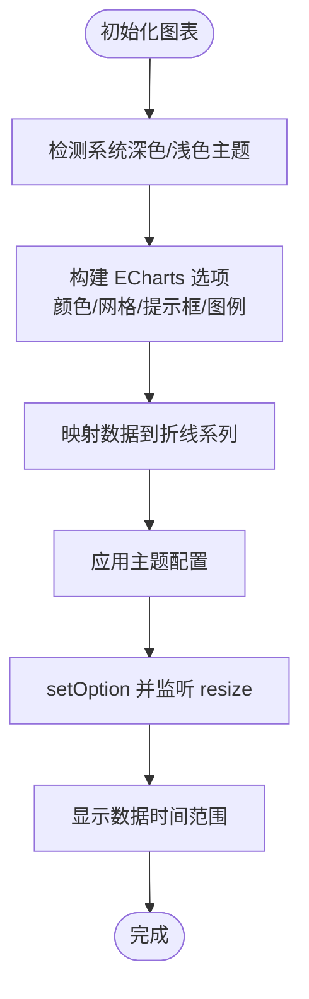

**图表来源**
- [src/app/(dashboard)/components/combined-trend-chart.tsx](file://src/app/(dashboard)/components/combined-trend-chart.tsx#L16-L394)

**章节来源**
- [src/app/(dashboard)/components/combined-trend-chart.tsx](file://src/app/(dashboard)/components/combined-trend-chart.tsx#L1-L394)

### 模型分布图 ModelDistributionChart
- 功能要点
  - 饼图：展示各模型的 Token 消耗占比或请求次数占比
  - 切换模式：通过 Tabs 在 Token 与请求之间切换
  - 提示框：显示模型名、请求次数、Token 消耗与占比
  - 加载态：遮罩层 + 旋转指示器；空数据提示
- 数据处理
  - 计算总量用于百分比计算
  - 将数据映射为饼图 series，保留原始请求次数与 Token 值便于提示框展示

**图表来源**
- [src/app/(dashboard)/components/model-distribution-chart.tsx](file://src/app/(dashboard)/components/model-distribution-chart.tsx#L28-L115)

**章节来源**
- [src/app/(dashboard)/components/model-distribution-chart.tsx](file://src/app/(dashboard)/components/model-distribution-chart.tsx#L1-L147)

### 最近 IP 请求 RecentIpRequests
- 功能要点
  - 表格展示：IP、归属地、用户、模型、Token、时间
  - 分页：最多 7 页时全部显示，否则使用省略号
  - 时间格式化：相对时间（刚刚/分钟前/小时前/天前）
  - 提供商颜色映射：根据 provider 选择颜色类
  - 加载态：骨架屏
  - **新增**：支持自定义日期范围的最近 IP 请求数据
- 数据处理
  - 分页切片：根据每页条数计算起止索引
  - 页码生成：根据当前页与总页数生成页码数组

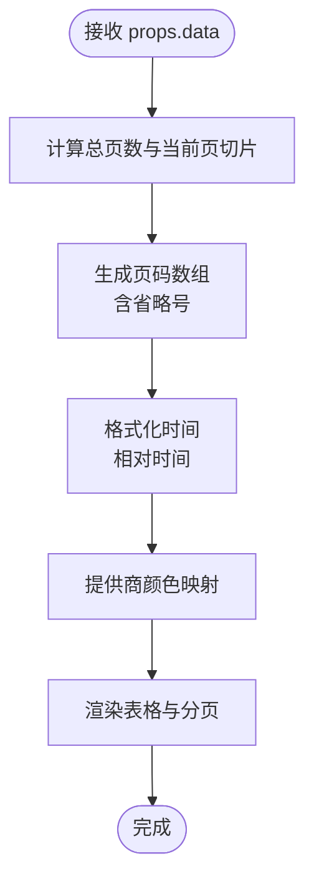

**图表来源**
- [src/app/(dashboard)/components/recent-ip-requests.tsx](file://src/app/(dashboard)/components/recent-ip-requests.tsx#L31-L222)

**章节来源**
- [src/app/(dashboard)/components/recent-ip-requests.tsx](file://src/app/(dashboard)/components/recent-ip-requests.tsx#L1-L225)

### 最近活动 RecentActivity 与活动项 ActivityItem
- 最近活动
  - 支持加载态骨架屏与空态提示
  - 使用 useMemo 缓存活动项列表，避免重复渲染
  - **新增**：支持自定义日期范围的最近活动数据
- 活动项
  - 描述文本、时间、可选详情（模型、提供商、Token）
  - 时间格式化：相对时间
  - 提供商颜色映射：区分 OpenAI、Anthropic、Google、DeepSeek 等
  - 详情展示：提供商标签、Token 数字化显示

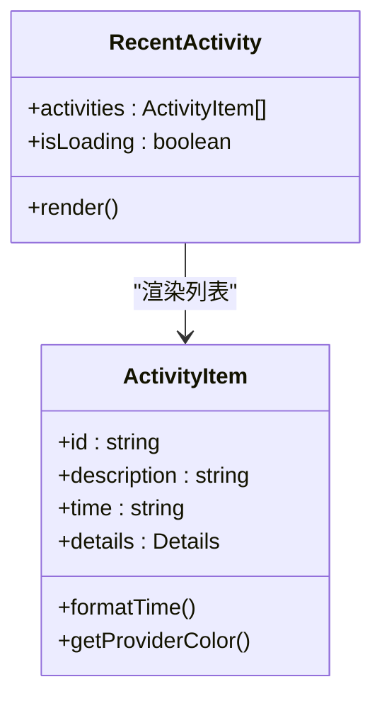

**图表来源**
- [src/app/(dashboard)/components/recent-activity.tsx](file://src/app/(dashboard)/components/recent-activity.tsx#L12-L50)
- [src/app/(dashboard)/components/activity-item.tsx](file://src/app/(dashboard)/components/activity-item.tsx#L17-L87)

**章节来源**
- [src/app/(dashboard)/components/recent-activity.tsx](file://src/app/(dashboard)/components/recent-activity.tsx#L1-L53)
- [src/app/(dashboard)/components/activity-item.tsx](file://src/app/(dashboard)/components/activity-item.tsx#L1-L87)

### 通用工具函数 LibUtils
- **新增**：提供通用的 CSS 类名合并工具函数
- 功能要点
  - 使用 clsx 和 tailwind-merge 实现智能的类名合并
  - 避免重复类名和冲突的样式类
  - 提供简洁的 API 接口，支持多个输入参数
- 应用场景
  - 组件样式类名的动态组合
  - 条件样式的优雅处理
  - Tailwind CSS 与动态样式的最佳实践

**章节来源**
- [src/lib/utils.ts:1-7](file://src/lib/utils.ts#L1-L7)

## 依赖关系分析
- 组件耦合
  - 页面组件对各子组件存在单向数据依赖，子组件内部封装 ECharts 生命周期与 UI 交互
  - 子组件之间低耦合，通过 props 与上下文共享数据
  - **新增**：报表页面与仪表板页面共享相同的日期范围选择和数据查询逻辑
  - **新增**：StatSummaryCard 组件被报表页面广泛使用
  - **新增**：分页组件被报表页面的表格组件使用
  - **更新**：区域热力图组件采用模块化架构，工具函数分离到独立文件
- 外部依赖
  - ECharts：趋势图、饼图、地图
  - Radix UI Tabs：模型分布图的模式切换
  - 自定义分页组件：最近 IP 请求的分页
  - react-day-picker：日期范围选择
  - lucide-react：图标库
  - **新增**：i18n：国际化支持系统
  - **新增**：clsx 和 tailwind-merge：CSS 类名处理
- 类型与工具
  - 类型定义：统一的仪表板数据结构
  - 日期工具：避免时区偏差的日期字符串生成
  - 提供商映射：前后端一致的提供商名称转换
  - IP 归属地：客户端 IP 解析与地区查询
  - **新增**：useTranslation Hook：国际化文本获取
  - **新增**：cn 函数：智能 CSS 类名合并

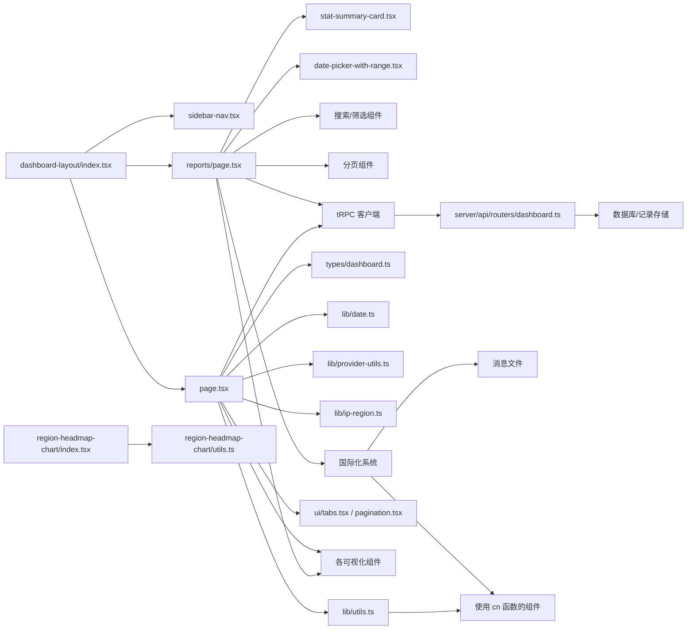

**图表来源**
- [src/components/dashboard-layout/index.tsx:1-29](file://src/components/dashboard-layout/index.tsx#L1-L29)
- [src/app/(dashboard)/reports/page.tsx](file://src/app/(dashboard)/reports/page.tsx#L1-L478)
- [src/app/(dashboard)/page.tsx](file://src/app/(dashboard)/page.tsx#L1-L243)
- [src/app/(dashboard)/components/region-headmap-chart/index.tsx](file://src/app/(dashboard)/components/region-headmap-chart/index.tsx#L1-L250)
- [src/app/(dashboard)/components/region-headmap-chart/utils.ts](file://src/app/(dashboard)/components/region-headmap-chart/utils.ts#L1-L112)
- [src/lib/utils.ts:1-7](file://src/lib/utils.ts#L1-L7)

**章节来源**
- [src/components/dashboard-layout/index.tsx:1-29](file://src/components/dashboard-layout/index.tsx#L1-L29)
- [src/app/(dashboard)/reports/page.tsx](file://src/app/(dashboard)/reports/page.tsx#L1-L478)
- [src/app/(dashboard)/page.tsx](file://src/app/(dashboard)/page.tsx#L1-L243)

## 性能考量
- ECharts 实例复用与销毁
  - 每次渲染前先尝试释放旧实例，避免 DOM 移除冲突
  - 组件卸载时统一 dispose，防止内存泄漏
- 数据聚合与分页
  - 服务端按日期/地区/模型聚合，前端仅做轻量映射与格式化
  - 最近 IP 请求采用分页，减少一次性渲染压力
  - **新增**：报表页面使用虚拟滚动和分页，限制每页记录数量
  - **新增**：使用 useMemo 优化筛选和分页计算性能
- 主题与布局
  - 使用 CSS 变量与深色模式媒体查询，减少运行时样式计算
  - 图表网格与标签字体大小固定，降低重排成本
  - **新增**：StatSummaryCard 使用玻璃卡片效果，优化视觉性能
- 加载态
  - 骨架屏与遮罩层在数据未就绪时提供良好体验，避免闪烁
  - **新增**：报表页面的 CSV 导出使用异步处理，避免阻塞界面
- **新增**：分页性能优化
  - 省略号逻辑减少 DOM 元素数量
  - 响应式设计优化移动端性能
  - 国际化文本缓存提升渲染效率
- **新增**：国际化性能优化
  - useTranslation Hook 缓存翻译结果
  - 消息文件按需加载
  - 文本格式化优化
- **更新**：区域热力图性能优化
  - 工具函数分离到独立文件，减少组件文件体积
  - 地图数据缓存和重复注册避免
  - 动态加载优化，按需获取地图数据
- **新增**：通用工具函数性能优化
  - cn 函数使用智能合并算法，避免重复计算
  - 类名处理的性能优化

## 故障排查指南
- 地图数据加载失败
  - 现象：热力图显示"地图数据加载失败"
  - 排查：确认 GeoJSON 资源路径可用；检查网络请求与跨域配置
  - **更新**：检查 region-headmap-chart/utils.ts 中的地图 URL 配置
- 中国地图未注册
  - 现象：图表初始化时报错或空白
  - 排查：确认首次渲染时已成功注册地图；避免并发重复注册
- 时间显示异常
  - 现象：活动项或 IP 请求时间显示不正确
  - 排查：确保传入时间字符串为 ISO 字符串；检查本地时区处理
- 提供商颜色不匹配
  - 现象：提供商标签颜色不符合预期
  - 排查：确认传入的提供商名称大小写与映射规则一致；必要时使用映射工具转换
- 分页与排序
  - 现象：分页页码异常或排序不生效
  - 排查：确认数据长度与每页条数计算正确；检查排序逻辑与页码生成边界
  - **新增**：省略号逻辑异常：检查 currentPage 与 totalPages 的关系
- **新增**：报表页面数据导出失败
  - 现象：CSV 导出按钮不可用或导出失败
  - 排查：确认有数据可导出；检查浏览器兼容性；验证数据格式正确性
- **新增**：StatSummaryCard 样式异常
  - 现象：统计卡片样式显示不正确或颜色异常
  - 排查：确认样式变体参数正确；检查 CSS 变量是否正常；验证主题切换
- **新增**：导航菜单高亮失效
  - 现象：当前页面导航项未正确高亮
  - 排查：确认 pathname 匹配逻辑；检查路由配置；验证国际化翻译
- **新增**：分页组件国际化失效
  - 现象：分页导航文本显示不正确
  - 排查：确认 useTranslation Hook 正常工作；检查消息文件加载；验证文本键值
- **新增**：报表页面国际化文本缺失
  - 现象：报表页面某些文本显示为键值而非实际内容
  - 排查：确认消息文件中存在相应键值；检查语言切换逻辑；验证文本格式
- **更新**：区域热力图工具函数问题
  - 现象：省份名称规范化或国家映射不正确
  - 排查：检查 region-headmap-chart/utils.ts 中的映射配置；验证数据格式
- **新增**：通用工具函数 cn 函数问题
  - 现象：CSS 类名合并异常或样式冲突
  - 排查：确认 clsx 和 tailwind-merge 版本兼容性；检查类名输入参数

**章节来源**
- [src/app/(dashboard)/components/region-headmap-chart/index.tsx](file://src/app/(dashboard)/components/region-headmap-chart/index.tsx#L159-L163)
- [src/app/(dashboard)/components/recent-ip-requests.tsx](file://src/app/(dashboard)/components/recent-ip-requests.tsx#L71-L83)
- [src/app/(dashboard)/components/activity-item.tsx](file://src/app/(dashboard)/components/activity-item.tsx#L20-L37)
- [src/lib/provider-utils.ts:1-27](file://src/lib/provider-utils.ts#L1-L27)
- [src/app/(dashboard)/components/combined-trend-chart.tsx](file://src/app/(dashboard)/components/combined-trend-chart.tsx#L382-L387)
- [src/app/(dashboard)/reports/page.tsx](file://src/app/(dashboard)/reports/page.tsx#L89-L113)
- [src/components/stat-summary-card.tsx:47-51](file://src/components/stat-summary-card.tsx#L47-L51)
- [src/components/dashboard-layout/sidebar-nav.tsx:54-58](file://src/components/dashboard-layout/sidebar-nav.tsx#L54-L58)
- [src/components/ui/pagination.tsx:65-118](file://src/components/ui/pagination.tsx#L65-L118)
- [src/app/(dashboard)/components/region-headmap-chart/utils.ts](file://src/app/(dashboard)/components/region-headmap-chart/utils.ts#L43-L49)
- [src/lib/utils.ts:4-6](file://src/lib/utils.ts#L4-L6)

## 结论
本仪表板组件体系以清晰的职责划分与稳健的数据流为核心：
- 页面层负责调度与聚合，子组件专注可视化与交互
- **新增**：完整的数据报告中心，包括报表页面、统计汇总卡片组件和区域热力图图表优化
- **新增**：StatSummaryCard 统计汇总卡片组件，提供更丰富的数据概览功能
- **新增**：Reports 报表页面，支持详细的使用记录查询、筛选和导出功能
- **新增**：仪表板布局导航，包含报表页面的导航链接
- **新增**：完整的分页功能实现，包括省略号逻辑、页面导航控制、响应式设计优化
- **新增**：完整的国际化支持，涵盖报表页面、分页组件和导航菜单
- **新增**：完整的日期范围过滤功能，支持灵活的时间维度分析
- **更新**：区域热力图组件采用模块化架构，工具函数分离到独立文件，提高代码组织性和可维护性
- **新增**：通用工具函数提供 CSS 类名合并等通用功能
- 通过 ECharts 与自定义 UI 组件实现丰富的数据可视化
- 以类型定义、工具函数与样式变量保障一致性与可维护性
- 在性能与用户体验上兼顾加载态、主题适配与响应式布局
- **新增**：性能优化措施包括分页性能优化、国际化性能优化、区域热力图性能优化等

## 附录

### 组件配置选项与样式定制
- 统计卡片
  - 配置项：标题、数值、变化值、变化类型、图标、加载态开关
  - 样式：玻璃背景、渐变图标容器、悬停放大与阴影
- **新增**：StatSummaryCard 统计汇总卡片
  - 配置项：标题、数值、副标题、图标、趋势方向、样式变体
  - 样式：三种玻璃卡片样式变体（thin/default/thick）、趋势颜色标识
  - **新增**：国际化支持，多语言标题和副标题
- **新增**：Reports 报表页面
  - 配置项：搜索关键词、模型筛选、提供商筛选、日期范围、分页参数
  - 样式：统计概览卡片、筛选面板、数据表格、分页控件
  - **新增**：响应式设计，支持移动端适配
- **新增**：分页组件 Pagination
  - 配置项：当前页码、总页数、页面大小、省略号逻辑
  - 样式：导航按钮、页码链接、省略号分隔符
  - **新增**：国际化支持，多语言导航文本
- 使用趋势图
  - 配置项：数据数组、加载态
  - 样式：双轴、面积填充、深浅主题颜色方案
- 模型分布图
  - 配置项：数据数组、加载态、模式（Token/请求）
  - 交互：Tabs 切换模式
- 地区热力图
  - 配置项：数据数组、加载态
  - 交互：地图切换 Tabs、地图缩放、提示框、地图类型切换
  - **更新**：工具函数分离到独立文件，提高代码组织性
- 最近 IP 请求
  - 配置项：数据数组、加载态
  - 交互：分页导航、相对时间格式化
- 最近活动
  - 配置项：活动数组、加载态
  - 交互：相对时间格式化、提供商颜色映射
- **新增**：日期范围选择器
  - 配置项：起始日期、结束日期、回调函数、样式类名
  - 交互：日历选择、预设范围切换
  - **新增**：国际化支持，多语言日期格式
- **新增**：通用工具函数
  - 配置项：CSS 类名合并函数 cn
  - 交互：智能类名合并，避免重复和冲突

**章节来源**
- [src/app/(dashboard)/components/stat-card.tsx](file://src/app/(dashboard)/components/stat-card.tsx#L5-L12)
- [src/components/stat-summary-card.tsx:32-38](file://src/components/stat-summary-card.tsx#L32-L38)
- [src/app/(dashboard)/reports/page.tsx](file://src/app/(dashboard)/reports/page.tsx#L224-L284)
- [src/app/(dashboard)/components/combined-trend-chart.tsx](file://src/app/(dashboard)/components/combined-trend-chart.tsx#L7-L14)
- [src/app/(dashboard)/components/model-distribution-chart.tsx](file://src/app/(dashboard)/components/model-distribution-chart.tsx#L21-L24)
- [src/app/(dashboard)/components/region-headmap-chart/index.tsx](file://src/app/(dashboard)/components/region-headmap-chart/index.tsx#L18-L21)
- [src/app/(dashboard)/components/recent-ip-requests.tsx](file://src/app/(dashboard)/components/recent-ip-requests.tsx#L26-L29)
- [src/app/(dashboard)/components/recent-activity.tsx](file://src/app/(dashboard)/components/recent-activity.tsx#L7-L10)
- [src/components/date-picker-with-range.tsx:13-18](file://src/components/date-picker-with-range.tsx#L13-L18)
- [src/components/ui/pagination.tsx:10-17](file://src/components/ui/pagination.tsx#L10-L17)
- [src/lib/utils.ts:4-6](file://src/lib/utils.ts#L4-L6)

### 数据处理流程（关键组件）
- 仪表板统计
  - 计算当前与对比时间段的用户数、请求数、Token、活跃用户
  - 增长率计算与趋势方向判定
  - **新增**：支持自定义日期范围过滤
- 使用趋势
  - 按日期分组统计请求数与 Token，补齐缺失日期
  - **新增**：支持自定义日期范围的趋势数据
- 地区分布
  - 按地区分组统计请求数与 Token，过滤空值
  - **更新**：使用 region-headmap-chart/utils.ts 中的工具函数进行数据规范化和映射
  - **新增**：支持自定义日期范围的地区分布数据
- 模型分布
  - 按模型分组统计 Token 与请求次数，降序排列
  - **新增**：支持自定义日期范围的模型分布数据
- **新增**：报表页面数据处理
  - 使用 trpc.dashboard.getStats 获取统计数据概览
  - 使用 trpc.dashboard.getRecentIpRequests 获取详细使用记录
  - 使用 trpc.dashboard.getModelDistribution 获取模型分布
  - 支持实时搜索、筛选和分页处理
  - **新增**：使用 useMemo 优化性能
- 最近活动
  - 按时间倒序取最近 N 条记录，构造描述与详情
  - **新增**：支持自定义日期范围的活动数据
- 最近 IP 请求
  - 过滤非空 IP 的记录，按时间倒序取最近 N 条
  - **新增**：支持自定义日期范围的 IP 请求数据

**章节来源**
- [src/server/api/routers/dashboard.ts:13-605](file://src/server/api/routers/dashboard.ts#L13-L605)
- [src/app/(dashboard)/reports/page.tsx](file://src/app/(dashboard)/reports/page.tsx#L55-L87)
- [src/lib/date.ts:3-10](file://src/lib/date.ts#L3-L10)
- [src/app/(dashboard)/components/region-headmap-chart/utils.ts](file://src/app/(dashboard)/components/region-headmap-chart/utils.ts#L43-L49)

### 时间格式化算法
- 相对时间
  - 输入：ISO 时间字符串
  - 输出：刚刚/XX 分钟前/XX 小时前/XX 天前
- 日期字符串
  - 使用本地年月日拼接，避免时区偏差
- **新增**：数据时间范围显示
  - 在趋势图中显示数据的起始和结束日期
- **新增**：报表页面时间格式化
  - 使用 date-fns 格式化显示，支持本地化时间格式
- **新增**：国际化时间格式
  - 支持不同语言环境的时间格式化

**章节来源**
- [src/app/(dashboard)/components/activity-item.tsx](file://src/app/(dashboard)/components/activity-item.tsx#L20-L37)
- [src/app/(dashboard)/components/recent-ip-requests.tsx](file://src/app/(dashboard)/components/recent-ip-requests.tsx#L71-L83)
- [src/lib/date.ts:3-10](file://src/lib/date.ts#L3-L10)
- [src/app/(dashboard)/components/combined-trend-chart.tsx](file://src/app/(dashboard)/components/combined-trend-chart.tsx#L382-L387)
- [src/app/(dashboard)/reports/page.tsx](file://src/app/(dashboard)/reports/page.tsx#L334-L336)

### 提供商颜色映射
- 模型分布与最近 IP 请求均使用颜色映射
- 支持 OpenAI、Anthropic、Google、DeepSeek 等
- 默认灰色，深浅色模式下分别对应不同透明度与对比度
- **新增**：StatSummaryCard 中的图标颜色使用统一的提供商颜色映射

**章节来源**
- [src/app/(dashboard)/components/model-distribution-chart.tsx](file://src/app/(dashboard)/components/model-distribution-chart.tsx#L39-L50)
- [src/app/(dashboard)/components/recent-ip-requests.tsx](file://src/app/(dashboard)/components/recent-ip-requests.tsx#L85-L98)
- [src/app/(dashboard)/components/activity-item.tsx](file://src/app/(dashboard)/components/activity-item.tsx#L39-L50)
- [src/components/stat-summary-card.tsx:47-51](file://src/components/stat-summary-card.tsx#L47-L51)

### 响应式设计
- 容器采用圆角与玻璃背景，配合阴影与过渡动画
- 图表容器高度固定，ECharts 自适应宽度
- 分页组件在窄屏下保持可点击性与可读性
- 全局样式通过 CSS 变量与深色模式媒体查询统一风格
- **新增**：StatSummaryCard 使用响应式布局，支持不同屏幕尺寸
- **新增**：报表页面使用弹性布局，支持移动端适配
- **新增**：日期选择器在移动端的适配优化
- **新增**：分页组件的响应式设计优化
- **新增**：区域热力图组件的响应式适配

**章节来源**
- [src/app/globals.css:1-136](file://src/app/globals.css#L1-L136)
- [src/app/(dashboard)/components/combined-trend-chart.tsx](file://src/app/(dashboard)/components/combined-trend-chart.tsx#L304-L320)
- [src/components/ui/pagination.tsx:1-118](file://src/components/ui/pagination.tsx#L1-L118)
- [src/components/date-picker-with-range.tsx:40-84](file://src/components/date-picker-with-range.tsx#L40-L84)
- [src/components/stat-summary-card.tsx:54-60](file://src/components/stat-summary-card.tsx#L54-L60)
- [src/app/(dashboard)/reports/page.tsx](file://src/app/(dashboard)/reports/page.tsx#L157-L164)

### 日期范围过滤实现细节
- **新增**：所有统计接口都支持 startDate 和 endDate 参数
- **新增**：页面组件通过 DateRangePicker 和 DatePickerWithRange 组件管理日期状态
- **新增**：服务端路由根据日期范围动态调整查询条件
- **新增**：支持预设时间范围（今天、昨天、7天、30天）和自定义日期范围
- **新增**：演示模式下的日期范围数据模拟
- **新增**：报表页面的日期范围选择与仪表板页面共享相同的过滤逻辑
- **新增**：国际化支持的日期格式化

**章节来源**
- [src/server/api/routers/dashboard.ts:13-605](file://src/server/api/routers/dashboard.ts#L13-L605)
- [src/app/(dashboard)/page.tsx](file://src/app/(dashboard)/page.tsx#L19-L67)
- [src/app/(dashboard)/reports/page.tsx](file://src/app/(dashboard)/reports/page.tsx#L47-L48)
- [src/components/date-picker-with-range.tsx:26-36](file://src/components/date-picker-with-range.tsx#L26-L36)

### 新增功能详细说明

#### StatSummaryCard 统计汇总卡片组件
- 设计理念：提供更丰富的数据概览，替代简单的统计卡片
- 样式变体：thin（细薄）、default（默认）、thick（厚重）三种玻璃卡片效果
- 交互特性：支持趋势方向标识（up/down/neutral），鼠标悬停增强视觉效果
- 使用场景：报表页面的统计数据概览，提供更直观的数据展示
- **新增**：完整的国际化支持，多语言界面

#### Reports 报表页面
- 功能完整性：提供完整的数据报告功能，包括查询、筛选、导出等
- 数据丰富性：支持多种维度的数据查询和统计
- 用户体验：提供友好的界面和交互，支持多种筛选条件
- 数据导出：支持 CSV 格式导出，便于数据分析和存档
- **新增**：完整的分页功能，支持省略号逻辑和响应式设计
- **新增**：完整的国际化支持，多语言界面和本地化数据

#### 分页组件 Pagination
- 设计理念：提供完整的分页功能，支持省略号逻辑和页面导航控制
- 省略号逻辑：当总页数超过5页时，动态插入省略号分隔符
- 页面导航：支持上一页、下一页、直接跳转到指定页码
- 响应式设计：适配不同屏幕尺寸，移动端友好
- 国际化支持：多语言导航文本，支持 Previous/Next/More Pages
- 性能优化：减少 DOM 元素数量，提升渲染性能

#### 仪表板布局导航
- 导航完整性：包含仪表板、报表、调试、配额、密钥、用户管理等完整导航
- 用户体验：支持当前页面高亮显示，提供良好的导航体验
- 响应式设计：支持不同屏幕尺寸的导航显示
- 国际化支持：支持多语言导航文本显示
- 动画效果：平滑的过渡动画和悬停效果

#### 国际化支持系统
- 消息文件：完整的英文和中文消息文件
- 组件国际化：报表页面、分页组件、导航菜单的多语言支持
- 文本格式化：支持本地化的日期、数字、时间格式
- 动态切换：支持运行时语言切换
- 性能优化：文本缓存和按需加载

#### 通用工具函数 LibUtils
- 设计理念：提供通用的 CSS 类名合并工具函数
- 功能实现：使用 clsx 和 tailwind-merge 实现智能的类名合并
- 性能优化：避免重复类名和冲突的样式类
- 应用场景：组件样式类名的动态组合和条件样式的优雅处理

#### 区域热力图工具函数 Utils
- **更新**：工具函数已从组件文件中分离到独立的 utils.ts 文件
- 功能模块化：地图数据配置、省份名称映射、数据规范化、国家名称映射
- 代码组织：提高代码复用性和可维护性，减少组件文件体积
- 测试友好：便于单元测试和功能扩展

**章节来源**
- [src/components/stat-summary-card.tsx:1-76](file://src/components/stat-summary-card.tsx#L1-L76)
- [src/app/(dashboard)/reports/page.tsx](file://src/app/(dashboard)/reports/page.tsx#L1-L478)
- [src/components/dashboard-layout/sidebar-nav.tsx:1-69](file://src/components/dashboard-layout/sidebar-nav.tsx#L1-L69)
- [src/components/ui/pagination.tsx:1-130](file://src/components/ui/pagination.tsx#L1-L130)
- [src/messages/en.json:309-336](file://src/messages/en.json#L309-L336)
- [src/messages/zh.json:309-336](file://src/messages/zh.json#L309-L336)
- [src/lib/utils.ts:1-7](file://src/lib/utils.ts#L1-L7)
- [src/app/(dashboard)/components/region-headmap-chart/utils.ts](file://src/app/(dashboard)/components/region-headmap-chart/utils.ts#L1-L112)