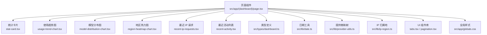
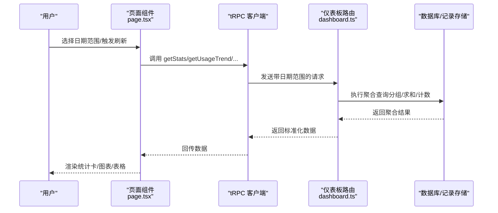
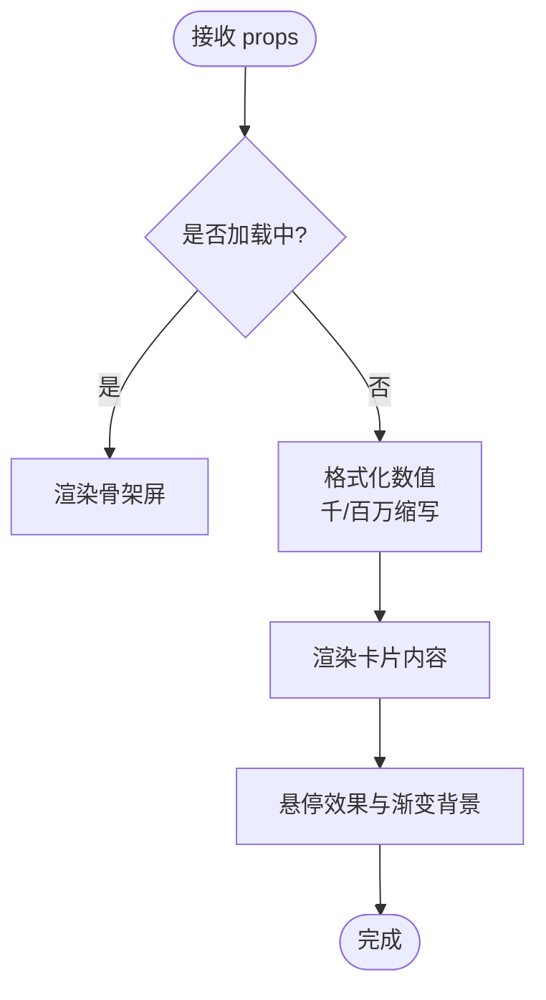
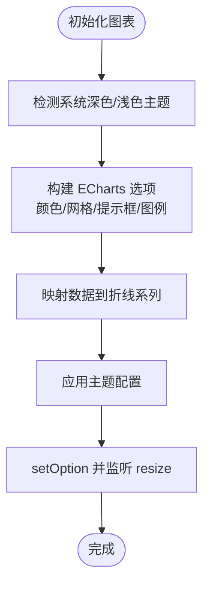
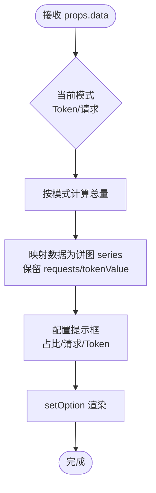
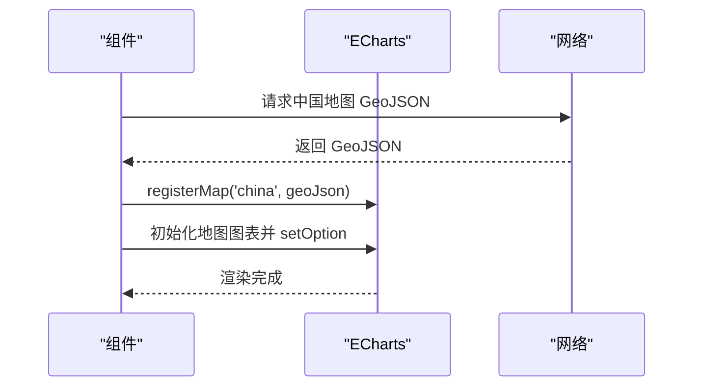
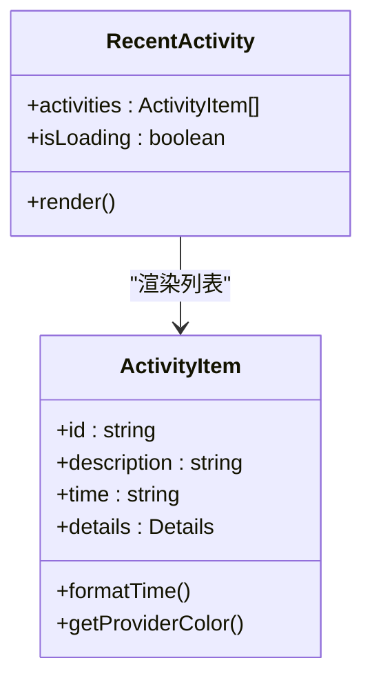
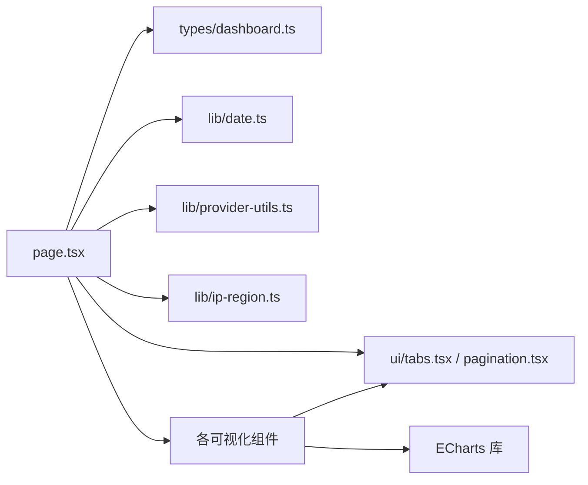

# 仪表板组件

<cite>
**本文引用的文件**
- [src/app/(dashboard)/components/activity-item.tsx](file://src/app/(dashboard)/components/activity-item.tsx)
- [src/app/(dashboard)/components/model-distribution-chart.tsx](file://src/app/(dashboard)/components/model-distribution-chart.tsx)
- [src/app/(dashboard)/components/recent-activity.tsx](file://src/app/(dashboard)/components/recent-activity.tsx)
- [src/app/(dashboard)/components/recent-ip-requests.tsx](file://src/app/(dashboard)/components/recent-ip-requests.tsx)
- [src/app/(dashboard)/components/region-heatmap-chart.tsx](file://src/app/(dashboard)/components/region-heatmap-chart.tsx)
- [src/app/(dashboard)/components/stat-card.tsx](file://src/app/(dashboard)/components/stat-card.tsx)
- [src/app/(dashboard)/components/usage-trend-chart.tsx](file://src/app/(dashboard)/components/usage-trend-chart.tsx)
- [src/app/(dashboard)/page.tsx](file://src/app/(dashboard)/page.tsx)
- [src/server/api/routers/dashboard.ts](file://src/server/api/routers/dashboard.ts)
- [src/types/dashboard.ts](file://src/types/dashboard.ts)
- [src/lib/provider-utils.ts](file://src/lib/provider-utils.ts)
- [src/lib/ip-region.ts](file://src/lib/ip-region.ts)
- [src/lib/date.ts](file://src/lib/date.ts)
- [src/components/ui/tabs.tsx](file://src/components/ui/tabs.tsx)
- [src/components/ui/pagination.tsx](file://src/components/ui/pagination.tsx)
- [src/app/globals.css](file://src/app/globals.css)
</cite>

## 目录
1. [简介](#简介)
2. [项目结构](#项目结构)
3. [核心组件](#核心组件)
4. [架构总览](#架构总览)
5. [组件详细分析](#组件详细分析)
6. [依赖关系分析](#依赖关系分析)
7. [性能考量](#性能考量)
8. [故障排查指南](#故障排查指南)
9. [结论](#结论)
10. [附录](#附录)

## 简介
本文件系统性梳理仪表板组件的实现与交互，覆盖以下方面：
- 统计卡片、活动项、趋势图、模型分布图、地区热力图、最近 IP 请求表等组件的实现原理与数据绑定
- 时间格式化算法与提供商颜色映射策略
- 可视化组件的数据处理流程（聚合、分组、归一化）
- 组件配置项、样式定制与响应式设计
- 组件间协作关系与数据流传递机制

## 项目结构
仪表板页面位于应用路由的“仪表板”区域，采用客户端组件与服务端数据结合的方式：
- 页面组件负责日期范围选择、调用 tRPC 接口获取多维数据，并将数据传递给各子组件
- 子组件以可视化为主，部分组件内置分页或切换态（如模型分布的 Token/请求模式）

**图表来源**
- [src/app/(dashboard)/page.tsx](file://src/app/(dashboard)/page.tsx#L1-L228)
- [src/app/(dashboard)/components/stat-card.tsx](file://src/app/(dashboard)/components/stat-card.tsx#L1-L76)
- [src/app/(dashboard)/components/usage-trend-chart.tsx](file://src/app/(dashboard)/components/usage-trend-chart.tsx#L1-L323)
- [src/app/(dashboard)/components/model-distribution-chart.tsx](file://src/app/(dashboard)/components/model-distribution-chart.tsx#L1-L147)
- [src/app/(dashboard)/components/region-heatmap-chart.tsx](file://src/app/(dashboard)/components/region-heatmap-chart.tsx#L1-L175)
- [src/app/(dashboard)/components/recent-ip-requests.tsx](file://src/app/(dashboard)/components/recent-ip-requests.tsx#L1-L225)
- [src/app/(dashboard)/components/recent-activity.tsx](file://src/app/(dashboard)/components/recent-activity.tsx#L1-L53)
- [src/types/dashboard.ts](file://src/types/dashboard.ts#L1-L48)
- [src/lib/date.ts](file://src/lib/date.ts#L1-L17)
- [src/lib/provider-utils.ts](file://src/lib/provider-utils.ts#L1-L27)
- [src/lib/ip-region.ts](file://src/lib/ip-region.ts#L1-L101)
- [src/components/ui/tabs.tsx](file://src/components/ui/tabs.tsx#L1-L56)
- [src/components/ui/pagination.tsx](file://src/components/ui/pagination.tsx#L1-L118)
- [src/app/globals.css](file://src/app/globals.css#L1-L136)

**章节来源**
- [src/app/(dashboard)/page.tsx](file://src/app/(dashboard)/page.tsx#L1-L228)

## 核心组件
- 统计卡片：展示关键指标与变化趋势，支持加载态与数值格式化
- 使用趋势图：双 Y 轴折线图，展示请求数与 Token 消耗随时间的变化
- 模型分布图：饼图，支持按 Token 或请求次数进行占比切换
- 地区热力图：基于 ECharts 的中国地图热力图，按省/地区展示请求次数与 Token
- 最近 IP 请求：表格+分页，展示最近请求的来源 IP、归属地、模型、Token 等
- 最近活动：列表渲染最近事件，含时间相对格式化与提供商标签
- 类型与工具：统一的数据结构、提供商映射、IP 归属地查询、日期工具

**章节来源**
- [src/app/(dashboard)/components/stat-card.tsx](file://src/app/(dashboard)/components/stat-card.tsx#L1-L76)
- [src/app/(dashboard)/components/usage-trend-chart.tsx](file://src/app/(dashboard)/components/usage-trend-chart.tsx#L1-L323)
- [src/app/(dashboard)/components/model-distribution-chart.tsx](file://src/app/(dashboard)/components/model-distribution-chart.tsx#L1-L147)
- [src/app/(dashboard)/components/region-heatmap-chart.tsx](file://src/app/(dashboard)/components/region-heatmap-chart.tsx#L1-L175)
- [src/app/(dashboard)/components/recent-ip-requests.tsx](file://src/app/(dashboard)/components/recent-ip-requests.tsx#L1-L225)
- [src/app/(dashboard)/components/recent-activity.tsx](file://src/app/(dashboard)/components/recent-activity.tsx#L1-L53)
- [src/types/dashboard.ts](file://src/types/dashboard.ts#L1-L48)
- [src/lib/provider-utils.ts](file://src/lib/provider-utils.ts#L1-L27)
- [src/lib/ip-region.ts](file://src/lib/ip-region.ts#L1-L101)
- [src/lib/date.ts](file://src/lib/date.ts#L1-L17)

## 架构总览
仪表板采用“页面调度 + 子组件渲染”的分层架构：
- 页面层：管理日期范围、发起 tRPC 查询、组装数据并传递给子组件
- 子组件层：各自负责数据绑定、ECharts 初始化与重绘、UI 呈现与交互
- 服务端层：通过 tRPC 聚合数据库查询，返回标准化数据

**图表来源**
- [src/app/(dashboard)/page.tsx](file://src/app/(dashboard)/page.tsx#L68-L104)
- [src/server/api/routers/dashboard.ts](file://src/server/api/routers/dashboard.ts#L9-L454)

## 组件详细分析

### 统计卡片 StatCard
- 功能要点
  - 展示标题、数值、变化值与趋势方向图标
  - 数值格式化：千/百万单位缩写与本地化数字
  - 趋势颜色：正向/负向/中性三色
  - 加载态：骨架屏动画
- 数据绑定
  - 来自页面层的统计接口返回，字段包括数值、变化百分比与趋势方向
- 交互与样式
  - 鼠标悬停放大与阴影增强，玻璃质感背景
  - 图标容器使用渐变与描边，提升可读性

**图表来源**
- [src/app/(dashboard)/components/stat-card.tsx](file://src/app/(dashboard)/components/stat-card.tsx#L14-L76)

**章节来源**
- [src/app/(dashboard)/components/stat-card.tsx](file://src/app/(dashboard)/components/stat-card.tsx#L1-L76)
- [src/app/(dashboard)/page.tsx](file://src/app/(dashboard)/page.tsx#L134-L191)

### 使用趋势图 UsageTrendChart
- 功能要点
  - 双 Y 轴折线图：左轴请求数、右轴 Token 消耗
  - 主题适配：深浅色模式下颜色与阴影配置不同
  - 响应式：窗口尺寸变化时自动 resize
  - 加载态：遮罩层 + 旋转指示器
- 数据处理
  - X 轴：日期字符串本地化显示（月份简称+日）
  - Y 轴：请求数（左）与 Token（右），右轴支持千位缩写显示
  - 面积填充：使用线性渐变增强视觉层次
- 时间主题
  - 通过系统主题监听动态切换主题配置

**图表来源**
- [src/app/(dashboard)/components/usage-trend-chart.tsx](file://src/app/(dashboard)/components/usage-trend-chart.tsx#L16-L302)

**章节来源**
- [src/app/(dashboard)/components/usage-trend-chart.tsx](file://src/app/(dashboard)/components/usage-trend-chart.tsx#L1-L323)
- [src/lib/date.ts](file://src/lib/date.ts#L1-L17)

### 模型分布图 ModelDistributionChart
- 功能要点
  - 饼图：展示各模型的 Token 消耗占比或请求次数占比
  - 切换模式：通过 Tabs 在 Token 与请求之间切换
  - 提示框：显示模型名、请求次数、Token 消耗与占比
  - 加载态：遮罩层 + 旋转指示器；空数据提示
- 数据处理
  - 计算总量用于百分比计算
  - 将数据映射为饼图 series，保留原始请求次数与 Token 值便于提示框展示

**图表来源**
- [src/app/(dashboard)/components/model-distribution-chart.tsx](file://src/app/(dashboard)/components/model-distribution-chart.tsx#L28-L115)
- [src/components/ui/tabs.tsx](file://src/components/ui/tabs.tsx#L1-L56)

**章节来源**
- [src/app/(dashboard)/components/model-distribution-chart.tsx](file://src/app/(dashboard)/components/model-distribution-chart.tsx#L1-L147)
- [src/components/ui/tabs.tsx](file://src/components/ui/tabs.tsx#L1-L56)

### 地区热力图 RegionHeatmapChart
- 功能要点
  - 注册中国地图：首次使用时异步加载 GeoJSON 并注册
  - 视觉映射：按请求次数设置颜色深浅
  - 加载态：遮罩层 + 旋转指示器；错误与空数据提示
  - 响应式：窗口尺寸变化时自动 resize
- 数据处理
  - 将后端返回的地区分布数据映射为 ECharts 所需格式
  - 计算最大值用于视觉映射范围

**图表来源**
- [src/app/(dashboard)/components/region-heatmap-chart.tsx](file://src/app/(dashboard)/components/region-heatmap-chart.tsx#L26-L150)

**章节来源**
- [src/app/(dashboard)/components/region-heatmap-chart.tsx](file://src/app/(dashboard)/components/region-heatmap-chart.tsx#L1-L175)

### 最近 IP 请求 RecentIpRequests
- 功能要点
  - 表格展示：IP、归属地、用户、模型、Token、时间
  - 分页：最多 7 页时全部显示，否则使用省略号
  - 时间格式化：相对时间（刚刚/分钟前/小时前/天前）
  - 提供商颜色映射：根据 provider 选择颜色类
  - 加载态：骨架屏
- 数据处理
  - 分页切片：根据每页条数计算起止索引
  - 页码生成：根据当前页与总页数生成页码数组

**图表来源**
- [src/app/(dashboard)/components/recent-ip-requests.tsx](file://src/app/(dashboard)/components/recent-ip-requests.tsx#L31-L222)
- [src/components/ui/pagination.tsx](file://src/components/ui/pagination.tsx#L1-L118)

**章节来源**
- [src/app/(dashboard)/components/recent-ip-requests.tsx](file://src/app/(dashboard)/components/recent-ip-requests.tsx#L1-L225)
- [src/components/ui/pagination.tsx](file://src/components/ui/pagination.tsx#L1-L118)

### 最近活动 RecentActivity 与活动项 ActivityItem
- 最近活动
  - 支持加载态骨架屏与空态提示
  - 使用 useMemo 缓存活动项列表，避免重复渲染
- 活动项
  - 描述文本、时间、可选详情（模型、提供商、Token）
  - 时间格式化：相对时间
  - 提供商颜色映射：区分 OpenAI、Anthropic、Google、DeepSeek 等
  - 详情展示：提供商标签、Token 数字化显示

**图表来源**
- [src/app/(dashboard)/components/recent-activity.tsx](file://src/app/(dashboard)/components/recent-activity.tsx#L12-L50)
- [src/app/(dashboard)/components/activity-item.tsx](file://src/app/(dashboard)/components/activity-item.tsx#L17-L87)

**章节来源**
- [src/app/(dashboard)/components/recent-activity.tsx](file://src/app/(dashboard)/components/recent-activity.tsx#L1-L53)
- [src/app/(dashboard)/components/activity-item.tsx](file://src/app/(dashboard)/components/activity-item.tsx#L1-L87)

## 依赖关系分析
- 组件耦合
  - 页面组件对各子组件存在单向数据依赖，子组件内部封装 ECharts 生命周期与 UI 交互
  - 子组件之间低耦合，通过 props 与上下文共享数据
- 外部依赖
  - ECharts：趋势图、饼图、地图
  - Radix UI Tabs：模型分布图的模式切换
  - 自定义分页组件：最近 IP 请求的分页
- 类型与工具
  - 类型定义：统一的仪表板数据结构
  - 日期工具：避免时区偏差的日期字符串生成
  - 提供商映射：前后端一致的提供商名称转换
  - IP 归属地：客户端 IP 解析与地区查询

**图表来源**
- [src/app/(dashboard)/page.tsx](file://src/app/(dashboard)/page.tsx#L1-L228)
- [src/types/dashboard.ts](file://src/types/dashboard.ts#L1-L48)
- [src/lib/date.ts](file://src/lib/date.ts#L1-L17)
- [src/lib/provider-utils.ts](file://src/lib/provider-utils.ts#L1-L27)
- [src/lib/ip-region.ts](file://src/lib/ip-region.ts#L1-L101)
- [src/components/ui/tabs.tsx](file://src/components/ui/tabs.tsx#L1-L56)
- [src/components/ui/pagination.tsx](file://src/components/ui/pagination.tsx#L1-L118)

**章节来源**
- [src/app/(dashboard)/page.tsx](file://src/app/(dashboard)/page.tsx#L1-L228)
- [src/types/dashboard.ts](file://src/types/dashboard.ts#L1-L48)
- [src/lib/date.ts](file://src/lib/date.ts#L1-L17)
- [src/lib/provider-utils.ts](file://src/lib/provider-utils.ts#L1-L27)
- [src/lib/ip-region.ts](file://src/lib/ip-region.ts#L1-L101)
- [src/components/ui/tabs.tsx](file://src/components/ui/tabs.tsx#L1-L56)
- [src/components/ui/pagination.tsx](file://src/components/ui/pagination.tsx#L1-L118)

## 性能考量
- ECharts 实例复用与销毁
  - 每次渲染前先尝试释放旧实例，避免 DOM 移除冲突
  - 组件卸载时统一 dispose，防止内存泄漏
- 数据聚合与分页
  - 服务端按日期/地区/模型聚合，前端仅做轻量映射与格式化
  - 最近 IP 请求采用分页，减少一次性渲染压力
- 主题与布局
  - 使用 CSS 变量与深色模式媒体查询，减少运行时样式计算
  - 图表网格与标签字体大小固定，降低重排成本
- 加载态
  - 骨架屏与遮罩层在数据未就绪时提供良好体验，避免闪烁

[本节为通用指导，不直接分析具体文件]

## 故障排查指南
- 地图数据加载失败
  - 现象：热力图显示“地图数据加载失败”
  - 排查：确认 GeoJSON 资源路径可用；检查网络请求与跨域配置
- 中国地图未注册
  - 现象：图表初始化时报错或空白
  - 排查：确认首次渲染时已成功注册地图；避免并发重复注册
- 时间显示异常
  - 现象：活动项或 IP 请求时间显示不正确
  - 排查：确保传入时间字符串为 ISO 字符串；检查本地时区处理
- 提供商颜色不匹配
  - 现象：提供商标签颜色不符合预期
  - 排查：确认传入的提供商名称大小写与映射规则一致；必要时使用映射工具转换
- 分页与排序
  - 现象：分页页码异常或排序不生效
  - 排查：确认数据长度与每页条数计算正确；检查排序逻辑与页码生成边界

**章节来源**
- [src/app/(dashboard)/components/region-heatmap-chart.tsx](file://src/app/(dashboard)/components/region-heatmap-chart.tsx#L26-L59)
- [src/app/(dashboard)/components/recent-ip-requests.tsx](file://src/app/(dashboard)/components/recent-ip-requests.tsx#L31-L69)
- [src/app/(dashboard)/components/activity-item.tsx](file://src/app/(dashboard)/components/activity-item.tsx#L20-L37)
- [src/lib/provider-utils.ts](file://src/lib/provider-utils.ts#L1-L27)

## 结论
本仪表板组件体系以清晰的职责划分与稳健的数据流为核心：
- 页面层负责调度与聚合，子组件专注可视化与交互
- 通过 ECharts 与自定义 UI 组件实现丰富的数据可视化
- 以类型定义、工具函数与样式变量保障一致性与可维护性
- 在性能与用户体验上兼顾加载态、主题适配与响应式布局

[本节为总结性内容，不直接分析具体文件]

## 附录

### 组件配置选项与样式定制
- 统计卡片
  - 配置项：标题、数值、变化值、变化类型、图标、加载态开关
  - 样式：玻璃背景、渐变图标容器、悬停放大与阴影
- 使用趋势图
  - 配置项：数据数组、加载态
  - 样式：双轴、面积填充、深浅主题颜色方案
- 模型分布图
  - 配置项：数据数组、加载态、模式（Token/请求）
  - 交互：Tabs 切换模式
- 地区热力图
  - 配置项：数据数组、加载态
  - 交互：地图缩放、提示框
- 最近 IP 请求
  - 配置项：数据数组、加载态
  - 交互：分页导航、相对时间格式化
- 最近活动
  - 配置项：活动数组、加载态
  - 交互：相对时间格式化、提供商颜色映射

**章节来源**
- [src/app/(dashboard)/components/stat-card.tsx](file://src/app/(dashboard)/components/stat-card.tsx#L5-L12)
- [src/app/(dashboard)/components/usage-trend-chart.tsx](file://src/app/(dashboard)/components/usage-trend-chart.tsx#L7-L14)
- [src/app/(dashboard)/components/model-distribution-chart.tsx](file://src/app/(dashboard)/components/model-distribution-chart.tsx#L21-L24)
- [src/app/(dashboard)/components/region-heatmap-chart.tsx](file://src/app/(dashboard)/components/region-heatmap-chart.tsx#L15-L18)
- [src/app/(dashboard)/components/recent-ip-requests.tsx](file://src/app/(dashboard)/components/recent-ip-requests.tsx#L26-L29)
- [src/app/(dashboard)/components/recent-activity.tsx](file://src/app/(dashboard)/components/recent-activity.tsx#L7-L10)

### 数据处理流程（关键组件）
- 仪表板统计
  - 计算当前与对比时间段的用户数、请求数、Token、活跃用户
  - 增长率计算与趋势方向判定
- 使用趋势
  - 按日期分组统计请求数与 Token，补齐缺失日期
- 地区分布
  - 按地区分组统计请求数与 Token，过滤空值
- 模型分布
  - 按模型分组统计 Token 与请求次数，降序排列
- 最近活动
  - 按时间倒序取最近 N 条记录，构造描述与详情

**章节来源**
- [src/server/api/routers/dashboard.ts](file://src/server/api/routers/dashboard.ts#L11-L454)
- [src/lib/date.ts](file://src/lib/date.ts#L3-L10)

### 时间格式化算法
- 相对时间
  - 输入：ISO 时间字符串
  - 输出：刚刚/XX 分钟前/XX 小时前/XX 天前
- 日期字符串
  - 使用本地年月日拼接，避免时区偏差

**章节来源**
- [src/app/(dashboard)/components/activity-item.tsx](file://src/app/(dashboard)/components/activity-item.tsx#L20-L37)
- [src/app/(dashboard)/components/recent-ip-requests.tsx](file://src/app/(dashboard)/components/recent-ip-requests.tsx#L71-L83)
- [src/lib/date.ts](file://src/lib/date.ts#L3-L10)

### 提供商颜色映射
- 模型分布与最近 IP 请求均使用颜色映射
- 支持 OpenAI、Anthropic、Google、DeepSeek 等
- 默认灰色，深浅色模式下分别对应不同透明度与对比度

**章节来源**
- [src/app/(dashboard)/components/model-distribution-chart.tsx](file://src/app/(dashboard)/components/model-distribution-chart.tsx#L39-L50)
- [src/app/(dashboard)/components/recent-ip-requests.tsx](file://src/app/(dashboard)/components/recent-ip-requests.tsx#L85-L98)
- [src/app/(dashboard)/components/activity-item.tsx](file://src/app/(dashboard)/components/activity-item.tsx#L39-L50)

### 响应式设计
- 容器采用圆角与玻璃背景，配合阴影与过渡动画
- 图表容器高度固定，ECharts 自适应宽度
- 分页组件在窄屏下保持可点击性与可读性
- 全局样式通过 CSS 变量与深色模式媒体查询统一风格

**章节来源**
- [src/app/globals.css](file://src/app/globals.css#L1-L136)
- [src/app/(dashboard)/components/usage-trend-chart.tsx](file://src/app/(dashboard)/components/usage-trend-chart.tsx#L304-L320)
- [src/components/ui/pagination.tsx](file://src/components/ui/pagination.tsx#L1-L118)