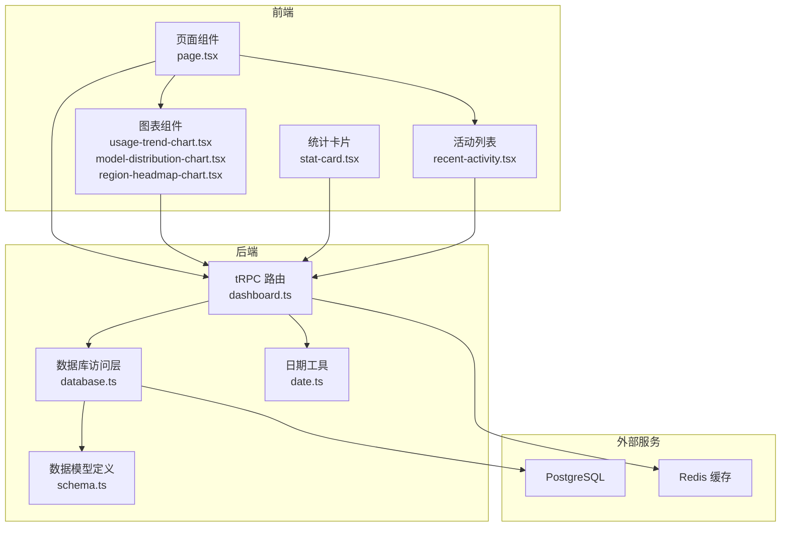
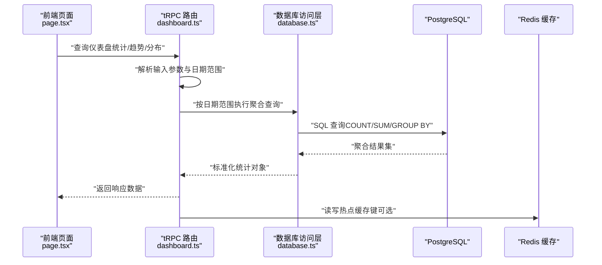
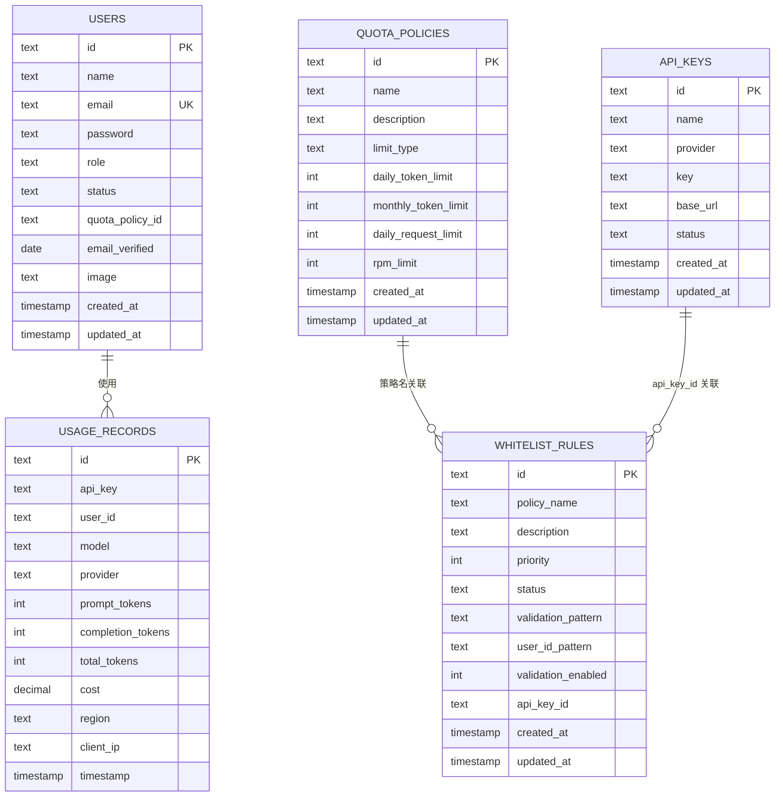
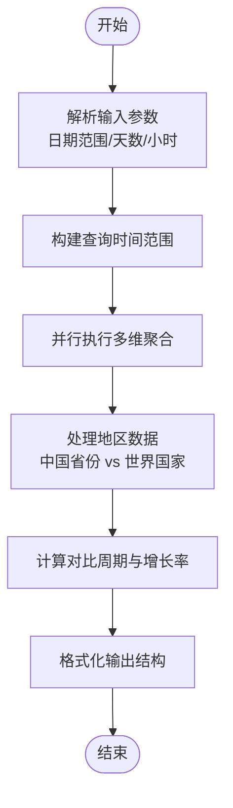
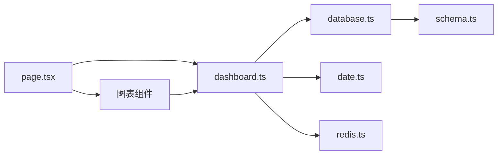

# 分析数据模型

<cite>
**本文引用的文件**
- [src/types/dashboard.ts](file://src/types/dashboard.ts)
- [src/lib/schema.ts](file://src/lib/schema.ts)
- [src/server/api/routers/dashboard.ts](file://src/server/api/routers/dashboard.ts)
- [src/lib/database.ts](file://src/lib/database.ts)
- [src/lib/date.ts](file://src/lib/date.ts)
- [src/app/(dashboard)/page.tsx](file://src/app/(dashboard)/page.tsx)
- [src/app/(dashboard)/components/stat-card.tsx](file://src/app/(dashboard)/components/stat-card.tsx)
- [src/app/(dashboard)/components/usage-trend-chart.tsx](file://src/app/(dashboard)/components/usage-trend-chart.tsx)
- [src/app/(dashboard)/components/model-distribution-chart.tsx](file://src/app/(dashboard)/components/model-distribution-chart.tsx)
- [src/app/(dashboard)/components/region-headmap-chart/index.tsx](file://src/app/(dashboard)/components/region-headmap-chart/index.tsx)
- [src/app/(dashboard)/components/region-headmap-chart/utils.ts](file://src/app/(dashboard)/components/region-headmap-chart/utils.ts)
- [src/app/(dashboard)/components/recent-activity.tsx](file://src/app/(dashboard)/components/recent-activity.tsx)
- [src/lib/redis.ts](file://src/lib/redis.ts)
- [src/lib/ip-region.ts](file://src/lib/ip-region.ts)
- [src/messages/zh.json](file://src/messages/zh.json)
- [src/messages/en.json](file://src/messages/en.json)
</cite>

## 更新摘要
**变更内容**
- 更新区域热力图图表组件，新增国家名称规范化和双向映射功能
- 增强世界地图显示逻辑，支持按国家级别聚合数据
- 添加国际化支持，实现中英文国家名称的动态转换
- 优化地区数据处理流程，支持中国省份和世界国家的统一映射

## 目录
1. [引言](#引言)
2. [项目结构](#项目结构)
3. [核心组件](#核心组件)
4. [架构概览](#架构概览)
5. [详细组件分析](#详细组件分析)
6. [依赖分析](#依赖分析)
7. [性能考虑](#性能考虑)
8. [故障排查指南](#故障排查指南)
9. [结论](#结论)
10. [附录](#附录)

## 引言
本文件围绕仪表板相关的数据模型与统计分析展开，系统性梳理数据类型定义、接口规范、业务模型、统计计算逻辑、聚合策略、数据关系映射、字段约束与验证规则，并给出查询接口设计思路、性能优化策略与缓存机制建议。同时覆盖数据生命周期管理、历史数据归档与统计维度扩展方向，帮助读者在不深入源码的情况下快速掌握整体实现。

**更新** 本次更新重点关注区域热力图图表的显著改进，包括国家名称规范化、双向映射功能和增强的国际化支持。

## 项目结构
本项目采用前后端分离的 Next.js 应用结构，仪表板功能由前端组件负责展示，后端通过 tRPC 提供受保护的查询接口，数据访问层基于 Drizzle ORM 与 PostgreSQL，部分配额与限流场景使用 Redis 缓存。

**图示来源**
- [src/app/(dashboard)/page.tsx](file://src/app/(dashboard)/page.tsx#L1-L243)
- [src/app/(dashboard)/components/usage-trend-chart.tsx](file://src/app/(dashboard)/components/usage-trend-chart.tsx#L1-L323)
- [src/app/(dashboard)/components/model-distribution-chart.tsx](file://src/app/(dashboard)/components/model-distribution-chart.tsx#L1-L147)
- [src/app/(dashboard)/components/region-headmap-chart/index.tsx](file://src/app/(dashboard)/components/region-headmap-chart/index.tsx#L1-L255)
- [src/app/(dashboard)/components/recent-activity.tsx](file://src/app/(dashboard)/components/recent-activity.tsx#L1-L53)
- [src/server/api/routers/dashboard.ts:1-606](file://src/server/api/routers/dashboard.ts#L1-L606)
- [src/lib/database.ts:1-692](file://src/lib/database.ts#L1-L692)
- [src/lib/schema.ts:1-162](file://src/lib/schema.ts#L1-L162)
- [src/lib/date.ts:1-17](file://src/lib/date.ts#L1-L17)
- [src/lib/redis.ts:1-43](file://src/lib/redis.ts#L1-L43)

**章节来源**
- [src/app/(dashboard)/page.tsx](file://src/app/(dashboard)/page.tsx#L1-L243)
- [src/server/api/routers/dashboard.ts:1-606](file://src/server/api/routers/dashboard.ts#L1-L606)
- [src/lib/database.ts:1-692](file://src/lib/database.ts#L1-L692)
- [src/lib/schema.ts:1-162](file://src/lib/schema.ts#L1-L162)
- [src/lib/date.ts:1-17](file://src/lib/date.ts#L1-L17)
- [src/lib/redis.ts:1-43](file://src/lib/redis.ts#L1-L43)

## 核心组件
- 数据类型定义：仪表板统计、活动项、趋势数据、模型分布等接口类型，统一了前端与后端的数据契约。
- 数据模型：基于 Drizzle ORM 的 PostgreSQL 表结构，涵盖用量记录、用户、API Key、配额策略、白名单规则等。
- 统计接口：tRPC 路由提供仪表盘统计、最近活动、使用趋势、地区分布、模型分布、最近 IP 请求等查询。
- 前端展示：统计卡片、趋势折线图、饼图、热力地图、活动列表等组件，负责可视化呈现。
- 辅助工具：日期工具函数用于日期归一化；数据库访问层封装常用查询与聚合。
- 缓存策略：Redis 键空间用于用户配额、请求次数、RPM、策略缓存等，提升热点读取性能。

**章节来源**
- [src/types/dashboard.ts:1-48](file://src/types/dashboard.ts#L1-L48)
- [src/lib/schema.ts:1-162](file://src/lib/schema.ts#L1-L162)
- [src/server/api/routers/dashboard.ts:1-606](file://src/server/api/routers/dashboard.ts#L1-L606)
- [src/app/(dashboard)/components/stat-card.tsx](file://src/app/(dashboard)/components/stat-card.tsx#L1-L76)
- [src/app/(dashboard)/components/usage-trend-chart.tsx](file://src/app/(dashboard)/components/usage-trend-chart.tsx#L1-L323)
- [src/app/(dashboard)/components/model-distribution-chart.tsx](file://src/app/(dashboard)/components/model-distribution-chart.tsx#L1-L147)
- [src/app/(dashboard)/components/region-headmap-chart/index.tsx](file://src/app/(dashboard)/components/region-headmap-chart/index.tsx#L1-L255)
- [src/app/(dashboard)/components/recent-activity.tsx](file://src/app/(dashboard)/components/recent-activity.tsx#L1-L53)
- [src/lib/date.ts:1-17](file://src/lib/date.ts#L1-L17)
- [src/lib/redis.ts:1-43](file://src/lib/redis.ts#L1-L43)

## 架构概览
仪表板数据流从前端发起日期范围与参数，tRPC 路由解析输入并调用数据库访问层执行聚合查询，返回标准化的统计结果，前端组件渲染图表与卡片。部分热点数据通过 Redis 缓存加速。

**图示来源**
- [src/app/(dashboard)/page.tsx](file://src/app/(dashboard)/page.tsx#L73-L107)
- [src/server/api/routers/dashboard.ts:11-196](file://src/server/api/routers/dashboard.ts#L11-L196)
- [src/lib/database.ts:191-216](file://src/lib/database.ts#L191-L216)
- [src/lib/redis.ts:18-42](file://src/lib/redis.ts#L18-L42)

## 详细组件分析

### 数据类型与接口规范
- 仪表板统计类型：包含总用户数、当日请求量、Token 消耗、活跃用户数，以及变化率与趋势方向。
- 活动项类型：描述最近事件，包含类型、描述、时间与可选详情（模型、提供商、Token、费用）。
- 趋势数据类型：按自然日聚合的请求次数与 Token 消耗。
- 模型分布类型：按模型聚合的 Token 消耗与请求次数。
- **区域分布类型**：新增 RegionDistributionItem 接口，包含地区名称、请求次数和 Token 消耗。

这些类型确保前后端一致的数据结构，便于组件消费与类型安全。

**章节来源**
- [src/types/dashboard.ts:1-48](file://src/types/dashboard.ts#L1-L48)
- [src/app/(dashboard)/components/region-headmap-chart/utils.ts](file://src/app/(dashboard)/components/region-headmap-chart/utils.ts#L318-L323)

### 数据模型与关系映射
- 用量记录表：记录每次调用的用户、模型、提供商、Prompt/Completion/Total Token、成本、区域、客户端 IP、时间戳。
- 用户表：用户标识、角色、状态、配额策略外键、邮箱唯一等。
- API Key 表：提供商、密钥、基础地址、状态、时间戳。
- 配额策略表：策略名称、描述、限制类型（Token/请求）、日/月限额、RPM 限制等。
- 白名单规则表：策略名、优先级、状态、校验模式、用户 ID 模式、关联 API Key 等。
- 关系：白名单规则通过策略名关联配额策略；账户与会话关联用户。

**图示来源**
- [src/lib/schema.ts:29-98](file://src/lib/schema.ts#L29-L98)

**章节来源**
- [src/lib/schema.ts:1-162](file://src/lib/schema.ts#L1-L162)

### 统计计算逻辑与聚合算法
- 仪表盘统计
  - 当前时段与对比时段并行查询：唯一用户数、请求数、Token 总消耗、活跃用户数。
  - 对比时段长度与当前时段一致，起止时间相对平移。
  - 增长率计算：若对比值大于 0，则按公式四舍五入取整；否则为 0。
  - 返回值包含数值、变化百分比与趋势方向。
- 最近活动
  - 支持按日期范围或最近 N 小时查询，取最新记录并映射为活动项。
- 使用趋势
  - 按自然日初始化空桶，遍历记录填充请求次数与 Token 求和，保证日期连续性。
- 地区分布
  - **更新** 按区域分组统计请求次数与 Token 消耗，支持中国省份和世界国家的双向映射。
  - 中国地图：过滤出中国省份数据，保持原始名称与 GeoJSON 匹配。
  - 世界地图：将所有地区统一映射到国家级别，按国家聚合请求次数和 Token 消耗。
- 模型分布
  - 按模型分组统计 Token 消耗与请求次数，并按 Token 消耗降序排序。
- 最近 IP 请求
  - 近期请求中筛选存在客户端 IP 的记录，按时间倒序取前若干条。

**图示来源**
- [src/server/api/routers/dashboard.ts:11-196](file://src/server/api/routers/dashboard.ts#L11-L196)
- [src/lib/date.ts:1-17](file://src/lib/date.ts#L1-L17)

**章节来源**
- [src/server/api/routers/dashboard.ts:11-196](file://src/server/api/routers/dashboard.ts#L11-L196)
- [src/lib/date.ts:1-17](file://src/lib/date.ts#L1-L17)

### 查询接口设计思路
- 输入参数
  - 日期范围：起止时间或预设区间（今日/昨日/7日/30日/自定义）。
  - 时间粒度：趋势与分布支持按天聚合。
  - 时间窗口：最近活动支持最近 N 小时。
- 输出结构
  - 统一的统计对象：数值、变化率、趋势方向、日期范围。
  - 图表数据：趋势按日期序列、分布按分类项。
  - **区域分布数据**：包含地区名称、请求次数、Token 消耗。
- 安全与鉴权
  - 使用受保护过程，确保仅认证用户可访问。
- 错误处理
  - 捕获异常并抛出统一错误，避免泄露内部细节。

**章节来源**
- [src/server/api/routers/dashboard.ts:11-196](file://src/server/api/routers/dashboard.ts#L11-L196)
- [src/app/(dashboard)/page.tsx](file://src/app/(dashboard)/page.tsx#L28-L66)

### 前端展示与交互
- 页面布局：日期选择器、统计卡片网格、趋势图、模型分布图、地区热力图、最近活动与 IP 请求列表。
- 组件职责
  - 统计卡片：格式化数值、变化率与趋势指示。
  - 趋势图：双轴折线图，支持深浅色主题切换。
  - 饼图：模型分布，支持按 Token 或请求次数切换。
  - **热力地图**：**更新** 支持中国地图和世界地图切换，实现国家名称规范化和双向映射。
  - 活动列表：骨架屏加载与空态提示。
- 日期范围联动：页面状态驱动多个查询，保持一致性。

**更新** 区域热力图组件现在支持：
- 中国地图：显示中国省份级别的请求分布
- 世界地图：显示国家级别的请求分布
- 国家名称规范化：支持中英文国家名称互转
- 双向映射：从地区名到国家名的智能映射
- 国际化支持：根据用户语言显示本地化国家名称

**章节来源**
- [src/app/(dashboard)/page.tsx](file://src/app/(dashboard)/page.tsx#L1-L243)
- [src/app/(dashboard)/components/stat-card.tsx](file://src/app/(dashboard)/components/stat-card.tsx#L1-L76)
- [src/app/(dashboard)/components/usage-trend-chart.tsx](file://src/app/(dashboard)/components/usage-trend-chart.tsx#L1-L323)
- [src/app/(dashboard)/components/model-distribution-chart.tsx](file://src/app/(dashboard)/components/model-distribution-chart.tsx#L1-L147)
- [src/app/(dashboard)/components/region-headmap-chart/index.tsx](file://src/app/(dashboard)/components/region-headmap-chart/index.tsx#L1-L255)
- [src/app/(dashboard)/components/recent-activity.tsx](file://src/app/(dashboard)/components/recent-activity.tsx#L1-L53)

### 国家名称规范化与双向映射功能

**新增功能** 区域热力图图表现在具备强大的国家名称规范化和双向映射功能：

#### 国家名称映射
- **中文到英文映射**：支持主要国家的中英文名称转换
- **映射范围**：覆盖亚洲、欧洲、美洲、大洋洲的主要国家
- **映射表结构**：使用 COUNTRY_NAME_MAP 记录中英文对应关系

#### 双向映射功能
- **地区到国家映射**：PROVINCE_TO_COUNTRY_MAP 支持州/省到国家的映射
- **美国各州映射**：支持中文州名和英文州名的双向转换
- **日本都道府县映射**：支持中文地名和英文地名的双向转换
- **其他国家映射**：支持英国、德国、法国、加拿大、澳大利亚等国家的地区映射

#### 国际化支持
- **本地化显示**：根据用户语言环境显示相应语言的国家名称
- **动态转换**：getLocalizedCountryName 函数实现中英文的动态转换
- **回退机制**：当找不到对应映射时，回退到原始名称

#### 数据处理逻辑
- **中国地图**：过滤出中国省份数据，保持原始名称与 GeoJSON 匹配
- **世界地图**：将所有地区统一映射到国家级别，按国家聚合数据
- **智能聚合**：normalizeToWorldMapRegion 函数实现智能的地区到国家映射

**章节来源**
- [src/app/(dashboard)/components/region-headmap-chart/utils.ts](file://src/app/(dashboard)/components/region-headmap-chart/utils.ts#L1-L323)
- [src/messages/zh.json:53-78](file://src/messages/zh.json#L53-L78)
- [src/messages/en.json:60-78](file://src/messages/en.json#L60-L78)

### 缓存机制与性能优化
- Redis 键空间
  - 用户每日配额使用量、用户每日请求次数、用户每分钟请求次数、用户配额策略缓存、API Key 配置缓存、按 API Key 获取配额策略、请求日志。
- 适用场景
  - 热点读取：用户策略、API Key 配额、RPM 限制。
  - 减少数据库压力：对高频查询结果进行短期缓存。
- 注意事项
  - 缓存键命名规范，过期策略与一致性维护。
  - 与数据库写入流程配合，必要时主动失效或更新。

**章节来源**
- [src/lib/redis.ts:18-42](file://src/lib/redis.ts#L18-L42)

## 依赖分析
- 组件耦合
  - 前端页面依赖 tRPC 客户端与各展示组件；组件间通过 props 传递数据与状态。
  - tRPC 路由依赖数据库访问层与日期工具；数据库访问层依赖 Drizzle 模型与 SQL。
- 外部依赖
  - PostgreSQL：持久化存储；Redis：缓存加速。
- 可能的循环依赖
  - 当前结构清晰，未见直接循环导入；若后续扩展，需避免路由与组件互相依赖。

**图示来源**
- [src/app/(dashboard)/page.tsx](file://src/app/(dashboard)/page.tsx#L1-L243)
- [src/server/api/routers/dashboard.ts:1-606](file://src/server/api/routers/dashboard.ts#L1-L606)
- [src/lib/database.ts:1-692](file://src/lib/database.ts#L1-L692)
- [src/lib/schema.ts:1-162](file://src/lib/schema.ts#L1-L162)
- [src/lib/date.ts:1-17](file://src/lib/date.ts#L1-L17)
- [src/lib/redis.ts:1-43](file://src/lib/redis.ts#L1-L43)

**章节来源**
- [src/app/(dashboard)/page.tsx](file://src/app/(dashboard)/page.tsx#L1-L243)
- [src/server/api/routers/dashboard.ts:1-606](file://src/server/api/routers/dashboard.ts#L1-L606)
- [src/lib/database.ts:1-692](file://src/lib/database.ts#L1-L692)
- [src/lib/schema.ts:1-162](file://src/lib/schema.ts#L1-L162)
- [src/lib/date.ts:1-17](file://src/lib/date.ts#L1-L17)
- [src/lib/redis.ts:1-43](file://src/lib/redis.ts#L1-L43)

## 性能考虑
- 并行查询
  - 仪表盘统计对多个聚合指标使用并行执行，显著降低等待时间。
- 日期归一化
  - 使用本地时区日期字符串，避免跨时区偏差导致的重复计算。
- 聚合策略
  - 使用数据库层面的 COUNT/SUM/GROUP BY，减少应用侧内存占用。
- 图表数据预处理
  - 趋势图按自然日初始化空桶，保证连续性与渲染稳定性。
- **区域数据优化**
  - **更新** 中国地图使用 CHINA_PROVINCES 集合进行快速过滤，提高性能。
  - 世界地图使用 Map 数据结构进行高效聚合，避免重复计算。
  - 国家名称映射使用预构建的映射表，减少运行时计算开销。
- 缓存热点
  - Redis 缓存策略与配额相关高频读取，降低数据库压力。
- 建议
  - 为用量记录表建立合适索引（时间戳、用户、区域等）以提升查询性能。
  - 对大范围查询增加分页或采样策略，避免一次性返回过多数据。

## 故障排查指南
- tRPC 查询异常
  - 检查输入参数是否合法（日期范围、小时/天数）；确认受保护过程是否正确鉴权。
- 数据库连接与权限
  - 确认数据库连接字符串与权限；检查表是否存在及字段类型是否匹配。
- Redis 连接错误
  - 检查环境变量与连接 URL；确认 Redis 服务可用且网络可达。
- 图表渲染问题
  - 检查 ECharts 实例销毁与重绘逻辑；确认数据为空时的占位显示。
- **区域热力图问题**
  - **更新** 检查地图数据加载是否成功，确认 CHINA_MAP_GEOJSON_URL 和 WORLD_MAP_GEOJSON_URL 可访问。
  - 验证国家名称映射表是否完整，检查 normalizeToWorldMapRegion 函数的映射逻辑。
  - 确认国际化配置是否正确，检查 getLocalizedCountryName 函数的语言切换。
- 日期与时区
  - 使用本地日期字符串避免 UTC 偏移；确保前端与后端日期处理一致。

**章节来源**
- [src/server/api/routers/dashboard.ts:192-195](file://src/server/api/routers/dashboard.ts#L192-L195)
- [src/lib/redis.ts:7-13](file://src/lib/redis.ts#L7-L13)
- [src/app/(dashboard)/components/usage-trend-chart.tsx](file://src/app/(dashboard)/components/usage-trend-chart.tsx#L36-L41)
- [src/lib/date.ts:3-10](file://src/lib/date.ts#L3-L10)

## 结论
本项目通过清晰的数据类型定义、严谨的统计计算与聚合策略、完善的前端可视化组件以及可扩展的缓存与数据库设计，实现了高效、易维护的仪表板分析能力。**更新** 特别是区域热力图图表的改进，通过国家名称规范化和双向映射功能，大大提升了国际用户的使用体验。建议在生产环境中进一步完善索引策略、缓存一致性与大范围查询的分页/采样方案，以持续提升性能与稳定性。

## 附录
- 字段约束与验证规则
  - 用户邮箱唯一；API Key 状态枚举；配额策略限制类型枚举；白名单规则状态枚举；提供商枚举。
- 数据生命周期与历史归档
  - 建议对用量记录按月/季度归档；保留近期活跃数据于热表，历史数据迁移至冷存储。
- 统计维度扩展
  - 可新增按提供商、模型版本、IP 归属、会话等维度的聚合视图；结合 Redis 缓存热点维度结果。
- **区域数据处理扩展**
  - **更新** 可扩展国家名称映射表，支持更多国家和地区。
  - 可添加更详细的地区到国家映射规则，支持更精确的地理数据聚合。
  - 可实现自定义地图数据的动态加载和缓存机制。

**章节来源**
- [src/lib/schema.ts:12-26](file://src/lib/schema.ts#L12-L26)
- [src/lib/schema.ts:29-98](file://src/lib/schema.ts#L29-L98)
- [src/app/(dashboard)/components/region-headmap-chart/utils.ts](file://src/app/(dashboard)/components/region-headmap-chart/utils.ts#L1-L323)