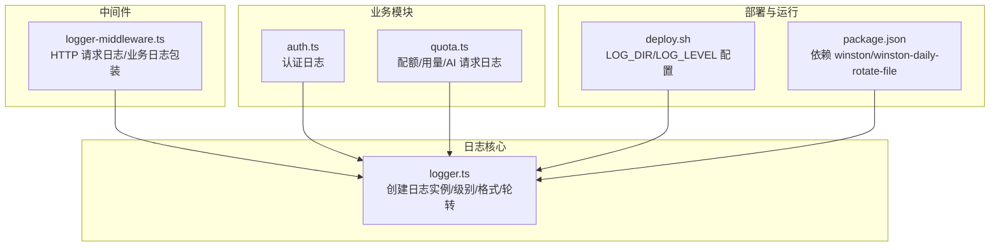
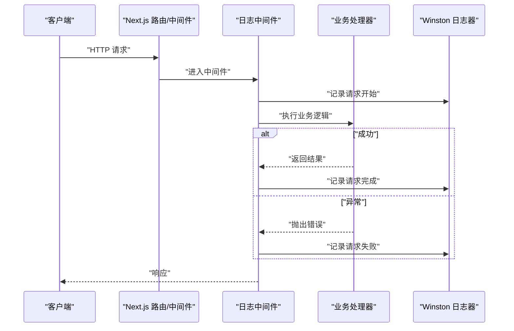
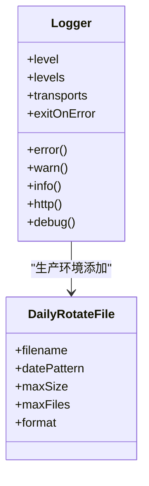
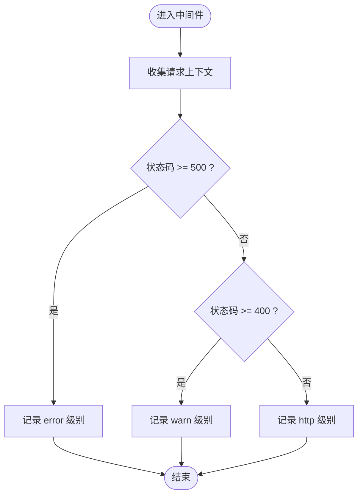
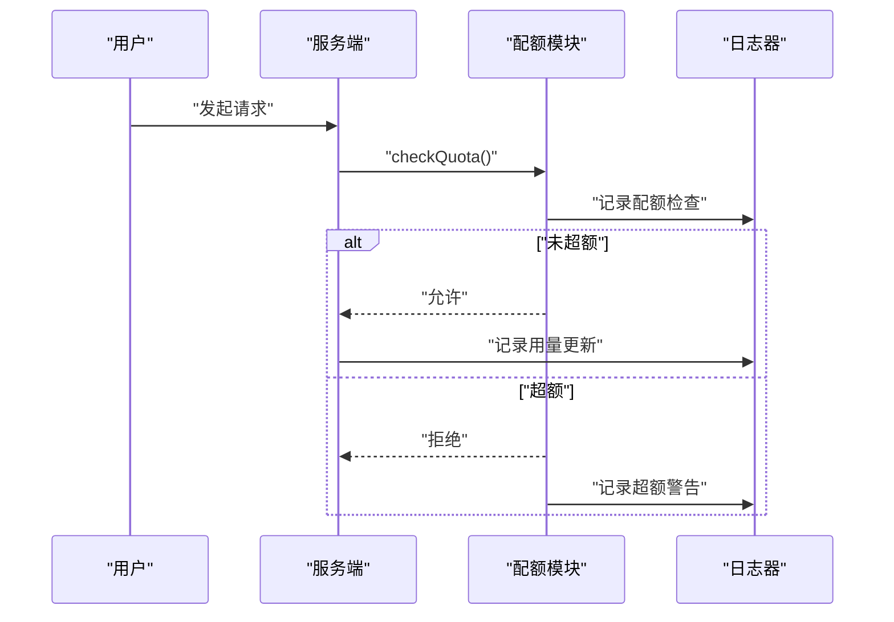
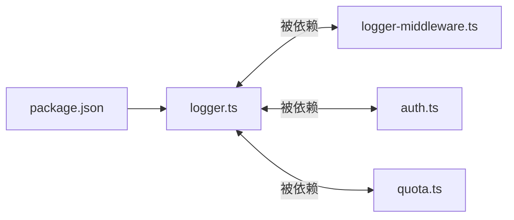

# 日志系统

<cite>
**本文引用的文件**
- [src/lib/logger.ts](file://src/lib/logger.ts)
- [src/lib/logger-middleware.ts](file://src/lib/logger-middleware.ts)
- [src/auth.ts](file://src/auth.ts)
- [src/lib/quota.ts](file://src/lib/quota.ts)
- [src/pages/api/trpc/[trpc].ts](file://src/pages/api/trpc/[trpc].ts)
- [deploy.sh](file://deploy.sh)
- [package.json](file://package.json)
</cite>

## 目录
1. [简介](#简介)
2. [项目结构](#项目结构)
3. [核心组件](#核心组件)
4. [架构总览](#架构总览)
5. [详细组件分析](#详细组件分析)
6. [依赖关系分析](#依赖关系分析)
7. [性能考量](#性能考量)
8. [故障排查指南](#故障排查指南)
9. [结论](#结论)
10. [附录](#附录)

## 简介
本文件系统性阐述本项目的日志体系，基于 Winston 的配置与使用，覆盖日志级别、输出格式与轮转策略；详解中间件日志记录的实现机制、请求跟踪与错误捕获；提供最佳实践、性能优化与存储策略建议；并给出日志分析方法、监控集成思路与故障排查技巧，以及不同环境下的配置差异与调试策略。

## 项目结构
日志系统主要由以下模块构成：
- 日志核心库：负责日志实例创建、级别与格式、轮转策略与导出便捷方法
- 中间件日志：封装 HTTP 请求日志与业务操作日志的统一入口
- 业务日志：在认证、配额与 AI 请求等关键路径中埋点
- 部署脚本：提供生产环境日志目录与级别的交互式配置

图表来源
- [src/lib/logger.ts](file://src/lib/logger.ts#L1-L184)
- [src/lib/logger-middleware.ts](file://src/lib/logger-middleware.ts#L1-L138)
- [src/auth.ts](file://src/auth.ts#L1-L114)
- [src/lib/quota.ts](file://src/lib/quota.ts#L1-L327)
- [deploy.sh](file://deploy.sh#L140-L192)
- [package.json](file://package.json#L65-L66)

章节来源
- [src/lib/logger.ts](file://src/lib/logger.ts#L1-L184)
- [src/lib/logger-middleware.ts](file://src/lib/logger-middleware.ts#L1-L138)
- [src/auth.ts](file://src/auth.ts#L1-L114)
- [src/lib/quota.ts](file://src/lib/quota.ts#L1-L327)
- [deploy.sh](file://deploy.sh#L140-L192)
- [package.json](file://package.json#L65-L66)

## 核心组件
- 日志级别与颜色
  - 定义了 error、warn、info、http、debug 五个级别，并为控制台输出注册颜色映射
  - 运行时根据 NODE_ENV 动态选择日志级别：开发环境为 debug，生产环境为 info
- 输出格式
  - 控制台格式：带时间戳、彩色级别与消息文本
  - 文件格式：带时间戳的 JSON 结构化输出
- 轮转策略
  - 开发环境仅输出到控制台
  - 生产环境启用按日期轮转的文件传输器：
    - 错误日志独立文件，保留 30 天
    - 综合日志独立文件，保留 30 天
    - HTTP 请求日志独立文件，保留 14 天
  - 单文件最大大小限制，避免磁盘占用无限增长
- 日志实例与便捷方法
  - 创建统一的 logger 实例，exitOnError 关闭以避免进程退出
  - 导出 logError/logWarn/logInfo/logDebug/logHttp 与业务专用方法（配额、AI 请求、认证）

章节来源
- [src/lib/logger.ts](file://src/lib/logger.ts#L5-L18)
- [src/lib/logger.ts](file://src/lib/logger.ts#L20-L42)
- [src/lib/logger.ts](file://src/lib/logger.ts#L44-L99)
- [src/lib/logger.ts](file://src/lib/logger.ts#L104-L183)

## 架构总览
下图展示日志系统在请求链路中的位置与调用关系：

图表来源
- [src/lib/logger-middleware.ts](file://src/lib/logger-middleware.ts#L32-L67)
- [src/lib/logger.ts](file://src/lib/logger.ts#L94-L99)

## 详细组件分析

### 日志核心（logger.ts）
- 设计要点
  - 通过自定义 levels 与 winston.addColors 实现彩色控制台输出
  - 控制台与文件分别采用不同格式，兼顾可读性与可解析性
  - 在生产环境启用 DailyRotateFile 传输器，按日期分割日志并设置保留策略
  - 通过 LOG_DIR 环境变量指定日志目录，默认为项目根目录下的 logs
- 性能与可靠性
  - exitOnError=false，避免日志异常导致进程退出
  - 文件轮转与大小限制防止磁盘膨胀
- 业务增强方法
  - 提供 logQuotaOperation、logAIRequest、logAuth 等业务级日志方法，统一字段结构与级别选择

图表来源
- [src/lib/logger.ts](file://src/lib/logger.ts#L47-L99)

章节来源
- [src/lib/logger.ts](file://src/lib/logger.ts#L1-L184)

### 中间件日志（logger-middleware.ts）
- HTTP 请求日志
  - 收集 method、url、pathname、statusCode、duration、userAgent、referer、ip 等上下文
  - 基于状态码选择级别：5xx 使用 error，4xx 使用 warn，2xx/3xx 使用 http
- 业务日志包装
  - withLogging 包裹异步处理器，自动记录“开始/完成/失败”三阶段日志
  - 失败时记录错误消息与堆栈，便于定位问题
- 业务日志辅助
  - 提供 logOperation、logQuotaOperation、logAIRequest、logAuth 等便捷方法，统一结构化字段

图表来源
- [src/lib/logger-middleware.ts](file://src/lib/logger-middleware.ts#L5-L29)

章节来源
- [src/lib/logger-middleware.ts](file://src/lib/logger-middleware.ts#L1-L138)

### 业务日志（认证、配额、AI 请求）
- 认证日志（auth.ts）
  - 在凭证缺失、尝试、成功、失败与异常场景记录结构化日志
  - 将敏感信息脱敏处理后写入日志，避免泄露
- 配额与用量日志（quota.ts）
  - 在策略获取、检查配额、记录用量、重置配额等关键节点写日志
  - 对超额场景使用 warn 级别，便于告警
  - 记录 AI 请求的 token 细节，便于成本与用量分析
- 日志字段约定
  - 统一包含 operation/action、userId、timestamp 等字段
  - 业务方法内部对元数据进行合并，保证日志一致性

图表来源
- [src/lib/quota.ts](file://src/lib/quota.ts#L78-L200)
- [src/lib/logger.ts](file://src/lib/logger.ts#L125-L183)

章节来源
- [src/auth.ts](file://src/auth.ts#L14-L80)
- [src/lib/quota.ts](file://src/lib/quota.ts#L1-L327)

### 部署与环境配置（deploy.sh）
- 生产环境日志配置
  - 交互式输入 LOG_DIR 与 LOG_LEVEL，便于在部署时定制日志目录与级别
  - 保存至环境变量文件，确保容器或服务器启动时生效
- 注意事项
  - LOG_DIR 必须具备写权限
  - LOG_LEVEL 建议在生产环境设为 info 或更高，减少冗余日志

章节来源
- [deploy.sh](file://deploy.sh#L140-L192)

## 依赖关系分析
- 组件耦合
  - logger-middleware.ts 依赖 logger.ts 提供统一日志能力
  - 业务模块（auth.ts、quota.ts）直接依赖 logger.ts 的便捷方法
- 外部依赖
  - winston 与 winston-daily-rotate-file 由 package.json 管理版本
- 潜在风险
  - 若未正确设置 LOG_DIR，生产环境将无法写入文件
  - 过高的日志级别会增加 IO 压力，过低则影响排障效率

图表来源
- [src/lib/logger.ts](file://src/lib/logger.ts#L1-L3)
- [src/lib/logger-middleware.ts](file://src/lib/logger-middleware.ts#L1-L2)
- [src/auth.ts](file://src/auth.ts#L1-L4)
- [src/lib/quota.ts](file://src/lib/quota.ts#L1-L6)
- [package.json](file://package.json#L65-L66)

章节来源
- [package.json](file://package.json#L65-L66)

## 性能考量
- 日志级别
  - 开发环境使用 debug 便于调试；生产环境使用 info，降低 IO 压力
- 输出格式
  - 控制台格式提升本地可观测性；文件格式采用 JSON，利于下游日志平台解析
- 轮转与保留
  - 按日期轮转与大小限制，避免单文件过大；合理设置保留天数平衡存储与检索需求
- 异步与非阻塞
  - Winston 默认异步写入，结合 exitOnError=false，避免阻塞业务线程
- 建议
  - 对高频接口使用 http 级别，错误与异常使用 error/warn，避免过多 info 带来的 IO 压力
  - 在高并发场景下，尽量减少大对象序列化开销，必要时对元数据做裁剪

## 故障排查指南
- 常见问题
  - 生产环境无日志文件：检查 LOG_DIR 是否存在且具备写权限
  - 日志过多导致磁盘爆满：调整 LOG_LEVEL、maxSize、maxFiles 或清理历史
  - 排障困难：确认是否使用了 withLogging 包裹关键流程，确保“开始/完成/失败”三段日志齐全
- 定位步骤
  - 查看对应日期的 combined/error/http 文件，结合状态码与耗时定位问题
  - 对认证失败与配额超额场景，优先查看 warn/error 级别的日志
  - 对异常堆栈，优先查看失败阶段日志中的 stack 字段
- 工具建议
  - 使用日志平台（如 ELK/Cloud Logging）聚合 JSON 日志，建立查询与告警规则
  - 对关键接口建立 SLA 告警（如 5xx 比例、P95/P99 延迟）

章节来源
- [src/lib/logger.ts](file://src/lib/logger.ts#L55-L91)
- [src/lib/logger-middleware.ts](file://src/lib/logger-middleware.ts#L32-L67)

## 结论
本项目以 Winston 为核心构建了结构化的日志体系：清晰的日志级别与格式、可靠的按日轮转策略、完善的中间件与业务埋点。通过合理的环境配置与性能优化，既能满足开发调试需求，也能支撑生产环境的可观测性与可维护性。建议在实际落地中配合日志平台与告警策略，持续优化日志质量与成本。

## 附录

### 日志级别与建议
- error：严重错误、异常
- warn：潜在问题、配额超额
- info：常规业务事件、操作完成
- http：HTTP 请求轨迹
- debug：开发调试细节

章节来源
- [src/lib/logger.ts](file://src/lib/logger.ts#L5-L12)
- [src/lib/logger-middleware.ts](file://src/lib/logger-middleware.ts#L21-L28)

### 输出格式与字段约定
- 控制台：含时间戳、级别、消息
- 文件（JSON）：含时间戳、消息、状态码、耗时、用户代理、来源、IP、用户标识等
- 业务日志：统一包含 operation/action、userId、timestamp 等字段

章节来源
- [src/lib/logger.ts](file://src/lib/logger.ts#L31-L42)
- [src/lib/logger-middleware.ts](file://src/lib/logger-middleware.ts#L9-L19)
- [src/lib/quota.ts](file://src/lib/quota.ts#L125-L183)

### 轮转策略与存储建议
- 错误日志：保留 30 天，适合长期审计
- 综合日志：保留 30 天，便于跨模块关联分析
- HTTP 日志：保留 14 天，平衡容量与请求追踪
- 存储：建议将 LOG_DIR 挂载到持久化卷，定期清理过期日志

章节来源
- [src/lib/logger.ts](file://src/lib/logger.ts#L55-L91)

### 不同环境下的配置差异
- 开发环境
  - 日志级别：debug
  - 输出：仅控制台
- 生产环境
  - 日志级别：info
  - 输出：控制台 + 文件轮转
  - 通过 deploy.sh 交互式配置 LOG_DIR 与 LOG_LEVEL

章节来源
- [src/lib/logger.ts](file://src/lib/logger.ts#L14-L18)
- [src/lib/logger.ts](file://src/lib/logger.ts#L55-L91)
- [deploy.sh](file://deploy.sh#L140-L192)

### 监控集成与分析
- 建议
  - 将 JSON 日志接入日志平台，建立查询面板与告警规则
  - 对 5xx、超时、配额超额、认证失败等事件建立专项告警
  - 基于日志统计接口吞吐、错误率、P95/P99 延迟等指标
- 分析维度
  - 按接口、状态码、用户、来源 IP、模型/提供商等维度聚合分析

章节来源
- [src/lib/logger.ts](file://src/lib/logger.ts#L38-L42)
- [src/lib/logger-middleware.ts](file://src/lib/logger-middleware.ts#L21-L28)
- [src/lib/quota.ts](file://src/lib/quota.ts#L103-L156)