# 监控与分析

<cite>
**本文引用的文件**
- [src/app/(dashboard)/page.tsx](file://src/app/(dashboard)/page.tsx)
- [src/app/(dashboard)/components/usage-trend-chart.tsx](file://src/app/(dashboard)/components/usage-trend-chart.tsx)
- [src/app/(dashboard)/components/model-distribution-chart.tsx](file://src/app/(dashboard)/components/model-distribution-chart.tsx)
- [src/app/(dashboard)/components/region-heatmap-chart.tsx](file://src/app/(dashboard)/components/region-heatmap-chart.tsx)
- [src/app/(dashboard)/components/stat-card.tsx](file://src/app/(dashboard)/components/stat-card.tsx)
- [src/app/(dashboard)/components/recent-activity.tsx](file://src/app/(dashboard)/components/recent-activity.tsx)
- [src/app/(dashboard)/components/recent-ip-requests.tsx](file://src/app/(dashboard)/components/recent-ip-requests.tsx)
- [src/server/api/routers/dashboard.ts](file://src/server/api/routers/dashboard.ts)
- [src/lib/database.ts](file://src/lib/database.ts)
- [src/lib/schema.ts](file://src/lib/schema.ts)
- [src/types/dashboard.ts](file://src/types/dashboard.ts)
- [src/lib/logger.ts](file://src/lib/logger.ts)
- [src/lib/ip-region.ts](file://src/lib/ip-region.ts)
- [package.json](file://package.json)
- [README.md](file://README.md)
</cite>

## 目录
1. [简介](#简介)
2. [项目结构](#项目结构)
3. [核心组件](#核心组件)
4. [架构总览](#架构总览)
5. [详细组件分析](#详细组件分析)
6. [依赖关系分析](#依赖关系分析)
7. [性能考量](#性能考量)
8. [故障排查指南](#故障排查指南)
9. [结论](#结论)
10. [附录](#附录)

## 简介
本文件面向 AIGate 监控与分析系统，围绕仪表板功能、图表组件与数据分析能力展开，系统性说明实时监控指标的采集、处理与展示机制；解释趋势图、分布图、统计卡片等组件的实现原理与配置要点；给出监控数据的存储策略、查询优化与性能建议；并提供日志系统的配置与使用指南。

## 项目结构
AIGate 采用 Next.js App Router + tRPC + Drizzle ORM 的前后端分离架构，监控与分析模块主要位于仪表板页面与后端 dashboard 路由中，数据通过 tRPC 查询接口返回，前端使用 ECharts 渲染图表，日志系统基于 Winston 输出到文件或控制台。

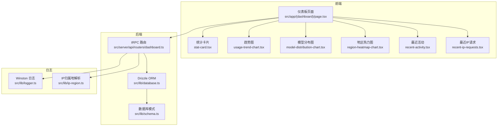

**图表来源**
- [src/app/(dashboard)/page.tsx](file://src/app/(dashboard)/page.tsx#L1-L228)
- [src/app/(dashboard)/components/usage-trend-chart.tsx](file://src/app/(dashboard)/components/usage-trend-chart.tsx#L1-L323)
- [src/app/(dashboard)/components/model-distribution-chart.tsx](file://src/app/(dashboard)/components/model-distribution-chart.tsx#L1-L147)
- [src/app/(dashboard)/components/region-heatmap-chart.tsx](file://src/app/(dashboard)/components/region-heatmap-chart.tsx#L1-L175)
- [src/app/(dashboard)/components/stat-card.tsx](file://src/app/(dashboard)/components/stat-card.tsx#L1-L76)
- [src/app/(dashboard)/components/recent-activity.tsx](file://src/app/(dashboard)/components/recent-activity.tsx#L1-L53)
- [src/app/(dashboard)/components/recent-ip-requests.tsx](file://src/app/(dashboard)/components/recent-ip-requests.tsx#L1-L225)
- [src/server/api/routers/dashboard.ts](file://src/server/api/routers/dashboard.ts#L1-L454)
- [src/lib/database.ts](file://src/lib/database.ts#L1-L692)
- [src/lib/schema.ts](file://src/lib/schema.ts#L1-L162)
- [src/lib/logger.ts](file://src/lib/logger.ts#L1-L184)
- [src/lib/ip-region.ts](file://src/lib/ip-region.ts#L1-L101)

**章节来源**
- [src/app/(dashboard)/page.tsx](file://src/app/(dashboard)/page.tsx#L1-L228)
- [src/server/api/routers/dashboard.ts](file://src/server/api/routers/dashboard.ts#L1-L454)
- [src/lib/database.ts](file://src/lib/database.ts#L1-L692)
- [src/lib/schema.ts](file://src/lib/schema.ts#L1-L162)
- [src/lib/logger.ts](file://src/lib/logger.ts#L1-L184)
- [src/lib/ip-region.ts](file://src/lib/ip-region.ts#L1-L101)
- [package.json](file://package.json#L1-L90)
- [README.md](file://README.md#L1-L83)

## 核心组件
- 仪表板页面：聚合统计卡片、趋势图、模型分布图、地区热力图、最近活动与最近 IP 请求列表。
- tRPC dashboard 路由：提供 getStats、getUsageTrend、getModelDistribution、getRegionDistribution、getRecentActivity、getRecentIpRequests 等查询接口。
- 数据层：Drizzle ORM + PostgreSQL，封装 usageRecords、users、apiKeys、quotaPolicies、whitelistRules 等表的读写与聚合查询。
- 图表组件：ECharts 渲染，支持主题适配、响应式布局、数据格式化与交互提示。
- 日志系统：Winston + Daily Rotate File，按级别与日期轮转输出，支持 HTTP、配额、认证等专项日志。

**章节来源**
- [src/app/(dashboard)/page.tsx](file://src/app/(dashboard)/page.tsx#L1-L228)
- [src/server/api/routers/dashboard.ts](file://src/server/api/routers/dashboard.ts#L1-L454)
- [src/lib/database.ts](file://src/lib/database.ts#L144-L278)
- [src/lib/schema.ts](file://src/lib/schema.ts#L54-L83)
- [src/app/(dashboard)/components/usage-trend-chart.tsx](file://src/app/(dashboard)/components/usage-trend-chart.tsx#L1-L323)
- [src/lib/logger.ts](file://src/lib/logger.ts#L1-L184)

## 架构总览
监控与分析的数据流从前端仪表板发起日期范围选择与查询请求，tRPC 路由调用数据库层聚合统计，返回结构化数据给各图表组件渲染；同时在关键路径上记录日志，便于问题定位与审计。

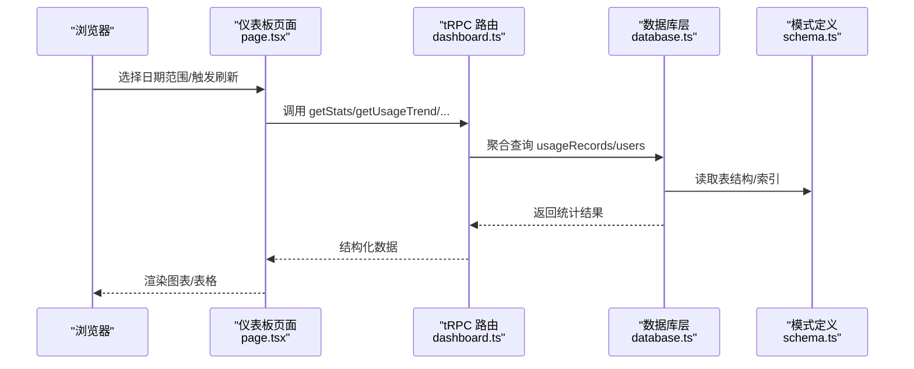

**图表来源**
- [src/app/(dashboard)/page.tsx](file://src/app/(dashboard)/page.tsx#L69-L103)
- [src/server/api/routers/dashboard.ts](file://src/server/api/routers/dashboard.ts#L11-L196)
- [src/lib/database.ts](file://src/lib/database.ts#L191-L216)
- [src/lib/schema.ts](file://src/lib/schema.ts#L54-L68)

## 详细组件分析

### 仪表板页面与数据流
- 日期范围选择：支持 today/yesterday/7days/30days/custom，计算起止时间并传递给查询。
- 统计卡片：展示总用户数、请求数、Token 消耗、活跃用户，支持趋势方向与变化百分比。
- 图表区域：趋势图（请求数/Token）、模型分布（Token占比/请求次数占比）、地区热力图（中国地图）。
- 最近活动与最近 IP 请求：表格+分页，支持时间相对化显示。

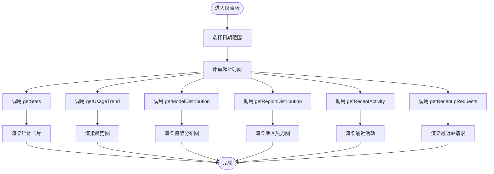

**图表来源**
- [src/app/(dashboard)/page.tsx](file://src/app/(dashboard)/page.tsx#L17-L103)

**章节来源**
- [src/app/(dashboard)/page.tsx](file://src/app/(dashboard)/page.tsx#L15-L228)

### 统计卡片组件（StatCard）
- 功能：展示数值、变化趋势与图标，支持加载态骨架屏。
- 特性：千/百万值格式化、正负趋势颜色、悬停动画效果。
- 适用场景：总用户数、请求数、Token 消耗、活跃用户。

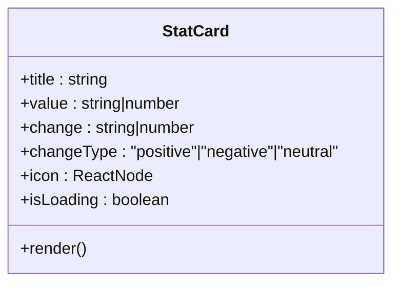

**图表来源**
- [src/app/(dashboard)/components/stat-card.tsx](file://src/app/(dashboard)/components/stat-card.tsx#L5-L12)

**章节来源**
- [src/app/(dashboard)/components/stat-card.tsx](file://src/app/(dashboard)/components/stat-card.tsx#L1-L76)

### 趋势图组件（UsageTrendChart）
- 功能：双轴折线图，左侧请求数、右侧 Token 消耗，平滑曲线+面积填充。
- 主题适配：深浅色自动切换，tooltip/网格/坐标轴颜色随主题变化。
- 响应式：窗口 resize 自适应，首次渲染初始化 ECharts 实例。

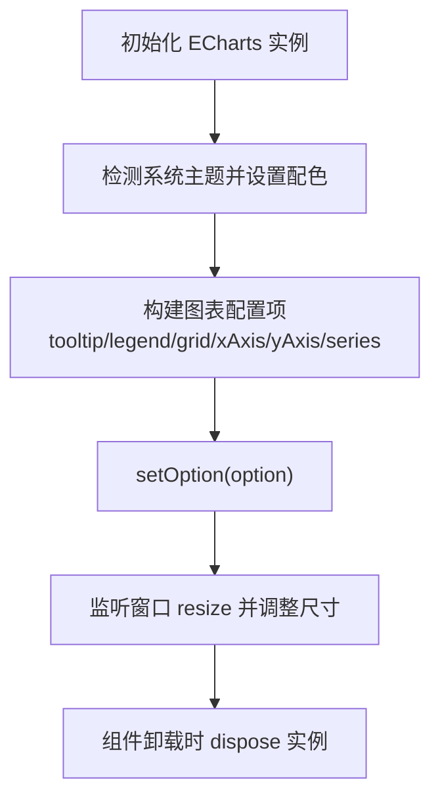

**图表来源**
- [src/app/(dashboard)/components/usage-trend-chart.tsx](file://src/app/(dashboard)/components/usage-trend-chart.tsx#L33-L302)

**章节来源**
- [src/app/(dashboard)/components/usage-trend-chart.tsx](file://src/app/(dashboard)/components/usage-trend-chart.tsx#L1-L323)

### 模型分布图组件（ModelDistributionChart）
- 功能：饼图展示 Token 消耗占比与请求次数占比，支持 Tab 切换。
- 交互：tooltip 展示模型名、请求次数、Token 消耗与占比；标签格式化百分比。

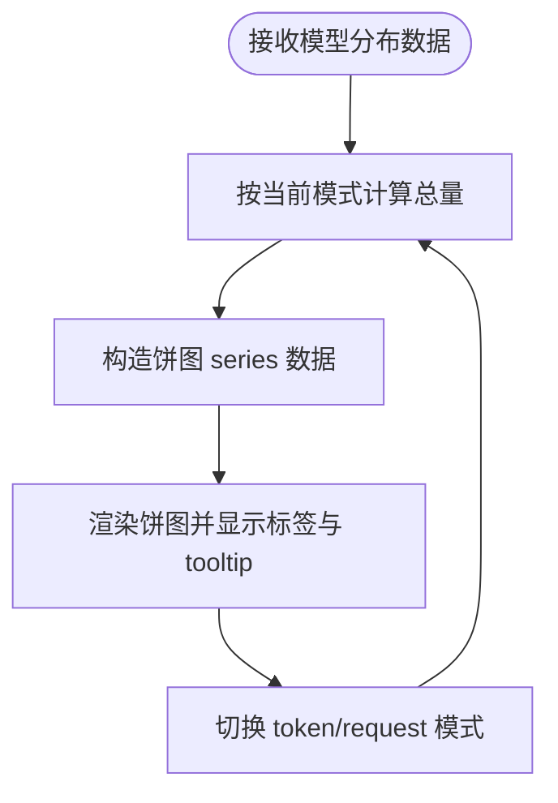

**图表来源**
- [src/app/(dashboard)/components/model-distribution-chart.tsx](file://src/app/(dashboard)/components/model-distribution-chart.tsx#L28-L115)

**章节来源**
- [src/app/(dashboard)/components/model-distribution-chart.tsx](file://src/app/(dashboard)/components/model-distribution-chart.tsx#L1-L147)

### 地区热力图组件（RegionHeatmapChart）
- 功能：中国地图热力图，按请求次数着色，支持 tooltip 展示请求次数与 Token。
- 地图加载：异步注册中国地图 GeoJSON，失败/加载中状态提示。
- 视觉映射：最大值驱动 visualMap，颜色梯度表示密度。

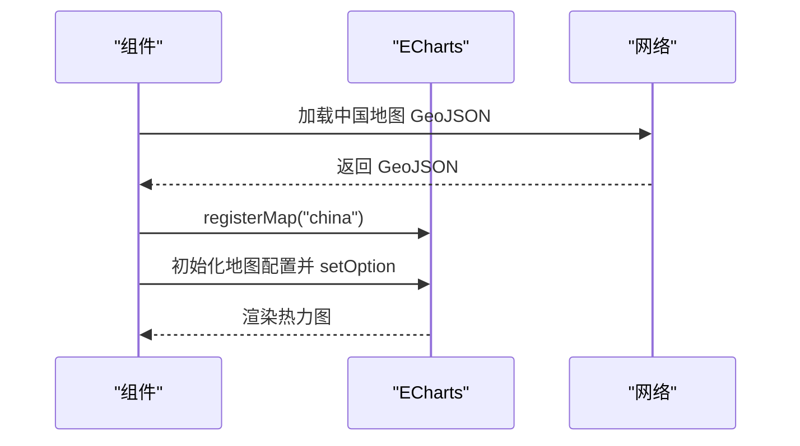

**图表来源**
- [src/app/(dashboard)/components/region-heatmap-chart.tsx](file://src/app/(dashboard)/components/region-heatmap-chart.tsx#L26-L150)

**章节来源**
- [src/app/(dashboard)/components/region-heatmap-chart.tsx](file://src/app/(dashboard)/components/region-heatmap-chart.tsx#L1-L175)

### 最近活动与最近 IP 请求
- 最近活动：列表渲染，支持加载态与空态；每条活动包含类型、描述、时间与详情。
- 最近 IP 请求：表格展示 IP、归属地、用户、模型、Token、时间；支持分页与“相对时间”显示。

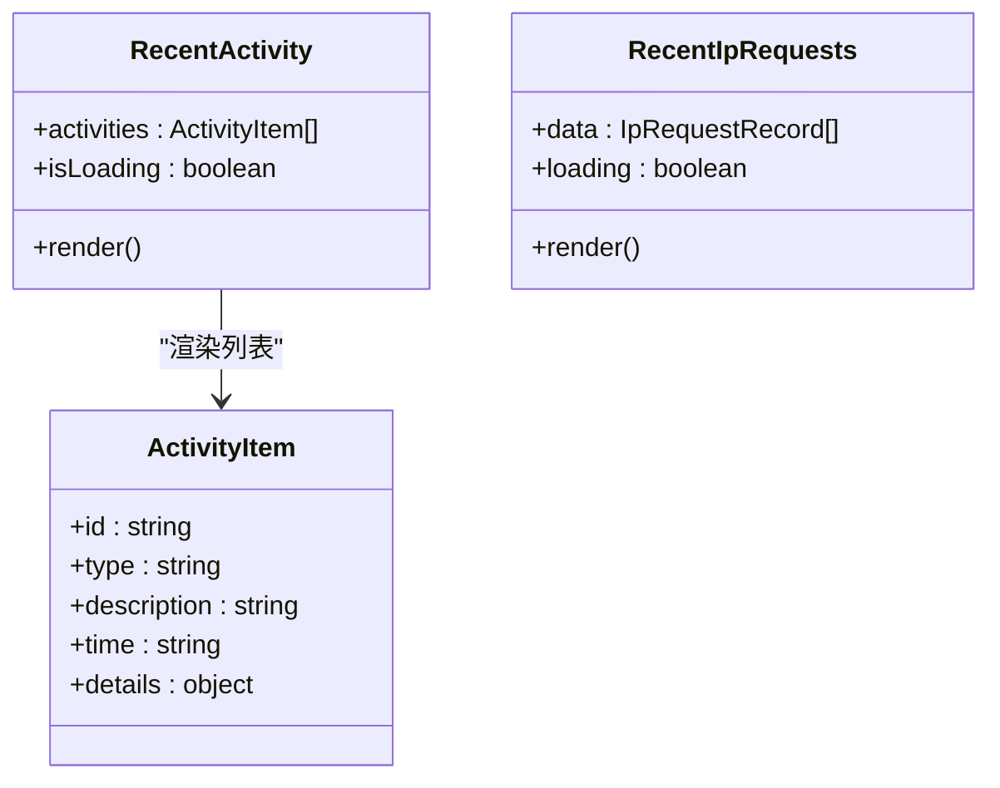

**图表来源**
- [src/app/(dashboard)/components/recent-activity.tsx](file://src/app/(dashboard)/components/recent-activity.tsx#L12-L23)
- [src/app/(dashboard)/components/recent-ip-requests.tsx](file://src/app/(dashboard)/components/recent-ip-requests.tsx#L31-L70)

**章节来源**
- [src/app/(dashboard)/components/recent-activity.tsx](file://src/app/(dashboard)/components/recent-activity.tsx#L1-L53)
- [src/app/(dashboard)/components/recent-ip-requests.tsx](file://src/app/(dashboard)/components/recent-ip-requests.tsx#L1-L225)

### 后端 dashboard 路由与数据聚合
- getStats：按日期范围统计总用户数、请求数、Token 消耗、活跃用户，并计算对比周期的增长率。
- getUsageTrend：按自然日聚合请求数与 Token，支持自定义天数与日期范围。
- getModelDistribution：按模型聚合 Token 与请求次数，降序排列。
- getRegionDistribution：按 region 聚合请求次数与 Token，过滤空值。
- getRecentActivity：按时间倒序返回最近记录，用于活动面板。
- getRecentIpRequests：返回最近 IP 请求记录，含用户、模型、Token、时间等。

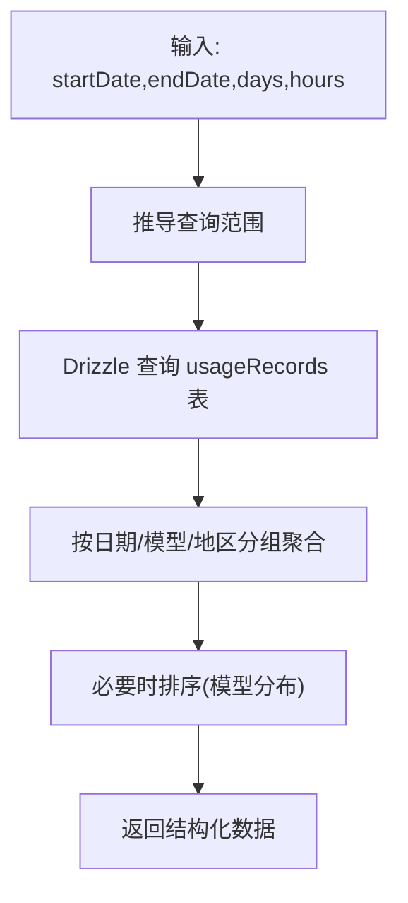

**图表来源**
- [src/server/api/routers/dashboard.ts](file://src/server/api/routers/dashboard.ts#L11-L196)
- [src/server/api/routers/dashboard.ts](file://src/server/api/routers/dashboard.ts#L246-L306)
- [src/server/api/routers/dashboard.ts](file://src/server/api/routers/dashboard.ts#L399-L452)

**章节来源**
- [src/server/api/routers/dashboard.ts](file://src/server/api/routers/dashboard.ts#L1-L454)

### 数据模型与存储策略
- usageRecords：用量记录主表，包含用户、模型、提供商、Token、地区、客户端 IP、时间戳等字段。
- users：用户表，与用量记录建立关联。
- apiKeys/quotaPolicies/whitelistRules：与配额与白名单相关，支撑用量统计与策略匹配。
- 存储策略：PostgreSQL 作为主存储，Drizzle ORM 提供类型安全访问；图表所需聚合数据在路由层一次性查询并返回，减少前端多次请求。

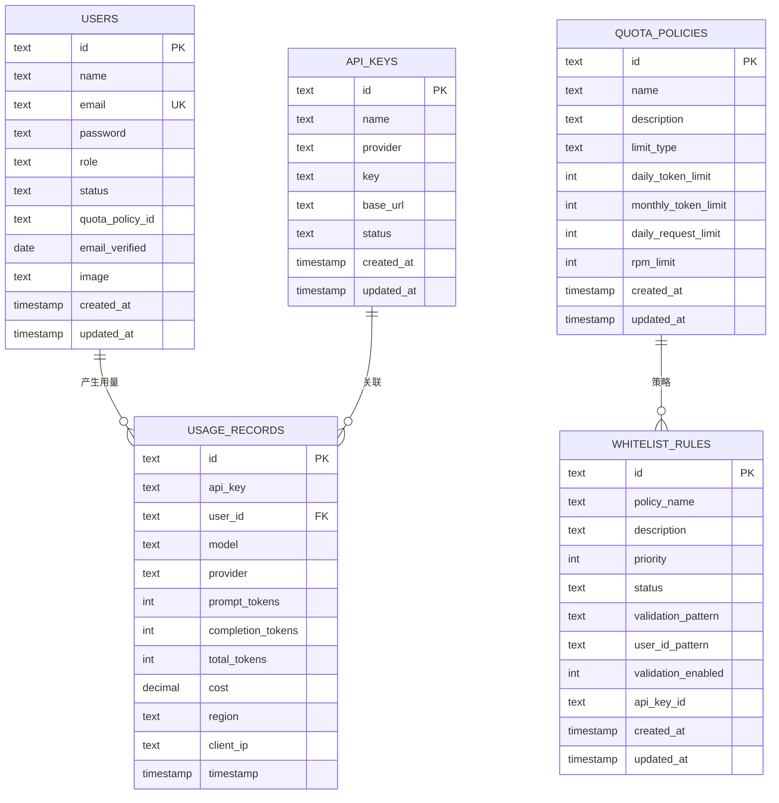

**图表来源**
- [src/lib/schema.ts](file://src/lib/schema.ts#L54-L98)
- [src/lib/database.ts](file://src/lib/database.ts#L144-L278)

**章节来源**
- [src/lib/schema.ts](file://src/lib/schema.ts#L1-L162)
- [src/lib/database.ts](file://src/lib/database.ts#L1-L692)

### 日志系统配置与使用
- 日志级别：开发环境 debug，生产环境 info；可通过环境变量控制。
- 输出目标：控制台彩色输出；生产环境按日期轮转输出 error/combined/http 三类文件。
- 便捷方法：logError/logWarn/logInfo/logDebug/logHttp；以及配额、AI 请求、认证专项日志。
- IP 归属地：提供从 HTTP 请求提取客户端 IP 与查询省份的能力，用于地区分布统计。

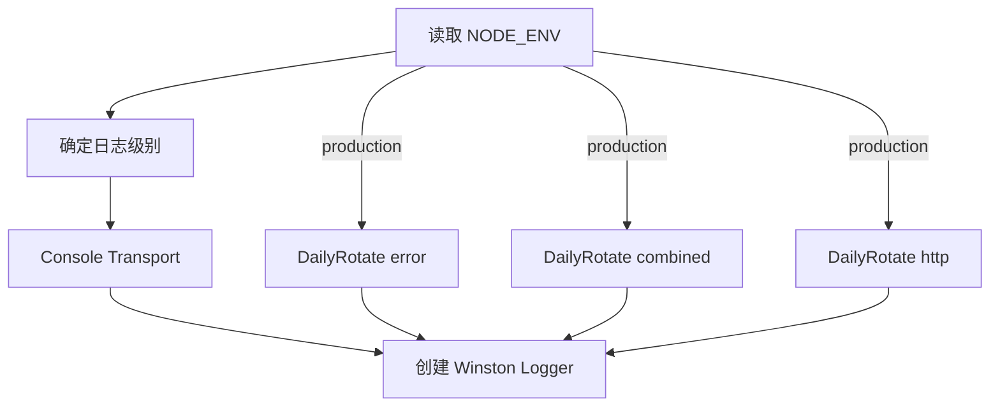

**图表来源**
- [src/lib/logger.ts](file://src/lib/logger.ts#L14-L99)

**章节来源**
- [src/lib/logger.ts](file://src/lib/logger.ts#L1-L184)
- [src/lib/ip-region.ts](file://src/lib/ip-region.ts#L1-L101)

## 依赖关系分析
- 前端依赖：ECharts 用于可视化；tRPC 客户端与 React Query 用于数据获取与缓存；Tailwind CSS 与 shadcn/ui 用于 UI 组件。
- 后端依赖：Drizzle ORM + PostgreSQL；Zod 用于输入校验；Winston 用于日志。
- 仪表板页面通过 tRPC 调用 dashboard 路由，路由层使用 Drizzle ORM 与 schema 定义进行查询与聚合。

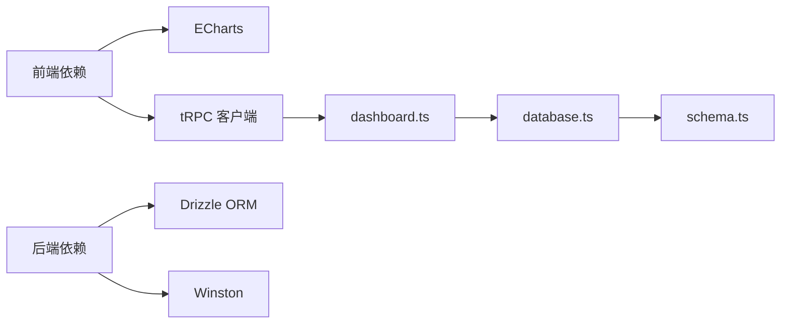

**图表来源**
- [package.json](file://package.json#L18-L67)
- [src/server/api/routers/dashboard.ts](file://src/server/api/routers/dashboard.ts#L1-L7)
- [src/lib/database.ts](file://src/lib/database.ts#L1-L3)
- [src/lib/schema.ts](file://src/lib/schema.ts#L1-L10)

**章节来源**
- [package.json](file://package.json#L1-L90)
- [src/server/api/routers/dashboard.ts](file://src/server/api/routers/dashboard.ts#L1-L454)
- [src/lib/database.ts](file://src/lib/database.ts#L1-L692)
- [src/lib/schema.ts](file://src/lib/schema.ts#L1-L162)

## 性能考量
- 查询优化
  - 使用 Drizzle ORM 的原生聚合函数（count、sum、distinct）减少应用侧计算。
  - 对时间范围查询使用 gte/lte 条件，确保索引命中。
  - 在 dashboard 路由中使用 Promise.all 并行执行多个聚合查询，降低 RTT。
- 前端渲染
  - ECharts 实例复用与 dispose 管理，避免重复渲染导致的内存泄漏。
  - 图表配置按主题动态生成，减少样式计算开销。
- 数据存储
  - usageRecords 表包含 timestamp、user_id、model、provider、region、client_ip 等字段，建议在高频查询字段上建立索引（如 timestamp、user_id、region）以提升聚合查询性能。
- 日志
  - 生产环境按日期轮转，避免单文件过大；仅记录必要字段，减少 IO 压力。

[本节为通用性能建议，不直接分析特定文件，故无“章节来源”]

## 故障排查指南
- 图表不显示或空白
  - 检查数据是否为空或 loading 状态未结束；确认 ECharts 实例已正确初始化与销毁。
  - 地图组件需等待地图数据加载成功，若失败会显示错误提示。
- 仪表板数据异常
  - 核对日期范围参数是否正确；确认 tRPC 输入校验通过。
  - 检查数据库连接与权限，确认 usageRecords 表存在且有数据。
- 日志问题
  - 确认 NODE_ENV 与 LOG_DIR 环境变量；查看对应日志文件是否存在与权限是否正确。
  - 若 HTTP 日志缺失，检查请求是否被中间件拦截或路由未命中。

**章节来源**
- [src/app/(dashboard)/components/region-heatmap-chart.tsx](file://src/app/(dashboard)/components/region-heatmap-chart.tsx#L26-L59)
- [src/server/api/routers/dashboard.ts](file://src/server/api/routers/dashboard.ts#L11-L196)
- [src/lib/logger.ts](file://src/lib/logger.ts#L44-L99)

## 结论
AIGate 监控与分析系统通过清晰的前后端职责划分与类型安全的 tRPC 接口，实现了仪表板的高效数据展示。ECharts 图表组件覆盖趋势、分布与地理可视化，配合 Drizzle ORM 的聚合查询与 Winston 日志体系，满足了实时监控、性能优化与运维可观测性的需求。后续可在高频字段建立索引、引入缓存层与更细粒度的指标埋点，进一步提升系统性能与可维护性。

[本节为总结性内容，不直接分析特定文件，故无“章节来源”]

## 附录
- 术语
  - 用量记录：一次 AI 请求产生的用户、模型、Token、地区、IP、时间等信息。
  - 趋势图：按自然日聚合的请求数与 Token 消耗折线图。
  - 分布图：按模型或地区聚合的占比饼图。
  - 统计卡片：关键指标的数值与趋势展示。
- 常用命令
  - 数据库迁移与种子：db:migrate、db:seed。
  - 开发与构建：dev、build、start。

**章节来源**
- [README.md](file://README.md#L14-L83)
- [package.json](file://package.json#L13-L16)