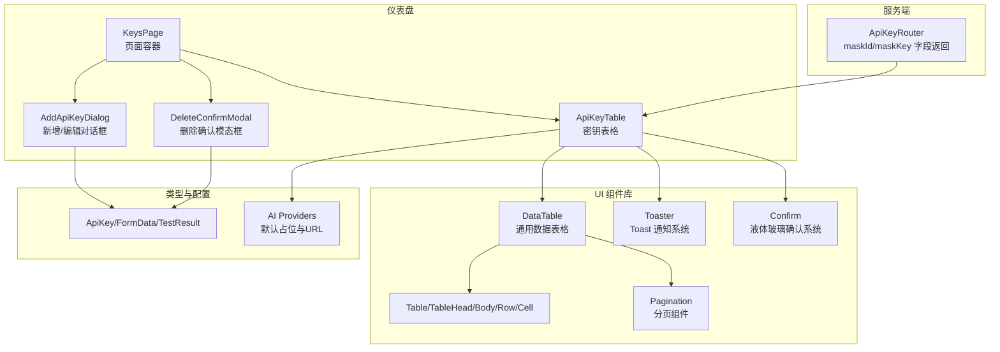
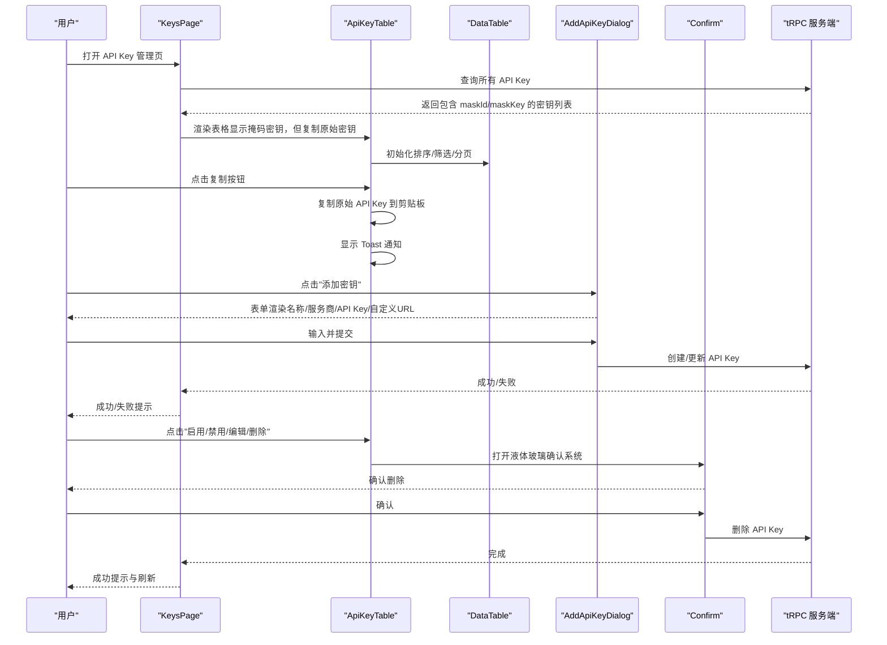
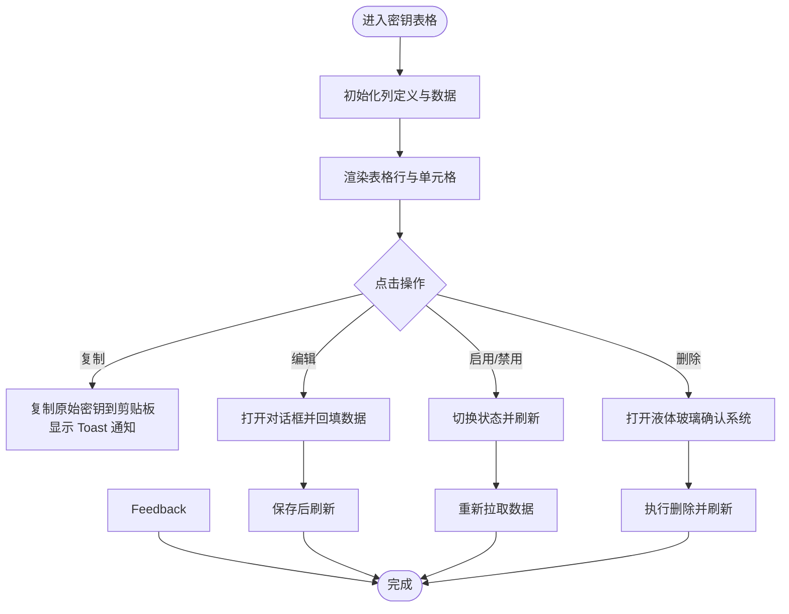
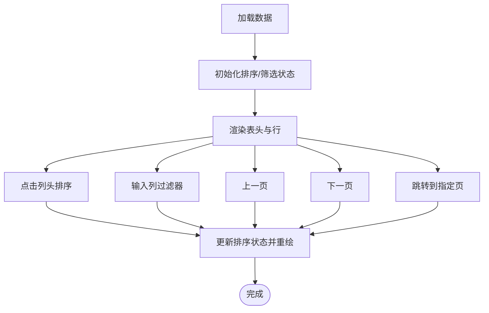
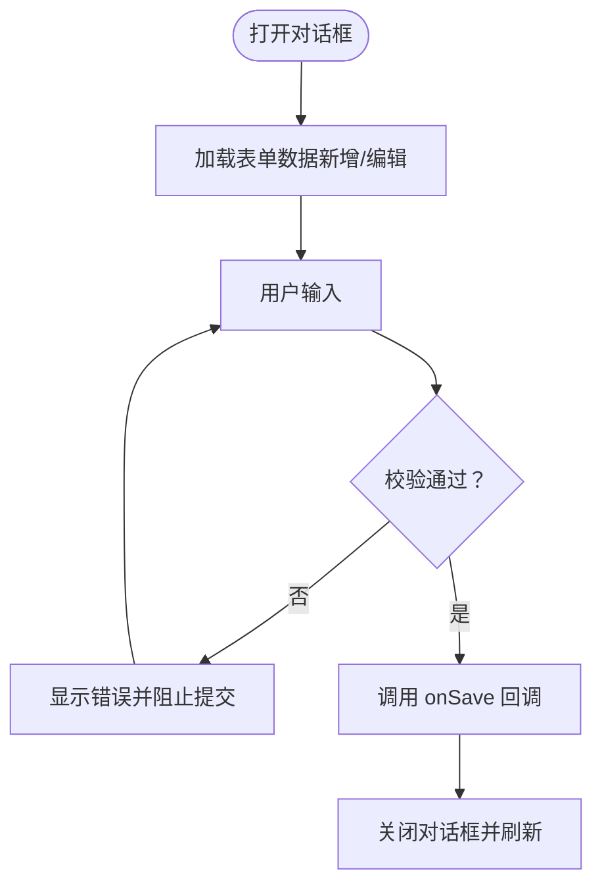
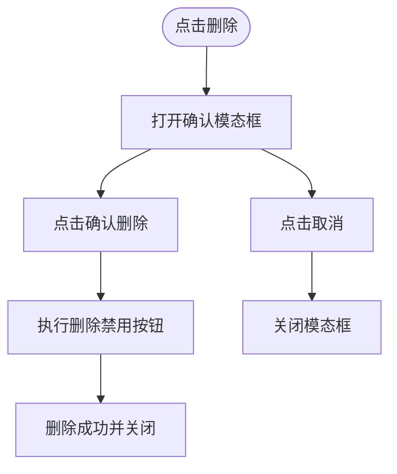
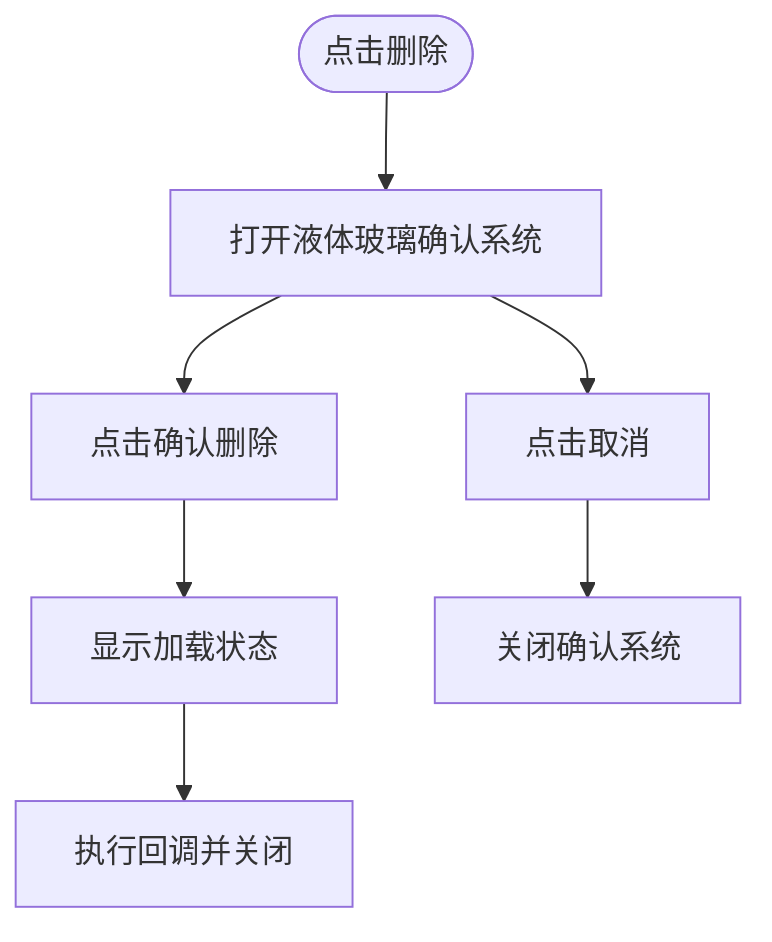
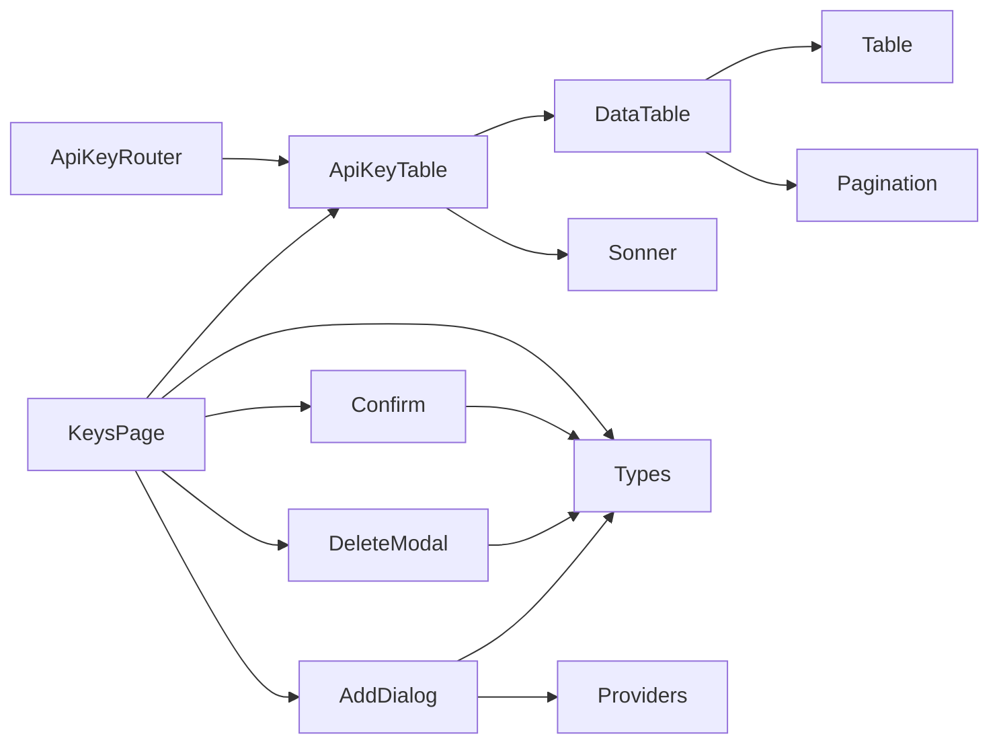

# API Key 管理

<cite>
**本文引用的文件列表**
- [src/app/(dashboard)/keys/page.tsx](file://src/app/(dashboard)/keys/page.tsx)
- [src/app/(dashboard)/keys/components/api-key-table.tsx](file://src/app/(dashboard)/keys/components/api-key-table.tsx)
- [src/app/(dashboard)/keys/components/add-api-key-dialog.tsx](file://src/app/(dashboard)/keys/components/add-api-key-dialog.tsx)
- [src/app/(dashboard)/keys/components/delete-confirm-modal.tsx](file://src/app/(dashboard)/keys/components/delete-confirm-modal.tsx)
- [src/components/ui/data-table.tsx](file://src/components/ui/data-table.tsx)
- [src/components/ui/table.tsx](file://src/components/ui/table.tsx)
- [src/components/ui/pagination.tsx](file://src/components/ui/pagination.tsx)
- [src/components/ui/sonner.tsx](file://src/components/ui/sonner.tsx)
- [src/components/ui/confirm.tsx](file://src/components/ui/confirm.tsx)
- [src/types/api-key.ts](file://src/types/api-key.ts)
- [src/lib/ai-providers.ts](file://src/lib/ai-providers.ts)
- [src/app/globals.css](file://src/app/globals.css)
- [src/server/api/routers/apiKey.ts](file://src/server/api/routers/apiKey.ts)
- [package.json](file://package.json)
</cite>

## 更新摘要
**变更内容**
- 字段命名从 originId/originKey 更新为 maskId/maskKey
- 移除了旧的 DeleteConfirmModal 组件，集成了新的液体玻璃确认系统
- 增加了 Toast 通知反馈系统
- 优化了表格组件和表单验证
- 新增了液体玻璃设计元素和状态管理

## 目录
1. [简介](#简介)
2. [项目结构](#项目结构)
3. [核心组件](#核心组件)
4. [架构总览](#架构总览)
5. [组件详解](#组件详解)
6. [依赖关系分析](#依赖关系分析)
7. [性能与可用性](#性能与可用性)
8. [故障排查指南](#故障排查指南)
9. [结论](#结论)
10. [附录](#附录)

## 简介
本文件为 AIGate 平台"API Key 管理"界面的 UI 设计文档，聚焦于密钥表格展示、新增对话框、删除确认模态框的交互与视觉设计；同时系统性阐述数据表格组件的功能边界（排序、筛选、分页、批量操作）、新增表单的验证与参数配置、删除流程的安全与反馈、密钥状态管理与过期提醒、权限控制的界面体现，以及数据导入导出、搜索过滤与批量管理的 UI 设计原则。文档面向产品、前端与运维人员，帮助快速理解与优化该模块的用户体验与一致性。

**更新** 本次更新反映了 API 密钥管理系统的重要升级：字段命名从 originId/originKey 更新为 maskId/maskKey，移除了旧的 DeleteConfirmModal 组件，集成了新的液体玻璃确认系统，增加了 Toast 通知反馈，优化了表格组件和表单验证。

## 项目结构
- 页面入口位于仪表盘下的 keys 页面，负责聚合数据、状态与交互逻辑。
- 表格组件基于通用数据表格封装，提供排序、筛选、分页能力。
- 新增/编辑对话框与删除确认模态框分别承担表单输入与安全确认职责。
- 类型定义与提供商配置为 UI 层提供数据契约与默认占位信息。
- Toast 通知系统集成，提供复制操作的视觉反馈。
- 液体玻璃确认系统提供现代化的安全确认体验。

**图表来源**
- [src/app/(dashboard)/keys/page.tsx](file://src/app/(dashboard)/keys/page.tsx#L1-L141)
- [src/app/(dashboard)/keys/components/api-key-table.tsx](file://src/app/(dashboard)/keys/components/api-key-table.tsx#L1-L175)
- [src/app/(dashboard)/keys/components/add-api-key-dialog.tsx](file://src/app/(dashboard)/keys/components/add-api-key-dialog.tsx#L1-L263)
- [src/app/(dashboard)/keys/components/delete-confirm-modal.tsx](file://src/app/(dashboard)/keys/components/delete-confirm-modal.tsx#L1-L54)
- [src/components/ui/data-table.tsx](file://src/components/ui/data-table.tsx#L1-L191)
- [src/components/ui/table.tsx](file://src/components/ui/table.tsx#L1-L95)
- [src/components/ui/pagination.tsx](file://src/components/ui/pagination.tsx#L1-L118)
- [src/components/ui/sonner.tsx](file://src/components/ui/sonner.tsx#L1-L46)
- [src/components/ui/confirm.tsx](file://src/components/ui/confirm.tsx#L1-L170)
- [src/types/api-key.ts](file://src/types/api-key.ts#L1-L21)
- [src/lib/ai-providers.ts](file://src/lib/ai-providers.ts#L1-L759)
- [src/server/api/routers/apiKey.ts](file://src/server/api/routers/apiKey.ts#L90-L101)

**章节来源**
- [src/app/(dashboard)/keys/page.tsx](file://src/app/(dashboard)/keys/page.tsx#L1-L141)
- [src/app/(dashboard)/keys/components/api-key-table.tsx](file://src/app/(dashboard)/keys/components/api-key-table.tsx#L1-L175)
- [src/app/(dashboard)/keys/components/add-api-key-dialog.tsx](file://src/app/(dashboard)/keys/components/add-api-key-dialog.tsx#L1-L263)
- [src/app/(dashboard)/keys/components/delete-confirm-modal.tsx](file://src/app/(dashboard)/keys/components/delete-confirm-modal.tsx#L1-L54)
- [src/components/ui/data-table.tsx](file://src/components/ui/data-table.tsx#L1-L191)
- [src/components/ui/table.tsx](file://src/components/ui/table.tsx#L1-L95)
- [src/components/ui/pagination.tsx](file://src/components/ui/pagination.tsx#L1-L118)
- [src/components/ui/sonner.tsx](file://src/components/ui/sonner.tsx#L1-L46)
- [src/components/ui/confirm.tsx](file://src/components/ui/confirm.tsx#L1-L170)
- [src/types/api-key.ts](file://src/types/api-key.ts#L1-L21)
- [src/lib/ai-providers.ts](file://src/lib/ai-providers.ts#L1-L759)
- [src/server/api/routers/apiKey.ts](file://src/server/api/routers/apiKey.ts#L90-L101)

## 核心组件
- KeysPage：页面容器，负责密钥数据拉取、状态切换、测试、新增/编辑、删除等主流程编排。
- ApiKeyTable：密钥表格，展示密钥信息、复制（增强版：复制原始密钥并提供视觉反馈）、测试、启用/禁用、编辑、删除等操作。
- AddApiKeyDialog：新增/编辑对话框，包含表单校验、服务商选择、参数配置与保存。
- DeleteConfirmModal：删除确认模态框，强调二次确认与安全反馈。
- DataTable/Pagination/Table：通用表格与分页组件，提供排序、筛选、分页能力。
- Toaster：Toast 通知系统，提供复制操作的视觉反馈。
- Confirm：液体玻璃确认系统，提供现代化的安全确认体验。

**更新** 新增了 Confirm 组件用于提供液体玻璃风格的安全确认，替代了旧的 DeleteConfirmModal。

**章节来源**
- [src/app/(dashboard)/keys/page.tsx](file://src/app/(dashboard)/keys/page.tsx#L1-L141)
- [src/app/(dashboard)/keys/components/api-key-table.tsx](file://src/app/(dashboard)/keys/components/api-key-table.tsx#L1-L175)
- [src/app/(dashboard)/keys/components/add-api-key-dialog.tsx](file://src/app/(dashboard)/keys/components/add-api-key-dialog.tsx#L1-L263)
- [src/app/(dashboard)/keys/components/delete-confirm-modal.tsx](file://src/app/(dashboard)/keys/components/delete-confirm-modal.tsx#L1-L54)
- [src/components/ui/data-table.tsx](file://src/components/ui/data-table.tsx#L1-L191)
- [src/components/ui/table.tsx](file://src/components/ui/table.tsx#L1-L95)
- [src/components/ui/pagination.tsx](file://src/components/ui/pagination.tsx#L1-L118)
- [src/components/ui/sonner.tsx](file://src/components/ui/sonner.tsx#L1-L46)
- [src/components/ui/confirm.tsx](file://src/components/ui/confirm.tsx#L1-L170)

## 架构总览
页面通过 tRPC 查询与变更 API Key 数据，表格组件基于通用数据表格封装，对话框与模态框作为独立 UI 组件复用，类型与提供商配置为 UI 提供契约与默认值。服务端路由现在返回 maskId/maskKey 字段，前端表格组件增强复制功能以提供更好的用户体验。新的液体玻璃确认系统提供现代化的安全确认体验。

**图表来源**
- [src/app/(dashboard)/keys/page.tsx](file://src/app/(dashboard)/keys/page.tsx#L1-L141)
- [src/app/(dashboard)/keys/components/api-key-table.tsx](file://src/app/(dashboard)/keys/components/api-key-table.tsx#L1-L175)
- [src/app/(dashboard)/keys/components/add-api-key-dialog.tsx](file://src/app/(dashboard)/keys/components/add-api-key-dialog.tsx#L1-L263)
- [src/app/(dashboard)/keys/components/delete-confirm-modal.tsx](file://src/app/(dashboard)/keys/components/delete-confirm-modal.tsx#L1-L54)
- [src/components/ui/confirm.tsx](file://src/components/ui/confirm.tsx#L1-L170)
- [src/server/api/routers/apiKey.ts](file://src/server/api/routers/apiKey.ts#L90-L101)

## 组件详解

### 密钥表格组件（ApiKeyTable）
- 功能要点
  - 列定义：名称、服务商、API Key Id（含复制按钮）、API Key（含复制按钮）、Base URL（默认/可选）、创建时间、最后使用、状态（活跃/禁用）、操作列（启用/禁用、编辑、删除）。
  - 操作行为：
    - 复制：点击复制按钮将原始 API Key 文本写入剪贴板，并显示 Toast 通知反馈。
    - 启用/禁用：切换密钥状态。
    - 编辑：打开新增/编辑对话框，回填当前密钥数据。
    - 删除：打开液体玻璃确认系统。
  - 空状态：无数据时显示图标、提示语与描述。
  - 交互细节：状态标签根据状态动态着色，使用液体玻璃设计元素。
  - **增强功能**：复制操作现在使用 row.original.key 而不是 row.original.originKey，确保复制的是原始密钥而非掩码版本。

**更新** 复制功能现在使用 maskKey 字段并提供视觉反馈，删除确认系统已更新为液体玻璃设计。

**图表来源**
- [src/app/(dashboard)/keys/components/api-key-table.tsx](file://src/app/(dashboard)/keys/components/api-key-table.tsx#L1-L175)
- [src/app/(dashboard)/keys/page.tsx](file://src/app/(dashboard)/keys/page.tsx#L1-L141)
- [src/server/api/routers/apiKey.ts](file://src/server/api/routers/apiKey.ts#L90-L101)

**章节来源**
- [src/app/(dashboard)/keys/components/api-key-table.tsx](file://src/app/(dashboard)/keys/components/api-key-table.tsx#L1-L175)
- [src/app/(dashboard)/keys/page.tsx](file://src/app/(dashboard)/keys/page.tsx#L1-L141)
- [src/server/api/routers/apiKey.ts](file://src/server/api/routers/apiKey.ts#L90-L101)

### 数据表格组件（DataTable）
- 功能要点
  - 排序：按列头点击进行升/降序切换。
  - 筛选：按列过滤器进行筛选。
  - 分页：内置分页控件，支持上一页/下一页与页码跳转；当页数较多时显示省略号。
  - 空状态：无数据时显示图标、标题与描述。
  - 默认每页 10 条，可扩展为配置项。
  - **增强功能**：使用液体玻璃设计元素，提供现代化的视觉体验。

**图表来源**
- [src/components/ui/data-table.tsx](file://src/components/ui/data-table.tsx#L1-L191)
- [src/components/ui/table.tsx](file://src/components/ui/table.tsx#L1-L95)
- [src/components/ui/pagination.tsx](file://src/components/ui/pagination.tsx#L1-L118)

**章节来源**
- [src/components/ui/data-table.tsx](file://src/components/ui/data-table.tsx#L1-L191)
- [src/components/ui/table.tsx](file://src/components/ui/table.tsx#L1-L95)
- [src/components/ui/pagination.tsx](file://src/components/ui/pagination.tsx#L1-L118)

### 新增/编辑对话框（AddApiKeyDialog）
- 功能要点
  - 表单字段：名称（必填）、服务商（必填，多选项）、API Key（必填，支持明文/隐藏切换）、自定义 Base URL（可选，带默认占位）。
  - 校验规则：名称与 API Key 为空时显示错误提示；输入时自动清除对应字段错误。
  - 占位与提示：根据所选服务商动态提供 API Key 与 Base URL 的默认占位与说明。
  - 交互细节：保存按钮禁用期间显示加载文案；取消按钮关闭对话框并清理状态。
  - **增强功能**：优化了表单验证和错误处理，提供更好的用户体验。

**图表来源**
- [src/app/(dashboard)/keys/components/add-api-key-dialog.tsx](file://src/app/(dashboard)/keys/components/add-api-key-dialog.tsx#L1-L263)
- [src/types/api-key.ts](file://src/types/api-key.ts#L1-L21)
- [src/lib/ai-providers.ts](file://src/lib/ai-providers.ts#L1-L759)

**章节来源**
- [src/app/(dashboard)/keys/components/add-api-key-dialog.tsx](file://src/app/(dashboard)/keys/components/add-api-key-dialog.tsx#L1-L263)
- [src/types/api-key.ts](file://src/types/api-key.ts#L1-L21)
- [src/lib/ai-providers.ts](file://src/lib/ai-providers.ts#L1-L759)

### 删除确认模态框（DeleteConfirmModal）
- 功能要点
  - 弹层设计：半透明遮罩、居中卡片、警示图标。
  - 内容：显示确认标题、目标密钥名称与不可逆提示。
  - 操作：取消按钮关闭模态框；确认按钮触发删除并显示加载状态。
  - 安全性：仅在用户明确点击"确认删除"时执行删除。
  - **更新**：已被新的液体玻璃确认系统替代，但仍保留以供参考。

**图表来源**
- [src/app/(dashboard)/keys/components/delete-confirm-modal.tsx](file://src/app/(dashboard)/keys/components/delete-confirm-modal.tsx#L1-L54)

**章节来源**
- [src/app/(dashboard)/keys/components/delete-confirm-modal.tsx](file://src/app/(dashboard)/keys/components/delete-confirm-modal.tsx#L1-L54)

### 液体玻璃确认系统（Confirm）
- 功能要点
  - 弹层设计：液体玻璃效果、半透明背景、现代化卡片设计。
  - 内容：显示确认标题、描述信息与操作按钮。
  - 操作：取消按钮关闭确认框；确认按钮触发回调并显示加载状态。
  - 安全性：提供现代化的安全确认体验，支持异步操作。
  - **新增功能**：替代了旧的 DeleteConfirmModal，提供更好的视觉效果和用户体验。

**图表来源**
- [src/components/ui/confirm.tsx](file://src/components/ui/confirm.tsx#L1-L170)

**章节来源**
- [src/components/ui/confirm.tsx](file://src/components/ui/confirm.tsx#L1-L170)

### 密钥状态管理、过期提醒与权限控制的界面实现
- 状态管理
  - 状态标签：活跃/禁用，采用不同颜色标识，便于快速识别。
  - 启用/禁用：表格操作列提供一键切换，切换后刷新数据并提示成功/失败。
- 过期提醒
  - 当前代码未实现"过期时间"字段与提醒逻辑；建议在类型与后端接口中增加到期时间字段，并在表格中增加到期日列与"即将到期/已过期"状态提示。
- 权限控制
  - 页面布局在仪表盘层进行会话校验，未登录将重定向至登录页；该机制保证了对密钥管理页面的访问控制。
  - 对于更细粒度的权限（如只读/编辑），可在对话框与操作按钮处增加条件渲染与禁用策略。

**章节来源**
- [src/app/(dashboard)/layout.tsx](file://src/app/(dashboard)/layout.tsx#L1-L20)
- [src/app/(dashboard)/keys/components/api-key-table.tsx](file://src/app/(dashboard)/keys/components/api-key-table.tsx#L1-L175)
- [src/app/(dashboard)/keys/page.tsx](file://src/app/(dashboard)/keys/page.tsx#L1-L141)

### 数据导入导出、搜索过滤与批量管理的 UI 设计原则
- 搜索与过滤
  - 表格已内置列过滤器与排序，建议在页面顶部增加全局搜索框，结合列过滤器提升检索效率。
- 批量管理
  - 当前表格未提供多选与批量操作；建议引入复选框列，支持批量启用/禁用、批量删除与批量测试。
- 导入/导出
  - 建议提供 CSV 导出（含名称、服务商、API Key、Base URL、状态、创建时间、最后使用）与导入模板下载；导入时进行格式校验与去重处理。

**章节来源**
- [src/components/ui/data-table.tsx](file://src/components/ui/data-table.tsx#L1-L191)
- [src/app/(dashboard)/keys/components/api-key-table.tsx](file://src/app/(dashboard)/keys/components/api-key-table.tsx#L1-L175)

### Toast 通知系统集成
- 功能要点
  - 集成 sonner 库提供统一的通知体验。
  - 支持多种通知类型：成功、错误、警告、信息、加载状态。
  - 自动主题适配，支持浅色/深色模式切换。
  - 自定义图标与样式类名，确保与整体设计风格一致。
- 在 API Key 表格中的应用
  - 复制操作完成后显示"已复制到剪贴板"通知。
  - 通知具有适当的持续时间和关闭按钮。

**更新** 新增了 Toast 通知系统的详细说明。

**章节来源**
- [src/components/ui/sonner.tsx](file://src/components/ui/sonner.tsx#L1-L46)
- [src/app/(dashboard)/keys/components/api-key-table.tsx](file://src/app/(dashboard)/keys/components/api-key-table.tsx#L24-L27)

## 依赖关系分析
- 组件依赖
  - KeysPage 依赖 tRPC 查询与变更 API Key 的方法，依赖对话框与确认系统组件。
  - ApiKeyTable 依赖 DataTable 与通用 Table/Pagination 组件，依赖 Toaster 提供视觉反馈。
  - AddApiKeyDialog 依赖类型定义与提供商配置，用于默认占位与提示。
  - DeleteConfirmModal 为独立弹层组件，依赖基础按钮与加载指示。
  - Confirm 为新的液体玻璃确认系统，提供现代化的安全确认体验。
- 外部依赖
  - UI 库：@tanstack/react-table、@radix-ui/react-dialog、@radix-ui/react-select、sonner 等。
  - 主题与样式：Tailwind CSS、自定义变量与暗色模式适配。
  - 确认系统：@radix-ui/react-alert-dialog、ahooks 等。
- 服务端依赖
  - ApiKeyRouter 现在返回 maskId/maskKey 字段，为前端复制功能提供原始密钥数据。

**图表来源**
- [src/app/(dashboard)/keys/page.tsx](file://src/app/(dashboard)/keys/page.tsx#L1-L141)
- [src/app/(dashboard)/keys/components/api-key-table.tsx](file://src/app/(dashboard)/keys/components/api-key-table.tsx#L1-L175)
- [src/app/(dashboard)/keys/components/add-api-key-dialog.tsx](file://src/app/(dashboard)/keys/components/add-api-key-dialog.tsx#L1-L263)
- [src/app/(dashboard)/keys/components/delete-confirm-modal.tsx](file://src/app/(dashboard)/keys/components/delete-confirm-modal.tsx#L1-L54)
- [src/components/ui/data-table.tsx](file://src/components/ui/data-table.tsx#L1-L191)
- [src/components/ui/table.tsx](file://src/components/ui/table.tsx#L1-L95)
- [src/components/ui/pagination.tsx](file://src/components/ui/pagination.tsx#L1-L118)
- [src/components/ui/sonner.tsx](file://src/components/ui/sonner.tsx#L1-L46)
- [src/components/ui/confirm.tsx](file://src/components/ui/confirm.tsx#L1-L170)
- [src/types/api-key.ts](file://src/types/api-key.ts#L1-L21)
- [src/lib/ai-providers.ts](file://src/lib/ai-providers.ts#L1-L759)
- [src/server/api/routers/apiKey.ts](file://src/server/api/routers/apiKey.ts#L90-L101)

**章节来源**
- [package.json](file://package.json#L1-L75)
- [src/app/(dashboard)/keys/page.tsx](file://src/app/(dashboard)/keys/page.tsx#L1-L141)
- [src/app/(dashboard)/keys/components/api-key-table.tsx](file://src/app/(dashboard)/keys/components/api-key-table.tsx#L1-L175)
- [src/app/(dashboard)/keys/components/add-api-key-dialog.tsx](file://src/app/(dashboard)/keys/components/add-api-key-dialog.tsx#L1-L263)
- [src/app/(dashboard)/keys/components/delete-confirm-modal.tsx](file://src/app/(dashboard)/keys/components/delete-confirm-modal.tsx#L1-L54)
- [src/components/ui/data-table.tsx](file://src/components/ui/data-table.tsx#L1-L191)
- [src/components/ui/table.tsx](file://src/components/ui/table.tsx#L1-L95)
- [src/components/ui/pagination.tsx](file://src/components/ui/pagination.tsx#L1-L118)
- [src/components/ui/sonner.tsx](file://src/components/ui/sonner.tsx#L1-L46)
- [src/components/ui/confirm.tsx](file://src/components/ui/confirm.tsx#L1-L170)
- [src/types/api-key.ts](file://src/types/api-key.ts#L1-L21)
- [src/lib/ai-providers.ts](file://src/lib/ai-providers.ts#L1-L759)
- [src/server/api/routers/apiKey.ts](file://src/server/api/routers/apiKey.ts#L90-L101)

## 性能与可用性
- 性能
  - 表格分页与筛选在客户端完成，建议在数据量较大时考虑服务端分页/筛选以降低前端压力。
  - 加载状态：表格与对话框/模态框均提供加载状态，避免重复提交与误操作。
  - Toast 通知：轻量级通知系统，不会对性能造成显著影响。
  - 液体玻璃效果：使用 CSS backdrop-filter 实现，现代浏览器支持良好。
- 可用性
  - 液体玻璃设计：通过 CSS backdrop-blur 和透明度实现，提供现代化的视觉体验。
  - 暗色模式：通过 CSS 变量与 Tailwind 适配，确保在深色环境下仍具备良好对比度。
  - 错误与成功提示：统一使用消息条，支持手动关闭，避免覆盖重要信息。
  - 操作反馈：启用/禁用、删除等关键操作均提供即时反馈。
  - **增强功能**：复制操作提供即时视觉反馈，提升用户体验。

**更新** 新增了液体玻璃设计和确认系统的性能和可用性说明。

**章节来源**
- [src/app/globals.css](file://src/app/globals.css#L1-L125)
- [src/app/(dashboard)/keys/page.tsx](file://src/app/(dashboard)/keys/page.tsx#L1-L141)
- [src/app/(dashboard)/keys/components/api-key-table.tsx](file://src/app/(dashboard)/keys/components/api-key-table.tsx#L1-L175)
- [src/app/(dashboard)/keys/components/add-api-key-dialog.tsx](file://src/app/(dashboard)/keys/components/add-api-key-dialog.tsx#L1-L263)
- [src/app/(dashboard)/keys/components/delete-confirm-modal.tsx](file://src/app/(dashboard)/keys/components/delete-confirm-modal.tsx#L1-L54)
- [src/components/ui/sonner.tsx](file://src/components/ui/sonner.tsx#L1-L46)
- [src/components/ui/confirm.tsx](file://src/components/ui/confirm.tsx#L1-L170)

## 故障排查指南
- 新增/编辑失败
  - 检查必填字段是否为空；查看错误提示并修正。
  - 确认网络状态与 tRPC 服务端可用性。
- 删除失败
  - 确认删除确认流程是否完整执行；检查服务端返回的错误信息。
  - 验证液体玻璃确认系统是否正常工作。
- 测试失败
  - 检查 API Key 是否正确、Base URL 是否可达；查看服务端返回的错误详情。
- 表格无数据
  - 确认 tRPC 查询是否成功；检查是否有权限可见的数据。
- **复制功能异常**
  - 确认浏览器支持 Clipboard API。
  - 检查是否有足够的权限允许页面访问剪贴板。
  - 验证服务端是否正确返回 maskId/maskKey 字段。
  - 确认 Toast 通知系统正常工作。
- **液体玻璃确认系统问题**
  - 检查 ConfirmProvider 是否正确包装应用。
  - 确认 CSS backdrop-blur 属性是否被浏览器支持。
  - 验证确认系统的异步回调是否正确处理。

**更新** 新增了液体玻璃确认系统和字段命名变更的故障排查指南。

**章节来源**
- [src/app/(dashboard)/keys/page.tsx](file://src/app/(dashboard)/keys/page.tsx#L1-L141)
- [src/app/(dashboard)/keys/components/api-key-table.tsx](file://src/app/(dashboard)/keys/components/api-key-table.tsx#L1-L175)
- [src/app/(dashboard)/keys/components/add-api-key-dialog.tsx](file://src/app/(dashboard)/keys/components/add-api-key-dialog.tsx#L1-L263)
- [src/app/(dashboard)/keys/components/delete-confirm-modal.tsx](file://src/app/(dashboard)/keys/components/delete-confirm-modal.tsx#L1-L54)
- [src/components/ui/confirm.tsx](file://src/components/ui/confirm.tsx#L1-L170)
- [src/server/api/routers/apiKey.ts](file://src/server/api/routers/apiKey.ts#L90-L101)

## 结论
本 UI 设计文档围绕 API Key 管理页面的表格、对话框与模态框进行了系统化梳理，明确了各组件的职责、交互与数据契约。当前实现具备良好的可维护性与扩展性。本次更新特别增强了复制功能，现在用户可以复制原始 API 密钥并获得即时的视觉反馈，提升了用户体验。新的液体玻璃确认系统提供了现代化的安全确认体验，而字段命名从 originId/originKey 更新为 maskId/maskKey 则更好地体现了数据的掩码特性。建议后续在"过期提醒"、"批量管理"、"导入导出"等方面进一步完善，以满足更复杂的业务场景与更高的运营效率。

**更新** 本次更新反映了 API 密钥管理系统的重要改进：字段命名更新、确认系统现代化、通知系统集成和表格组件优化。

## 附录
- 类型定义参考：[src/types/api-key.ts](file://src/types/api-key.ts#L1-L21)
- 提供商配置参考：[src/lib/ai-providers.ts](file://src/lib/ai-providers.ts#L1-L759)
- 样式与主题参考：[src/app/globals.css](file://src/app/globals.css#L1-L125)
- Toast 通知系统参考：[src/components/ui/sonner.tsx](file://src/components/ui/sonner.tsx#L1-L46)
- 液体玻璃确认系统参考：[src/components/ui/confirm.tsx](file://src/components/ui/confirm.tsx#L1-L170)
- 服务端 API 密钥路由参考：[src/server/api/routers/apiKey.ts](file://src/server/api/routers/apiKey.ts#L90-L101)

**更新** 新增了液体玻璃确认系统和服务端 API 密钥路由的参考链接。