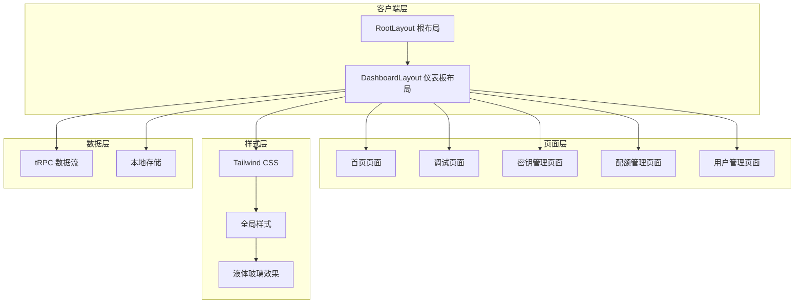
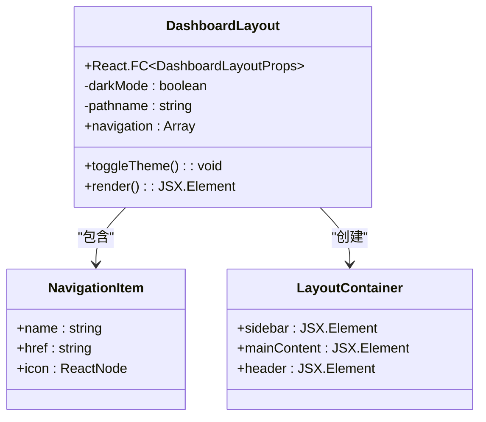
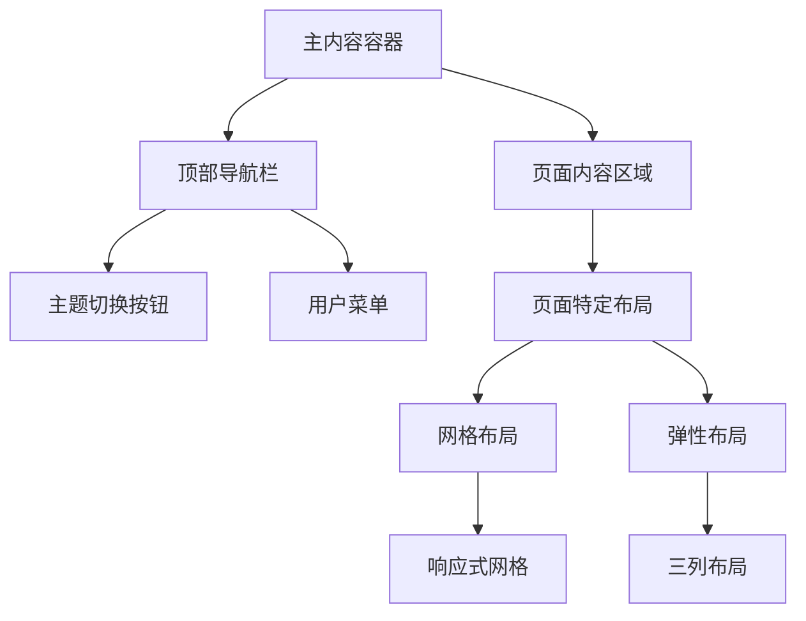
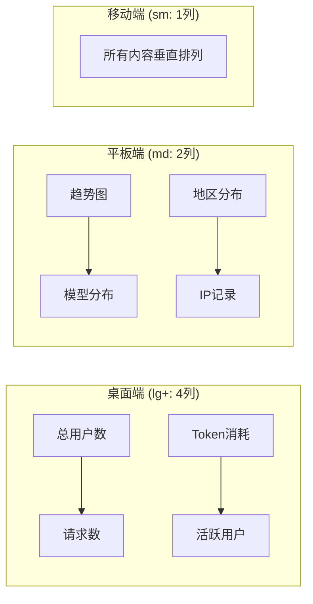
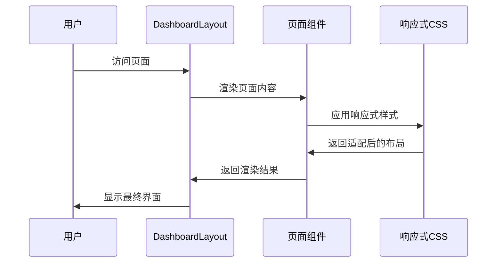
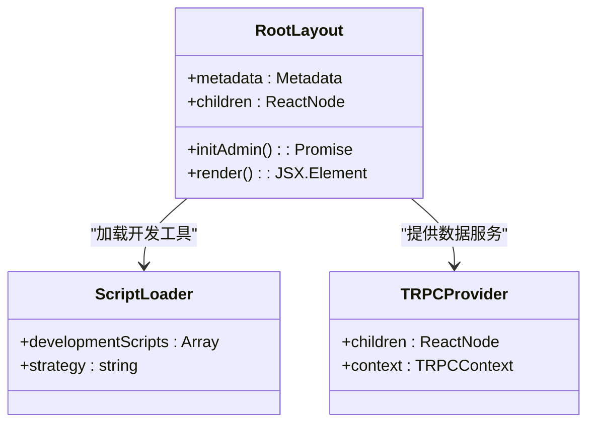
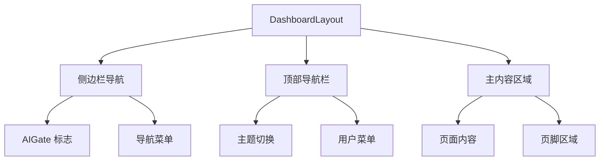
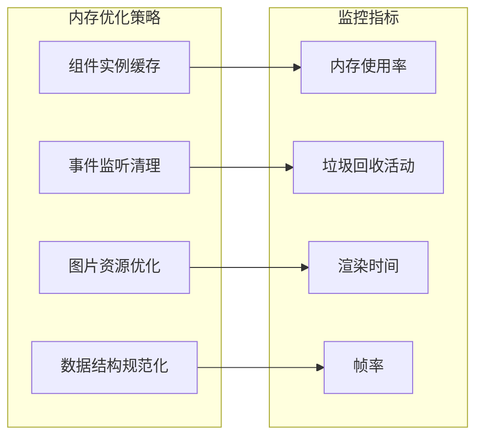
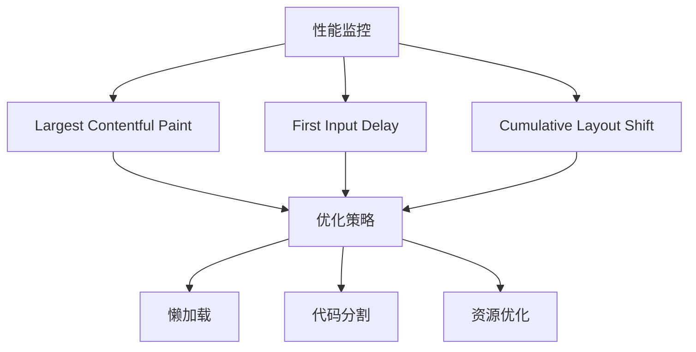

# 三列响应式布局设计

<cite>
**本文档引用的文件**
- [src/app/layout.tsx](file://src/app/layout.tsx)
- [src/components/dashboard-layout.tsx](file://src/components/dashboard-layout.tsx)
- [src/app/(dashboard)/layout.tsx](file://src/app/(dashboard)/layout.tsx)
- [src/app/(dashboard)/page.tsx](file://src/app/(dashboard)/page.tsx)
- [src/app/(dashboard)/debug/page.tsx](file://src/app/(dashboard)/debug/page.tsx)
- [src/app/(dashboard)/keys/page.tsx](file://src/app/(dashboard)/keys/page.tsx)
- [src/app/(dashboard)/quotas/page.tsx](file://src/app/(dashboard)/quotas/page.tsx)
- [src/app/(dashboard)/users/page.tsx](file://src/app/(dashboard)/users/page.tsx)
- [tailwind.config.js](file://tailwind.config.js)
- [src/app/globals.css](file://src/app/globals.css)
</cite>

## 目录
1. [项目概述](#项目概述)
2. [整体架构](#整体架构)
3. [三列布局核心实现](#三列布局核心实现)
4. [响应式设计策略](#响应式设计策略)
5. [组件层次结构](#组件层次结构)
6. [样式系统设计](#样式系统设计)
7. [性能优化考虑](#性能优化考虑)
8. [最佳实践指南](#最佳实践指南)
9. [故障排除指南](#故障排除指南)
10. [总结](#总结)

## 项目概述

AIGate 是一个基于 Next.js 构建的 AI 网关管理后台系统，采用现代化的三列响应式布局设计。该系统实现了完整的仪表板功能，包括用户管理、API 密钥管理、配额管理和接口调试等核心模块。

## 整体架构

系统采用分层架构设计，主要由以下层次组成：



**图表来源**
- [src/app/layout.tsx](file://src/app/layout.tsx#L25-L57)
- [src/components/dashboard-layout.tsx](file://src/components/dashboard-layout.tsx#L53-L194)

## 三列布局核心实现

### 主布局容器设计

三列布局的核心实现位于 `DashboardLayout` 组件中，采用了 Flexbox 布局模型：



**图表来源**
- [src/components/dashboard-layout.tsx](file://src/components/dashboard-layout.tsx#L21-L51)
- [src/components/dashboard-layout.tsx](file://src/components/dashboard-layout.tsx#L92-L194)

### 侧边栏导航系统

侧边栏采用固定宽度设计（64单位），实现了现代化的液体玻璃效果：

| 属性 | 值 | 描述 |
|------|-----|------|
| 宽度 | 16rem (256px) | 固定侧边栏宽度 |
| 背景 | 白色/黑色半透明 | 支持明暗主题切换 |
| 模糊效果 | 20px | 实现液体玻璃视觉效果 |
| 边框 | 白色/白色透明度 | 动态主题适配 |

### 主内容区域布局

主内容区域采用弹性布局，占据剩余空间：



**图表来源**
- [src/components/dashboard-layout.tsx](file://src/components/dashboard-layout.tsx#L125-L191)

## 响应式设计策略

### 断点设计

系统采用 Tailwind CSS 的响应式断点系统：

| 断点 | 最小宽度 | 用途 | 布局行为 |
|------|----------|------|----------|
| 默认 | 0px | 移动设备 | 单列堆叠布局 |
| sm | 640px | 小型平板 | 单列或双列 |
| md | 768px | 平板设备 | 双列布局 |
| lg | 1024px | 桌面设备 | 三列布局 |
| xl | 1280px | 大桌面设备 | 三列布局优化 |
| 2xl | 1536px | 超大桌面设备 | 三列布局最大化 |

### 页面级响应式实现

不同页面采用了不同的响应式策略：

#### 仪表板页面（四卡片网格）



**图表来源**
- [src/app/(dashboard)/page.tsx](file://src/app/(dashboard)/page.tsx#L134-L191)
- [src/app/(dashboard)/page.tsx](file://src/app/(dashboard)/page.tsx#L194-L212)

#### 调试页面（双列布局）

调试页面采用了经典的三列布局模式：

| 区域 | 移动端 | 平板端 | 桌面端 | 超大屏 |
|------|--------|--------|--------|--------|
| 左侧配置区 | 100%宽度 | 100%宽度 | 50%宽度 | 50%宽度 |
| 中间结果区 | 100%宽度 | 100%宽度 | 50%宽度 | 50%宽度 |
| 右侧代码区 | 不适用 | 不适用 | 100%宽度 | 100%宽度 |

### 组件级响应式处理

每个页面组件都实现了相应的响应式逻辑：



**图表来源**
- [src/app/(dashboard)/layout.tsx](file://src/app/(dashboard)/layout.tsx#L10-L18)
- [src/app/(dashboard)/debug/page.tsx](file://src/app/(dashboard)/debug/page.tsx#L333-L354)

## 组件层次结构

### 根布局组件

根布局组件负责全局配置和初始化：



**图表来源**
- [src/app/layout.tsx](file://src/app/layout.tsx#L13-L57)

### 仪表板布局组件

仪表板布局组件是整个系统的骨架：



**图表来源**
- [src/components/dashboard-layout.tsx](file://src/components/dashboard-layout.tsx#L92-L194)

## 样式系统设计

### 液体玻璃效果实现

系统实现了独特的液体玻璃视觉效果，通过 CSS 自定义属性和 Tailwind CSS 类名组合实现：

```mermaid
flowchart LR
subgraph "CSS变量系统"
RootVars[:root 变量]
DarkVars[.dark 变量]
end
subgraph "Tailwind扩展"
BlurClass[backdrop-blur-2xl]
BorderClass[border-white/20]
ShadowClass[shadow-[4px_0_24px_rgba(0,0,0,0.08)]]
end
subgraph "主题切换"
LightMode[浅色模式]
DarkMode[深色模式]
end
RootVars --> BlurClass
DarkVars --> BorderClass
BlurClass --> ShadowClass
BorderClass --> LightMode
ShadowClass --> DarkMode
```

**图表来源**
- [src/app/globals.css](file://src/app/globals.css#L5-L129)
- [tailwind.config.js](file://tailwind.config.js#L19-L74)

### 颜色系统架构

系统采用基于 CSS 变量的颜色系统，支持明暗主题自动切换：

| 颜色类别 | 变量名称 | 用途 | 深色模式变体 |
|----------|----------|------|-------------|
| 背景 | `--background` | 页面背景 | `#0f172a` |
| 前景色 | `--foreground` | 文本颜色 | `#f1f5f9` |
| 主色调 | `--primary` | 强调色 | `#818cf8` |
| 卡片色 | `--card` | 卡片背景 | `rgba(30, 41, 59, 0.6)` |
| 弹出层 | `--popover` | 弹窗背景 | `rgba(30, 41, 59, 0.85)` |
| 输入框 | `--input` | 输入框边框 | `rgba(71, 85, 105, 0.5)` |

### 动画和过渡效果

系统实现了丰富的动画效果，增强用户体验：

| 动画类型 | 触发条件 | 持续时间 | 缓动函数 |
|----------|----------|----------|----------|
| 悬停缩放 | 鼠标悬停 | 200ms | `ease-[cubic-bezier(0.34,1.56,0.64,1)]` |
| 背景切换 | 主题切换 | 300ms | `ease-in-out` |
| 模糊过渡 | 组件加载 | 400ms | `ease-out` |
| 阴影变化 | 状态改变 | 300ms | `ease-in-out` |

## 性能优化考虑

### 渲染性能优化

系统采用了多种性能优化策略：

1. **懒加载机制**：开发环境下的调试工具采用懒加载，避免影响生产环境性能
2. **虚拟滚动**：大数据表格采用虚拟滚动技术，提升渲染效率
3. **防抖处理**：搜索和过滤操作采用防抖机制，减少不必要的重渲染
4. **缓存策略**：合理使用浏览器缓存和组件缓存

### 内存管理



### 网络性能

- **CDN 加速**：静态资源通过 CDN 分发
- **压缩传输**：启用 Gzip 和 Brotli 压缩
- **按需加载**：路由级别的代码分割
- **预连接优化**：关键域名预连接

## 最佳实践指南

### 布局设计原则

1. **一致性原则**：保持导航和布局风格的一致性
2. **层次性原则**：通过视觉层次传达信息重要性
3. **对比性原则**：合理运用色彩和尺寸对比
4. **留白原则**：适当的留白提升可读性

### 响应式设计规范

| 设备类型 | 最小宽度 | 交互方式 | 重点关注 |
|----------|----------|----------|----------|
| 移动设备 | 320px | 触摸手势 | 点击目标大小、滚动性能 |
| 小平板 | 480px | 触摸+鼠标 | 字体大小、间距调整 |
| 平板设备 | 768px | 触摸+鼠标 | 导航简化、内容密度 |
| 桌面设备 | 1024px | 鼠标+键盘 | 多任务支持、快捷键 |
| 大屏设备 | 1200px | 鼠标 | 内容充分利用、视觉焦点 |

### 无障碍访问

系统遵循 WCAG 2.1 AA 标准：

- **键盘导航**：完整支持键盘操作
- **屏幕阅读器**：语义化标签和 ARIA 属性
- **色彩对比**：满足最小对比度要求
- **焦点管理**：清晰的焦点指示器

## 故障排除指南

### 常见布局问题

| 问题描述 | 可能原因 | 解决方案 |
|----------|----------|----------|
| 布局错位 | CSS 优先级冲突 | 检查 Tailwind 类名顺序 |
| 响应式失效 | 断点配置错误 | 验证媒体查询断点 |
| 性能下降 | 组件重渲染过多 | 实施 React.memo 优化 |
| 主题不生效 | CSS 变量未正确设置 | 检查 :root 和 .dark 选择器 |

### 调试工具使用

1. **浏览器开发者工具**：检查元素盒模型和布局
2. **React DevTools**：分析组件树和渲染性能
3. **Lighthouse**：评估性能和无障碍性
4. **Chrome 扩展**：响应式设计调试工具

### 性能监控



## 总结

AIGate 的三列响应式布局设计体现了现代前端开发的最佳实践，通过精心设计的组件架构、灵活的响应式系统和优雅的视觉效果，为用户提供了优秀的管理后台体验。

### 核心优势

1. **架构清晰**：分层设计便于维护和扩展
2. **响应迅速**：优化的渲染性能确保流畅体验
3. **视觉优雅**：液体玻璃效果营造现代感
4. **兼容性强**：全面支持各种设备和浏览器
5. **易于维护**：标准化的代码结构和命名约定

### 技术亮点

- **组件化设计**：高度模块化的组件体系
- **响应式优先**：移动优先的设计理念
- **性能优化**：多维度的性能优化策略
- **无障碍支持**：完整的无障碍访问实现
- **主题系统**：灵活的明暗主题切换

该设计为类似的企业级管理后台项目提供了优秀的参考模板，展示了如何在保证功能完整性的同时，实现优雅的用户体验和卓越的性能表现。