# 仪表板概览

<cite>
**本文引用的文件**
- [仪表板布局组件](file://src/components/dashboard-layout.tsx)
- [仪表板概览页面](file://src/app/(dashboard)/page.tsx)
- [统计卡片组件](file://src/app/(dashboard)/components/stat-card.tsx)
- [用量趋势图表组件](file://src/app/(dashboard)/components/usage-trend-chart.tsx)
- [账单趋势图表组件](file://src/app/(dashboard)/components/billing-trend-chart.tsx)
- [模型分布饼图组件](file://src/app/(dashboard)/components/model-distribution-chart.tsx)
- [地区热力地图组件](file://src/app/(dashboard)/components/region-heatmap-chart.tsx)
- [最近活动列表容器](file://src/app/(dashboard)/components/recent-activity.tsx)
- [最近活动条目组件](file://src/app/(dashboard)/components/activity-item.tsx)
- [最近 IP 请求表格组件](file://src/app/(dashboard)/components/recent-ip-requests.tsx)
- [日期范围选择器组件](file://src/components/date-range-picker.tsx)
- [自定义日期范围选择器组件](file://src/components/date-picker-with-range.tsx)
- [仪表板类型定义](file://src/types/dashboard.ts)
- [仪表板服务端路由](file://src/server/api/routers/dashboard.ts)
- [数据库表结构定义](file://src/lib/schema.ts)
- [全局样式与玻璃拟态变量](file://src/app/globals.css)
- [Tailwind 主题配置](file://tailwind.config.js)
- [TRPC Provider](file://src/components/trpc-provider.tsx)
- [仪表板布局包装器](file://src/app/(dashboard)/layout.tsx)
- [日期工具函数](file://src/lib/date.ts)
</cite>

## 更新摘要
**变更内容**
- **新增账单趋势图表**：集成 getBillingTrend API 端点，提供费用与 Token 消耗双重维度的趋势分析
- **布局重构**：仪表板从传统的两列布局重构为四列响应式设计，支持更灵活的内容排列
- **液体玻璃美学系统**：全面引入液体玻璃效果，包括毛玻璃背景、渐变边框和阴影系统
- **增强图表主题配置**：图表组件支持深色模式自动适配，提供完整的主题切换体验
- **改进深色模式支持**：通过 CSS 变量和主题切换实现完整的深色模式体验
- **新增自定义日期范围选择器**：引入 DatePickerWithRange 组件，提供更精确的日期范围选择功能

## 目录
1. [引言](#引言)
2. [项目结构](#项目结构)
3. [核心组件](#核心组件)
4. [架构总览](#架构总览)
5. [详细组件分析](#详细组件分析)
6. [液体玻璃美学系统](#液体玻璃美学系统)
7. [响应式布局设计](#响应式布局设计)
8. [深色模式支持](#深色模式支持)
9. [日期范围查询功能](#日期范围查询功能)
10. [依赖关系分析](#依赖关系分析)
11. [性能考量](#性能考量)
12. [故障排查指南](#故障排查指南)
13. [结论](#结论)
14. [附录](#附录)

## 引言
本文件面向 AIGate 仪表板概览页面，提供一套完整的界面设计与实现文档。重点覆盖整体布局架构（导航菜单、侧边栏、主内容区）、核心组件（统计卡片、用量趋势图表、账单趋势图表、最近活动列表、IP 请求分布与地区热力图）、**新增的液体玻璃美学系统**、**四列响应式布局设计**、**增强的深色模式支持**、**自定义日期范围查询功能**、数据展示策略（实时性、渲染与响应式适配）、组件组合与状态管理模式、权限控制下的内容展示与个性化配置、以及页面加载性能优化与用户体验提升方案。

## 项目结构
仪表板概览页面采用 Next.js App Router 的布局与页面组织方式，配合 tRPC 进行前后端数据交互，使用 ECharts 实现可视化图表，TailwindCSS 提供统一的样式与主题变量，并通过**全新的液体玻璃美学系统**营造现代感。**新增的自定义日期范围选择器组件为用户提供灵活的数据查询能力**。

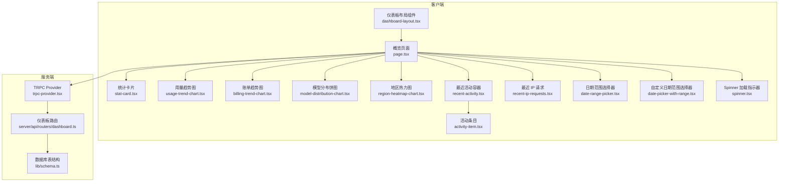

**图表来源**
- [仪表板概览页面](file://src/app/(dashboard)/page.tsx#L1-L258)
- [日期范围选择器组件:1-88](file://src/components/date-range-picker.tsx#L1-L88)
- [自定义日期范围选择器组件:1-92](file://src/components/date-picker-with-range.tsx#L1-L92)
- [仪表板服务端路由:1-575](file://src/server/api/routers/dashboard.ts#L1-L575)

**章节来源**
- [仪表板概览页面](file://src/app/(dashboard)/page.tsx#L1-L258)
- [仪表板布局组件:1-197](file://src/components/dashboard-layout.tsx#L1-L197)
- [全局样式与玻璃拟态变量:1-136](file://src/app/globals.css#L1-L136)
- [Tailwind 主题配置:1-78](file://tailwind.config.js#L1-L78)

## 核心组件
- **统计卡片**：展示关键指标（总用户数、今日请求、Token 消耗、活跃用户），支持数值格式化与趋势指示，采用液体玻璃设计。
- **用量趋势图表**：折线图展示近七日请求量与 Token 消耗趋势，具有现代化的视觉样式，支持深色模式自动适配。
- **账单趋势图表**：**新增** 折线图展示近七日费用与 Token 消耗趋势，支持费用与 Token 消耗双重维度分析，采用深色模式自动适配。
- **模型分布饼图**：展示近三十日各模型的 Token 消耗占比与请求次数，支持 Token 占比和请求次数两种模式切换。
- **地区热力地图**：基于中国地图 GeoJSON 的请求次数热力分布，支持地图数据异步加载与错误处理。
- **最近活动列表**：展示最近 24 小时内的 API 调用活动，含模型、提供商、Token 数等详情。
- **最近 IP 请求表格**：展示最近带有 IP 的请求记录，支持分页与时间相对化显示。
- **日期范围选择器**：提供预设日期范围（今日、昨日、近7天、近30天）和自定义日期范围选择功能。
- **自定义日期范围选择器**：基于 react-day-picker 的高级日期范围选择器，支持范围选择和多月显示。
- **液体玻璃布局**：侧边导航、顶部工具栏、内容卡片均采用液体玻璃美学设计。

**章节来源**
- [统计卡片组件](file://src/app/(dashboard)/components/stat-card.tsx#L1-L76)
- [用量趋势图表组件](file://src/app/(dashboard)/components/usage-trend-chart.tsx#L1-L323)
- [账单趋势图表组件](file://src/app/(dashboard)/components/billing-trend-chart.tsx#L1-L347)
- [模型分布饼图组件](file://src/app/(dashboard)/components/model-distribution-chart.tsx#L1-L147)
- [地区热力地图组件](file://src/app/(dashboard)/components/region-heatmap-chart.tsx#L1-L175)
- [最近活动列表容器](file://src/app/(dashboard)/components/recent-activity.tsx#L1-L53)
- [最近活动条目组件](file://src/app/(dashboard)/components/activity-item.tsx#L1-L87)
- [最近 IP 请求表格组件](file://src/app/(dashboard)/components/recent-ip-requests.tsx#L1-L225)
- [日期范围选择器组件:1-88](file://src/components/date-range-picker.tsx#L1-L88)
- [自定义日期范围选择器组件:1-92](file://src/components/date-picker-with-range.tsx#L1-L92)
- [仪表板布局组件:94-123](file://src/components/dashboard-layout.tsx#L94-L123)

## 架构总览
仪表板概览页面采用"布局包装 + 页面容器 + 多个可视化组件 + 日期范围选择器"的分层设计。页面通过 tRPC 客户端发起查询，服务端路由聚合数据库统计，返回标准化数据模型，前端组件负责渲染与交互。**新增的液体玻璃美学系统为整个界面提供了统一的视觉语言，而自定义日期范围选择器允许用户灵活选择查询时间范围**。

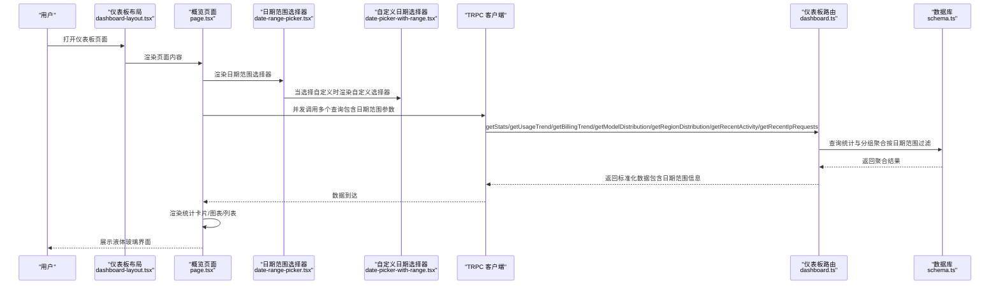

**图表来源**
- [仪表板概览页面](file://src/app/(dashboard)/page.tsx#L110-L115)
- [日期范围选择器组件:47-50](file://src/components/date-range-picker.tsx#L47-L50)
- [自定义日期范围选择器组件:30-39](file://src/components/date-picker-with-range.tsx#L30-L39)
- [仪表板服务端路由:513-573](file://src/server/api/routers/dashboard.ts#L513-L573)

**章节来源**
- [仪表板概览页面](file://src/app/(dashboard)/page.tsx#L110-L115)
- [仪表板服务端路由:513-573](file://src/server/api/routers/dashboard.ts#L513-L573)

## 详细组件分析

### 布局与导航架构
- **液体玻璃侧边栏**：采用"液体玻璃"风格，包含品牌标识与导航项；当前路由高亮，支持图标与文字，使用 `backdrop-blur-2xl` 和 `bg-white/70 dark:bg-black/40` 实现毛玻璃效果。
- **液体玻璃头部**：顶部工具栏采用液体玻璃设计，包含主题切换按钮和用户头像系统。
- **液体玻璃内容区**：主内容区包含固定顶部工具栏（标题、主题切换、用户头像），内容区滚动，所有卡片均采用液体玻璃设计。
- **主题切换**：通过本地存储持久化，并监听系统偏好以初始化。

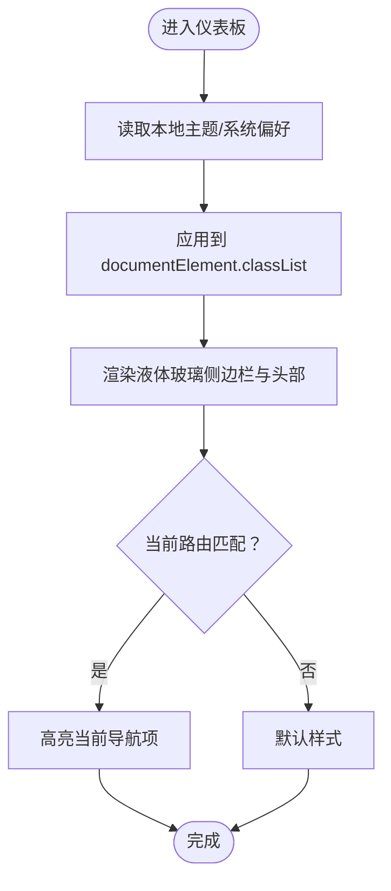

**图表来源**
- [仪表板布局组件:56-90](file://src/components/dashboard-layout.tsx#L56-L90)
- [仪表板布局组件:94-123](file://src/components/dashboard-layout.tsx#L94-L123)

**章节来源**
- [仪表板布局组件:53-197](file://src/components/dashboard-layout.tsx#L53-L197)

### 用户头像系统替代通知图标
**更新** 顶部工具栏右侧的用户头像系统已完全替代原有的通知图标按钮，提供现代化的用户身份识别与交互入口。

- 用户头像采用圆形渐变背景设计，使用从主色调到紫色的渐变效果
- 显示用户首字母作为占位符，支持点击展开用户菜单
- 与主题系统无缝集成，在深色模式下保持良好的对比度
- 位置固定在工具栏右侧，与主题切换按钮并列显示
- 采用液体玻璃设计，使用 `backdrop-blur-sm` 和 `bg-gradient-to-br` 类

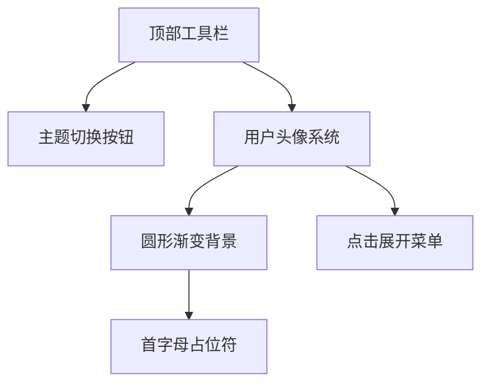

**图表来源**
- [仪表板布局组件:142-186](file://src/components/dashboard-layout.tsx#L142-L186)

**章节来源**
- [仪表板布局组件:142-186](file://src/components/dashboard-layout.tsx#L142-L186)

### 统计卡片组件
- **液体玻璃设计**：采用 `rounded-2xl p-6 backdrop-blur-xl bg-white/50 dark:bg-black/25` 实现毛玻璃效果，支持悬停动画和缩放效果。
- 接收指标值、变化量与趋势方向，动态计算变化颜色与百分比显示。
- 支持数值格式化（千/百万单位缩写）与加载骨架屏。
- 使用渐变背景与图标增强视觉层次。

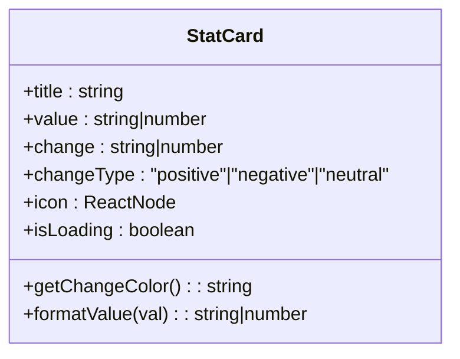

**图表来源**
- [统计卡片组件](file://src/app/(dashboard)/components/stat-card.tsx#L5-L12)
- [统计卡片组件](file://src/app/(dashboard)/components/stat-card.tsx#L17-L26)

**章节来源**
- [统计卡片组件](file://src/app/(dashboard)/components/stat-card.tsx#L1-L76)

### 用量趋势图表样式全面升级
**更新** 用量趋势图表经历了全面的样式改进，包括tooltip样式、图例、网格布局、坐标轴、线条样式等重大视觉升级。

- **深色模式适配**：完全支持深色模式自动切换，使用主题配置对象动态设置颜色
- **Tooltip 样式**：采用半透明背景色，带阴影效果，支持深浅色主题适配
- **图例配置**：支持左右布局，自适应主题颜色，提升可读性
- **网格布局**：优化内外边距，支持标签包含，提供更好的空间利用
- **坐标轴样式**：改进刻度线、标签旋转角度与间距，增强可读性
- **线条样式**：使用平滑曲线连接点，添加阴影效果，支持渐变填充
- **主题适配**：完全支持深浅色主题切换，自动调整颜色配置

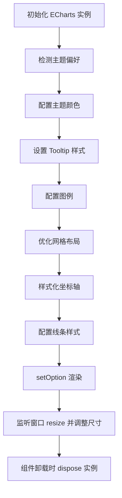

**图表来源**
- [用量趋势图表组件](file://src/app/(dashboard)/components/usage-trend-chart.tsx#L20-L302)

**章节来源**
- [用量趋势图表组件](file://src/app/(dashboard)/components/usage-trend-chart.tsx#L1-L323)

### 账单趋势图表组件
**新增** 账单趋势图表组件提供费用与 Token 消耗双重维度的趋势分析，支持深色模式自动适配。

- **双重维度分析**：同时展示费用（美元）与 Token 消耗趋势，使用左右双 Y 轴实现
- **深色模式适配**：完全支持深色模式自动切换，使用主题配置对象动态设置颜色
- **Tooltip 样式**：采用半透明背景色，带阴影效果，支持深浅色主题适配
- **图例配置**：支持左右布局，自适应主题颜色，提升可读性
- **网格布局**：优化内外边距，支持标签包含，提供更好的空间利用
- **坐标轴样式**：改进刻度线、标签旋转角度与间距，增强可读性
- **线条样式**：使用平滑曲线连接点，添加阴影效果，支持渐变填充
- **主题适配**：完全支持深浅色主题切换，自动调整颜色配置

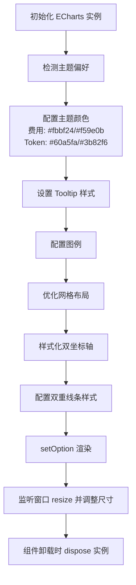

**图表来源**
- [账单趋势图表组件](file://src/app/(dashboard)/components/billing-trend-chart.tsx#L44-L89)
- [账单趋势图表组件](file://src/app/(dashboard)/components/billing-trend-chart.tsx#L206-L245)

**章节来源**
- [账单趋势图表组件](file://src/app/(dashboard)/components/billing-trend-chart.tsx#L1-L347)

### 模型分布饼图
- **双模式切换**：支持 Token 占比和请求次数两种模式，通过 Tabs 组件实现切换。
- 计算总请求次数，按 Token 消耗占比生成饼图与图例。
- Tooltip 动态格式化展示模型名、请求次数、Token 消耗与占比。
- 无数据时显示提示文案。

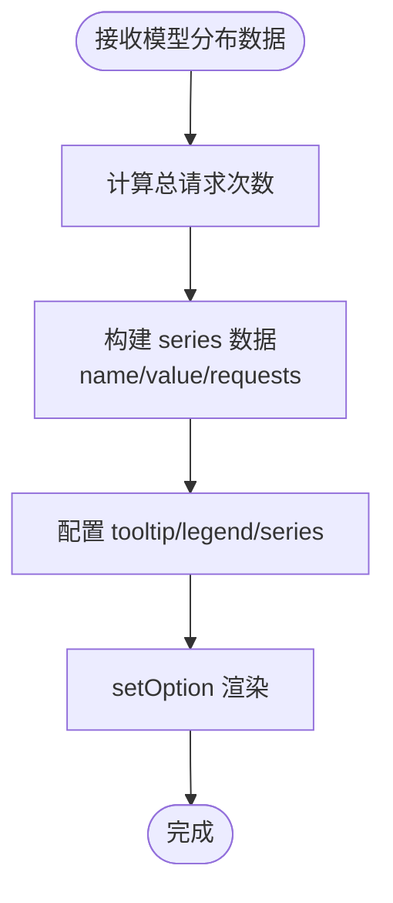

**图表来源**
- [模型分布饼图组件](file://src/app/(dashboard)/components/model-distribution-chart.tsx#L44-L115)

**章节来源**
- [模型分布饼图组件](file://src/app/(dashboard)/components/model-distribution-chart.tsx#L1-L147)

### 地区热力地图
- **异步地图加载**：首次渲染时异步拉取中国地图 GeoJSON 注册到 ECharts。
- **视觉映射系统**：使用 visualMap 控制颜色深浅，强调状态下高亮并显示标签。
- **错误处理**：加载态、错误态、空数据态分别处理，提供友好的用户反馈。
- **液体玻璃容器**：地图容器采用液体玻璃设计，提升视觉一致性。

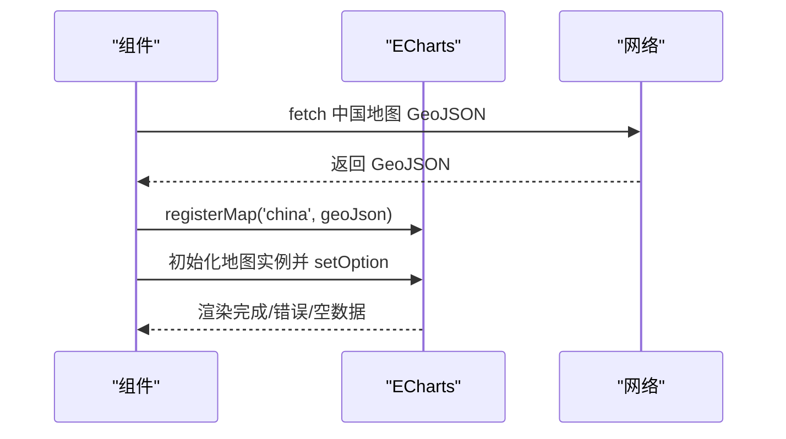

**图表来源**
- [地区热力地图组件](file://src/app/(dashboard)/components/region-heatmap-chart.tsx#L26-L59)
- [地区热力地图组件](file://src/app/(dashboard)/components/region-heatmap-chart.tsx#L61-L150)

**章节来源**
- [地区热力地图组件](file://src/app/(dashboard)/components/region-heatmap-chart.tsx#L1-L175)

### 最近活动列表
- 列表容器根据 isLoading 渲染骨架屏或空状态。
- 条目组件支持相对时间格式化与提供商徽标颜色映射。
- 详情字段可选展示模型、提供商与 Token 数。

```mermaid
classDiagram
class RecentActivity {
+activities : ActivityItem[]
+isLoading : boolean
+render() : ReactNode
}
class ActivityItem {
+id : string
+description : string
+time : string
+details? : {model, provider, tokens, cost}
+formatTime(timeStr) : string
+getProviderColor(provider?) : string
}
RecentActivity --> ActivityItem : "渲染列表"
```

**图表来源**
- [最近活动列表容器](file://src/app/(dashboard)/components/recent-activity.tsx#L12-L50)
- [最近活动条目组件](file://src/app/(dashboard)/components/activity-item.tsx#L17-L84)

**章节来源**
- [最近活动列表容器](file://src/app/(dashboard)/components/recent-activity.tsx#L1-L53)
- [最近活动条目组件](file://src/app/(dashboard)/components/activity-item.tsx#L1-L87)

### 最近 IP 请求表格
- 支持分页（每页 10 条），页码省略号策略。
- 时间列相对化显示（刚刚/分钟前/小时前/天前）。
- 提供商列按不同提供商着色区分。
- 加载态使用骨架屏，空数据态友好提示。

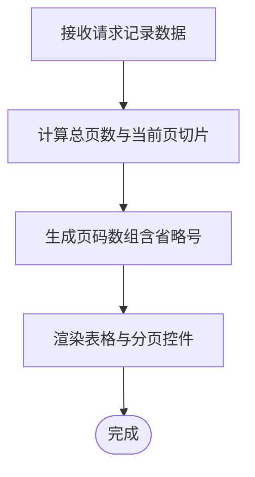

**图表来源**
- [最近 IP 请求表格组件](file://src/app/(dashboard)/components/recent-ip-requests.tsx#L35-L68)
- [最近 IP 请求表格组件](file://src/app/(dashboard)/components/recent-ip-requests.tsx#L136-L234)

**章节来源**
- [最近 IP 请求表格组件](file://src/app/(dashboard)/components/recent-ip-requests.tsx#L1-L225)

### 数据展示策略与实时性
- 页面首次加载时并发触发多个查询，使用独立的 loading 状态控制各区块渲染。
- 图表组件在数据就绪后初始化渲染，窗口变化时自动 resize。
- 活动与 IP 请求列表支持骨架屏与空状态，提升弱网体验。
- 仪表板路由在服务端进行聚合计算，减少前端复杂度。
- **新增的日期范围查询支持实时更新，用户选择不同日期范围时自动重新查询数据**。
- **新增的 getBillingTrend API 端点提供费用趋势分析，支持与用量趋势并行展示**。

**章节来源**
- [仪表板概览页面](file://src/app/(dashboard)/page.tsx#L72-L115)
- [仪表板服务端路由:513-573](file://src/server/api/routers/dashboard.ts#L513-L573)

## 液体玻璃美学系统

### 设计理念
AIGate 仪表板采用了全新的液体玻璃美学系统，通过毛玻璃效果、渐变色彩和柔和阴影营造现代、优雅的视觉体验。该系统贯穿整个界面设计，从侧边栏到内容卡片，从工具栏到图表容器。

### 核心设计元素

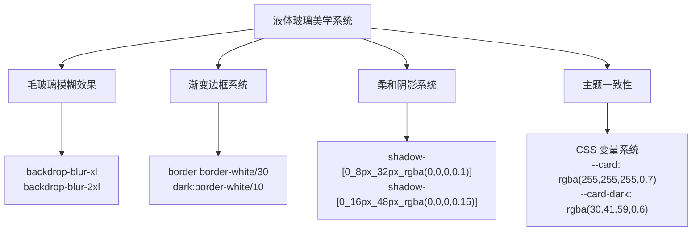

**图表来源**
- [仪表板概览页面](file://src/app/(dashboard)/page.tsx#L117-L253)
- [仪表板布局组件:94-189](file://src/components/dashboard-layout.tsx#L94-L189)
- [全局样式与玻璃拟态变量:5-51](file://src/app/globals.css#L5-L51)

### 液体玻璃应用范围

#### 侧边栏设计
- 使用 `backdrop-blur-2xl bg-white/70 dark:bg-black/40` 实现毛玻璃效果
- 渐变边框 `border border-white/20 dark:border-white/10` 提供柔和边界
- 阴影 `shadow-[4px_0_24px_rgba(0,0,0,0.08)]` 增强立体感

#### 头部工具栏设计
- 使用 `backdrop-blur-2xl bg-white/60 dark:bg-black/30` 实现半透明效果
- 渐变边框 `border border-white/20 dark:border-white/10` 保持一致性
- 阴影 `shadow-[0_4px_24px_rgba(0,0,0,0.06)]` 提供悬浮感

#### 内容卡片设计
- 使用 `backdrop-blur-xl bg-white/50 dark:bg-black/25` 实现卡片效果
- 渐变边框 `border border-white/30 dark:border-white/10` 提供层次感
- 阴影 `shadow-[0_8px_32px_rgba(0,0,0,0.1),inset_0_1px_0_rgba(255,255,255,0.4)]` 增强立体感
- 悬停效果 `hover:shadow-[0_12px_48px_rgba(0,0,0,0.15)]` 提供交互反馈

**章节来源**
- [仪表板概览页面](file://src/app/(dashboard)/page.tsx#L117-L253)
- [仪表板布局组件:94-189](file://src/components/dashboard-layout.tsx#L94-L189)
- [全局样式与玻璃拟态变量:5-51](file://src/app/globals.css#L5-L51)

## 响应式布局设计

### 四列响应式网格系统
**更新** 仪表板从传统的两列布局重构为四列响应式设计，提供更灵活的内容排列和更好的用户体验。

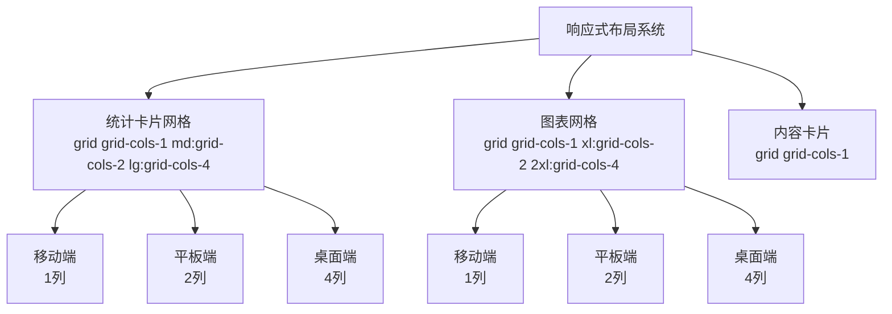

**图表来源**
- [仪表板概览页面](file://src/app/(dashboard)/page.tsx#L205-L236)

### 布局断点策略

#### 统计卡片网格
- **移动端** (`grid-cols-1`)：单列布局，适合小屏幕设备
- **平板端** (`md:grid-cols-2`)：双列布局，充分利用中等屏幕
- **桌面端** (`lg:grid-cols-4`)：四列布局，最大化信息密度

#### 图表网格
- **移动端** (`grid-cols-1`)：单列布局，确保图表可读性
- **平板端** (`xl:grid-cols-2`)：双列布局，避免拥挤
- **桌面端** (`2xl:grid-cols-4`)：四列布局，平衡信息密度和可读性

#### 内容卡片
- **全尺寸** (`grid-cols-1`)：单列布局，确保内容完整性

**章节来源**
- [仪表板概览页面](file://src/app/(dashboard)/page.tsx#L205-L236)

## 深色模式支持

### 主题系统架构
**更新** 通过 CSS 变量和主题切换实现完整的深色模式体验，支持系统偏好检测和手动切换。

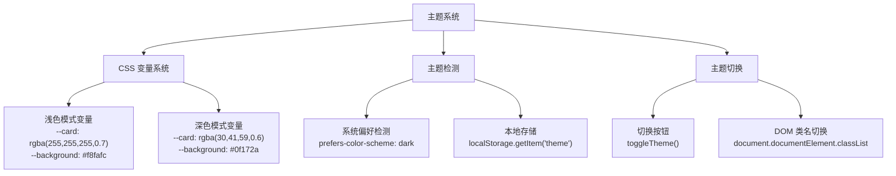

**图表来源**
- [仪表板布局组件:56-90](file://src/components/dashboard-layout.tsx#L56-L90)
- [全局样式与玻璃拟态变量:88-129](file://src/app/globals.css#L88-L129)

### 液体玻璃主题适配
- **卡片背景**：浅色模式使用 `rgba(255,255,255,0.7)`，深色模式使用 `rgba(30,41,59,0.6)`
- **边框颜色**：浅色模式使用 `rgba(203,213,225,0.4)`，深色模式使用 `rgba(255,255,255,0.1)`
- **阴影效果**：浅色模式使用 `rgba(0,0,0,0.08)`，深色模式使用 `rgba(0,0,0,0.4)`
- **文本颜色**：浅色模式使用 `#0f172a`，深色模式使用 `#f1f5f9`

### 图表深色模式适配
- **背景透明**：使用透明背景确保液体玻璃效果
- **文本颜色**：浅色模式使用 `#374151`，深色模式使用 `#e5e7eb`
- **坐标轴颜色**：浅色模式使用 `#6b7280`，深色模式使用 `#4b5563`
- **网格颜色**：浅色模式使用 `#f3f4f6`，深色模式使用 `#374151`
- **系列颜色**：浅色模式使用 `#3b82f6` 和 `#10b981`，深色模式使用 `#60a5fa` 和 `#34d399`

**章节来源**
- [仪表板布局组件:56-90](file://src/components/dashboard-layout.tsx#L56-L90)
- [全局样式与玻璃拟态变量:88-129](file://src/app/globals.css#L88-L129)
- [用量趋势图表组件](file://src/app/(dashboard)/components/usage-trend-chart.tsx#L44-L89)
- [账单趋势图表组件](file://src/app/(dashboard)/components/billing-trend-chart.tsx#L44-L89)

## 日期范围查询功能

### 功能概述
**新增的动态日期范围查询功能**为用户提供了灵活的数据查询能力，支持预设日期范围和精确的自定义日期范围选择。该功能通过两个核心组件实现：DateRangePicker 和 CustomDateRangePicker。

### 组件架构

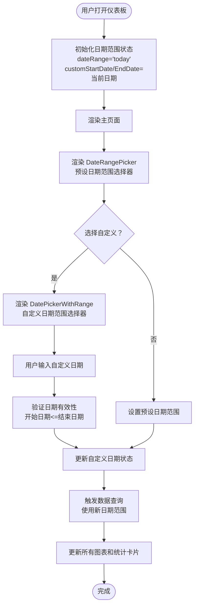

**图表来源**
- [仪表板概览页面](file://src/app/(dashboard)/page.tsx#L20-L70)
- [日期范围选择器组件:47-50](file://src/components/date-range-picker.tsx#L47-L50)
- [自定义日期范围选择器组件:30-39](file://src/components/date-picker-with-range.tsx#L30-L39)

### DateRangePicker 组件

DateRangePicker 是一个预设日期范围选择器，提供以下预设选项：
- 今日（today）
- 昨日（yesterday）  
- 近7天（7days）
- 近30天（30days）
- 自定义（custom）

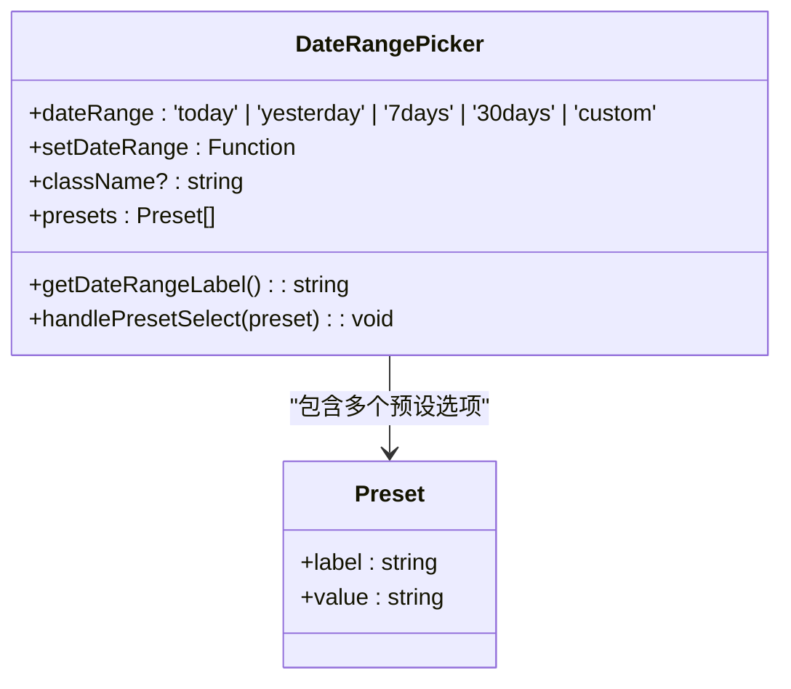

**图表来源**
- [日期范围选择器组件:9-13](file://src/components/date-range-picker.tsx#L9-L13)
- [日期范围选择器组件:22-28](file://src/components/date-range-picker.tsx#L22-L28)

### DatePickerWithRange 组件

DatePickerWithRange 提供精确的日期范围选择功能，包含以下特性：
- 基于 react-day-picker 的高级日期选择器
- 支持范围选择和多月显示
- 液体玻璃设计，使用 `backdrop-blur-lg` 和 `bg-white/40 dark:bg-white/5`
- 渐变边框和阴影效果
- 中文本地化支持

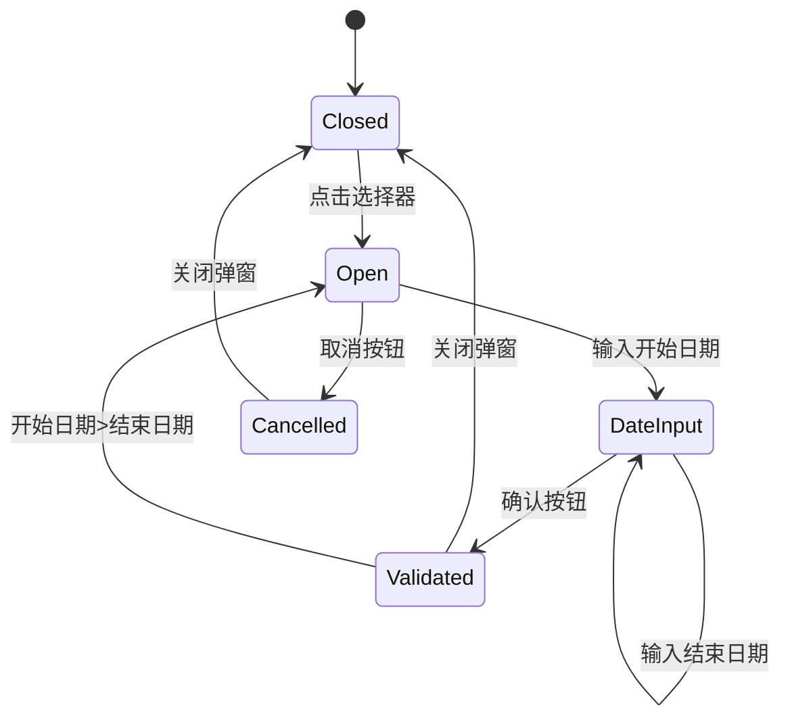

**图表来源**
- [自定义日期范围选择器组件:16-21](file://src/components/date-picker-with-range.tsx#L16-L21)
- [自定义日期范围选择器组件:89-91](file://src/components/date-picker-with-range.tsx#L89-L91)

### 服务端 API 增强

dashboard 路由器的所有统计方法都得到了增强，支持可选的 startDate 和 endDate 参数：

#### getStats 方法增强
- 支持可选的 startDate 和 endDate 参数
- 默认使用当天日期范围（00:00:00 到 23:59:59）
- 自动计算对比时间段用于增长趋势分析

#### getUsageTrend、getBillingTrend、getModelDistribution、getRegionDistribution 方法增强
- 支持可选的 startDate 和 endDate 参数
- 支持可选的 days 参数（默认7/30天）
- 根据日期范围动态计算统计结果
- **新增 getBillingTrend 方法提供费用趋势分析**

**章节来源**
- [仪表板概览页面](file://src/app/(dashboard)/page.tsx#L72-L115)
- [日期范围选择器组件:1-88](file://src/components/date-range-picker.tsx#L1-L88)
- [自定义日期范围选择器组件:1-92](file://src/components/date-picker-with-range.tsx#L1-L92)
- [仪表板服务端路由:513-573](file://src/server/api/routers/dashboard.ts#L513-L573)

## 依赖关系分析
- 页面依赖 TRPC Provider 发起查询，服务端路由依赖 Drizzle ORM 访问 Postgres。
- 图表组件依赖 ECharts，需在浏览器端初始化。
- 样式依赖 Tailwind 与 CSS 变量，主题切换通过类名控制。
- **日期范围选择器组件依赖 UI 组件库的 Popover、Button、Calendar 等组件**。
- **液体玻璃效果依赖 CSS 变量系统和 Tailwind 配置**。

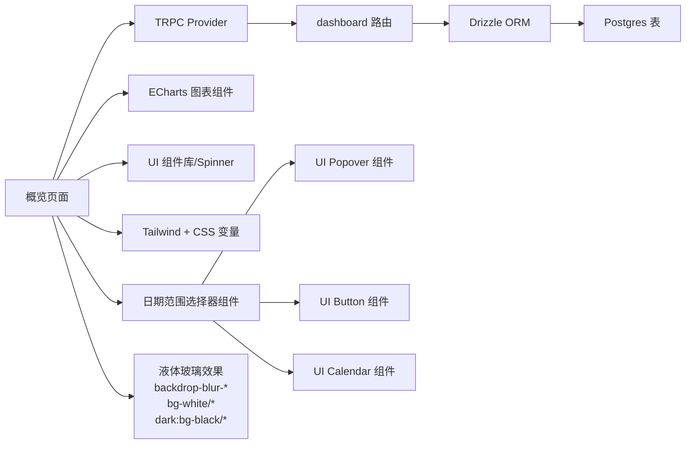

**图表来源**
- [仪表板概览页面](file://src/app/(dashboard)/page.tsx#L1-L14)
- [日期范围选择器组件:4-6](file://src/components/date-range-picker.tsx#L4-L6)
- [自定义日期范围选择器组件:4-6](file://src/components/date-picker-with-range.tsx#L4-L6)
- [仪表板服务端路由:1-7](file://src/server/api/routers/dashboard.ts#L1-L7)

**章节来源**
- [仪表板概览页面](file://src/app/(dashboard)/page.tsx#L1-L14)
- [仪表板服务端路由:1-7](file://src/server/api/routers/dashboard.ts#L1-L7)

## 性能考量
- 并发查询：页面一次性触发多个查询，减少往返次数，但需注意服务端聚合与数据库索引。
- 图表懒加载：仅在数据就绪且容器存在时初始化，避免无效渲染。
- 内存释放：图表组件在卸载时 dispose 实例，防止内存泄漏。
- 骨架屏：在加载阶段使用骨架屏替代真实内容，改善感知性能。
- **液体玻璃性能优化**：使用 CSS 变量和硬件加速，避免频繁重绘。
- **深色模式切换**：本地存储与 DOM 类名切换成本低，避免频繁重绘。
- **响应式布局**：合理使用 Tailwind 断点与网格，避免过度重排。
- **日期范围变更优化**：使用防抖机制避免频繁的 API 调用，合理缓存查询结果。
- **账单趋势图表优化**：双重 Y 轴设计减少图表数量，提升渲染性能。

## 故障排查指南
- 图表不显示或空白
  - 检查容器是否挂载与尺寸是否有效。
  - 确认数据非空且格式正确。
  - 查看地图组件的 GeoJSON 加载错误日志。
- 地图加载失败
  - 网络请求失败或跨域问题导致无法注册地图。
  - 组件内已提供错误态提示，可定位问题来源。
- 数据为空
  - 服务端路由按时间范围与条件过滤，确认数据库中是否存在对应记录。
- 主题切换异常
  - 检查本地存储键值与系统偏好匹配逻辑。
  - 确保 DOM 上存在 dark 类名。
- 用户头像显示异常
  - 检查渐变背景样式是否正确应用。
  - 确认首字母占位符是否正常显示。
- **液体玻璃效果异常**
  - 检查 CSS 变量是否正确加载。
  - 确认 backdrop-blur-* 类是否生效。
  - 验证容器是否有正确的背景色。
- **响应式布局异常**
  - 检查 Tailwind 断点类是否正确应用。
  - 确认网格容器的响应式类名。
  - 验证浏览器对 CSS Grid 的支持。
- **日期范围选择异常**
  - 检查日期验证逻辑，确保开始日期不大于结束日期。
  - 确认自定义日期选择器的状态同步。
  - 验证 API 查询参数传递是否正确。
- **API 查询失败**
  - 检查服务端路由的日期范围参数解析。
  - 确认数据库查询条件中的日期范围过滤。
  - 验证对比时间段计算逻辑。
- **账单趋势图表异常**
  - 检查费用数据是否正确解析为浮点数。
  - 确认双重 Y 轴配置是否正确。
  - 验证 Token 消耗数据格式化逻辑。

**章节来源**
- [地区热力地图组件](file://src/app/(dashboard)/components/region-heatmap-chart.tsx#L146-L160)
- [仪表板服务端路由:568-573](file://src/server/api/routers/dashboard.ts#L568-L573)
- [仪表板布局组件:56-90](file://src/components/dashboard-layout.tsx#L56-L90)
- [自定义日期范围选择器组件:89-91](file://src/components/date-picker-with-range.tsx#L89-L91)
- [账单趋势图表组件](file://src/app/(dashboard)/components/billing-trend-chart.tsx#L560-L566)

## 结论
AIGate 仪表板概览页面通过清晰的布局分层、模块化的组件设计与服务端聚合统计，实现了高效、美观且具备良好可维护性的数据可视化界面。**全新的液体玻璃美学系统为整个界面提供了统一的视觉语言，四列响应式布局设计提升了内容展示的灵活性，增强的深色模式支持和图表主题配置提供了完整的用户体验**。**新增的自定义日期范围查询功能显著提升了用户体验，用户现在可以灵活选择任意日期范围进行数据分析**。**新增的账单趋势图表组件提供了费用与 Token 消耗的双重维度分析，为用户提供了更全面的成本洞察**。结合现代化的用户头像系统、全面升级的图表样式、主题持久化、骨架屏与响应式布局，以及直观的日期选择界面，显著提升了弱网与移动端体验。后续可在数据刷新策略、图表交互与权限细化方面进一步优化。

## 附录
- 类型定义参考：仪表板统计、活动项、趋势与分布数据结构。
- 数据库表结构参考：用量记录、用户、API 密钥、配额策略等。
- **新增组件参考**：DateRangePicker、DatePickerWithRange、BillingTrendChart 和液体玻璃效果的完整实现与使用示例。

**章节来源**
- [仪表板类型定义:1-48](file://src/types/dashboard.ts#L1-L48)
- [数据库表结构定义:54-67](file://src/lib/schema.ts#L54-L67)
- [日期范围选择器组件:1-88](file://src/components/date-range-picker.tsx#L1-L88)
- [自定义日期范围选择器组件:1-92](file://src/components/date-picker-with-range.tsx#L1-L92)
- [账单趋势图表组件](file://src/app/(dashboard)/components/billing-trend-chart.tsx#L1-L347)