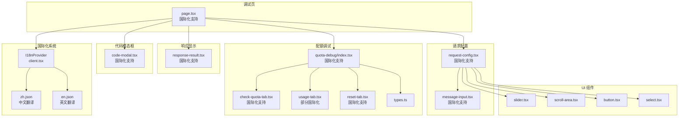
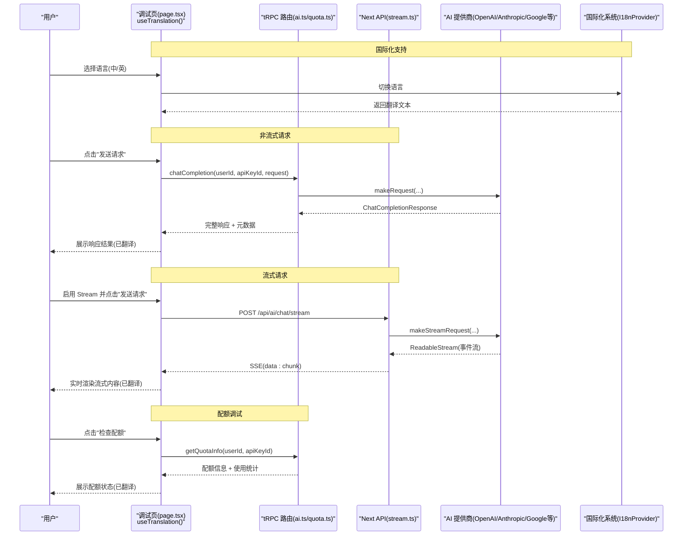
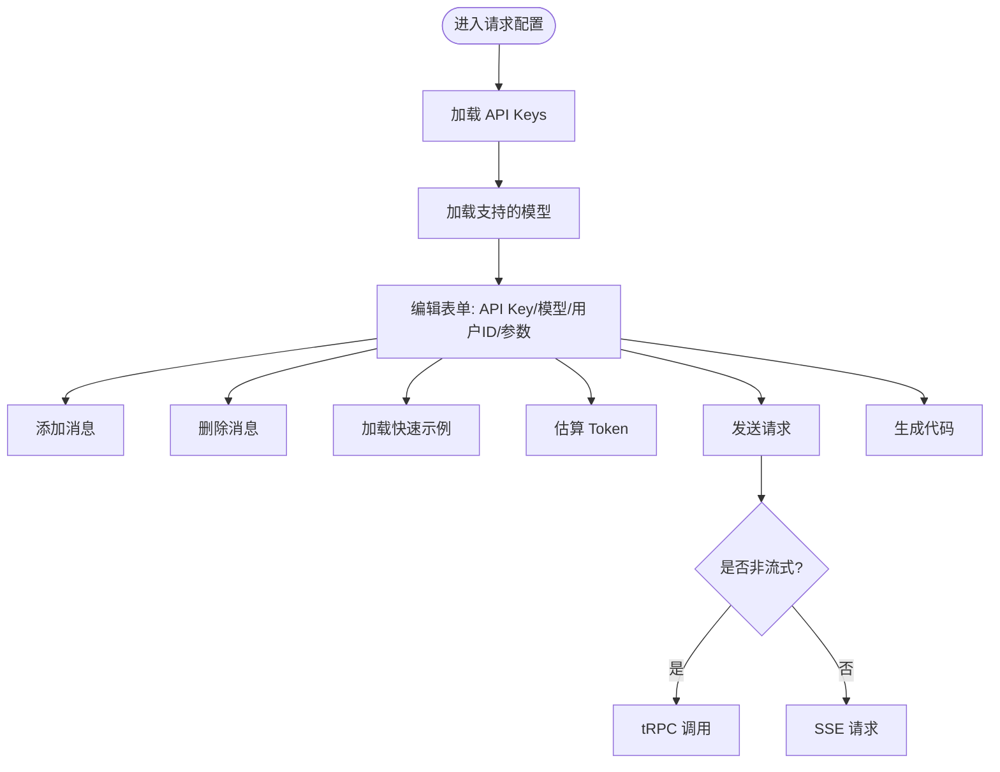
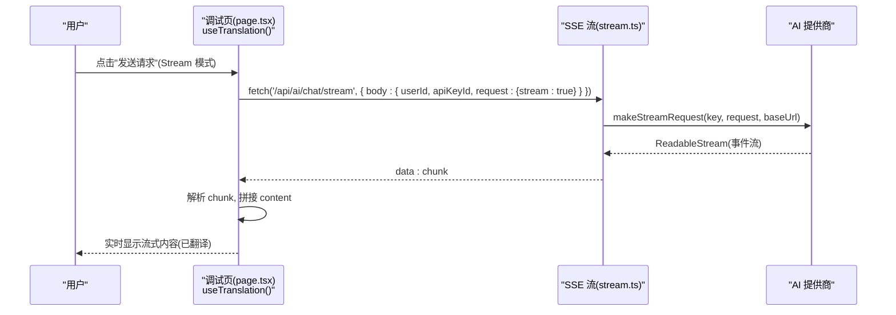
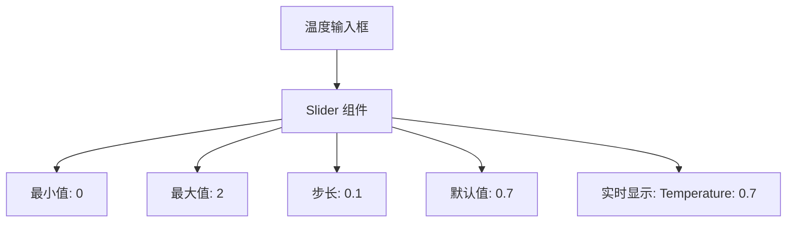
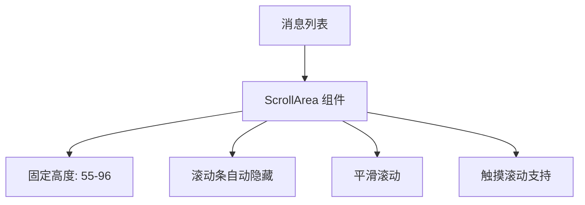
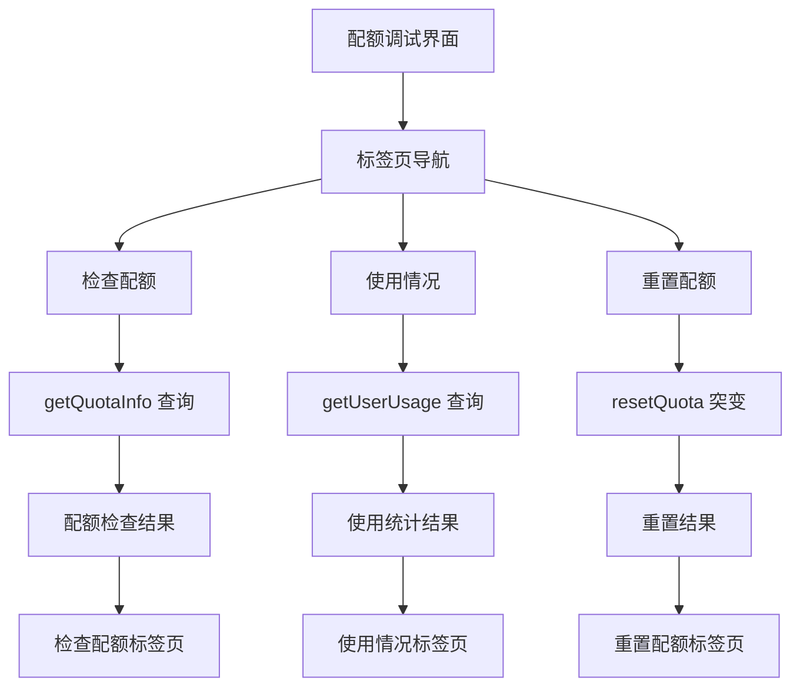
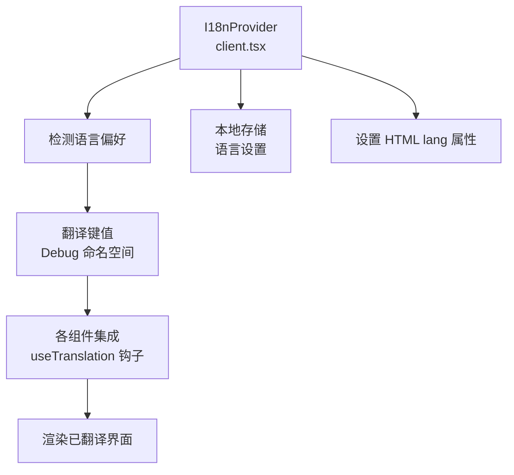
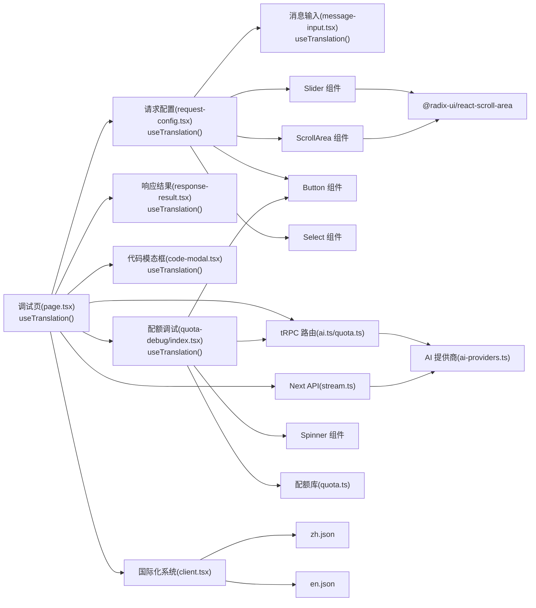

# 接口调试工具

<cite>
**本文引用的文件**
- [page.tsx](file://src/app/(dashboard)/debug/page.tsx)
- [request-config.tsx](file://src/app/(dashboard)/debug/components/request-config.tsx)
- [message-input.tsx](file://src/app/(dashboard)/debug/components/message-input.tsx)
- [response-result.tsx](file://src/app/(dashboard)/debug/components/response-result.tsx)
- [code-modal.tsx](file://src/app/(dashboard)/debug/components/code-modal.tsx)
- [quota-debug/index.tsx](file://src/app/(dashboard)/debug/components/quota-debug/index.tsx)
- [quota-debug/check-quota-tab.tsx](file://src/app/(dashboard)/debug/components/quota-debug/check-quota-tab.tsx)
- [quota-debug/usage-tab.tsx](file://src/app/(dashboard)/debug/components/quota-debug/usage-tab.tsx)
- [quota-debug/reset-tab.tsx](file://src/app/(dashboard)/debug/components/quota-debug/reset-tab.tsx)
- [quota-debug/types.ts](file://src/app/(dashboard)/debug/components/quota-debug/types.ts)
- [types.ts](file://src/app/(dashboard)/debug/components/types.ts)
- [client.tsx](file://src/i18n/client.tsx)
- [zh.json](file://src/messages/zh.json)
- [en.json](file://src/messages/en.json)
- [layout.tsx](file://src/app/layout.tsx)
- [slider.tsx](file://src/components/ui/slider.tsx)
- [scroll-area.tsx](file://src/components/ui/scroll-area.tsx)
- [button.tsx](file://src/components/ui/button.tsx)
- [select.tsx](file://src/components/ui/select.tsx)
- [ai-providers.ts](file://src/lib/ai-providers.ts)
- [stream.ts](file://src/pages/api/ai/chat/stream.ts)
- [ai.ts](file://src/server/api/routers/ai.ts)
- [quota.ts](file://src/lib/quota.ts)
- [quota.ts](file://src/server/api/routers/quota.ts)
- [spinner.tsx](file://src/components/ui/spinner.tsx)
- [globals.css](file://src/app/globals.css)
- [package.json](file://package.json)
</cite>

## 更新摘要
**变更内容**
- 新增全面的国际化支持，所有调试工具组件都已集成 `useTranslation` 钩子
- 新增中英文翻译文件，支持双语界面
- 国际化提供者在应用根布局中全局启用
- 配额调试界面完全支持国际化
- 请求配置、响应结果、消息输入、代码模态框等核心组件都已国际化

## 目录
1. [简介](#简介)
2. [项目结构](#项目结构)
3. [核心组件](#核心组件)
4. [架构总览](#架构总览)
5. [组件详解](#组件详解)
6. [UI 组件重构](#ui-组件重构)
7. [配额调试功能](#配额调试功能)
8. [国际化系统](#国际化系统)
9. [依赖关系分析](#依赖关系分析)
10. [性能与体验优化](#性能与体验优化)
11. [故障排查指南](#故障排查指南)
12. [结论](#结论)
13. [附录](#附录)

## 简介
本文件为 AIGate 接口调试工具的 UI 设计文档，聚焦于调试界面的整体架构与交互设计，涵盖消息输入区域、请求配置面板、响应结果显示、代码模态框和新增的配额调试界面四大模块；深入解释实时调试（流式响应）的实现路径、请求参数配置与响应格式化展示；阐述用户交互设计中的输入验证、错误提示与操作反馈；提供不同 AI 供应商的配置方法、参数设置与最佳实践；说明代码高亮显示、响应时间监控与调试历史记录的实现思路，并给出性能优化与用户体验改进建议。

**更新** 本次更新重点反映了全面的国际化改造，所有组件都已支持中英文双语界面，为全球用户提供本地化的调试体验。

## 项目结构
调试页面采用 Next.js App Router 的布局组织，核心位于调试页与七个子组件：
- 调试页负责状态管理、请求提交、流式响应处理、代码生成、配额调试和国际化支持
- 请求配置面板负责 API Key、模型、温度、最大 token、Stream 开关、消息列表与快速示例
- 消息输入组件负责系统/用户/助手角色与内容编辑
- 响应结果显示组件负责非流式与流式响应的展示、Token 统计与元数据
- 代码模态框负责生成 JS/Python/cURL 示例并支持一键复制
- **新增** 配额调试界面负责检查配额、使用情况统计和配额重置功能
- **新增** 国际化系统提供中英文双语支持



**图表来源**
- [page.tsx](file://src/app/(dashboard)/debug/page.tsx#L1-L374)
- [request-config.tsx](file://src/app/(dashboard)/debug/components/request-config.tsx#L1-L435)
- [message-input.tsx](file://src/app/(dashboard)/debug/components/message-input.tsx#L1-L65)
- [response-result.tsx](file://src/app/(dashboard)/debug/components/response-result.tsx#L1-L231)
- [code-modal.tsx](file://src/app/(dashboard)/debug/components/code-modal.tsx#L1-L54)
- [quota-debug/index.tsx](file://src/app/(dashboard)/debug/components/quota-debug/index.tsx#L1-L172)
- [quota-debug/check-quota-tab.tsx](file://src/app/(dashboard)/debug/components/quota-debug/check-quota-tab.tsx#L1-L151)
- [quota-debug/usage-tab.tsx](file://src/app/(dashboard)/debug/components/quota-debug/usage-tab.tsx#L1-L79)
- [quota-debug/reset-tab.tsx](file://src/app/(dashboard)/debug/components/quota-debug/reset-tab.tsx#L1-L77)
- [client.tsx:1-95](file://src/i18n/client.tsx#L1-L95)
- [zh.json:1-295](file://src/messages/zh.json#L1-L295)
- [en.json:1-295](file://src/messages/en.json#L1-L295)

**章节来源**
- [page.tsx](file://src/app/(dashboard)/debug/page.tsx#L1-L374)

## 核心组件
- 调试页（page.tsx）
  - 状态管理：本地存储持久化表单、响应、错误、估算 Token、生成代码、是否显示代码模态框、估算中状态
  - 请求处理：非流式通过 tRPC 调用；流式通过 /api/ai/chat/stream SSE
  - 代码生成：根据当前表单生成 JS/Python/cURL 示例
  - 估算 Token：基于字符长度简单估算
  - **新增** 国际化支持：使用 `useTranslation` 钩子提供中英文界面
  - **新增** 配额调试：集成 QuotaDebug 组件，提供配额管理调试功能
- 请求配置面板（request-config.tsx）
  - API Key 选择、模型输入与自动补全、用户 ID、Max Tokens、Temperature Slider、Stream 开关
  - 快速示例（简单对话、系统提示、多轮对话）、消息列表增删与编辑
  - 估算 Token、发送请求、生成代码
  - **新增** 国际化支持：所有标签、按钮、提示文本都支持中英文
- 消息输入（message-input.tsx）
  - 角色选择（system/user/assistant）、内容编辑、删除按钮
  - **新增** 国际化支持：角色选项和删除按钮使用翻译键
- 响应结果（response-result.tsx）
  - 错误提示、非流式响应正文、Token 统计、AIGate 元数据、原始 JSON 展示
  - 流式响应实时显示与完成后汇总
  - **新增** 国际化支持：标题、标签、统计项都支持中英文
- 代码模态框（code-modal.tsx）
  - 展示生成代码、复制到剪贴板、说明提示
  - **新增** 国际化支持：标题、按钮、说明文本都支持中英文
- **新增** 配额调试界面（quota-debug/index.tsx）
  - 标签页设计：检查配额、使用情况、重置配额
  - tRPC 集成：getQuotaInfo、getUserUsage、resetQuota
  - 实时状态管理：加载状态、错误处理、成功反馈
  - **新增** 国际化支持：所有标签页、按钮、状态信息都支持中英文
- **新增** 国际化系统（client.tsx）
  - 提供 `useTranslation` 钩子
  - 支持中英文切换
  - 本地存储语言偏好
  - 自动设置 HTML lang 属性

**章节来源**
- [page.tsx](file://src/app/(dashboard)/debug/page.tsx#L1-L374)
- [request-config.tsx](file://src/app/(dashboard)/debug/components/request-config.tsx#L1-L435)
- [message-input.tsx](file://src/app/(dashboard)/debug/components/message-input.tsx#L1-L65)
- [response-result.tsx](file://src/app/(dashboard)/debug/components/response-result.tsx#L1-L231)
- [code-modal.tsx](file://src/app/(dashboard)/debug/components/code-modal.tsx#L1-L54)
- [quota-debug/index.tsx](file://src/app/(dashboard)/debug/components/quota-debug/index.tsx#L1-L172)
- [client.tsx:1-95](file://src/i18n/client.tsx#L1-L95)

## 架构总览
调试工具整体采用"前端 UI + tRPC/Next API"的双通道架构，现已集成国际化系统：
- 非流式：前端通过 tRPC 调用后端路由，后端根据模型匹配提供商，调用对应 SDK 完成请求并返回完整响应
- 流式：前端直接发起 SSE 请求至 /api/ai/chat/stream，后端按提供商转换为统一的 OpenAI 格式事件流
- 代码生成：前端根据当前表单动态拼装 JS/Python/cURL 示例，支持复制
- **新增** 国际化：通过 I18nProvider 提供中英文翻译支持
- **新增** 配额调试：前端通过 tRPC 调用配额管理 API，提供完整的配额管理调试能力



**图表来源**
- [page.tsx](file://src/app/(dashboard)/debug/page.tsx#L16-L16)
- [ai.ts:85-193](file://src/server/api/routers/ai.ts#L85-L193)
- [stream.ts:88-129](file://src/pages/api/ai/chat/stream.ts#L88-L129)
- [quota.ts:40-86](file://src/server/api/routers/quota.ts#L40-L86)
- [client.tsx:79-86](file://src/i18n/client.tsx#L79-L86)

**章节来源**
- [page.tsx](file://src/app/(dashboard)/debug/page.tsx#L16-L16)
- [ai.ts:85-193](file://src/server/api/routers/ai.ts#L85-L193)
- [stream.ts:88-129](file://src/pages/api/ai/chat/stream.ts#L88-L129)
- [quota.ts:40-86](file://src/server/api/routers/quota.ts#L40-L86)
- [client.tsx:79-86](file://src/i18n/client.tsx#L79-L86)

## 组件详解

### 请求配置面板（RequestConfig）
- 功能要点
  - API Key 下拉选择（仅显示激活状态），模型输入与按提供商筛选的模型列表
  - 用户 ID、Max Tokens、Temperature Slider、Stream 复选框
  - 快速示例（简单对话、系统提示、多轮对话）
  - 消息列表：支持添加/删除消息，每个消息可选择角色与编辑内容
  - 估算 Token、发送请求、生成代码（JS/Python/cURL）
  - **新增** 国际化支持：所有标签、按钮、提示文本都支持中英文
- 输入验证与交互
  - 发送按钮在 API Key、模型与消息内容均有效时启用
  - 估算按钮在 API Key 存在时启用
  - 生成代码按钮在 API Key、模型与消息内容均有效时启用
- 数据流
  - 表单状态通过 useLocalStorageState 持久化
  - 通过 props 传递给子组件（消息输入）



**图表来源**
- [request-config.tsx](file://src/app/(dashboard)/debug/components/request-config.tsx#L54-L54)
- [request-config.tsx](file://src/app/(dashboard)/debug/components/request-config.tsx#L137-L139)
- [request-config.tsx](file://src/app/(dashboard)/debug/components/request-config.tsx#L350-L359)

**章节来源**
- [request-config.tsx](file://src/app/(dashboard)/debug/components/request-config.tsx#L1-L435)

### 消息输入（MessageInput）
- 功能要点
  - 角色下拉：system/user/assistant（已国际化）
  - 内容文本域（多行）
  - 删除按钮（当消息数量大于 1 时显示）
- 交互设计
  - 选择角色与编辑内容通过回调更新父级表单
  - 删除按钮仅在可删除状态下显示
  - **新增** 国际化支持：角色选项和删除按钮使用翻译键

**章节来源**
- [message-input.tsx](file://src/app/(dashboard)/debug/components/message-input.tsx#L1-L65)

### 响应结果（ResponseResult）
- 功能要点
  - 错误提示区域：红色背景，显示错误信息（已国际化）
  - 非流式响应：AI 回复正文、Token 统计（Prompt/Completion/Total）、AIGate 元数据（请求 ID、提供商、处理时间、剩余配额）
  - 原始 JSON：details 展开查看
  - 流式响应：实时渲染、完成后显示"已完成"提示
  - 无响应时：占位提示
  - **新增** 国际化支持：标题、标签、统计项都支持中英文
- 展示细节
  - 使用 monospace 字体与背景色区分内容区域
  - 使用网格布局展示 Token 统计，颜色区分 Prompt/Completion/Total

**章节来源**
- [response-result.tsx](file://src/app/(dashboard)/debug/components/response-result.tsx#L1-L231)

### 代码模态框（CodeModal）
- 功能要点
  - 展示生成的代码（JS/Python/cURL）
  - 复制到剪贴板按钮
  - 说明提示：强调通过 X-API-Key-ID 指定 API Key
  - **新增** 国际化支持：标题、按钮、说明文本都支持中英文
- 交互设计
  - 打开/关闭通过外部状态控制
  - 复制按钮异步写入剪贴板，异常时记录日志

**章节来源**
- [code-modal.tsx](file://src/app/(dashboard)/debug/components/code-modal.tsx#L1-L54)

### 调试页（page.tsx）
- 状态与持久化
  - 表单、响应、错误、估算 Token、生成代码、是否显示代码模态框、估算中状态均通过 useLocalStorageState 持久化
  - **新增** 国际化支持：页面标题、加载提示、错误信息都支持中英文
- 流式响应处理
  - 使用 fetch + ReadableStream + TextDecoder 解析 SSE
  - 逐行解析 data: 行，提取 choices[0].delta.content 并增量拼接
- 代码生成
  - 根据当前表单生成 JS/Python/cURL 示例，支持复制
- 请求提交
  - 非流式：tRPC 调用 chatCompletion
  - 流式：POST /api/ai/chat/stream
- **新增** 配额调试集成
  - 在页面底部集成 QuotaDebug 组件
  - 传入 userId 和 apiKeyId 状态供配额调试使用



**图表来源**
- [page.tsx](file://src/app/(dashboard)/debug/page.tsx#L232-L292)
- [stream.ts:88-129](file://src/pages/api/ai/chat/stream.ts#L88-L129)

**章节来源**
- [page.tsx](file://src/app/(dashboard)/debug/page.tsx#L1-L374)

## UI 组件重构

### Slider 组件重构（温度控制）
**更新** 温度控制从传统的数字输入框重构为 Radix UI 的 Slider 组件，提供更直观的滑动调节体验。

- **实现细节**
  - 使用 Radix UI 的 @radix-ui/react-slider 库
  - 支持 0-2 范围内的连续调节，步长为 0.1
  - 实时显示当前温度值（如 "Temperature: 0.7"）
  - 响应式设计，支持深色模式
- **交互特性**
  - 拖拽滑块实时更新温度值
  - 支持键盘导航（方向键微调）
  - 触觉反馈和视觉反馈
  - 默认值 0.7，符合常见 AI 模型的最佳实践
- **样式定制**
  - 自定义轨道样式（灰色背景）
  - 进度条样式（主色调）
  - 滑块样式（圆润设计，带边框）
  - 适配暗黑模式的颜色方案



**图表来源**
- [request-config.tsx](file://src/app/(dashboard)/debug/components/request-config.tsx#L262-L278)
- [slider.tsx:1-29](file://src/components/ui/slider.tsx#L1-L29)

### ScrollArea 组件重构（消息列表）
**更新** 消息列表显示重构为使用 Radix UI 的 ScrollArea 组件，显著增强滚动浏览体验。

- **实现细节**
  - 使用 Radix UI 的 @radix-ui/react-scroll-area 库
  - 固定高度容器（min-h-55, max-h-96）
  - 垂直滚动条，仅在需要时显示
  - 支持触摸设备的平滑滚动
- **布局优化**
  - 消息列表高度自适应内容
  - 滚动条宽度适中（2.5px），不影响整体布局
  - 滚动条颜色与主题一致
  - 支持鼠标滚轮和触摸滚动
- **用户体验**
  - 滚动时自动显示滚动条，隐藏时保持界面整洁
  - 支持快速跳转到顶部/底部
  - 平滑滚动动画
  - 移动端友好的触摸滚动体验



**图表来源**
- [request-config.tsx](file://src/app/(dashboard)/debug/components/request-config.tsx#L317-L341)
- [scroll-area.tsx:1-49](file://src/components/ui/scroll-area.tsx#L1-L49)

### 新增 UI 组件实现

#### Slider 组件实现
- **核心功能**
  - 受控组件，支持双向数据绑定
  - 自定义样式类名集成
  - 支持禁用状态
  - 键盘导航支持
- **样式系统**
  - 使用 cn 工具函数合并样式
  - 响应式设计，适配不同屏幕尺寸
  - 深色模式自动切换
  - 动画过渡效果

#### ScrollArea 组件实现
- **核心功能**
  - 滚动容器包装器
  - 自适应滚动条显示
  - 支持垂直和水平滚动
  - 视口内容区域
- **滚动条定制**
  - 可配置的方向（默认垂直）
  - 自定义宽度和高度
  - 边框和内边距样式
  - 滚动条拇指样式

**章节来源**
- [request-config.tsx](file://src/app/(dashboard)/debug/components/request-config.tsx#L18-L19)
- [slider.tsx:1-29](file://src/components/ui/slider.tsx#L1-L29)
- [scroll-area.tsx:1-49](file://src/components/ui/scroll-area.tsx#L1-L49)

## 配额调试功能

### 配额调试界面概述
**新增** 配额调试界面为开发者提供了完整的配额管理调试能力，包含三个核心功能模块：

- **检查配额**：实时检查用户是否有足够的配额进行请求
- **使用情况**：获取用户今日的使用统计和配额使用情况
- **重置配额**：重置用户今日的配额计数（谨慎操作）

### 组件架构设计
- **主组件**：QuotaDebug（index.tsx）
  - 标签页导航：检查配额、使用情况、重置配额（已国际化）
  - 状态管理：当前激活标签、用户 ID、API Key ID
  - tRPC 集成：getQuotaInfo、getUserUsage、resetQuota
  - **新增** 国际化支持：所有标签页、按钮、状态信息都支持中英文
- **子组件**：
  - CheckQuotaTab：配额检查功能（已国际化）
  - UsageTab：使用情况统计（部分国际化）
  - ResetTab：配额重置功能（已国际化）
- **数据类型**：QuotaDebugProps、CheckQuotaResult、GetUserUsageResult、ResetQuotaResult

### 配额检查功能（CheckQuotaTab）
- **功能特性**
  - 实时检查用户配额状态
  - 显示配额策略详情（每日限制、RPM 限制）
  - 展示剩余 Token 和请求次数
  - 支持查看完整响应数据
  - **新增** 国际化支持：所有文本都支持中英文
- **状态反馈**
  - 成功：绿色背景，显示允许状态和剩余配额
  - 警告：黄色背景，显示配额不足警告
  - 错误：红色背景，显示错误信息
- **数据展示**
  - 配额策略卡片：显示策略名称、限制类型、每日限制
  - 剩余配额统计：Token 剩余量、请求次数剩余
  - 详细响应：JSON 格式完整响应数据

### 使用情况统计（UsageTab）
- **功能特性**
  - 获取用户今日使用统计
  - 显示已用 Token 和今日请求数
  - 展示当前配额策略信息
  - 支持查看完整响应数据
  - **新增** 国际化支持：标题和统计项支持中英文
- **统计面板**
  - 已用 Token：居中显示数字，突出重要信息
  - 今日请求数：居中显示数字，便于对比
  - 策略信息：显示当前策略名称和限制类型
- **数据结构**
  - tokensUsed：今日已使用的 Token 数量
  - requestsToday：今日请求数量
  - policy：当前配额策略详情

### 配额重置功能（ResetTab）
- **功能特性**
  - 重置用户今日的配额计数
  - 确认对话框防止误操作
  - 成功/失败状态反馈
  - 销毁式按钮设计
  - **新增** 国际化支持：所有文本都支持中英文
- **安全机制**
  - 用户确认：重置操作需要二次确认
  - 权限验证：通过白名单规则验证用户身份
  - 错误处理：捕获并显示重置失败原因
- **状态反馈**
  - 成功：绿色背景，显示重置成功信息
  - 错误：红色背景，显示错误详情

### 数据类型定义
- **QuotaDebugProps**
  - userId：用户 ID（字符串）
  - apiKeyId：API Key ID（字符串）
- **CheckQuotaResult**
  - allowed：是否允许请求（布尔值）
  - reason：拒绝原因（字符串）
  - policy：配额策略信息（对象）
  - remainingTokens：剩余 Token 数量（数字）
  - remainingRequests：剩余请求次数（数字）
  - error：错误信息（字符串）
- **GetUserUsageResult**
  - tokensUsed：今日已用 Token（数字）
  - requestsToday：今日请求数（数字）
  - policy：当前策略（对象）
  - error：错误信息（字符串）
- **ResetQuotaResult**
  - success：重置是否成功（布尔值）
  - error：错误信息（字符串）

### tRPC 集成实现
- **getQuotaInfo（查询）**
  - 输入：userId、apiKeyId
  - 输出：配额策略、使用统计、剩余配额
  - 用途：检查用户配额状态
- **getUserUsage（查询）**
  - 输入：userId、apiKeyId
  - 输出：今日使用统计
  - 用途：获取使用情况数据
- **resetQuota（突变）**
  - 输入：userId、apiKeyId
  - 输出：重置结果
  - 用途：重置用户配额



**图表来源**
- [quota-debug/index.tsx](file://src/app/(dashboard)/debug/components/quota-debug/index.tsx#L19-L24)
- [quota-debug/check-quota-tab.tsx](file://src/app/(dashboard)/debug/components/quota-debug/check-quota-tab.tsx#L16-L22)
- [quota-debug/usage-tab.tsx](file://src/app/(dashboard)/debug/components/quota-debug/usage-tab.tsx#L8-L14)
- [quota-debug/reset-tab.tsx](file://src/app/(dashboard)/debug/components/quota-debug/reset-tab.tsx#L9-L15)

**章节来源**
- [quota-debug/index.tsx](file://src/app/(dashboard)/debug/components/quota-debug/index.tsx#L1-L172)
- [quota-debug/check-quota-tab.tsx](file://src/app/(dashboard)/debug/components/quota-debug/check-quota-tab.tsx#L1-L151)
- [quota-debug/usage-tab.tsx](file://src/app/(dashboard)/debug/components/quota-debug/usage-tab.tsx#L1-L79)
- [quota-debug/reset-tab.tsx](file://src/app/(dashboard)/debug/components/quota-debug/reset-tab.tsx#L1-L77)
- [quota-debug/types.ts](file://src/app/(dashboard)/debug/components/quota-debug/types.ts#L1-L37)

## 国际化系统

### 国际化架构设计
**新增** AIGate 调试工具现已全面支持中英文双语界面，通过独立的国际化系统实现：

- **国际化提供者**：I18nProvider（client.tsx）
  - 全局提供 `useTranslation` 钩子
  - 支持中英文切换（zh/en）
  - 本地存储语言偏好设置
  - 自动设置 HTML lang 属性
- **翻译键值**：Debug 命名空间
  - 包含所有调试相关的翻译键
  - 支持请求配置、响应结果、配额调试等模块
  - 提供统一的翻译结构
- **翻译文件**：zh.json 和 en.json
  - 完整的中英文翻译覆盖
  - 支持嵌套对象结构
  - 提供回退机制

### 国际化实现细节
- **useTranslation 钩子**：所有组件都已集成
  - 在组件顶部导入 `useTranslation` 钩子
  - 通过 `t()` 函数获取翻译文本
  - 支持嵌套路径访问（如 `t('Debug.requestConfig')`）
- **翻译键命名规范**：
  - 按功能模块分组（Debug、Common、Navigation 等）
  - 使用点号分隔层级结构
  - 保持键名简洁且具有描述性
- **回退机制**：
  - 未找到翻译键时返回键名本身
  - 对象类型的翻译值会给出警告
  - 控制台输出翻译缺失信息

### 支持的语言
- **简体中文**：zh.json
  - 完整覆盖调试工具的所有界面文本
  - 本地化的术语和表达方式
  - 符合中文用户的阅读习惯
- **English**：en.json  
  - 完整覆盖调试工具的所有界面文本
  - 英文标准的术语和表达方式
  - 符合英文用户的阅读习惯

### 语言切换机制
- **自动检测**：默认使用简体中文
- **用户偏好**：通过本地存储保存语言选择
- **HTML 属性**：自动设置 `lang="zh-CN"` 或 `lang="en"`
- **实时切换**：无需刷新页面即可切换语言



**图表来源**
- [client.tsx:53-93](file://src/i18n/client.tsx#L53-L93)
- [zh.json:203-293](file://src/messages/zh.json#L203-L293)
- [en.json:203-293](file://src/messages/en.json#L203-L293)

**章节来源**
- [client.tsx:1-95](file://src/i18n/client.tsx#L1-L95)
- [zh.json:1-295](file://src/messages/zh.json#L1-L295)
- [en.json:1-295](file://src/messages/en.json#L1-L295)

## 依赖关系分析
- 组件依赖
  - 调试页依赖请求配置、响应结果、代码模态框、**新增**配额调试与 UI 组件库（Button、Select、Spinner）
  - 请求配置依赖消息输入组件、Slider 组件、ScrollArea 组件
  - **新增** 配额调试依赖 tRPC 客户端、Button 组件、Spinner 组件
  - **新增** 所有组件都依赖国际化系统（useTranslation 钩子）
- 外部依赖
  - tRPC：用于非流式请求与查询模型列表、估算 Token、**新增**配额管理 API
  - Next API：用于流式请求（SSE）
  - AI 提供商：OpenAI、Anthropic、Google、DeepSeek、Moonshot、Spark
  - Radix UI：Slider 和 ScrollArea 组件的基础库
  - **新增** 国际化系统：I18nProvider 提供翻译支持
  - **新增** 本地存储：ahooks 提供持久化状态管理
- 数据类型
  - DebugRequestForm、ResponseData 在 types.ts 中定义，贯穿 UI 与服务端
  - **新增** QuotaDebugProps、CheckQuotaResult、GetUserUsageResult、ResetQuotaResult 在 quota-debug/types.ts 中定义
  - **新增** 翻译键值在 zh.json 和 en.json 中定义



**图表来源**
- [page.tsx](file://src/app/(dashboard)/debug/page.tsx#L1-L374)
- [request-config.tsx](file://src/app/(dashboard)/debug/components/request-config.tsx#L1-L435)
- [response-result.tsx](file://src/app/(dashboard)/debug/components/response-result.tsx#L1-L231)
- [code-modal.tsx](file://src/app/(dashboard)/debug/components/code-modal.tsx#L1-L54)
- [quota-debug/index.tsx](file://src/app/(dashboard)/debug/components/quota-debug/index.tsx#L1-L172)
- [client.tsx:1-95](file://src/i18n/client.tsx#L1-L95)
- [zh.json:1-295](file://src/messages/zh.json#L1-L295)
- [en.json:1-295](file://src/messages/en.json#L1-L295)

**章节来源**
- [ai.ts:1-301](file://src/server/api/routers/ai.ts#L1-L301)
- [quota.ts:1-220](file://src/server/api/routers/quota.ts#L1-L220)
- [stream.ts:1-167](file://src/pages/api/ai/chat/stream.ts#L1-L167)
- [ai-providers.ts:1-759](file://src/lib/ai-providers.ts#L1-L759)

## 性能与体验优化
- 性能优化
  - 流式响应：使用 ReadableStream + TextDecoder 分块解码，避免一次性缓冲大量数据
  - 估算 Token：前端简单估算，减少网络往返；后端提供精确估算接口（tRPC query）
  - 本地存储：useLocalStorageState 减少重复初始化与网络请求
  - UI 组件：Button、Select、Spinner 等使用轻量实现，避免不必要的重渲染
  - **新增** 国际化性能：翻译键值缓存，避免重复查找
  - **新增** 配额调试：使用 tRPC 查询缓存，避免重复请求相同数据
  - **新增** Slider 和 ScrollArea 组件：基于 Radix UI 的高性能实现，优化滚动性能
- 体验优化
  - 加载状态：Spinner 与禁用按钮提升反馈
  - 错误提示：红色背景与图标明确错误信息
  - 实时反馈：流式模式下实时渲染，完成时提示
  - 代码生成：一键复制，减少手动粘贴错误
  - 深色模式：CSS 自定义属性支持深色主题
  - **新增** 国际化体验：无缝语言切换，保持界面一致性
  - **新增** 配额调试：标签页导航提供清晰的功能分区
  - **新增** 状态反馈：不同状态使用不同颜色和图标提供直观反馈
  - **新增** Slider 组件：提供直观的温度调节体验
  - **新增** ScrollArea 组件：改善消息列表的滚动浏览体验

**章节来源**
- [page.tsx](file://src/app/(dashboard)/debug/page.tsx#L83-L101)
- [page.tsx](file://src/app/(dashboard)/debug/page.tsx#L232-L292)
- [quota-debug/index.tsx](file://src/app/(dashboard)/debug/components/quota-debug/index.tsx#L78-L82)
- [spinner.tsx:1-17](file://src/components/ui/spinner.tsx#L1-L17)
- [globals.css:1-125](file://src/app/globals.css#L1-L125)

## 故障排查指南
- 常见问题
  - API Key 无效或禁用：检查 API Key 状态与提供商匹配
  - 不支持的提供商/模型：确认模型前缀与提供商映射
  - 配额不足：查看剩余配额与使用统计
  - 流式响应失败：检查后端是否支持该提供商的流式接口
  - **新增** 国际化问题：检查翻译键是否存在，确认语言文件完整性
  - **新增** Slider 组件问题：检查 Radix UI 依赖是否正确安装
  - **新增** ScrollArea 组件问题：确认容器高度设置是否合理
  - **新增** 配额调试问题：检查 tRPC 连接状态和权限验证
  - **新增** 配额重置失败：确认用户有重置权限且 API Key 有效
- 错误处理
  - 前端：捕获异常并显示错误信息
  - tRPC：抛出 TRPCError，携带具体原因
  - Next API：返回 JSON 错误对象，包含错误详情
  - **新增** 国际化：翻译缺失时返回键名，控制台输出警告
  - **新增** 配额 API：检查 getQuotaInfo、getUserUsage、resetQuota 的错误处理
- 调试建议
  - 使用"查看原始响应 JSON"定位问题
  - 切换 Stream 与非流式模式对比差异
  - 逐步减少消息数量与参数范围缩小问题范围
  - **新增** 检查翻译键的命名规范和嵌套结构
  - **新增** 验证语言文件的完整性和一致性
  - **新增** 使用国际化调试工具检查翻译键的有效性
  - **新增** 检查 Slider 组件的值范围和步长设置
  - **新增** 验证 ScrollArea 组件的高度限制和滚动行为
  - **新增** 使用配额调试界面验证配额策略和使用情况
  - **新增** 通过重置功能测试配额系统的完整性

**章节来源**
- [ai.ts:105-154](file://src/server/api/routers/ai.ts#L105-L154)
- [stream.ts:30-76](file://src/pages/api/ai/chat/stream.ts#L30-L76)
- [response-result.tsx](file://src/app/(dashboard)/debug/components/response-result.tsx#L67-L86)
- [quota-debug/index.tsx](file://src/app/(dashboard)/debug/components/quota-debug/index.tsx#L58-L76)

## 结论
AIGate 接口调试工具通过清晰的组件划分与合理的前后端分离，实现了从参数配置到实时响应展示的完整闭环。流式响应与代码生成提升了调试效率，本地存储与深色主题增强了用户体验。本次 UI 组件重构进一步优化了用户交互体验，Slider 组件提供了直观的温度调节，ScrollArea 组件改善了消息列表的浏览体验。新增的配额调试功能为开发者提供了完整的配额管理调试能力，包括配额检查、使用统计和配额重置功能，显著提升了配额系统的可调试性和可观测性。

**重大更新** 本次国际化改造使 AIGate 调试工具支持中英文双语界面，所有组件都已集成 `useTranslation` 钩子，提供完整的本地化体验。这大大扩展了工具的全球适用性，为国际用户提供了更加友好的使用体验。

## 附录

### 使用指南与最佳实践
- 配置 API Key
  - 在"密钥管理"中添加并激活 API Key，调试时选择对应提供商与名称
- 选择模型
  - 根据所选 API Key 自动过滤支持的模型，优先选择与任务匹配的模型
- 参数设置
  - **更新** Temperature：使用 Slider 组件进行直观调节，默认值 0.7，支持 0-2 范围内的连续调节
  - Max Tokens：根据上下文长度合理设置，避免截断
  - Stream：开启后可实时看到输出，适合长文本生成
- **新增** 国际化使用指南
  - 页面顶部的语言切换按钮支持中英文切换
  - 翻译键值遵循命名空间结构，便于维护和扩展
  - 支持嵌套对象的翻译键，提供灵活的文本组织方式
- **新增** 配额调试使用指南
  - 在"检查配额"标签页中输入 User ID 和选择 API Key，点击"执行检查"
  - 在"使用情况"标签页查看用户今日的使用统计
  - 在"重置配额"标签页谨慎操作，重置前确认风险
- 最佳实践
  - 使用"系统提示"示例构建明确的角色设定
  - 控制消息轮次与长度，避免超出配额
  - 使用"估算 Token"预估消耗，合理规划预算
  - **新增** 利用国际化功能选择合适的语言环境
  - **新增** 定期检查配额状态，避免意外的配额耗尽
  - **新增** 使用 Slider 组件的实时反馈调整温度参数
  - **新增** 通过 ScrollArea 组件更好地管理长消息列表

**章节来源**
- [request-config.tsx](file://src/app/(dashboard)/debug/components/request-config.tsx#L89-L115)
- [request-config.tsx](file://src/app/(dashboard)/debug/components/request-config.tsx#L262-L278)
- [request-config.tsx](file://src/app/(dashboard)/debug/components/request-config.tsx#L317-L341)
- [quota-debug/index.tsx](file://src/app/(dashboard)/debug/components/quota-debug/index.tsx#L26-L76)

### 不同 AI 供应商配置方法
- OpenAI
  - 模型前缀：gpt-
  - 配置：使用 OpenAI API Key，支持流式与非流式
- Anthropic
  - 模型前缀：claude-
  - 配置：使用 x-api-key 头，支持流式与非流式
- Google
  - 模型前缀：gemini-
  - 配置：使用 API Key，支持流式与非流式
- DeepSeek/Moonshot/Spark
  - 模型前缀：deepseek-/moonshot-/spark-
  - 配置：使用 OpenAI 兼容 API，支持流式与非流式

**章节来源**
- [ai-providers.ts:688-707](file://src/lib/ai-providers.ts#L688-L707)

### 数据模型与类型
- DebugRequestForm
  - 字段：userId、apiKeyId、model、messages、temperature、max_tokens、stream
- ResponseData
  - 字段：id、object、created、model、choices、usage、aigate_metadata
- **新增** QuotaDebugProps
  - 字段：userId、apiKeyId
- **新增** CheckQuotaResult
  - 字段：allowed、reason、policy、remainingTokens、remainingRequests、error
- **新增** GetUserUsageResult
  - 字段：tokensUsed、requestsToday、policy、error
- **新增** ResetQuotaResult
  - 字段：success、error

**章节来源**
- [types.ts](file://src/app/(dashboard)/debug/components/types.ts#L1-L42)
- [quota-debug/types.ts](file://src/app/(dashboard)/debug/components/quota-debug/types.ts#L1-L37)

### UI 组件与样式
- 主题与样式
  - 使用 CSS 自定义属性实现浅色/深色主题切换
  - 卡片与弹窗采用玻璃效果（Glass）
- 交互组件
  - Button：多种变体与尺寸
  - Select：下拉选择器
  - Spinner：加载指示器
  - **新增** Slider：温度调节滑块
  - **新增** ScrollArea：滚动容器
  - **新增** 配额调试标签页：彩色状态反馈
- **新增** 国际化样式规范
  - 支持 RTL 语言的样式适配
  - 响应式字体大小调整
  - 无障碍访问支持
- **新增** 配额调试样式规范
  - 成功状态：绿色背景和图标
  - 警告状态：黄色背景和图标
  - 错误状态：红色背景和图标
  - 策略卡片：白色背景，灰色边框

**章节来源**
- [globals.css:1-125](file://src/app/globals.css#L1-L125)
- [button.tsx:1-58](file://src/components/ui/button.tsx#L1-L58)
- [select.tsx:1-152](file://src/components/ui/select.tsx#L1-L152)
- [spinner.tsx:1-17](file://src/components/ui/spinner.tsx#L1-L17)
- [slider.tsx:1-29](file://src/components/ui/slider.tsx#L1-L29)
- [scroll-area.tsx:1-49](file://src/components/ui/scroll-area.tsx#L1-L49)

### 组件实现细节

#### Slider 组件实现要点
- 使用 Radix UI 的受控组件模式
- 支持数组形式的值（[value]）
- 自定义样式类名集成
- 响应式设计和深色模式支持

#### ScrollArea 组件实现要点
- 嵌套结构：Root -> Viewport -> ScrollBar -> Thumb
- 支持垂直滚动条
- 自动显示/隐藏滚动条
- 触摸设备友好

#### **新增** 国际化系统实现要点
- I18nProvider 提供全局翻译上下文
- useTranslation 钩子支持嵌套路径访问
- 本地存储语言偏好设置
- HTML lang 属性自动更新
- 翻译键值的命名空间结构

#### **新增** 配额调试组件实现要点
- 标签页导航：使用按钮实现标签页切换
- 状态管理：使用 useState 管理当前激活标签
- tRPC 集成：使用 trpc.useQuery 和 trpc.useMutation
- 错误处理：统一的错误状态管理和用户反馈
- 安全机制：重置操作的确认对话框
- **新增** 国际化支持：所有文本都支持中英文

**章节来源**
- [slider.tsx:1-29](file://src/components/ui/slider.tsx#L1-L29)
- [scroll-area.tsx:1-49](file://src/components/ui/scroll-area.tsx#L1-L49)
- [client.tsx:1-95](file://src/i18n/client.tsx#L1-L95)
- [quota-debug/index.tsx](file://src/app/(dashboard)/debug/components/quota-debug/index.tsx#L11-L17)

### **新增** 国际化 API 使用示例
- **获取翻译文本**
  ```typescript
  const { t } = useTranslation();
  const buttonText = t('Debug.sendRequest'); // "发送请求" 或 "Send Request"
  ```
- **嵌套翻译键**
  ```typescript
  const quotaText = t('Debug.tabCheckQuota'); // 访问嵌套键值
  ```
- **语言切换**
  ```typescript
  const { setLocale } = useTranslation();
  setLocale('en'); // 切换到英文
  ```

**章节来源**
- [client.tsx:58-86](file://src/i18n/client.tsx#L58-L86)
- [page.tsx](file://src/app/(dashboard)/debug/page.tsx#L16-L16)

### **新增** 配额调试 API 使用示例
- **检查配额**
  ```typescript
  const quotaInfo = await trpc.ai.getQuotaInfo.mutate({
    userId: 'user-123',
    apiKeyId: 'key-456'
  });
  ```
- **获取使用情况**
  ```typescript
  const usage = await trpc.quota.getUserUsage.query({
    userId: 'user-123',
    apiKeyId: 'key-456'
  });
  ```
- **重置配额**
  ```typescript
  const resetResult = await trpc.quota.resetQuota.mutate({
    userId: 'user-123',
    apiKeyId: 'key-456'
  });
  ```

**章节来源**
- [ai.ts:241-299](file://src/server/api/routers/ai.ts#L241-L299)
- [quota.ts:40-86](file://src/server/api/routers/quota.ts#L40-L86)