# 液体玻璃美学系统

<cite>
**本文档引用的文件**
- [README.md](file://README.md)
- [package.json](file://package.json)
- [src/lib/schema.ts](file://src/lib/schema.ts)
- [src/lib/types.ts](file://src/lib/types.ts)
- [drizzle.config.ts](file://drizzle.config.ts)
- [src/lib/quota.ts](file://src/lib/quota.ts)
- [src/lib/ai-providers.ts](file://src/lib/ai-providers.ts)
- [src/server/api/routers/ai.ts](file://src/server/api/routers/ai.ts)
- [src/pages/api/ai/chat/completions.ts](file://src/pages/api/ai/chat/completions.ts)
- [src/pages/api/ai/chat/stream.ts](file://src/pages/api/ai/chat/stream.ts)
- [src/lib/database.ts](file://src/lib/database.ts)
- [src/lib/redis.ts](file://src/lib/redis.ts)
- [src/lib/logger.ts](file://src/lib/logger.ts)
- [src/app/layout.tsx](file://src/app/layout.tsx)
- [src/components/ui/button.tsx](file://src/components/ui/button.tsx)
- [src/components/ui/dialog.tsx](file://src/components/ui/dialog.tsx)
- [src/components/ui/alert-dialog.tsx](file://src/components/ui/alert-dialog.tsx)
- [src/components/ui/input.tsx](file://src/components/ui/input.tsx)
- [src/components/ui/select.tsx](file://src/components/ui/select.tsx)
- [src/components/ui/table.tsx](file://src/components/ui/table.tsx)
- [src/components/ui/textarea.tsx](file://src/components/ui/textarea.tsx)
- [src/components/ui/confirm.tsx](file://src/components/ui/confirm.tsx)
- [src/components/ui/field.tsx](file://src/components/ui/field.tsx)
- [src/components/dashboard-layout/index.tsx](file://src/components/dashboard-layout/index.tsx)
- [src/app/globals.css](file://src/app/globals.css)
- [src/app/(dashboard)/page.tsx](file://src/app/(dashboard)/page.tsx)
</cite>

## 更新摘要
**所做更改**
- 新增液体玻璃美学系统在仪表板布局中的应用分析
- 更新确认对话框和表单组件的视觉效果改进说明
- 增强液体玻璃设计语言在各UI组件中的统一性描述
- 完善液体玻璃美学系统的技术实现细节

## 目录
1. [项目概述](#项目概述)
2. [技术架构](#技术架构)
3. [核心组件](#核心组件)
4. [系统架构图](#系统架构图)
5. [详细组件分析](#详细组件分析)
6. [液体玻璃美学系统](#液体玻璃美学系统)
7. [配额管理系统](#配额管理系统)
8. [AI代理系统](#ai代理系统)
9. [数据流分析](#数据流分析)
10. [性能优化](#性能优化)
11. [安全机制](#安全机制)
12. [部署指南](#部署指南)
13. [总结](#总结)

## 项目概述

液体玻璃美学系统是一个基于Next.js 14 + tRPC + Redis的智能AI网关管理系统。该系统采用现代化的液体玻璃设计语言，支持深色模式自动切换，提供高性能的AI服务代理和配额控制功能。

### 主要特性

- **智能配额管理**：基于Redis的实时配额检查，支持Token和请求次数双重限制
- **多模型代理**：统一接入OpenAI、Anthropic、Google、DeepSeek等主流AI服务商
- **高性能架构**：tRPC类型安全API + Redis缓存，毫秒级响应
- **现代化界面**：液体玻璃设计语言，支持深色模式自动切换
- **安全认证**：NextAuth.js身份验证，支持管理员账户动态配置
- **实时监控**：仪表板展示请求趋势、地区分布、IP记录等关键指标

## 技术架构

系统采用分层架构设计，包含前端界面层、API网关层、业务逻辑层和数据持久化层。

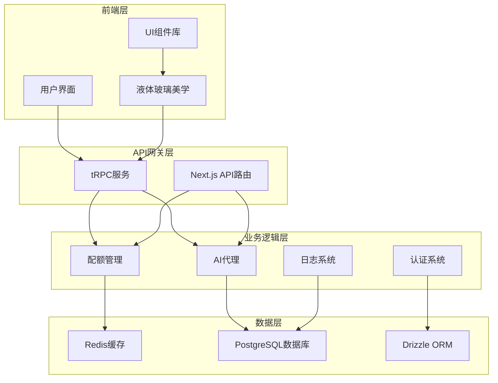

**图表来源**
- [src/app/layout.tsx:25-57](file://src/app/layout.tsx#L25-L57)
- [src/server/api/routers/ai.ts:88-300](file://src/server/api/routers/ai.ts#L88-L300)
- [src/lib/database.ts:1-692](file://src/lib/database.ts#L1-L692)

**章节来源**
- [README.md:1-83](file://README.md#L1-L83)
- [package.json:1-90](file://package.json#L1-L90)

## 核心组件

### 数据库架构

系统使用Drizzle ORM进行数据库操作，支持PostgreSQL作为主数据库存储。

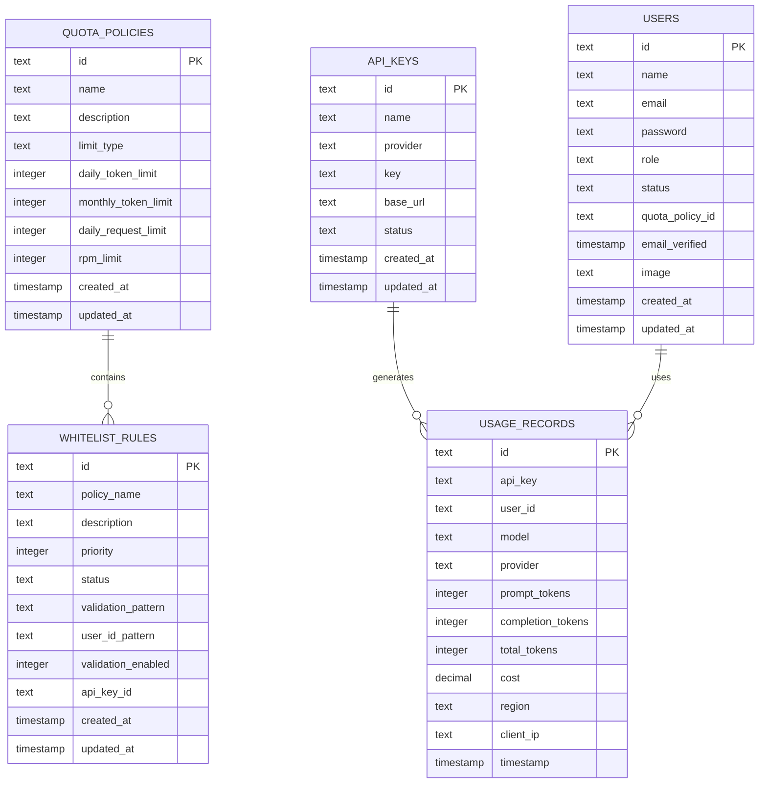

**图表来源**
- [src/lib/schema.ts:28-98](file://src/lib/schema.ts#L28-L98)

### 配额策略模型

系统支持灵活的配额策略配置，包括Token限制和请求次数限制两种模式。

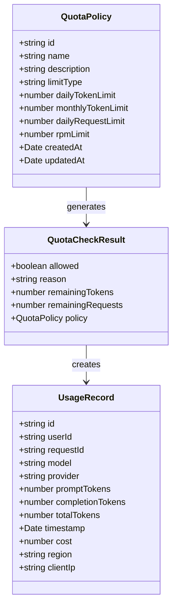

**图表来源**
- [src/lib/types.ts:4-90](file://src/lib/types.ts#L4-L90)

**章节来源**
- [src/lib/schema.ts:1-162](file://src/lib/schema.ts#L1-L162)
- [src/lib/types.ts:1-118](file://src/lib/types.ts#L1-L118)

## 系统架构图

液体玻璃美学系统采用微服务架构，通过tRPC实现类型安全的前后端通信。

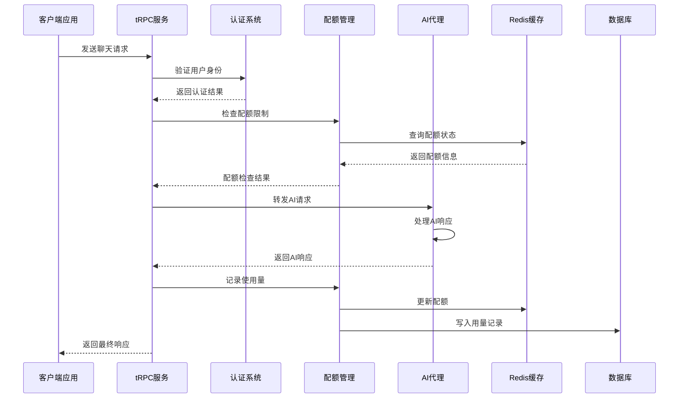

**图表来源**
- [src/server/api/routers/ai.ts:98-213](file://src/server/api/routers/ai.ts#L98-L213)
- [src/lib/quota.ts:78-200](file://src/lib/quota.ts#L78-L200)

## 详细组件分析

### tRPC路由器

系统使用tRPC作为主要的API通信框架，提供类型安全的服务调用。

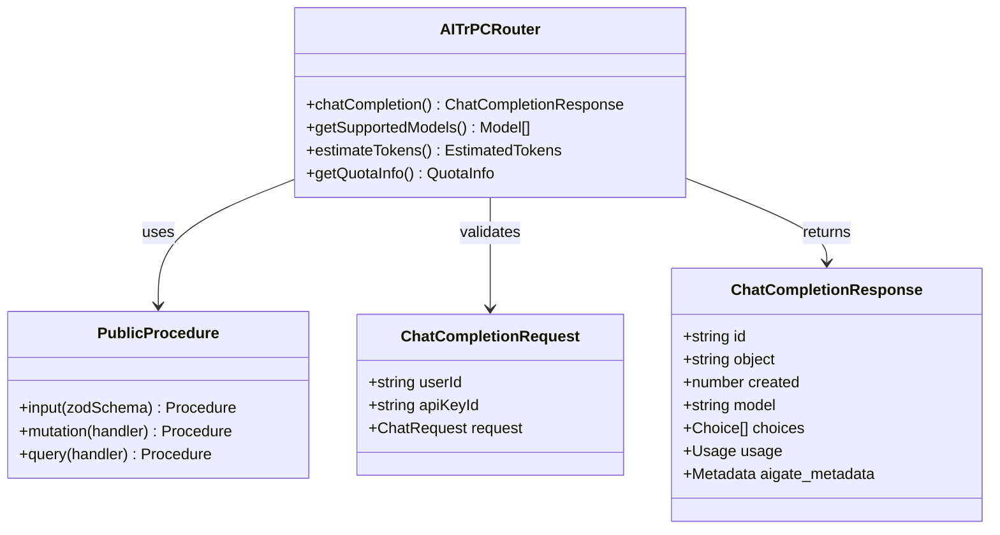

**图表来源**
- [src/server/api/routers/ai.ts:88-300](file://src/server/api/routers/ai.ts#L88-L300)

### AI提供商适配器

系统支持多家AI服务提供商，通过统一接口适配不同服务商的API。

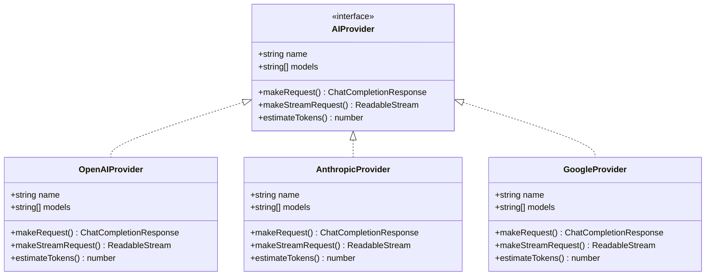

**图表来源**
- [src/lib/ai-providers.ts:13-759](file://src/lib/ai-providers.ts#L13-L759)

**章节来源**
- [src/server/api/routers/ai.ts:1-301](file://src/server/api/routers/ai.ts#L1-L301)
- [src/lib/ai-providers.ts:1-759](file://src/lib/ai-providers.ts#L1-L759)

## 液体玻璃美学系统

### 设计理念与实现

液体玻璃美学系统是本项目的核心视觉设计语言，通过CSS自定义属性和Tailwind CSS类实现统一的视觉风格。

#### 核心设计元素

液体玻璃效果通过以下CSS属性实现：

- **backdrop-blur**：模糊背景，创造半透明效果
- **backdrop-saturate**：增强饱和度，提升色彩表现力
- **rgba透明度**：使用RGBA颜色值实现层次感
- **多重阴影**：内外阴影结合创造立体感

#### 颜色系统

系统采用双色主题设计：

**浅色模式 (Light Mode)**
- 背景：#f8fafc (柔和的米白色)
- 卡片：rgba(255, 255, 255, 0.7) (70%不透明度)
- 弹窗：rgba(255, 255, 255, 0.85) (85%不透明度)
- 边框：rgba(255, 255, 255, 0.5) (50%不透明度)

**深色模式 (Dark Mode)**
- 背景：#0f172a (深邃的蓝灰色)
- 卡片：rgba(30, 41, 59, 0.6) (60%不透明度)
- 弹窗：rgba(30, 41, 59, 0.85) (85%不透明度)
- 边框：rgba(255, 255, 255, 0.1) (10%不透明度)

#### 组件应用范围

液体玻璃美学系统已全面应用于以下组件：

**仪表板布局**
- 侧边栏：backdrop-blur-2xl + bg-white/70 + border-white/20
- 主内容区域：渐变背景 + 液体玻璃效果
- 卡片容器：圆角 + 模糊 + 边框

**对话框系统**
- 普通对话框：backdrop-blur-2xl + bg-white/80 + shadow-[0_24px_64px_...]
- 确认对话框：增强的液体玻璃效果 + 动画过渡
- 弹出层：backdrop-blur-xl + 背景透明度调整

**表单组件**
- 输入框：backdrop-blur-lg + backdrop-saturate-[1.5]
- 选择器：增强的液体玻璃效果 + 悬停动画
- 文本域：统一的液体玻璃样式

**按钮系统**
- 默认按钮：backdrop-blur-xl + backdrop-saturate-[1.8]
- 幽灵按钮：透明背景 + 模糊效果
- 玻璃按钮：强化的液体玻璃效果 + 3D阴影

### 组件实现细节

#### 仪表板布局液体玻璃效果

```mermaid
graph LR
subgraph "仪表板布局结构"
Sidebar[侧边栏]
MainContent[主内容区域]
DashboardCards[仪表板卡片]
end
subgraph "液体玻璃效果"
BlurEffect[backdrop-blur-2xl]
BGEffect[bg-white/70]
BorderEffect[border-white/20]
ShadowEffect[shadow-[4px_0_24px_rgba(0,0,0,0.08)]]
GradientEffect[linear-gradient]
end
Sidebar --> BlurEffect
Sidebar --> BGEffect
Sidebar --> BorderEffect
Sidebar --> ShadowEffect
MainContent --> GradientEffect
DashboardCards --> BlurEffect
DashboardCards --> BGEffect
DashboardCards --> BorderEffect
DashboardCards --> ShadowEffect
```

**图表来源**
- [src/components/dashboard-layout/index.tsx:14-25](file://src/components/dashboard-layout/index.tsx#L14-L25)
- [src/app/(dashboard)/page.tsx](file://src/app/(dashboard)/page.tsx#L110-L238)

#### 对话框液体玻璃效果

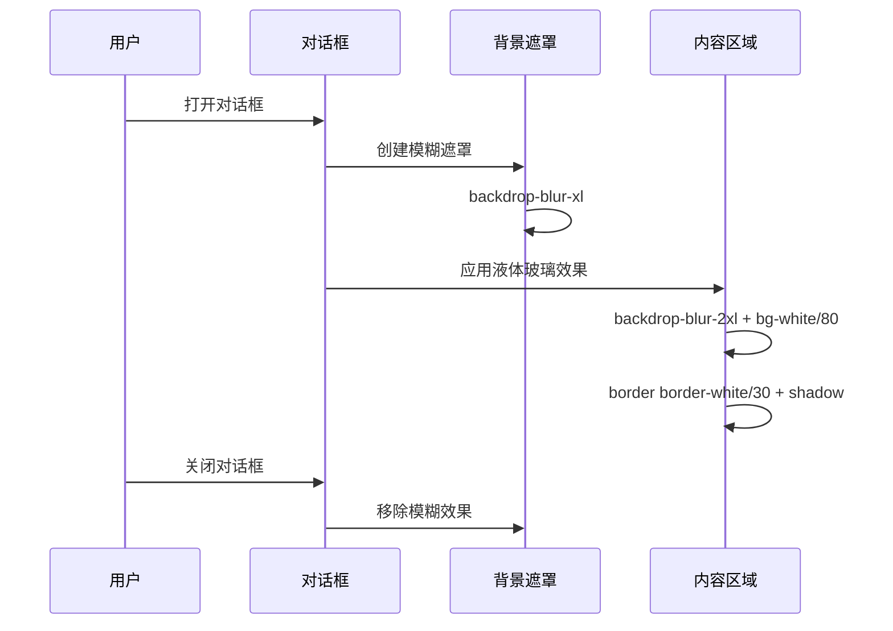

**图表来源**
- [src/components/ui/dialog.tsx:30-55](file://src/components/ui/dialog.tsx#L30-L55)
- [src/components/ui/alert-dialog.tsx:30-50](file://src/components/ui/alert-dialog.tsx#L30-L50)

#### 表单组件液体玻璃效果

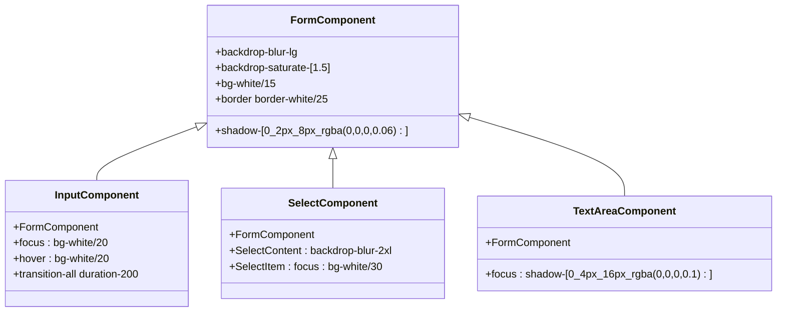

**图表来源**
- [src/components/ui/input.tsx:8-36](file://src/components/ui/input.tsx#L8-L36)
- [src/components/ui/select.tsx:13-46](file://src/components/ui/select.tsx#L13-L46)
- [src/components/ui/textarea.tsx:5-34](file://src/components/ui/textarea.tsx#L5-L34)

### 动画与交互效果

液体玻璃美学系统包含丰富的动画效果：

**进入动画**
- cubic-bezier(0.34,1.56,0.64,1) 缓动函数
- 从缩放95%到100%
- 从透明度0到100%

**悬停效果**
- 1.02倍缩放比例
- 增强的阴影效果
- 背景透明度变化

**过渡动画**
- 200-300ms持续时间
- 平滑的颜色过渡
- 一致的动画曲线

**章节来源**
- [src/app/globals.css:1-138](file://src/app/globals.css#L1-L138)
- [src/components/dashboard-layout/index.tsx:1-29](file://src/components/dashboard-layout/index.tsx#L1-L29)
- [src/components/ui/dialog.tsx:1-125](file://src/components/ui/dialog.tsx#L1-L125)
- [src/components/ui/alert-dialog.tsx:1-146](file://src/components/ui/alert-dialog.tsx#L1-L146)
- [src/components/ui/button.tsx:1-77](file://src/components/ui/button.tsx#L1-L77)
- [src/components/ui/input.tsx:1-41](file://src/components/ui/input.tsx#L1-L41)
- [src/components/ui/select.tsx:1-182](file://src/components/ui/select.tsx#L1-L182)
- [src/components/ui/textarea.tsx:1-38](file://src/components/ui/textarea.tsx#L1-L38)
- [src/components/ui/confirm.tsx:1-170](file://src/components/ui/confirm.tsx#L1-L170)
- [src/components/ui/field.tsx:1-245](file://src/components/ui/field.tsx#L1-L245)
- [src/components/ui/table.tsx:1-115](file://src/components/ui/table.tsx#L1-L115)
- [src/app/(dashboard)/page.tsx](file://src/app/(dashboard)/page.tsx#L110-L238)

## 配额管理系统

### 配额检查流程

系统实现多层次的配额检查机制，确保资源使用的合理控制。

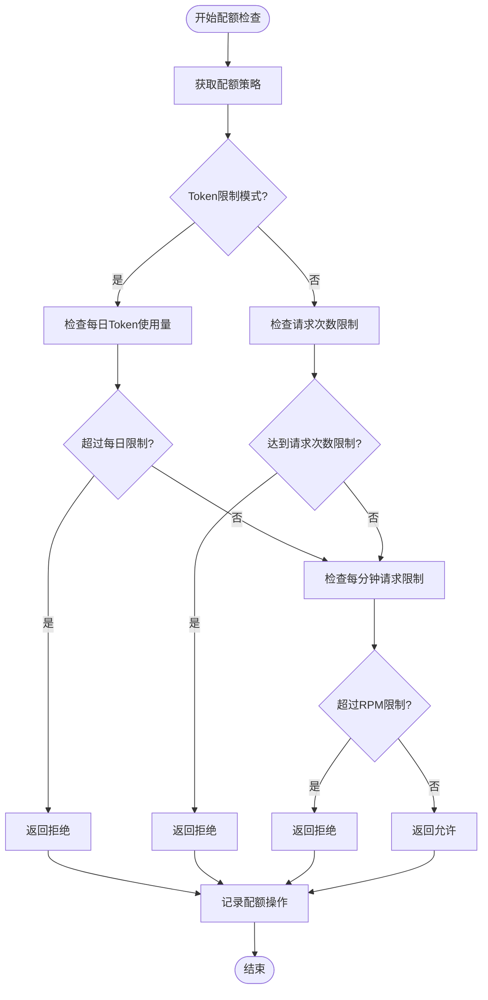

**图表来源**
- [src/lib/quota.ts:78-200](file://src/lib/quota.ts#L78-L200)

### Redis缓存策略

系统使用Redis实现高性能的缓存机制，优化配额检查和API密钥获取。

```mermaid
graph LR
subgraph "Redis缓存键结构"
PolicyKey[policy:apiKey:{apiKeyId}]
DailyQuota[user_quota:{userId}:{date}:{apiKey}]
DailyRequests[user_requests:{userId}:{date}:{apiKey}]
RPMKey[user_rpm:{userId}:{apiKey}:{minute}]
APIKey[api_keys:{provider}]
UserPolicy[user_policy:{userId}]
end
subgraph "缓存过期策略"
PolicyExpire[1小时]
DailyExpire[7天]
RPMExpire[2分钟]
APIExpire[1小时]
UserPolicyExpire[永久]
end
PolicyKey --> PolicyExpire
DailyQuota --> DailyExpire
RPMKey --> RPMExpire
APIKey --> APIExpire
UserPolicy --> UserPolicyExpire
```

**图表来源**
- [src/lib/redis.ts:18-42](file://src/lib/redis.ts#L18-L42)
- [src/lib/quota.ts:18-57](file://src/lib/quota.ts#L18-L57)

**章节来源**
- [src/lib/quota.ts:1-327](file://src/lib/quota.ts#L1-L327)
- [src/lib/redis.ts:1-43](file://src/lib/redis.ts#L1-L43)

## AI代理系统

### 流式响应处理

系统支持多种响应模式，包括流式响应和非流式响应。

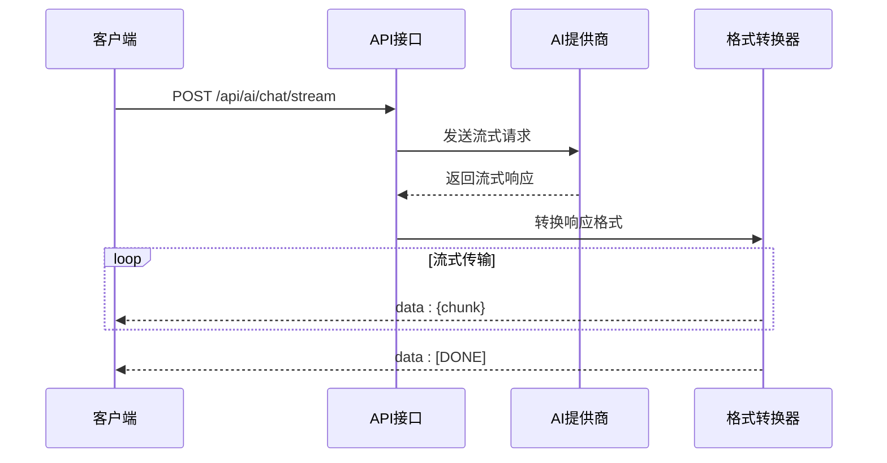

**图表来源**
- [src/pages/api/ai/chat/stream.ts:105-175](file://src/pages/api/ai/chat/stream.ts#L105-L175)

### Token估算机制

系统实现智能的Token估算算法，为配额检查提供准确的资源消耗预估。

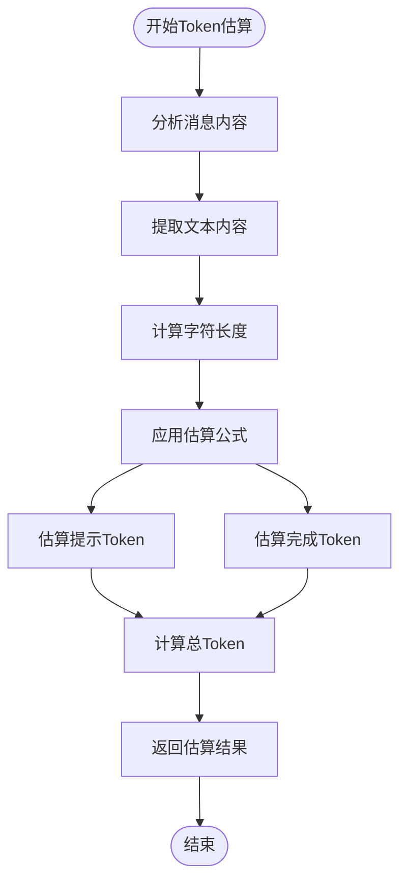

**图表来源**
- [src/lib/ai-providers.ts:29-32](file://src/lib/ai-providers.ts#L29-L32)

**章节来源**
- [src/pages/api/ai/chat/completions.ts:133-350](file://src/pages/api/ai/chat/completions.ts#L133-L350)
- [src/pages/api/ai/chat/stream.ts:1-184](file://src/pages/api/ai/chat/stream.ts#L1-L184)

## 数据流分析

### 用户认证流程

系统采用NextAuth.js实现安全的用户认证机制。

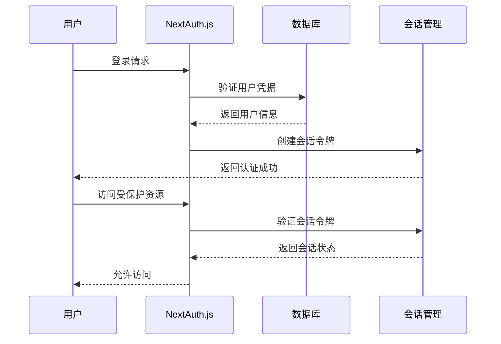

**图表来源**
- [src/lib/database.ts:581-691](file://src/lib/database.ts#L581-L691)

### 用量记录流程

系统实时记录和统计AI服务的使用情况。

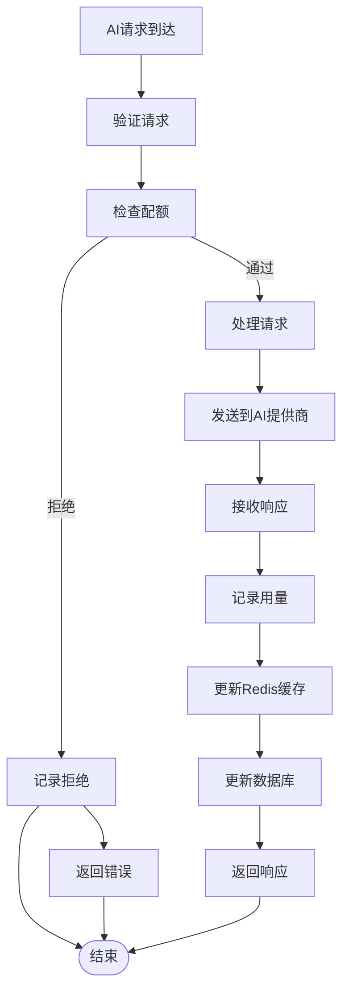

**图表来源**
- [src/lib/quota.ts:202-260](file://src/lib/quota.ts#L202-L260)

**章节来源**
- [src/lib/database.ts:1-692](file://src/lib/database.ts#L1-L692)
- [src/lib/logger.ts:1-184](file://src/lib/logger.ts#L1-L184)

## 性能优化

### 缓存策略

系统采用多层缓存策略优化性能：

1. **Redis缓存**：热点数据缓存，减少数据库查询
2. **API密钥缓存**：API密钥在Redis中缓存1小时
3. **配额策略缓存**：配额策略缓存1小时
4. **静态资源缓存**：前端静态资源浏览器缓存

### 连接池管理

系统优化数据库和Redis连接池配置，提高并发处理能力。

### 异步处理

大量使用Promise和async/await模式，避免阻塞操作。

## 安全机制

### 认证授权

- **NextAuth.js集成**：支持多种认证方式
- **API密钥管理**：安全的API密钥存储和轮换
- **权限控制**：基于角色的访问控制

### 输入验证

- **Zod Schema验证**：严格的输入参数验证
- **白名单规则**：用户ID格式验证和过滤
- **SQL注入防护**：使用ORM进行数据库操作

### 日志审计

- **操作日志**：记录所有重要操作
- **错误日志**：详细的错误信息记录
- **配额审计**：配额使用情况跟踪

## 部署指南

### 环境配置

系统提供一键部署脚本，支持交互式配置。

```bash
# 1. 交互式配置环境变量
./deploy.sh config

# 2. 一键部署（自动拉取镜像、构建应用、启动服务）
./deploy.sh up
```

### 配置选项

- **管理员账户**：邮箱和密码（支持运行时动态修改）
- **数据库连接**：PostgreSQL连接地址
- **缓存配置**：Redis连接地址
- **应用端口**：自定义服务端口
- **日志设置**：日志目录和级别配置

### Docker部署

系统支持Docker容器化部署，包含完整的容器编排配置。

**章节来源**
- [README.md:14-50](file://README.md#L14-L50)

## 总结

液体玻璃美学系统是一个功能完整、架构清晰的AI网关管理系统。系统采用现代化的技术栈，实现了高性能、高可用、易扩展的设计目标。

### 核心优势

1. **液体玻璃设计**：独特的视觉设计语言，提供优秀的用户体验
2. **智能配额管理**：灵活的配额策略，支持多种限制模式
3. **多提供商支持**：统一接口适配多家AI服务提供商
4. **高性能架构**：Redis缓存+tRPC+Next.js的组合实现毫秒级响应
5. **安全可靠**：完善的认证授权和审计机制

### 技术亮点

- **类型安全**：完整的TypeScript类型定义
- **模块化设计**：清晰的组件分离和职责划分
- **可扩展性**：易于添加新的AI提供商和功能模块
- **可观测性**：完善的日志和监控体系
- **统一美学**：液体玻璃设计语言在所有组件中的一致应用

该系统为AI服务的商业化运营提供了坚实的技术基础，适合各种规模的企业和组织使用。