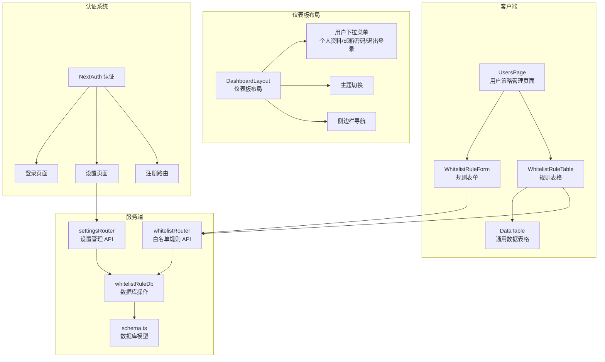
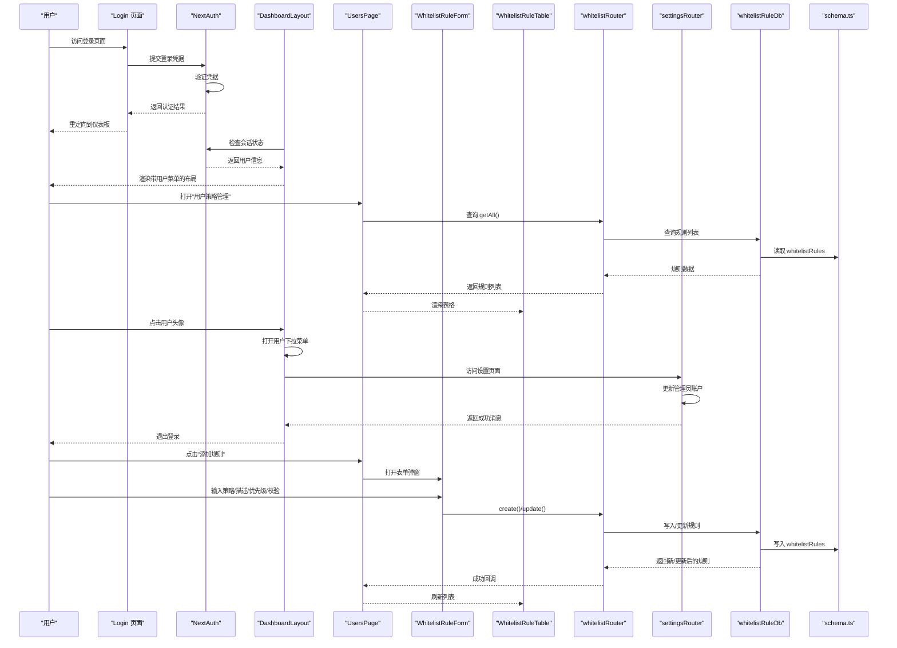
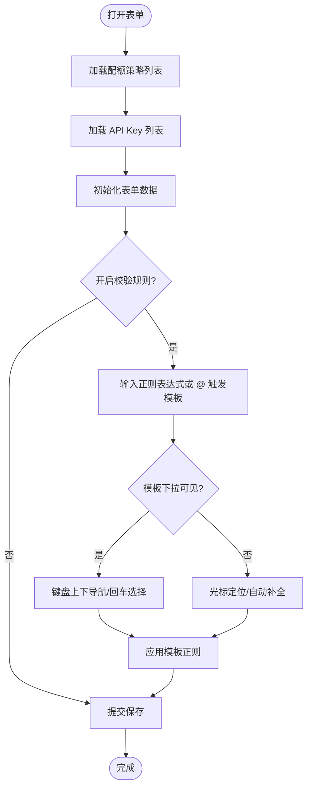
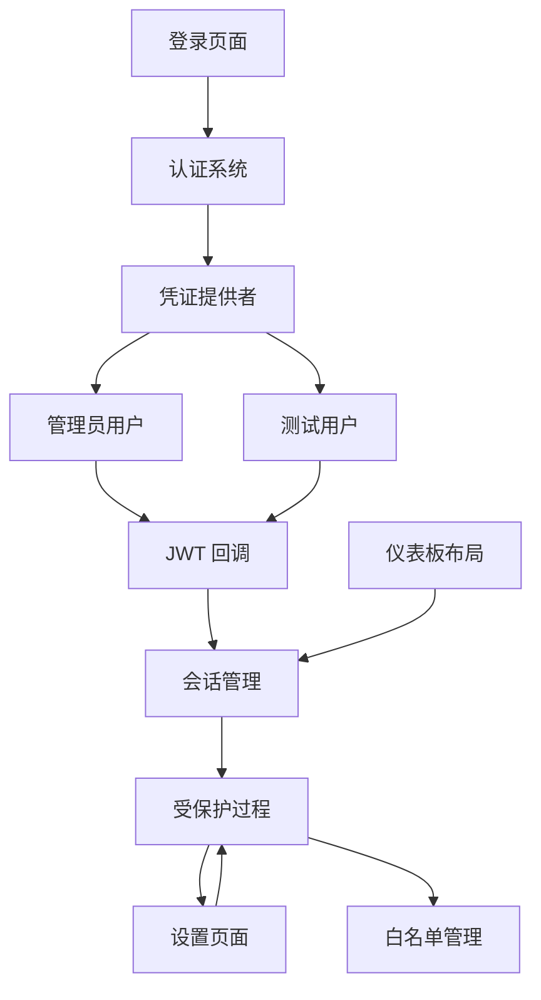
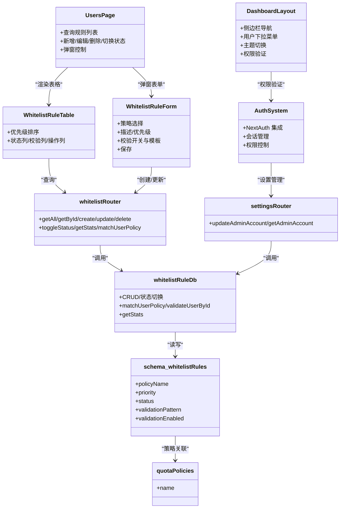

# 用户策略管理

<cite>
**本文引用的文件**
- [src/app/(dashboard)/users/page.tsx](file://src/app/(dashboard)/users/page.tsx)
- [src/app/(dashboard)/users/components/whitelist-rule-form.tsx](file://src/app/(dashboard)/users/components/whitelist-rule-form.tsx)
- [src/app/(dashboard)/users/components/whitelist-rule-table.tsx](file://src/app/(dashboard)/users/components/whitelist-rule-table.tsx)
- [src/components/dashboard-layout.tsx](file://src/components/dashboard-layout.tsx)
- [src/app/(dashboard)/layout.tsx](file://src/app/(dashboard)/layout.tsx)
- [src/app/login/page.tsx](file://src/app/login/page.tsx)
- [src/auth.ts](file://src/auth.ts)
- [src/app/settings/page.tsx](file://src/app/settings/page.tsx)
- [src/server/api/routers/settings.ts](file://src/server/api/routers/settings.ts)
- [src/app/api/auth/[...nextauth]/route.ts](file://src/app/api/auth/[...nextauth]/route.ts)
- [src/app/api/auth/register/route.ts](file://src/app/api/auth/register/route.ts)
- [src/server/api/routers/whitelist.ts](file://src/server/api/routers/whitelist.ts)
- [src/lib/database.ts](file://src/lib/database.ts)
- [src/lib/schema.ts](file://src/lib/schema.ts)
- [src/components/ui/data-table.tsx](file://src/components/ui/data-table.tsx)
</cite>

## 更新摘要
**所做更改**
- 新增完整的用户管理和认证系统集成
- 更新仪表板布局中的用户下拉菜单系统
- 新增用户资料管理和退出登录功能
- 集成邮箱密码设置页面和权限控制
- 完善用户策略管理的权限验证机制

## 目录
1. [简介](#简介)
2. [项目结构](#项目结构)
3. [核心组件](#核心组件)
4. [架构总览](#架构总览)
5. [组件详解](#组件详解)
6. [用户认证与权限管理](#用户认证与权限管理)
7. [依赖关系分析](#依赖关系分析)
8. [性能与可用性考量](#性能与可用性考量)
9. [故障排查指南](#故障排查指南)
10. [结论](#结论)
11. [附录](#附录)

## 简介
本文件面向 AIGate 的"用户策略管理"界面，聚焦白名单规则管理页面的 UI 设计与交互实现，涵盖规则表单、规则表格、策略配置、规则验证机制、权限控制与审计日志等主题。文档以代码为依据，结合可视化图示，帮助开发者与产品/设计人员理解界面布局、数据流与交互流程，并提供优化建议与排障指引。

**更新** 新增完整的用户管理和认证系统，包括仪表板布局中的下拉菜单系统、用户资料管理、退出登录功能等。

## 项目结构
用户策略管理位于仪表盘路由下，采用按功能模块划分的目录结构：
- 页面容器：负责查询、增删改、状态切换与弹窗表单的协调
- 表单组件：提供规则创建/编辑的输入与校验
- 表格组件：展示规则列表、状态与操作按钮
- 路由器与数据库层：提供 CRUD、状态切换、匹配策略与统计接口
- UI 基础组件：基于 react-table 的通用数据表格
- 认证系统：完整的用户认证、授权和权限管理

**图表来源**
- [src/components/dashboard-layout.tsx](file://src/components/dashboard-layout.tsx#L140-L181)
- [src/app/(dashboard)/users/page.tsx](file://src/app/(dashboard)/users/page.tsx#L22-L145)
- [src/app/(dashboard)/users/components/whitelist-rule-form.tsx](file://src/app/(dashboard)/users/components/whitelist-rule-form.tsx#L91-L357)
- [src/app/(dashboard)/users/components/whitelist-rule-table.tsx](file://src/app/(dashboard)/users/components/whitelist-rule-table.tsx#L27-L177)
- [src/server/api/routers/whitelist.ts](file://src/server/api/routers/whitelist.ts#L19-L188)
- [src/server/api/routers/settings.ts](file://src/server/api/routers/settings.ts#L13-L121)
- [src/lib/database.ts](file://src/lib/database.ts#L309-L523)
- [src/lib/schema.ts](file://src/lib/schema.ts#L84-L95)

**章节来源**
- [src/app/(dashboard)/users/page.tsx](file://src/app/(dashboard)/users/page.tsx#L1-L146)
- [src/app/(dashboard)/users/components/whitelist-rule-form.tsx](file://src/app/(dashboard)/users/components/whitelist-rule-form.tsx#L1-L555)
- [src/app/(dashboard)/users/components/whitelist-rule-table.tsx](file://src/app/(dashboard)/users/components/whitelist-rule-table.tsx#L1-L164)
- [src/components/dashboard-layout.tsx](file://src/components/dashboard-layout.tsx#L1-L192)
- [src/app/(dashboard)/layout.tsx](file://src/app/(dashboard)/layout.tsx#L1-L19)
- [src/app/login/page.tsx](file://src/app/login/page.tsx#L1-L106)
- [src/auth.ts](file://src/auth.ts#L1-L98)
- [src/app/settings/page.tsx](file://src/app/settings/page.tsx#L1-L148)
- [src/server/api/routers/settings.ts](file://src/server/api/routers/settings.ts#L1-L121)
- [src/app/api/auth/[...nextauth]/route.ts](file://src/app/api/auth/[...nextauth]/route.ts#L1-L7)
- [src/app/api/auth/register/route.ts](file://src/app/api/auth/register/route.ts#L1-L30)
- [src/server/api/routers/whitelist.ts](file://src/server/api/routers/whitelist.ts#L1-L189)
- [src/lib/database.ts](file://src/lib/database.ts#L1-L524)
- [src/lib/schema.ts](file://src/lib/schema.ts#L1-L162)
- [src/components/ui/data-table.tsx](file://src/components/ui/data-table.tsx#L1-L187)

## 核心组件
- 页面容器 UsersPage：负责拉取规则列表、处理新增/编辑/删除/状态切换、弹窗表单与加载态
- 规则表单 WhitelistRuleForm：策略选择、描述、优先级、校验开关与正则模板选择
- 规则表格 WhitelistRuleTable：优先级排序、状态列、描述、校验规则展示、操作列
- 通用数据表格 DataTable：分页、空态、排序与筛选能力
- 仪表板布局 DashboardLayout：完整的布局结构，包含侧边栏、主题切换和用户下拉菜单
- 认证系统：NextAuth 集成，提供登录、登出、会话管理和权限控制
- 设置页面 SettingsPage：管理员账户信息管理，包括邮箱和密码修改

**更新** 新增仪表板布局和认证系统的完整集成。

**章节来源**
- [src/app/(dashboard)/users/page.tsx](file://src/app/(dashboard)/users/page.tsx#L22-L145)
- [src/app/(dashboard)/users/components/whitelist-rule-form.tsx](file://src/app/(dashboard)/users/components/whitelist-rule-form.tsx#L91-L555)
- [src/app/(dashboard)/users/components/whitelist-rule-table.tsx](file://src/app/(dashboard)/users/components/whitelist-rule-table.tsx#L27-L164)
- [src/components/ui/data-table.tsx](file://src/components/ui/data-table.tsx#L36-L186)
- [src/components/dashboard-layout.tsx](file://src/components/dashboard-layout.tsx#L53-L192)
- [src/auth.ts](file://src/auth.ts#L5-L98)
- [src/app/settings/page.tsx](file://src/app/settings/page.tsx#L11-L148)

## 架构总览
用户策略管理的前端-后端交互遵循"页面容器 -> 表单/表格 -> tRPC 路由器 -> 数据库"的链路。页面容器通过 trpc 查询与变更规则；表单负责输入与模板选择；表格负责展示与操作；路由器进行输入校验与错误处理；数据库层执行 SQL 操作并返回标准化结果。认证系统通过 NextAuth 提供会话管理和权限控制。

**图表来源**
- [src/app/login/page.tsx](file://src/app/login/page.tsx#L18-L41)
- [src/auth.ts](file://src/auth.ts#L13-L65)
- [src/components/dashboard-layout.tsx](file://src/components/dashboard-layout.tsx#L140-L181)
- [src/app/(dashboard)/users/page.tsx](file://src/app/(dashboard)/users/page.tsx#L24-L95)
- [src/app/(dashboard)/users/components/whitelist-rule-form.tsx](file://src/app/(dashboard)/users/components/whitelist-rule-form.tsx#L181-L184)
- [src/app/(dashboard)/users/components/whitelist-rule-table.tsx](file://src/app/(dashboard)/users/components/whitelist-rule-table.tsx#L27-L177)
- [src/server/api/routers/whitelist.ts](file://src/server/api/routers/whitelist.ts#L64-L117)
- [src/server/api/routers/settings.ts](file://src/server/api/routers/settings.ts#L15-L112)
- [src/lib/database.ts](file://src/lib/database.ts#L333-L362)
- [src/lib/schema.ts](file://src/lib/schema.ts#L84-L95)

## 组件详解

### 页面容器：UsersPage
- 功能职责
  - 查询白名单规则列表
  - 处理新增/编辑/删除/状态切换
  - 控制表单弹窗的打开/关闭与编辑态
  - 展示加载态与错误态
- 关键交互
  - 添加规则：打开弹窗，清空编辑态
  - 编辑规则：传入规则对象进入编辑态
  - 删除规则：确认后调用删除 mutation
  - 切换状态：调用 toggleStatus mutation
  - 保存规则：根据是否存在编辑态决定 create 或 update
- 加载态与并发
  - 通过多个 mutation 的 isPending 状态组合控制表格操作按钮禁用

**章节来源**
- [src/app/(dashboard)/users/page.tsx](file://src/app/(dashboard)/users/page.tsx#L22-L145)

### 规则表单：WhitelistRuleForm
- 字段与布局
  - 策略名称：下拉选择，来源于配额策略列表
  - 描述：多行文本
  - 优先级：数值输入，数字越大优先级越高
  - 关联 API Key：下拉选择，支持不关联选项
  - UserId 格式生成规则：用于 userIdPattern 的模板选择
  - 用户UserId校验规则：开关 + 正则输入框 + 预设模板选择
- 预设模板与交互
  - 输入"@"触发模板下拉，支持键盘上下导航与回车选择
  - 支持过滤模板（按 trigger 或描述关键字）
  - 选择模板会自动替换占位符位置的正则表达式
- 保存逻辑
  - 提交时调用 onSave(formData)，由页面容器决定 create 或 update

**图表来源**
- [src/app/(dashboard)/users/components/whitelist-rule-form.tsx](file://src/app/(dashboard)/users/components/whitelist-rule-form.tsx#L126-L138)
- [src/app/(dashboard)/users/components/whitelist-rule-form.tsx](file://src/app/(dashboard)/users/components/whitelist-rule-form.tsx#L179-L278)

**章节来源**
- [src/app/(dashboard)/users/components/whitelist-rule-form.tsx](file://src/app/(dashboard)/users/components/whitelist-rule-form.tsx#L91-L555)

### 规则表格：WhitelistRuleTable
- 排序与展示
  - 按优先级降序排列
  - 策略名称、描述、创建时间、状态、校验规则展示
- 状态列
  - 启用/禁用按钮，点击触发 toggleStatus
  - 按钮样式区分状态
- 校验规则列
  - 显示"已启用/未启用"，若启用则展示正则片段
- 操作列
  - 编辑/删除按钮，禁用状态与全局 loading 对齐
- 空态
  - 使用通用 DataTable 的空态图标与文案

**章节来源**
- [src/app/(dashboard)/users/components/whitelist-rule-table.tsx](file://src/app/(dashboard)/users/components/whitelist-rule-table.tsx#L27-L164)
- [src/components/ui/data-table.tsx](file://src/components/ui/data-table.tsx#L36-L186)

### 通用数据表格：DataTable
- 能力
  - 排序、筛选、分页（默认每页 10 条）
  - 自定义空态图标与文案
- 在规则表格中的使用
  - 传入列定义与数据，统一渲染与交互体验

**章节来源**
- [src/components/ui/data-table.tsx](file://src/components/ui/data-table.tsx#L36-L186)

### 仪表板布局：DashboardLayout
- 布局结构
  - 侧边栏：包含仪表板、接口调试、配额管理、API 密钥、用户策略管理导航
  - 主内容区：包含头部和主要内容区域
  - 头部：主题切换按钮和用户下拉菜单
- 用户下拉菜单功能
  - 个人资料：显示用户基本信息（当前为禁用状态）
  - 邮箱密码：跳转到设置页面进行账户信息修改
  - 退出登录：调用 signOut 进行用户登出
- 主题切换
  - 支持明暗主题切换，状态持久化到本地存储

**更新** 新增完整的用户下拉菜单系统，包含个人资料、邮箱密码设置和退出登录功能。

**章节来源**
- [src/components/dashboard-layout.tsx](file://src/components/dashboard-layout.tsx#L53-L192)

## 用户认证与权限管理

### NextAuth 认证系统
- 凭证提供者
  - 支持邮箱和密码认证
  - 管理员用户：admin@aigate.com/admin123
  - 测试用户：test@example.com/password
- 会话管理
  - JWT 回调处理用户信息传递
  - 会话回调注入用户角色和状态
- 登录页面
  - 提供简洁的登录表单
  - 支持错误处理和加载状态

### 权限控制机制
- 服务器端保护
  - protectedProcedure 确保只有认证用户可以访问
  - settingsRouter 使用受保护过程确保安全
- 客户端重定向
  - DashboardLayout 在服务器端检查会话状态
  - 未认证用户自动重定向到登录页面
- 用户角色
  - 支持 USER 和 ADMIN 两种角色
  - 管理员具有最高权限

### 设置管理
- 账户信息管理
  - 管理员邮箱和密码修改
  - 输入验证和错误处理
- 环境变量管理
  - 开发环境支持直接修改 .env 文件
  - 生产环境提供安全警告
- 安全考虑
  - 密码长度至少6位
  - 邮箱格式验证
  - 两次密码输入一致性检查

**图表来源**
- [src/auth.ts](file://src/auth.ts#L5-L98)
- [src/app/login/page.tsx](file://src/app/login/page.tsx#L18-L41)
- [src/app/(dashboard)/layout.tsx](file://src/app/(dashboard)/layout.tsx#L10-L18)
- [src/server/api/routers/settings.ts](file://src/server/api/routers/settings.ts#L15-L112)

**章节来源**
- [src/auth.ts](file://src/auth.ts#L1-L98)
- [src/app/login/page.tsx](file://src/app/login/page.tsx#L1-L106)
- [src/app/(dashboard)/layout.tsx](file://src/app/(dashboard)/layout.tsx#L1-L19)
- [src/app/settings/page.tsx](file://src/app/settings/page.tsx#L1-L148)
- [src/server/api/routers/settings.ts](file://src/server/api/routers/settings.ts#L1-L121)
- [src/app/api/auth/[...nextauth]/route.ts](file://src/app/api/auth/[...nextauth]/route.ts#L1-L7)
- [src/app/api/auth/register/route.ts](file://src/app/api/auth/register/route.ts#L1-L30)

## 依赖关系分析
- 页面容器依赖 tRPC 客户端与 UI 组件，负责状态管理与异步操作
- 表单依赖 tRPC 查询策略列表，提交时调用 mutation
- 表格依赖通用数据表格组件，提供列定义与数据源
- 路由器依赖数据库层，数据库层依赖 schema 定义
- 认证系统依赖 NextAuth，提供会话管理和权限控制
- 仪表板布局依赖认证系统，提供用户界面和权限验证

**图表来源**
- [src/app/(dashboard)/users/page.tsx](file://src/app/(dashboard)/users/page.tsx#L22-L145)
- [src/app/(dashboard)/users/components/whitelist-rule-form.tsx](file://src/app/(dashboard)/users/components/whitelist-rule-form.tsx#L91-L555)
- [src/app/(dashboard)/users/components/whitelist-rule-table.tsx](file://src/app/(dashboard)/users/components/whitelist-rule-table.tsx#L27-L164)
- [src/components/dashboard-layout.tsx](file://src/components/dashboard-layout.tsx#L53-L192)
- [src/auth.ts](file://src/auth.ts#L5-L98)
- [src/server/api/routers/whitelist.ts](file://src/server/api/routers/whitelist.ts#L19-L188)
- [src/server/api/routers/settings.ts](file://src/server/api/routers/settings.ts#L13-L121)
- [src/lib/database.ts](file://src/lib/database.ts#L309-L523)
- [src/lib/schema.ts](file://src/lib/schema.ts#L84-L95)
- [src/lib/schema.ts](file://src/lib/schema.ts#L137-L142)

## 性能与可用性考量
- 表格性能
  - 使用 react-table 的虚拟化与分页能力，避免一次性渲染大量数据
  - 优先级排序在客户端完成，规则数量可控时影响较小
- 并发与加载
  - 操作按钮与全局 loading 状态同步，避免重复提交
  - 查询与变更互斥，减少竞态
- 输入体验
  - 表单模板下拉支持键盘导航，提升输入效率
  - 校验开关与正则输入联动，降低误用风险
- 可靠性
  - 服务器端输入校验与错误包装，前端统一处理
  - 无效正则容错，避免匹配失败导致异常
- 认证性能
  - 会话状态检查在服务器端进行，确保安全性
  - 用户下拉菜单懒加载，提升首屏性能
- 主题持久化
  - 主题状态存储在本地存储中，避免每次刷新重新计算

## 故障排查指南
- 常见问题
  - 表单保存失败：检查 TRPC 错误消息与网络状态
  - 规则状态切换无效：确认 mutation 是否处于 pending
  - 校验规则不生效：检查 validationEnabled 与 validationPattern 是否正确
  - 策略匹配异常：查看 matchUserPolicy 的返回与数据库中规则优先级
  - 登录失败：检查邮箱密码格式和 NextAuth 配置
  - 设置页面报错：检查环境变量文件权限和 NODE_ENV 状态
- 排查步骤
  - 打开浏览器开发者工具，查看 Network 中 tRPC 请求与响应
  - 在控制台输出 whitelistRuleDb.matchUserPolicy 的执行结果
  - 检查数据库中 whitelistRules 的 status 与 priority 字段
  - 验证 NextAuth 会话状态和用户权限信息
  - 检查 .env 文件权限和内容格式
- 相关实现参考
  - TRPC 路由器的错误包装与输入校验
  - 数据库层的匹配逻辑与统计方法
  - NextAuth 的回调处理和会话管理

**章节来源**
- [src/server/api/routers/whitelist.ts](file://src/server/api/routers/whitelist.ts#L64-L117)
- [src/lib/database.ts](file://src/lib/database.ts#L400-L428)
- [src/lib/database.ts](file://src/lib/database.ts#L491-L522)
- [src/server/api/routers/settings.ts](file://src/server/api/routers/settings.ts#L18-L96)
- [src/auth.ts](file://src/auth.ts#L13-L65)

## 结论
用户策略管理界面以清晰的布局与一致的交互体验为核心目标：表单提供策略选择、优先级与校验规则配置，表格呈现规则状态与操作入口，tRPC 路由器与数据库层保障数据一致性与可扩展性。通过模板化的正则输入与严格的输入校验，系统在易用性与安全性之间取得平衡。

**更新** 新增的认证系统和仪表板布局提供了完整的用户管理功能，包括用户下拉菜单、个人资料管理、邮箱密码设置和退出登录等特性。这些功能增强了系统的安全性和用户体验，为后续的功能扩展奠定了坚实基础。

## 附录

### 白名单规则表单字段说明
- 策略名称：来自配额策略列表，用于关联用户策略
- 描述：规则说明
- 优先级：数值越大优先级越高
- 关联 API Key：可选的 API Key 关联
- 校验规则：开关 + 正则表达式；支持模板快捷输入
- UserId 格式生成规则：用于 userIdPattern 的模板选择

**章节来源**
- [src/app/(dashboard)/users/components/whitelist-rule-form.tsx](file://src/app/(dashboard)/users/components/whitelist-rule-form.tsx#L299-L361)
- [src/app/(dashboard)/users/components/whitelist-rule-form.tsx](file://src/app/(dashboard)/users/components/whitelist-rule-form.tsx#L390-L448)
- [src/app/(dashboard)/users/components/whitelist-rule-form.tsx](file://src/app/(dashboard)/users/components/whitelist-rule-form.tsx#L450-L542)

### 规则表格列说明
- 优先级：高亮展示，降序排列
- 策略名称：显示策略名
- 描述：截断展示
- 校验规则：启用状态与正则片段
- 状态：启用/禁用按钮
- 创建时间：日期格式化
- 操作：编辑/删除

**章节来源**
- [src/app/(dashboard)/users/components/whitelist-rule-table.tsx](file://src/app/(dashboard)/users/components/whitelist-rule-table.tsx#L36-L148)

### 用户认证与权限控制
- 认证提供者：支持管理员和测试用户两种认证方式
- 会话管理：通过 JWT 回调处理用户信息传递
- 权限验证：服务器端受保护过程确保访问安全
- 用户角色：支持 USER 和 ADMIN 两种角色
- 仪表板集成：认证状态检查确保只有认证用户可以访问

**章节来源**
- [src/auth.ts](file://src/auth.ts#L5-L98)
- [src/app/(dashboard)/layout.tsx](file://src/app/(dashboard)/layout.tsx#L10-L18)
- [src/components/dashboard-layout.tsx](file://src/components/dashboard-layout.tsx#L140-L181)

### 设置页面功能说明
- 账户信息：管理员邮箱和密码修改
- 输入验证：邮箱格式和密码长度检查
- 错误处理：详细的错误消息和状态管理
- 环境变量：开发环境支持直接修改 .env 文件
- 安全考虑：生产环境提供安全警告和权限检查

**章节来源**
- [src/app/settings/page.tsx](file://src/app/settings/page.tsx#L17-L56)
- [src/server/api/routers/settings.ts](file://src/server/api/routers/settings.ts#L15-L112)

### 仪表板布局功能
- 侧边栏导航：包含仪表板、接口调试、配额管理、API 密钥、用户策略管理
- 用户下拉菜单：个人资料、邮箱密码设置、退出登录
- 主题切换：支持明暗主题切换，状态持久化
- 权限验证：服务器端会话检查，未认证用户重定向

**章节来源**
- [src/components/dashboard-layout.tsx](file://src/components/dashboard-layout.tsx#L25-L51)
- [src/components/dashboard-layout.tsx](file://src/components/dashboard-layout.tsx#L140-L181)
- [src/components/dashboard-layout.tsx](file://src/components/dashboard-layout.tsx#L58-L90)