# 管理后台界面

<cite>
**本文引用的文件**
- [根布局与元数据](file://src/app/layout.tsx)
- [仪表板根布局](file://src/app/(dashboard)/layout.tsx)
- [仪表板布局组件](file://src/components/dashboard-layout/index.tsx)
- [侧边栏头部组件](file://src/components/dashboard-layout/sidebar-header.tsx)
- [侧边栏导航组件](file://src/components/dashboard-layout/sidebar-nav.tsx)
- [侧边栏页脚组件](file://src/components/dashboard-layout/sidebar-footer.tsx)
- [全局样式与主题变量](file://src/app/globals.css)
- [Tailwind 配置](file://tailwind.config.js)
- [UI 组件库配置](file://components.json)
- [依赖清单](file://package.json)
- [仪表板首页](file://src/app/(dashboard)/page.tsx)
- [统计卡片组件](file://src/app/(dashboard)/components/stat-card.tsx)
- [用量趋势图组件](file://src/app/(dashboard)/components/usage-trend-chart.tsx)
- [模型分布图组件](file://src/app/(dashboard)/components/model-distribution-chart.tsx)
- [地区热力图组件](file://src/app/(dashboard)/components/region-heatmap-chart.tsx)
- [最近活动列表组件](file://src/app/(dashboard)/components/recent-activity.tsx)
- [最近IP请求显示组件](file://src/app/(dashboard)/components/recent-ip-requests.tsx)
- [配额策略页面](file://src/app/(dashboard)/quotas/page.tsx)
- [API 密钥管理页面](file://src/app/(dashboard)/keys/page.tsx)
- [用户策略管理页面](file://src/app/(dashboard)/users/page.tsx)
- [管理员账户设置页面](file://src/app/settings/page.tsx)
- [设置路由](file://src/server/api/routers/settings.ts)
- [API 密钥表格组件](file://src/app/(dashboard)/keys/components/api-key-table.tsx)
- [策略表格组件](file://src/app/(dashboard)/quotas/components/policy-table.tsx)
- [白名单规则表格组件](file://src/app/(dashboard)/users/components/whitelist-rule-table.tsx)
- [数据表格组件](file://src/components/ui/data-table.tsx)
- [基础表格组件](file://src/components/ui/table.tsx)
- [按钮基础组件](file://src/components/ui/button.tsx)
- [加载指示器组件](file://src/components/ui/spinner.tsx)
- [Tabs 组件](file://src/components/ui/tabs.tsx)
- [Sonner 通知组件](file://src/components/ui/sonner.tsx)
- [trpc Provider](file://src/components/trpc-provider.tsx)
- [根路由器](file://src/server/api/root.ts)
- [国际化中文配置](file://src/messages/zh.json)
- [国际化英文配置](file://src/messages/en.json)
</cite>

## 更新摘要
**所做更改**
- 新增模块化仪表板布局系统：从单一组件重构为模块化组件系统，包括侧边栏头部、导航和页脚组件
- 重新设计侧边栏结构：采用三段式布局（头部 + 导航 + 页脚），增强用户体验和功能完整性
- 集成国际化导航：导航菜单支持中英文双语切换，使用国际化配置文件
- 增强主题切换功能：在页脚组件中实现完整的主题切换和语言切换功能
- 优化用户菜单：集成个人资料、设置入口和退出登录功能
- 改进响应式设计：侧边栏宽度固定为64，确保在不同屏幕尺寸下的稳定性

## 目录
1. [简介](#简介)
2. [项目结构](#项目结构)
3. [核心组件](#核心组件)
4. [架构总览](#架构总览)
5. [组件详解](#组件详解)
6. [依赖关系分析](#依赖关系分析)
7. [性能考量](#性能考量)
8. [故障排查指南](#故障排查指南)
9. [结论](#结论)
10. [附录](#附录)

## 简介
本文件面向 AIGate 管理后台界面，提供从整体设计理念到具体组件实现的完整 UI/UX 设计文档。内容涵盖：
- 仪表板的信息架构、视觉层次与用户体验优化
- 功能页面（配额管理、API Key 管理、用户策略、接口调试、管理员设置）的组件设计思路
- 数据可视化组件（用量图表、地区分布图、活动日志）的实现要点
- 响应式设计与移动端适配策略
- UI 组件库使用指南（基础组件、表单组件、数据表格）
- 主题切换、国际化与无障碍访问的实现建议
- 用户交互流程、状态管理与错误提示设计原则
- 具体组件使用示例与样式定制指南

**更新** 本版本特别重构了仪表板布局系统，从单一组件转变为模块化组件架构，包括侧边栏头部、导航和页脚三个独立组件，提供更好的可维护性和扩展性。新增了完整的国际化支持和主题切换功能，进一步提升了用户体验。

## 项目结构
AIGate 使用 Next.js App Router 架构，采用 RSC（React Server Components）与客户端组件混合模式，结合 TailwindCSS 与自定义主题变量实现"液态玻璃"风格的主题系统；ECharts 负责数据可视化；Radix UI 提供无障碍基础组件；trpc 进行前后端数据通信。

```mermaid
graph TB
subgraph "应用层"
L["根布局与元数据<br/>layout.tsx"]
DL["仪表板根布局<br/>dashboard/layout.tsx"]
D["仪表板首页<br/>dashboard/page.tsx"]
Q["配额策略页<br/>dashboard/quotas/page.tsx"]
K["API 密钥页<br/>dashboard/keys/page.tsx"]
U["用户策略页<br/>dashboard/users/page.tsx"]
S["管理员设置页<br/>settings/page.tsx"]
RIR["最近IP请求组件<br/>dashboard/components/recent-ip-requests.tsx"]
end
subgraph "模块化布局组件"
DLI["仪表板布局容器<br/>dashboard-layout/index.tsx"]
DLH["侧边栏头部<br/>sidebar-header.tsx"]
DLN["侧边栏导航<br/>sidebar-nav.tsx"]
DLF["侧边栏页脚<br/>sidebar-footer.tsx"]
end
subgraph "组件层"
SC["统计卡片<br/>stat-card.tsx"]
UTC["用量趋势图<br/>usage-trend-chart.tsx"]
MDC["模型分布图<br/>model-distribution-chart.tsx"]
RHC["地区热力图<br/>region-heatmap-chart.tsx"]
RA["最近活动<br/>recent-activity.tsx"]
BTN["按钮组件<br/>ui/button.tsx"]
TBL["基础表格<br/>ui/table.tsx"]
DTBL["数据表格<br/>ui/data-table.tsx"]
AKT["API 密钥表<br/>keys/components/api-key-table.tsx"]
PT["策略表<br/>quotas/components/policy-table.tsx"]
WRT["白名单规则表<br/>users/components/whitelist-rule-table.tsx"]
SPN["加载指示器<br/>ui/spinner.tsx"]
TAB["Tabs 组件<br/>ui/tabs.tsx"]
SONNER["通知系统<br/>ui/sonner.tsx"]
END
subgraph "样式与主题"
GCSS["全局样式与主题变量<br/>globals.css"]
TWCFG["Tailwind 配置<br/>tailwind.config.js"]
CJSON["组件库配置<br/>components.json"]
end
subgraph "可视化与依赖"
ECHARTS["ECharts 图表库"]
PKG["依赖清单<br/>package.json"]
TRPC["trpc Provider<br/>trpc-provider.tsx"]
SETTINGS["设置路由<br/>server/api/routers/settings.ts"]
ROOT["根路由器<br/>server/api/root.ts"]
INTL["国际化配置<br/>messages/*.json"]
END
L --> DL
DL --> DLI
DLI --> DLH
DLI --> DLN
DLI --> DLF
D --> SC
D --> UTC
D --> MDC
D --> RHC
D --> RA
D --> RIR
Q --> PT
K --> AKT
U --> WRT
Q --> DTBL
K --> DTBL
U --> DTBL
S --> SETTINGS
SETTINGS --> ROOT
ROOT --> TRPC
DTBL --> TBL
TBL --> BTN
GCSS --> L
TWCFG --> GCSS
CJSON --> GCSS
UTC --> ECHARTS
MDC --> ECHARTS
RHC --> ECHARTS
PKG --> ECHARTS
SPN --> UTC
SPN --> MDC
SPN --> RHC
L --> SONNER
L --> TRPC
TAB --> BTN
DLN --> INTL
DLF --> INTL
```

**图表来源**
- [根布局与元数据:1-58](file://src/app/layout.tsx#L1-L58)
- [仪表板根布局](file://src/app/(dashboard)/layout.tsx#L1-L19)
- [仪表板布局组件:1-29](file://src/components/dashboard-layout/index.tsx#L1-L29)
- [侧边栏头部组件:1-18](file://src/components/dashboard-layout/sidebar-header.tsx#L1-L18)
- [侧边栏导航组件:1-64](file://src/components/dashboard-layout/sidebar-nav.tsx#L1-L64)
- [侧边栏页脚组件:1-172](file://src/components/dashboard-layout/sidebar-footer.tsx#L1-L172)
- [仪表板首页](file://src/app/(dashboard)/page.tsx#L1-L243)
- [国际化中文配置:1-180](file://src/messages/zh.json#L1-L180)
- [国际化英文配置:1-180](file://src/messages/en.json#L1-L180)

**章节来源**
- [根布局与元数据:1-58](file://src/app/layout.tsx#L1-L58)
- [仪表板根布局](file://src/app/(dashboard)/layout.tsx#L1-L19)
- [仪表板布局组件:1-29](file://src/components/dashboard-layout/index.tsx#L1-L29)
- [侧边栏头部组件:1-18](file://src/components/dashboard-layout/sidebar-header.tsx#L1-L18)
- [侧边栏导航组件:1-64](file://src/components/dashboard-layout/sidebar-nav.tsx#L1-L64)
- [侧边栏页脚组件:1-172](file://src/components/dashboard-layout/sidebar-footer.tsx#L1-L172)
- [全局样式与主题变量:1-138](file://src/app/globals.css#L1-L138)
- [Tailwind 配置:1-78](file://tailwind.config.js#L1-L78)
- [UI 组件库配置:1-18](file://components.json#L1-L18)
- [依赖清单:1-79](file://package.json#L1-L79)

## 核心组件
- **模块化仪表板布局**：从单一组件重构为模块化架构，包括侧边栏头部、导航和页脚三个独立组件，提供更好的可维护性和扩展性
- **液态玻璃主题系统**：通过 CSS 变量与 Tailwind 扩展，统一管理背景、卡片、弹出层、主色与边框等视觉元素，并支持明暗两套配色
- **国际化导航系统**：导航菜单支持中英文双语切换，使用国际化配置文件实现动态语言切换
- **增强的用户菜单**：集成个人资料、邮箱密码设置和退出登录功能，提供完整的用户管理体验
- **主题切换功能**：在页脚组件中实现完整的主题切换，支持本地存储持久化和系统偏好检测
- **数据可视化**：基于 ECharts 实现用量趋势、模型分布与地区热力图，具备响应式与交互提示
- **响应式网格**：仪表板采用栅格布局，按屏幕尺寸自动调整列数与间距
- **trpc 客户端**：在客户端组件中发起查询与变更，配合加载态与错误态反馈
- **Radix UI 组合**：对话框、滚动区域、选择器等提供无障碍与可访问性基础
- **Tabs 组件**：基于 Radix UI 实现的选项卡组件，支持标签页切换、内容区域渲染和状态管理
- **Sonner 通知系统**：现代化的通知提示系统，支持多种通知类型（成功、错误、警告、信息、加载）和主题适配

**章节来源**
- [仪表板布局组件:1-29](file://src/components/dashboard-layout/index.tsx#L1-L29)
- [侧边栏头部组件:1-18](file://src/components/dashboard-layout/sidebar-header.tsx#L1-L18)
- [侧边栏导航组件:1-64](file://src/components/dashboard-layout/sidebar-nav.tsx#L1-L64)
- [侧边栏页脚组件:1-172](file://src/components/dashboard-layout/sidebar-footer.tsx#L1-L172)
- [仪表板首页](file://src/app/(dashboard)/page.tsx#L1-L243)
- [用量趋势图组件](file://src/app/(dashboard)/components/usage-trend-chart.tsx#L1-L300)
- [模型分布图组件](file://src/app/(dashboard)/components/model-distribution-chart.tsx#L1-L124)
- [地区热力图组件](file://src/app/(dashboard)/components/region-heatmap-chart.tsx#L1-L174)
- [统计卡片组件](file://src/app/(dashboard)/components/stat-card.tsx#L1-L76)
- [按钮基础组件:1-77](file://src/components/ui/button.tsx#L1-L77)
- [API 密钥表格组件](file://src/app/(dashboard)/keys/components/api-key-table.tsx#L1-L192)
- [策略表格组件](file://src/app/(dashboard)/quotas/components/policy-table.tsx#L1-L181)
- [白名单规则表格组件](file://src/app/(dashboard)/users/components/whitelist-rule-table.tsx#L1-L178)
- [数据表格组件:1-191](file://src/components/ui/data-table.tsx#L1-L191)
- [基础表格组件:1-95](file://src/components/ui/table.tsx#L1-L95)
- [加载指示器组件:1-17](file://src/components/ui/spinner.tsx#L1-L17)
- [Tabs 组件:1-56](file://src/components/ui/tabs.tsx#L1-L56)
- [Sonner 通知组件:1-46](file://src/components/ui/sonner.tsx#L1-L46)

## 架构总览
下图展示了管理后台的前端架构与数据流：页面组件通过 trpc 发起查询，ECharts 在客户端渲染图表，Radix UI 提供可访问性基础，TailwindCSS 与主题变量统一视觉风格，Tabs 组件提供选项卡导航，Sonner 通知系统提供即时反馈。

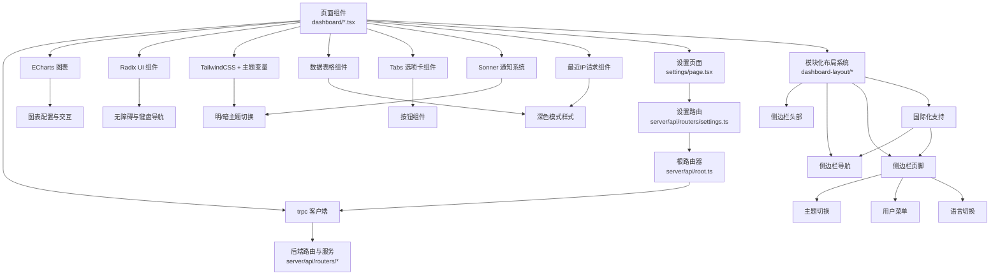
```mermaid
graph TB
UI["页面组件<br/>dashboard/*.tsx"] --> TRPC["trpc 客户端"]
TRPC --> API["后端路由与服务<br/>server/api/routers/*"]
UI --> ECharts["ECharts 图表"]
UI --> Radix["Radix UI 组件"]
UI --> Tailwind["TailwindCSS + 主题变量"]
UI --> Tables["数据表格组件"]
UI --> Tabs["Tabs 选项卡组件"]
UI --> Sonner["Sonner 通知系统"]
UI --> RecentIP["最近IP请求组件"]
UI --> Settings["设置页面<br/>settings/page.tsx"]
UI --> Layout["模块化布局系统<br/>dashboard-layout/*"]
Layout --> Header["侧边栏头部"]
Layout --> Nav["侧边栏导航"]
Layout --> Footer["侧边栏页脚"]
Footer --> ThemeToggle["主题切换"]
Footer --> UserMenu["用户菜单"]
Footer --> LangSwitcher["语言切换"]
Settings --> SettingsRouter["设置路由<br/>server/api/routers/settings.ts"]
SettingsRouter --> RootRouter["根路由器<br/>server/api/root.ts"]
RootRouter --> TRPC
Tabs --> BTN["按钮组件"]
Sonner --> Theme["主题适配"]
Tables --> DarkMode["深色模式样式"]
RecentIP --> DarkMode
ECharts --> ChartCfg["图表配置与交互"]
Radix --> Access["无障碍与键盘导航"]
Tailwind --> Theme["明/暗主题切换"]
Layout --> Intl["国际化支持"]
Intl --> Nav
Intl --> Footer
```

**图表来源**
- [仪表板首页](file://src/app/(dashboard)/page.tsx#L1-L243)
- [用量趋势图组件](file://src/app/(dashboard)/components/usage-trend-chart.tsx#L1-L300)
- [模型分布图组件](file://src/app/(dashboard)/components/model-distribution-chart.tsx#L1-L124)
- [地区热力图组件](file://src/app/(dashboard)/components/region-heatmap-chart.tsx#L1-L174)
- [按钮基础组件:1-77](file://src/components/ui/button.tsx#L1-L77)
- [API 密钥表格组件](file://src/app/(dashboard)/keys/components/api-key-table.tsx#L1-L192)
- [策略表格组件](file://src/app/(dashboard)/quotas/components/policy-table.tsx#L1-L181)
- [白名单规则表格组件](file://src/app/(dashboard)/users/components/whitelist-rule-table.tsx#L1-L178)
- [数据表格组件:1-191](file://src/components/ui/data-table.tsx#L1-L191)
- [基础表格组件:1-95](file://src/components/ui/table.tsx#L1-L95)
- [Tabs 组件:1-56](file://src/components/ui/tabs.tsx#L1-L56)
- [Sonner 通知组件:1-46](file://src/components/ui/sonner.tsx#L1-L46)
- [最近IP请求显示组件](file://src/app/(dashboard)/components/recent-ip-requests.tsx#L1-L225)
- [管理员账户设置页面:1-148](file://src/app/settings/page.tsx#L1-L148)
- [设置路由:1-121](file://src/server/api/routers/settings.ts#L1-L121)
- [根路由器:1-25](file://src/server/api/root.ts#L1-L25)
- [仪表板布局组件:1-29](file://src/components/dashboard-layout/index.tsx#L1-L29)
- [侧边栏导航组件:1-64](file://src/components/dashboard-layout/sidebar-nav.tsx#L1-L64)
- [侧边栏页脚组件:1-172](file://src/components/dashboard-layout/sidebar-footer.tsx#L1-L172)
- [国际化中文配置:1-180](file://src/messages/zh.json#L1-L180)
- [国际化英文配置:1-180](file://src/messages/en.json#L1-L180)

## 组件详解

### 模块化仪表板布局系统
**更新** 仪表板布局系统已从单一组件重构为模块化架构，提供更好的可维护性和扩展性：

- **布局容器**：`DashboardLayout` 组件作为主容器，采用 Flex 布局实现侧边栏 + 主内容区域的两栏布局
- **侧边栏头部**：`SidebarHeader` 组件包含品牌标识和标题，使用液态玻璃效果增强视觉层次
- **侧边栏导航**：`SidebarNav` 组件提供功能导航，支持当前路由高亮和悬停效果
- **侧边栏页脚**：`SidebarFooter` 组件集成主题切换、用户菜单和语言切换功能
- **响应式设计**：侧边栏固定宽度 64，确保在不同屏幕尺寸下的稳定性
- **国际化支持**：导航菜单和页脚功能均支持中英文双语切换

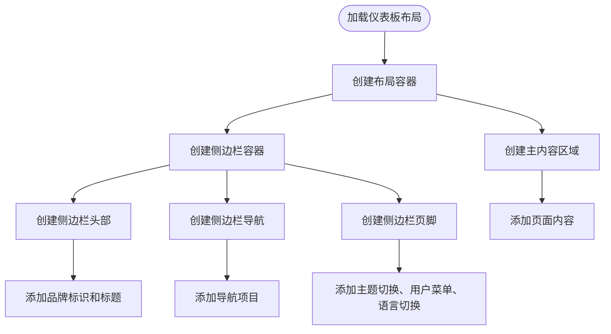
```mermaid
flowchart TD
Start(["加载仪表板布局"]) --> CreateContainer["创建布局容器"]
CreateContainer --> CreateSidebar["创建侧边栏容器"]
CreateSidebar --> CreateHeader["创建侧边栏头部"]
CreateSidebar --> CreateNav["创建侧边栏导航"]
CreateSidebar --> CreateFooter["创建侧边栏页脚"]
CreateContainer --> CreateMain["创建主内容区域"]
CreateHeader --> HeaderContent["添加品牌标识和标题"]
CreateNav --> NavItems["添加导航项目"]
CreateFooter --> FooterFeatures["添加主题切换、用户菜单、语言切换"]
CreateMain --> MainContent["添加页面内容"]
```

**图表来源**
- [仪表板布局组件:1-29](file://src/components/dashboard-layout/index.tsx#L1-L29)
- [侧边栏头部组件:1-18](file://src/components/dashboard-layout/sidebar-header.tsx#L1-L18)
- [侧边栏导航组件:1-64](file://src/components/dashboard-layout/sidebar-nav.tsx#L1-L64)
- [侧边栏页脚组件:1-172](file://src/components/dashboard-layout/sidebar-footer.tsx#L1-L172)

**章节来源**
- [仪表板布局组件:1-29](file://src/components/dashboard-layout/index.tsx#L1-L29)
- [侧边栏头部组件:1-18](file://src/components/dashboard-layout/sidebar-header.tsx#L1-L18)
- [侧边栏导航组件:1-64](file://src/components/dashboard-layout/sidebar-nav.tsx#L1-L64)
- [侧边栏页脚组件:1-172](file://src/components/dashboard-layout/sidebar-footer.tsx#L1-L172)

### 侧边栏头部组件（SidebarHeader）
- **设计目标**：提供仪表板的品牌标识和标题展示，使用液态玻璃效果增强视觉层次
- **组件结构**：包含品牌图标、品牌名称和装饰性背景元素
- **视觉设计**：使用圆角背景、模糊效果、阴影和渐变色彩营造现代感
- **响应式适配**：在不同屏幕尺寸下保持一致的视觉效果

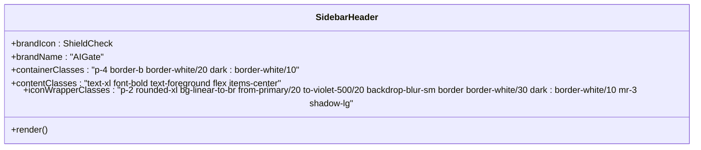
```mermaid
classDiagram
class SidebarHeader {
+render()
+brandIcon : ShieldCheck
+brandName : "AIGate"
+containerClasses : "p-4 border-b border-white/20 dark : border-white/10"
+contentClasses : "text-xl font-bold text-foreground flex items-center"
+iconWrapperClasses : "p-2 rounded-xl bg-linear-to-br from-primary/20 to-violet-500/20 backdrop-blur-sm border border-white/30 dark : border-white/10 mr-3 shadow-lg"
}
```

**图表来源**
- [侧边栏头部组件:1-18](file://src/components/dashboard-layout/sidebar-header.tsx#L1-L18)

**章节来源**
- [侧边栏头部组件:1-18](file://src/components/dashboard-layout/sidebar-header.tsx#L1-L18)

### 侧边栏导航组件（SidebarNav）
**更新** 导航组件已完全重构，集成国际化支持和动态路由高亮：

- **国际化导航**：使用 `useTranslation` hook 获取导航文案，支持中英文双语切换
- **动态路由高亮**：通过 `usePathname` 获取当前路由，自动高亮对应导航项
- **动画效果**：使用 CSS 过渡动画和变换效果，提供流畅的交互体验
- **图标集成**：每个导航项包含对应的 Lucide 图标，增强识别度
- **响应式设计**：导航项在悬停时具有缩放效果，激活状态有明显的视觉反馈

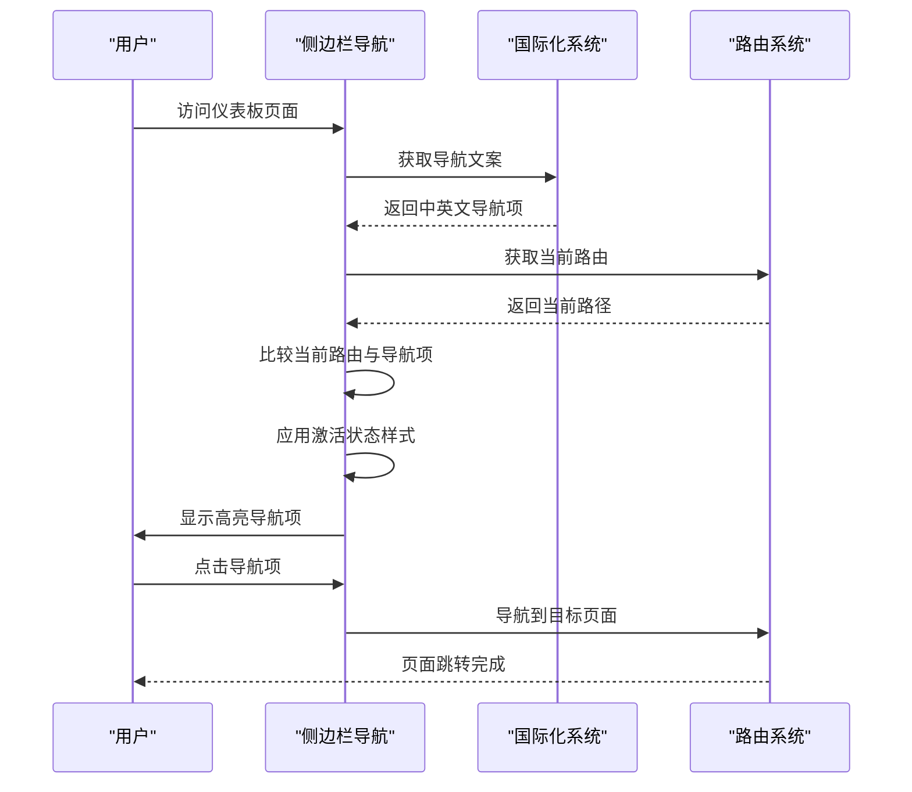
```mermaid
sequenceDiagram
participant User as "用户"
participant Nav as "侧边栏导航"
participant Translation as "国际化系统"
participant Router as "路由系统"
User->>Nav : 访问仪表板页面
Nav->>Translation : 获取导航文案
Translation-->>Nav : 返回中英文导航项
Nav->>Router : 获取当前路由
Router-->>Nav : 返回当前路径
Nav->>Nav : 比较当前路由与导航项
Nav->>Nav : 应用激活状态样式
Nav->>User : 显示高亮导航项
User->>Nav : 点击导航项
Nav->>Router : 导航到目标页面
Router-->>User : 页面跳转完成
```

**图表来源**
- [侧边栏导航组件:1-64](file://src/components/dashboard-layout/sidebar-nav.tsx#L1-L64)
- [国际化中文配置:1-180](file://src/messages/zh.json#L1-L180)
- [国际化英文配置:1-180](file://src/messages/en.json#L1-L180)

**章节来源**
- [侧边栏导航组件:1-64](file://src/components/dashboard-layout/sidebar-nav.tsx#L1-L64)
- [国际化中文配置:1-180](file://src/messages/zh.json#L1-L180)
- [国际化英文配置:1-180](file://src/messages/en.json#L1-L180)

### 侧边栏页脚组件（SidebarFooter）
**更新** 页脚组件已完全重构，集成完整的用户管理和系统功能：

- **主题切换**：`ThemeToggle` 组件实现明暗主题切换，支持本地存储和系统偏好检测
- **用户菜单**：`UserMenu` 组件集成个人资料、邮箱密码设置和退出登录功能
- **语言切换**：`LanguageSwitcher` 组件提供中英文语言切换功能
- **GitHub 链接**：在演示模式下显示项目源码链接
- **响应式设计**：所有功能按钮均支持悬停效果和缩放动画

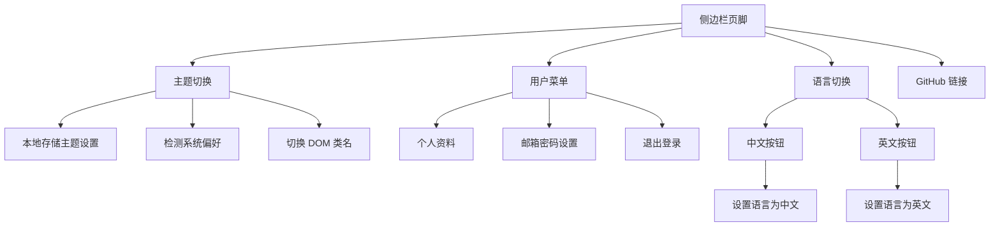
```mermaid
flowchart TD
Footer["侧边栏页脚"] --> ThemeToggle["主题切换"]
Footer --> UserMenu["用户菜单"]
Footer --> LangSwitcher["语言切换"]
Footer --> GithubLink["GitHub 链接"]
ThemeToggle --> LocalStorage["本地存储主题设置"]
ThemeToggle --> SystemPref["检测系统偏好"]
ThemeToggle --> DOMClass["切换 DOM 类名"]
UserMenu --> Profile["个人资料"]
UserMenu --> Settings["邮箱密码设置"]
UserMenu --> Logout["退出登录"]
LangSwitcher --> ZhBtn["中文按钮"]
LangSwitcher --> EnBtn["英文按钮"]
ZhBtn --> SetLocale["设置语言为中文"]
EnBtn --> SetLocale2["设置语言为英文"]
```

**图表来源**
- [侧边栏页脚组件:1-172](file://src/components/dashboard-layout/sidebar-footer.tsx#L1-L172)

**章节来源**
- [侧边栏页脚组件:1-172](file://src/components/dashboard-layout/sidebar-footer.tsx#L1-L172)

### 仪表板整体设计
- 信息架构：顶部标题与描述明确身份；统计卡片提供关键指标概览；下方分区块展示趋势、分布、活动与最近请求。
- 视觉层次：卡片容器采用液态玻璃效果（模糊、半透明白/深色背景、阴影），标题与图标强化可读性。
- 用户体验：加载态使用骨架屏与旋转指示器；交互采用悬停缩放与过渡动画；响应式网格随屏幕宽度自动调整列数。
- **深色模式优化**：所有标题文本都已设置深色模式颜色，确保在暗色主题下具有良好的对比度和可读性。

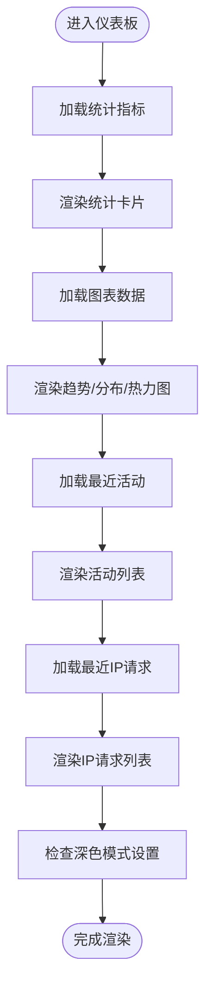
```mermaid
flowchart TD
Start(["进入仪表板"]) --> LoadStats["加载统计指标"]
LoadStats --> RenderCards["渲染统计卡片"]
RenderCards --> LoadCharts["加载图表数据"]
LoadCharts --> RenderCharts["渲染趋势/分布/热力图"]
RenderCharts --> LoadActivities["加载最近活动"]
LoadActivities --> RenderActivities["渲染活动列表"]
RenderActivities --> LoadRecentIP["加载最近IP请求"]
LoadRecentIP --> RenderRecentIP["渲染IP请求列表"]
RenderRecentIP --> DarkModeCheck["检查深色模式设置"]
DarkModeCheck --> End(["完成渲染"])
```

**图表来源**
- [仪表板首页](file://src/app/(dashboard)/page.tsx#L1-L243)
- [最近IP请求显示组件](file://src/app/(dashboard)/components/recent-ip-requests.tsx#L1-L225)

**章节来源**
- [仪表板首页](file://src/app/(dashboard)/page.tsx#L1-L243)
- [最近IP请求显示组件](file://src/app/(dashboard)/components/recent-ip-requests.tsx#L1-L225)

### Tabs 组件（Tabs）
- 设计目标：提供选项卡导航功能，支持多个内容区域的切换展示。
- 组件结构：包含 Tabs 根容器、TabsList 标签列表、TabsTrigger 标签触发器和 TabsContent 内容区域。
- 交互特性：支持键盘导航、焦点管理、状态切换动画；激活状态有明确的视觉反馈。
- 样式定制：基于 CSS 变量和 Tailwind 类名组合，支持主题适配和尺寸调整。

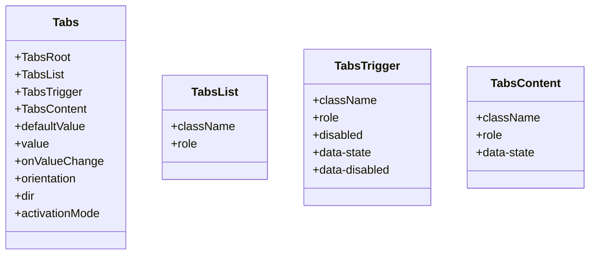
```mermaid
classDiagram
class Tabs {
+TabsRoot
+TabsList
+TabsTrigger
+TabsContent
+defaultValue
+value
+onValueChange
+orientation
+dir
+activationMode
}
class TabsList {
+className
+role
}
class TabsTrigger {
+className
+role
+disabled
+data-state
+data-disabled
}
class TabsContent {
+className
+role
+data-state
}
```

**图表来源**
- [Tabs 组件:1-56](file://src/components/ui/tabs.tsx#L1-L56)

**章节来源**
- [Tabs 组件:1-56](file://src/components/ui/tabs.tsx#L1-L56)

### Sonner 通知系统（Toaster）
- 设计目标：提供现代化的通知提示系统，支持多种通知类型和主题适配。
- 通知类型：成功（CircleCheck）、错误（OctagonX）、警告（TriangleAlert）、信息（Info）、加载（LoaderCircle）。
- 主题适配：自动检测系统主题，支持明/暗主题切换；图标和样式会根据主题自动调整。
- 样式定制：通过 classNames 属性自定义通知容器、描述文本、操作按钮和取消按钮的样式。

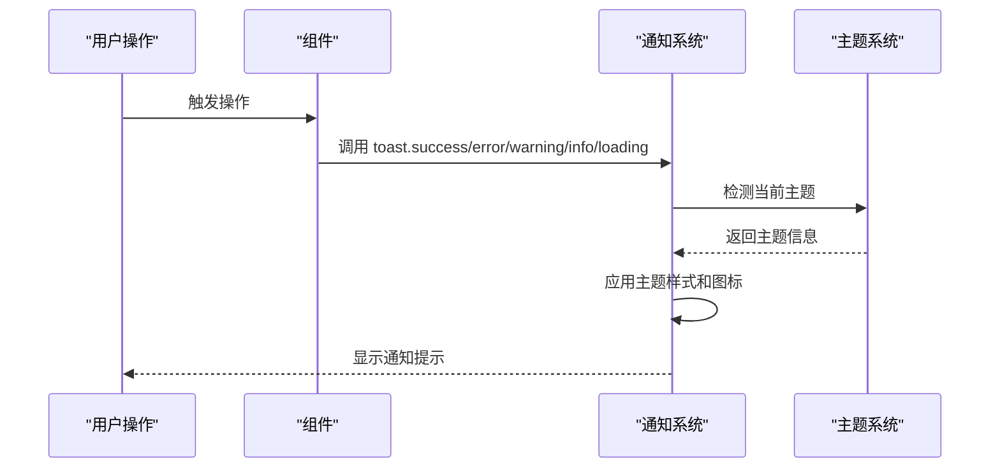
```mermaid
sequenceDiagram
participant User as "用户操作"
participant Component as "组件"
participant Sonner as "通知系统"
participant Theme as "主题系统"
User->>Component : 触发操作
Component->>Sonner : 调用 toast.success/error/warning/info/loading
Sonner->>Theme : 检测当前主题
Theme-->>Sonner : 返回主题信息
Sonner->>Sonner : 应用主题样式和图标
Sonner-->>User : 显示通知提示
```

**图表来源**
- [Sonner 通知组件:1-46](file://src/components/ui/sonner.tsx#L1-L46)

**章节来源**
- [Sonner 通知组件:1-46](file://src/components/ui/sonner.tsx#L1-L46)

### 统计卡片组件（StatCard）
- 设计目标：以卡片形式展示关键指标，包含数值、变化趋势与图标，支持加载态骨架屏。
- 交互与反馈：根据变化类型（正/负/平）显示不同颜色；数值格式化支持千/百万单位；悬停缩放与阴影增强可点击感。
- 无障碍：语义化标签与对比度保证可读性。

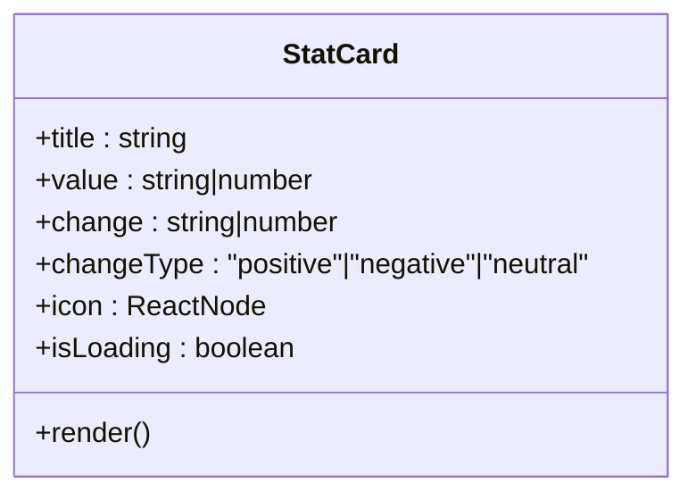
```mermaid
classDiagram
class StatCard {
+title : string
+value : string|number
+change : string|number
+changeType : "positive"|"negative"|"neutral"
+icon : ReactNode
+isLoading : boolean
+render()
}
```

**图表来源**
- [统计卡片组件](file://src/app/(dashboard)/components/stat-card.tsx#L1-L76)

**章节来源**
- [统计卡片组件](file://src/app/(dashboard)/components/stat-card.tsx#L1-L76)

### 用量趋势图（UsageTrendChart）
- 数据结构：日期、请求数、Token 消耗三元组。
- 图表特性：双轴折线图，左轴请求数、右轴 Token 数；平滑曲线与工具提示；响应式自适应。
- 样式增强：全面改进的视觉样式，包括 Tooltip 样式、图例配置、网格布局、坐标轴样式、双轴支持、线条样式、数据点样式、渐变填充等。
- 错误与边界：空数据时显示占位文本；加载态显示旋转指示器；窗口大小变化时自动重绘。

**更新** 用量趋势图组件经过全面样式改进，实现了现代化的视觉设计：

- **Tooltip 样式**：增加了半透明背景、圆角边框、阴影效果和更好的文本样式
- **图例配置**：优化了位置、间距和样式，提升可读性
- **网格布局**：调整了内外边距和标签包含设置
- **坐标轴样式**：增强了颜色、字体大小和分割线样式
- **双轴支持**：为两个 Y 轴分别设置了不同的颜色方案和样式
- **线条样式**：改进了线条宽度、圆角和阴影效果
- **数据点样式**：增强了数据点的边框、阴影和渐变填充
- **渐变填充**：为面积图添加了线性渐变效果

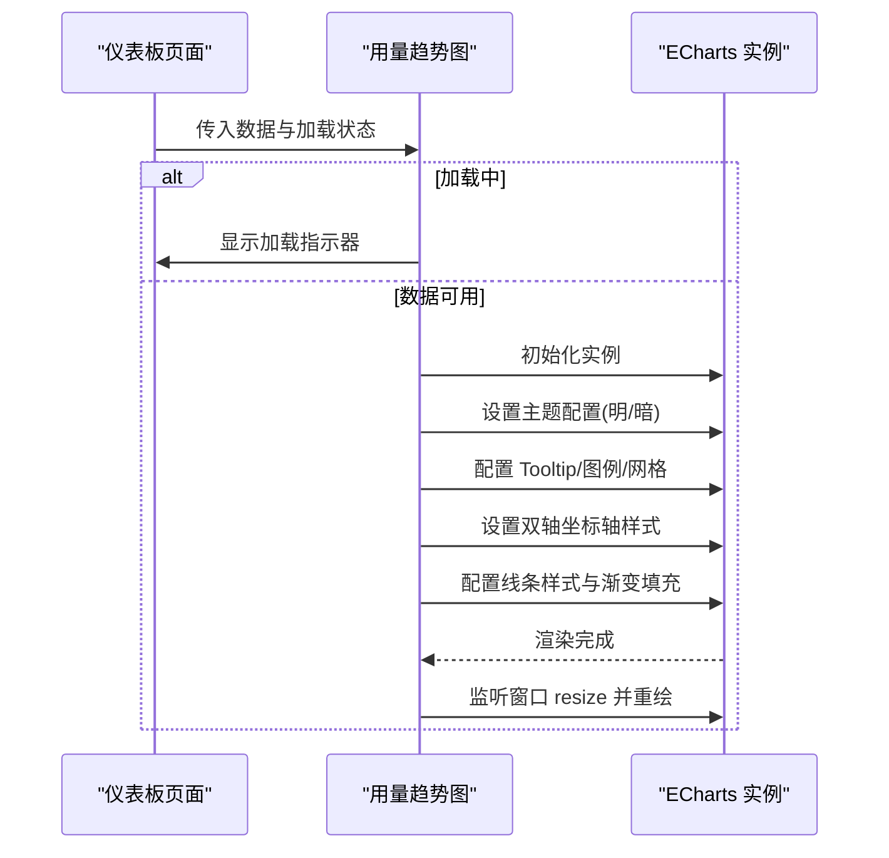
```mermaid
sequenceDiagram
participant Page as "仪表板页面"
participant Chart as "用量趋势图"
participant ECharts as "ECharts 实例"
Page->>Chart : 传入数据与加载状态
alt 加载中
Chart->>Page : 显示加载指示器
else 数据可用
Chart->>ECharts : 初始化实例
Chart->>ECharts : 设置主题配置(明/暗)
Chart->>ECharts : 配置 Tooltip/图例/网格
Chart->>ECharts : 设置双轴坐标轴样式
Chart->>ECharts : 配置线条样式与渐变填充
ECharts-->>Chart : 渲染完成
Chart->>ECharts : 监听窗口 resize 并重绘
end
```

**图表来源**
- [用量趋势图组件](file://src/app/(dashboard)/components/usage-trend-chart.tsx#L1-L300)

**章节来源**
- [用量趋势图组件](file://src/app/(dashboard)/components/usage-trend-chart.tsx#L1-L300)

### 模型分布图（ModelDistributionChart）
- 数据结构：模型名称、Token 消耗总量、请求次数。
- 图表特性：环形饼图，外层标签显示百分比；工具提示汇总请求次数与 Token 消耗；按总请求计算占比。
- 边界处理：无数据时显示"暂无数据"提示；加载态显示旋转指示器。

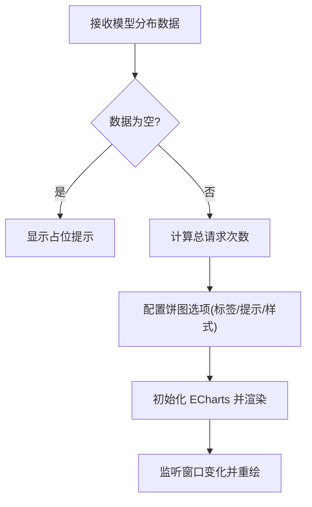
```mermaid
flowchart TD
A["接收模型分布数据"] --> B{"数据为空?"}
B -- 是 --> C["显示占位提示"]
B -- 否 --> D["计算总请求次数"]
D --> E["配置饼图选项(标签/提示/样式)"]
E --> F["初始化 ECharts 并渲染"]
F --> G["监听窗口变化并重绘"]
```

**图表来源**
- [模型分布图组件](file://src/app/(dashboard)/components/model-distribution-chart.tsx#L1-L124)

**章节来源**
- [模型分布图组件](file://src/app/(dashboard)/components/model-distribution-chart.tsx#L1-L124)

### 地区热力图（RegionHeatmapChart）
- 数据结构：省/市名称、请求次数、Token 消耗。
- 图表特性：中国地图热力图，动态注册地图数据；视觉映射设置颜色区间；高亮与标签增强可读性。
- 异常处理：地图数据加载失败时显示错误提示；加载中显示旋转指示器；无数据时显示占位提示。

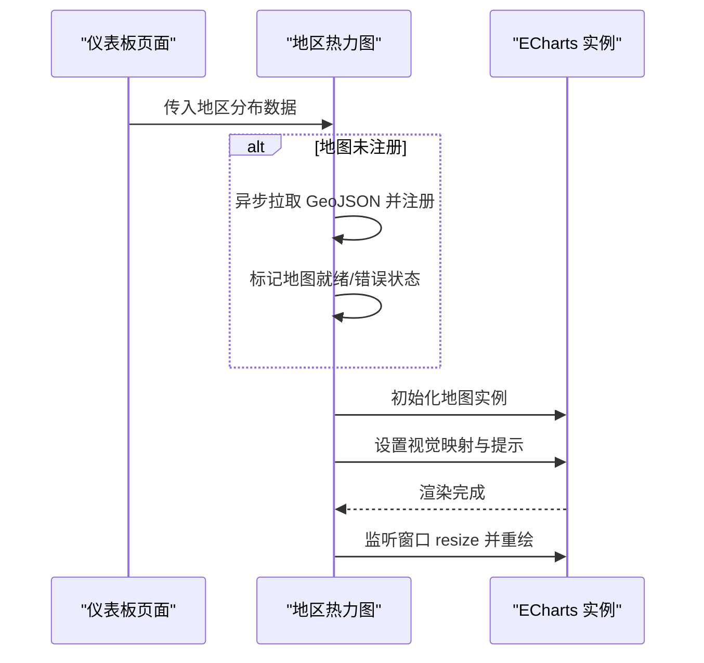
```mermaid
sequenceDiagram
participant Page as "仪表板页面"
participant Map as "地区热力图"
participant ECharts as "ECharts 实例"
Page->>Map : 传入地区分布数据
alt 地图未注册
Map->>Map : 异步拉取 GeoJSON 并注册
Map->>Map : 标记地图就绪/错误状态
end
Map->>ECharts : 初始化地图实例
Map->>ECharts : 设置视觉映射与提示
ECharts-->>Map : 渲染完成
Map->>ECharts : 监听窗口 resize 并重绘
```

**图表来源**
- [地区热力图组件](file://src/app/(dashboard)/components/region-heatmap-chart.tsx#L1-L174)

**章节来源**
- [地区热力图组件](file://src/app/(dashboard)/components/region-heatmap-chart.tsx#L1-L174)

### 最近活动（RecentActivity）
- 设计目标：以时间线形式展示最近系统活动，支持加载态骨架屏与空状态提示。
- 交互：逐项渲染活动条目，保持列表可读性与一致性。

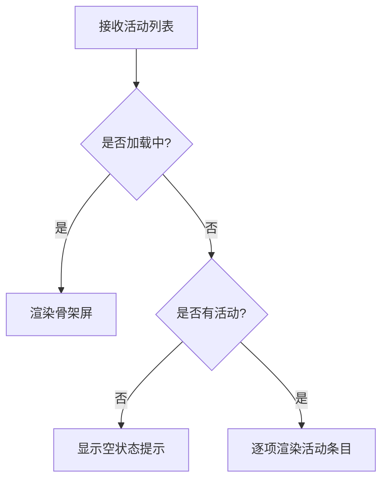
```mermaid
flowchart TD
S["接收活动列表"] --> L{"是否加载中?"}
L -- 是 --> P["渲染骨架屏"]
L -- 否 --> E{"是否有活动?"}
E -- 否 --> N["显示空状态提示"]
E -- 是 --> R["逐项渲染活动条目"]
```

**图表来源**
- [最近活动列表组件](file://src/app/(dashboard)/components/recent-activity.tsx#L1-L53)

**章节来源**
- [最近活动列表组件](file://src/app/(dashboard)/components/recent-activity.tsx#L1-L53)

### 最近IP请求显示组件（RecentIpRequests）
- 设计目标：展示最近的IP请求记录，包含IP地址、归属地、用户ID、模型、Token消耗和时间等信息。
- 数据结构：包含请求ID、用户ID、客户端IP、地区、模型、提供商、总Token消耗和时间戳。
- 表格特性：支持分页显示、加载态骨架屏、空状态提示；用户ID列采用 break-all 格式，允许长用户ID自然换行。
- 交互优化：提供分页导航、时间格式化（相对时间显示）、提供商颜色标识、行悬停效果。
- **深色模式优化**：用户ID列文本颜色已适配深色模式，确保在暗色主题下的良好可读性。

**更新** 最近IP请求组件经过优化，用户ID列的格式从 truncate 类改为 break-all，这一变更显著改善了长用户ID的显示效果：

- **break-all 格式**：允许长用户ID在单词边界处自然换行，避免截断显示
- **响应式设计**：在窄屏设备上，长用户ID能够自动适应容器宽度
- **可读性提升**：用户不再需要滚动查看完整的用户ID，提高了信息获取效率
- **深色模式兼容**：用户ID列的深色模式颜色已正确配置，确保在暗色主题下的良好对比度

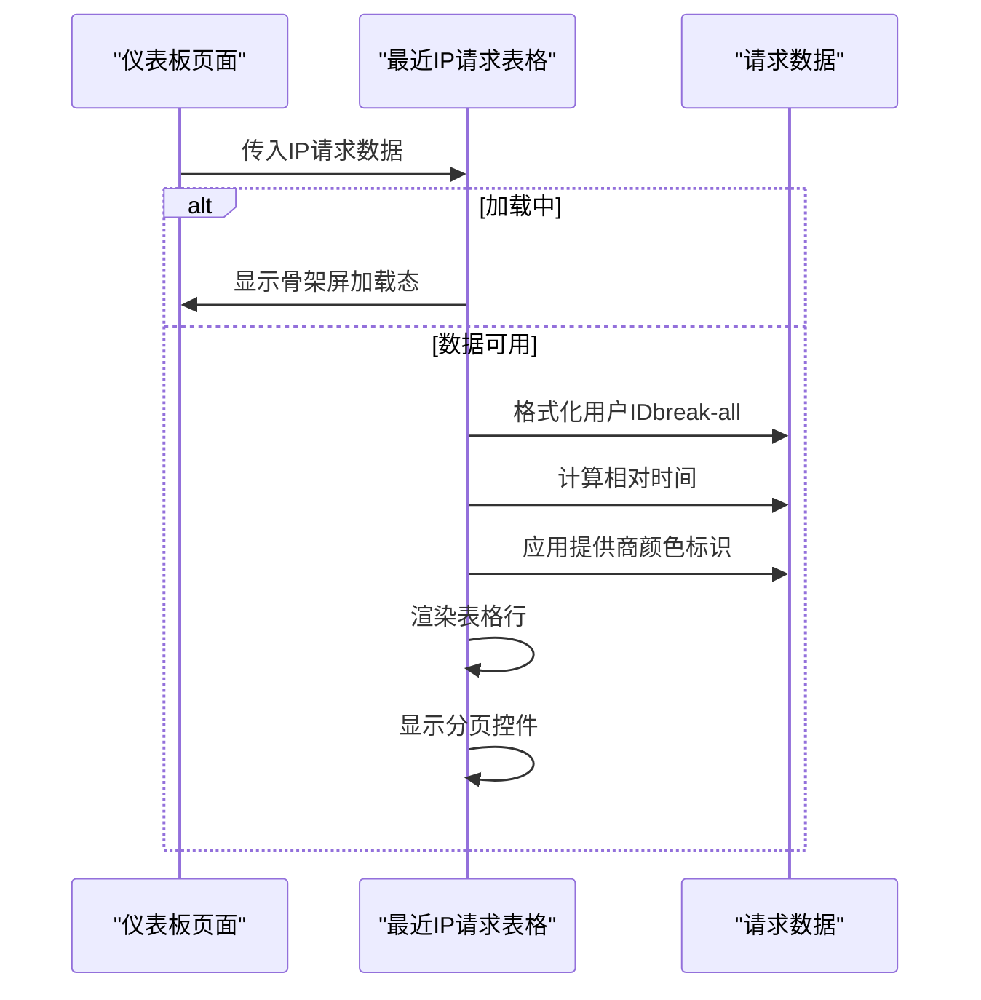
```mermaid
sequenceDiagram
participant Page as "仪表板页面"
participant Table as "最近IP请求表格"
participant Data as "请求数据"
Page->>Table : 传入IP请求数据
alt 加载中
Table->>Page : 显示骨架屏加载态
else 数据可用
Table->>Data : 格式化用户IDbreak-all
Table->>Data : 计算相对时间
Table->>Data : 应用提供商颜色标识
Table->>Table : 渲染表格行
Table->>Table : 显示分页控件
end
```

**图表来源**
- [最近IP请求显示组件](file://src/app/(dashboard)/components/recent-ip-requests.tsx#L1-L225)

**章节来源**
- [最近IP请求显示组件](file://src/app/(dashboard)/components/recent-ip-requests.tsx#L1-L225)

### 配额管理界面（QuotasPage）
- 页面职责：展示配额策略列表，支持新建/编辑/删除策略；使用对话框承载表单；在 trpc 变更后刷新列表。
- 交互流程：打开对话框 -> 编辑或新增 -> 保存 -> 成功回调 -> 关闭对话框 -> 刷新列表。
- 错误处理：确认删除、加载态与操作中的禁用状态。
- **深色模式优化**：策略表格组件已完全支持深色模式，包括标题文本、状态标签、操作按钮的颜色适配。

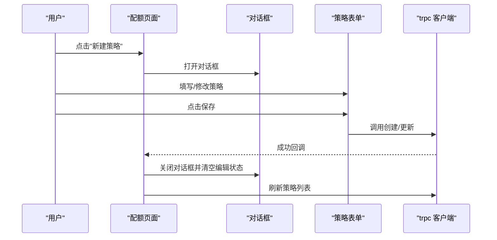
```mermaid
sequenceDiagram
participant U as "用户"
participant P as "配额页面"
participant D as "对话框"
participant F as "策略表单"
participant T as "trpc 客户端"
U->>P : 点击"新建策略"
P->>D : 打开对话框
U->>F : 填写/修改策略
U->>F : 点击保存
F->>T : 调用创建/更新
T-->>P : 成功回调
P->>D : 关闭对话框并清空编辑状态
P->>T : 刷新策略列表
```

**图表来源**
- [配额策略页面](file://src/app/(dashboard)/quotas/page.tsx#L1-L141)

**章节来源**
- [配额策略页面](file://src/app/(dashboard)/quotas/page.tsx#L1-L141)

### API Key 管理界面（KeysPage）
- 页面职责：展示 API Key 列表，支持生成、禁用、删除与复制；提供密钥轮换与有效期管理。
- 表单设计：输入框、选择器、开关与按钮组合；校验与错误提示。
- 数据表格：支持排序、筛选与分页；行内操作按钮（编辑/删除/复制）。
- 交互优化：复制成功提示、批量操作确认、空状态与加载态。
- **深色模式优化**：API 密钥表格组件已完全支持深色模式，包括：
  - 标题文本颜色：`text-gray-900 dark:text-white`
  - 状态标签颜色：`dark:text-success-100` 和 `dark:text-danger-100`
  - 操作按钮颜色：`dark:text-blue-400`、`dark:text-indigo-400`、`dark:text-red-400`
  - 表格行颜色：`dark:bg-slate-900/30`、`dark:hover:bg-slate-800/50`
  - 边框颜色：`dark:border-slate-700`

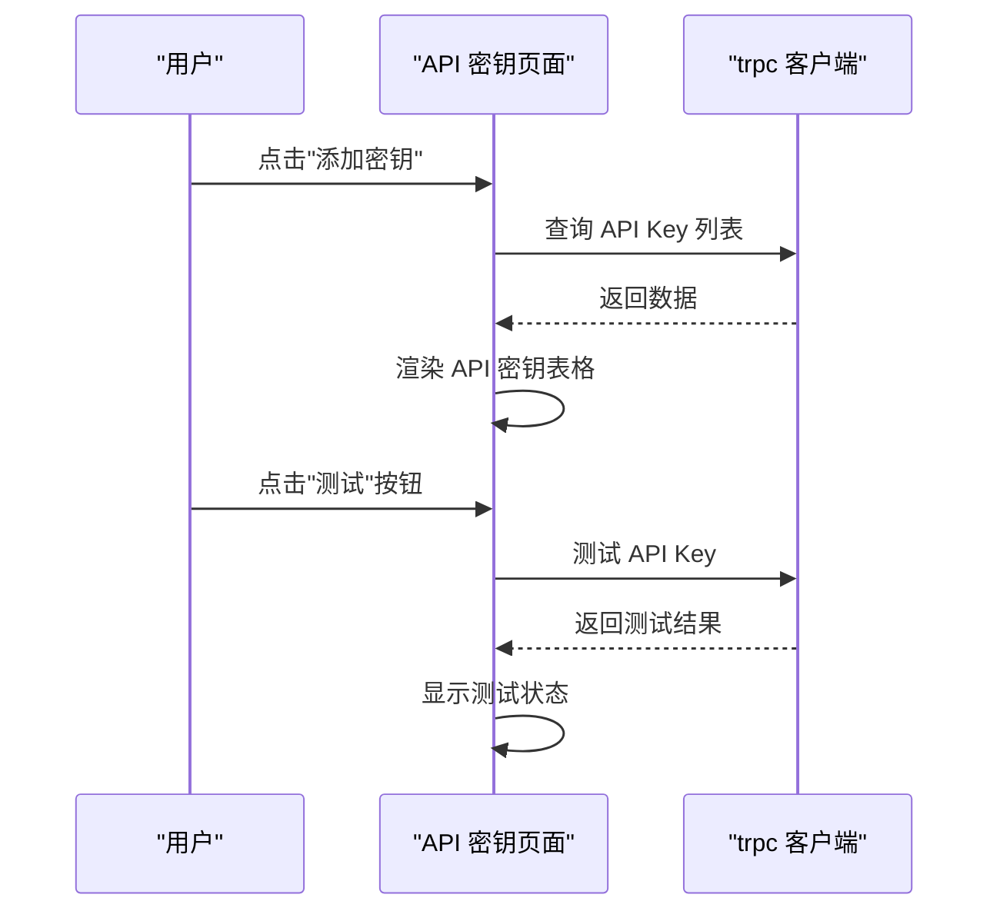
```mermaid
sequenceDiagram
participant U as "用户"
participant P as "API 密钥页面"
participant T as "trpc 客户端"
U->>P : 点击"添加密钥"
P->>T : 查询 API Key 列表
T-->>P : 返回数据
P->>P : 渲染 API 密钥表格
U->>P : 点击"测试"按钮
P->>T : 测试 API Key
T-->>P : 返回测试结果
P->>P : 显示测试状态
```

**图表来源**
- [API 密钥管理页面](file://src/app/(dashboard)/keys/page.tsx#L1-L193)

**章节来源**
- [API 密钥管理页面](file://src/app/(dashboard)/keys/page.tsx#L1-L193)

### 用户策略管理（白名单规则）（UsersPage）
- 页面职责：维护用户白名单规则，支持按用户 ID 或 IP 段配置；支持启用/禁用与优先级排序。
- 表单设计：输入校验（IP/CIDR）、时间范围、策略类型（允许/拒绝）。
- 表格与操作：行内编辑、批量导入导出、搜索过滤。
- **深色模式优化**：白名单规则表格组件已完全支持深色模式，包括：
  - 标题文本颜色：`dark:text-white`
  - 描述文本颜色：`dark:text-gray-300`
  - 优先级标签颜色：`dark:text-blue-200`
  - 校验规则标签颜色：`dark:text-green-200`
  - 操作按钮颜色：`dark:text-indigo-400`、`dark:text-red-400`
  - 表格单元格颜色：`dark:text-gray-200`

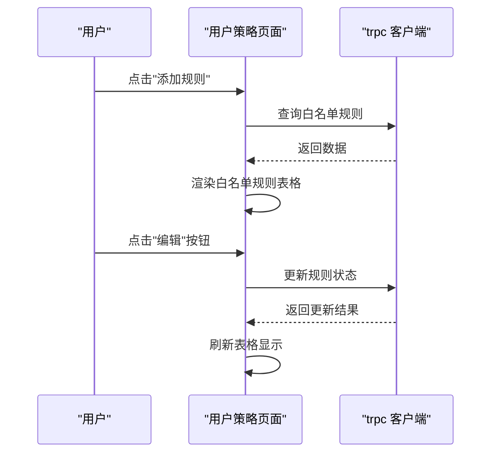
```mermaid
sequenceDiagram
participant U as "用户"
participant P as "用户策略页面"
participant T as "trpc 客户端"
U->>P : 点击"添加规则"
P->>T : 查询白名单规则
T-->>P : 返回数据
P->>P : 渲染白名单规则表格
U->>P : 点击"编辑"按钮
P->>T : 更新规则状态
T-->>P : 返回更新结果
P->>P : 刷新表格显示
```

**图表来源**
- [用户策略管理页面](file://src/app/(dashboard)/users/page.tsx#L1-L146)

**章节来源**
- [用户策略管理页面](file://src/app/(dashboard)/users/page.tsx#L1-L146)

### 数据表格组件（DataTable）
- 设计目标：提供通用的数据表格渲染能力，支持排序、筛选、分页和空状态显示。
- 深色模式优化：表格头部、行、单元格都已适配深色模式，确保在暗色主题下的良好可读性。
- 交互：支持鼠标悬停效果、选中状态和分页导航。

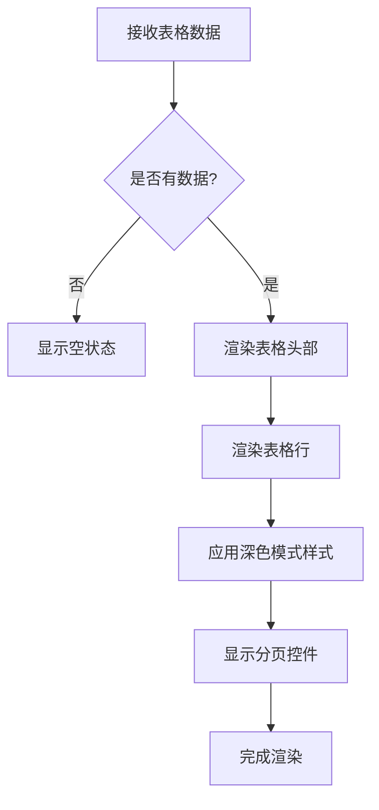
```mermaid
flowchart TD
A["接收表格数据"] --> B{"是否有数据?"}
B -- 否 --> C["显示空状态"]
B -- 是 --> D["渲染表格头部"]
D --> E["渲染表格行"]
E --> F["应用深色模式样式"]
F --> G["显示分页控件"]
G --> H["完成渲染"]
```

**图表来源**
- [数据表格组件:1-191](file://src/components/ui/data-table.tsx#L1-L191)

**章节来源**
- [数据表格组件:1-191](file://src/components/ui/data-table.tsx#L1-L191)

### 基础表格组件（Table）
- 设计目标：提供表格的基础结构，包括表头、表体、行和单元格。
- 深色模式优化：表格行的边框、悬停效果和选中状态都已适配深色模式。
- 交互：支持行选中状态和悬停效果。

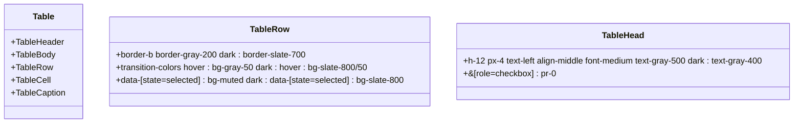
```mermaid
classDiagram
class Table {
+TableHeader
+TableBody
+TableRow
+TableCell
+TableCaption
}
class TableRow {
+border-b border-gray-200 dark : border-slate-700
+transition-colors hover : bg-gray-50 dark : hover : bg-slate-800/50
+data-[state=selected] : bg-muted dark : data-[state=selected] : bg-slate-800
}
class TableHead {
+h-12 px-4 text-left align-middle font-medium text-gray-500 dark : text-gray-400
+&[role=checkbox] : pr-0
}
```

**图表来源**
- [基础表格组件:1-95](file://src/components/ui/table.tsx#L1-L95)

**章节来源**
- [基础表格组件:1-95](file://src/components/ui/table.tsx#L1-L95)

### 管理员账户设置页面（SettingsPage）
- 设计目标：提供管理员账户信息修改界面，支持邮箱和密码的更新，包含完整的表单验证与实时反馈。
- 页面结构：采用液态玻璃卡片设计，包含邮箱输入、密码输入、确认密码输入和提交按钮。
- 表单验证：支持邮箱格式验证、密码长度验证（至少6位）、确认密码匹配验证。
- TRPC集成：使用 `getAdminAccount` 查询获取当前账户信息，使用 `updateAdminAccount` 变更更新。
- 通知系统：集成 Sonner 通知，在成功和错误情况下提供即时反馈。
- 安全机制：生产环境限制直接修改环境变量文件，防止意外配置更改。
- 交互流程：加载账户信息 -> 用户编辑表单 -> 客户端验证 -> TRPC调用 -> 成功/错误反馈 -> 页面跳转。

```mermaid
sequenceDiagram
participant User as "管理员用户"
participant SettingsPage as "设置页面"
participant Form as "表单组件"
participant TRPC as "trpc 客户端"
participant SettingsRouter as "设置路由"
participant Toast as "通知系统"
User->>SettingsPage : 访问 /settings 页面
SettingsPage->>TRPC : 调用 getAdminAccount
TRPC->>SettingsRouter : 查询管理员账户信息
SettingsRouter-->>TRPC : 返回账户信息
TRPC-->>SettingsPage : 返回数据
SettingsPage->>Form : 渲染表单并显示当前信息
User->>Form : 编辑邮箱/密码
Form->>Form : 客户端验证邮箱格式、密码长度、确认密码匹配
Form->>TRPC : 调用 updateAdminAccount
TRPC->>SettingsRouter : 更新管理员账户
SettingsRouter->>SettingsRouter : 验证生产环境限制
SettingsRouter->>SettingsRouter : 写入环境变量文件
SettingsRouter-->>TRPC : 返回成功/错误结果
TRPC-->>Form : 返回结果
Form->>Toast : 显示成功/错误通知
Form->>SettingsPage : 跳转到仪表板
```

**图表来源**
- [管理员账户设置页面:1-148](file://src/app/settings/page.tsx#L1-L148)
- [设置路由:1-121](file://src/server/api/routers/settings.ts#L1-L121)

**章节来源**
- [管理员账户设置页面:1-148](file://src/app/settings/page.tsx#L1-L148)
- [设置路由:1-121](file://src/server/api/routers/settings.ts#L1-L121)

### 设置路由（SettingsRouter）
- 设计目标：提供管理员账户信息的获取与更新接口，支持受保护的访问控制。
- 接口设计：`getAdminAccount` 查询获取当前邮箱信息，`updateAdminAccount` 变更更新邮箱和密码。
- 输入验证：使用 Zod 验证邮箱格式（必须是有效的邮箱地址）和密码长度（至少6位）。
- 安全机制：生产环境检查，防止直接修改环境变量文件；开发环境支持实时更新。
- 文件操作：读取、修改和写入 .env 文件，同时更新 NEXT_PUBLIC_ 前缀的变量。
- 错误处理：详细的错误分类，包括权限错误、文件读写错误和内部服务器错误。

```mermaid
flowchart TD
A["接收更新请求"] --> B{"NODE_ENV 检查"}
B -- production --> C["抛出 FORBIDDEN 错误"]
B -- development --> D["读取 .env 文件"]
D --> E{"邮箱格式验证"}
E -- 失败 --> F["抛出 Zod 错误"]
E -- 成功 --> G{"密码长度验证"}
G -- 失败 --> F
G -- 成功 --> H["替换或添加环境变量"]
H --> I["写入 .env 文件"]
I --> J["更新内存中的环境变量"]
J --> K["返回成功结果"]
```

**图表来源**
- [设置路由:1-121](file://src/server/api/routers/settings.ts#L1-L121)

**章节来源**
- [设置路由:1-121](file://src/server/api/routers/settings.ts#L1-L121)

## 依赖关系分析
- **模块化布局系统**：仪表板布局已重构为模块化架构，包括侧边栏头部、导航和页脚三个独立组件，提供更好的可维护性和扩展性
- **国际化支持**：导航菜单和页脚功能均支持中英文双语切换，使用国际化配置文件实现动态语言切换
- **主题与样式**：Tailwind 通过 CSS 变量桥接主题，全局样式集中管理明/暗主题与圆角、阴影等视觉参数
- **可视化**：ECharts 作为独立依赖引入，图表组件负责初始化、配置与生命周期管理
- **组件库**：基于 shadcn 的 RSC 版本，使用 class-variance-authority 控制变体，clsx 与 tailwind-merge 组合类名
- **trpc**：客户端在页面中发起查询与变更，返回加载态、成功与错误状态
- **Tabs 组件**：基于 @radix-ui/react-tabs 实现，提供选项卡导航功能
- **Sonner 通知系统**：基于 sonner 库实现，提供现代化的通知提示体验
- **深色模式支持**：通过 CSS 自定义属性和 Tailwind dark 修饰符实现完整的深色模式支持
- **最近IP请求组件**：用户ID列采用 break-all 格式，优化长文本显示效果
- **管理员设置功能**：新增设置路由处理环境变量文件的读写操作，集成表单验证与安全检查

```mermaid
graph LR
TW["Tailwind 配置"] --> CSS["全局样式"]
CSS --> THEME["主题变量"]
THEME --> UI["UI 组件库"]
UI --> PAGE["页面组件"]
PAGE --> ECH["ECharts"]
PAGE --> RPC["trpc 客户端"]
PAGE --> TABLES["数据表格组件"]
PAGE --> TABS["Tabs 组件"]
PAGE --> SONNER["Sonner 通知系统"]
PAGE --> RECENTIP["最近IP请求组件"]
PAGE --> SETTINGS["设置页面"]
PAGE --> LAYOUT["模块化布局系统"]
LAYOUT --> HEADER["侧边栏头部"]
LAYOUT --> NAV["侧边栏导航"]
LAYOUT --> FOOTER["侧边栏页脚"]
NAV --> INTL["国际化支持"]
FOOTER --> INTL
SETTINGS --> SETTINGSROUTER["设置路由"]
SETTINGSROUTER --> ROOTROUTER["根路由器"]
ROOTROUTER --> RPC
TABLES --> DARKMODE["深色模式样式"]
RECENTIP --> BREAKALL["break-all 格式"]
TABS --> RADIX["Radix UI 基础"]
SONNER --> THEME
PKG["依赖清单"] --> ECH
PKG --> RPC
PKG --> TABS
PKG --> SONNER
PKG --> SETTINGSROUTER
```

**图表来源**
- [Tailwind 配置:1-78](file://tailwind.config.js#L1-L78)
- [全局样式与主题变量:1-138](file://src/app/globals.css#L1-L138)
- [UI 组件库配置:1-18](file://components.json#L1-L18)
- [依赖清单:1-79](file://package.json#L1-L79)
- [最近IP请求显示组件](file://src/app/(dashboard)/components/recent-ip-requests.tsx#L1-L225)
- [管理员账户设置页面:1-148](file://src/app/settings/page.tsx#L1-L148)
- [设置路由:1-121](file://src/server/api/routers/settings.ts#L1-L121)
- [根路由器:1-25](file://src/server/api/root.ts#L1-L25)
- [仪表板布局组件:1-29](file://src/components/dashboard-layout/index.tsx#L1-L29)
- [侧边栏导航组件:1-64](file://src/components/dashboard-layout/sidebar-nav.tsx#L1-L64)
- [侧边栏页脚组件:1-172](file://src/components/dashboard-layout/sidebar-footer.tsx#L1-L172)
- [国际化中文配置:1-180](file://src/messages/zh.json#L1-L180)
- [国际化英文配置:1-180](file://src/messages/en.json#L1-L180)

**章节来源**
- [Tailwind 配置:1-78](file://tailwind.config.js#L1-L78)
- [全局样式与主题变量:1-138](file://src/app/globals.css#L1-L138)
- [UI 组件库配置:1-18](file://components.json#L1-L18)
- [依赖清单:1-79](file://package.json#L1-L79)

## 性能考量
- **模块化布局性能**：侧边栏组件采用独立渲染，避免不必要的重渲染；导航项使用 useMemo 优化渲染性能
- **国际化性能**：导航文案通过 useTranslation hook 获取，支持语言切换时的性能优化
- **图表性能**：仅在数据可用且容器存在时初始化 ECharts；监听窗口 resize 并及时重绘；组件卸载时释放实例
- **加载态**：骨架屏与旋转指示器减少感知延迟；避免不必要的重复渲染
- **样式体积**：通过 Tailwind 自定义主题变量集中管理，减少重复样式声明
- **交互反馈**：过渡动画与悬停效果适度使用，避免影响滚动与交互流畅性
- **Tabs 组件性能**：使用 React.forwardRef 优化渲染性能；状态切换使用 CSS 变量而非内联样式
- **Sonner 通知性能**：轻量级通知系统，避免阻塞主线程；支持批量通知和自动清理
- **深色模式优化**：深色模式样式通过 CSS 变量和 Tailwind 修饰符实现，避免运行时样式计算开销
- **最近IP请求组件优化**：break-all 格式避免了复杂的文本截断逻辑，减少了计算开销
- **设置页面性能**：使用 trpc 缓存机制避免重复查询；表单验证在客户端执行减少服务器负载
- **设置路由性能**：文件操作使用同步方式，避免异步操作带来的复杂性；错误处理快速失败

## 故障排查指南
- **模块化布局问题**
  - 检查侧边栏组件是否正确导入和渲染
  - 验证布局容器的 Flex 布局是否正常工作
  - 确认侧边栏宽度和主内容区域的尺寸分配
- **国际化导航问题**
  - 检查国际化配置文件是否正确加载
  - 验证 useTranslation hook 是否正常工作
  - 确认导航项的文案是否正确显示
- **主题切换异常**
  - 检查本地存储的主题设置是否正确
  - 验证系统偏好检测逻辑
  - 确认 DOM 类名切换是否正常
- **图表不显示或空白**
  - 检查容器尺寸与挂载时机；确保数据非空且格式正确；确认 ECharts 已初始化
  - 对于地区热力图，检查地图数据注册是否成功
- **地图数据加载失败**
  - 网络问题或跨域限制导致 GeoJSON 拉取失败；可降级显示错误提示或本地备用数据
- **主题切换异常**
  - 确认根节点存在暗色类名；检查 CSS 变量是否被覆盖；Tailwind 配置的 darkMode 选项
- **trpc 请求失败**
  - 查看网络面板与控制台错误；确认服务端路由与权限；检查客户端缓存与重试逻辑
- **Tabs 组件问题**
  - 检查 Radix UI 依赖是否正确安装；确认 Tabs 组件的子组件结构正确
  - 验证激活状态的数据属性是否正确设置
- **Sonner 通知问题**
  - 确认 Toaster 组件已在根布局中正确引入；检查主题系统是否正常工作
  - 验证通知调用的参数格式是否正确
- **深色模式显示问题**
  - 检查 CSS 变量是否正确应用；确认 dark 类名是否正确添加到根元素
  - 验证表格组件的深色模式类名是否正确渲染
- **最近IP请求组件问题**
  - 检查用户ID列的 break-all 样式是否正确应用
  - 确认长用户ID在窄屏设备上的换行效果正常
  - 验证深色模式下用户ID文本的颜色对比度
- **设置页面问题**
  - 检查 TRPC 客户端连接是否正常；确认设置路由是否正确注册
  - 验证表单验证逻辑是否正确执行；检查环境变量文件权限
  - 确认生产环境限制是否正确生效；检查错误处理机制
- **设置路由问题**
  - 检查 .env 文件是否存在且可读写；确认文件权限设置正确
  - 验证 Zod 输入验证是否正确；检查正则表达式匹配逻辑
  - 确认 NEXT_PUBLIC_ 前缀变量的同步更新是否正常

**章节来源**
- [仪表板布局组件:1-29](file://src/components/dashboard-layout/index.tsx#L1-L29)
- [侧边栏导航组件:1-64](file://src/components/dashboard-layout/sidebar-nav.tsx#L1-L64)
- [侧边栏页脚组件:1-172](file://src/components/dashboard-layout/sidebar-footer.tsx#L1-L172)
- [地区热力图组件](file://src/app/(dashboard)/components/region-heatmap-chart.tsx#L1-L174)
- [全局样式与主题变量:1-138](file://src/app/globals.css#L1-L138)
- [Tailwind 配置:1-78](file://tailwind.config.js#L1-L78)
- [Tabs 组件:1-56](file://src/components/ui/tabs.tsx#L1-L56)
- [Sonner 通知组件:1-46](file://src/components/ui/sonner.tsx#L1-L46)
- [最近IP请求显示组件](file://src/app/(dashboard)/components/recent-ip-requests.tsx#L1-L225)
- [管理员账户设置页面:1-148](file://src/app/settings/page.tsx#L1-L148)
- [设置路由:1-121](file://src/server/api/routers/settings.ts#L1-L121)

## 结论
AIGate 管理后台采用统一的液态玻璃主题与响应式布局，结合 ECharts 实现直观的数据可视化，并通过 trpc 与 Radix UI 提升交互与可访问性。现有组件已覆盖仪表板核心模块，特别是用量趋势图表组件经过全面样式改进，实现了现代化的视觉设计。

**最新更新** 仪表板布局系统已从单一组件重构为模块化架构，包括侧边栏头部、导航和页脚三个独立组件，提供更好的可维护性和扩展性。新增的国际化支持使导航菜单和页脚功能能够动态切换中英文，增强了系统的国际化能力。

**模块化布局系统优势**：
- **可维护性**：独立的组件结构便于单独维护和测试
- **扩展性**：模块化设计支持功能的灵活扩展和组合
- **性能优化**：组件级别的渲染优化，减少不必要的重渲染
- **国际化支持**：动态语言切换，支持多语言环境
- **主题切换**：完整的明暗主题切换功能，支持用户偏好

**国际化功能增强**：
- **导航菜单**：支持中英文双语导航，使用国际化配置文件
- **页脚功能**：主题切换、用户菜单、语言切换均支持国际化
- **动态切换**：语言切换时无需刷新页面，实时更新界面文案

**主题切换功能优化**：
- **本地存储**：主题设置持久化存储，重启浏览器后保持
- **系统偏好**：自动检测系统主题偏好，提供一致的用户体验
- **渐进增强**：主题切换采用渐进增强的方式，确保兼容性

**用户菜单集成**：
- **个人资料**：提供用户基本信息展示
- **设置入口**：集成邮箱密码设置功能
- **退出登录**：提供安全的用户登出机制

后续可在 API Key 管理、用户策略与接口调试工具上延续现有设计语言与交互模式，确保一致的用户体验。

## 附录

### UI 组件库使用指南
- **基础组件**
  - 按钮：支持多种变体（默认、破坏性、描边、次级、幽灵、链接、玻璃）与尺寸；推荐在卡片与对话框中使用"玻璃"变体增强层级感
  - 输入框/标签/选择器：与表单联动时保持一致的圆角与阴影；在暗色主题下注意对比度
  - **Tabs 组件**：适用于需要分页展示或选项卡导航的场景；支持键盘导航和焦点管理
- **表单组件**
  - 建议使用组合模式：Label + Input/Select + Helper/Error；错误状态通过辅助文本与边框颜色提示
- **数据表格**
  - 使用 Table/TableHead/TableRow/TableCell 组合；在大量数据场景启用虚拟滚动与分页；行内操作按钮保持对齐与间距一致
  - **深色模式注意事项**：确保表格组件正确应用深色模式类名，包括 `dark:text-*` 和 `dark:bg-*` 类
  - **文本格式优化**：对于可能包含长文本的列（如用户ID、描述等），建议使用 `break-all` 格式以提升可读性

**章节来源**
- [按钮基础组件:1-77](file://src/components/ui/button.tsx#L1-L77)
- [Tabs 组件:1-56](file://src/components/ui/tabs.tsx#L1-L56)
- [数据表格组件:1-191](file://src/components/ui/data-table.tsx#L1-L191)
- [基础表格组件:1-95](file://src/components/ui/table.tsx#L1-L95)
- [最近IP请求显示组件](file://src/app/(dashboard)/components/recent-ip-requests.tsx#L1-L225)

### 主题切换、国际化与无障碍访问
- **主题切换**
  - 通过根节点添加/移除暗色类名实现明/暗主题切换；确保所有组件使用 CSS 变量而非硬编码颜色
  - **深色模式实现**：使用 `.dark` 类名和 CSS 自定义属性实现完整的主题切换
  - **Tabs 组件主题**：Tabs 组件自动适配当前主题，包括标签列表背景和激活状态样式
- **国际化**
  - 文案与数字格式化使用本地化 API；日期/时间采用 Intl.DateTimeFormat；图表提示与标签保持本地化
  - **导航国际化**：使用 useTranslation hook 实现导航菜单的动态语言切换
  - **页脚国际化**：主题切换、用户菜单、语言切换均支持国际化配置
- **无障碍访问**
  - 使用 Radix UI 组件提供键盘可达性；为图标与按钮提供替代文本；确保足够的对比度与焦点可见性
  - **Tabs 组件无障碍**：支持键盘导航、焦点管理和 ARIA 属性

### 用户交互流程与状态管理
- **流程设计**
  - 新建/编辑/删除采用对话框承载，保存后关闭并刷新列表；删除前进行二次确认
  - 加载态贯穿查询与提交过程，避免用户误操作
  - **通知系统集成**：使用 Sonner 提供即时反馈，区分成功、错误、警告等不同类型
  - **设置页面流程**：加载账户信息 -> 用户编辑表单 -> 客户端验证 -> TRPC调用 -> 成功/错误反馈 -> 页面跳转
  - **模块化布局流程**：侧边栏组件独立渲染，导航项动态高亮，页脚功能实时响应
- **状态管理**
  - 使用 trpc 的 isPending/isSuccess/isError 状态驱动 UI；在复杂表单中拆分局部状态与全局状态
  - **Tabs 状态管理**：通过 value/onValueChange 属性管理当前激活的标签页
  - **设置页面状态**：管理表单状态、加载状态、错误状态和成功状态
  - **国际化状态**：通过 useTranslation hook 管理语言状态和翻译资源
- **错误提示**
  - 区分网络错误、业务错误与权限错误；提供明确的操作建议与重试入口
  - **通知系统错误处理**：使用 toast.error 提供即时错误反馈
  - **设置页面错误处理**：集成 TRPC 错误处理与客户端验证错误

**章节来源**
- [配额策略页面](file://src/app/(dashboard)/quotas/page.tsx#L1-L141)
- [API 密钥管理页面](file://src/app/(dashboard)/keys/page.tsx#L1-L193)
- [用户策略管理页面](file://src/app/(dashboard)/users/page.tsx#L1-L146)
- [管理员账户设置页面:1-148](file://src/app/settings/page.tsx#L1-L148)
- [Sonner 通知组件:1-46](file://src/components/ui/sonner.tsx#L1-L46)
- [仪表板布局组件:1-29](file://src/components/dashboard-layout/index.tsx#L1-L29)
- [侧边栏导航组件:1-64](file://src/components/dashboard-layout/sidebar-nav.tsx#L1-L64)
- [侧边栏页脚组件:1-172](file://src/components/dashboard-layout/sidebar-footer.tsx#L1-L172)

### 样式定制指南
- **主题变量**
  - 在全局样式中扩展颜色空间与圆角；通过 CSS 变量统一卡片、弹窗与边框风格
  - **深色模式变量**：使用 `dark:` 修饰符为深色模式定义专门的颜色变量
  - **Tabs 组件样式**：通过 CSS 变量控制标签列表背景色和激活状态样式
- **Tailwind 扩展**
  - 在 tailwind.config.js 中扩展颜色与动画；避免在组件内硬编码样式
- **组件变体**
  - 使用 class-variance-authority 控制按钮等组件的变体与尺寸；保持命名一致性
- **模块化布局样式**
  - 侧边栏采用固定宽度 64，确保布局稳定性
  - 液态玻璃效果通过 backdrop-blur、backdrop-saturate 和阴影实现
  - 导航项使用过渡动画和变换效果，提供流畅的交互体验

**章节来源**
- [全局样式与主题变量:1-138](file://src/app/globals.css#L1-L138)
- [Tailwind 配置:1-78](file://tailwind.config.js#L1-L78)
- [按钮基础组件:1-77](file://src/components/ui/button.tsx#L1-L77)
- [Tabs 组件:1-56](file://src/components/ui/tabs.tsx#L1-L56)
- [仪表板布局组件:1-29](file://src/components/dashboard-layout/index.tsx#L1-L29)

### Tabs 组件使用指南
- **基本用法**：使用 Tabs 根容器包裹 TabsList 和 TabsContent；每个标签对应一个内容区域
- **激活状态**：通过 data-state 属性自动管理激活状态；支持编程式切换
- **键盘导航**：支持 Tab 键切换标签，Enter/Space 键激活标签
- **样式定制**：可通过 CSS 变量和 Tailwind 类名自定义标签样式和激活效果

**章节来源**
- [Tabs 组件:1-56](file://src/components/ui/tabs.tsx#L1-L56)

### Sonner 通知系统使用指南
- **基本用法**：在根布局中引入 Toaster 组件；在组件中使用 toast.success/error/warning/info/loading 调用
- **主题适配**：自动检测系统主题，支持明/暗主题切换
- **样式定制**：通过 classNames 属性自定义通知容器、描述文本、操作按钮和取消按钮的样式
- **通知类型**：支持成功、错误、警告、信息、加载五种通知类型，每种类型有对应的图标和样式

**章节来源**
- [Sonner 通知组件:1-46](file://src/components/ui/sonner.tsx#L1-L46)
- [根布局与元数据:1-58](file://src/app/layout.tsx#L1-L58)

### 用量趋势图样式定制指南
- **主题配置**：支持明暗两种主题，自动检测系统偏好并应用相应的颜色方案
- **Tooltip 定制**：半透明背景、圆角边框、阴影效果和自定义文本样式
- **图例配置**：可调整位置、间距和样式，支持多系列数据的清晰标识
- **坐标轴样式**：支持自定义颜色、字体大小、分割线样式和标签格式化
- **系列样式**：支持线条宽度、圆角、阴影、渐变填充和数据点样式定制
- **响应式设计**：自动适配容器尺寸变化，支持窗口 resize 事件

**章节来源**
- [用量趋势图组件](file://src/app/(dashboard)/components/usage-trend-chart.tsx#L1-L300)

### 深色模式样式优化指南
- **API 密钥表优化**
  - 标题文本：`text-gray-900 dark:text-white`
  - 状态标签：`dark:text-success-100`、`dark:text-danger-100`
  - 操作按钮：`dark:text-blue-400`、`dark:text-indigo-400`、`dark:text-red-400`
  - 表格行：`dark:bg-slate-900/30`、`dark:hover:bg-slate-800/50`
- **策略表优化**
  - 标题文本：`dark:text-white`
  - 描述文本：`dark:text-gray-300`
  - 状态标签：`dark:bg-blue-900 dark:text-blue-200`、`dark:bg-green-900 dark:text-green-200`
- **白名单规则表优化**
  - 标题文本：`dark:text-white`
  - 描述文本：`dark:text-gray-300`
  - 优先级标签：`dark:text-blue-200`
  - 校验规则标签：`dark:text-green-200`
  - 操作按钮：`dark:text-indigo-400`、`dark:text-red-400`
- **基础表格组件优化**
  - 表头：`dark:text-gray-300`
  - 行边框：`dark:border-slate-700`
  - 悬停效果：`dark:hover:bg-slate-800/50`
  - 选中状态：`dark:data-[state=selected]:bg-slate-800`
- **最近IP请求组件优化**
  - 用户ID列：`break-all` 格式，支持长用户ID自然换行
  - 用户ID文本：深色模式下保持良好的对比度和可读性

**章节来源**
- [API 密钥表格组件](file://src/app/(dashboard)/keys/components/api-key-table.tsx#L1-L192)
- [策略表格组件](file://src/app/(dashboard)/quotas/components/policy-table.tsx#L1-L181)
- [白名单规则表格组件](file://src/app/(dashboard)/users/components/whitelist-rule-table.tsx#L1-L178)
- [基础表格组件:1-95](file://src/components/ui/table.tsx#L1-L95)
- [数据表格组件:1-191](file://src/components/ui/data-table.tsx#L1-L191)
- [最近IP请求显示组件](file://src/app/(dashboard)/components/recent-ip-requests.tsx#L1-L225)

### 文本格式优化最佳实践
- **长文本处理**：对于可能包含长用户ID、URL、路径等的字段，建议使用 `break-all` 格式
- **响应式设计**：在窄屏设备上，`break-all` 格式能更好地适应容器宽度
- **可读性考虑**：避免使用 `truncate` 类处理可能重要的标识符信息
- **深色模式兼容**：确保长文本在深色模式下仍具有良好的对比度

**章节来源**
- [最近IP请求显示组件](file://src/app/(dashboard)/components/recent-ip-requests.tsx#L1-L225)

### 管理员账户设置功能使用指南
- **页面访问**：通过仪表板侧边栏的"邮箱密码"菜单项或个人资料菜单访问设置页面
- **表单字段**：
  - 邮箱地址：必填，需符合邮箱格式验证
  - 新密码：必填，至少6位字符
  - 确认密码：必填，必须与新密码一致
- **验证规则**：
  - 客户端验证：邮箱格式、密码长度、确认密码匹配
  - 服务器验证：TRPC 输入验证，生产环境安全检查
- **安全机制**：
  - 生产环境限制直接修改环境变量文件
  - 开发环境支持实时更新
  - 环境变量文件权限检查
- **错误处理**：
  - 表单验证错误：即时显示错误提示
  - 服务器错误：TRPC 错误处理与用户友好提示
  - 权限错误：禁止直接修改生产环境配置
- **交互流程**：
  - 加载账户信息：使用 `getAdminAccount` 查询当前邮箱
  - 用户编辑：通过表单字段修改邮箱和密码
  - 客户端验证：检查必填字段、密码匹配和长度要求
  - TRPC调用：使用 `updateAdminAccount` 更新账户信息
  - 成功反馈：显示成功通知并跳转到仪表板
  - 错误处理：显示错误通知并保持在设置页面

**章节来源**
- [管理员账户设置页面:1-148](file://src/app/settings/page.tsx#L1-L148)
- [设置路由:1-121](file://src/server/api/routers/settings.ts#L1-L121)
- [仪表板布局组件:1-172](file://src/components/dashboard-layout/sidebar-footer.tsx#L1-L172)
- [trpc Provider:1-64](file://src/components/trpc-provider.tsx#L1-L64)

### 设置路由集成指南
- **路由注册**：在根路由器中正确注册 settings 路由
- **受保护访问**：使用 `protectedProcedure` 确保只有认证用户可以访问
- **输入验证**：使用 Zod schema 验证邮箱格式和密码长度
- **文件操作**：读取、修改和写入 .env 文件，同时更新 NEXT_PUBLIC_ 前缀变量
- **错误处理**：提供详细的错误分类和用户友好的错误消息
- **环境检查**：生产环境限制直接修改环境变量文件

**章节来源**
- [设置路由:1-121](file://src/server/api/routers/settings.ts#L1-L121)
- [根路由器:1-25](file://src/server/api/root.ts#L1-L25)

### 模块化布局系统使用指南
- **布局容器**：`DashboardLayout` 组件作为主容器，采用 Flex 布局实现侧边栏 + 主内容区域
- **侧边栏头部**：`SidebarHeader` 组件包含品牌标识和标题，使用液态玻璃效果
- **侧边栏导航**：`SidebarNav` 组件提供功能导航，支持国际化和路由高亮
- **侧边栏页脚**：`SidebarFooter` 组件集成主题切换、用户菜单和语言切换
- **响应式设计**：侧边栏固定宽度 64，确保在不同屏幕尺寸下的稳定性
- **国际化集成**：导航菜单和页脚功能均支持中英文双语切换

**章节来源**
- [仪表板布局组件:1-29](file://src/components/dashboard-layout/index.tsx#L1-L29)
- [侧边栏头部组件:1-18](file://src/components/dashboard-layout/sidebar-header.tsx#L1-L18)
- [侧边栏导航组件:1-64](file://src/components/dashboard-layout/sidebar-nav.tsx#L1-L64)
- [侧边栏页脚组件:1-172](file://src/components/dashboard-layout/sidebar-footer.tsx#L1-L172)