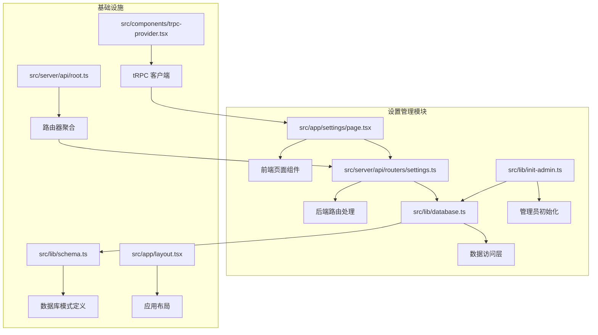
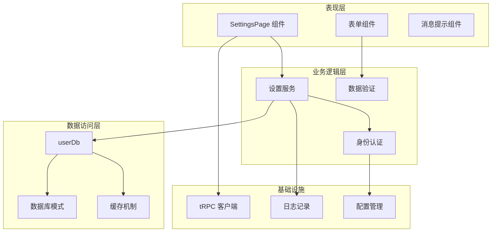
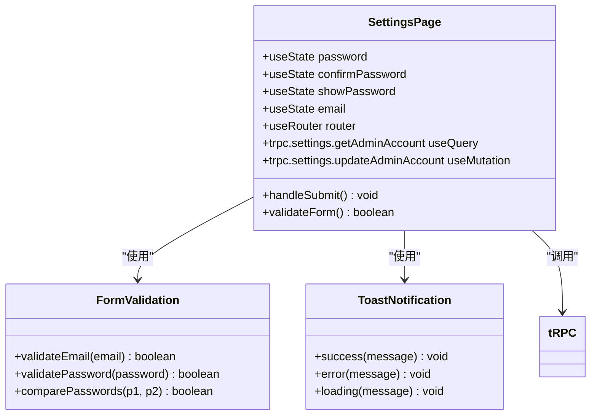
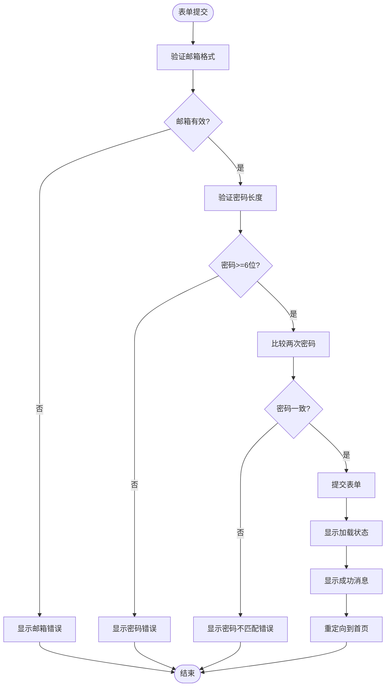
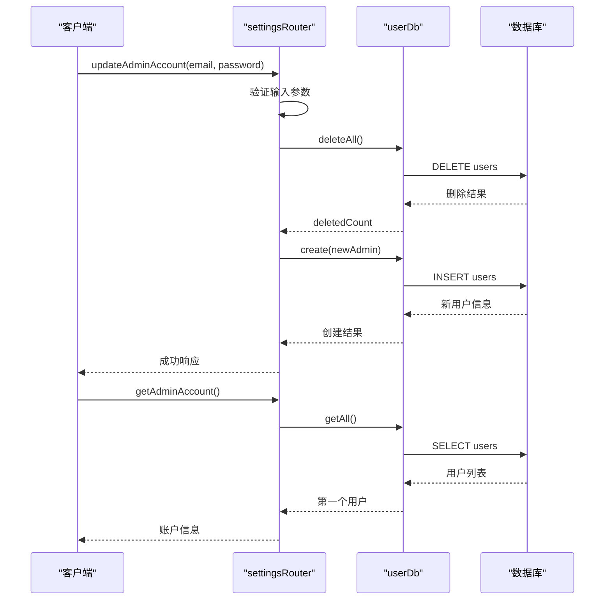
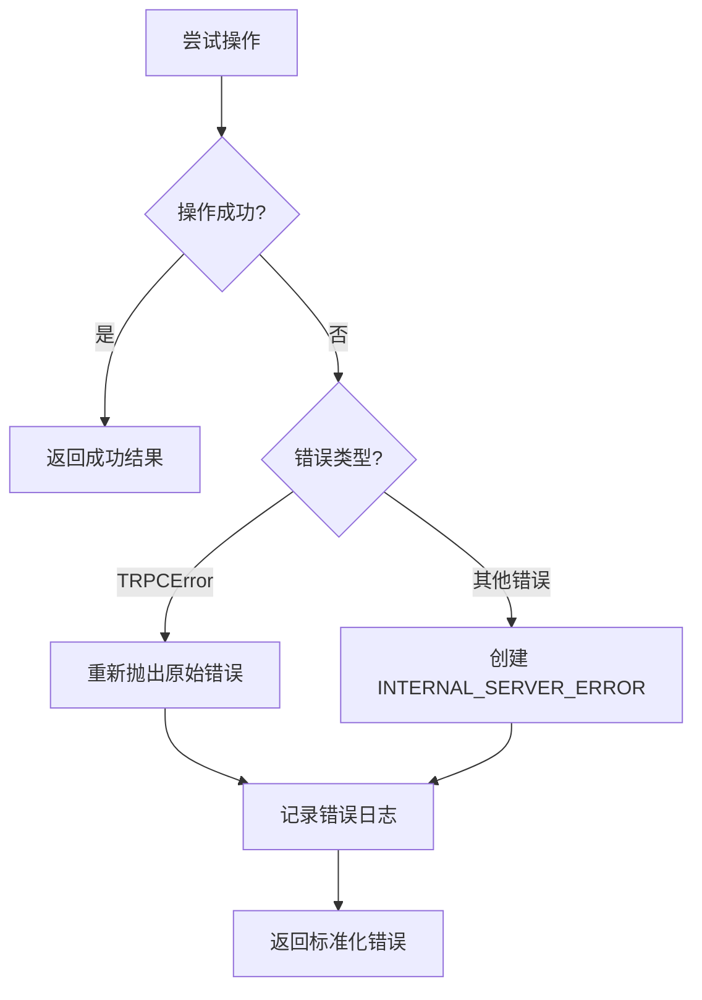
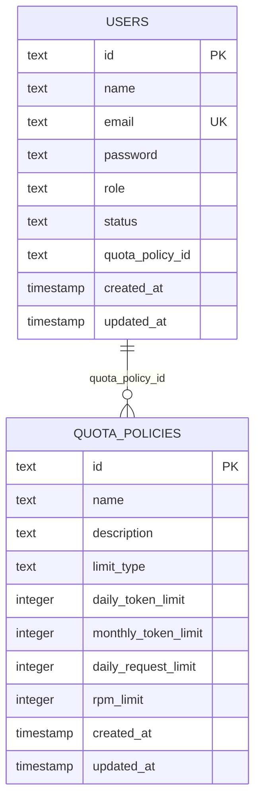
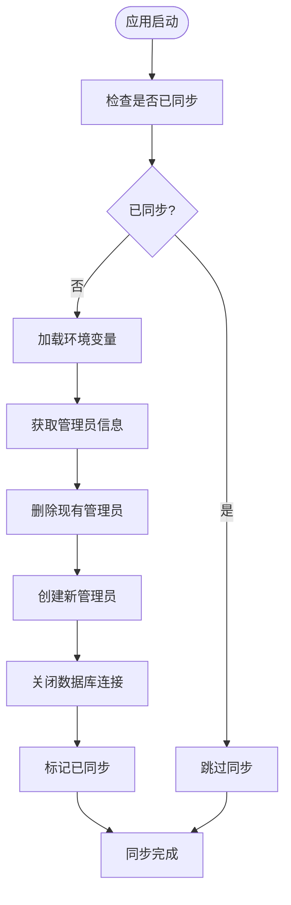
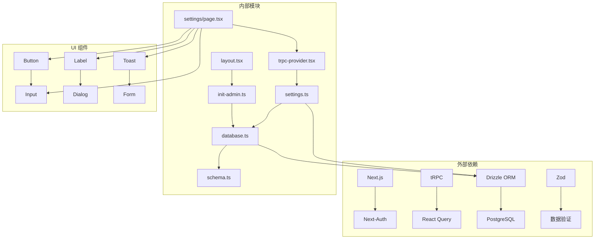

# 设置管理

<cite>
**本文档引用的文件**
- [src/app/settings/page.tsx](file://src/app/settings/page.tsx)
- [src/server/api/routers/settings.ts](file://src/server/api/routers/settings.ts)
- [src/lib/database.ts](file://src/lib/database.ts)
- [src/lib/init-admin.ts](file://src/lib/init-admin.ts)
- [src/server/api/root.ts](file://src/server/api/root.ts)
- [src/components/trpc-provider.tsx](file://src/components/trpc-provider.tsx)
- [src/lib/schema.ts](file://src/lib/schema.ts)
- [src/app/layout.tsx](file://src/app/layout.tsx)
- [src/auth.ts](file://src/auth.ts)
- [deploy.sh](file://deploy.sh)
</cite>

## 目录
1. [简介](#简介)
2. [项目结构](#项目结构)
3. [核心组件](#核心组件)
4. [架构概览](#架构概览)
5. [详细组件分析](#详细组件分析)
6. [依赖关系分析](#依赖关系分析)
7. [性能考虑](#性能考虑)
8. [故障排除指南](#故障排除指南)
9. [结论](#结论)

## 简介

设置管理是 AIGate AI 网关管理系统中的核心功能模块，负责管理员账户的配置和管理。该模块提供了管理员账户信息的查看、编辑和重置功能，确保系统的安全性和可维护性。

AIGate 是一个智能 AI 网关管理系统，支持配额控制和多模型代理，主要面向需要管理多个 AI 服务提供商的场景。设置管理模块是整个系统的基础配置中心，为其他功能模块提供必要的权限管理和用户认证支持。

## 项目结构

设置管理模块在项目中的组织结构如下：

**图表来源**
- [src/app/settings/page.tsx](file://src/app/settings/page.tsx#L1-L174)
- [src/server/api/routers/settings.ts](file://src/server/api/routers/settings.ts#L1-L88)
- [src/lib/database.ts](file://src/lib/database.ts#L581-L692)

**章节来源**
- [src/app/settings/page.tsx](file://src/app/settings/page.tsx#L1-L174)
- [src/server/api/routers/settings.ts](file://src/server/api/routers/settings.ts#L1-L88)
- [src/lib/database.ts](file://src/lib/database.ts#L1-L692)

## 核心组件

设置管理模块包含以下核心组件：

### 前端组件
- **SettingsPage**: 主要的设置管理页面组件，提供管理员账户信息的编辑界面
- **表单验证**: 实现客户端数据验证和用户体验优化
- **状态管理**: 处理表单状态、加载状态和错误状态

### 后端服务
- **settingsRouter**: tRPC 路由处理器，提供设置相关的 API 接口
- **userDb**: 用户数据访问层，处理用户信息的 CRUD 操作
- **init-admin**: 系统启动时的管理员用户初始化服务

### 数据模型
- **用户表**: 存储管理员账户信息
- **配额策略**: 支持用户的配额管理
- **API 密钥**: 系统集成所需的第三方服务密钥

**章节来源**
- [src/app/settings/page.tsx](file://src/app/settings/page.tsx#L12-L174)
- [src/server/api/routers/settings.ts](file://src/server/api/routers/settings.ts#L13-L88)
- [src/lib/database.ts](file://src/lib/database.ts#L581-L692)

## 架构概览

设置管理模块采用分层架构设计，确保职责分离和代码可维护性：

**图表来源**
- [src/app/settings/page.tsx](file://src/app/settings/page.tsx#L26-L37)
- [src/server/api/routers/settings.ts](file://src/server/api/routers/settings.ts#L15-L57)
- [src/lib/database.ts](file://src/lib/database.ts#L581-L692)

## 详细组件分析

### SettingsPage 组件分析

SettingsPage 是设置管理模块的前端核心组件，实现了完整的管理员账户信息管理功能。

**图表来源**
- [src/app/settings/page.tsx](file://src/app/settings/page.tsx#L13-L59)

#### 表单验证流程

**图表来源**
- [src/app/settings/page.tsx](file://src/app/settings/page.tsx#L39-L59)

**章节来源**
- [src/app/settings/page.tsx](file://src/app/settings/page.tsx#L12-L174)

### settingsRouter 服务分析

settingsRouter 提供了设置管理的核心业务逻辑，包括管理员账户信息的获取和更新。

**图表来源**
- [src/server/api/routers/settings.ts](file://src/server/api/routers/settings.ts#L15-L86)
- [src/lib/database.ts](file://src/lib/database.ts#L682-L691)

#### 错误处理机制

**图表来源**
- [src/server/api/routers/settings.ts](file://src/server/api/routers/settings.ts#L46-L56)

**章节来源**
- [src/server/api/routers/settings.ts](file://src/server/api/routers/settings.ts#L13-L88)
- [src/lib/database.ts](file://src/lib/database.ts#L581-L692)

### 数据库层分析

数据库层提供了完整的用户数据管理功能，支持设置管理模块的所有操作需求。

**图表来源**
- [src/lib/schema.ts](file://src/lib/schema.ts#L71-L83)
- [src/lib/schema.ts](file://src/lib/schema.ts#L29-L40)

#### 用户管理操作

| 操作类型 | 方法名 | 功能描述 | 复杂度 |
|---------|--------|----------|--------|
| 查询 | getByEmail | 根据邮箱查找用户 | O(log n) |
| 查询 | getById | 根据ID查找用户 | O(log n) |
| 查询 | getAll | 获取所有用户 | O(n) |
| 查询 | getAdmins | 获取所有管理员 | O(n) |
| 创建 | create | 创建新用户 | O(1) |
| 更新 | update | 更新用户信息 | O(1) |
| 更新 | updatePassword | 更新用户密码 | O(1) |
| 删除 | delete | 删除指定用户 | O(1) |
| 删除 | deleteAll | 删除所有用户 | O(n) |

**章节来源**
- [src/lib/database.ts](file://src/lib/database.ts#L581-L692)

### 系统初始化分析

系统启动时会自动同步管理员用户信息，确保系统始终有一个有效的管理员账户。

**图表来源**
- [src/lib/init-admin.ts](file://src/lib/init-admin.ts#L9-L70)

**章节来源**
- [src/lib/init-admin.ts](file://src/lib/init-admin.ts#L1-L79)

## 依赖关系分析

设置管理模块的依赖关系体现了清晰的分层架构和职责分离：

**图表来源**
- [src/app/settings/page.tsx](file://src/app/settings/page.tsx#L1-L10)
- [src/server/api/routers/settings.ts](file://src/server/api/routers/settings.ts#L1-L5)
- [src/lib/database.ts](file://src/lib/database.ts#L1-L17)

### 核心依赖关系

| 依赖模块 | 作用 | 版本 | 重要性 |
|---------|------|------|--------|
| @trpc/react-query | 前后端通信 | ^10.45.2 | 核心 |
| drizzle-orm | 数据库 ORM | ^0.45.1 | 核心 |
| next-auth | 身份认证 | ^4.24.13 | 核心 |
| zod | 数据验证 | ^3.22.4 | 核心 |
| lucide-react | 图标库 | ^0.575.0 | UI |
| sonner | 消息提示 | ^2.0.7 | UI |

**章节来源**
- [src/app/settings/page.tsx](file://src/app/settings/page.tsx#L1-L10)
- [src/server/api/routers/settings.ts](file://src/server/api/routers/settings.ts#L1-L5)
- [src/lib/database.ts](file://src/lib/database.ts#L1-L17)

## 性能考虑

设置管理模块在设计时充分考虑了性能优化和用户体验：

### 缓存策略
- tRPC 查询缓存：5分钟新鲜度，减少重复请求
- React Query 重试机制：自动重试失败的请求
- 本地状态缓存：表单状态的即时反馈

### 数据优化
- 分页查询：避免一次性加载大量用户数据
- 条件查询：按需查询特定用户信息
- 批量操作：删除所有用户时的一次性操作

### 网络优化
- HTTP 批处理：合并多个请求到单个批次
- 变压传输：使用 superjson 优化数据序列化
- 开发环境调试：条件性日志记录

## 故障排除指南

### 常见问题及解决方案

#### 1. 管理员账户初始化失败
**症状**: 应用启动时报数据库连接错误
**解决方案**:
- 检查 DATABASE_URL 环境变量配置
- 确认 PostgreSQL 服务正常运行
- 验证数据库凭据正确性

#### 2. 设置更新失败
**症状**: 修改管理员账户信息后无响应
**解决方案**:
- 检查网络连接状态
- 查看浏览器开发者工具中的错误信息
- 确认 tRPC 服务正常运行

#### 3. 表单验证错误
**症状**: 输入有效信息仍显示验证错误
**解决方案**:
- 检查客户端 JavaScript 是否正常加载
- 清除浏览器缓存后重试
- 确认浏览器兼容性

### 调试技巧

#### 日志记录
- 开发环境自动启用详细的日志记录
- 关键操作都有相应的日志输出
- 错误情况包含完整的错误堆栈

#### 性能监控
- tRPC 调用时间记录
- 数据库查询性能监控
- 内存使用情况跟踪

**章节来源**
- [src/lib/init-admin.ts](file://src/lib/init-admin.ts#L66-L69)
- [src/server/api/routers/settings.ts](file://src/server/api/routers/settings.ts#L51-L56)

## 结论

设置管理模块是 AIGate AI 网关管理系统的重要组成部分，通过清晰的分层架构和完善的错误处理机制，为系统提供了可靠的管理员账户管理功能。

### 主要优势
- **安全性**: 严格的输入验证和错误处理
- **可维护性**: 清晰的代码结构和职责分离
- **可扩展性**: 模块化的架构设计
- **用户体验**: 即时的反馈和友好的界面

### 技术亮点
- **现代化技术栈**: Next.js、tRPC、Drizzle ORM
- **类型安全**: TypeScript 完整类型定义
- **性能优化**: 多层次的缓存和优化策略
- **开发体验**: 完善的开发工具链

该模块为整个 AIGate 系统奠定了坚实的基础，确保了系统的安全性和可维护性，为后续功能的扩展提供了良好的架构支撑。