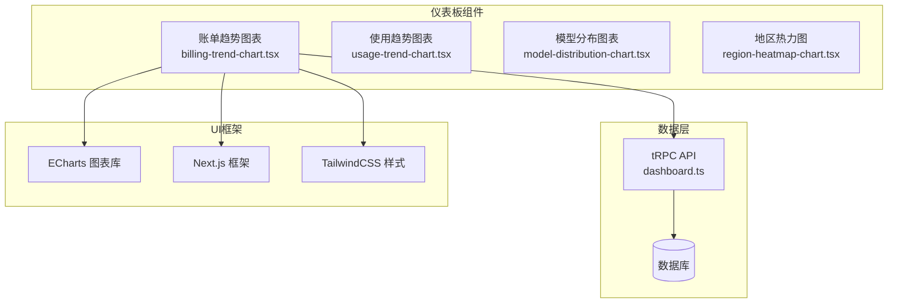
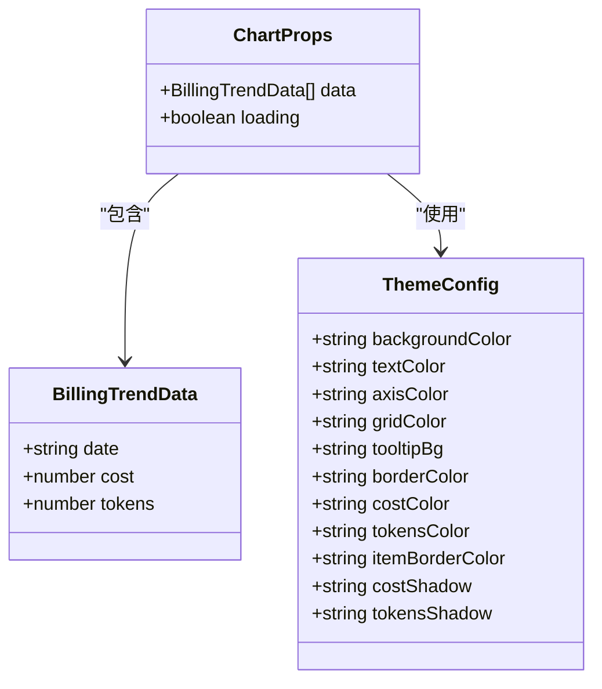
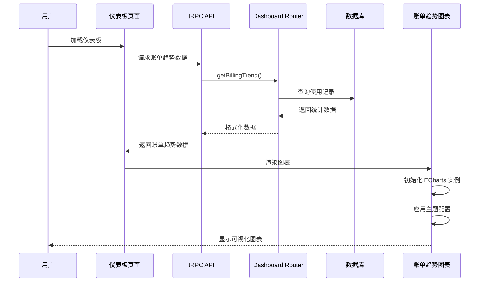
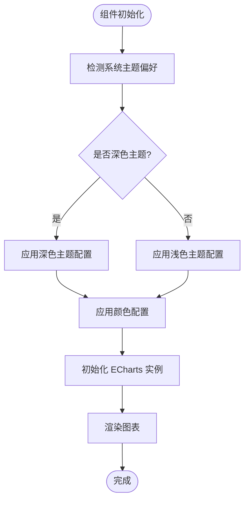
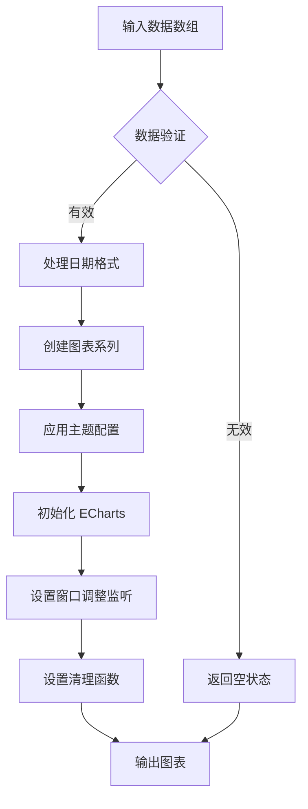
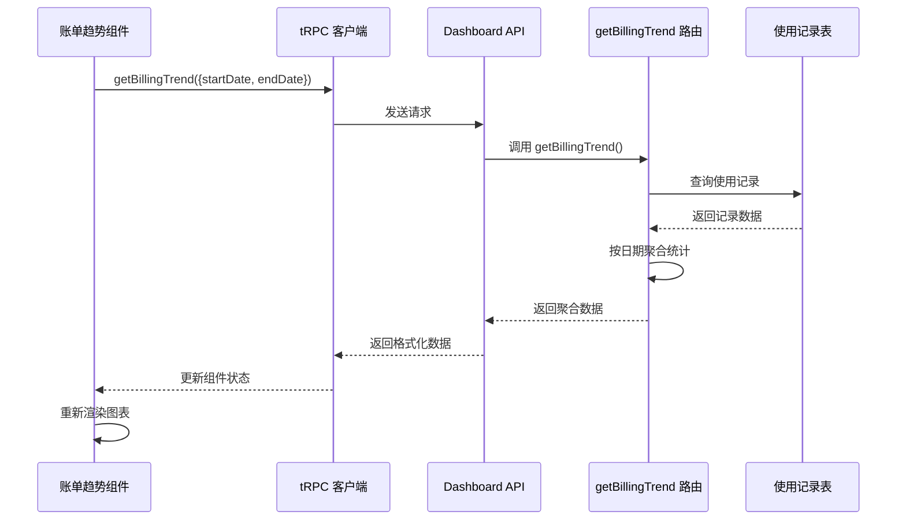
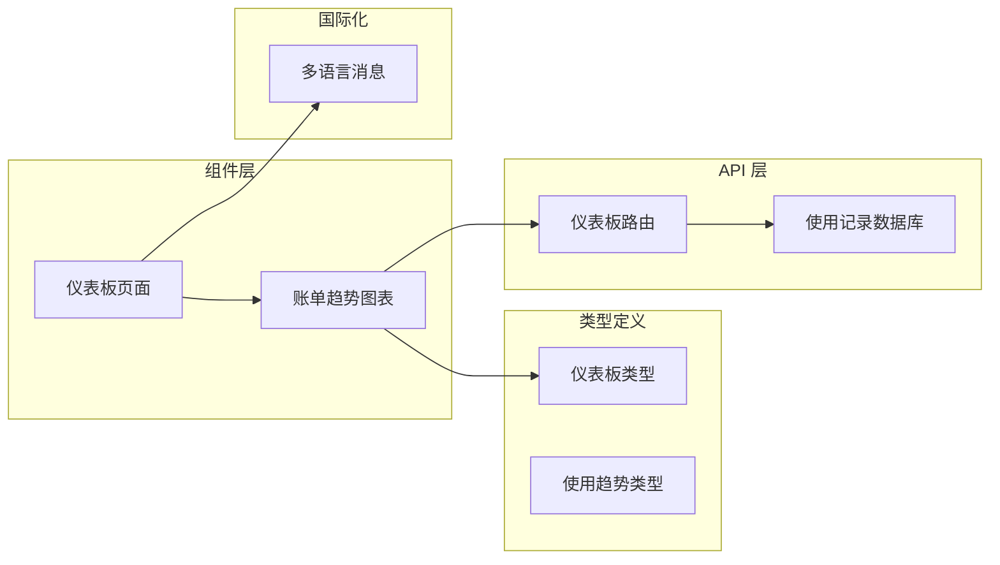

# 账单趋势图表组件

<cite>
**本文档引用的文件**
- [billing-trend-chart.tsx](file://src/app/(dashboard)/components/billing-trend-chart.tsx)
- [page.tsx](file://src/app/(dashboard)/page.tsx)
- [dashboard.ts](file://src/types/dashboard.ts)
- [dashboard.ts](file://src/server/api/routers/dashboard.ts)
- [package.json](file://package.json)
- [zh.json](file://src/messages/zh.json)
</cite>

## 目录
1. [简介](#简介)
2. [项目结构](#项目结构)
3. [核心组件](#核心组件)
4. [架构概览](#架构概览)
5. [详细组件分析](#详细组件分析)
6. [依赖关系分析](#依赖关系分析)
7. [性能考虑](#性能考虑)
8. [故障排除指南](#故障排除指南)
9. [结论](#结论)

## 简介

账单趋势图表组件是 AIGate AI 网关管理系统中的一个关键可视化组件，用于展示用户的费用消耗和 Token 消耗趋势。该组件基于 ECharts 图表库构建，提供了双轴线性图表功能，能够同时显示费用和 Token 消耗的变化趋势，并支持深色/浅色主题自动切换。

该组件在仪表板页面中占据重要位置，为管理员提供了直观的财务监控界面，帮助他们了解系统的使用成本和资源消耗情况。

## 项目结构

账单趋势图表组件位于应用的仪表板模块中，采用模块化设计，与其他图表组件协同工作。



**图表来源**
- [billing-trend-chart.tsx:1-347](file://src/app/(dashboard)/components/billing-trend-chart.tsx#L1-L347)
- [page.tsx:117-236](file://src/app/(dashboard)/page.tsx#L117-L236)

**章节来源**
- [billing-trend-chart.tsx:1-347](file://src/app/(dashboard)/components/billing-trend-chart.tsx#L1-L347)
- [page.tsx:1-258](file://src/app/(dashboard)/page.tsx#L1-L258)

## 核心组件

### 组件架构

账单趋势图表组件采用函数式组件设计，结合 React Hooks 实现数据绑定和状态管理。组件支持以下核心功能：

- **双轴数据展示**：同时显示费用和 Token 消耗两条趋势线
- **主题适配**：自动检测系统主题偏好，提供深色和浅色两种样式
- **响应式设计**：支持不同屏幕尺寸的自适应布局
- **交互式工具提示**：提供详细的数值信息和格式化显示

### 数据结构

组件接收标准化的数据格式，包含日期、费用和 Token 消耗三个字段：



**图表来源**
- [billing-trend-chart.tsx:7-14](file://src/app/(dashboard)/components/billing-trend-chart.tsx#L7-L14)
- [billing-trend-chart.tsx:44-89](file://src/app/(dashboard)/components/billing-trend-chart.tsx#L44-L89)

**章节来源**
- [billing-trend-chart.tsx:7-14](file://src/app/(dashboard)/components/billing-trend-chart.tsx#L7-L14)
- [billing-trend-chart.tsx:44-89](file://src/app/(dashboard)/components/billing-trend-chart.tsx#L44-L89)

## 架构概览

账单趋势图表组件在整个系统架构中扮演着数据可视化的重要角色，连接着数据层、业务逻辑层和用户界面层。



**图表来源**
- [page.tsx:109-115](file://src/app/(dashboard)/page.tsx#L109-L115)
- [dashboard.ts:513-573](file://src/server/api/routers/dashboard.ts#L513-L573)

## 详细组件分析

### 组件实现细节

#### 主题系统

组件实现了完整的主题适配机制，能够根据用户的系统偏好自动切换深色或浅色主题：



**图表来源**
- [billing-trend-chart.tsx:23-31](file://src/app/(dashboard)/components/billing-trend-chart.tsx#L23-L31)
- [billing-trend-chart.tsx:44-89](file://src/app/(dashboard)/components/billing-trend-chart.tsx#L44-L89)

#### 图表配置

组件使用 ECharts 提供了丰富的配置选项，包括：

- **双轴设计**：左侧 Y 轴显示费用（美元），右侧 Y 轴显示 Token 数量
- **面积填充**：为两条趋势线添加渐变填充效果
- **数据点样式**：圆形数据点，带阴影和边框效果
- **网格线**：虚线网格，增强可读性

#### 数据处理流程



**图表来源**
- [billing-trend-chart.tsx:33-326](file://src/app/(dashboard)/components/billing-trend-chart.tsx#L33-L326)

**章节来源**
- [billing-trend-chart.tsx:16-347](file://src/app/(dashboard)/components/billing-trend-chart.tsx#L16-L347)

### API 集成

#### 数据获取流程

组件通过 tRPC 客户端与后端 API 进行通信，获取账单趋势数据：



**图表来源**
- [page.tsx:109-115](file://src/app/(dashboard)/page.tsx#L109-L115)
- [dashboard.ts:513-573](file://src/server/api/routers/dashboard.ts#L513-L573)

#### 数据格式规范

后端 API 返回的数据格式严格遵循以下规范：

| 字段名 | 类型 | 描述 | 示例值 |
|--------|------|------|--------|
| date | string | 日期字符串（YYYY-MM-DD） | "2024-01-15" |
| cost | number | 当日总费用（美元） | 125.4567 |
| tokens | number | 当日总 Token 消耗 | 1500000 |

**章节来源**
- [dashboard.ts:513-573](file://src/server/api/routers/dashboard.ts#L513-L573)
- [dashboard.ts:544-568](file://src/server/api/routers/dashboard.ts#L544-L568)

## 依赖关系分析

### 外部依赖

组件依赖于多个外部库来实现其功能：

```mermaid
graph TB
subgraph "核心依赖"
ECharts[ECharts 6.0.0]
React[React 19.2.3]
NextJS[Next.js 16.1.6]
end
subgraph "UI 组件库"
Radix[Radix UI 组件]
Lucide[Lucide React 图标]
Tailwind[TailwindCSS]
end
subgraph "数据处理"
DateFNS[date-fns 4.1.0]
Zod[Zod 类型验证]
end
subgraph "状态管理"
tRPC[@trpc/react-query 10.45.2]
ReactQuery[@tanstack/react-query 4.36.1]
end
BillingChart --> ECharts
BillingChart --> React
BillingChart --> NextJS
BillingChart --> Radix
BillingChart --> Lucide
BillingChart --> Tailwind
BillingChart --> DateFNS
BillingChart --> Zod
BillingChart --> tRPC
BillingChart --> ReactQuery
```

**图表来源**
- [package.json:49](file://package.json#L49)
- [package.json:59](file://package.json#L59)
- [package.json:62](file://package.json#L62)

### 内部依赖

组件与其他内部模块存在紧密的依赖关系：



**图表来源**
- [page.tsx:1-16](file://src/app/(dashboard)/page.tsx#L1-L16)
- [dashboard.ts:1-48](file://src/types/dashboard.ts#L1-L48)

**章节来源**
- [package.json:1-94](file://package.json#L1-L94)
- [page.tsx:1-258](file://src/app/(dashboard)/page.tsx#L1-L258)

## 性能考虑

### 渲染优化

组件采用了多项性能优化措施：

1. **实例复用**：使用 `getInstanceByDom` 检测现有实例，避免重复创建
2. **内存管理**：在组件卸载时正确清理 ECharts 实例和事件监听器
3. **懒加载**：仅在数据可用且非加载状态时初始化图表
4. **防抖处理**：窗口大小调整事件使用防抖机制

### 数据处理优化

- **批量处理**：使用 `map` 方法一次性转换所有数据
- **缓存策略**：利用 React 的状态缓存避免重复计算
- **条件渲染**：在加载状态下显示占位符而非空图表

### 主题切换优化

组件实现了高效的主题切换机制：
- 使用 `matchMedia` 监听系统主题变化
- 动态更新图表配置而非完全重建实例
- 支持实时主题切换体验

## 故障排除指南

### 常见问题及解决方案

#### 图表不显示

**症状**：图表容器为空白，没有任何内容显示

**可能原因**：
1. 数据为空或格式不正确
2. ECharts 实例初始化失败
3. DOM 元素未正确渲染

**解决方法**：
1. 检查数据格式是否符合预期
2. 确认 `chartRef.current` 是否存在
3. 验证容器元素的 CSS 样式

#### 主题显示异常

**症状**：图表颜色与预期不符，或主题切换无效

**可能原因**：
1. 系统主题检测失败
2. 主题配置对象不完整
3. CSS 变量覆盖

**解决方法**：
1. 检查 `prefers-color-scheme` 媒体查询
2. 验证主题配置对象的所有属性
3. 确认 TailwindCSS 主题类正确应用

#### 性能问题

**症状**：图表渲染缓慢或内存占用过高

**可能原因**：
1. 数据量过大导致渲染压力
2. 事件监听器未正确清理
3. 频繁的主题切换

**解决方法**：
1. 实施数据分页或采样
2. 确保在 `useEffect` 返回函数中清理所有监听器
3. 优化主题切换频率

**章节来源**
- [billing-trend-chart.tsx:33-40](file://src/app/(dashboard)/components/billing-trend-chart.tsx#L33-L40)
- [billing-trend-chart.tsx:322-325](file://src/app/(dashboard)/components/billing-trend-chart.tsx#L322-L325)

## 结论

账单趋势图表组件是一个功能完整、设计精良的数据可视化组件，它成功地将复杂的财务数据转化为直观易懂的图表形式。该组件展现了现代前端开发的最佳实践：

- **模块化设计**：清晰的职责分离和组件边界
- **类型安全**：完整的 TypeScript 类型定义
- **用户体验**：响应式设计和流畅的交互体验
- **性能优化**：合理的渲染策略和内存管理
- **可维护性**：良好的代码组织和注释说明

该组件不仅满足了当前的功能需求，还为未来的扩展和定制提供了良好的基础。通过与其他图表组件的协同工作，形成了完整的仪表板数据可视化生态系统。