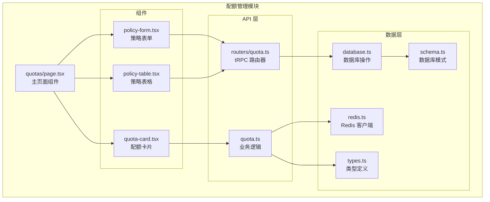
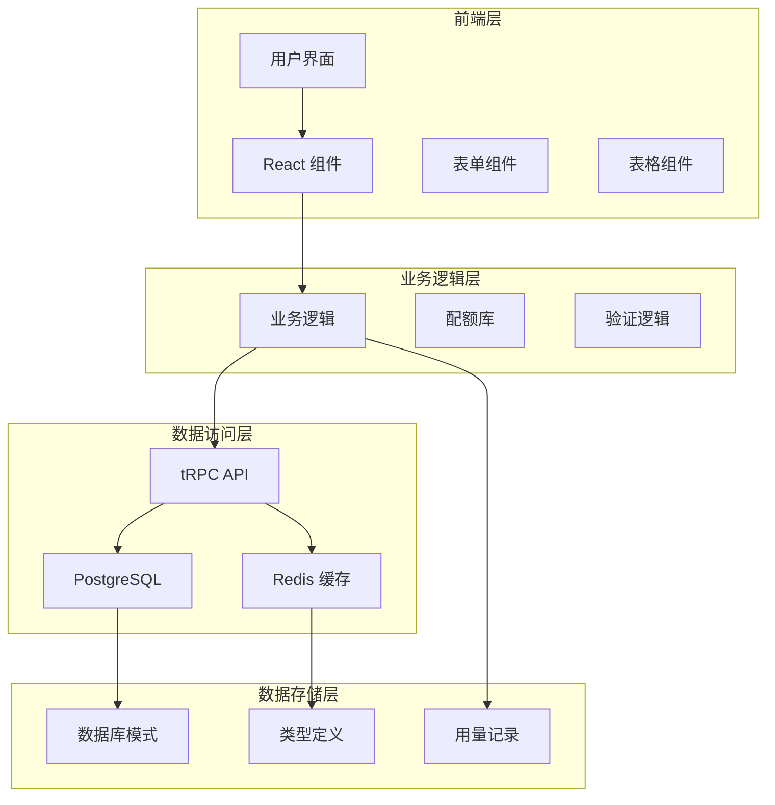
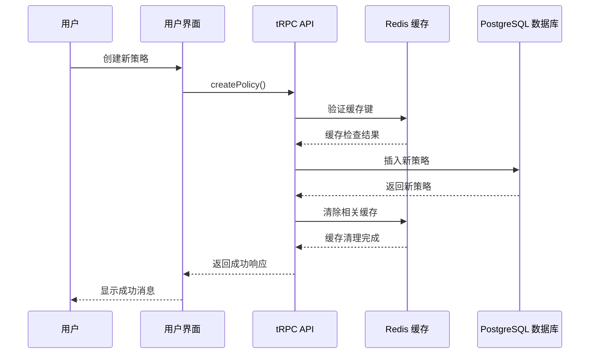
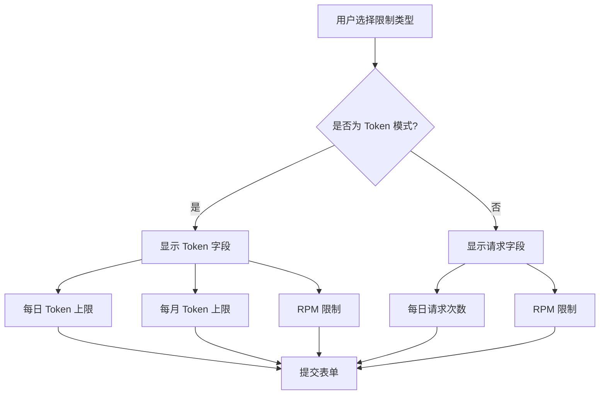
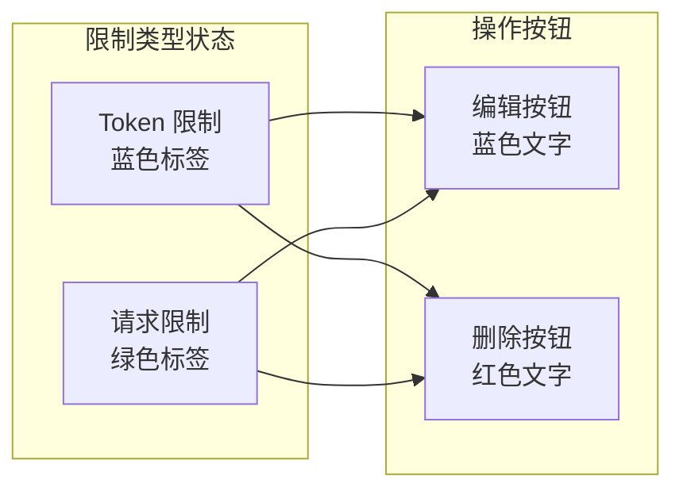
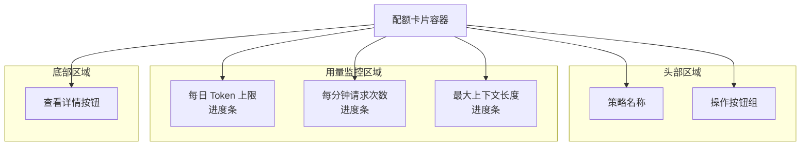
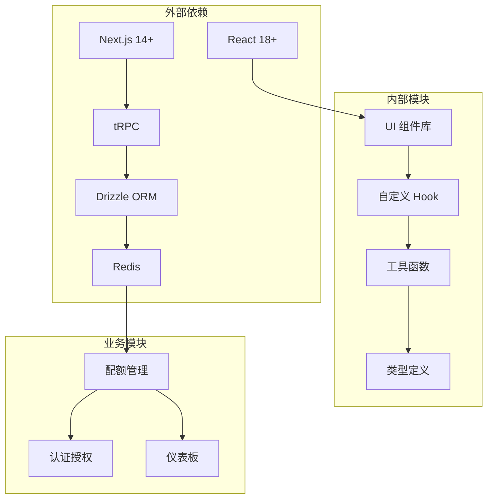
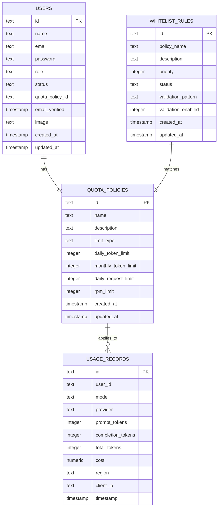
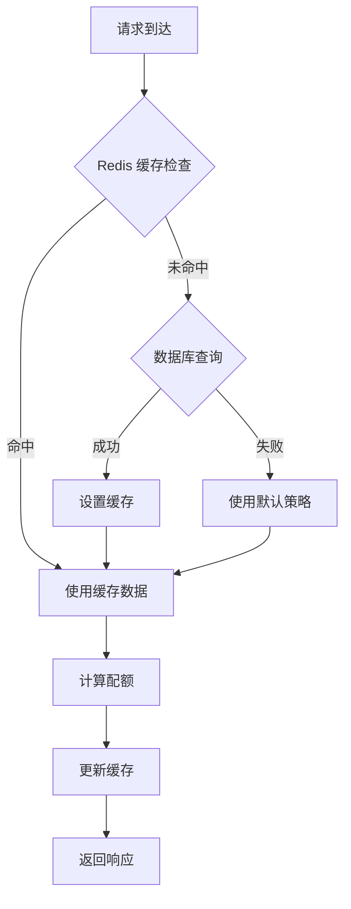

# 配额管理界面

<cite>
**本文档引用的文件**
- [src/app/(dashboard)/quotas/page.tsx](file://src/app/(dashboard)/quotas/page.tsx)
- [src/app/(dashboard)/quotas/components/policy-form.tsx](file://src/app/(dashboard)/quotas/components/policy-form.tsx)
- [src/app/(dashboard)/quotas/components/policy-table.tsx](file://src/app/(dashboard)/quotas/components/policy-table.tsx)
- [src/app/(dashboard)/quotas/components/quota-card.tsx](file://src/app/(dashboard)/quotas/components/quota-card.tsx)
- [src/server/api/routers/quota.ts](file://src/server/api/routers/quota.ts)
- [src/lib/quota.ts](file://src/lib/quota.ts)
- [src/lib/schema.ts](file://src/lib/schema.ts)
- [src/lib/types.ts](file://src/lib/types.ts)
- [src/lib/database.ts](file://src/lib/database.ts)
- [src/lib/redis.ts](file://src/lib/redis.ts)
- [src/components/ui/data-table.tsx](file://src/components/ui/data-table.tsx)
- [src/components/ui/table.tsx](file://src/components/ui/table.tsx)
- [src/components/ui/pagination.tsx](file://src/components/ui/pagination.tsx)
</cite>

## 目录
1. [简介](#简介)
2. [项目结构](#项目结构)
3. [核心组件](#核心组件)
4. [架构概览](#架构概览)
5. [详细组件分析](#详细组件分析)
6. [依赖关系分析](#依赖关系分析)
7. [性能考虑](#性能考虑)
8. [故障排除指南](#故障排除指南)
9. [结论](#结论)

## 简介

AIGate 配额管理界面是一个基于 React 和 Next.js 的现代化 Web 应用程序，专门用于管理和监控 AI 服务的配额策略。该系统提供了完整的配额管理解决方案，包括策略创建、编辑、删除、实时监控和历史记录追踪。

本界面采用响应式设计，支持深色模式切换，具有直观的用户交互体验。系统集成了 Redis 缓存机制来优化性能，并提供了实时的用量监控功能。

## 项目结构

配额管理界面位于应用的 `(dashboard)` 路由下，主要包含以下关键目录和文件：

**图表来源**
- [src/app/(dashboard)/quotas/page.tsx](file://src/app/(dashboard)/quotas/page.tsx#L1-L141)
- [src/app/(dashboard)/quotas/components/policy-form.tsx](file://src/app/(dashboard)/quotas/components/policy-form.tsx#L1-L219)
- [src/server/api/routers/quota.ts](file://src/server/api/routers/quota.ts#L1-L301)

**章节来源**
- [src/app/(dashboard)/quotas/page.tsx](file://src/app/(dashboard)/quotas/page.tsx#L1-L141)
- [src/app/(dashboard)/quotas/components/policy-form.tsx](file://src/app/(dashboard)/quotas/components/policy-form.tsx#L1-L219)
- [src/app/(dashboard)/quotas/components/policy-table.tsx](file://src/app/(dashboard)/quotas/components/policy-table.tsx#L1-L181)

## 核心组件

### 主页面组件 (QuotasPage)

主页面组件是整个配额管理界面的核心入口点，负责协调各个子组件的工作流程。它实现了以下关键功能：

- **策略数据管理**: 通过 tRPC 查询获取所有配额策略
- **CRUD 操作**: 支持策略的创建、更新、删除操作
- **对话框管理**: 控制策略表单对话框的显示和隐藏
- **状态管理**: 处理加载状态、编辑状态和错误状态

### 策略表单组件 (PolicyForm)

策略表单组件提供了完整的配额策略配置界面，支持多种配额类型：

- **配额类型选择**: 支持 Token 限制和请求次数限制两种模式
- **动态字段显示**: 根据配额类型动态显示相应的配置字段
- **实时验证**: 提供即时的表单验证反馈
- **预设值管理**: 为新创建的策略提供合理的默认值

### 策略表格组件 (PolicyTable)

策略表格组件负责展示和管理现有的配额策略：

- **数据展示**: 以表格形式清晰展示所有策略信息
- **操作功能**: 提供编辑和删除操作按钮
- **状态指示**: 通过颜色编码显示不同的策略状态
- **响应式设计**: 支持不同屏幕尺寸的适配

**章节来源**
- [src/app/(dashboard)/quotas/page.tsx](file://src/app/(dashboard)/quotas/page.tsx#L24-L141)
- [src/app/(dashboard)/quotas/components/policy-form.tsx](file://src/app/(dashboard)/quotas/components/policy-form.tsx#L35-L219)
- [src/app/(dashboard)/quotas/components/policy-table.tsx](file://src/app/(dashboard)/quotas/components/policy-table.tsx#L28-L181)

## 架构概览

系统采用分层架构设计，确保了良好的可维护性和扩展性：

**图表来源**
- [src/server/api/routers/quota.ts](file://src/server/api/routers/quota.ts#L31-L301)
- [src/lib/quota.ts](file://src/lib/quota.ts#L1-L334)
- [src/lib/database.ts](file://src/lib/database.ts#L103-L287)

### 数据流图

**图表来源**
- [src/server/api/routers/quota.ts](file://src/server/api/routers/quota.ts#L184-L222)
- [src/lib/database.ts](file://src/lib/database.ts#L103-L114)

## 详细组件分析

### 策略表单组件深度分析

策略表单组件是配额管理系统的核心交互界面，实现了复杂的条件逻辑和数据绑定：

#### 表单字段设计

| 字段名称 | 类型 | 必填 | 默认值 | 说明 |
|---------|------|------|--------|------|
| 策略名称 | 文本输入 | 是 | 空 | 策略的唯一标识符 |
| 描述 | 文本区域 | 否 | 空 | 策略的详细说明 |
| 限制类型 | 下拉选择 | 是 | token | Token 限制或请求限制 |
| 每日 Token 上限 | 数字输入 | 否 | 5000 | 仅在 Token 模式下显示 |
| 每月 Token 上限 | 数字输入 | 否 | 50000 | 仅在 Token 模式下显示 |
| 每日请求次数 | 数字输入 | 否 | 1000 | 仅在请求模式下显示 |
| RPM 限制 | 数字输入 | 是 | 60 | 每分钟请求限制 |

#### 动态字段逻辑

**图表来源**
- [src/app/(dashboard)/quotas/components/policy-form.tsx](file://src/app/(dashboard)/quotas/components/policy-form.tsx#L108-L206)

#### 表单验证机制

表单实现了多层次的验证机制：

1. **必填字段验证**: 确保关键字段不为空
2. **类型验证**: 验证数字字段的格式正确性
3. **业务规则验证**: 根据限制类型验证字段组合的有效性
4. **实时反馈**: 提供即时的验证状态反馈

**章节来源**
- [src/app/(dashboard)/quotas/components/policy-form.tsx](file://src/app/(dashboard)/quotas/components/policy-form.tsx#L35-L219)

### 策略表格组件深度分析

策略表格组件提供了完整的策略数据展示和管理功能：

#### 表格列设计

| 列名称 | 数据类型 | 显示内容 | 功能 |
|-------|----------|----------|------|
| 策略名称 | 文本 | 策略名称 | 点击查看详情 |
| 描述 | 文本 | 策略描述 | 截断显示 |
| 限制类型 | 标签 | Token/请求 | 颜色编码显示 |
| 每日限额 | 数字 | 今日使用量 | 根据模式显示不同单位 |
| 每月限额 | 数字 | 月度限制 | 仅在 Token 模式显示 |
| RPM 限制 | 数字 | 每分钟限制 | 显示 RPM 配置 |
| 创建时间 | 日期 | 创建日期 | 格式化显示 |
| 操作 | 按钮 | 编辑/删除 | 执行 CRUD 操作 |

#### 状态指示器设计

**图表来源**
- [src/app/(dashboard)/quotas/components/policy-table.tsx](file://src/app/(dashboard)/quotas/components/policy-table.tsx#L52-L64)

**章节来源**
- [src/app/(dashboard)/quotas/components/policy-table.tsx](file://src/app/(dashboard)/quotas/components/policy-table.tsx#L28-L181)

### 配额卡片组件深度分析

配额卡片组件提供了策略的可视化概览，特别适合在仪表板场景中使用：

#### 卡片布局设计

**图表来源**
- [src/app/(dashboard)/quotas/components/quota-card.tsx](file://src/app/(dashboard)/quotas/components/quota-card.tsx#L25-L105)

#### 进度条设计规范

| 指标类型 | 颜色方案 | 最大值 | 当前值 | 预警阈值 |
|---------|----------|--------|--------|----------|
| 每日 Token 上限 | 主色调 | 策略配置 | 实际使用 | 80% |
| 每分钟请求次数 | 警告色 | RPM 限制 | 当前速率 | 70% |
| 最大上下文长度 | 成功色 | 配置值 | 实际值 | - |

**章节来源**
- [src/app/(dashboard)/quotas/components/quota-card.tsx](file://src/app/(dashboard)/quotas/components/quota-card.tsx#L18-L109)

## 依赖关系分析

系统采用了模块化的依赖关系设计，确保了各组件间的松耦合：

**图表来源**
- [src/lib/quota.ts](file://src/lib/quota.ts#L1-L334)
- [src/server/api/routers/quota.ts](file://src/server/api/routers/quota.ts#L1-L301)

### 数据模型关系

**图表来源**
- [src/lib/schema.ts](file://src/lib/schema.ts#L28-L95)

**章节来源**
- [src/lib/schema.ts](file://src/lib/schema.ts#L1-L159)
- [src/lib/types.ts](file://src/lib/types.ts#L1-L118)

## 性能考虑

### 缓存策略

系统实现了多层级的缓存策略来优化性能：

1. **Redis 缓存**: 使用 Redis 缓存配额策略和用户信息
2. **数据库查询优化**: 通过索引和查询优化减少数据库负载
3. **前端状态缓存**: 使用 React 状态管理避免重复渲染

### 配额计算优化

**图表来源**
- [src/lib/quota.ts](file://src/lib/quota.ts#L15-L48)

### 实时监控优化

系统提供了实时的用量监控功能，通过以下机制实现高效的数据更新：

- **增量更新**: 仅更新发生变化的数据
- **批量操作**: 减少网络请求次数
- **智能刷新**: 基于事件驱动的刷新机制

## 故障排除指南

### 常见问题及解决方案

#### 配额策略无法保存

**症状**: 保存策略时出现错误提示

**可能原因**:
1. 配额类型配置不正确
2. 数字字段格式错误
3. 数据库连接问题

**解决步骤**:
1. 检查配额类型与对应字段的匹配关系
2. 验证数字字段是否为有效数值
3. 确认数据库连接状态

#### 实时用量不更新

**症状**: 配额使用情况显示不准确

**可能原因**:
1. Redis 缓存过期
2. 用量记录写入失败
3. 时间同步问题

**解决步骤**:
1. 检查 Redis 服务器状态
2. 验证用量记录写入逻辑
3. 同步系统时间设置

#### 表格数据加载缓慢

**症状**: 策略表格加载时间过长

**可能原因**:
1. 数据量过大
2. 查询性能问题
3. 网络延迟

**解决步骤**:
1. 实施分页加载
2. 优化数据库查询
3. 检查网络连接质量

**章节来源**
- [src/lib/quota.ts](file://src/lib/quota.ts#L183-L189)
- [src/server/api/routers/quota.ts](file://src/server/api/routers/quota.ts#L200-L221)

## 结论

AIGate 配额管理界面是一个功能完整、设计精良的现代化 Web 应用程序。通过采用模块化的架构设计和先进的技术栈，系统实现了高效的配额管理功能。

### 主要优势

1. **用户体验优秀**: 直观的界面设计和流畅的交互体验
2. **性能优异**: 多层级缓存和优化的数据处理机制
3. **扩展性强**: 模块化的架构便于功能扩展和维护
4. **可靠性高**: 完善的错误处理和故障恢复机制

### 技术亮点

- **响应式设计**: 适配各种设备和屏幕尺寸
- **深色模式支持**: 提供舒适的视觉体验
- **实时监控**: 即时的用量数据更新
- **安全可靠**: 完整的权限控制和数据保护

该系统为 AI 服务的配额管理提供了强有力的技术支撑，能够满足不同规模企业的需求，并为未来的功能扩展奠定了坚实的基础。