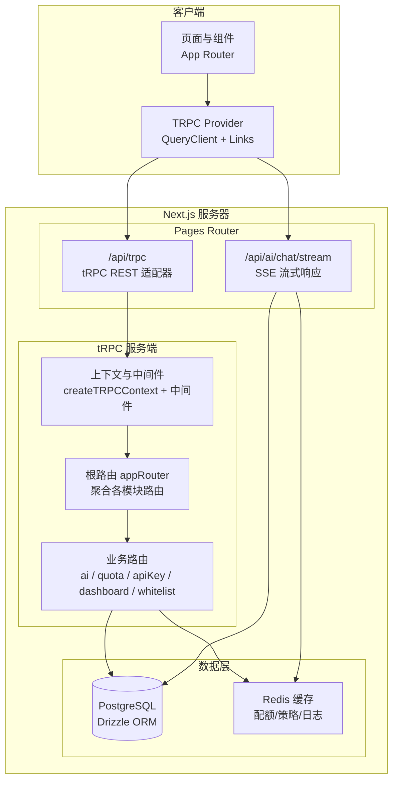
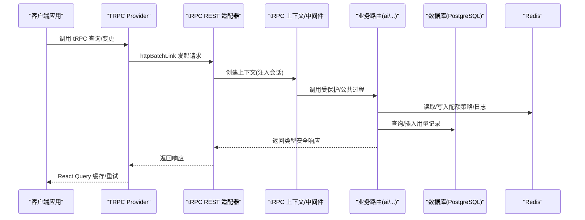
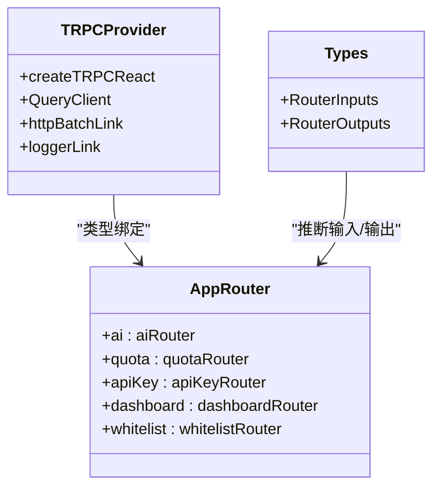
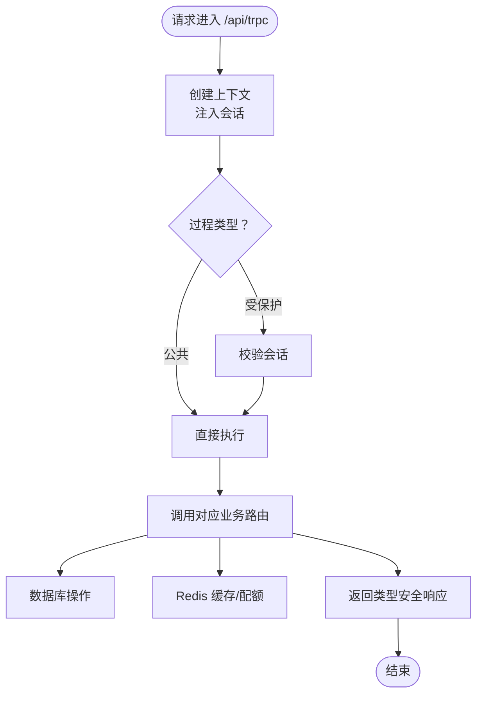
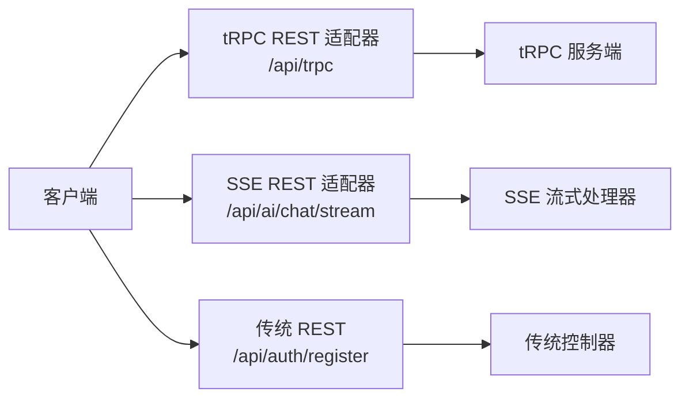
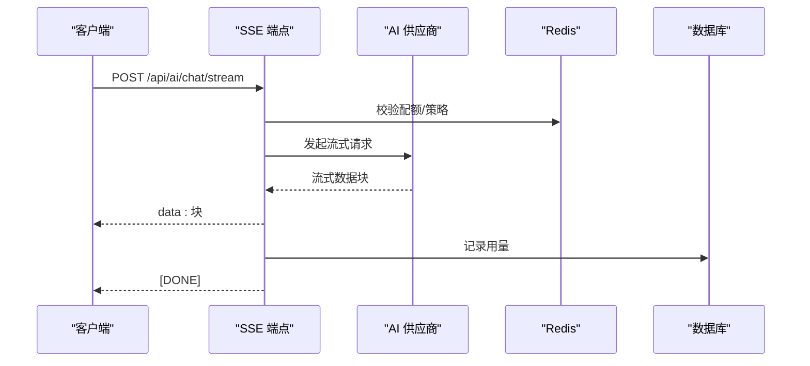
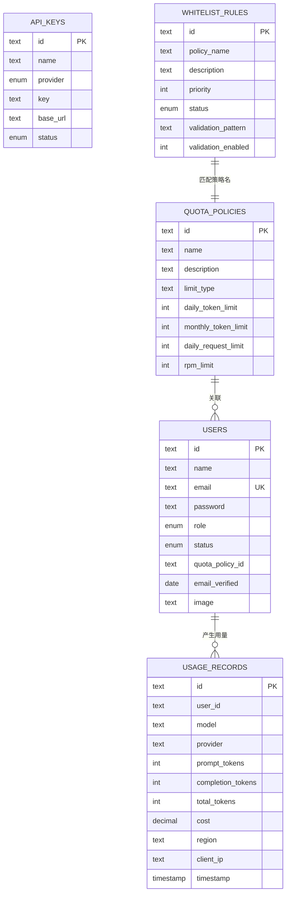
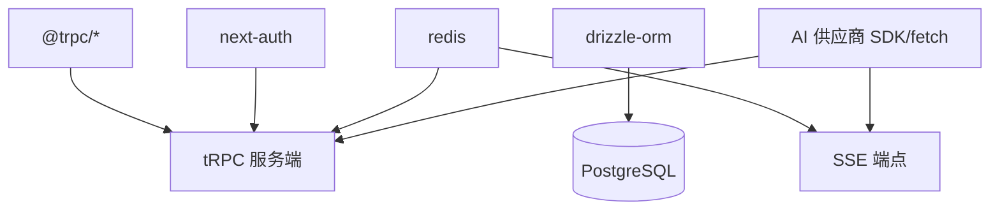

# API 架构设计

<cite>
**本文引用的文件**
- [package.json](file://package.json)
- [next.config.ts](file://next.config.ts)
- [src/server/api/root.ts](file://src/server/api/root.ts)
- [src/server/api/trpc.ts](file://src/server/api/trpc.ts)
- [src/pages/api/trpc/[trpc].ts](file://src/pages/api/trpc/[trpc].ts)
- [src/components/trpc-provider.tsx](file://src/components/trpc-provider.tsx)
- [src/utils/api.ts](file://src/utils/api.ts)
- [src/lib/types.ts](file://src/lib/types.ts)
- [src/lib/schema.ts](file://src/lib/schema.ts)
- [src/lib/redis.ts](file://src/lib/redis.ts)
- [src/lib/quota.ts](file://src/lib/quota.ts)
- [src/lib/ai-providers.ts](file://src/lib/ai-providers.ts)
- [src/lib/database.ts](file://src/lib/database.ts)
- [src/pages/api/ai/chat/stream.ts](file://src/pages/api/ai/chat/stream.ts)
- [src/server/api/routers/ai.ts](file://src/server/api/routers/ai.ts)
- [src/app/api/auth/register/route.ts](file://src/app/api/auth/register/route.ts)
- [src/auth.ts](file://src/auth.ts)
</cite>

## 目录
1. [引言](#引言)
2. [项目结构](#项目结构)
3. [核心组件](#核心组件)
4. [架构总览](#架构总览)
5. [详细组件分析](#详细组件分析)
6. [依赖关系分析](#依赖关系分析)
7. [性能考虑](#性能考虑)
8. [故障排查指南](#故障排查指南)
9. [结论](#结论)
10. [附录](#附录)

## 引言
本文件面向 AIGate 系统的 API 架构设计，重点阐述基于 tRPC 的类型安全 API 设计与自动代码生成机制，以及与 REST API 的混合使用模式；同时覆盖路由组织结构、中间件与认证策略、流式 API（SSE）实现、API 版本管理建议、错误处理与状态码规范、性能优化与缓存/限流策略，并提供架构图与请求流程图，帮助开发者快速理解与高效迭代。

## 项目结构
AIGate 采用 Next.js App Router 与 Pages Router 并行的结构：
- App Router 层：页面、布局、客户端 Provider 与类型推断工具
- Pages Router 层：传统 REST 接口（如 /api/trpc 与 /api/ai/chat/stream）
- 服务端 tRPC：统一的类型安全后端 API 路由与过程定义
- 数据访问：Drizzle ORM + PostgreSQL，Redis 缓存与配额统计
- 认证：NextAuth + 会话上下文注入到 tRPC

图表来源
- [src/components/trpc-provider.tsx](file://src/components/trpc-provider.tsx#L1-L64)
- [src/pages/api/trpc/[trpc].ts](file://src/pages/api/trpc/[trpc].ts#L1-L16)
- [src/server/api/trpc.ts](file://src/server/api/trpc.ts#L1-L142)
- [src/server/api/root.ts](file://src/server/api/root.ts#L1-L23)
- [src/server/api/routers/ai.ts](file://src/server/api/routers/ai.ts#L1-L223)
- [src/pages/api/ai/chat/stream.ts](file://src/pages/api/ai/chat/stream.ts#L1-L167)
- [src/lib/database.ts](file://src/lib/database.ts#L1-L524)
- [src/lib/redis.ts](file://src/lib/redis.ts#L1-L49)

章节来源
- [package.json](file://package.json#L1-L75)
- [next.config.ts](file://next.config.ts#L1-L9)

## 核心组件
- tRPC 核心
  - 上下文与中间件：会话注入、Zod 错误格式化、公共/受保护过程
  - 根路由：聚合 ai、quota、apiKey、dashboard、whitelist 模块
  - 客户端集成：QueryClient、batch link、logger link、superjson 序列化
- REST 接口
  - /api/trpc：tRPC 的 REST 适配器入口
  - /api/ai/chat/stream：SSE 流式响应（非 tRPC）
  - /api/auth/register：传统 REST 注册接口
- 数据与配额
  - Drizzle ORM 表结构与关系
  - Redis 缓存键空间与配额检查/记录逻辑
  - 白名单规则匹配与策略选择
- AI 供应商适配
  - OpenAI、Anthropic、Google、DeepSeek、Moonshot、Spark 的请求封装与流式转换
- 认证与授权
  - NextAuth 会话 + tRPC 受保护过程

章节来源
- [src/server/api/trpc.ts](file://src/server/api/trpc.ts#L1-L142)
- [src/server/api/root.ts](file://src/server/api/root.ts#L1-L23)
- [src/components/trpc-provider.tsx](file://src/components/trpc-provider.tsx#L1-L64)
- [src/pages/api/trpc/[trpc].ts](file://src/pages/api/trpc/[trpc].ts#L1-L16)
- [src/lib/schema.ts](file://src/lib/schema.ts#L1-L159)
- [src/lib/redis.ts](file://src/lib/redis.ts#L1-L49)
- [src/lib/quota.ts](file://src/lib/quota.ts#L1-L334)
- [src/lib/ai-providers.ts](file://src/lib/ai-providers.ts#L1-L759)
- [src/auth.ts](file://src/auth.ts#L1-L56)

## 架构总览
AIGate 的 API 架构以 tRPC 为核心，结合 Next.js Pages Router 的 REST 能力与 App Router 的客户端集成，形成“类型安全 + 自动代码生成 + 混合 REST”的统一 API 生态。

图表来源
- [src/components/trpc-provider.tsx](file://src/components/trpc-provider.tsx#L1-L64)
- [src/pages/api/trpc/[trpc].ts](file://src/pages/api/trpc/[trpc].ts#L1-L16)
- [src/server/api/trpc.ts](file://src/server/api/trpc.ts#L1-L142)
- [src/server/api/root.ts](file://src/server/api/root.ts#L1-L23)
- [src/lib/database.ts](file://src/lib/database.ts#L1-L524)
- [src/lib/redis.ts](file://src/lib/redis.ts#L1-L49)

## 详细组件分析

### tRPC 类型安全与自动代码生成
- 类型推断工具：通过 inferRouterInputs/Outputs 与 AppRouter 类型，实现前端对后端输入输出的强类型推断
- 自动代码生成：客户端与服务端共享类型，减少手写 DTO 的重复劳动
- 优势
  - 编译期校验：输入输出类型严格一致
  - 开发体验：IDE 智能提示与重构安全
  - 运行时安全：Zod 校验与错误扁平化

图表来源
- [src/server/api/root.ts](file://src/server/api/root.ts#L1-L23)
- [src/utils/api.ts](file://src/utils/api.ts#L1-L17)
- [src/components/trpc-provider.tsx](file://src/components/trpc-provider.tsx#L1-L64)

章节来源
- [src/utils/api.ts](file://src/utils/api.ts#L1-L17)
- [src/server/api/root.ts](file://src/server/api/root.ts#L1-L23)
- [src/components/trpc-provider.tsx](file://src/components/trpc-provider.tsx#L1-L64)

### 路由组织与中间件配置
- 路由组织
  - 根路由聚合：ai、quota、apiKey、dashboard、whitelist
  - 业务路由：在 routers 下按功能拆分，职责清晰
- 中间件与上下文
  - 会话注入：NextAuth 会话通过 createTRPCContext 注入
  - 受保护过程：校验 session.user 存在，否则抛 UNAUTHORIZED
  - 错误格式化：ZodError 扁平化，便于前端展示
- REST 适配
  - /api/trpc 使用 createNextApiHandler 暴露 tRPC 到 REST

图表来源
- [src/pages/api/trpc/[trpc].ts](file://src/pages/api/trpc/[trpc].ts#L1-L16)
- [src/server/api/trpc.ts](file://src/server/api/trpc.ts#L1-L142)
- [src/server/api/root.ts](file://src/server/api/root.ts#L1-L23)

章节来源
- [src/server/api/trpc.ts](file://src/server/api/trpc.ts#L1-L142)
- [src/pages/api/trpc/[trpc].ts](file://src/pages/api/trpc/[trpc].ts#L1-L16)

### REST 与 tRPC 的混合使用模式
- tRPC 适合：
  - 需要类型安全、自动代码生成、批量请求合并的场景
- REST 适合：
  - SSE 流式响应（/api/ai/chat/stream）、静态资源、第三方集成
- 混合策略：
  - /api/trpc：统一走 tRPC
  - /api/ai/chat/stream：SSE 流式，独立于 tRPC
  - /api/auth/register：传统 REST，便于与现有前端对接

图表来源
- [src/pages/api/trpc/[trpc].ts](file://src/pages/api/trpc/[trpc].ts#L1-L16)
- [src/pages/api/ai/chat/stream.ts](file://src/pages/api/ai/chat/stream.ts#L1-L167)
- [src/app/api/auth/register/route.ts](file://src/app/api/auth/register/route.ts#L1-L46)

章节来源
- [src/pages/api/ai/chat/stream.ts](file://src/pages/api/ai/chat/stream.ts#L1-L167)
- [src/app/api/auth/register/route.ts](file://src/app/api/auth/register/route.ts#L1-L46)

### 流式 API 设计（SSE）
- SSE 实现要点
  - 响应头设置：Content-Type: text/event-stream；禁用缓冲
  - 数据帧：逐块写入 data: JSON\n\n，结束帧 [DONE]
  - 客户端解析：按行解析 data: 块，提取 choices.delta.content
- 与 tRPC 的差异
  - tRPC 不直接支持流式响应，SSE 通过独立 REST 端点实现
  - 流式端点负责配额检查、用量统计与错误回传
- 适配器转换
  - 各 AI 供应商的原生流格式转换为 OpenAI 兼容格式，保证前端一致性

图表来源
- [src/pages/api/ai/chat/stream.ts](file://src/pages/api/ai/chat/stream.ts#L1-L167)
- [src/lib/ai-providers.ts](file://src/lib/ai-providers.ts#L1-L759)
- [src/lib/quota.ts](file://src/lib/quota.ts#L1-L334)

章节来源
- [src/pages/api/ai/chat/stream.ts](file://src/pages/api/ai/chat/stream.ts#L1-L167)
- [src/lib/ai-providers.ts](file://src/lib/ai-providers.ts#L1-L759)
- [src/lib/quota.ts](file://src/lib/quota.ts#L1-L334)

### API 版本管理、错误处理与状态码规范
- 版本管理建议
  - 路由层面：/api/v1/...；或在路径中加入版本号
  - 数据契约：通过独立的输入/输出类型与迁移脚本管理
  - 语义化版本：配合 Git 标签与发布说明
- 错误处理
  - tRPC：统一错误格式化，ZodError 扁平化
  - REST：明确的 HTTP 状态码与错误体
- 状态码规范
  - 200：成功
  - 400：参数错误/数据校验失败
  - 401：未认证
  - 403：权限不足/白名单校验失败
  - 404：资源不存在
  - 429：超出配额/限流
  - 500：服务器内部错误
  - 501：功能未实现（如供应商不支持流式）

章节来源
- [src/server/api/trpc.ts](file://src/server/api/trpc.ts#L73-L84)
- [src/pages/api/ai/chat/stream.ts](file://src/pages/api/ai/chat/stream.ts#L1-L167)
- [src/server/api/routers/ai.ts](file://src/server/api/routers/ai.ts#L1-L223)

### 数据模型与配额策略
- 数据模型
  - 用户、API Key、用量记录、配额策略、白名单规则、NextAuth 相关表
  - 枚举类型：角色、状态、提供商、限制类型、白名单状态
- 配额策略
  - 支持按 token 或请求次数两种模式
  - 每日/每分钟限制，Redis 计数与过期策略
  - 白名单规则匹配策略名称，再从数据库加载策略

图表来源
- [src/lib/schema.ts](file://src/lib/schema.ts#L1-L159)
- [src/lib/database.ts](file://src/lib/database.ts#L1-L524)

章节来源
- [src/lib/schema.ts](file://src/lib/schema.ts#L1-L159)
- [src/lib/database.ts](file://src/lib/database.ts#L1-L524)
- [src/lib/quota.ts](file://src/lib/quota.ts#L1-L334)

## 依赖关系分析
- 外部依赖
  - @trpc/*：类型安全 API 与客户端集成
  - next-auth：认证与会话
  - drizzle-orm + postgres：ORM 与数据库
  - redis：缓存与配额计数
  - openai/anthropic/google 等：AI 供应商 SDK/fetch
- 内部耦合
  - tRPC 与 REST 并行存在，避免对 SSE 的侵入
  - 业务路由依赖数据库与 Redis，形成清晰边界

图表来源
- [package.json](file://package.json#L18-L56)
- [src/server/api/trpc.ts](file://src/server/api/trpc.ts#L1-L142)
- [src/pages/api/ai/chat/stream.ts](file://src/pages/api/ai/chat/stream.ts#L1-L167)

章节来源
- [package.json](file://package.json#L18-L56)

## 性能考虑
- 客户端缓存与批处理
  - QueryClient 默认 staleTime 与 retry，降低重复请求
  - httpBatchLink 合并多个请求，减少网络开销
- 序列化与传输
  - superjson 用于复杂类型序列化，提升传输效率
- 缓存策略
  - Redis 缓存配额策略、API Key、请求日志，设置合理过期时间
  - 按日期/分钟粒度计数，避免热点 key 竞争
- 限流与配额
  - 每日 token/请求次数 + 每分钟 RPM 三重限制
  - 白名单规则优先匹配，确保高优用户权益
- SSE 优化
  - 禁用缓冲，及时写入 data 块，避免阻塞
  - 流式解析时忽略解析异常，保证稳定性

章节来源
- [src/components/trpc-provider.tsx](file://src/components/trpc-provider.tsx#L1-L64)
- [src/lib/redis.ts](file://src/lib/redis.ts#L1-L49)
- [src/lib/quota.ts](file://src/lib/quota.ts#L1-L334)
- [src/pages/api/ai/chat/stream.ts](file://src/pages/api/ai/chat/stream.ts#L1-L167)

## 故障排查指南
- tRPC 错误
  - 检查上下文是否正确注入会话
  - 查看 Zod 错误扁平化后的字段映射
  - 开发环境开启 loggerLink 观察 down 向错误
- REST 端点
  - /api/trpc：确认适配器配置与路由映射
  - /api/ai/chat/stream：检查 SSE 响应头、供应商流式能力
- 配额与缓存
  - Redis 键空间是否正确，过期时间是否生效
  - 用量记录是否落库成功
- 认证
  - NextAuth 会话是否可用，受保护过程是否抛 UNAUTHORIZED

章节来源
- [src/server/api/trpc.ts](file://src/server/api/trpc.ts#L73-L84)
- [src/pages/api/trpc/[trpc].ts](file://src/pages/api/trpc/[trpc].ts#L1-L16)
- [src/pages/api/ai/chat/stream.ts](file://src/pages/api/ai/chat/stream.ts#L1-L167)
- [src/lib/quota.ts](file://src/lib/quota.ts#L1-L334)
- [src/auth.ts](file://src/auth.ts#L1-L56)

## 结论
AIGate 采用“tRPC 类型安全 + 自动代码生成 + REST 混合”的 API 架构，既满足高性能与强类型的开发需求，又保留了 SSE 等特殊场景的灵活性。通过 Redis 缓存与多维配额策略，系统具备良好的可扩展性与可观测性。建议后续完善版本化路由与更细粒度的限流策略，持续优化客户端缓存与批处理链路。

## 附录
- 关键类型与输入输出推断
  - 使用 inferRouterInputs/Outputs 与 AppRouter 类型进行前端类型推断
- 认证与会话
  - NextAuth 会话注入到 tRPC 上下文，受保护过程自动校验
- 数据库与表关系
  - 通过 Drizzle ORM 与 schema 定义，建立清晰的数据模型与关系

章节来源
- [src/utils/api.ts](file://src/utils/api.ts#L1-L17)
- [src/lib/types.ts](file://src/lib/types.ts#L1-L118)
- [src/lib/schema.ts](file://src/lib/schema.ts#L1-L159)
- [src/auth.ts](file://src/auth.ts#L1-L56)