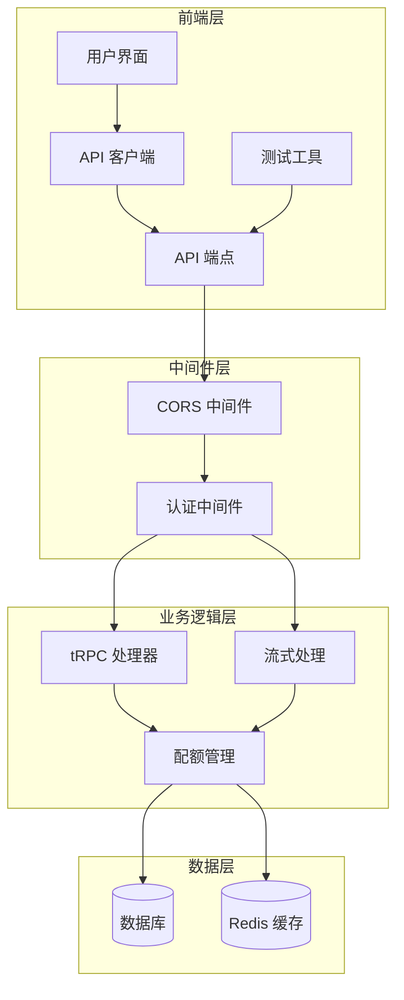
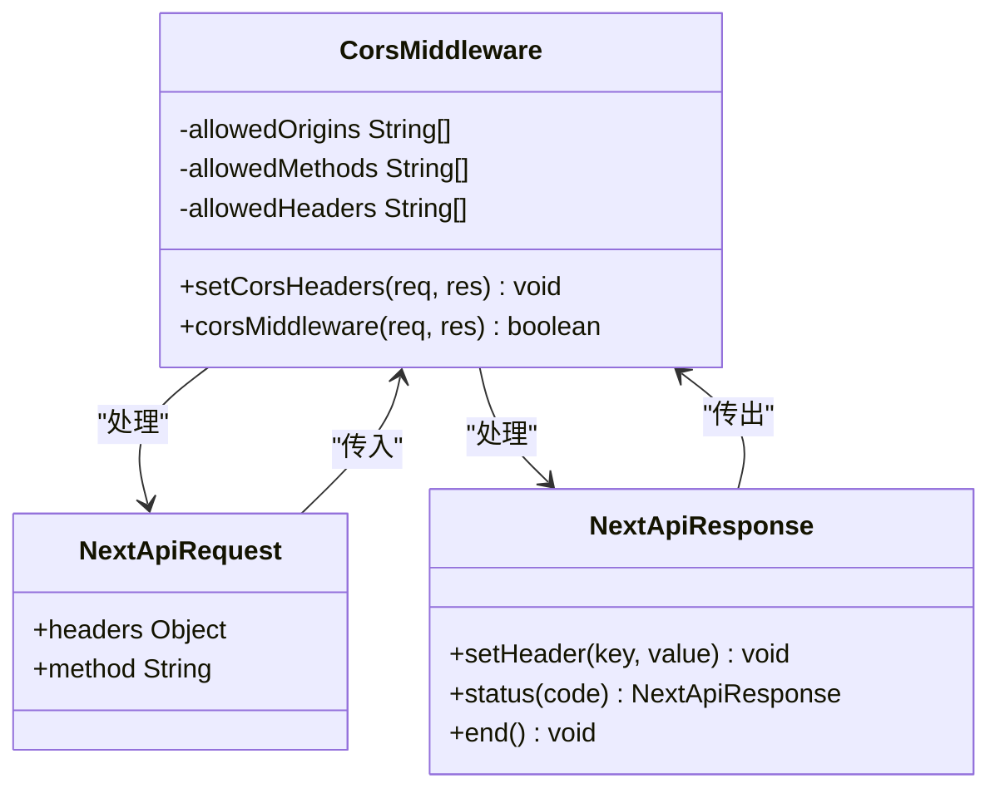
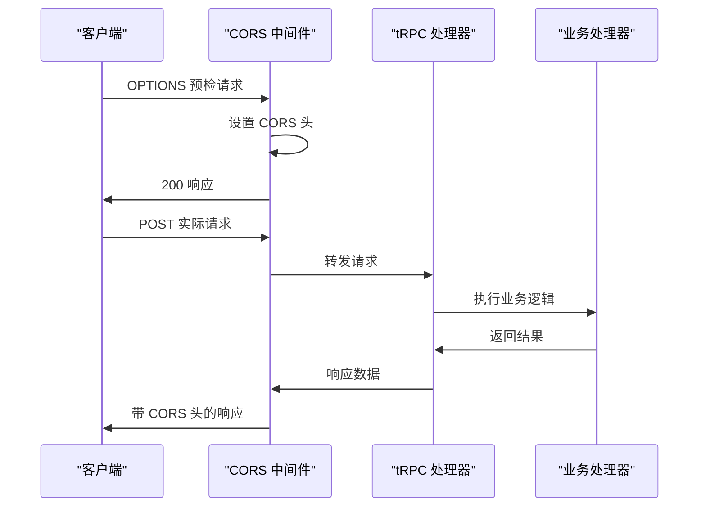
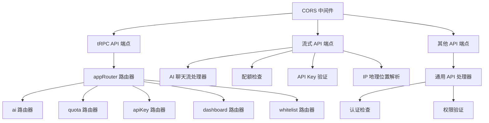
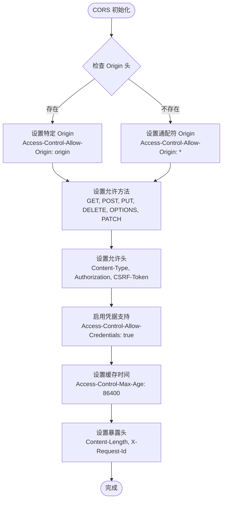
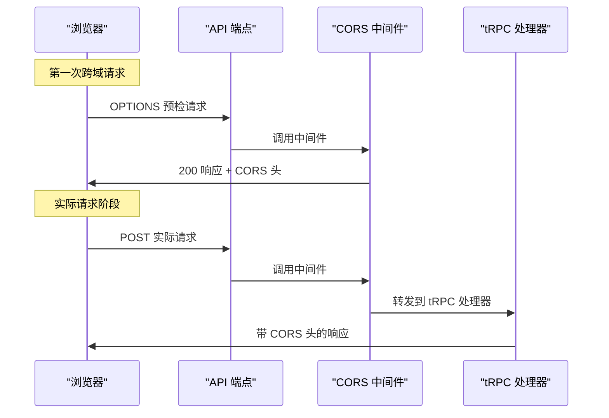
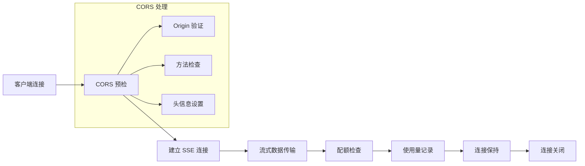
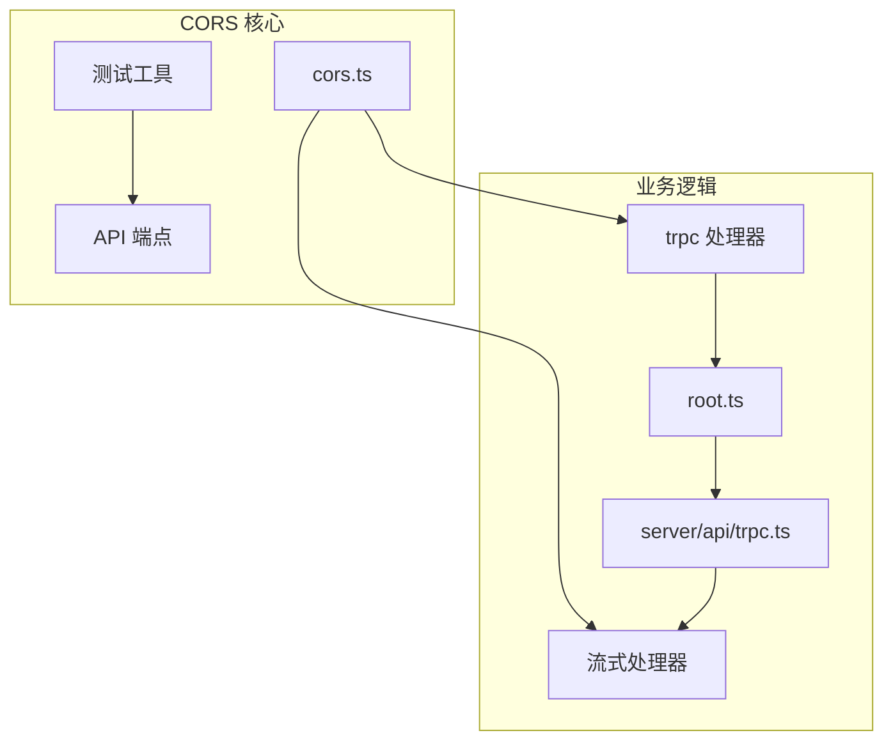

# CORS 跨域支持

<cite>
**本文档引用的文件**
- [src/lib/cors.ts](file://src/lib/cors.ts)
- [src/pages/api/trpc/[trpc].ts](file://src/pages/api/trpc/[trpc].ts)
- [src/pages/api/ai/chat/stream.ts](file://src/pages/api/ai/chat/stream.ts)
- [src/server/api/root.ts](file://src/server/api/root.ts)
- [src/server/api/trpc.ts](file://src/server/api/trpc.ts)
- [docs/cors-testing.md](file://docs/cors-testing.md)
- [package.json](file://package.json)
- [next.config.ts](file://next.config.ts)
</cite>

## 更新摘要
**变更内容**
- 新增详细的 CORS 跨域测试指南章节
- 增加多种测试工具的使用说明（cURL、JavaScript、Postman）
- 补充预检请求处理和跨域调用的实际测试方法
- 添加安全配置建议和最佳实践

## 目录
1. [简介](#简介)
2. [项目结构](#项目结构)
3. [核心组件](#核心组件)
4. [架构概览](#架构概览)
5. [详细组件分析](#详细组件分析)
6. [CORS 跨域测试指南](#cors-跨域测试指南)
7. [依赖关系分析](#依赖关系分析)
8. [性能考虑](#性能考虑)
9. [故障排除指南](#故障排除指南)
10. [结论](#结论)

## 简介

本项目实现了完整的 CORS（跨域资源共享）支持，使外部应用能够安全地访问后端 API。CORS 跨域支持是现代 Web 应用开发中的关键功能，特别是在需要与第三方应用或前端应用进行交互时。

项目采用 Next.js 框架构建，集成了 tRPC 用于类型安全的 API 开发，并实现了专门的 CORS 中间件来处理跨域请求。该实现支持预检请求（OPTIONS）、自定义请求头、凭据传递等功能。

**更新** 新增了完整的 CORS 跨域测试指南，包含多种测试工具的详细使用说明和实际测试方法。

## 项目结构

项目采用模块化架构，CORS 功能分布在多个关键位置：



**图表来源**
- [src/lib/cors.ts:1-54](file://src/lib/cors.ts#L1-L54)
- [src/pages/api/trpc/[trpc].ts](file://src/pages/api/trpc/[trpc].ts#L1-L28)
- [src/pages/api/ai/chat/stream.ts:1-124](file://src/pages/api/ai/chat/stream.ts#L1-L124)
- [docs/cors-testing.md:32-324](file://docs/cors-testing.md#L32-L324)

**章节来源**
- [src/lib/cors.ts:1-54](file://src/lib/cors.ts#L1-L54)
- [src/pages/api/trpc/[trpc].ts](file://src/pages/api/trpc/[trpc].ts#L1-L28)
- [src/pages/api/ai/chat/stream.ts:1-124](file://src/pages/api/ai/chat/stream.ts#L1-L124)

## 核心组件

### CORS 中间件实现

CORS 中间件是整个跨域支持系统的核心组件，提供了完整的跨域请求处理能力：



**图表来源**
- [src/lib/cors.ts:7-53](file://src/lib/cors.ts#L7-L53)

### tRPC API CORS 集成

tRPC API 通过中间件模式集成 CORS 支持：



**图表来源**
- [src/pages/api/trpc/[trpc].ts](file://src/pages/api/trpc/[trpc].ts#L20-L27)
- [src/lib/cors.ts:42-53](file://src/lib/cors.ts#L42-L53)

**章节来源**
- [src/lib/cors.ts:1-54](file://src/lib/cors.ts#L1-L54)
- [src/pages/api/trpc/[trpc].ts](file://src/pages/api/trpc/[trpc].ts#L1-L28)

## 架构概览

项目的 CORS 架构采用了分层设计，确保了功能的模块化和可维护性：



**图表来源**
- [src/lib/cors.ts:1-54](file://src/lib/cors.ts#L1-L54)
- [src/server/api/root.ts:13-19](file://src/server/api/root.ts#L13-L19)
- [src/pages/api/ai/chat/stream.ts:1-124](file://src/pages/api/ai/chat/stream.ts#L1-L124)

**章节来源**
- [src/server/api/root.ts:1-25](file://src/server/api/root.ts#L1-L25)
- [src/server/api/trpc.ts:1-153](file://src/server/api/trpc.ts#L1-L153)

## 详细组件分析

### CORS 中间件详细实现

CORS 中间件提供了全面的跨域请求处理功能：

#### 核心功能特性

| 功能特性 | 实现细节 | 安全考虑 |
|---------|----------|----------|
| 动态 Origin 设置 | 检测请求头中的 Origin，若不存在则使用通配符 | 生产环境建议限制具体域名 |
| 预检请求处理 | 自动处理 OPTIONS 方法，返回 200 状态码 | 避免 405 错误 |
| 凭据支持 | 允许携带 Cookie 和认证信息 | 需要配合前端 credentials: 'include' |
| 预检缓存 | 设置 24 小时缓存，减少重复预检请求 | 提升性能，减少网络开销 |

#### 配置参数详解



**图表来源**
- [src/lib/cors.ts:7-34](file://src/lib/cors.ts#L7-L34)

**章节来源**
- [src/lib/cors.ts:1-54](file://src/lib/cors.ts#L1-L54)

### tRPC API CORS 集成机制

tRPC API 通过中间件模式无缝集成 CORS 支持：

#### 处理流程



**图表来源**
- [src/pages/api/trpc/[trpc].ts](file://src/pages/api/trpc/[trpc].ts#L20-L27)
- [src/lib/cors.ts:42-53](file://src/lib/cors.ts#L42-L53)

#### tRPC 路由器结构

tRPC 路由器采用模块化设计，支持多种业务场景：

| 路由器名称 | 功能描述 | 访问权限 |
|-----------|----------|----------|
| aiRouter | AI 模型管理和聊天功能 | 公共接口 |
| quotaRouter | 用户配额管理和统计 | 受保护接口 |
| apiKeyRouter | API Key 管理和验证 | 受保护接口 |
| dashboardRouter | 控制台仪表板数据 | 受保护接口 |
| whitelistRouter | 白名单规则管理 | 受保护接口 |

**章节来源**
- [src/server/api/root.ts:1-25](file://src/server/api/root.ts#L1-L25)
- [src/server/api/trpc.ts:1-153](file://src/server/api/trpc.ts#L1-L153)

### 流式 API CORS 支持

流式 API（SSE）同样支持 CORS，确保实时数据传输的安全性：

#### 流式处理架构



**图表来源**
- [src/pages/api/ai/chat/stream.ts:9-13](file://src/pages/api/ai/chat/stream.ts#L9-L13)
- [src/pages/api/ai/chat/stream.ts:83-88](file://src/pages/api/ai/chat/stream.ts#L83-L88)

**章节来源**
- [src/pages/api/ai/chat/stream.ts:1-124](file://src/pages/api/ai/chat/stream.ts#L1-L124)

## CORS 跨域测试指南

### 问题描述

外部应用调用 tRPC API 时遇到以下错误：

```
❌ tRPC failed on <no-path>: Unexpected request method OPTIONS
OPTIONS /api/trpc/ai.getQuotaInfo 405 in 7ms
```

这是因为浏览器在跨域请求前会先发送 **OPTIONS 预检请求**，而 API 服务没有处理这类请求。

**更新** 新增了完整的测试指南，帮助开发者验证 CORS 配置的正确性。

### 修复方案

#### 修改的文件

1. **`src/lib/cors.ts`** - 新增 CORS 中间件
2. **`src/pages/api/trpc/[trpc].ts`** - 为 tRPC 端点添加 CORS 支持
3. **`src/pages/api/ai/chat/stream.ts`** - 为 Stream 端点添加 CORS 支持

#### 修复原理

- 添加 CORS 响应头处理 (`Access-Control-Allow-Origin` 等)
- 在所有 API 路由中处理 `OPTIONS` 请求
- 为跨域请求设置预检缓存时间

### 测试方法

#### 方法 1：使用 cURL 测试（推荐）

##### 测试 tRPC 端点

```bash
# 1. 先发送 OPTIONS 预检请求
curl -X OPTIONS http://localhost:3000/api/trpc/ai.getSupportedModels \
  -H "Origin: http://example.com" \
  -H "Access-Control-Request-Method: POST" \
  -H "Access-Control-Request-Headers: Content-Type" \
  -v

# 检查响应头是否包含：
# Access-Control-Allow-Origin: http://example.com
# Access-Control-Allow-Methods: GET, HEAD, POST, PUT, DELETE, OPTIONS, PATCH
# HTTP/1.1 200 OK

# 2. 再发送实际请求
curl -X POST http://localhost:3000/api/trpc/ai.getSupportedModels \
  -H "Origin: http://example.com" \
  -H "Content-Type: application/json" \
  -d '{"json":{}}' \
  -v
```

##### 测试 Stream 端点

```bash
# 1. OPTIONS 预检请求
curl -X OPTIONS http://localhost:3000/api/ai/chat/stream \
  -H "Origin: http://example.com" \
  -H "Access-Control-Request-Method: POST" \
  -H "Access-Control-Request-Headers: Content-Type" \
  -v

# 2. POST 实际请求
curl -X POST http://localhost:3000/api/ai/chat/stream \
  -H "Origin: http://example.com" \
  -H "Content-Type: application/json" \
  -d '{
    "userId": "user@example.com",
    "apiKeyId": "key-id",
    "request": {
      "model": "gpt-4o",
      "messages": [{"role": "user", "content": "hi"}],
      "stream": true
    }
  }' \
  -v
```

**更新** 新增了详细的 cURL 测试命令，包含预检请求和实际请求的完整测试流程。

#### 方法 2：使用 JavaScript 测试

##### 从另一个域的网页调用

```javascript
// 从 http://example.com 网页上运行

async function testTRPC() {
  try {
    const response = await fetch('http://localhost:3000/api/trpc/ai.getSupportedModels', {
      method: 'POST',
      headers: {
        'Content-Type': 'application/json',
      },
      // 重要：允许跨域请求时发送认证信息
      credentials: 'include',
      body: JSON.stringify({
        json: {},
      }),
    });

    const data = await response.json();
    console.log('✅ 成功:', data);
  } catch (error) {
    console.error('❌ 失败:', error);
  }
}

testTRPC();
```

##### Stream 调用示例

```javascript
async function testStream() {
  try {
    const response = await fetch('http://localhost:3000/api/ai/chat/stream', {
      method: 'POST',
      headers: {
        'Content-Type': 'application/json',
      },
      body: JSON.stringify({
        userId: 'user@example.com',
        apiKeyId: 'key-id',
        request: {
          model: 'gpt-4o',
          messages: [{ role: 'user', content: 'hello' }],
          stream: true,
        },
      }),
    });

    const reader = response.body.getReader();
    const decoder = new TextDecoder();

    while (true) {
      const { done, value } = await reader.read();
      if (done) break;

      const chunk = decoder.decode(value);
      console.log('📤 收到:', chunk);
    }
  } catch (error) {
    console.error('❌ 失败:', error);
  }
}

testStream();
```

**更新** 新增了 JavaScript 测试示例，展示如何从另一个域的网页调用 API 并处理流式响应。

#### 方法 3：使用 Postman 测试

##### 设置

1. 打开 Postman
2. 创建新的 Request
3. 设置 URL: `http://localhost:3000/api/trpc/ai.getSupportedModels`
4. 设置方法: `POST`

##### 添加 Headers

| Key          | Value              |
| ------------ | ------------------ |
| Content-Type | application/json   |
| Origin       | http://example.com |

##### Body (raw JSON)

```json
{
  "json": {}
}
```

##### 检查结果

- 状态码应该是 `200`
- 响应头应包含 `Access-Control-Allow-Origin: http://example.com`
- 返回 JSON 数据

**更新** 新增了 Postman 测试方法，提供图形化界面的测试选项。

### 预期结果

#### ✅ 修复成功的标志

```
HTTP/1.1 200 OK
Access-Control-Allow-Origin: http://example.com
Access-Control-Allow-Methods: GET, HEAD, POST, PUT, DELETE, OPTIONS, PATCH
Access-Control-Allow-Headers: Content-Type, Authorization, X-CSRF-Token, X-Requested-With
Access-Control-Allow-Credentials: true
Access-Control-Max-Age: 86400

{
  "result": {
    "data": [
      { "model": "gpt-4o", "provider": "OpenAI" },
      ...
    ]
  }
}
```

#### ❌ 如果仍然失败

如果仍然看到 `405 Method not allowed` 或 CORS 错误：

1. **检查服务器是否重启**
   ```bash
   # 重启开发服务器
   npm run dev
   ```

2. **检查文件是否正确修改**
   ```bash
   # 验证 CORS 中间件文件是否存在
   ls -la src/lib/cors.ts
   ```

3. **检查浏览器控制台**
   - 打开浏览器开发者工具 (F12)
   - 查看 Network 标签
   - 查看 OPTIONS 请求的响应头

4. **查看服务器日志**
   - 开发服务器应该看到请求日志
   - 如果看到错误，检查错误信息

**更新** 新增了详细的故障排除步骤，帮助开发者快速定位和解决问题。

### CORS 配置说明

#### 允许的请求源 (Origin)

目前配置为：

- **任何来源** (`*`)
- 也可以指定具体域名进行限制

如需限制，修改 `src/lib/cors.ts` 中的 `setCorsHeaders` 函数：

```typescript
// 只允许特定域名
const allowedOrigins = ['http://localhost:3000', 'https://yourdomain.com'];
const origin = req.headers.origin;

if (allowedOrigins.includes(origin || '')) {
  res.setHeader('Access-Control-Allow-Origin', origin);
}
```

#### 允许的 HTTP 方法

```
GET, HEAD, POST, PUT, DELETE, OPTIONS, PATCH
```

#### 允许的请求头

```
Content-Type, Authorization, X-CSRF-Token, X-Requested-With
```

#### 认证信息

- `Access-Control-Allow-Credentials: true` - 允许发送 Cookie

#### 预检缓存

- `Access-Control-Max-Age: 86400` - 浏览器缓存 24 小时

**更新** 新增了完整的 CORS 配置说明，帮助开发者理解每个配置项的作用。

### 常见问题

#### Q: 为什么还是 405 错误？

**A:** 需要重启开发服务器，确保新代码被加载。

#### Q: 为什么 OPTIONS 请求返回 200，但 POST 还是失败？

**A:** 检查 POST 请求本身的问题（参数格式、认证等），不是 CORS 问题。

#### Q: 如何在生产环境中设置更严格的 CORS？

**A:** 修改 `src/lib/cors.ts` 中的 `allowedOrigins` 列表，只允许受信任的域名。

#### Q: Stream 端点也支持 CORS 吗？

**A:** 是的，`/api/ai/chat/stream` 也已添加 CORS 支持。

**更新** 新增了常见问题解答，帮助开发者快速解决常见问题。

### 安全建议

⚠️ 当前配置允许 **任何来源** (`*`) 的请求。在生产环境中：

1. **限制允许的来源**
   ```typescript
   const allowedOrigins = ['https://yourdomain.com'];
   ```

2. **验证 Authorization 头**
   - 实现 API Key 验证
   - 或使用 OAuth2

3. **限制允许的方法**
   - 只允许必要的 HTTP 方法

4. **限制允许的请求头**
   - 移除不必要的请求头

**更新** 新增了安全建议，指导开发者在生产环境中如何配置更严格的安全策略。

## 依赖关系分析

### 核心依赖关系

项目中 CORS 功能的依赖关系清晰明确：



**图表来源**
- [src/lib/cors.ts:1-54](file://src/lib/cors.ts#L1-L54)
- [src/pages/api/trpc/[trpc].ts](file://src/pages/api/trpc/[trpc].ts#L1-L28)
- [src/pages/api/ai/chat/stream.ts:1-124](file://src/pages/api/ai/chat/stream.ts#L1-L124)
- [src/server/api/root.ts:1-25](file://src/server/api/root.ts#L1-L25)

### 外部依赖

项目使用的主要外部依赖包括：

| 依赖包 | 版本 | 用途 |
|--------|------|------|
| next | 16.1.6 | Web 应用框架 |
| @trpc/server | 10.45.2 | 类型安全 API 框架 |
| @trpc/client | 10.45.2 | 前端 API 客户端 |
| next-auth | 4.24.13 | 认证解决方案 |
| superjson | 2.2.1 | JSON 序列化增强 |

**章节来源**
- [package.json:18-57](file://package.json#L18-L57)

## 性能考虑

### CORS 性能优化策略

CORS 实现中包含了多项性能优化措施：

#### 预检请求缓存
- 设置 `Access-Control-Max-Age: 86400` 实现 24 小时缓存
- 减少重复的预检请求，提升跨域请求性能

#### 最小权限原则
- 仅暴露必要的响应头（Content-Length, X-Request-Id）
- 限制允许的方法和请求头，减少不必要的数据传输

#### 异步处理
- CORS 中间件采用异步处理，不影响主业务逻辑
- 流式 API 支持实时数据传输，无阻塞等待

## 故障排除指南

### 常见问题及解决方案

#### 问题 1：OPTIONS 预检请求失败

**症状表现**：
```
❌ tRPC failed on <no-path>: Unexpected request method OPTIONS
OPTIONS /api/trpc/ai.getQuotaInfo 405 in 7ms
```

**解决步骤**：
1. 确认 CORS 中间件已正确导入和使用
2. 检查 API 端点是否正确处理 OPTIONS 方法
3. 验证浏览器是否发送了正确的 Origin 头

**章节来源**
- [docs/cors-testing.md:5-12](file://docs/cors-testing.md#L5-L12)

#### 问题 2：CORS 头缺失

**症状表现**：
- 响应中缺少 `Access-Control-Allow-Origin` 头
- 浏览器控制台显示跨域错误

**解决步骤**：
1. 检查 `setCorsHeaders` 函数是否正确执行
2. 验证请求头处理逻辑
3. 确认响应头设置顺序正确

#### 问题 3：凭据传递失败

**症状表现**：
- 前端设置 `credentials: 'include'` 但 Cookie 未发送
- 认证失败

**解决步骤**：
1. 确认 `Access-Control-Allow-Credentials: true` 已设置
2. 验证 Origin 不能为通配符 `*`（必须指定具体域名）
3. 检查前端 fetch 请求配置

### 测试方法

#### cURL 测试命令

```bash
# 测试 tRPC 端点
curl -X OPTIONS http://localhost:3000/api/trpc/ai.getSupportedModels \
  -H "Origin: http://example.com" \
  -H "Access-Control-Request-Method: POST" \
  -H "Access-Control-Request-Headers: Content-Type" \
  -v

# 测试流式端点
curl -X POST http://localhost:3000/api/ai/chat/stream \
  -H "Origin: http://example.com" \
  -H "Content-Type: application/json" \
  -d '{"userId":"user@example.com","apiKeyId":"key-id","request":{"model":"gpt-4o","messages":[{"role":"user","content":"hi"}],"stream":true}}' \
  -v
```

**章节来源**
- [docs/cors-testing.md:34-83](file://docs/cors-testing.md#L34-L83)

## 结论

本项目的 CORS 跨域支持实现具有以下特点：

### 技术优势
- **完整性**：覆盖所有 API 端点，包括 tRPC 和流式 API
- **安全性**：支持凭据传递，可配置 Origin 限制
- **性能优化**：预检请求缓存，减少网络开销
- **易维护性**：模块化设计，中间件模式便于扩展
- **测试友好**：提供多种测试工具和详细测试指南

### 最佳实践
- 生产环境建议限制具体的允许 Origin，避免使用通配符
- 定期审查允许的方法和请求头，遵循最小权限原则
- 监控 CORS 相关的错误日志，及时发现和解决问题
- 使用提供的测试工具验证配置的正确性

### 扩展建议
- 可以添加动态 Origin 验证机制
- 考虑实现基于 IP 的访问控制
- 添加 CORS 相关的监控和告警功能
- 提供更详细的测试报告和日志分析

**更新** 新增了测试指南章节，提供了完整的测试方法和故障排除指导，使开发者能够更好地验证和调试 CORS 配置。

该 CORS 实现为项目提供了坚实的基础，支持各种跨域应用场景，同时保持了良好的安全性和性能表现。新增的测试指南进一步增强了系统的可维护性和可靠性。