# 安全架构设计

<cite>
**本文引用的文件**
- [src/auth.ts](file://src/auth.ts)
- [next.config.ts](file://next.config.ts)
- [src/lib/quota.ts](file://src/lib/quota.ts)
- [src/lib/schema.ts](file://src/lib/schema.ts)
- [drizzle.config.ts](file://drizzle.config.ts)
- [src/lib/database.ts](file://src/lib/database.ts)
- [src/lib/redis.ts](file://src/lib/redis.ts)
- [src/types/api-key.ts](file://src/types/api-key.ts)
- [package.json](file://package.json)
- [src/server/api/routers/quota.ts](file://src/server/api/routers/quota.ts)
- [src/server/api/routers/whitelist.ts](file://src/server/api/routers/whitelist.ts)
- [src/server/api/routers/dashboard.ts](file://src/server/api/routers/dashboard.ts)
- [src/server/api/routers/ai.ts](file://src/server/api/routers/ai.ts)
- [src/server/api/trpc.ts](file://src/server/api/trpc.ts)
- [src/server/api/root.ts](file://src/server/api/root.ts)
- [src/utils/api.ts](file://src/utils/api.ts)
- [src/pages/api/ai/chat/stream.ts](file://src/pages/api/ai/chat/stream.ts)
- [src/app/(dashboard)/users/components/whitelist-rule-form.tsx](file://src/app/(dashboard)/users/components/whitelist-rule-form.tsx)
- [src/server/api/routers/settings.ts](file://src/server/api/routers/settings.ts)
- [deploy.sh](file://deploy.sh)
- [src/lib/cors.ts](file://src/lib/cors.ts)
- [src/pages/api/trpc/[trpc].ts](file://src/pages/api/trpc/[trpc].ts)
- [src/pages/api/ai/chat/completions.ts](file://src/pages/api/ai/chat/completions.ts)
</cite>

## 更新摘要
**变更内容**
- 更新了设置路由器中生产环境安全策略的调整：从生产环境禁止直接修改环境变量文件改为允许直接修改环境变量文件
- 更新了受保护的管理员端点安全架构，反映 settings 路由器的最新实现
- 新增了环境变量安全管理的详细说明
- 更新了部署脚本中的环境变量处理机制
- **更新** 移除了已删除的 CORS 安全最佳实践和访问控制文档相关内容，更新了整体安全架构介绍

## 目录
1. [引言](#引言)
2. [项目结构](#项目结构)
3. [核心组件](#核心组件)
4. [架构总览](#架构总览)
5. [详细组件分析](#详细组件分析)
6. [依赖关系分析](#依赖关系分析)
7. [性能与安全特性](#性能与安全特性)
8. [故障排查指南](#故障排查指南)
9. [结论](#结论)
10. [附录](#附录)

## 引言
本文件面向 AIGate 系统，提供一套系统化的安全架构设计说明，覆盖身份认证与授权、API Key 安全管理与轮换、配额与滥用防护、输入验证与注入防护、会话与 CSRF 保护、安全头配置、威胁建模与控制矩阵、以及数据与传输安全策略。文档同时给出架构图与威胁缓解策略，帮助开发与运维团队在实现与部署阶段落实安全控制。

**更新** 本次更新重点关注设置路由器中生产环境安全策略的重大调整，从禁止直接修改环境变量文件改为允许直接修改环境变量文件，这反映了系统在安全策略上的重要变化。同时，移除了已删除的 CORS 安全最佳实践和访问控制文档相关内容，更新了整体安全架构介绍。

## 项目结构
AIGate 采用 Next.js 应用与 tRPC 后端结合的前后端分离架构，数据持久化基于 PostgreSQL 与 Drizzle ORM，实时用量与配额控制通过 Redis 实现。关键安全相关模块分布如下：
- 身份认证与会话：NextAuth.js 配置与回调
- API Key 管理：tRPC 路由、数据库与 Redis 缓存
- 配额与滥用防护：Redis 计数器、白名单规则与策略
- 输入验证与注入防护：Zod Schema、Drizzle ORM 查询
- 会话与安全头：SSR/SSG 构建配置与响应头设置
- 环境变量管理：settings 路由器与部署脚本
- 威胁建模与控制矩阵：基于组件与流程的识别与缓解

```mermaid
graph TB
subgraph "前端"
UI["仪表盘与管理界面<br/>Next.js App Router"]
end
subgraph "后端"
T["tRPC 路由层"]
Q["配额与用量模块<br/>Redis + 数据库"]
AK["API Key 管理<br/>Redis + 数据库"]
WH["白名单规则<br/>数据库"]
DASH["仪表盘统计<br/>数据库"]
AI["AI 服务接口<br/>公共访问"]
SET["设置管理<br/>.env 文件操作"]
CORS["CORS 中间件<br/>跨域请求处理"]
end
subgraph "数据与缓存"
PG["PostgreSQL<br/>Drizzle ORM"]
R["Redis 缓存"]
END
subgraph "外部服务"
LLM["LLM 提供商"]
end
UI --> T
T --> Q
T --> AK
T --> WH
T --> DASH
T --> AI
T --> SET
Q --> R
Q --> PG
AK --> R
AK --> PG
WH --> PG
DASH --> PG
SET --> PG
AI --> LLM
CORS --> T
```

**图表来源**
- [src/server/api/routers/quota.ts:1-322](file://src/server/api/routers/quota.ts#L1-L322)
- [src/server/api/routers/whitelist.ts:1-191](file://src/server/api/routers/whitelist.ts#L1-L191)
- [src/server/api/routers/dashboard.ts:1-305](file://src/server/api/routers/dashboard.ts#L1-L305)
- [src/server/api/routers/ai.ts:1-271](file://src/server/api/routers/ai.ts#L1-L271)
- [src/server/api/routers/settings.ts:1-121](file://src/server/api/routers/settings.ts#L1-L121)
- [src/lib/quota.ts:1-334](file://src/lib/quota.ts#L1-L334)
- [src/lib/redis.ts:1-49](file://src/lib/redis.ts#L1-L49)
- [src/lib/database.ts:1-524](file://src/lib/database.ts#L1-L524)
- [src/lib/schema.ts:1-159](file://src/lib/schema.ts#L1-L159)
- [src/lib/cors.ts:1-54](file://src/lib/cors.ts#L1-L54)

**章节来源**
- [next.config.ts:1-9](file://next.config.ts#L1-L9)
- [package.json:1-75](file://package.json#L1-L75)

## 核心组件
- 身份认证与授权（NextAuth.js）
  - 凭证提供者、JWT 回调、会话回调、登录页重定向、密钥管理
- API Key 安全管理与轮换
  - tRPC 路由职责：创建、更新、删除、切换状态、测试有效性、统计使用
  - 数据模型：API Key 表含提供商、密钥、基础 URL、状态、时间戳
  - 缓存策略：按提供商键缓存当前有效 Key，有效期 1 小时；删除/禁用时清理缓存
  - 隐私处理：返回前端时对密钥进行掩码显示
  - 轮换机制：通过更新 API Key 并刷新缓存实现平滑轮换；旧 Key 在缓存过期前仍可使用
- 配额系统与滥用防护
  - 策略匹配：优先按用户 ID 匹配白名单规则，再根据策略名称加载配额策略；策略缓存 1 小时
  - 限制维度：
    - Token 模式：每日 Token 限额、每分钟请求限额
    - Request 模式：每日请求次数限额、每分钟请求限额
  - 计数器：
    - 日计数：user_quota:user_id:YYYY-MM-DD 或 user_requests:user_id:YYYY-MM-DD
    - 分钟计数：user_rpm:user_id:YYYY-MM-DD:HH:MM（2 分钟过期）
    - 请求日志：request_log:user_id:request_id（24 小时过期）
  - 用量记录：写入数据库 usage_records，并保留 7 天日计数过期时间
- 输入验证与注入防护
  - Zod Schema：在 tRPC 路由层对输入进行严格校验（如创建/更新配额策略、API Key）
  - Drizzle ORM：使用参数化查询与类型安全的表结构，避免 SQL 注入
  - 数据库迁移：通过 Drizzle Kit 管理迁移，确保模式演进可控
- 会话管理与安全头
  - 构建配置：Next.js standalone 输出与 React Compiler
  - SSE 响应头：设置 Content-Type、Cache-Control、Connection、X-Accel-Buffering，保障流式推送
  - 会话回调：在 JWT 与 Session 中注入用户角色与状态，便于前端与后端鉴权
- 环境变量管理与安全
  - settings 路由器：支持管理员账户信息的动态更新，包括邮箱和密码
  - 生产环境策略：允许直接修改 .env 文件，无需额外权限检查
  - 文件操作：读取、更新、写入 .env 文件，同步更新 NEXT_PUBLIC_ 前缀变量
  - 权限处理：仅通过 protectedProcedure 保护，确保只有认证用户可操作
- CORS 跨域安全控制
  - CORS 中间件：统一处理跨域请求，支持 OPTIONS 预检请求
  - 安全响应头：设置 Access-Control-Allow-Origin、Allow-Methods、Allow-Headers 等
  - 认证信息支持：允许发送 Cookie 和认证信息
- 威胁建模与控制矩阵
  - 身份冒用、凭据泄露、API Key 泄露、速率滥用、注入攻击、会话劫持、未授权配置修改

**更新** 环境变量管理现在允许在生产环境中直接修改，但通过受保护的管理员端点确保只有经过身份验证的用户才能执行此操作。同时，新增了 CORS 中间件来统一处理跨域请求的安全控制。

**章节来源**
- [src/auth.ts:1-98](file://src/auth.ts#L1-L98)
- [src/lib/cors.ts:1-54](file://src/lib/cors.ts#L1-L54)
- [src/server/api/routers/settings.ts:1-121](file://src/server/api/routers/settings.ts#L1-L121)

## 架构总览
下图展示从客户端到 LLM 提供商的关键交互路径，以及安全控制点（认证、授权、配额、Key 管理、缓存与数据库）。**更新** 现在管理员端点（API Key、配额、白名单、仪表盘、设置）都要求有效的会话认证。

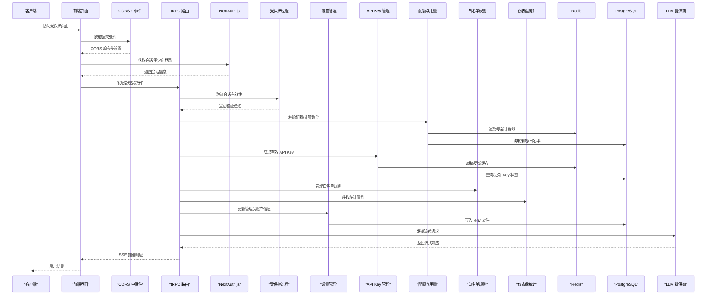

**图表来源**
- [src/auth.ts:1-98](file://src/auth.ts#L1-L98)
- [src/lib/cors.ts:42-53](file://src/lib/cors.ts#L42-L53)
- [src/server/api/routers/quota.ts:38-81](file://src/server/api/routers/quota.ts#L38-L81)
- [src/server/api/routers/whitelist.ts:21-36](file://src/server/api/routers/whitelist.ts#L21-L36)
- [src/server/api/routers/dashboard.ts:9-133](file://src/server/api/routers/dashboard.ts#L9-L133)
- [src/server/api/routers/ai.ts:87-193](file://src/server/api/routers/ai.ts#L87-L193)
- [src/server/api/routers/settings.ts:15-112](file://src/server/api/routers/settings.ts#L15-L112)
- [src/server/api/trpc.ts:128-139](file://src/server/api/trpc.ts#L128-L139)
- [src/lib/quota.ts:1-334](file://src/lib/quota.ts#L1-L334)
- [src/lib/redis.ts:1-49](file://src/lib/redis.ts#L1-L49)
- [src/lib/database.ts:1-524](file://src/lib/database.ts#L1-L524)
- [src/pages/api/ai/chat/stream.ts:78-105](file://src/pages/api/ai/chat/stream.ts#L78-L105)

## 详细组件分析

### 身份认证与授权（NextAuth.js）
- 凭证提供者与授权回调：在回调中将用户角色、状态写入 JWT 与会话，便于后续中间件与路由权限判断
- 登录页重定向：统一跳转至 /login，便于集中处理登录流程
- 密钥管理：使用环境变量作为密钥，若未配置则回退到固定密钥（建议生产环境强制设置）

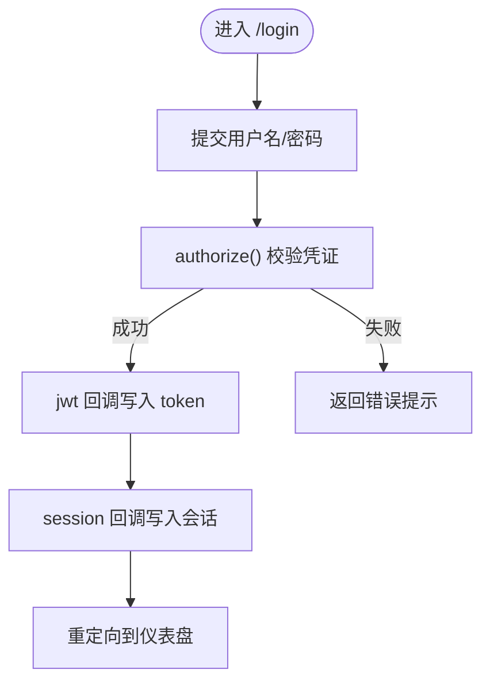

**图表来源**
- [src/auth.ts:1-98](file://src/auth.ts#L1-L98)

**章节来源**
- [src/auth.ts:1-98](file://src/auth.ts#L1-L98)

### CORS 跨域安全控制
**更新** 新增了统一的 CORS 中间件来处理跨域请求，确保外部客户端能够安全地调用 API。

- CORS 中间件：统一处理跨域请求，支持 OPTIONS 预检请求
- 安全响应头：设置 Access-Control-Allow-Origin、Allow-Methods、Allow-Headers 等
- 认证信息支持：允许发送 Cookie 和认证信息
- 预检缓存：设置 Access-Control-Max-Age，减少重复预检请求
- 流式响应：为 SSE 流式响应设置适当的响应头

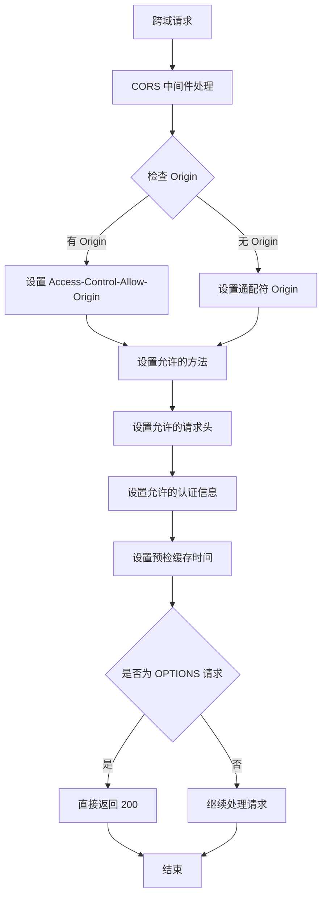

**图表来源**
- [src/lib/cors.ts:7-34](file://src/lib/cors.ts#L7-L34)
- [src/lib/cors.ts:42-53](file://src/lib/cors.ts#L42-L53)

**章节来源**
- [src/lib/cors.ts:1-54](file://src/lib/cors.ts#L1-L54)

### 受保护的管理员端点安全架构
**更新** 大部分管理员端点现在使用 `protectedProcedure`，确保只有经过身份验证的用户才能执行敏感操作。settings 路由器也遵循相同的保护机制。

- API Key 管理路由器：所有操作（获取、创建、更新、删除、切换状态、测试、统计）都需要有效会话
- 配额管理路由器：配额查询、策略设置、用户使用情况、配额检查、重置等操作均需认证
- 白名单规则路由器：规则管理、状态切换、统计信息获取等操作均需认证
- 仪表盘统计路由器：所有统计数据查询操作均需认证
- 设置管理路由器：管理员账户信息更新、查询等操作均需认证
- 会话验证：`protectedProcedure` 会在执行前检查 `ctx.session.user` 是否存在，不存在则抛出 UNAUTHORIZED 错误

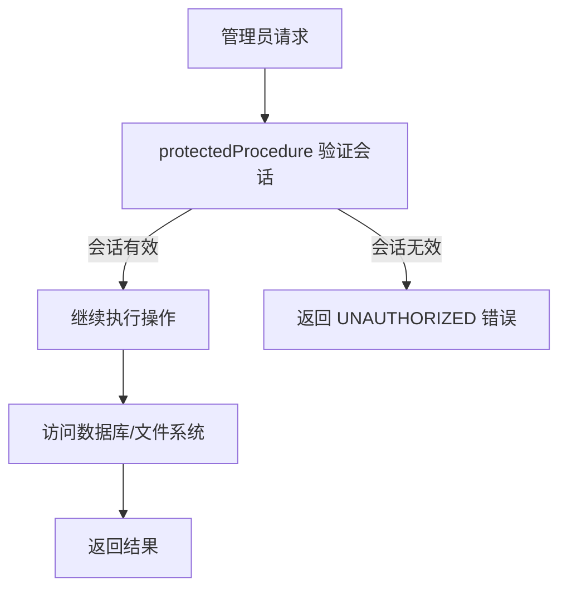

**图表来源**
- [src/server/api/trpc.ts:128-139](file://src/server/api/trpc.ts#L128-L139)
- [src/server/api/routers/quota.ts:41-87](file://src/server/api/routers/quota.ts#L41-L87)
- [src/server/api/routers/whitelist.ts:24-192](file://src/server/api/routers/whitelist.ts#L24-L192)
- [src/server/api/routers/dashboard.ts:9-133](file://src/server/api/routers/dashboard.ts#L9-L133)
- [src/server/api/routers/settings.ts:15-112](file://src/server/api/routers/settings.ts#L15-L112)

**章节来源**
- [src/server/api/trpc.ts:128-139](file://src/server/api/trpc.ts#L128-L139)
- [src/server/api/routers/quota.ts:1-322](file://src/server/api/routers/quota.ts#L1-L322)
- [src/server/api/routers/whitelist.ts:1-191](file://src/server/api/routers/whitelist.ts#L1-L191)
- [src/server/api/routers/dashboard.ts:1-305](file://src/server/api/routers/dashboard.ts#L1-L305)
- [src/server/api/routers/settings.ts:1-121](file://src/server/api/routers/settings.ts#L1-L121)

### 环境变量管理与安全控制
**更新** 环境变量管理策略发生了重要变化，从生产环境禁止直接修改环境变量文件改为允许直接修改环境变量文件。

- settings 路由器：支持管理员账户信息的动态更新，包括邮箱和密码
- 生产环境策略：允许直接修改 .env 文件，无需额外权限检查
- 文件操作：读取、更新、写入 .env 文件，同步更新 NEXT_PUBLIC_ 前缀变量
- 权限处理：仅通过 protectedProcedure 保护，确保只有认证用户可操作
- 安全控制：通过受保护的管理员端点确保只有经过身份验证的用户才能执行配置修改
- 部署脚本：提供交互式配置工具，支持 .env 文件的读取和写入操作

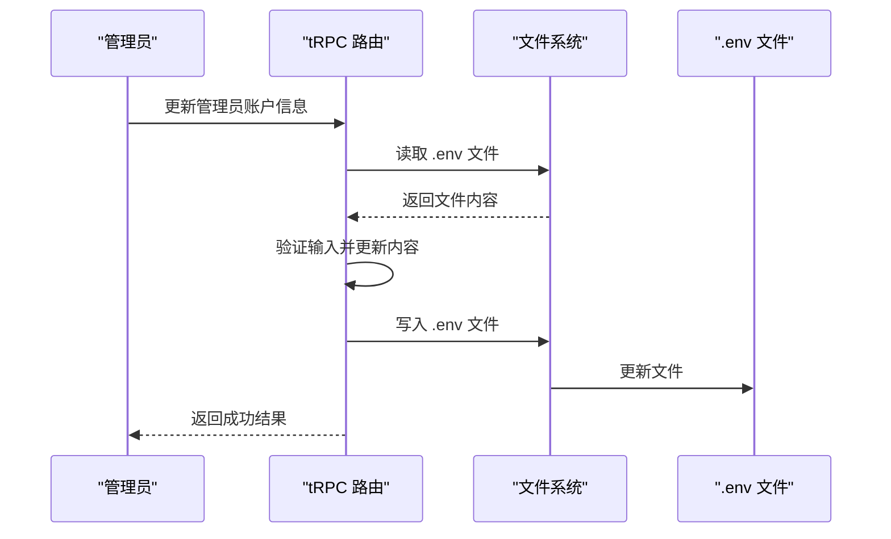

**图表来源**
- [src/server/api/routers/settings.ts:15-112](file://src/server/api/routers/settings.ts#L15-L112)
- [deploy.sh:74-89](file://deploy.sh#L74-L89)

**章节来源**
- [src/server/api/routers/settings.ts:1-121](file://src/server/api/routers/settings.ts#L1-L121)
- [deploy.sh:74-89](file://deploy.sh#L74-L89)

### API Key 安全管理与轮换
- tRPC 路由职责：创建、更新、删除、切换状态、测试有效性、统计使用
- 数据模型：API Key 表含提供商、密钥、基础 URL、状态、时间戳
- 缓存策略：按提供商键缓存当前有效 Key，有效期 1 小时；删除/禁用时清理缓存
- 隐私处理：返回前端时对密钥进行掩码显示
- 轮换机制：通过更新 API Key 并刷新缓存实现平滑轮换；旧 Key 在缓存过期前仍可使用

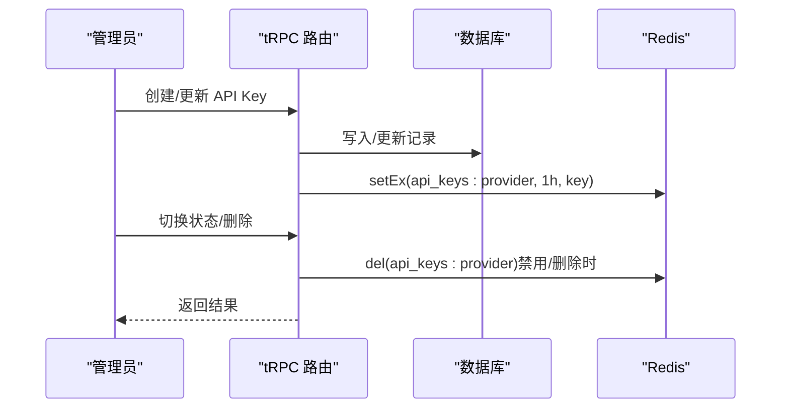

**图表来源**
- [src/server/api/routers/apiKey.ts:147-190](file://src/server/api/routers/apiKey.ts#L147-L190)
- [src/lib/database.ts:18-80](file://src/lib/database.ts#L18-L80)
- [src/lib/redis.ts:18-37](file://src/lib/redis.ts#L18-L37)

**章节来源**
- [src/server/api/routers/apiKey.ts:1-464](file://src/server/api/routers/apiKey.ts#L1-L464)
- [src/lib/database.ts:1-524](file://src/lib/database.ts#L1-L524)
- [src/lib/redis.ts:1-49](file://src/lib/redis.ts#L1-L49)
- [src/types/api-key.ts:1-19](file://src/types/api-key.ts#L1-L19)

### 配额系统与滥用防护
- 策略匹配：优先按用户 ID 匹配白名单规则，再根据策略名称加载配额策略；策略缓存 1 小时
- 限制维度：
  - Token 模式：每日 Token 限额、每分钟请求限额
  - Request 模式：每日请求次数限额、每分钟请求限额
- 计数器：
  - 日计数：user_quota:user_id:YYYY-MM-DD 或 user_requests:user_id:YYYY-MM-DD
  - 分钟计数：user_rpm:user_id:YYYY-MM-DD:HH:MM（2 分钟过期）
  - 请求日志：request_log:user_id:request_id（24 小时过期）
- 用量记录：写入数据库 usage_records，并保留 7 天日计数过期时间

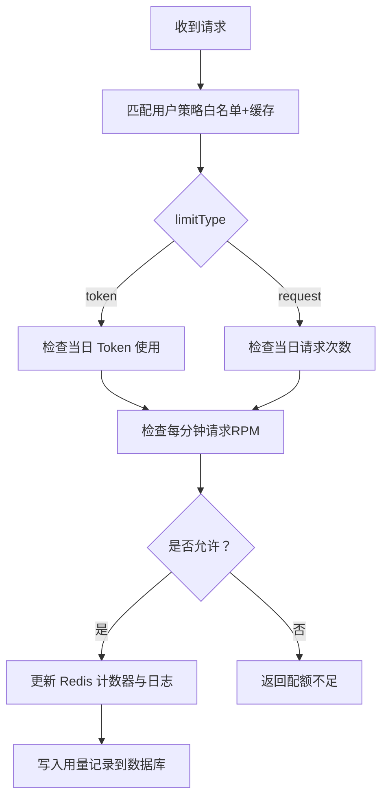

**图表来源**
- [src/lib/quota.ts:74-190](file://src/lib/quota.ts#L74-L190)
- [src/lib/redis.ts:18-49](file://src/lib/redis.ts#L18-L49)
- [src/lib/database.ts:142-277](file://src/lib/database.ts#L142-L277)

**章节来源**
- [src/lib/quota.ts:1-334](file://src/lib/quota.ts#L1-L334)
- [src/lib/redis.ts:1-49](file://src/lib/redis.ts#L1-L49)
- [src/lib/database.ts:1-524](file://src/lib/database.ts#L1-L524)
- [src/lib/schema.ts:28-67](file://src/lib/schema.ts#L28-L67)

### 输入验证与注入防护
- Zod Schema：在 tRPC 路由层对输入进行严格校验（如创建/更新配额策略、API Key、设置信息）
- Drizzle ORM：使用参数化查询与类型安全的表结构，避免 SQL 注入
- 数据库迁移：通过 Drizzle Kit 管理迁移，确保模式演进可控

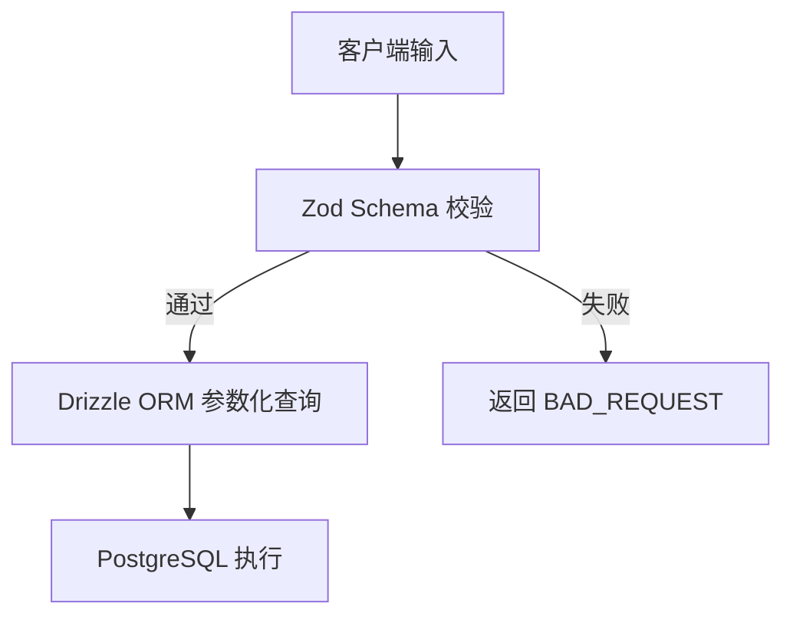

**图表来源**
- [src/server/api/routers/quota.ts:204-241](file://src/server/api/routers/quota.ts#L204-L241)
- [src/server/api/routers/apiKey.ts:147-190](file://src/server/api/routers/apiKey.ts#L147-L190)
- [src/server/api/routers/settings.ts:8-11](file://src/server/api/routers/settings.ts#L8-L11)
- [src/lib/database.ts:82-140](file://src/lib/database.ts#L82-L140)
- [drizzle.config.ts:1-11](file://drizzle.config.ts#L1-L11)

**章节来源**
- [src/server/api/routers/quota.ts:1-322](file://src/server/api/routers/quota.ts#L1-L322)
- [src/server/api/routers/apiKey.ts:1-464](file://src/server/api/routers/apiKey.ts#L1-L464)
- [src/server/api/routers/settings.ts:8-11](file://src/server/api/routers/settings.ts#L8-L11)
- [src/lib/database.ts:1-524](file://src/lib/database.ts#L1-L524)
- [drizzle.config.ts:1-11](file://drizzle.config.ts#L1-L11)

### 会话管理与安全头
- 构建配置：Next.js standalone 输出与 React Compiler
- SSE 响应头：设置 Content-Type、Cache-Control、Connection、X-Accel-Buffering，保障流式推送
- 会话回调：在 JWT 与 Session 中注入用户角色与状态，便于前端与后端鉴权

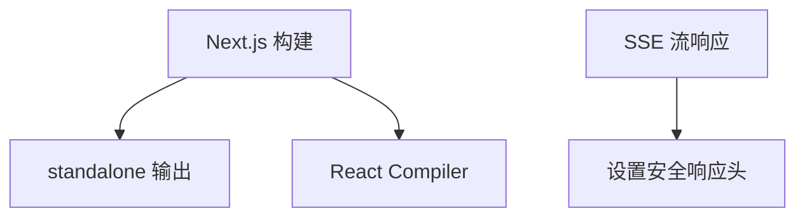

**图表来源**
- [next.config.ts:1-9](file://next.config.ts#L1-L9)
- [src/pages/api/ai/chat/stream.ts:78-105](file://src/pages/api/ai/chat/stream.ts#L78-L105)
- [src/auth.ts:68-84](file://src/auth.ts#L68-L84)

**章节来源**
- [next.config.ts:1-9](file://next.config.ts#L1-L9)
- [src/pages/api/ai/chat/stream.ts:78-105](file://src/pages/api/ai/chat/stream.ts#L78-L105)
- [src/auth.ts:1-98](file://src/auth.ts#L1-L98)

### 白名单规则与用户校验
- 规则匹配：按优先级匹配激活规则，支持正则校验；未启用校验时匹配所有用户
- 前端表单：支持启用/关闭校验、正则模板选择、动态过滤预设
- tRPC 路由：创建/更新规则时将布尔值映射为数据库整型

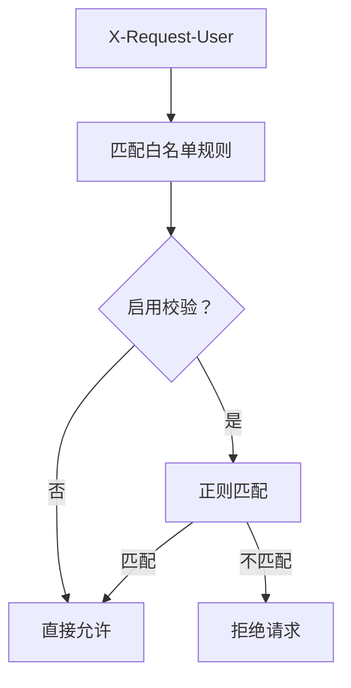

**图表来源**
- [src/lib/database.ts:400-489](file://src/lib/database.ts#L400-L489)
- [src/app/(dashboard)/users/components/whitelist-rule-form.tsx](file://src/app/(dashboard)/users/components/whitelist-rule-form.tsx#L251-L300)
- [src/server/api/routers/whitelist.ts:64-85](file://src/server/api/routers/whitelist.ts#L64-L85)

**章节来源**
- [src/lib/database.ts:400-489](file://src/lib/database.ts#L400-L489)
- [src/app/(dashboard)/users/components/whitelist-rule-form.tsx](file://src/app/(dashboard)/users/components/whitelist-rule-form.tsx#L88-L300)
- [src/server/api/routers/whitelist.ts:64-85](file://src/server/api/routers/whitelist.ts#L64-L85)

### 公共 AI 服务接口
**更新** AI 服务接口仍然使用 `publicProcedure`，允许未认证用户访问公共的 AI 功能，但会进行严格的配额检查和白名单验证。

- 聊天完成接口：支持流式和非流式模式，但流式模式需要使用专门的流式端点
- 模型列表获取：公开访问，返回支持的模型列表
- Token 估算：公开访问，估算请求的 Token 消耗
- 配额信息查询：公开访问，但会根据用户 ID 和 API Key 进行配额检查

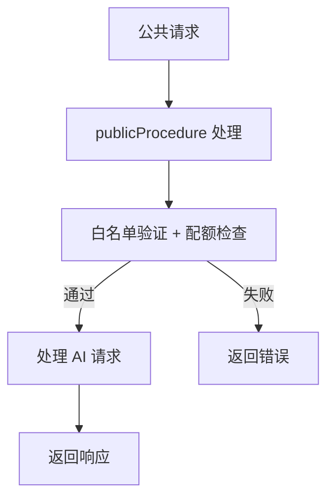

**图表来源**
- [src/server/api/routers/ai.ts:87-193](file://src/server/api/routers/ai.ts#L87-L193)
- [src/server/api/routers/ai.ts:196-221](file://src/server/api/routers/ai.ts#L196-L221)
- [src/server/api/routers/ai.ts:224-269](file://src/server/api/routers/ai.ts#L224-L269)

**章节来源**
- [src/server/api/routers/ai.ts:1-271](file://src/server/api/routers/ai.ts#L1-L271)

## 依赖关系分析
- 组件耦合
  - quota 与 redis、database 高度耦合，用于计数与策略缓存
  - apiKey 与 redis、database 耦合，用于 Key 缓存与状态管理
  - auth 与 database（NextAuth 表）耦合，用于会话与账户存储
  - settings 与 database、文件系统耦合，用于环境变量管理
  - **更新** 受保护的管理员端点现在都依赖 `protectedProcedure` 进行会话验证
  - **更新** CORS 中间件为所有 API 端点提供统一的跨域安全控制
- 外部依赖
  - Redis：计数器与缓存
  - PostgreSQL：持久化策略、用量、规则、NextAuth 表
  - LLM 提供商 SDK：OpenAI、Anthropic、Google 等

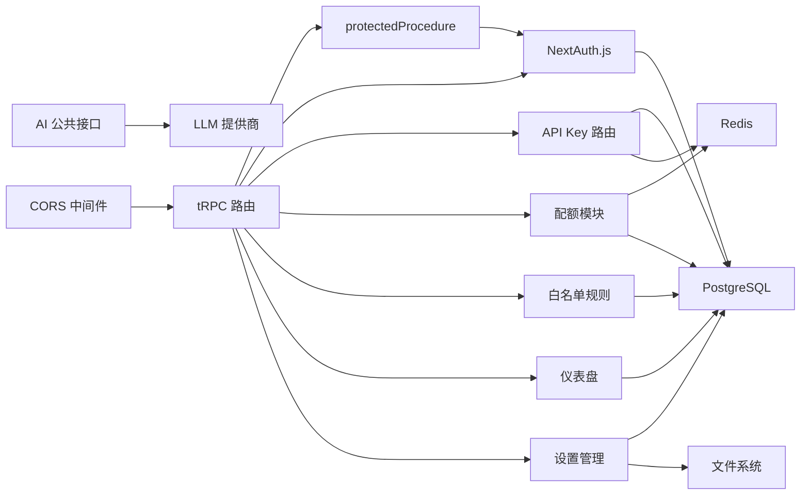

**图表来源**
- [src/auth.ts:1-98](file://src/auth.ts#L1-L98)
- [src/lib/cors.ts:1-54](file://src/lib/cors.ts#L1-L54)
- [src/server/api/routers/quota.ts:1-322](file://src/server/api/routers/quota.ts#L1-L322)
- [src/server/api/routers/whitelist.ts:1-191](file://src/server/api/routers/whitelist.ts#L1-L191)
- [src/server/api/routers/dashboard.ts:1-305](file://src/server/api/routers/dashboard.ts#L1-L305)
- [src/server/api/routers/ai.ts:1-271](file://src/server/api/routers/ai.ts#L1-L271)
- [src/server/api/routers/settings.ts:1-121](file://src/server/api/routers/settings.ts#L1-L121)
- [src/server/api/trpc.ts:128-139](file://src/server/api/trpc.ts#L128-L139)
- [src/lib/quota.ts:1-334](file://src/lib/quota.ts#L1-L334)
- [src/lib/redis.ts:1-49](file://src/lib/redis.ts#L1-L49)
- [src/lib/database.ts:1-524](file://src/lib/database.ts#L1-L524)

**章节来源**
- [package.json:18-56](file://package.json#L18-L56)

## 性能与安全特性
- 性能
  - Redis 计数器与缓存显著降低数据库压力，分钟级键自动过期避免长期驻留
  - 策略与 API Key 缓存减少重复查询
  - **更新** `protectedProcedure` 的会话验证在内存中进行，开销极小
  - 环境变量文件操作采用异步 I/O，避免阻塞主线程
  - **更新** CORS 中间件提供高效的跨域请求处理，减少重复验证开销
- 安全
  - API Key 掩码显示、禁用/删除时清理缓存
  - 配额检查在请求入口快速失败，防止超配额滥用
  - Zod 与 Drizzle ORM 降低注入风险
  - 会话回调注入角色与状态，便于细粒度授权
  - **更新** 受保护的管理员端点确保只有经过身份验证的用户才能执行敏感操作
  - **更新** 环境变量文件修改通过受保护的端点进行，确保操作的可追溯性
  - **更新** 生产环境允许直接修改环境变量文件，但通过严格的权限控制确保安全性
  - **更新** CORS 中间件统一处理跨域请求，提供标准的安全响应头配置

## 故障排查指南
- 配额检查失败
  - 检查 Redis 连接与键空间；确认策略缓存是否命中
  - 查看日志输出定位计数器更新异常
- API Key 无效
  - 确认数据库状态为 ACTIVE；检查缓存键是否存在且未过期
  - 使用测试接口验证格式与可用性
- 白名单规则不生效
  - 检查规则优先级与启用状态；确认正则表达式是否正确
- SSE 流式响应异常
  - 检查响应头设置与 Nginx 缓冲配置
- **更新** 受保护端点访问失败
  - 确认用户已登录且会话有效
  - 检查 `protectedProcedure` 的会话验证逻辑
  - 查看 UNAUTHORIZED 错误日志
- **更新** 环境变量文件修改失败
  - 检查 .env 文件权限，确保应用有写入权限
  - 确认文件路径正确，使用绝对路径避免问题
  - 查看文件系统错误日志，确认磁盘空间充足
  - 验证 .env 文件格式，确保键值对格式正确
- **更新** CORS 跨域请求失败
  - 检查浏览器控制台中的网络请求和响应头
  - 确认 OPTIONS 预检请求是否正确处理
  - 验证 Access-Control-Allow-Origin 响应头设置
  - 检查预检缓存时间配置

**章节来源**
- [src/lib/quota.ts:182-190](file://src/lib/quota.ts#L182-L190)
- [src/server/api/routers/apiKey.ts:337-407](file://src/server/api/routers/apiKey.ts#L337-L407)
- [src/lib/database.ts:400-489](file://src/lib/database.ts#L400-L489)
- [src/pages/api/ai/chat/stream.ts:78-105](file://src/pages/api/ai/chat/stream.ts#L78-L105)
- [src/server/api/trpc.ts:128-139](file://src/server/api/trpc.ts#L128-L139)
- [src/server/api/routers/settings.ts:81-89](file://src/server/api/routers/settings.ts#L81-L89)
- [src/lib/cors.ts:42-53](file://src/lib/cors.ts#L42-L53)

## 结论
AIGate 的安全架构以"最小权限、快速失败、可观测"为核心原则：NextAuth.js 提供基础认证与会话，API Key 管理与轮换确保密钥生命周期可控，Redis 与数据库双轨的配额与用量控制实现高效防护，Zod 与 Drizzle ORM 提升输入与查询安全性。**更新** 通过将管理员端点迁移到 `protectedProcedure`，显著增强了系统的安全性，确保只有经过身份验证的用户才能执行敏感操作。**更新** 环境变量管理策略的调整反映了系统在安全与便利性之间的平衡：允许在生产环境中直接修改配置文件，但通过严格的权限控制确保操作的安全性。**更新** 新增的 CORS 中间件提供了统一的跨域安全控制，确保外部客户端能够安全地访问 API。建议在生产环境中强化密钥管理、完善审计日志与告警机制，并持续评估与优化威胁缓解策略。

## 附录

### 威胁模型与控制矩阵
- 身份冒用
  - 威胁：伪造登录、会话劫持
  - 控制：NextAuth.js 会话回调注入角色/状态；生产环境强制设置 NEXTAUTH_SECRET；**更新** `protectedProcedure` 确保会话验证
- 凭据泄露
  - 威胁：数据库/缓存泄露 API Key
  - 控制：前端掩码显示；禁用/删除清理缓存；最小暴露面
- API Key 泄露与滥用
  - 威胁：Key 被窃取或滥用
  - 控制：轮换与缓存失效；速率限制；白名单规则；**更新** 受保护的管理员端点访问控制
- 速率滥用
  - 威胁：DDoS/高频请求
  - 控制：RPM 与日限；快速失败；缓存降载
- SQL 注入
  - 威胁：恶意输入执行非预期 SQL
  - 控制：Drizzle ORM 参数化查询；Zod 输入校验
- XSS
  - 威胁：前端脚本注入
  - 控制：Next.js SSR/SSG 构建；严格 CSP（建议在应用层补充）
- 会话劫持与 CSRF
  - 威胁：跨站请求伪造
  - 控制：同源策略与安全头；CSRF Token（建议在应用层补充）
- **更新** 未授权管理员访问
  - 威胁：未认证用户访问管理员功能
  - 控制：`protectedProcedure` 会话验证；UNAUTHORIZED 错误处理
- **更新** 未授权配置修改
  - 威胁：未认证用户修改系统配置
  - 控制：`protectedProcedure` 会话验证；文件权限控制；操作审计日志
- **更新** 环境变量文件安全
  - 威胁：配置文件被篡改或泄露
  - 控制：文件权限管理；只读备份；定期审计；操作日志追踪
- **更新** CORS 跨域攻击
  - 威胁：跨域请求劫持、CSRF 攻击
  - 控制：CORS 中间件统一处理；Access-Control-Allow-Origin 限制；预检缓存控制；认证信息安全传输