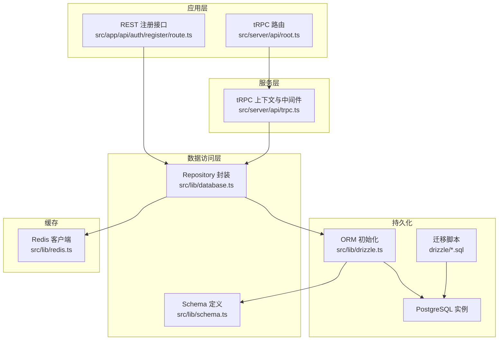
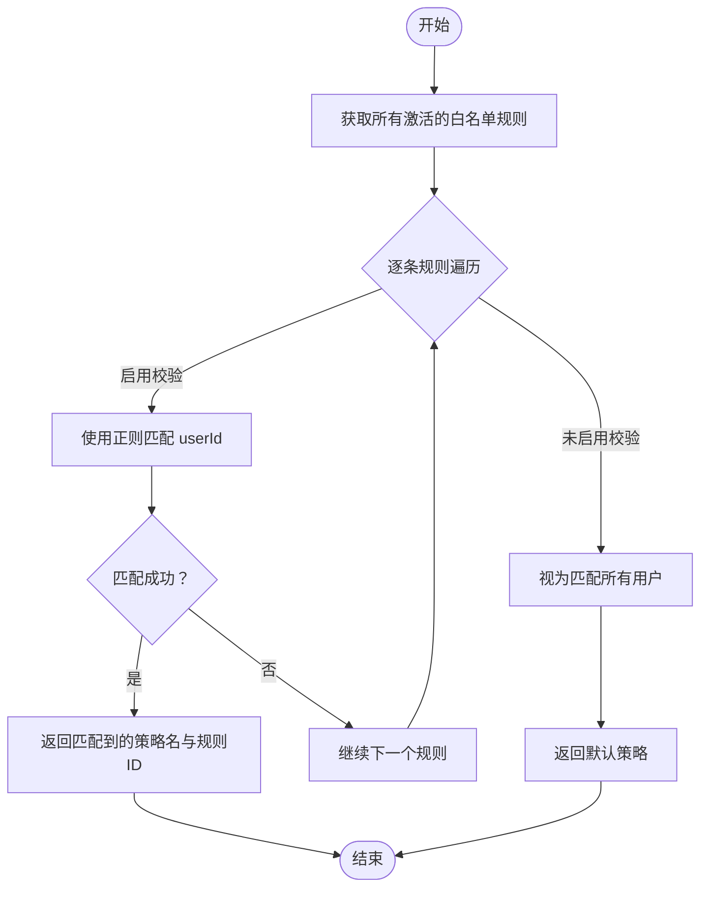
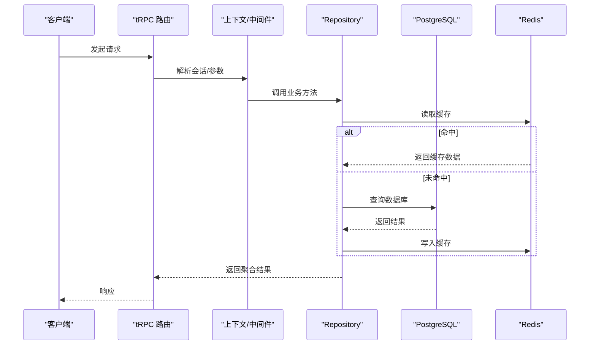
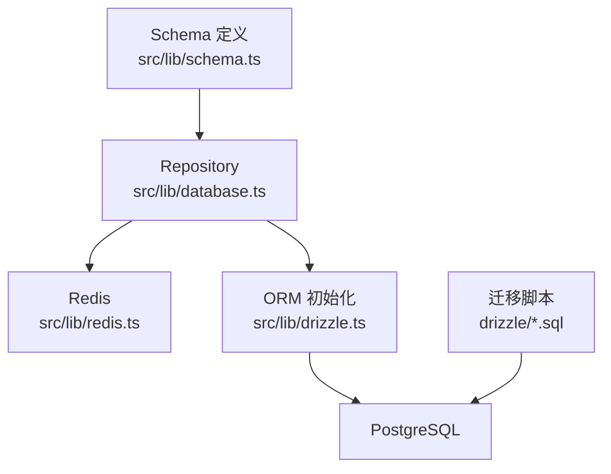
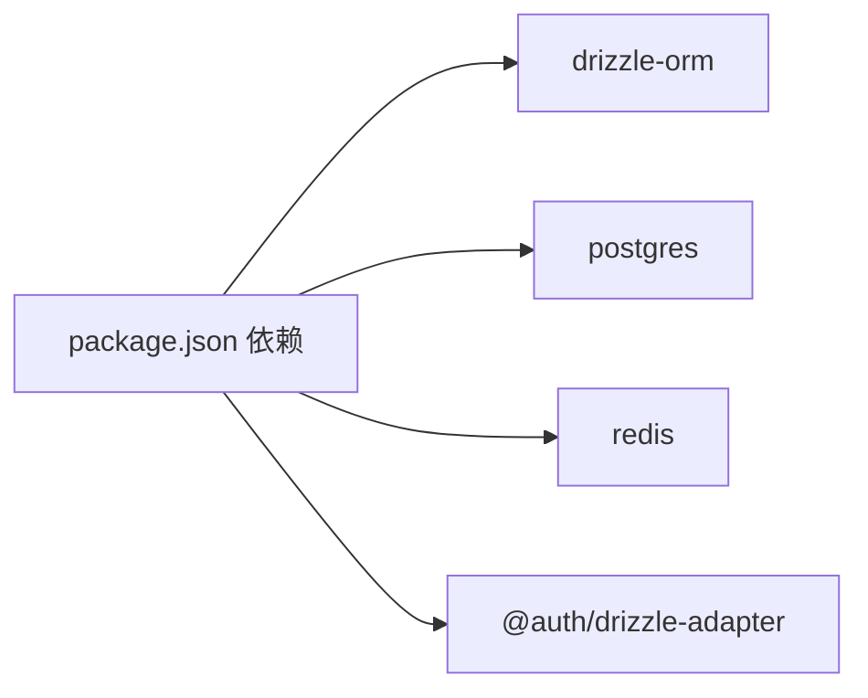
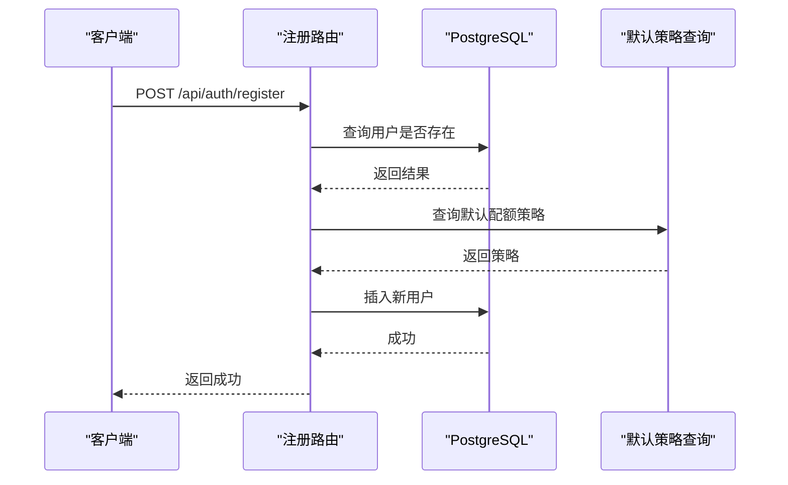

# 数据架构设计

<cite>
**本文引用的文件**
- [drizzle.config.ts](file://drizzle.config.ts)
- [src/lib/drizzle.ts](file://src/lib/drizzle.ts)
- [src/lib/schema.ts](file://src/lib/schema.ts)
- [src/lib/database.ts](file://src/lib/database.ts)
- [src/lib/redis.ts](file://src/lib/redis.ts)
- [drizzle/0000_complete_zeigeist.sql](file://drizzle/0000_complete_zeigeist.sql)
- [drizzle/0009_add_daily_request_limit.sql](file://drizzle/0009_add_daily_request_limit.sql)
- [drizzle/0009_add_nextauth_tables.sql](file://drizzle/0009_add_nextauth_tables.sql)
- [src/server/api/root.ts](file://src/server/api/root.ts)
- [src/server/api/trpc.ts](file://src/server/api/trpc.ts)
- [src/app/api/auth/register/route.ts](file://src/app/api/auth/register/route.ts)
- [package.json](file://package.json)
</cite>

## 目录
1. [引言](#引言)
2. [项目结构](#项目结构)
3. [核心组件](#核心组件)
4. [架构总览](#架构总览)
5. [详细组件分析](#详细组件分析)
6. [依赖分析](#依赖分析)
7. [性能考虑](#性能考虑)
8. [故障排查指南](#故障排查指南)
9. [结论](#结论)
10. [附录](#附录)

## 引言
本文件面向 AIGate 系统的数据架构设计，围绕数据库设计模式、Drizzle ORM 使用策略、数据访问层（Repository 模式与数据映射）、数据迁移与版本控制、缓存架构（Redis）以及数据流与存储架构进行系统化说明，并提供流程图与类图帮助理解。目标是在保障数据完整性与一致性的前提下，实现高可维护性与高性能。

## 项目结构
AIGate 的数据相关代码主要分布在以下位置：
- 数据库配置与迁移：drizzle 目录下的迁移脚本与快照
- ORM 初始化与 Schema 定义：src/lib 下的 drizzle.ts 与 schema.ts
- 数据访问层：src/lib/database.ts（封装各实体的 CRUD 与聚合查询）
- 缓存客户端：src/lib/redis.ts
- API 路由与 tRPC：src/server/api/* 与 src/app/api/*



图表来源
- [src/server/api/root.ts](file://src/server/api/root.ts#L1-L23)
- [src/server/api/trpc.ts](file://src/server/api/trpc.ts#L1-L142)
- [src/lib/database.ts](file://src/lib/database.ts#L1-L524)
- [src/lib/schema.ts](file://src/lib/schema.ts#L1-L159)
- [src/lib/drizzle.ts](file://src/lib/drizzle.ts#L1-L12)
- [drizzle/0000_complete_zeigeist.sql](file://drizzle/0000_complete_zeigeist.sql#L1-L50)
- [src/lib/redis.ts](file://src/lib/redis.ts#L1-L49)

章节来源
- [drizzle.config.ts](file://drizzle.config.ts#L1-L11)
- [src/lib/drizzle.ts](file://src/lib/drizzle.ts#L1-L12)
- [src/lib/schema.ts](file://src/lib/schema.ts#L1-L159)
- [src/lib/database.ts](file://src/lib/database.ts#L1-L524)
- [src/lib/redis.ts](file://src/lib/redis.ts#L1-L49)
- [drizzle/0000_complete_zeigeist.sql](file://drizzle/0000_complete_zeigeist.sql#L1-L50)
- [drizzle/0009_add_daily_request_limit.sql](file://drizzle/0009_add_daily_request_limit.sql#L1-L9)
- [drizzle/0009_add_nextauth_tables.sql](file://drizzle/0009_add_nextauth_tables.sql#L1-L33)
- [src/server/api/root.ts](file://src/server/api/root.ts#L1-L23)
- [src/server/api/trpc.ts](file://src/server/api/trpc.ts#L1-L142)
- [src/app/api/auth/register/route.ts](file://src/app/api/auth/register/route.ts#L1-L46)
- [package.json](file://package.json#L1-L75)

## 核心组件
- Drizzle ORM 初始化与连接：负责建立 PostgreSQL 连接并注入 schema，统一查询入口。
- Schema 定义：以强类型方式声明表结构、枚举、主外键关系与派生类型。
- 数据访问层（Repository 模式）：对每个实体提供标准 CRUD 与聚合查询方法，集中处理错误与时间戳更新。
- 缓存层（Redis）：提供用户配额、请求计数、策略等热点数据的高速读取与 TTL 控制。
- 迁移与版本控制：基于 drizzle-kit 的迁移脚本与快照，支持增量演进与回滚。

章节来源
- [src/lib/drizzle.ts](file://src/lib/drizzle.ts#L1-L12)
- [src/lib/schema.ts](file://src/lib/schema.ts#L1-L159)
- [src/lib/database.ts](file://src/lib/database.ts#L1-L524)
- [src/lib/redis.ts](file://src/lib/redis.ts#L1-L49)
- [drizzle.config.ts](file://drizzle.config.ts#L1-L11)

## 架构总览
AIGate 的数据层采用“Schema 驱动 + Repository 封装 + Redis 缓存”的三层架构：
- Schema 层：以枚举与表结构定义业务域模型，确保类型安全与约束表达。
- Repository 层：封装数据库访问逻辑，提供事务友好、错误兜底与聚合统计能力。
- 缓存层：针对高频读取与实时限流场景，提供低延迟访问与一致性策略。

```mermaid
classDiagram
class QuotaPolicies {
+id
+name
+description
+limitType
+dailyTokenLimit
+monthlyTokenLimit
+dailyRequestLimit
+rpmLimit
+createdAt
+updatedAt
}
class ApiKeys {
+id
+name
+provider
+key
+baseUrl
+status
+createdAt
+updatedAt
}
class UsageRecords {
+id
+userId
+model
+provider
+promptTokens
+completionTokens
+totalTokens
+cost
+region
+clientIp
+timestamp
}
class Users {
+id
+name
+email
+password
+role
+status
+quotaPolicyId
+emailVerified
+image
+createdAt
+updatedAt
}
class WhitelistRules {
+id
+policyName
+description
+priority
+status
+validationPattern
+validationEnabled
+createdAt
+updatedAt
}
class Accounts {
+id
+userId
+type
+provider
+providerAccountId
+refresh_token
+access_token
+expires_at
+token_type
+scope
+id_token
+session_state
}
class Sessions {
+id
+sessionToken
+userId
+expires
}
class VerificationTokens {
+identifier
+token
+expires
}
Users ||--o{ UsageRecords : "拥有"
Users ||--o{ Accounts : "拥有"
Users ||--|| QuotaPolicies : "关联"
WhitelistRules ||--|| QuotaPolicies : "引用策略名"
```

图表来源
- [src/lib/schema.ts](file://src/lib/schema.ts#L28-L159)

## 详细组件分析

### 数据库设计模式与实体关系模型
- 表与枚举
  - 配额策略表：包含按日/月令牌限额、每分钟请求数限制、限制类型（令牌或请求数）等字段，并通过检查约束限定合法值。
  - API 密钥表：记录提供商、密钥、状态与基础 URL，便于多供应商切换。
  - 用量记录表：记录每次调用的令牌消耗、成本、区域与客户端 IP，支持按时间聚合统计。
  - 用户表：包含角色、状态、配额策略外键、认证扩展字段（NextAuth 支持）。
  - 白名单规则表：支持优先级、状态、可选的正则校验模式，用于动态匹配用户到策略。
  - NextAuth 相关表：accounts、sessions、verification_tokens，支持会话与验证。
- 主外键与约束
  - 用户与用量记录：一对多，删除用户时级联清理账户。
  - 用户与配额策略：多对一，外键约束保证策略存在性。
  - 配额策略与白名单规则：通过策略名与策略表关联，形成策略选择链路。
- 数据完整性
  - 唯一约束：用户邮箱唯一；会话 token 唯一；验证令牌复合唯一。
  - 默认值与非空：大量字段设置默认值与非空约束，减少空值风险。
  - 检查约束：限制配额策略的限制类型仅允许特定枚举值。

章节来源
- [src/lib/schema.ts](file://src/lib/schema.ts#L12-L159)
- [drizzle/0000_complete_zeigeist.sql](file://drizzle/0000_complete_zeigeist.sql#L1-L50)
- [drizzle/0009_add_daily_request_limit.sql](file://drizzle/0009_add_daily_request_limit.sql#L1-L9)
- [drizzle/0009_add_nextauth_tables.sql](file://drizzle/0009_add_nextauth_tables.sql#L1-L33)

### Drizzle ORM 使用策略与优势
- 使用策略
  - 单一连接池：禁用预提取以适配事务模式，避免不兼容问题。
  - Schema 注入：在初始化时注入 schema，使查询具备类型推断与自动补全。
  - 查询风格：以函数式链式 API 组合 where、order、聚合等，提升可读性与可维护性。
- 优势
  - 类型安全：编译期检查，降低运行时错误。
  - 可测试性：易于替换为内存数据库或模拟。
  - 迁移友好：配合 drizzle-kit 的迁移工具链，支持增量演进。

章节来源
- [src/lib/drizzle.ts](file://src/lib/drizzle.ts#L1-L12)
- [drizzle.config.ts](file://drizzle.config.ts#L1-L11)

### 数据访问层设计（Repository 模式与数据映射）
- 设计原则
  - 每个实体一个命名空间（如 apiKeyDb、quotaPolicyDb、usageRecordDb、whitelistRuleDb），统一提供 CRUD 与聚合查询。
  - 自动时间戳更新：更新操作统一附加 updatedAt。
  - 错误兜底：所有数据库操作包裹 try/catch 并返回安全默认值，避免进程崩溃。
  - 聚合统计：提供用量与白名单规则的统计接口，支持并发查询。
- 典型流程（白名单规则匹配）


图表来源
- [src/lib/database.ts](file://src/lib/database.ts#L400-L428)

章节来源
- [src/lib/database.ts](file://src/lib/database.ts#L1-L524)

### 数据迁移管理机制与版本控制策略
- 工具链
  - drizzle-kit 提供 generate、push、migrate 三类命令，分别用于生成迁移、直接推送与执行迁移。
- 快照与脚本
  - 每次变更生成快照文件，记录当前数据库结构；迁移脚本按顺序执行，确保环境一致性。
  - 新增字段与检查约束通过增量 SQL 脚本完成，保持向后兼容。
- 版本控制
  - 迁移脚本与快照纳入版本库，遵循“先本地验证，再合并上线”的流程。
  - 回滚策略：保留历史快照，必要时回退到上一快照并重新生成迁移。

章节来源
- [drizzle.config.ts](file://drizzle.config.ts#L1-L11)
- [drizzle/0000_complete_zeigeist.sql](file://drizzle/0000_complete_zeigeist.sql#L1-L50)
- [drizzle/0009_add_daily_request_limit.sql](file://drizzle/0009_add_daily_request_limit.sql#L1-L9)
- [drizzle/0009_add_nextauth_tables.sql](file://drizzle/0009_add_nextauth_tables.sql#L1-L33)
- [package.json](file://package.json#L13-L16)

### 缓存架构设计（Redis 策略与一致性）
- 缓存键空间
  - 用户每日配额使用量、每日请求次数、每分钟请求次数（RPM）、用户配额策略、API Key 配置、请求日志等。
- TTL 与过期
  - 按日/按分钟维度设置 TTL，避免长期占用内存。
- 一致性策略
  - 写路径：数据库写入后，同步更新或删除对应 Redis 键，确保读取最新。
  - 读路径：优先命中缓存，未命中再回源数据库并回填缓存。
- 容错
  - Redis 客户端异常日志记录，不影响主流程；可降级为直连数据库。

章节来源
- [src/lib/redis.ts](file://src/lib/redis.ts#L1-L49)

### 数据流图与存储架构图
- 数据流图（tRPC 到数据库与缓存）


图表来源
- [src/server/api/root.ts](file://src/server/api/root.ts#L1-L23)
- [src/server/api/trpc.ts](file://src/server/api/trpc.ts#L117-L141)
- [src/lib/database.ts](file://src/lib/database.ts#L1-L524)
- [src/lib/redis.ts](file://src/lib/redis.ts#L1-L49)

- 存储架构图（Schema、Repository、缓存与迁移）


图表来源
- [src/lib/schema.ts](file://src/lib/schema.ts#L1-L159)
- [src/lib/database.ts](file://src/lib/database.ts#L1-L524)
- [src/lib/redis.ts](file://src/lib/redis.ts#L1-L49)
- [src/lib/drizzle.ts](file://src/lib/drizzle.ts#L1-L12)
- [drizzle/0000_complete_zeigeist.sql](file://drizzle/0000_complete_zeigeist.sql#L1-L50)

## 依赖分析
- 外部依赖
  - drizzle-orm、postgres：ORM 与驱动
  - redis：缓存客户端
  - next-auth 与 @auth/drizzle-adapter：认证与会话持久化
- 内部耦合
  - Repository 依赖 Drizzle 初始化与 Schema
  - tRPC 路由依赖 Repository 与上下文
  - 注册接口直接使用 Drizzle 进行插入与查询



图表来源
- [package.json](file://package.json#L18-L55)

章节来源
- [package.json](file://package.json#L1-L75)

## 性能考虑
- 查询优化
  - 合理使用索引：在高频过滤字段（如 email、session_token、标识符）上建立索引（由迁移脚本与约束隐含）。
  - 聚合查询并发化：Repository 中使用 Promise.all 并发统计，缩短响应时间。
- 缓存策略
  - 热点数据缓存：用户策略、API Key、每日/每分钟计数。
  - TTL 策略：按日/按分钟过期，避免无限增长。
- 连接与事务
  - 禁用预提取以适配事务模式，减少资源争用。
- 分页与排序
  - 对大数据集使用分页与稳定排序键，避免全表扫描。

## 故障排查指南
- 数据库错误
  - Repository 层已捕获异常并返回空集合或默认值，便于前端降级显示。
  - 建议开启数据库慢查询日志与连接池监控。
- Redis 错误
  - 客户端错误事件已记录，若 Redis 不可用，系统可回退至直连数据库。
  - 检查 REDIS_URL 环境变量与网络连通性。
- 迁移失败
  - 使用 drizzle-kit migrate 执行迁移，查看具体报错行号。
  - 若冲突，回滚到上一快照并重新生成迁移脚本。

章节来源
- [src/lib/database.ts](file://src/lib/database.ts#L20-L27)
- [src/lib/redis.ts](file://src/lib/redis.ts#L7-L9)

## 结论
AIGate 的数据架构以 Drizzle ORM 为核心，结合 Schema 驱动与 Repository 封装，实现了类型安全、可维护与可扩展的数据层。通过 Redis 缓存与严格的迁移管理，系统在保证数据一致性的同时提升了性能与可观测性。建议持续完善缓存命中率、索引策略与监控告警，以支撑业务增长。

## 附录
- API 注册流程（数据库写入）


图表来源
- [src/app/api/auth/register/route.ts](file://src/app/api/auth/register/route.ts#L1-L46)