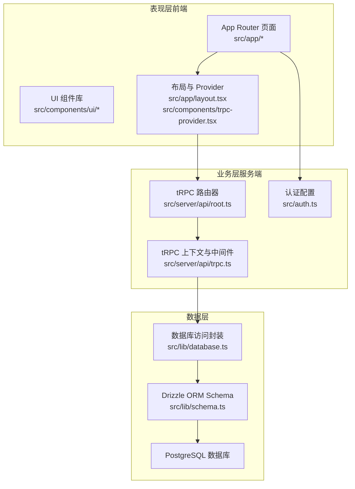
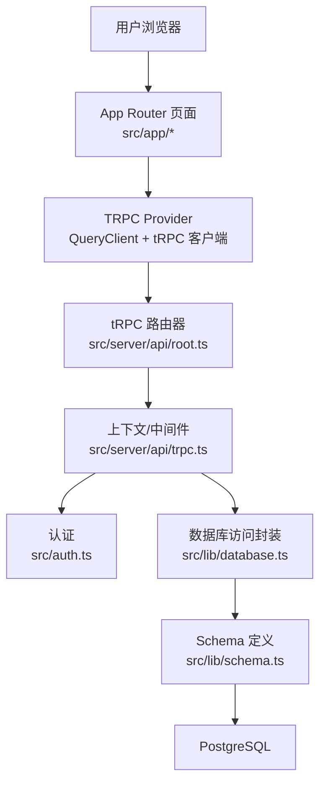
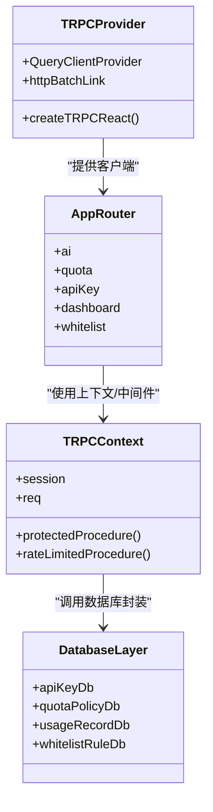
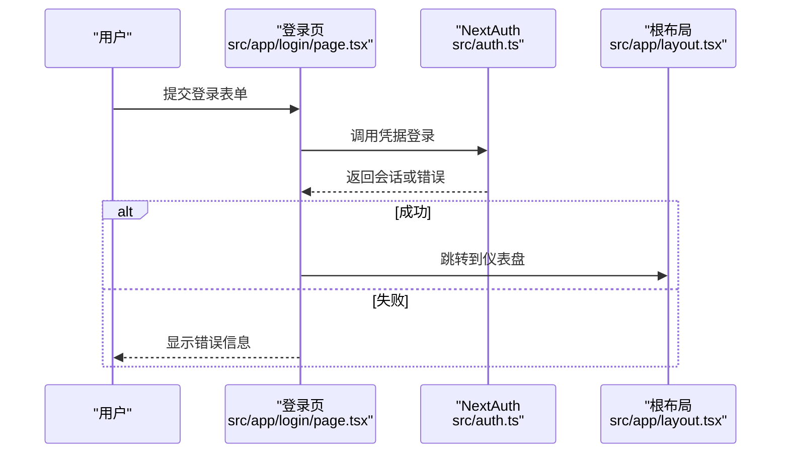
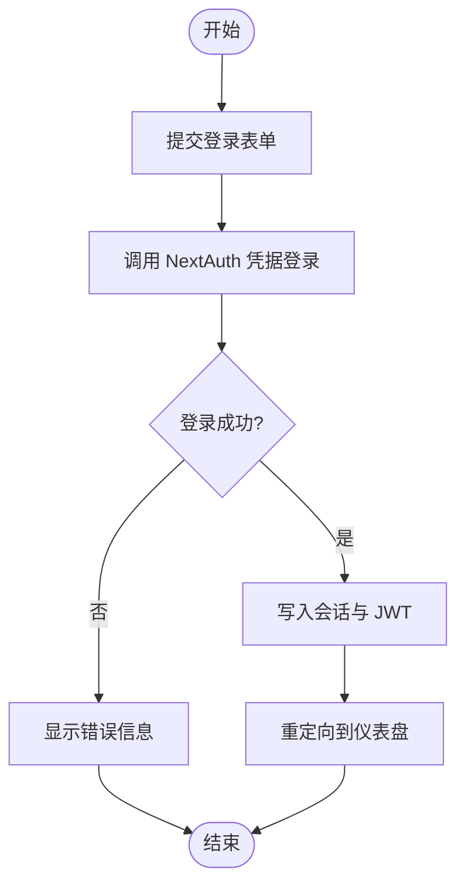
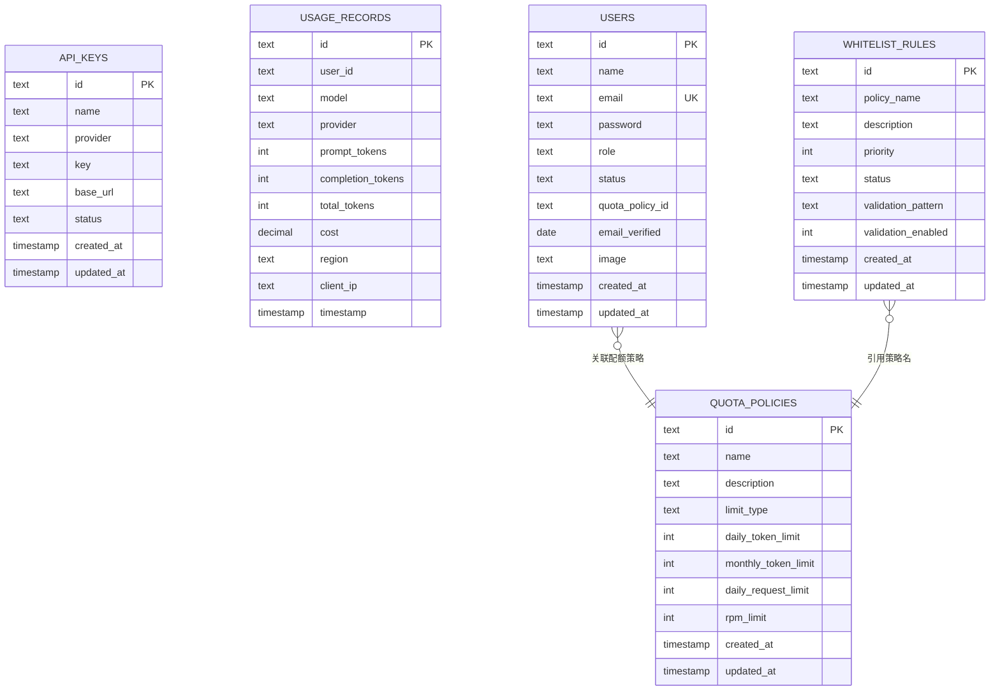
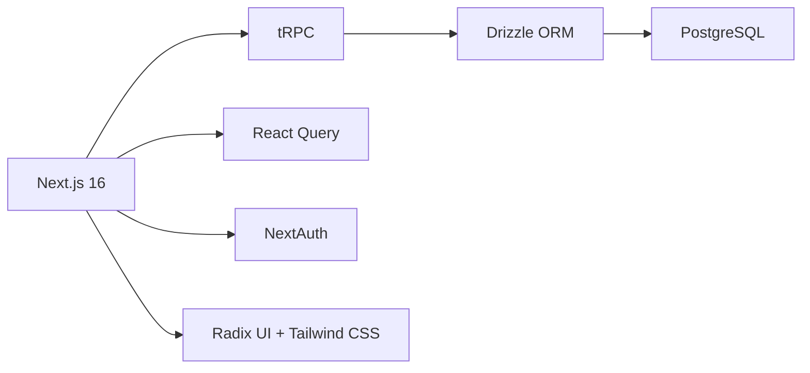

# 整体架构概览

<cite>
**本文档引用的文件**
- [package.json](file://package.json)
- [next.config.ts](file://next.config.ts)
- [src/app/layout.tsx](file://src/app/layout.tsx)
- [src/components/trpc-provider.tsx](file://src/components/trpc-provider.tsx)
- [src/server/api/root.ts](file://src/server/api/root.ts)
- [src/server/api/trpc.ts](file://src/server/api/trpc.ts)
- [src/lib/database.ts](file://src/lib/database.ts)
- [src/lib/schema.ts](file://src/lib/schema.ts)
- [src/auth.ts](file://src/auth.ts)
- [src/app/api/auth/register/route.ts](file://src/app/api/auth/register/route.ts)
- [src/app/page.tsx](file://src/app/page.tsx)
- [src/app/login/page.tsx](file://src/app/login/page.tsx)
- [src/app/register/page.tsx](file://src/app/register/page.tsx)
- [src/app/(dashboard)/layout.tsx](file://src/app/(dashboard)/layout.tsx)
</cite>

## 目录
1. [引言](#引言)
2. [项目结构](#项目结构)
3. [核心组件](#核心组件)
4. [架构总览](#架构总览)
5. [详细组件分析](#详细组件分析)
6. [依赖分析](#依赖分析)
7. [性能考虑](#性能考虑)
8. [故障排查指南](#故障排查指南)
9. [结论](#结论)

## 引言
本文件为 AIGate 系统的整体架构概览文档，面向技术与非技术读者，系统性阐述系统的高层设计、分层架构、前后端分离理念、App Router 与 Pages Router 的混合使用策略，以及主要组件间的交互关系、系统边界、外部依赖与集成点。文档同时提供架构图与组件关系图，并对架构决策的技术考量与权衡进行说明。

## 项目结构
AIGate 基于 Next.js 16，采用 App Router 为主、Pages Router 为辅的混合架构。前端以 App Router 的路由组织页面与布局，后端通过 tRPC 提供统一的服务端接口；数据访问层基于 Drizzle ORM 连接 PostgreSQL；认证采用 NextAuth；状态管理与查询缓存由 React Query 驱动；UI 组件采用 Radix UI 与 Tailwind CSS。

图表来源
- [src/app/layout.tsx](file://src/app/layout.tsx#L1-L30)
- [src/components/trpc-provider.tsx](file://src/components/trpc-provider.tsx#L1-L64)
- [src/server/api/root.ts](file://src/server/api/root.ts#L1-L23)
- [src/server/api/trpc.ts](file://src/server/api/trpc.ts#L1-L142)
- [src/lib/schema.ts](file://src/lib/schema.ts#L1-L159)
- [src/lib/database.ts](file://src/lib/database.ts#L1-L524)

章节来源
- [package.json](file://package.json#L1-L75)
- [next.config.ts](file://next.config.ts#L1-L9)
- [src/app/layout.tsx](file://src/app/layout.tsx#L1-L30)

## 核心组件
- App Router 页面与布局：负责用户界面渲染与交互，使用根布局注入全局 Provider。
- tRPC 服务端：集中定义路由、上下文、认证中间件与公共/受保护过程。
- 数据库访问层：基于 Drizzle ORM 封装 CRUD 与聚合统计，提供 API Key、配额策略、用量记录、白名单规则等能力。
- 认证模块：基于 NextAuth 实现凭据登录与会话管理。
- UI 组件库：基于 Radix UI 的可组合 UI 组件，配合 Tailwind CSS 样式。
- 前端状态与查询：通过 TRPC Provider 与 React Query 实现查询缓存与状态同步。

章节来源
- [src/app/layout.tsx](file://src/app/layout.tsx#L1-L30)
- [src/components/trpc-provider.tsx](file://src/components/trpc-provider.tsx#L1-L64)
- [src/server/api/root.ts](file://src/server/api/root.ts#L1-L23)
- [src/server/api/trpc.ts](file://src/server/api/trpc.ts#L1-L142)
- [src/lib/database.ts](file://src/lib/database.ts#L1-L524)
- [src/lib/schema.ts](file://src/lib/schema.ts#L1-L159)
- [src/auth.ts](file://src/auth.ts#L1-L52)

## 架构总览
AIGate 采用“表现层-业务层-数据层”的三层架构，结合 App Router 的页面级渲染与 tRPC 的强类型远程过程调用，实现前后端分离与职责清晰的系统设计。App Router 负责页面与布局，Pages Router 在特定场景（如注册 API）中提供直连后端的处理；业务层通过 tRPC 路由器聚合各领域功能；数据层通过 Drizzle ORM 抽象数据库操作。

图表来源
- [src/app/layout.tsx](file://src/app/layout.tsx#L1-L30)
- [src/components/trpc-provider.tsx](file://src/components/trpc-provider.tsx#L1-L64)
- [src/server/api/root.ts](file://src/server/api/root.ts#L1-L23)
- [src/server/api/trpc.ts](file://src/server/api/trpc.ts#L1-L142)
- [src/lib/database.ts](file://src/lib/database.ts#L1-L524)
- [src/lib/schema.ts](file://src/lib/schema.ts#L1-L159)
- [src/auth.ts](file://src/auth.ts#L1-L52)

## 详细组件分析

### 分层架构与职责
- 表现层（Presentation Layer）
  - App Router 页面与布局：负责页面渲染、用户交互与路由跳转。
  - UI 组件：提供可复用的按钮、输入框、表格、对话框等。
  - Provider：在根布局注入 TRPC Provider，为全站提供统一的 tRPC 客户端与查询缓存。
- 业务层（Business Layer）
  - tRPC 路由器：集中暴露 ai、quota、apiKey、dashboard、whitelist 等领域接口。
  - 上下文与中间件：提供会话读取、错误格式化、受保护过程等通用逻辑。
  - 认证：通过 NextAuth 提供凭据登录与会话回调。
- 数据层（Data Layer）
  - Schema：定义配额策略、API Key、用量记录、用户、白名单规则等表结构与枚举。
  - 数据库访问封装：提供 CRUD 与统计聚合方法，屏蔽底层 SQL 细节。

图表来源
- [src/components/trpc-provider.tsx](file://src/components/trpc-provider.tsx#L1-L64)
- [src/server/api/root.ts](file://src/server/api/root.ts#L1-L23)
- [src/server/api/trpc.ts](file://src/server/api/trpc.ts#L1-L142)
- [src/lib/database.ts](file://src/lib/database.ts#L1-L524)

章节来源
- [src/app/layout.tsx](file://src/app/layout.tsx#L1-L30)
- [src/components/trpc-provider.tsx](file://src/components/trpc-provider.tsx#L1-L64)
- [src/server/api/root.ts](file://src/server/api/root.ts#L1-L23)
- [src/server/api/trpc.ts](file://src/server/api/trpc.ts#L1-L142)
- [src/lib/database.ts](file://src/lib/database.ts#L1-L524)

### App Router 与 Pages Router 的混合使用策略
- App Router 主体：管理后台仪表盘、登录、注册等页面，利用布局与路由组织页面结构。
- Pages Router 辅助：在特定场景（如注册 API）使用 Pages Router 的 API 路由直接处理请求，减少 tRPC 调用开销。
- 优势：
  - App Router 提供更好的页面级渲染与资源加载体验，适合管理后台。
  - Pages Router 可快速实现简单 API（如注册），降低样板代码。
  - 两者共存避免了强制迁移带来的风险，平滑演进。

图表来源
- [src/app/login/page.tsx](file://src/app/login/page.tsx#L1-L100)
- [src/auth.ts](file://src/auth.ts#L1-L52)
- [src/app/layout.tsx](file://src/app/layout.tsx#L1-L30)

章节来源
- [src/app/login/page.tsx](file://src/app/login/page.tsx#L1-L100)
- [src/app/register/page.tsx](file://src/app/register/page.tsx#L1-L128)
- [src/app/api/auth/register/route.ts](file://src/app/api/auth/register/route.ts#L1-L46)
- [src/auth.ts](file://src/auth.ts#L1-L52)

### 前后端分离与 SSR/CSR 平衡
- 前后端分离：前端通过 TRPC Provider 与 tRPC 客户端通信，后端通过 tRPC 路由器暴露接口，数据流清晰。
- 渲染策略：
  - App Router 页面默认使用客户端渲染，提升交互体验。
  - 根布局与 Provider 在服务端注入，确保首屏可用与会话初始化。
  - tRPC 查询缓存由 React Query 管理，减少重复请求。
- 权衡：在需要 SEO 或首屏性能的页面可结合静态生成或服务端渲染策略，但当前以交互型管理后台为主。

章节来源
- [src/app/layout.tsx](file://src/app/layout.tsx#L1-L30)
- [src/components/trpc-provider.tsx](file://src/components/trpc-provider.tsx#L1-L64)
- [src/server/api/trpc.ts](file://src/server/api/trpc.ts#L1-L142)

### 认证与会话流程
- 凭据登录：前端提交邮箱与密码，NextAuth 在后端完成验证并写入会话。
- 会话回调：将用户角色与状态写入 JWT，随后在请求上下文中读取。
- 受保护过程：tRPC 中间件校验会话有效性，确保仅授权用户可访问敏感接口。

图表来源
- [src/app/login/page.tsx](file://src/app/login/page.tsx#L1-L100)
- [src/auth.ts](file://src/auth.ts#L1-L52)

章节来源
- [src/auth.ts](file://src/auth.ts#L1-L52)
- [src/server/api/trpc.ts](file://src/server/api/trpc.ts#L1-L142)

### 数据模型与关系
系统围绕“用户、配额策略、API Key、用量记录、白名单规则”构建，采用枚举与关系约束保证数据一致性。

图表来源
- [src/lib/schema.ts](file://src/lib/schema.ts#L1-L159)

章节来源
- [src/lib/schema.ts](file://src/lib/schema.ts#L1-L159)
- [src/lib/database.ts](file://src/lib/database.ts#L1-L524)

### 系统边界与外部依赖
- 系统边界
  - 内部：App Router 页面、tRPC 服务端、Drizzle ORM、认证模块、UI 组件库。
  - 外部：PostgreSQL 数据库、NextAuth 提供商、第三方 AI 服务提供商（OpenAI、Anthropic、Google 等）。
- 外部依赖集成点
  - tRPC 服务端通过 Next.js 适配器接入，统一错误格式化与会话上下文。
  - Drizzle ORM 通过 PostgreSQL 适配器连接数据库，提供类型安全的查询。
  - NextAuth 提供凭据登录与会话回调，与 tRPC 上下文集成。
  - 前端通过 TRPC Provider 与 tRPC 客户端通信，使用 React Query 缓存。

章节来源
- [src/server/api/root.ts](file://src/server/api/root.ts#L1-L23)
- [src/server/api/trpc.ts](file://src/server/api/trpc.ts#L1-L142)
- [src/lib/database.ts](file://src/lib/database.ts#L1-L524)
- [src/lib/schema.ts](file://src/lib/schema.ts#L1-L159)
- [src/auth.ts](file://src/auth.ts#L1-L52)

## 依赖分析
- 运行时依赖
  - Next.js 16：App Router 与 Pages Router 共存。
  - tRPC：提供类型安全的远程过程调用。
  - React Query：查询缓存与状态同步。
  - NextAuth：会话与认证。
  - Drizzle ORM：PostgreSQL 类型安全访问。
  - UI 组件：Radix UI + Tailwind CSS。
- 开发依赖
  - TypeScript、ESLint、Prettier、Drizzle Kit 等工具链。

图表来源
- [package.json](file://package.json#L1-L75)

章节来源
- [package.json](file://package.json#L1-L75)

## 性能考虑
- 查询缓存：React Query 默认 5 分钟新鲜度，减少重复请求与服务器压力。
- 批量链接：tRPC 使用 httpBatchLink 合并请求，降低网络往返。
- 会话上下文：在 tRPC 上下文中一次性读取会话，避免多次鉴权开销。
- 数据库并发：统计查询使用 Promise.all 并行执行，缩短响应时间。
- 构建优化：Next.js standalone 输出与 React Compiler 启用，提升运行时性能。

章节来源
- [src/components/trpc-provider.tsx](file://src/components/trpc-provider.tsx#L1-L64)
- [src/server/api/trpc.ts](file://src/server/api/trpc.ts#L1-L142)
- [src/lib/database.ts](file://src/lib/database.ts#L1-L524)
- [next.config.ts](file://next.config.ts#L1-L9)

## 故障排查指南
- 登录失败
  - 检查凭据是否正确，确认 NextAuth 回调是否写入 JWT 与会话。
  - 查看 tRPC 上下文中间件是否抛出未授权错误。
- 注册异常
  - 确认默认配额策略是否存在，避免插入用户时报错。
  - 检查密码加密与数据库约束。
- tRPC 错误
  - 查看错误格式化输出，定位后端验证错误（Zod）或运行时异常。
- 数据库访问
  - 检查 Drizzle ORM 查询是否正确，关注枚举值与外键约束。

章节来源
- [src/app/login/page.tsx](file://src/app/login/page.tsx#L1-L100)
- [src/app/api/auth/register/route.ts](file://src/app/api/auth/register/route.ts#L1-L46)
- [src/server/api/trpc.ts](file://src/server/api/trpc.ts#L1-L142)
- [src/lib/database.ts](file://src/lib/database.ts#L1-L524)

## 结论
AIGate 采用清晰的三层架构与 App Router 为主的前端组织方式，结合 tRPC 的强类型远程过程调用与 Drizzle ORM 的数据库抽象，实现了前后端分离与高内聚低耦合的系统设计。通过 Pages Router 在特定场景下的辅助使用，系统在可维护性与开发效率之间取得良好平衡。认证与会话通过 NextAuth 与 tRPC 上下文无缝集成，保障了安全性与一致性。建议后续根据业务增长引入更细粒度的中间件与监控埋点，持续优化性能与可观测性。