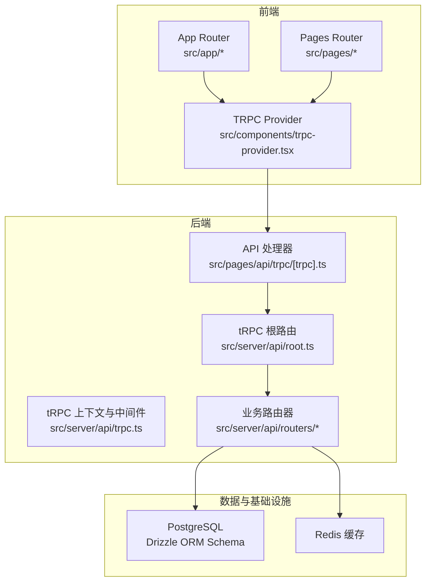
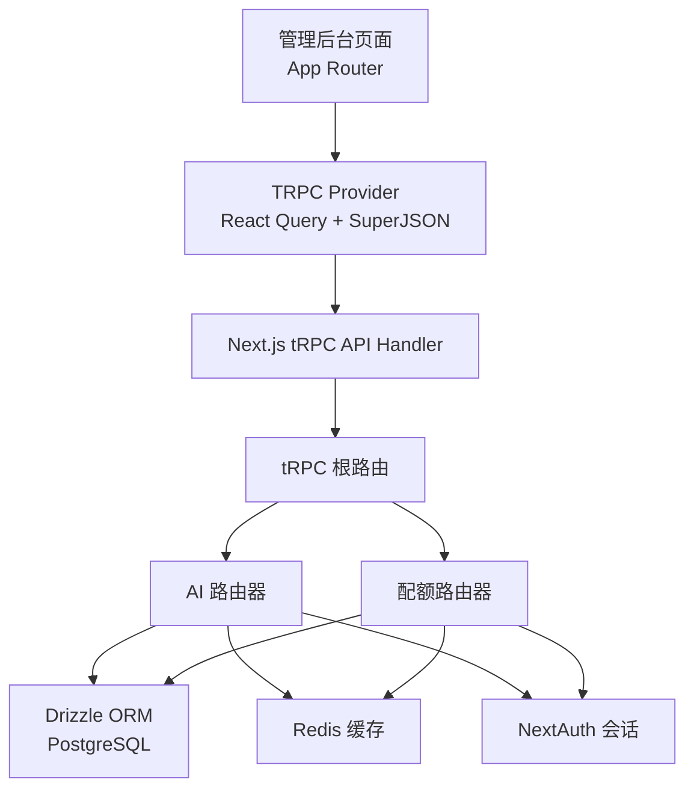
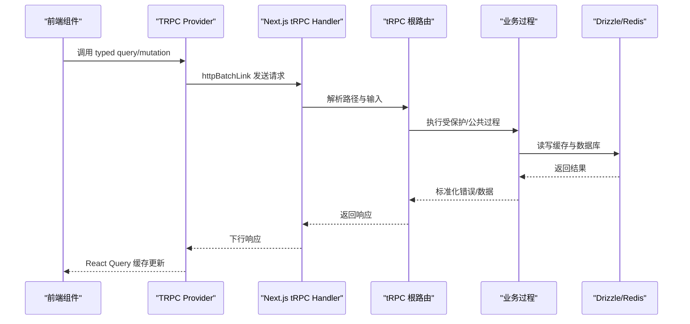
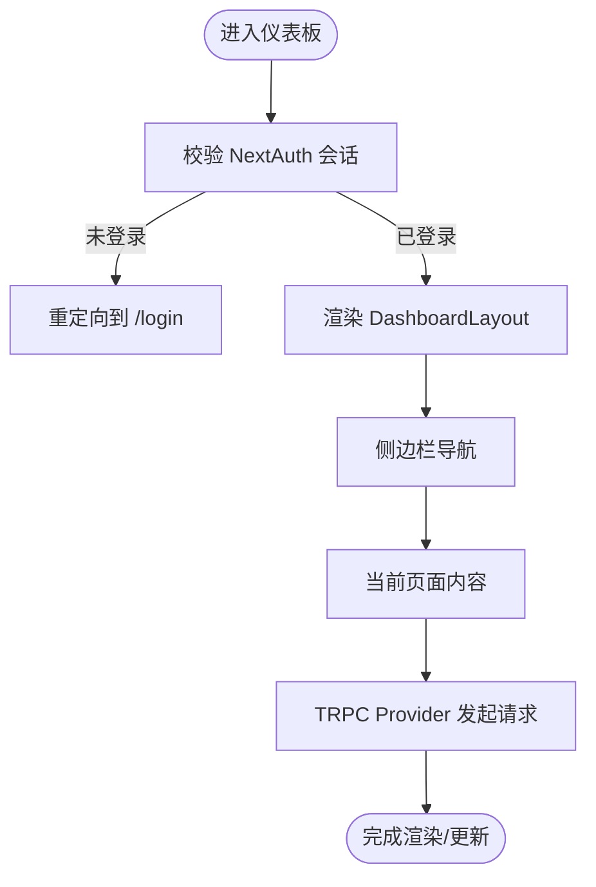
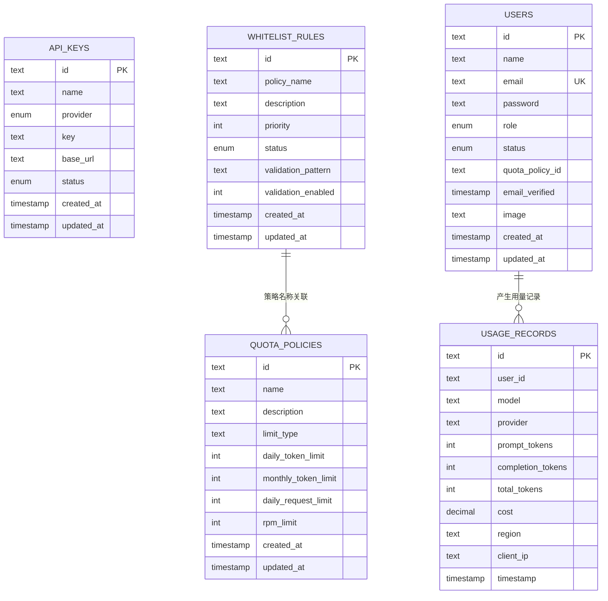
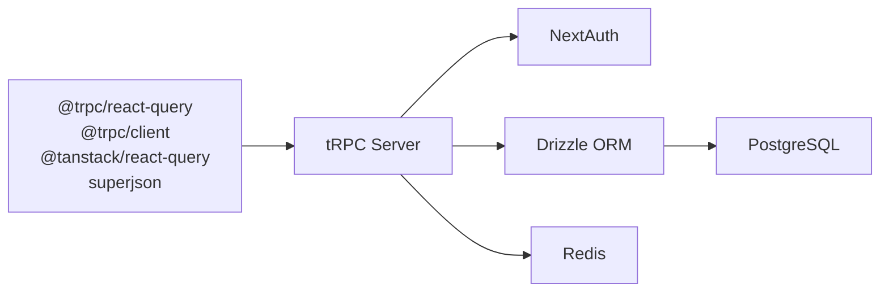

# 系统架构设计

<cite>
**本文引用的文件**
- [package.json](file://package.json)
- [next.config.ts](file://next.config.ts)
- [src/app/layout.tsx](file://src/app/layout.tsx)
- [src/components/trpc-provider.tsx](file://src/components/trpc-provider.tsx)
- [src/server/api/root.ts](file://src/server/api/root.ts)
- [src/server/api/trpc.ts](file://src/server/api/trpc.ts)
- [src/pages/api/trpc/[trpc].ts](file://src/pages/api/trpc/[trpc].ts)
- [src/lib/schema.ts](file://src/lib/schema.ts)
- [src/lib/database.ts](file://src/lib/database.ts)
- [src/lib/redis.ts](file://src/lib/redis.ts)
- [src/server/api/routers/ai.ts](file://src/server/api/routers/ai.ts)
- [src/server/api/routers/quota.ts](file://src/server/api/routers/quota.ts)
- [src/app/(dashboard)/layout.tsx](file://src/app/(dashboard)/layout.tsx)
- [src/auth.ts](file://src/auth.ts)
- [drizzle.config.ts](file://drizzle.config.ts)
- [Dockerfile](file://Dockerfile)
- [docker-compose.yml](file://docker-compose.yml)
</cite>

## 目录
1. [引言](#引言)
2. [项目结构](#项目结构)
3. [核心组件](#核心组件)
4. [架构总览](#架构总览)
5. [详细组件分析](#详细组件分析)
6. [依赖关系分析](#依赖关系分析)
7. [性能考量](#性能考量)
8. [故障排查指南](#故障排查指南)
9. [结论](#结论)
10. [附录](#附录)

## 引言
本文件为 AIGate 系统的架构设计文档，聚焦于整体分层架构、微服务化 API 结构、前后端分离模式，以及 Next.js App Router 与 Pages Router 的混合使用策略。重点阐述 tRPC 架构的优势与实现原理，解释数据流设计、组件交互模式与系统边界划分。同时给出技术选型理由（为何选择 tRPC、Next.js 等），并提供系统上下文图与组件分解图，讨论可扩展性、性能优化与安全架构，并覆盖缓存策略、错误处理与监控机制。

## 项目结构
AIGate 采用 Next.js 16 的 App Router 为主、Pages Router 为辅的混合架构。App Router 负责管理后台界面与全局布局，Pages Router 用于传统页面与部分 API 路由。tRPC 作为统一的后端 API 层，提供类型安全的 RPC 接口，连接前端 React Query 与后端服务器。

图表来源
- [src/app/layout.tsx](file://src/app/layout.tsx#L1-L30)
- [src/components/trpc-provider.tsx](file://src/components/trpc-provider.tsx#L1-L64)
- [src/pages/api/trpc/[trpc].ts](file://src/pages/api/trpc/[trpc].ts#L1-L16)
- [src/server/api/root.ts](file://src/server/api/root.ts#L1-L23)
- [src/server/api/trpc.ts](file://src/server/api/trpc.ts#L1-L142)
- [src/server/api/routers/ai.ts](file://src/server/api/routers/ai.ts#L1-L223)
- [src/server/api/routers/quota.ts](file://src/server/api/routers/quota.ts#L1-L301)
- [src/lib/schema.ts](file://src/lib/schema.ts#L1-L159)
- [src/lib/redis.ts](file://src/lib/redis.ts#L1-L49)

章节来源
- [package.json](file://package.json#L1-L75)
- [next.config.ts](file://next.config.ts#L1-L9)
- [src/app/layout.tsx](file://src/app/layout.tsx#L1-L30)
- [src/components/trpc-provider.tsx](file://src/components/trpc-provider.tsx#L1-L64)
- [src/pages/api/trpc/[trpc].ts](file://src/pages/api/trpc/[trpc].ts#L1-L16)
- [src/server/api/root.ts](file://src/server/api/root.ts#L1-L23)
- [src/server/api/trpc.ts](file://src/server/api/trpc.ts#L1-L142)
- [src/lib/schema.ts](file://src/lib/schema.ts#L1-L159)
- [src/lib/redis.ts](file://src/lib/redis.ts#L1-L49)

## 核心组件
- tRPC 核心
  - 根路由与路由器聚合：统一暴露 ai、quota、apiKey、dashboard、whitelist 等子路由。
  - 上下文与中间件：基于 NextAuth 的会话注入，提供受保护过程与公共过程。
  - API 入口：Next.js API Handler 将 tRPC 路由与上下文桥接至 HTTP。
- 前端集成
  - TRPC Provider：封装 React Query、SuperJSON 变换器与 httpBatchLink，提供全局状态缓存与日志链路。
  - App Router 布局：在根布局中挂载 TRPC Provider，确保全站类型安全调用。
- 数据与缓存
  - Drizzle ORM + PostgreSQL：定义配额策略、API Key、用量记录、白名单规则等表结构与关系。
  - Redis：用户配额策略、每日用量、RPM 等键空间，支撑高并发配额检查与限流。
- 认证与授权
  - NextAuth：基于凭据提供者，回调注入 JWT 与 Session，配合 tRPC 受保护过程进行鉴权。
- 部署与编排
  - Dockerfile 与 docker-compose：容器化部署，包含应用、PostgreSQL、Redis 与一次性迁移任务。

章节来源
- [src/server/api/root.ts](file://src/server/api/root.ts#L1-L23)
- [src/server/api/trpc.ts](file://src/server/api/trpc.ts#L1-L142)
- [src/pages/api/trpc/[trpc].ts](file://src/pages/api/trpc/[trpc].ts#L1-L16)
- [src/components/trpc-provider.tsx](file://src/components/trpc-provider.tsx#L1-L64)
- [src/app/layout.tsx](file://src/app/layout.tsx#L1-L30)
- [src/lib/schema.ts](file://src/lib/schema.ts#L1-L159)
- [src/lib/redis.ts](file://src/lib/redis.ts#L1-L49)
- [src/auth.ts](file://src/auth.ts#L1-L59)
- [Dockerfile](file://Dockerfile#L1-L52)
- [docker-compose.yml](file://docker-compose.yml#L1-L84)

## 架构总览
AIGate 采用“前端 App Router + tRPC 后端 + Drizzle ORM + Redis + PostgreSQL”的分层架构。前端通过 TRPC Provider 发起类型安全的 RPC 调用；后端通过 tRPC 路由器组织业务逻辑；数据持久化由 Drizzle ORM 统一管理；缓存由 Redis 提供高吞吐的配额与策略查询；认证与会话由 NextAuth 管理，贯穿 tRPC 上下文。

图表来源
- [src/app/layout.tsx](file://src/app/layout.tsx#L1-L30)
- [src/components/trpc-provider.tsx](file://src/components/trpc-provider.tsx#L1-L64)
- [src/pages/api/trpc/[trpc].ts](file://src/pages/api/trpc/[trpc].ts#L1-L16)
- [src/server/api/root.ts](file://src/server/api/root.ts#L1-L23)
- [src/server/api/routers/ai.ts](file://src/server/api/routers/ai.ts#L1-L223)
- [src/server/api/routers/quota.ts](file://src/server/api/routers/quota.ts#L1-L301)
- [src/lib/database.ts](file://src/lib/database.ts#L1-L524)
- [src/lib/redis.ts](file://src/lib/redis.ts#L1-L49)
- [src/auth.ts](file://src/auth.ts#L1-L59)

## 详细组件分析

### tRPC 架构与实现原理
- 类型安全与零样板代码
  - 前后端共享类型定义，通过 SuperJSON 实现复杂数据的序列化/反序列化，避免手写 DTO。
  - React Query 自动缓存与去重，批量请求合并（httpBatchLink）降低网络开销。
- 上下文与中间件
  - 通过 createTRPCContext 注入 NextAuth 会话，受保护过程在执行前校验会话有效性。
  - 可扩展中间件（如速率限制）在 createTRPCRouter 内部串联，形成清晰的横切关注点。
- API 路由组织
  - 根路由集中注册各业务子路由，职责清晰、易于扩展与测试。

图表来源
- [src/components/trpc-provider.tsx](file://src/components/trpc-provider.tsx#L1-L64)
- [src/pages/api/trpc/[trpc].ts](file://src/pages/api/trpc/[trpc].ts#L1-L16)
- [src/server/api/root.ts](file://src/server/api/root.ts#L1-L23)
- [src/server/api/trpc.ts](file://src/server/api/trpc.ts#L1-L142)

章节来源
- [src/components/trpc-provider.tsx](file://src/components/trpc-provider.tsx#L1-L64)
- [src/server/api/trpc.ts](file://src/server/api/trpc.ts#L1-L142)
- [src/pages/api/trpc/[trpc].ts](file://src/pages/api/trpc/[trpc].ts#L1-L16)
- [src/server/api/root.ts](file://src/server/api/root.ts#L1-L23)

### 数据流与组件交互
- 管理后台布局与导航
  - 仪表板布局在进入时校验会话，未登录跳转登录页；侧边栏提供模块导航。
- 页面与组件
  - App Router 负责管理后台页面与通用布局；UI 组件库提供基础控件；TRPC Provider 提供类型安全的数据访问。
- 认证流程
  - NextAuth 凭据登录，回调注入 JWT 与 Session；tRPC 受保护过程读取上下文中的会话信息。

图表来源
- [src/app/(dashboard)/layout.tsx](file://src/app/(dashboard)/layout.tsx#L1-L19)
- [src/auth.ts](file://src/auth.ts#L1-L59)
- [src/components/dashboard-layout.tsx](file://src/components/dashboard-layout.tsx#L1-L243)
- [src/components/trpc-provider.tsx](file://src/components/trpc-provider.tsx#L1-L64)

章节来源
- [src/app/(dashboard)/layout.tsx](file://src/app/(dashboard)/layout.tsx#L1-L19)
- [src/auth.ts](file://src/auth.ts#L1-L59)
- [src/components/dashboard-layout.tsx](file://src/components/dashboard-layout.tsx#L1-L243)

### 数据模型与持久化
- 表结构与关系
  - 配额策略、API Key、用量记录、白名单规则、用户与 NextAuth 相关表均通过 Drizzle ORM 定义。
  - 白名单规则与配额策略存在逻辑关联，便于按用户匹配策略。
- 数据库操作
  - 数据库访问层对 CRUD 操作进行封装，提供统计查询与策略匹配逻辑。
- 迁移与配置
  - drizzle.config.ts 指定 schema 与输出目录，支持迁移与推演。

图表来源
- [src/lib/schema.ts](file://src/lib/schema.ts#L1-L159)
- [src/lib/database.ts](file://src/lib/database.ts#L1-L524)

章节来源
- [src/lib/schema.ts](file://src/lib/schema.ts#L1-L159)
- [src/lib/database.ts](file://src/lib/database.ts#L1-L524)
- [drizzle.config.ts](file://drizzle.config.ts#L1-L11)

### 缓存策略与性能优化
- Redis 键空间
  - 用户每日配额、请求计数、RPM、用户策略缓存、API Key 配置缓存等，键命名规范便于扫描与清理。
- 配额检查与限流
  - 通过 Redis 原子操作实现高并发下的令牌桶/计数器模式，减少数据库压力。
- 前端缓存
  - React Query 默认 5 分钟新鲜度与重试策略，结合 httpBatchLink 批量请求，降低延迟与带宽占用。
- 数据库优化
  - 使用 Drizzle ORM 的批量查询与聚合函数，配合并发统计查询，缩短报表生成时间。

章节来源
- [src/lib/redis.ts](file://src/lib/redis.ts#L1-L49)
- [src/server/api/routers/quota.ts](file://src/server/api/routers/quota.ts#L1-L301)
- [src/components/trpc-provider.tsx](file://src/components/trpc-provider.tsx#L1-L64)

### 安全架构与错误处理
- 认证与授权
  - NextAuth 凭据登录，JWT 回调注入用户角色与状态；tRPC 受保护过程强制校验会话。
- 输入验证与错误格式化
  - 使用 Zod 对输入进行严格校验，tRPC 错误格式化统一返回结构，开发环境打印错误堆栈。
- 错误传播
  - 业务异常通过 TRPCError 抛出，前端自动捕获并提示，避免泄露内部细节。
- 日志与可观测性
  - 开发环境下启用 loggerLink，记录下行错误；生产环境可接入外部监控平台。

章节来源
- [src/auth.ts](file://src/auth.ts#L1-L59)
- [src/server/api/trpc.ts](file://src/server/api/trpc.ts#L1-L142)
- [src/components/trpc-provider.tsx](file://src/components/trpc-provider.tsx#L1-L64)

### 可扩展性与部署
- 微服务化 API 结构
  - 以路由器为边界，新增功能只需新增子路由与对应数据库/缓存操作，保持高内聚低耦合。
- 容器化与编排
  - Dockerfile 使用 standalone 输出，简化运行时；docker-compose 编排应用、数据库与缓存。
- 数据库演进
  - Drizzle 迁移脚本与配置，支持持续演进的表结构变更。

章节来源
- [src/server/api/root.ts](file://src/server/api/root.ts#L1-L23)
- [Dockerfile](file://Dockerfile#L1-L52)
- [docker-compose.yml](file://docker-compose.yml#L1-L84)
- [drizzle.config.ts](file://drizzle.config.ts#L1-L11)

## 依赖关系分析
- 前端依赖
  - @trpc/react-query、@trpc/client、@tanstack/react-query、superjson：构建类型安全的 RPC 客户端与缓存层。
  - next、react、react-dom：App Router 与 Pages Router 的运行时。
- 后端依赖
  - @trpc/server：tRPC 核心能力。
  - next-auth、@auth/*：认证与会话管理。
  - drizzle-orm、postgres：ORM 与数据库驱动。
  - redis：缓存与配额计数。
- 工具链
  - drizzle-kit：迁移与推演。
  - tailwindcss、eslint、prettier：样式与代码质量。

图表来源
- [package.json](file://package.json#L1-L75)
- [src/server/api/trpc.ts](file://src/server/api/trpc.ts#L1-L142)
- [src/lib/database.ts](file://src/lib/database.ts#L1-L524)
- [src/lib/redis.ts](file://src/lib/redis.ts#L1-L49)

章节来源
- [package.json](file://package.json#L1-L75)

## 性能考量
- 网络层面
  - httpBatchLink 合并请求，减少握手开销；SuperJSON 优化复杂数据传输。
- 缓存层面
  - Redis 缓存用户策略与每日用量，热点数据本地化；批量统计查询减少数据库负载。
- 数据库层面
  - 聚合查询与并发统计，避免 N+1 查询；Drizzle ORM 生成高效 SQL。
- 前端层面
  - React Query 新鲜度与重试策略，提升用户体验与稳定性。

## 故障排查指南
- tRPC 错误定位
  - 开发环境开启 loggerLink，查看下行错误；检查受保护过程的会话注入是否正确。
- 数据一致性
  - 配额检查失败时，确认 Redis 键空间与过期策略；核对数据库中的白名单规则与策略匹配。
- 认证问题
  - NextAuth 登录失败时，检查凭据提供者的 authorize 回调与 JWT/Session 回调。
- 部署问题
  - standalone 运行时需确保 .next/standalone 与 .next/static 正确复制；容器健康检查失败时检查数据库与缓存连通性。

章节来源
- [src/components/trpc-provider.tsx](file://src/components/trpc-provider.tsx#L1-L64)
- [src/server/api/trpc.ts](file://src/server/api/trpc.ts#L1-L142)
- [src/auth.ts](file://src/auth.ts#L1-L59)
- [docker-compose.yml](file://docker-compose.yml#L1-L84)

## 结论
AIGate 通过 tRPC 实现了类型安全、低样板代码的后端 API，结合 Next.js App Router 与 Pages Router 的混合模式，提供了现代化的前后端分离架构。Drizzle ORM 与 Redis 的组合保证了数据一致性与高并发性能，NextAuth 则提供了完善的认证与授权能力。该架构具备良好的可扩展性与可维护性，适合在多模型代理与配额控制场景下持续演进。

## 附录
- 技术选型说明
  - tRPC：相比传统 REST，提供更强的类型安全、自动缓存与错误处理，适合复杂交互与高频调用。
  - Next.js：App Router 提供现代路由与资源模型，Pages Router 保留传统页面与 API 能力，二者互补。
  - Drizzle ORM：类型安全的 SQL 构造器，与 PostgreSQL 高度契合，支持迁移与推演。
  - Redis：高吞吐缓存与计数，支撑配额与限流。
  - NextAuth：成熟的认证方案，与 tRPC 上下文无缝集成。