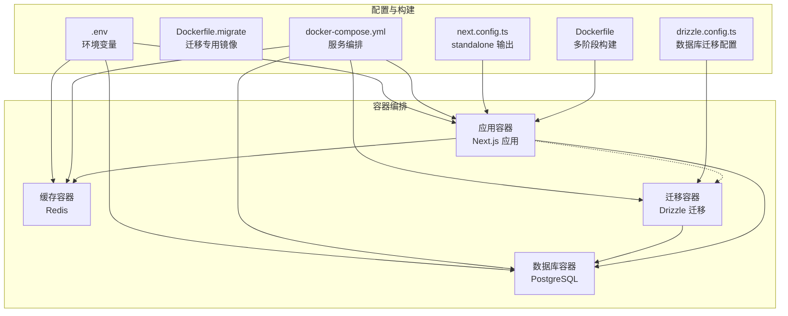
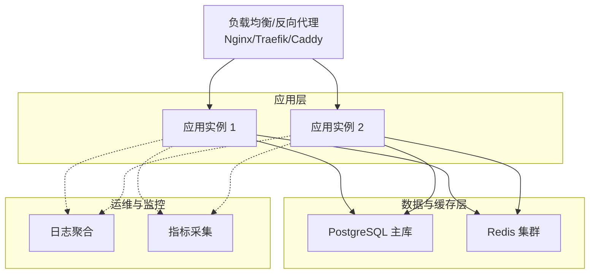
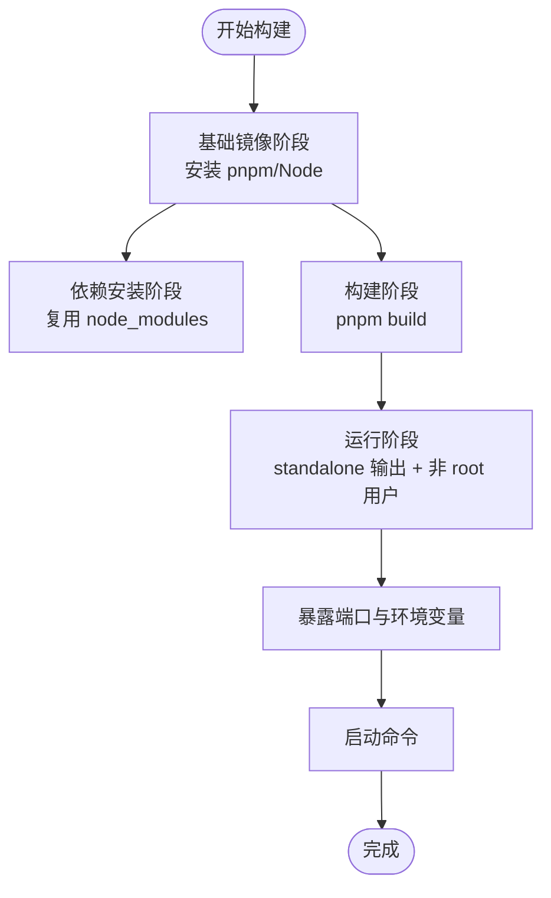
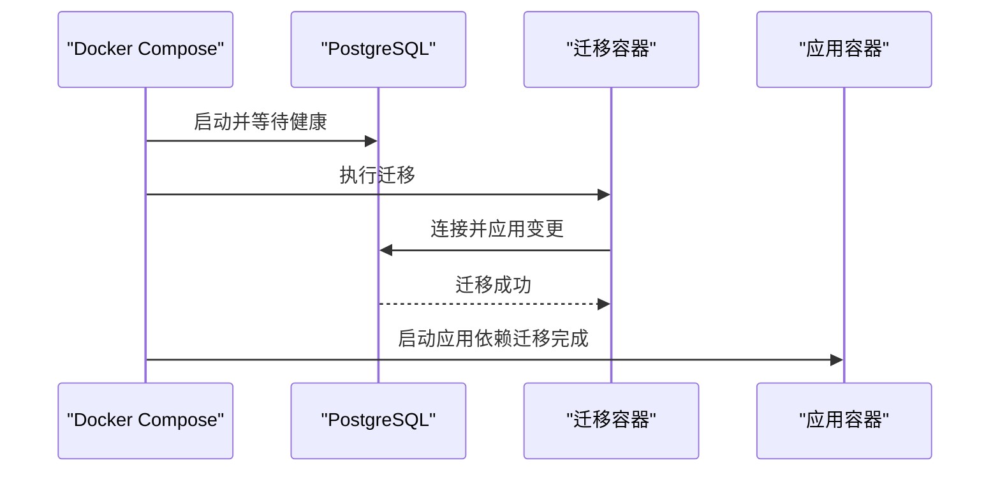
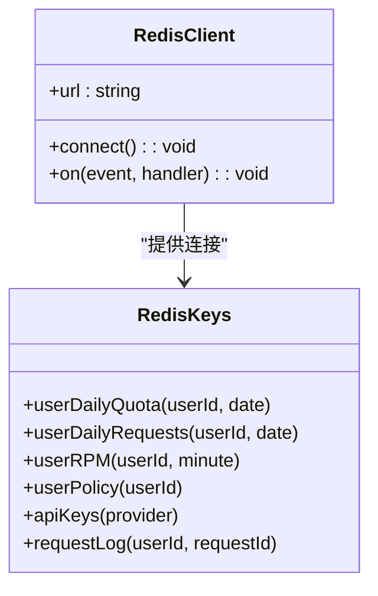
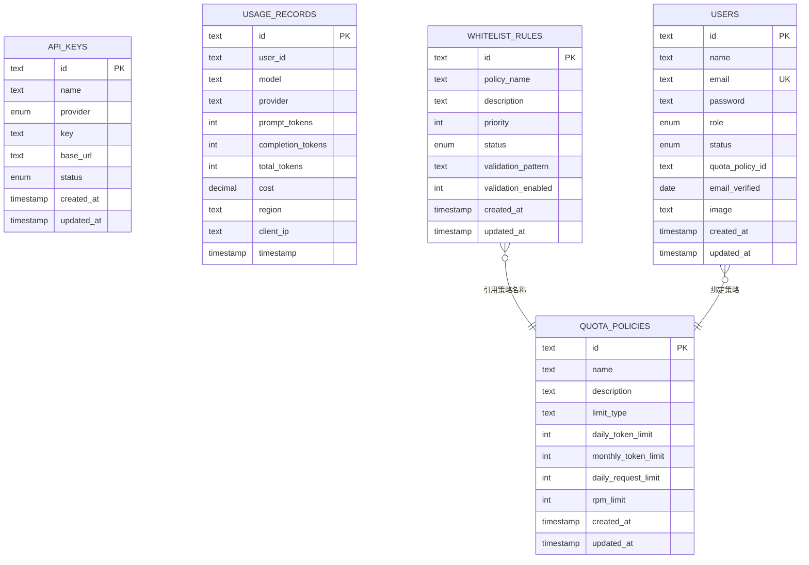
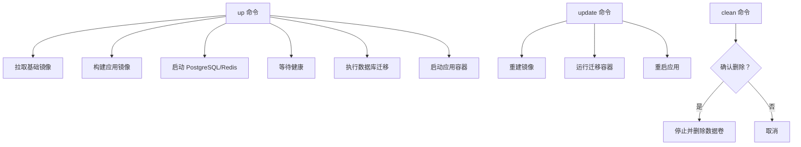
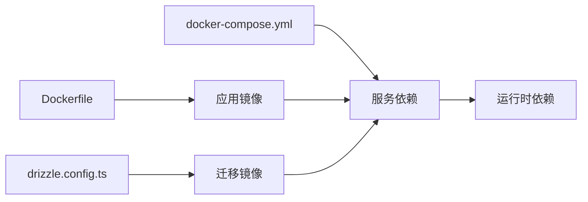

# 部署架构设计

<cite>
**本文档引用的文件**
- [Dockerfile](file://Dockerfile)
- [Dockerfile.migrate](file://Dockerfile.migrate)
- [docker-compose.yml](file://docker-compose.yml)
- [deploy.sh](file://deploy.sh)
- [.env](file://.env)
- [next.config.ts](file://next.config.ts)
- [drizzle.config.ts](file://drizzle.config.ts)
- [package.json](file://package.json)
- [src/lib/database.ts](file://src/lib/database.ts)
- [src/lib/redis.ts](file://src/lib/redis.ts)
- [src/lib/schema.ts](file://src/lib/schema.ts)
</cite>

## 目录
1. [简介](#简介)
2. [项目结构](#项目结构)
3. [核心组件](#核心组件)
4. [架构总览](#架构总览)
5. [详细组件分析](#详细组件分析)
6. [依赖关系分析](#依赖关系分析)
7. [性能考虑](#性能考虑)
8. [故障排查指南](#故障排查指南)
9. [结论](#结论)
10. [附录](#附录)

## 简介
本文件面向 AIGate 系统的容器化与生产级部署，围绕以下目标展开：  
- 容器化部署策略：基于多阶段 Docker 构建，优化镜像体积与启动时间  
- 微服务与编排：以 Docker Compose 实现应用、数据库与缓存的协同部署  
- 数据库与缓存：PostgreSQL 与 Redis 的部署配置与连接管理  
- 环境变量与安全：敏感参数与客户端可见变量的分离与注入  
- CI/CD 与自动化：一键部署脚本与迁移流程  
- 负载均衡与反向代理：概念性说明与 SSL 终止建议  
- 高可用与灾备：可扩展性与故障转移思路  
- 运维监控：可观测性与告警建议  

## 项目结构
AIGate 采用前端框架 Next.js + Drizzle ORM + Redis 的技术栈，结合 Docker 与 Docker Compose 实现本地与生产环境的一致化部署。

**图表来源**
- [docker-compose.yml](file://docker-compose.yml#L1-L84)
- [Dockerfile](file://Dockerfile#L1-L52)
- [Dockerfile.migrate](file://Dockerfile.migrate#L1-L15)
- [next.config.ts](file://next.config.ts#L1-L9)
- [drizzle.config.ts](file://drizzle.config.ts#L1-L11)
- [.env](file://.env#L1-L13)

**章节来源**
- [docker-compose.yml](file://docker-compose.yml#L1-L84)
- [Dockerfile](file://Dockerfile#L1-L52)
- [Dockerfile.migrate](file://Dockerfile.migrate#L1-L15)
- [next.config.ts](file://next.config.ts#L1-L9)
- [drizzle.config.ts](file://drizzle.config.ts#L1-L11)
- [.env](file://.env#L1-L13)

## 核心组件
- 应用容器（Next.js）：基于多阶段构建，使用 standalone 输出，降低运行时体积并提升启动速度  
- 数据库容器（PostgreSQL）：持久化存储，支持健康检查与数据卷挂载  
- 缓存容器（Redis）：会话与配额等热点数据缓存  
- 迁移容器（Drizzle）：独立镜像执行数据库迁移，确保部署一致性  
- 编排与自动化：Docker Compose + 一键部署脚本，覆盖拉取、构建、启动、迁移、日志与清理等场景  

**章节来源**
- [Dockerfile](file://Dockerfile#L1-L52)
- [docker-compose.yml](file://docker-compose.yml#L1-L84)
- [deploy.sh](file://deploy.sh#L1-L168)

## 架构总览
下图展示 AIGate 在容器环境中的部署拓扑与交互关系：

[此图为概念性拓扑，不直接映射具体源码文件]

## 详细组件分析

### 容器化与多阶段构建
- 多阶段构建策略：基础镜像 → 依赖安装 → 构建 → 运行阶段，最终仅拷贝最小运行产物  
- 运行时安全：以非 root 用户运行，设置只读文件系统与最小权限  
- Standalone 输出：配合 Next.js standalone 配置，减少运行时依赖  
- 环境变量：生产环境变量注入与端口暴露统一在 Dockerfile 中管理  

**图表来源**
- [Dockerfile](file://Dockerfile#L1-L52)
- [next.config.ts](file://next.config.ts#L1-L9)

**章节来源**
- [Dockerfile](file://Dockerfile#L1-L52)
- [next.config.ts](file://next.config.ts#L1-L9)

### 数据库部署与迁移
- 数据库镜像：PostgreSQL 15 Alpine，健康检查与数据卷持久化  
- 迁移机制：独立容器执行 Drizzle 迁移，依赖数据库健康后再启动应用  
- 迁移镜像：仅包含迁移所需依赖与配置，避免污染应用镜像  

**图表来源**
- [docker-compose.yml](file://docker-compose.yml#L62-L75)
- [Dockerfile.migrate](file://Dockerfile.migrate#L1-L15)

**章节来源**
- [docker-compose.yml](file://docker-compose.yml#L24-L75)
- [Dockerfile.migrate](file://Dockerfile.migrate#L1-L15)
- [drizzle.config.ts](file://drizzle.config.ts#L1-L11)

### Redis 缓存与键空间设计
- 连接管理：通过环境变量注入 Redis URL，自动重连与错误日志  
- 键空间命名：按用户维度与时间粒度组织键，便于配额与速率控制  
- 时间工具：提供日期与分钟粒度的键后缀，适配日/分钟级限流  

**图表来源**
- [src/lib/redis.ts](file://src/lib/redis.ts#L1-L49)

**章节来源**
- [src/lib/redis.ts](file://src/lib/redis.ts#L1-L49)
- [.env](file://.env#L1-L13)

### 数据模型与配额策略
- 表结构：配额策略、API 密钥、用量记录、用户、白名单规则等  
- 关系：白名单规则与配额策略的关联，用户与配额策略的绑定  
- 查询封装：数据库访问层对 CRUD 与统计查询进行封装，便于业务调用  

**图表来源**
- [src/lib/schema.ts](file://src/lib/schema.ts#L28-L95)

**章节来源**
- [src/lib/schema.ts](file://src/lib/schema.ts#L1-L159)
- [src/lib/database.ts](file://src/lib/database.ts#L1-L524)

### 环境变量与安全
- 敏感变量：数据库与 Redis 连接串、NextAuth 秘钥与回调地址  
- 客户端可见变量：登录页所需的管理员账号信息（仅用于演示）  
- 注入方式：Compose 环境块与 .env 文件统一注入  

**章节来源**
- [.env](file://.env#L1-L13)
- [docker-compose.yml](file://docker-compose.yml#L10-L12)

### 自动化部署与运维脚本
- 一键部署：拉取镜像、构建应用、启动基础设施、执行迁移、启动应用  
- 更新流程：重建镜像、执行迁移、重启应用  
- 常用操作：停止、重启、查看日志、查看状态、仅迁移、清理数据卷  
- 交互提示：彩色日志与确认提示，降低误操作风险  

**图表来源**
- [deploy.sh](file://deploy.sh#L58-L102)
- [deploy.sh](file://deploy.sh#L135-L145)

**章节来源**
- [deploy.sh](file://deploy.sh#L1-L168)
- [docker-compose.yml](file://docker-compose.yml#L1-L84)

## 依赖关系分析
- 应用对数据库与缓存的依赖：通过环境变量注入，运行时建立连接  
- 迁移对数据库的依赖：必须在数据库健康后执行  
- 编排对镜像的依赖：Compose 通过 Dockerfile 与 Dockerfile.migrate 构建镜像  
- 构建链路：pnpm 版本固定、依赖复用、构建产物最小化  

**图表来源**
- [Dockerfile](file://Dockerfile#L1-L52)
- [Dockerfile.migrate](file://Dockerfile.migrate#L1-L15)
- [drizzle.config.ts](file://drizzle.config.ts#L1-L11)
- [docker-compose.yml](file://docker-compose.yml#L1-L84)

**章节来源**
- [package.json](file://package.json#L1-L75)
- [docker-compose.yml](file://docker-compose.yml#L1-L84)

## 性能考虑
- 镜像体积与启动时间：多阶段构建与 standalone 输出显著优化  
- 运行时资源：非 root 用户与最小权限降低攻击面；健康检查保障可用性  
- 数据库与缓存：连接池与键空间设计支持高并发与低延迟  
- 可观测性：日志与指标采集建议结合集中式日志与监控平台  

[本节为通用指导，无需特定文件引用]

## 故障排查指南
- 容器无法启动：检查日志、确认数据库与缓存健康、验证环境变量  
- 迁移失败：确认数据库可连接、迁移镜像执行结果、检查 schema 与版本  
- 连接异常：核对 Redis/数据库 URL、网络连通性、防火墙与端口映射  
- 权限问题：确认非 root 用户权限、数据卷所有权与挂载路径  

**章节来源**
- [deploy.sh](file://deploy.sh#L118-L133)
- [docker-compose.yml](file://docker-compose.yml#L36-L57)

## 结论
AIGate 的部署架构以 Docker 多阶段构建为基础，结合 Docker Compose 实现应用、数据库与缓存的一体化编排。通过独立迁移容器与环境变量管理，实现可重复、可审计的生产级部署。建议在生产环境中引入负载均衡与反向代理、Redis 集群、集中式监控与备份策略，并制定完善的故障转移与灾难恢复预案。

[本节为总结性内容，无需特定文件引用]

## 附录

### 部署命令速查
- 首次部署/全量启动：./deploy.sh up  
- 更新应用：./deploy.sh update  
- 停止服务：./deploy.sh down  
- 重启应用：./deploy.sh restart  
- 查看日志：./deploy.sh logs  
- 仅执行迁移：./deploy.sh migrate  
- 查看状态：./deploy.sh status  
- 清理数据（危险）：./deploy.sh clean  

**章节来源**
- [deploy.sh](file://deploy.sh#L8-L16)

### 环境变量清单
- 数据库连接串：DATABASE_URL  
- Redis 连接串：REDIS_URL  
- NextAuth 秘钥与回调：NEXTAUTH_SECRET、NEXTAUTH_URL  
- 管理员账号（演示）：ADMIN_EMAIL、ADMIN_PASSWORD、ADMIN_NAME  
- 客户端可见变量：NEXT_PUBLIC_ADMIN_EMAIL、NEXT_PUBLIC_ADMIN_PASSWORD  

**章节来源**
- [.env](file://.env#L1-L13)