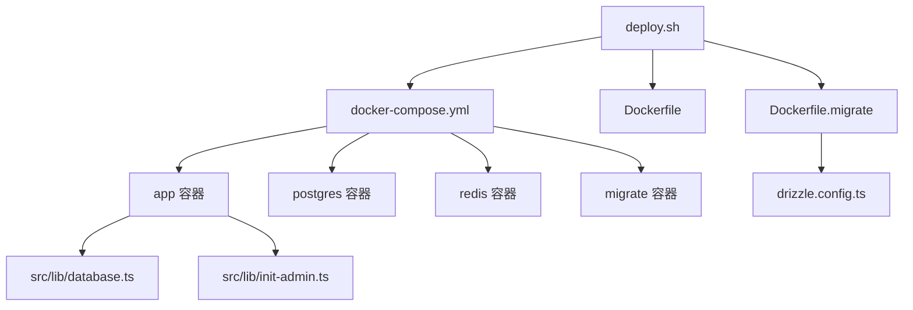
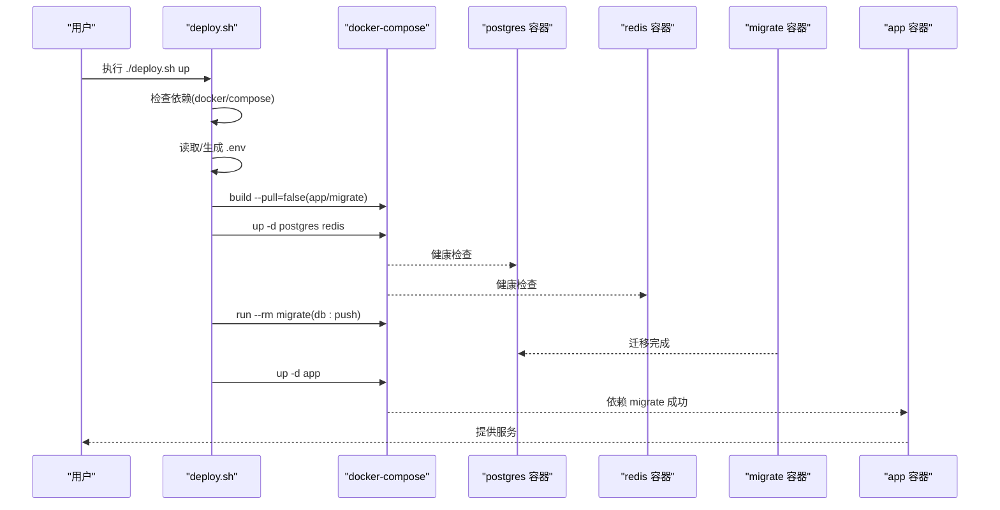
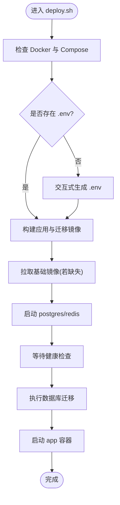
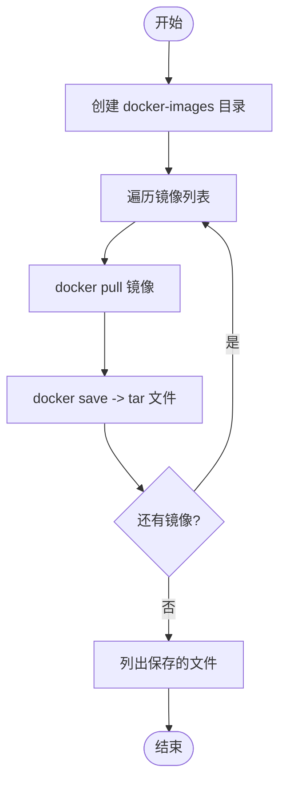
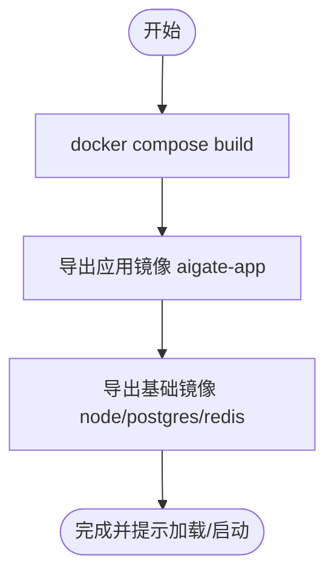
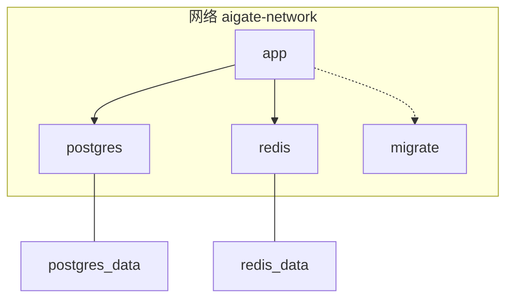
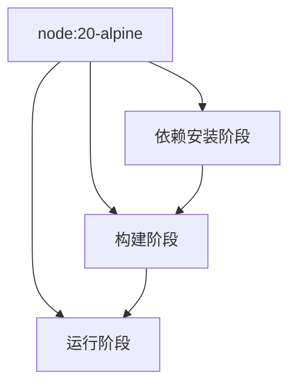
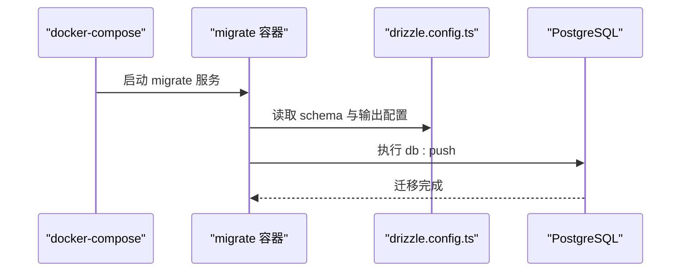
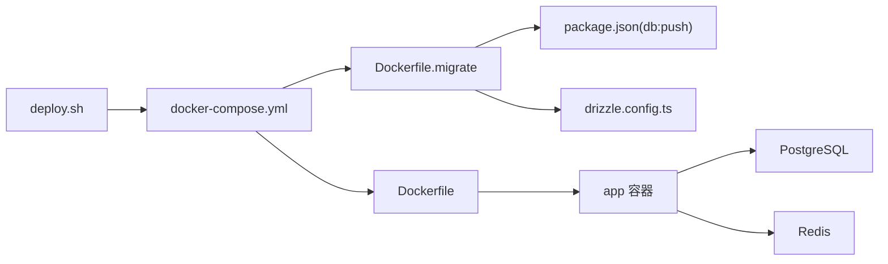

# 一键部署脚本

<cite>
**本文引用的文件**
- [deploy.sh](file://deploy.sh)
- [download-images.sh](file://download-images.sh)
- [export-images.sh](file://export-images.sh)
- [docker-compose.yml](file://docker-compose.yml)
- [Dockerfile](file://Dockerfile)
- [Dockerfile.migrate](file://Dockerfile.migrate)
- [README.md](file://README.md)
- [package.json](file://package.json)
- [drizzle.config.ts](file://drizzle.config.ts)
- [src/lib/database.ts](file://src/lib/database.ts)
- [src/lib/init-admin.ts](file://src/lib/init-admin.ts)
</cite>

## 目录
1. [简介](#简介)
2. [项目结构](#项目结构)
3. [核心组件](#核心组件)
4. [架构总览](#架构总览)
5. [详细组件分析](#详细组件分析)
6. [依赖关系分析](#依赖关系分析)
7. [性能考虑](#性能考虑)
8. [故障排查指南](#故障排查指南)
9. [结论](#结论)
10. [附录](#附录)

## 简介
本指南面向运维与开发人员，系统讲解 AIGate 一键部署脚本的使用方法与内部机制，覆盖以下内容：
- deploy.sh 的功能与命令详解：首次部署、更新、停止、重启、查看日志、仅迁移、状态查询、交互式配置、清理数据等。
- 环境准备、依赖安装、数据库初始化与应用启动全流程。
- download-images.sh 与 export-images.sh 的作用与使用场景，尤其在离线环境与私有镜像仓库中的应用。
- 执行前的准备工作清单：系统要求、权限配置、网络设置。
- 常见部署问题的排查与解决方案。

## 项目结构
AIGate 采用 Docker Compose 编排，核心文件如下：
- 部署脚本：deploy.sh、download-images.sh、export-images.sh
- 编排文件：docker-compose.yml
- 应用镜像构建：Dockerfile（应用）、Dockerfile.migrate（迁移）
- 数据库迁移配置：drizzle.config.ts
- 依赖与脚本：package.json
- 初始化与数据库访问：src/lib/init-admin.ts、src/lib/database.ts
- 项目说明：README.md

图表来源
- [deploy.sh](file://deploy.sh#L200-L382)
- [docker-compose.yml](file://docker-compose.yml#L1-L87)
- [Dockerfile](file://Dockerfile#L1-L54)
- [Dockerfile.migrate](file://Dockerfile.migrate#L1-L14)
- [drizzle.config.ts](file://drizzle.config.ts#L1-L10)
- [src/lib/database.ts](file://src/lib/database.ts#L1-L692)
- [src/lib/init-admin.ts](file://src/lib/init-admin.ts#L1-L79)

章节来源
- [README.md](file://README.md#L1-L83)
- [docker-compose.yml](file://docker-compose.yml#L1-L87)

## 核心组件
- deploy.sh：提供 up、update、down、restart、logs、migrate、status、config、clean 等命令，封装依赖检查、镜像处理、编排启动、迁移与日志查看。
- docker-compose.yml：定义 app、postgres、redis、migrate 四类服务，含健康检查、依赖顺序与数据卷。
- Dockerfile：分阶段构建应用镜像，暴露端口并以生产模式运行。
- Dockerfile.migrate：安装依赖后执行数据库迁移（drizzle-kit push）。
- drizzle.config.ts：迁移配置，指定 schema 与输出目录。
- package.json：定义迁移脚本 db:push，供迁移容器使用。
- src/lib/database.ts 与 src/lib/init-admin.ts：应用侧数据库访问与启动时管理员用户同步逻辑。

章节来源
- [deploy.sh](file://deploy.sh#L360-L382)
- [docker-compose.yml](file://docker-compose.yml#L1-L87)
- [Dockerfile](file://Dockerfile#L1-L54)
- [Dockerfile.migrate](file://Dockerfile.migrate#L1-L14)
- [drizzle.config.ts](file://drizzle.config.ts#L1-L10)
- [package.json](file://package.json#L13-L16)
- [src/lib/database.ts](file://src/lib/database.ts#L1-L692)
- [src/lib/init-admin.ts](file://src/lib/init-admin.ts#L1-L79)

## 架构总览
下图展示部署脚本如何驱动容器编排与数据库迁移：

图表来源
- [deploy.sh](file://deploy.sh#L207-L273)
- [docker-compose.yml](file://docker-compose.yml#L1-L87)
- [Dockerfile.migrate](file://Dockerfile.migrate#L1-L14)
- [package.json](file://package.json#L13-L16)

## 详细组件分析

### deploy.sh：一键部署与运维脚本
- 功能概览
  - 依赖检查：确保 Docker 与 Docker Compose V2 可用。
  - 环境变量管理：读取与写入 .env，支持交互式配置。
  - 镜像处理：检查并拉取基础镜像（node:20-alpine、postgres:15-alpine、redis:7-alpine），避免重复拉取。
  - 构建与启动：按阶段构建应用与迁移镜像，先启动数据库与缓存，等待健康，再执行迁移并启动应用。
  - 运维命令：down、restart、logs、migrate、status、clean 等。
- 关键流程
  - up：全量部署，包含镜像拉取、构建、启动基础设施、迁移与应用启动。
  - update：重新构建并迁移，最后重启应用。
  - migrate：仅执行数据库迁移。
  - config：交互式配置管理员邮箱/密码、数据库/Redis 连接、应用端口、日志目录与级别，并生成 NEXTAUTH_SECRET/NEXTAUTH_URL 等必要项。
  - clean：危险操作，删除容器与数据卷。
- 复杂度与性能
  - 镜像检查与拉取为 O(n)（基础镜像数量固定）。
  - 构建与启动为 I/O 密集，受磁盘与网络影响。
  - 健康检查确保服务可用性，减少后续失败重试成本。

图表来源
- [deploy.sh](file://deploy.sh#L207-L273)

章节来源
- [deploy.sh](file://deploy.sh#L36-L49)
- [deploy.sh](file://deploy.sh#L61-L89)
- [deploy.sh](file://deploy.sh#L91-L192)
- [deploy.sh](file://deploy.sh#L207-L273)
- [deploy.sh](file://deploy.sh#L275-L291)
- [deploy.sh](file://deploy.sh#L312-L322)
- [deploy.sh](file://deploy.sh#L324-L334)
- [deploy.sh](file://deploy.sh#L336-L357)

### download-images.sh：离线镜像下载脚本
- 作用：批量拉取并保存官方基础镜像到本地 tar 包，便于离线环境导入。
- 使用场景：无外网或受限网络环境，提前将所需镜像打包至介质后导入。
- 流程要点：遍历镜像列表，逐个拉取并保存为 tar 文件，输出保存路径。

图表来源
- [download-images.sh](file://download-images.sh#L1-L35)

章节来源
- [download-images.sh](file://download-images.sh#L1-L35)

### export-images.sh：应用与基础镜像导出脚本
- 作用：构建应用与基础镜像并导出为 tar 包，配合使用说明可在其他节点加载镜像并启动服务。
- 使用场景：私有镜像仓库或跨主机部署，先导出后分发，再加载运行。
- 流程要点：构建全部服务镜像；导出应用镜像与基础镜像；给出加载与启动指引。

图表来源
- [export-images.sh](file://export-images.sh#L1-L49)

章节来源
- [export-images.sh](file://export-images.sh#L1-L49)

### docker-compose.yml：服务编排与依赖
- 服务定义
  - app：基于 Dockerfile 构建，暴露端口，依赖 postgres、redis 健康与 migrate 成功后启动。
  - postgres：健康检查基于 pg_isready，持久化数据卷。
  - redis：健康检查基于 redis-cli ping，持久化数据卷。
  - migrate：基于 Dockerfile.migrate 构建，执行数据库迁移后退出。
- 网络与数据卷：统一桥接网络与命名卷，保证服务间通信与数据持久化。

图表来源
- [docker-compose.yml](file://docker-compose.yml#L1-L87)

章节来源
- [docker-compose.yml](file://docker-compose.yml#L1-L87)

### Dockerfile 与 Dockerfile.migrate：镜像构建
- Dockerfile
  - 分阶段构建：安装 pnpm，安装依赖，构建产物，最终以非 root 用户运行。
  - 环境变量：PORT、HOSTNAME、NODE_ENV，暴露端口。
- Dockerfile.migrate
  - 安装依赖后复制迁移配置与 schema，执行 db:push（由 package.json 定义）。

图表来源
- [Dockerfile](file://Dockerfile#L1-L54)
- [Dockerfile.migrate](file://Dockerfile.migrate#L1-L14)
- [package.json](file://package.json#L13-L16)

章节来源
- [Dockerfile](file://Dockerfile#L1-L54)
- [Dockerfile.migrate](file://Dockerfile.migrate#L1-L14)
- [package.json](file://package.json#L13-L16)

### 数据库初始化与迁移
- 迁移配置：drizzle.config.ts 指定 schema 与输出目录，读取 DATABASE_URL。
- 迁移执行：Dockerfile.migrate 在容器内执行 db:push，将 schema 推送至数据库。
- 启动时管理员同步：src/lib/init-admin.ts 在应用启动时读取环境变量，删除旧管理员并创建新管理员，确保初始状态一致。

图表来源
- [Dockerfile.migrate](file://Dockerfile.migrate#L1-L14)
- [drizzle.config.ts](file://drizzle.config.ts#L1-L10)
- [docker-compose.yml](file://docker-compose.yml#L65-L78)

章节来源
- [drizzle.config.ts](file://drizzle.config.ts#L1-L10)
- [Dockerfile.migrate](file://Dockerfile.migrate#L1-L14)
- [src/lib/init-admin.ts](file://src/lib/init-admin.ts#L1-L79)

## 依赖关系分析
- 脚本与编排
  - deploy.sh 依赖 docker-compose.yml 的服务定义与健康检查条件。
  - deploy.sh 通过 docker compose build/run/up 控制镜像构建与容器生命周期。
- 应用与数据库
  - app 依赖 postgres 与 redis 的健康状态；依赖 migrate 成功后启动。
  - src/lib/database.ts 与 src/lib/init-admin.ts 在应用层与数据库交互。
- 迁移链路
  - Dockerfile.migrate 依赖 package.json 的 db:push 脚本与 drizzle.config.ts 的 schema 配置。

图表来源
- [deploy.sh](file://deploy.sh#L207-L273)
- [docker-compose.yml](file://docker-compose.yml#L1-L87)
- [Dockerfile](file://Dockerfile#L1-L54)
- [Dockerfile.migrate](file://Dockerfile.migrate#L1-L14)
- [package.json](file://package.json#L13-L16)
- [drizzle.config.ts](file://drizzle.config.ts#L1-L10)

章节来源
- [deploy.sh](file://deploy.sh#L207-L273)
- [docker-compose.yml](file://docker-compose.yml#L1-L87)
- [Dockerfile.migrate](file://Dockerfile.migrate#L1-L14)
- [package.json](file://package.json#L13-L16)
- [drizzle.config.ts](file://drizzle.config.ts#L1-L10)

## 性能考虑
- 镜像拉取与构建
  - 优先复用本地镜像，减少网络开销；离线环境建议使用 download-images.sh 或 export-images.sh 提前准备。
- 健康检查
  - postgres 与 redis 的健康检查降低启动失败概率，缩短恢复时间。
- 构建阶段
  - Dockerfile 使用分阶段构建，减小最终镜像体积，提升拉取与启动速度。
- 数据持久化
  - 使用命名卷（postgres_data、redis_data）保障数据不丢失，避免重建导致的数据丢失。

[本节为通用指导，无需列出具体文件来源]

## 故障排查指南
- 依赖未安装
  - 现象：提示未安装 Docker 或 Docker Compose V2。
  - 处理：安装 Docker 并升级至包含 Compose V2 的版本。
- 端口冲突
  - 现象：应用端口被占用，容器无法映射。
  - 处理：在 .env 中调整 APP_PORT，或释放宿主端口。
- 数据库未就绪
  - 现象：app 启动失败，日志显示数据库不可达。
  - 处理：查看 logs，等待 postgres/redis 健康检查通过；检查 DATABASE_URL/REDIS_URL。
- 权限问题
  - 现象：容器无法写入数据卷或日志目录。
  - 处理：确保宿主目录权限正确，或使用 docker volume 管理数据卷。
- 迁移失败
  - 现象：migrate 容器退出，数据库未更新。
  - 处理：执行 migrate 命令单独运行迁移；检查 DATABASE_URL 与 schema 配置。
- 管理员账户异常
  - 现象：登录失败或管理员信息不一致。
  - 处理：通过 config 更新 ADMIN_EMAIL/ADMIN_PASSWORD；应用启动时会同步管理员用户。
- 清理数据风险
  - 现象：误执行 clean 导致数据丢失。
  - 处理：谨慎使用 clean；如需恢复，重新执行迁移与初始化流程。

章节来源
- [deploy.sh](file://deploy.sh#L36-L49)
- [deploy.sh](file://deploy.sh#L312-L322)
- [deploy.sh](file://deploy.sh#L324-L334)
- [src/lib/init-admin.ts](file://src/lib/init-admin.ts#L1-L79)

## 结论
- deploy.sh 将镜像拉取、构建、编排、迁移与运维命令整合为统一入口，简化部署与维护。
- download-images.sh 与 export-images.sh 适配离线与私有仓库场景，提升部署灵活性。
- 通过健康检查与分阶段构建，系统具备较好的稳定性与可维护性。
- 建议在生产环境中结合备份策略与监控，确保数据与服务安全。

[本节为总结性内容，无需列出具体文件来源]

## 附录

### 执行前准备清单
- 系统要求
  - Linux/macOS/Windows（WSL2）均可；建议使用 Linux。
  - Docker 与 Docker Compose V2 已安装并可正常运行。
- 权限配置
  - 当前用户加入 docker 组，避免频繁使用 sudo。
  - 若使用 export-images.sh，确保有写入 docker-images 目录的权限。
- 网络设置
  - 首次部署建议允许外网访问以拉取基础镜像；离线环境使用 download-images.sh 或 export-images.sh。
- 环境变量
  - 使用 ./deploy.sh config 生成 .env，包含 ADMIN_EMAIL、ADMIN_PASSWORD、DATABASE_URL、REDIS_URL、APP_PORT、LOG_DIR、LOG_LEVEL 等。
  - 自动补充 NEXTAUTH_SECRET、NEXTAUTH_URL、ADMIN_NAME 等必要项。

章节来源
- [deploy.sh](file://deploy.sh#L91-L192)
- [deploy.sh](file://deploy.sh#L194-L205)

### 常用命令速查
- 首次部署：./deploy.sh
- 交互式配置：./deploy.sh config
- 更新应用：./deploy.sh update
- 查看日志：./deploy.sh logs
- 仅迁移：./deploy.sh migrate
- 查看状态：./deploy.sh status
- 停止服务：./deploy.sh down
- 重启应用：./deploy.sh restart
- 清理数据（危险）：./deploy.sh clean

章节来源
- [README.md](file://README.md#L18-L39)
- [deploy.sh](file://deploy.sh#L336-L357)