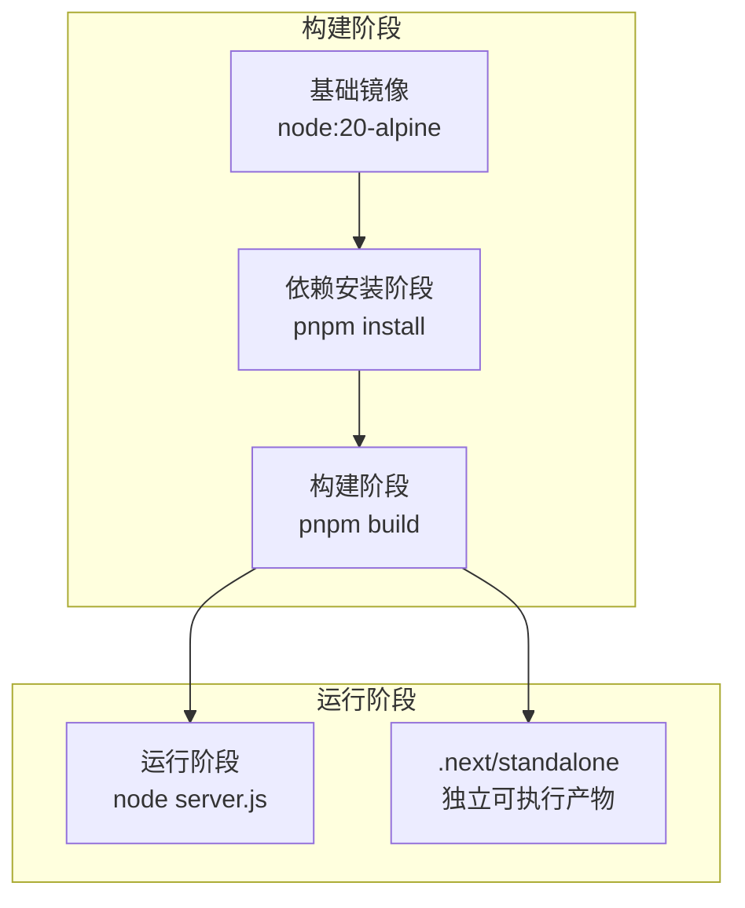
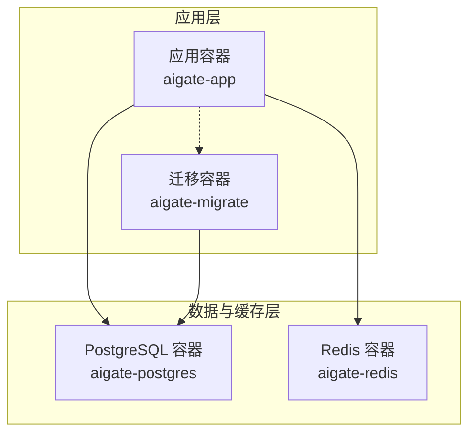
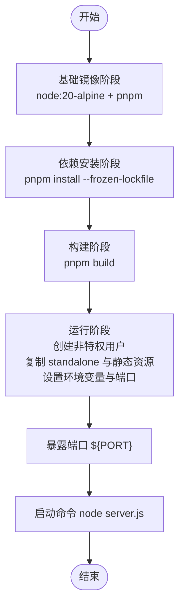
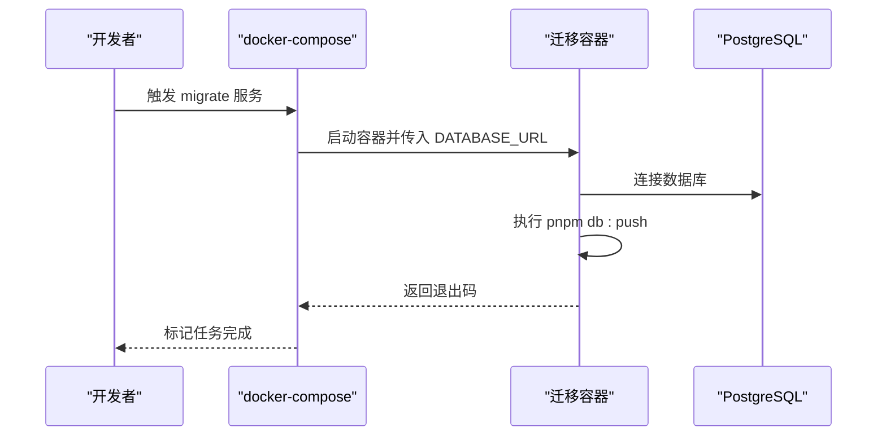
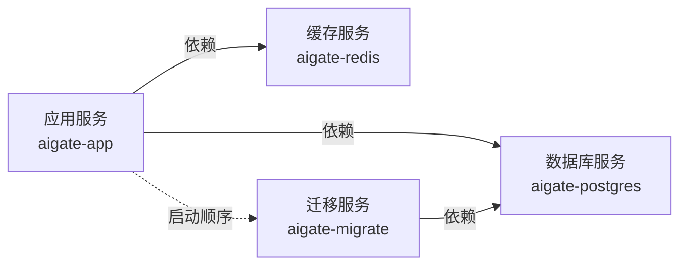
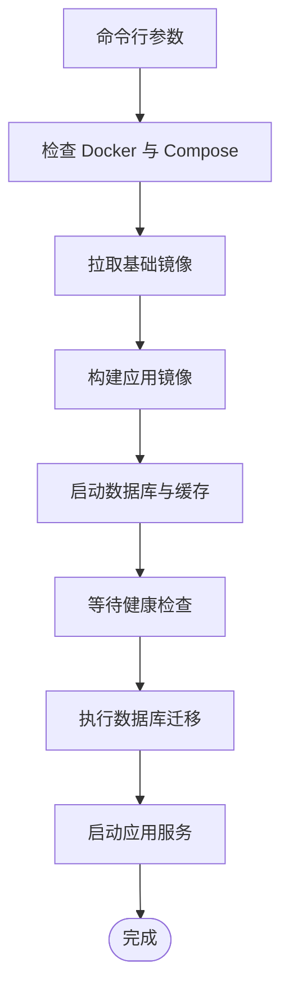
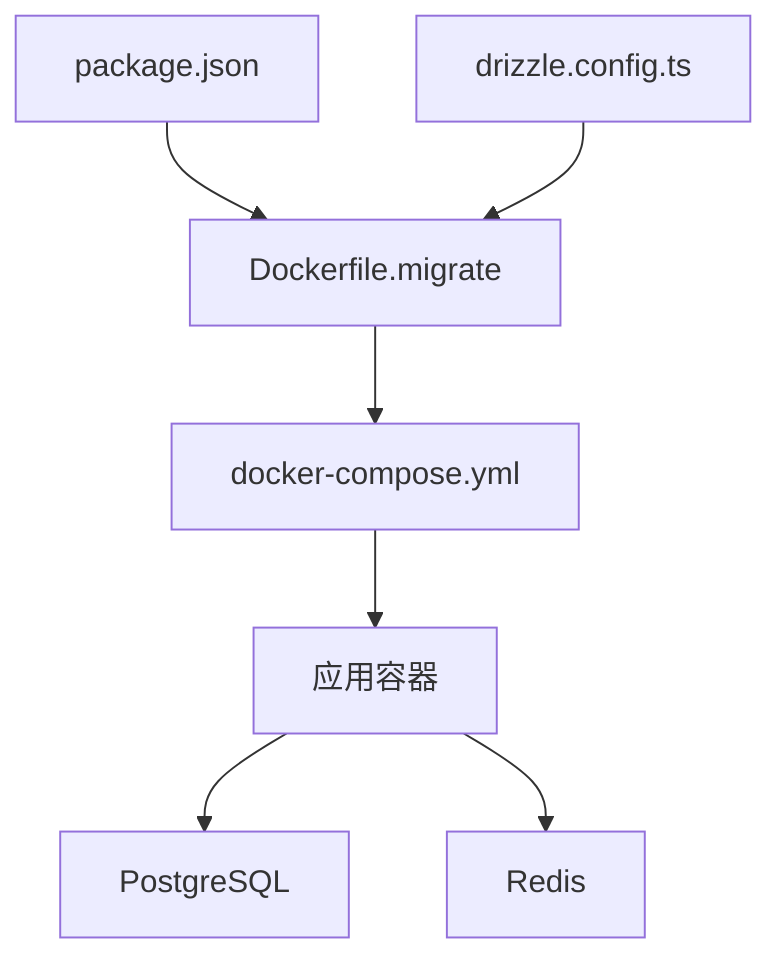

# 容器化部署

<cite>
**本文引用的文件**
- [Dockerfile](file://Dockerfile)
- [Dockerfile.migrate](file://Dockerfile.migrate)
- [docker-compose.yml](file://docker-compose.yml)
- [.dockerignore](file://.dockerignore)
- [deploy.sh](file://deploy.sh)
- [download-images.sh](file://download-images.sh)
- [export-images.sh](file://export-images.sh)
- [next.config.ts](file://next.config.ts)
- [drizzle.config.ts](file://drizzle.config.ts)
- [package.json](file://package.json)
- [README.md](file://README.md)
</cite>

## 目录
1. [简介](#简介)
2. [项目结构](#项目结构)
3. [核心组件](#核心组件)
4. [架构总览](#架构总览)
5. [详细组件分析](#详细组件分析)
6. [依赖关系分析](#依赖关系分析)
7. [性能与安全考量](#性能与安全考量)
8. [故障排查指南](#故障排查指南)
9. [结论](#结论)
10. [附录](#附录)

## 简介
本指南面向希望以容器化方式部署 AIGate 的用户，系统性讲解 Docker 多阶段构建流程、镜像构建与推送拉取最佳实践、docker-compose.yml 的完整配置说明，以及迁移容器的特殊用途与配置。文档同时覆盖 Node.js 用户权限、环境变量、端口暴露、健康检查、卷挂载、网络隔离等关键点，帮助您在开发、测试与生产环境中稳定运行 AIGate。

## 项目结构
AIGate 的容器化部署围绕以下关键文件展开：
- Dockerfile：定义多阶段构建（基础镜像、依赖安装、构建、运行）与运行时配置
- Dockerfile.migrate：数据库迁移专用镜像，用于一次性任务
- docker-compose.yml：编排应用、PostgreSQL、Redis 与迁移容器，含网络、卷、环境变量与健康检查
- .dockerignore：排除构建上下文中的无关文件，提升构建效率与安全性
- deploy.sh：一键部署脚本，封装镜像拉取、构建、启动、迁移、日志与清理等常用操作
- download-images.sh / export-images.sh：离线镜像下载与导出工具，便于内网或无网络环境部署
- next.config.ts：启用 Next.js standalone 输出，配合 Dockerfile 的复制策略
- drizzle.config.ts：Drizzle ORM 配置，驱动迁移容器的数据库迁移行为
- package.json：定义构建脚本与依赖管理工具 pnpm，支撑多阶段构建

图表来源
- [Dockerfile](file://Dockerfile#L1-L54)
- [next.config.ts](file://next.config.ts#L3-L6)

章节来源
- [Dockerfile](file://Dockerfile#L1-L54)
- [docker-compose.yml](file://docker-compose.yml#L1-L87)
- [next.config.ts](file://next.config.ts#L1-L9)

## 核心组件
- 多阶段 Dockerfile：分阶段实现最小化运行镜像，降低攻击面与体积
- 迁移容器：专用镜像执行数据库迁移，确保数据一致性
- docker-compose 编排：统一管理应用、数据库、缓存与迁移任务
- 一键部署脚本：自动化镜像拉取、构建、启动、迁移与运维操作
- 离线镜像工具：支持内网环境的镜像打包与加载

章节来源
- [Dockerfile](file://Dockerfile#L1-L54)
- [Dockerfile.migrate](file://Dockerfile.migrate#L1-L14)
- [docker-compose.yml](file://docker-compose.yml#L1-L87)
- [deploy.sh](file://deploy.sh#L1-L382)
- [download-images.sh](file://download-images.sh#L1-L35)
- [export-images.sh](file://export-images.sh#L1-L49)

## 架构总览
下图展示了 AIGate 在容器化环境中的整体架构：应用容器、数据库容器、缓存容器与迁移容器之间的依赖关系与通信路径。

图表来源
- [docker-compose.yml](file://docker-compose.yml#L3-L26)
- [docker-compose.yml](file://docker-compose.yml#L28-L47)
- [docker-compose.yml](file://docker-compose.yml#L49-L63)
- [docker-compose.yml](file://docker-compose.yml#L66-L79)

## 详细组件分析

### Dockerfile 多阶段构建详解
- 基础镜像与包管理器
  - 使用 node:20-alpine 作为基础镜像，启用 Corepack 并激活 pnpm@9.0.0，确保依赖安装工具版本一致
- 依赖安装阶段（deps）
  - 复制 package.json 与 pnpm-lock.yaml，使用 --frozen-lockfile 确保锁定文件一致性
- 构建阶段（builder）
  - 复用上一阶段的 node_modules，避免重复安装
  - 设置 NEXT_TELEMETRY_DISABLED=1，禁用 Telemetry
  - 执行 pnpm build，生成 Next.js 构建产物
- 运行阶段（runner）
  - 创建非特权用户组与用户，降低运行风险
  - 复制 public、drizzle、drizzle.config.ts、package.json、pnpm-lock.yaml
  - 复制 Next.js standalone 输出（.next/standalone 与 .next/static），并设置所有权
  - 设置 NODE_ENV=production 与 NEXT_TELEMETRY_DISABLED=1
  - 使用 ARG/ENV 暴露 PORT（默认 3000），绑定 HOSTNAME="0.0.0.0"
  - EXPOSE ${PORT}
  - CMD ["node", "server.js"]

图表来源
- [Dockerfile](file://Dockerfile#L1-L54)

章节来源
- [Dockerfile](file://Dockerfile#L1-L54)
- [next.config.ts](file://next.config.ts#L3-L6)

### Dockerfile.migrate 迁移容器
- 基础镜像：node:20-alpine
- 依赖安装：复制 package.json 与 pnpm-lock.yaml，安装依赖
- 迁移准备：复制 drizzle.config.ts 与 schema 定义
- 执行命令：打印 DATABASE_URL 并执行 pnpm db:push，完成数据库迁移

图表来源
- [Dockerfile.migrate](file://Dockerfile.migrate#L1-L14)
- [drizzle.config.ts](file://drizzle.config.ts#L1-L11)
- [package.json](file://package.json#L13-L16)

章节来源
- [Dockerfile.migrate](file://Dockerfile.migrate#L1-L14)
- [drizzle.config.ts](file://drizzle.config.ts#L1-L11)
- [package.json](file://package.json#L13-L16)

### docker-compose.yml 完整配置说明
- 服务定义
  - app：基于 Dockerfile 构建，支持通过 args 与环境变量设置端口；依赖 postgres、redis 就绪与 migrate 成功后启动；重启策略为 unless-stopped；加入自定义网络
  - postgres：官方 postgres:15-alpine，持久化卷，健康检查使用 pg_isready；重启策略为 unless-stopped
  - redis：官方 redis:7-alpine，持久化卷，健康检查使用 redis-cli ping；重启策略为 unless-stopped
  - migrate：基于 Dockerfile.migrate 构建，依赖 postgres 就绪后运行，成功即退出（restart: 'no'）
- 网络与卷
  - 自定义桥接网络 aigate-network，隔离服务间通信
  - postgres_data、redis_data 卷，持久化数据库与缓存数据
- 环境变量
  - app：PORT、DATABASE_URL、REDIS_URL
  - postgres：POSTGRES_DB、POSTGRES_USER、POSTGRES_PASSWORD
  - redis：无额外环境变量（默认端口 6379）
  - migrate：DATABASE_URL
- 健康检查
  - postgres：pg_isready 检查数据库可用性
  - redis：redis-cli ping 检查服务可用性
- 依赖顺序
  - app 依赖 migrate 成功完成，确保数据库结构就绪后再启动应用

图表来源
- [docker-compose.yml](file://docker-compose.yml#L1-L87)

章节来源
- [docker-compose.yml](file://docker-compose.yml#L1-L87)

### .dockerignore 与构建优化
- 排除 node_modules、.next、.git、文档与 .env 等文件，减少构建上下文大小，提升构建速度与安全性
- 保留 .env.example、docker-compose.yml、Dockerfile、Dockerfile.migrate，确保部署时可见

章节来源
- [.dockerignore](file://.dockerignore#L1-L13)

### 一键部署脚本 deploy.sh
- 依赖检查：Docker 与 Docker Compose v2
- 镜像拉取：预先检查并拉取 node:20-alpine、postgres:15-alpine、redis:7-alpine
- 构建：使用 --pull=false 避免远程检查，加速构建
- 启动：先启动 postgres 与 redis，等待健康检查通过；再启动 migrate 并启动应用
- 运维：提供 up、update、down、restart、logs、migrate、status、config、clean 等子命令
- 交互式配置：读取/写入 .env，支持管理员账户、数据库、Redis、端口、日志目录与级别等配置项

图表来源
- [deploy.sh](file://deploy.sh#L207-L273)

章节来源
- [deploy.sh](file://deploy.sh#L1-L382)

### 离线镜像工具
- download-images.sh：批量拉取并保存 node:20-alpine、postgres:15-alpine、redis:7-alpine 到 docker-images 目录
- export-images.sh：构建应用镜像与基础镜像，保存为 tar 包，提供加载与启动说明

章节来源
- [download-images.sh](file://download-images.sh#L1-L35)
- [export-images.sh](file://export-images.sh#L1-L49)

## 依赖关系分析
- 构建链路
  - Dockerfile.migrate 依赖 package.json 与 drizzle.config.ts，确保迁移脚本可用
  - docker-compose.yml 中 app 依赖 migrate 成功完成，再依赖 postgres、redis 就绪
- 运行链路
  - 应用容器通过 DATABASE_URL 连接 PostgreSQL，通过 REDIS_URL 连接 Redis
  - 迁移容器仅在首次部署或更新时运行一次，完成后退出

图表来源
- [package.json](file://package.json#L13-L16)
- [drizzle.config.ts](file://drizzle.config.ts#L1-L11)
- [Dockerfile.migrate](file://Dockerfile.migrate#L1-L14)
- [docker-compose.yml](file://docker-compose.yml#L1-L87)

章节来源
- [package.json](file://package.json#L13-L16)
- [drizzle.config.ts](file://drizzle.config.ts#L1-L11)
- [Dockerfile.migrate](file://Dockerfile.migrate#L1-L14)
- [docker-compose.yml](file://docker-compose.yml#L1-L87)

## 性能与安全考量
- 多阶段构建与最小化运行镜像
  - 通过复制 .next/standalone 与 .next/static，结合 standalone 输出，减少运行时依赖与体积
  - 使用非特权用户运行，降低权限风险
- 端口与主机绑定
  - 通过 HOSTNAME="0.0.0.0" 与 EXPOSE ${PORT}，确保容器对外暴露端口
- 健康检查
  - PostgreSQL 与 Redis 提供健康检查，compose 可据此进行依赖等待与重启策略
- 环境变量与 Telemetry
  - 设置 NEXT_TELEMETRY_DISABLED=1，避免 Telemetry 影响构建与运行
  - 通过 docker-compose.yml 与 .env 控制 DATABASE_URL、REDIS_URL、PORT 等关键配置

章节来源
- [Dockerfile](file://Dockerfile#L24-L54)
- [docker-compose.yml](file://docker-compose.yml#L12-L23)
- [next.config.ts](file://next.config.ts#L3-L6)

## 故障排查指南
- 镜像拉取失败
  - 使用 download-images.sh 或 export-images.sh 准备离线镜像，避免网络问题
- 迁移失败
  - 检查 DATABASE_URL 是否正确，确认 migrate 服务已成功完成且 app 依赖其完成
- 数据库不可用
  - 查看 postgres 健康检查日志，确认凭据与网络连通性
- 缓存不可用
  - 查看 redis 健康检查日志，确认端口映射与网络连通性
- 应用无法访问
  - 检查 APP_PORT 映射与防火墙设置，确认容器日志中端口绑定情况
- 日志定位
  - 使用 ./deploy.sh logs 实时查看应用日志，定位错误堆栈与异常

章节来源
- [deploy.sh](file://deploy.sh#L308-L310)
- [docker-compose.yml](file://docker-compose.yml#L39-L43)
- [docker-compose.yml](file://docker-compose.yml#L56-L60)

## 结论
AIGate 的容器化部署采用多阶段 Dockerfile、专用迁移容器与 docker-compose 编排，实现了从构建到运行的全链路自动化与可维护性。通过健康检查、非特权用户、standalone 输出与环境变量配置，系统在安全性与性能方面均具备良好表现。配合一键部署脚本与离线镜像工具，可在不同网络环境下快速完成部署与运维。

## 附录

### 镜像构建、推送与拉取最佳实践
- 构建
  - 使用 docker compose build，避免远程检查，提升速度
  - 在 CI/CD 中缓存基础镜像与依赖层，缩短构建时间
- 推送与拉取
  - 为镜像添加语义化标签（如 latest、版本号），便于追踪与回滚
  - 在私有仓库中启用镜像签名与漏洞扫描
- 离线部署
  - 使用 export-images.sh 导出应用与基础镜像，配合 download-images.sh 在无网络环境部署

章节来源
- [export-images.sh](file://export-images.sh#L1-L49)
- [download-images.sh](file://download-images.sh#L1-L35)
- [deploy.sh](file://deploy.sh#L242-L254)

### 关键配置清单
- 环境变量
  - DATABASE_URL：PostgreSQL 连接字符串
  - REDIS_URL：Redis 连接字符串
  - PORT：应用监听端口（默认 3000）
  - NEXT_TELEMETRY_DISABLED：禁用 Telemetry
  - NEXTAUTH_SECRET、NEXTAUTH_URL：NextAuth 相关配置（一键脚本会自动注入）
- 端口映射
  - APP_PORT：宿主与容器端口映射
  - PostgreSQL 默认 5432，Redis 默认 6379
- 卷
  - postgres_data：PostgreSQL 数据持久化
  - redis_data：Redis 数据持久化

章节来源
- [docker-compose.yml](file://docker-compose.yml#L12-L23)
- [docker-compose.yml](file://docker-compose.yml#L35-L38)
- [docker-compose.yml](file://docker-compose.yml#L52-L56)
- [deploy.sh](file://deploy.sh#L92-L192)