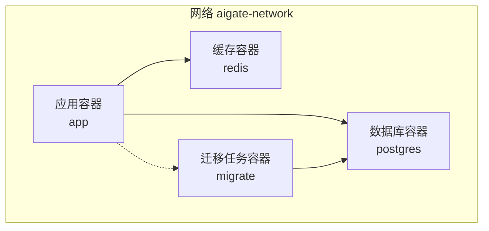
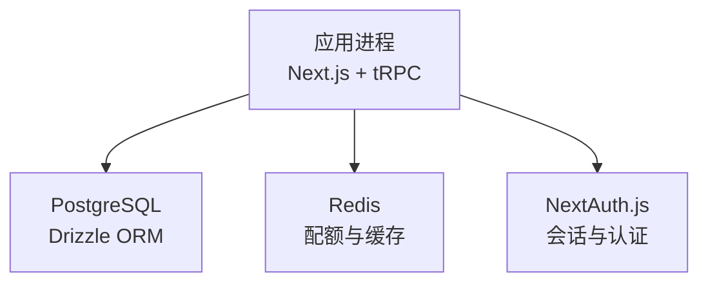
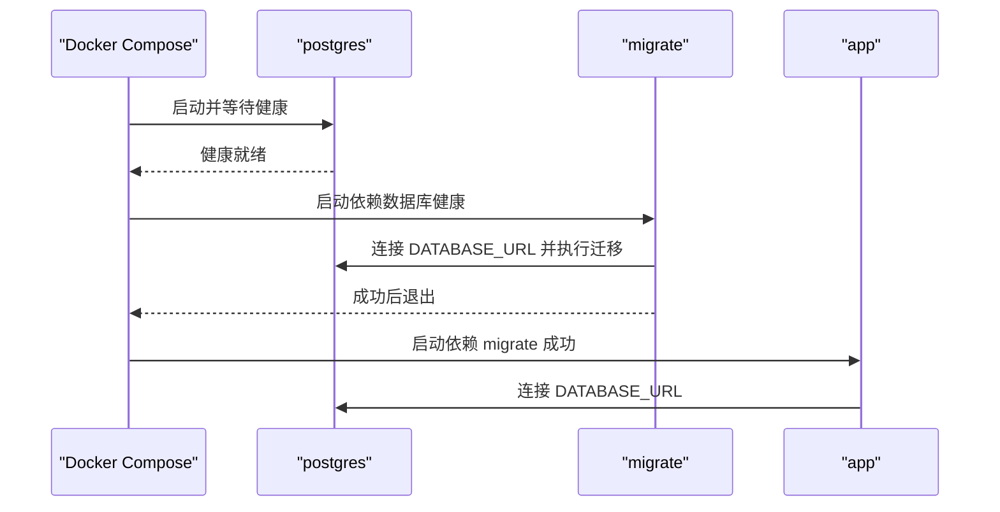
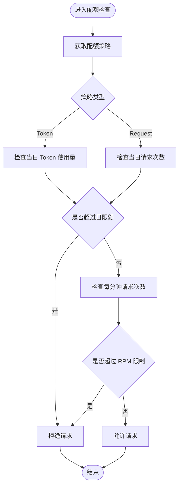
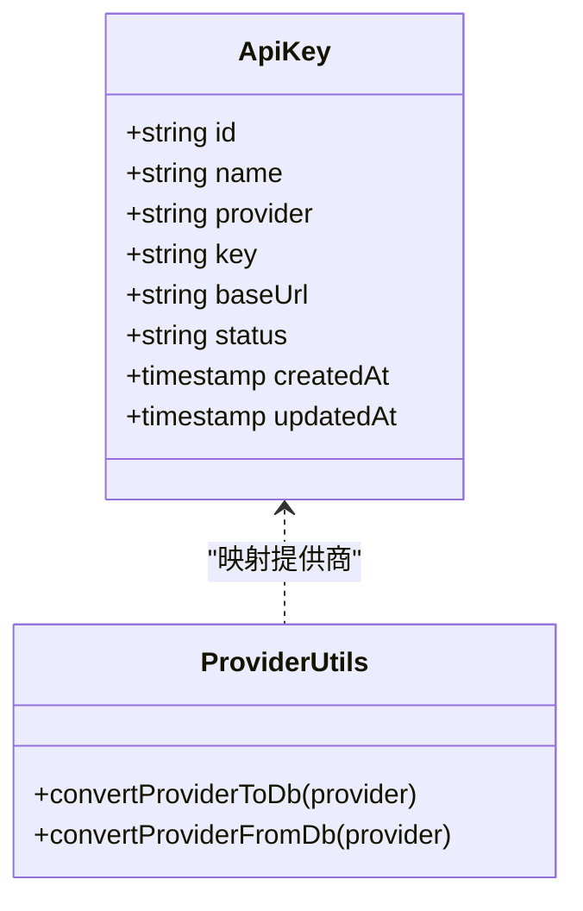
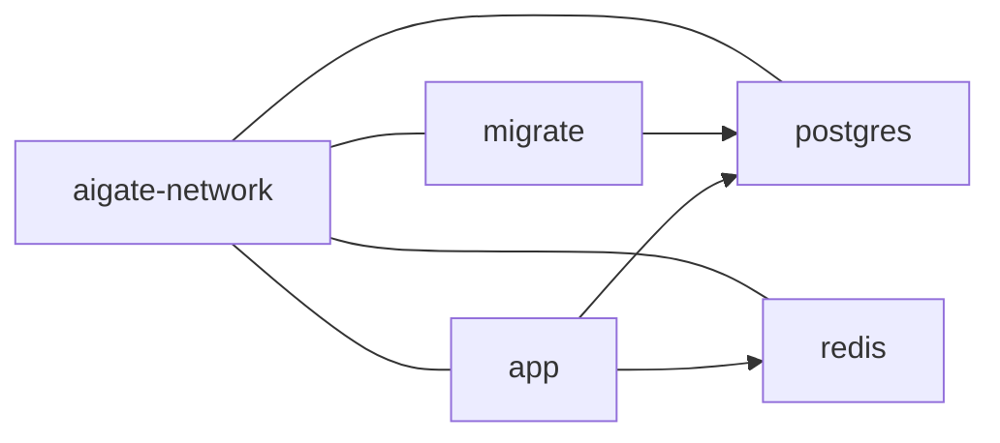
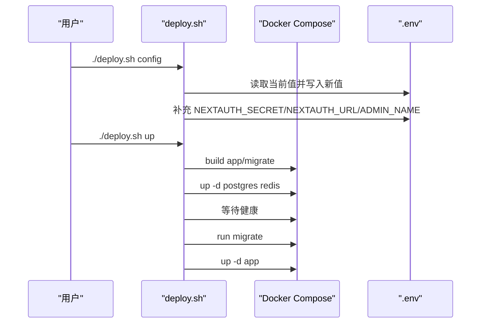
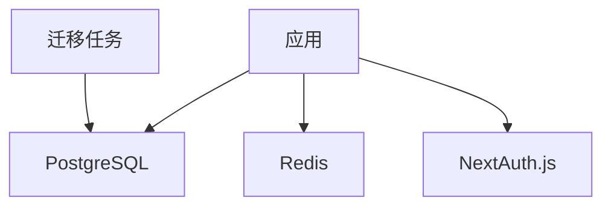

# 环境配置

<cite>
**本文引用的文件**
- [docker-compose.yml](file://docker-compose.yml)
- [Dockerfile](file://Dockerfile)
- [Dockerfile.migrate](file://Dockerfile.migrate)
- [deploy.sh](file://deploy.sh)
- [next.config.ts](file://next.config.ts)
- [drizzle.config.ts](file://drizzle.config.ts)
- [src/lib/drizzle.ts](file://src/lib/drizzle.ts)
- [src/lib/redis.ts](file://src/lib/redis.ts)
- [src/lib/schema.ts](file://src/lib/schema.ts)
- [src/lib/quota.ts](file://src/lib/quota.ts)
- [src/lib/provider-utils.ts](file://src/lib/provider-utils.ts)
- [src/server/api/routers/settings.ts](file://src/server/api/routers/settings.ts)
- [README.md](file://README.md)
</cite>

## 目录
1. [简介](#简介)
2. [项目结构](#项目结构)
3. [核心组件](#核心组件)
4. [架构总览](#架构总览)
5. [详细组件分析](#详细组件分析)
6. [依赖分析](#依赖分析)
7. [性能考虑](#性能考虑)
8. [故障排查指南](#故障排查指南)
9. [结论](#结论)
10. [附录](#附录)

## 简介
本指南面向运维与开发人员，系统性说明 AIGate 在生产环境中的环境变量配置、数据库与 Redis 的连接方式、AI 服务提供商密钥与安全设置、docker-compose 服务编排与网络依赖，并提供不同部署环境（开发、测试、生产）的最佳实践、配置模板与验证调试方法。

## 项目结构
AIGate 使用 Docker Compose 将应用、PostgreSQL、Redis 与一次性迁移任务编排为独立服务，通过共享网络互通；应用容器在生产模式下以独立可执行产物运行，数据库与缓存通过环境变量连接。

图表来源
- [docker-compose.yml](file://docker-compose.yml#L1-L87)

章节来源
- [docker-compose.yml](file://docker-compose.yml#L1-L87)
- [Dockerfile](file://Dockerfile#L1-L54)
- [Dockerfile.migrate](file://Dockerfile.migrate#L1-L200)

## 核心组件
- 应用容器（app）
  - 基于 Node.js 20 Alpine，使用 pnpm 安装依赖并构建 Next.js 应用。
  - 生产模式以独立可执行产物运行，端口通过环境变量配置。
- 数据库（postgres）
  - PostgreSQL 15 Alpine，健康检查通过 pg_isready。
  - 默认数据库名、用户名、密码来自环境变量，持久化数据卷。
- 缓存（redis）
  - Redis 7 Alpine，健康检查通过 redis-cli ping。
  - 数据持久化至命名卷。
- 迁移任务（migrate）
  - 基于 Dockerfile.migrate 构建，执行数据库迁移后退出。

章节来源
- [docker-compose.yml](file://docker-compose.yml#L1-L87)
- [Dockerfile](file://Dockerfile#L1-L54)
- [Dockerfile.migrate](file://Dockerfile.migrate#L1-L200)

## 架构总览
应用通过环境变量连接数据库与 Redis，使用 Drizzle ORM 与 postgres-js 访问数据库，使用 redis 客户端访问缓存；配额控制逻辑在内存缓存中进行，同时落库记录用量。

图表来源
- [src/lib/drizzle.ts](file://src/lib/drizzle.ts#L1-L12)
- [src/lib/redis.ts](file://src/lib/redis.ts#L1-L43)
- [src/lib/quota.ts](file://src/lib/quota.ts#L1-L327)

## 详细组件分析

### 数据库连接配置
- 连接字符串来源
  - 应用通过环境变量 DATABASE_URL 连接数据库。
  - 迁移任务同样使用 DATABASE_URL。
- 健康检查与依赖
  - 应用依赖数据库健康（service_healthy），迁移任务依赖数据库健康。
- 数据库初始化
  - 迁移任务容器在数据库健康后执行迁移，完成后退出（restart: no）。

图表来源
- [docker-compose.yml](file://docker-compose.yml#L16-L22)
- [drizzle.config.ts](file://drizzle.config.ts#L1-L11)
- [src/lib/drizzle.ts](file://src/lib/drizzle.ts#L1-L12)

章节来源
- [docker-compose.yml](file://docker-compose.yml#L16-L22)
- [drizzle.config.ts](file://drizzle.config.ts#L1-L11)
- [src/lib/drizzle.ts](file://src/lib/drizzle.ts#L1-L12)

### Redis 配置与键空间
- 连接
  - 应用通过环境变量 REDIS_URL 连接 Redis。
- 键空间设计
  - 用户每日配额使用量、每日请求次数、每分钟请求次数、用户策略缓存、API Key 配置缓存、请求日志等键名均通过 RedisKeys 生成器集中管理。
- 配额检查流程
  - 依据策略类型（Token/请求次数）与 RPM 限制进行检查，不足时记录日志并返回不允许。

图表来源
- [src/lib/quota.ts](file://src/lib/quota.ts#L78-L200)
- [src/lib/redis.ts](file://src/lib/redis.ts#L17-L43)

章节来源
- [src/lib/redis.ts](file://src/lib/redis.ts#L1-L43)
- [src/lib/quota.ts](file://src/lib/quota.ts#L1-L327)

### AI 服务提供商密钥与安全设置
- 提供商密钥存储
  - API Key 存储于数据库表 api_keys，字段包含提供商、密钥、基础 URL、状态等。
- 提供商映射
  - 提供商名称在内部与外部之间进行大小写与枚举转换，便于灵活对接。
- 安全与认证
  - NextAuth.js 作为认证后端，需要 NEXTAUTH_SECRET 与 NEXTAUTH_URL。
  - 管理员账户可通过管理后台接口批量重建，实现动态配置。

图表来源
- [src/lib/schema.ts](file://src/lib/schema.ts#L42-L52)
- [src/lib/provider-utils.ts](file://src/lib/provider-utils.ts#L1-L27)

章节来源
- [src/lib/schema.ts](file://src/lib/schema.ts#L1-L162)
- [src/lib/provider-utils.ts](file://src/lib/provider-utils.ts#L1-L27)
- [src/server/api/routers/settings.ts](file://src/server/api/routers/settings.ts#L1-L34)

### docker-compose 服务配置与网络
- 服务定义
  - app：构建参数 PORT，暴露端口，注入 DATABASE_URL 与 REDIS_URL，依赖数据库、缓存健康与迁移成功。
  - postgres：环境变量配置 DB/USER/PASSWORD，健康检查，持久化。
  - redis：环境变量配置端口，健康检查，持久化。
  - migrate：基于 Dockerfile.migrate，依赖数据库健康，执行后退出。
- 网络与卷
  - 共享网络 aigate-network，数据卷 postgres_data、redis_data。

图表来源
- [docker-compose.yml](file://docker-compose.yml#L1-L87)

章节来源
- [docker-compose.yml](file://docker-compose.yml#L1-L87)

### 部署脚本与环境变量交互
- 一键部署脚本 deploy.sh
  - 支持 up、update、down、restart、logs、migrate、status、config、clean 等命令。
  - config 子命令交互式收集管理员邮箱/密码、数据库 URL、Redis URL、应用端口、日志目录与级别，并补充 NEXTAUTH_SECRET、NEXTAUTH_URL、ADMIN_NAME。
  - up 命令按顺序拉取基础镜像、构建应用与迁移镜像、启动基础设施、等待健康、执行迁移并启动应用。
- 环境变量文件 .env
  - 由脚本读取与写入，部署时自动加载到容器。

图表来源
- [deploy.sh](file://deploy.sh#L91-L192)
- [deploy.sh](file://deploy.sh#L207-L273)

章节来源
- [deploy.sh](file://deploy.sh#L1-L382)
- [README.md](file://README.md#L14-L50)

## 依赖分析
- 应用对数据库与缓存的依赖
  - 数据库：通过 DATABASE_URL 连接，Drizzle ORM 与 postgres-js 访问。
  - 缓存：通过 REDIS_URL 连接，Redis 客户端负责配额与日志键。
- 迁移任务对数据库的依赖
  - 通过 DATABASE_URL 连接数据库，执行迁移后退出。
- 认证与会话
  - NextAuth.js 需要 NEXTAUTH_SECRET 与 NEXTAUTH_URL。

图表来源
- [src/lib/drizzle.ts](file://src/lib/drizzle.ts#L1-L12)
- [src/lib/redis.ts](file://src/lib/redis.ts#L1-L43)
- [drizzle.config.ts](file://drizzle.config.ts#L1-L11)
- [deploy.sh](file://deploy.sh#L177-L186)

章节来源
- [src/lib/drizzle.ts](file://src/lib/drizzle.ts#L1-L12)
- [src/lib/redis.ts](file://src/lib/redis.ts#L1-L43)
- [drizzle.config.ts](file://drizzle.config.ts#L1-L11)
- [deploy.sh](file://deploy.sh#L177-L186)

## 性能考虑
- Redis 键过期策略
  - 每日用量与请求计数键设置一周有效期，每分钟用量键设置较短窗口，避免长期占用内存。
- 连接池与预取
  - 数据库连接禁用预取以适配事务模式，减少潜在兼容问题。
- 构建与运行
  - 生产镜像使用独立可执行产物，降低启动延迟；端口通过 ARG/ENV 注入，便于横向扩展。

章节来源
- [src/lib/quota.ts](file://src/lib/quota.ts#L214-L229)
- [src/lib/drizzle.ts](file://src/lib/drizzle.ts#L7-L8)
- [Dockerfile](file://Dockerfile#L24-L54)

## 故障排查指南
- 数据库无法连接
  - 检查 DATABASE_URL 是否正确，确认 postgres 服务健康且端口映射正常。
  - 查看迁移任务日志，确认迁移是否成功。
- Redis 连接失败
  - 检查 REDIS_URL，确认 redis 服务健康且端口映射正常。
  - 观察应用日志中 Redis 客户端错误事件。
- 应用无法启动或端口异常
  - 检查 APP_PORT 与容器端口映射，确认主机端口未被占用。
  - 查看应用日志，定位启动阶段错误。
- 认证相关问题
  - 确认 NEXTAUTH_SECRET 与 NEXTAUTH_URL 已生成并写入 .env。
  - 如需重置管理员账户，使用管理后台接口重建管理员用户。
- 日志与调试
  - 使用 ./deploy.sh logs 实时查看应用日志。
  - 使用 ./deploy.sh status 查看服务状态。
  - 使用 ./deploy.sh migrate 单独执行迁移。

章节来源
- [docker-compose.yml](file://docker-compose.yml#L16-L22)
- [deploy.sh](file://deploy.sh#L308-L322)
- [src/server/api/routers/settings.ts](file://src/server/api/routers/settings.ts#L14-L34)

## 结论
AIGate 的环境配置围绕“环境变量 + docker-compose 编排 + 一键脚本”展开，具备清晰的数据库与缓存连接路径、完善的迁移流程与安全配置项。生产部署建议严格区分环境变量、最小权限与可观测性，结合本指南提供的模板与验证步骤，可快速稳定上线。

## 附录

### 环境变量清单与用途
- 数据库
  - DATABASE_URL：PostgreSQL 连接字符串（应用与迁移任务共用）
- 缓存
  - REDIS_URL：Redis 连接字符串
- 应用
  - APP_PORT：应用监听端口（默认 3000）
- 认证
  - NEXTAUTH_SECRET：NextAuth.js 会话密钥（脚本自动补全）
  - NEXTAUTH_URL：NextAuth.js 回调地址（脚本自动补全）
- 管理员账户
  - ADMIN_EMAIL / ADMIN_PASSWORD：管理员邮箱与密码（脚本交互式配置）
  - NEXT_PUBLIC_ADMIN_EMAIL / NEXT_PUBLIC_ADMIN_PASSWORD：前端可见的管理员账号（脚本交互式配置）
- 日志
  - LOG_DIR：日志目录（脚本交互式配置）
  - LOG_LEVEL：日志级别（脚本交互式配置）

章节来源
- [deploy.sh](file://deploy.sh#L91-L192)
- [deploy.sh](file://deploy.sh#L177-L186)
- [docker-compose.yml](file://docker-compose.yml#L12-L15)

### 不同部署环境的最佳实践
- 开发环境
  - 使用默认端口与本地回环地址，开启较低日志级别以便调试。
  - 可临时使用较短的 Redis 过期时间以加速测试。
- 测试环境
  - 与生产相同的环境变量命名，但使用独立数据库与缓存实例，隔离数据。
  - 通过脚本 update 命令进行快速迭代部署。
- 生产环境
  - 强制设置强密钥（NEXTAUTH_SECRET）、严格的日志级别与目录权限。
  - 使用独立的数据库与缓存实例，配置只读连接与备份策略。
  - 通过脚本 up 命令进行全量启动，确保迁移任务成功后再对外提供服务。

章节来源
- [deploy.sh](file://deploy.sh#L207-L273)
- [README.md](file://README.md#L14-L50)

### 配置模板与示例
- .env 示例（字段与含义见上节）
  - DATABASE_URL=postgresql://<user>:<password>@postgres:5432/<dbname>
  - REDIS_URL=redis://redis:6379
  - APP_PORT=3000
  - NEXTAUTH_SECRET=<随机强密钥>
  - NEXTAUTH_URL=http://localhost:3000
  - ADMIN_EMAIL=admin@example.com
  - ADMIN_PASSWORD=******
  - LOG_DIR=./logs
  - LOG_LEVEL=info
- docker-compose.yml 示例片段
  - app 服务注入 DATABASE_URL 与 REDIS_URL，并声明对 postgres、redis、migrate 的依赖条件。
  - postgres/redis 健康检查与持久化卷配置。

章节来源
- [docker-compose.yml](file://docker-compose.yml#L12-L22)
- [deploy.sh](file://deploy.sh#L91-L192)

### 配置验证与调试方法
- 验证数据库
  - 使用 docker compose exec 进入容器，验证 pg_isready 与 psql 连接。
- 验证缓存
  - 使用 docker compose exec 进入容器，验证 redis-cli ping。
- 验证应用
  - 使用 curl 访问 /api/v1/chat/completions（参考 README 的 API 示例）。
  - 查看应用日志与容器健康状态。
- 迁移验证
  - 使用 ./deploy.sh migrate 单独执行迁移，观察输出与数据库表结构变化。

章节来源
- [docker-compose.yml](file://docker-compose.yml#L39-L43)
- [docker-compose.yml](file://docker-compose.yml#L56-L60)
- [README.md](file://README.md#L52-L68)
- [deploy.sh](file://deploy.sh#L312-L317)