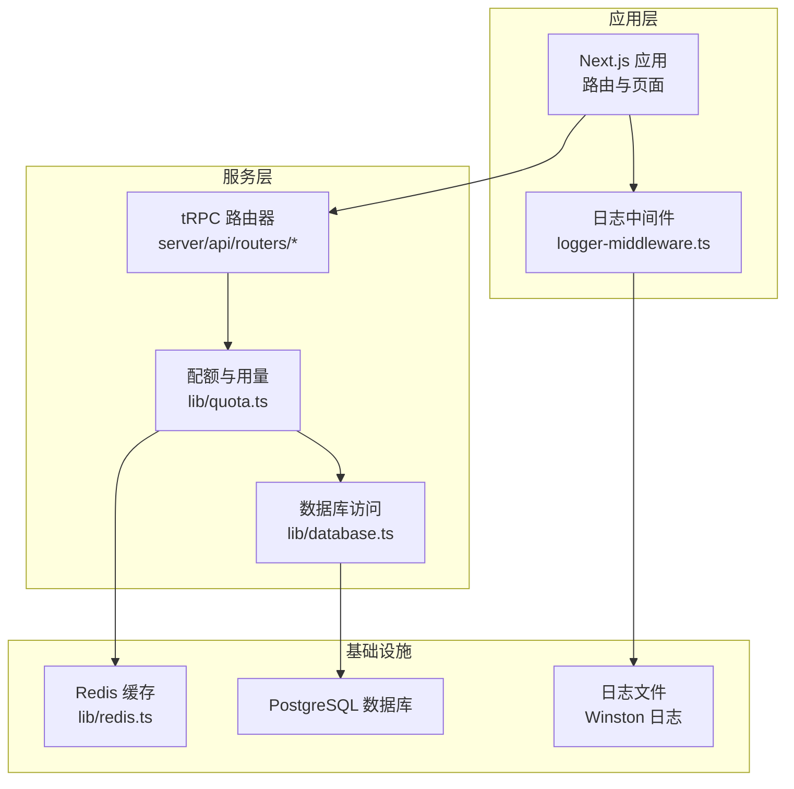
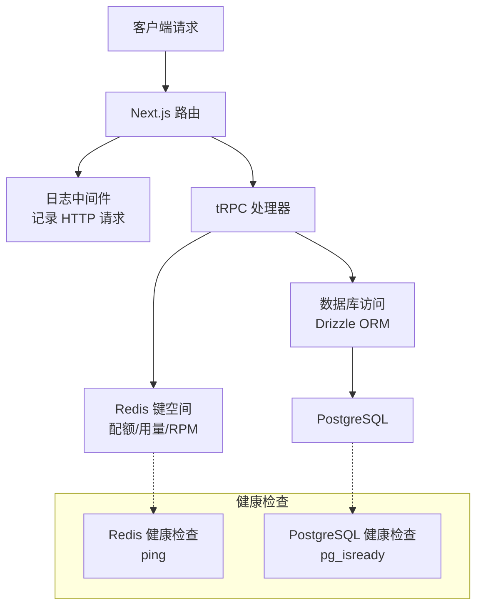
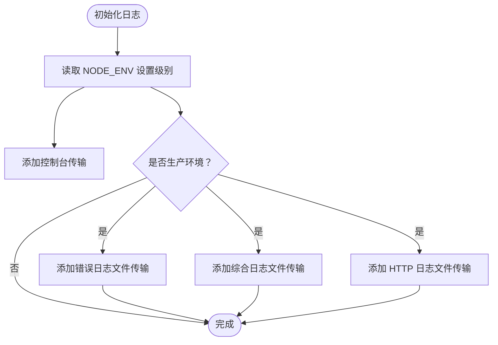
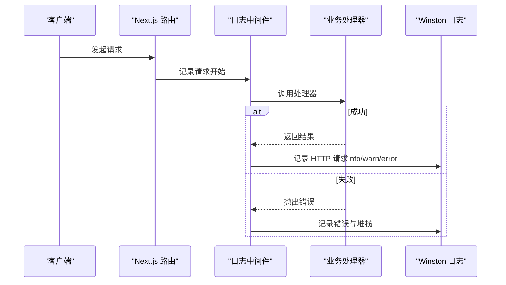
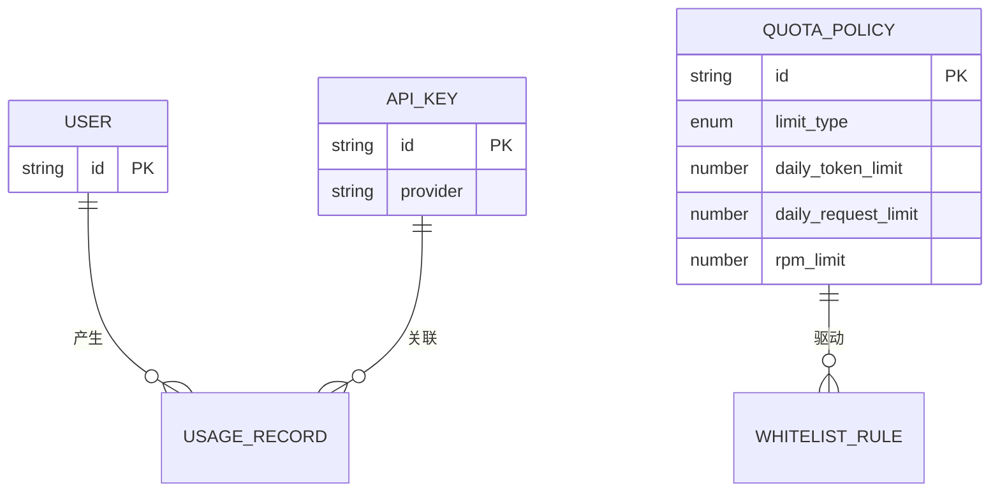
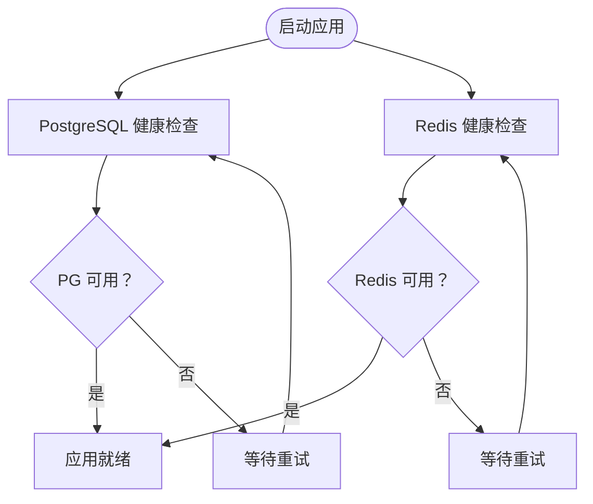
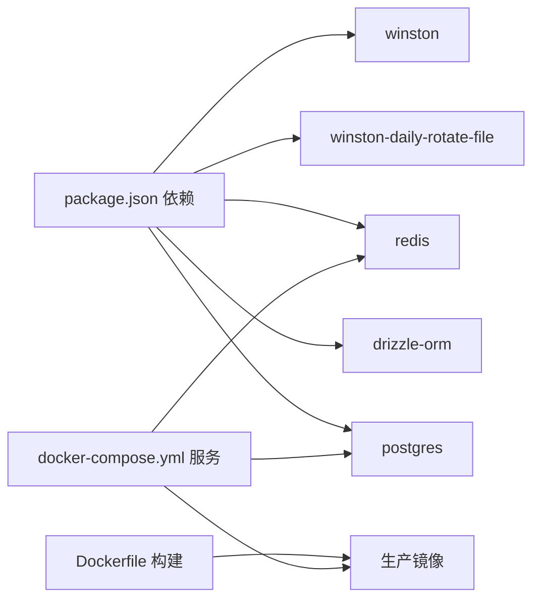

# 监控与维护

<cite>
**本文引用的文件**
- [src/lib/logger.ts](file://src/lib/logger.ts)
- [src/lib/logger-middleware.ts](file://src/lib/logger-middleware.ts)
- [src/lib/redis.ts](file://src/lib/redis.ts)
- [src/lib/quota.ts](file://src/lib/quota.ts)
- [src/lib/database.ts](file://src/lib/database.ts)
- [src/lib/types.ts](file://src/lib/types.ts)
- [package.json](file://package.json)
- [docker-compose.yml](file://docker-compose.yml)
- [Dockerfile](file://Dockerfile)
</cite>

## 目录
1. [简介](#简介)
2. [项目结构](#项目结构)
3. [核心组件](#核心组件)
4. [架构总览](#架构总览)
5. [详细组件分析](#详细组件分析)
6. [依赖关系分析](#依赖关系分析)
7. [性能考量](#性能考量)
8. [故障排除指南](#故障排除指南)
9. [结论](#结论)
10. [附录](#附录)

## 简介
本指南面向 AIGate 的运维与开发团队，提供一套完整的监控与维护实践，覆盖以下主题：
- 日志系统：Winston 配置、日志级别、文件轮转策略与中间件集成
- Redis 缓存：键空间设计、命中率监控、内存与连接池管理
- 健康检查：数据库与 Redis 的容器健康检查配置
- 异常处理：数据库访问与业务流程中的错误捕获与日志记录
- 故障排除与性能调优：常见问题定位与优化建议

## 项目结构
AIGate 采用 Next.js 16 服务端渲染与 tRPC 接口，后端数据层基于 Drizzle ORM 连接 PostgreSQL，缓存层使用 Redis。监控与维护相关的关键模块集中在 src/lib 下，包括日志、Redis 客户端、配额与用量统计逻辑以及数据库访问封装。

图表来源
- [src/lib/logger-middleware.ts](file://src/lib/logger-middleware.ts#L1-L138)
- [src/lib/quota.ts](file://src/lib/quota.ts#L1-L327)
- [src/lib/redis.ts](file://src/lib/redis.ts#L1-L43)
- [src/lib/database.ts](file://src/lib/database.ts#L1-L692)

章节来源
- [src/lib/logger.ts](file://src/lib/logger.ts#L1-L184)
- [src/lib/logger-middleware.ts](file://src/lib/logger-middleware.ts#L1-L138)
- [src/lib/redis.ts](file://src/lib/redis.ts#L1-L43)
- [src/lib/quota.ts](file://src/lib/quota.ts#L1-L327)
- [src/lib/database.ts](file://src/lib/database.ts#L1-L692)

## 核心组件
- 日志系统（Winston）：统一日志格式、级别与文件轮转；提供便捷方法记录配额、AI 请求与认证事件。
- 日志中间件：自动记录 HTTP 请求状态码、耗时、UA、Referer、IP 等；对 API 路由提供操作级日志包装。
- Redis 缓存：集中存储每日用量、每分钟请求计数、策略缓存与请求日志；提供键空间与过期策略。
- 数据库访问：Drizzle ORM 封装常用 CRUD 与聚合统计；异常捕获与降级返回。
- 健康检查：Docker Compose 中为 PostgreSQL 与 Redis 提供健康检查，确保服务可用性。

章节来源
- [src/lib/logger.ts](file://src/lib/logger.ts#L1-L184)
- [src/lib/logger-middleware.ts](file://src/lib/logger-middleware.ts#L1-L138)
- [src/lib/redis.ts](file://src/lib/redis.ts#L1-L43)
- [src/lib/database.ts](file://src/lib/database.ts#L1-L692)

## 架构总览
下图展示日志、缓存与数据库在系统中的交互路径，以及健康检查与部署配置。

图表来源
- [src/lib/logger-middleware.ts](file://src/lib/logger-middleware.ts#L1-L138)
- [src/lib/quota.ts](file://src/lib/quota.ts#L78-L200)
- [src/lib/redis.ts](file://src/lib/redis.ts#L1-L43)
- [src/lib/database.ts](file://src/lib/database.ts#L1-L692)
- [docker-compose.yml](file://docker-compose.yml#L39-L60)

## 详细组件分析

### 日志系统（Winston）
- 日志级别：自定义 error、warn、info、http、debug 五级，开发环境默认 debug，生产环境默认 info。
- 输出目标：控制台始终输出；生产环境额外输出三类文件：错误日志、综合日志、HTTP 日志。
- 文件轮转：按日期轮转，错误日志最大 20MB、保留 30 天；综合日志最大 50MB、保留 30 天；HTTP 日志最大 50MB、保留 14 天。
- 格式化：控制台彩色时间戳与级别；文件输出 JSON 格式便于采集与检索。
- 环境变量：NODE_ENV 控制级别；LOG_DIR 控制日志目录，默认为项目根目录 logs 子目录。
- 便捷方法：提供 logError、logWarn、logInfo、logDebug、logHttp，以及配额、AI 请求、认证专用日志方法。

图表来源
- [src/lib/logger.ts](file://src/lib/logger.ts#L14-L91)

章节来源
- [src/lib/logger.ts](file://src/lib/logger.ts#L1-L184)

### 日志中间件与 API 包装
- HTTP 请求日志：记录 method、url、pathname、statusCode、duration、userAgent、referer、ip、timestamp，并按状态码选择 error/warn/http 级别。
- API 操作日志包装：withLogging 在操作开始、成功、失败三个阶段分别记录，包含耗时与错误堆栈，便于追踪。
- 业务日志：提供配额检查/更新/重置/超限、AI 请求、认证等专用日志方法，统一字段与级别。

图表来源
- [src/lib/logger-middleware.ts](file://src/lib/logger-middleware.ts#L5-L29)
- [src/lib/logger-middleware.ts](file://src/lib/logger-middleware.ts#L32-L67)

章节来源
- [src/lib/logger-middleware.ts](file://src/lib/logger-middleware.ts#L1-L138)

### Redis 缓存监控与性能优化
- 键空间设计：
  - 用户每日配额：user_quota:{userId}:{date}:{apiKey}
  - 用户每日请求次数：user_requests:{userId}:{date}:{apiKey}
  - 用户每分钟请求次数：user_rpm:{userId}:{apiKey}:{YYYY-MM-DD:HH:MM}
  - 用户策略缓存：user_policy:{userId}
  - API Key 配置缓存：api_keys:{provider}
  - 按 API Key 获取配额策略：policy:apiKey:{apiKeyId}
  - 请求日志：request_log:{apiKey}:{requestId}
- 过期策略：
  - 日用量与日请求数：7 天过期
  - 每分钟请求计数：2 分钟过期
  - 请求日志：24 小时过期
- 监控指标建议：
  - 命中率：通过 INFO 命令查看 keyspace hits/misses，计算命中率 = hits/(hits+misses)
  - 内存使用：INFO memory 查看 used_memory、used_memory_rss、fragmentation_ratio
  - 连接数：INFO clients 查看 connected_clients、blocked_clients
  - 慢查询：CONFIG GET slowlog-*，结合业务日志定位慢键
- 优化建议：
  - 合理设置过期时间，避免长期占用内存
  - 使用 pipeline 批量写入（如 incrBy/increments）
  - 将热点策略放入短期缓存（如策略缓存 1 小时）
  - 监控内存峰值，必要时调整 maxmemory 与淘汰策略

图表来源
- [src/lib/types.ts](file://src/lib/types.ts#L4-L17)
- [src/lib/database.ts](file://src/lib/database.ts#L280-L290)

章节来源
- [src/lib/redis.ts](file://src/lib/redis.ts#L17-L43)
- [src/lib/quota.ts](file://src/lib/quota.ts#L18-L57)
- [src/lib/quota.ts](file://src/lib/quota.ts#L202-L260)

### 健康检查与数据库连接监控
- Docker Compose 健康检查：
  - PostgreSQL：使用 pg_isready 命令检测数据库可用性
  - Redis：使用 redis-cli ping 检测连接可用性
- 数据库访问封装：
  - 所有数据库操作均在 try/catch 中执行，失败时记录错误并返回空或默认值，避免中断流程
  - 统一使用 Drizzle ORM，支持并发统计查询（Promise.all）

图表来源
- [docker-compose.yml](file://docker-compose.yml#L39-L60)
- [src/lib/database.ts](file://src/lib/database.ts#L20-L81)

章节来源
- [docker-compose.yml](file://docker-compose.yml#L1-L87)
- [src/lib/database.ts](file://src/lib/database.ts#L1-L692)

### 异常处理机制
- 日志记录：所有错误通过 Winston 记录，包含错误消息与堆栈，便于快速定位
- 数据库异常：捕获错误并返回安全默认值，避免前端崩溃
- 业务异常：配额检查失败、用量记录失败等场景均有明确错误日志与降级处理

章节来源
- [src/lib/logger.ts](file://src/lib/logger.ts#L104-L184)
- [src/lib/logger-middleware.ts](file://src/lib/logger-middleware.ts#L54-L66)
- [src/lib/database.ts](file://src/lib/database.ts#L224-L277)

## 依赖关系分析
- 运行时依赖：Winston 与 winston-daily-rotate-file 用于日志；Redis 客户端用于缓存；Drizzle ORM 与 PostgreSQL 驱动用于数据库
- 部署依赖：Dockerfile 与 docker-compose.yml 定义镜像构建、运行参数与服务编排

图表来源
- [package.json](file://package.json#L18-L68)
- [Dockerfile](file://Dockerfile#L1-L54)
- [docker-compose.yml](file://docker-compose.yml#L1-L87)

章节来源
- [package.json](file://package.json#L1-L90)
- [Dockerfile](file://Dockerfile#L1-L54)
- [docker-compose.yml](file://docker-compose.yml#L1-L87)

## 性能考量
- 日志性能：
  - 生产环境仅输出文件日志，减少控制台 I/O 开销
  - 文件轮转大小与保留天数平衡磁盘占用与查询效率
- Redis 性能：
  - 合理设置过期时间，避免内存膨胀
  - 使用 pipeline 批量写入，降低网络往返
  - 监控慢查询与内存碎片，及时优化键设计
- 数据库性能：
  - 并发统计查询使用 Promise.all，减少串行等待
  - 聚合查询尽量使用索引列（如 timestamp、userId）

[本节为通用指导，不直接分析具体文件]

## 故障排除指南
- 日志无法输出或目录不存在
  - 检查 LOG_DIR 环境变量与目录权限
  - 确认生产环境已启用文件传输
- Redis 连接失败
  - 检查 REDIS_URL 环境变量
  - 使用 docker-compose 健康检查确认 Redis 可达
- 数据库连接失败
  - 检查 DATABASE_URL 与数据库健康状态
  - 关注数据库访问封装中的错误日志
- 配额检查异常
  - 查看配额相关日志（quota:check/quota:exceeded）
  - 确认 Redis 中对应键是否存在与过期时间是否正确
- 性能问题
  - 使用 Redis INFO 命令查看命中率、内存与连接数
  - 结合日志中间件记录的耗时定位慢接口

章节来源
- [src/lib/logger.ts](file://src/lib/logger.ts#L44-L91)
- [src/lib/redis.ts](file://src/lib/redis.ts#L3-L13)
- [src/lib/database.ts](file://src/lib/database.ts#L20-L81)
- [src/lib/quota.ts](file://src/lib/quota.ts#L176-L182)
- [docker-compose.yml](file://docker-compose.yml#L39-L60)

## 结论
通过统一的日志体系、精细化的 Redis 键空间设计与数据库访问封装，AIGate 在可观测性与稳定性方面具备良好基础。建议在生产环境中持续关注日志轮转、Redis 命中率与内存使用、数据库慢查询与连接池状态，并结合健康检查与告警机制，形成闭环的监控与维护流程。

[本节为总结性内容，不直接分析具体文件]

## 附录
- 环境变量参考
  - NODE_ENV：控制日志级别（development/debug；production/info）
  - LOG_DIR：日志目录（默认 ./logs）
  - REDIS_URL：Redis 连接地址
  - DATABASE_URL：PostgreSQL 连接地址
- 健康检查命令
  - Redis：redis-cli ping
  - PostgreSQL：pg_isready

章节来源
- [src/lib/logger.ts](file://src/lib/logger.ts#L15-L45)
- [src/lib/redis.ts](file://src/lib/redis.ts#L3-L5)
- [docker-compose.yml](file://docker-compose.yml#L39-L60)