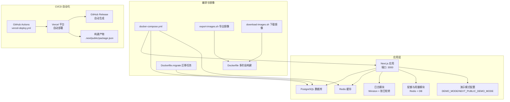
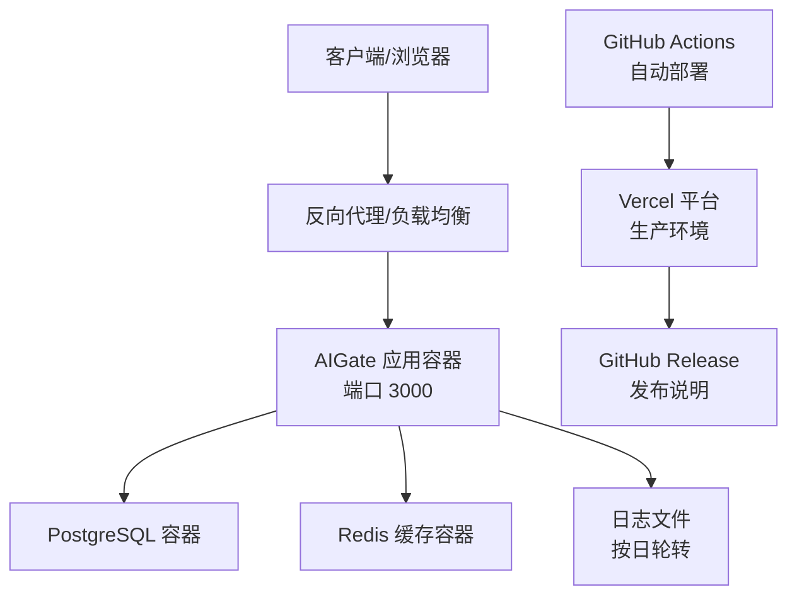
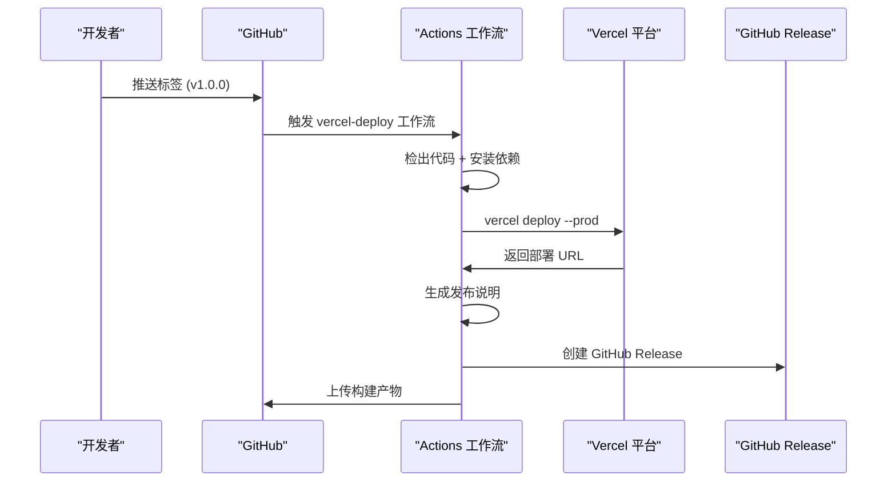
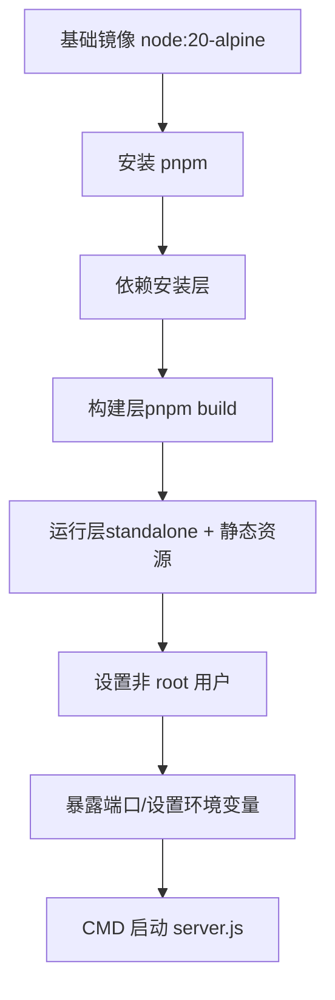
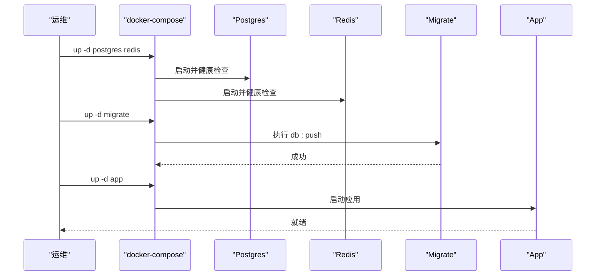
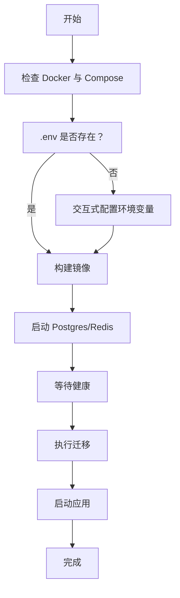
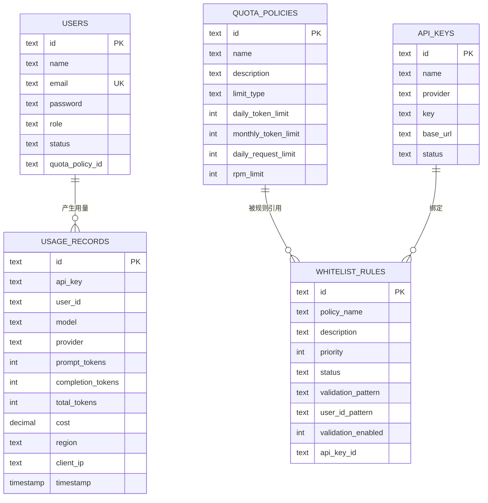
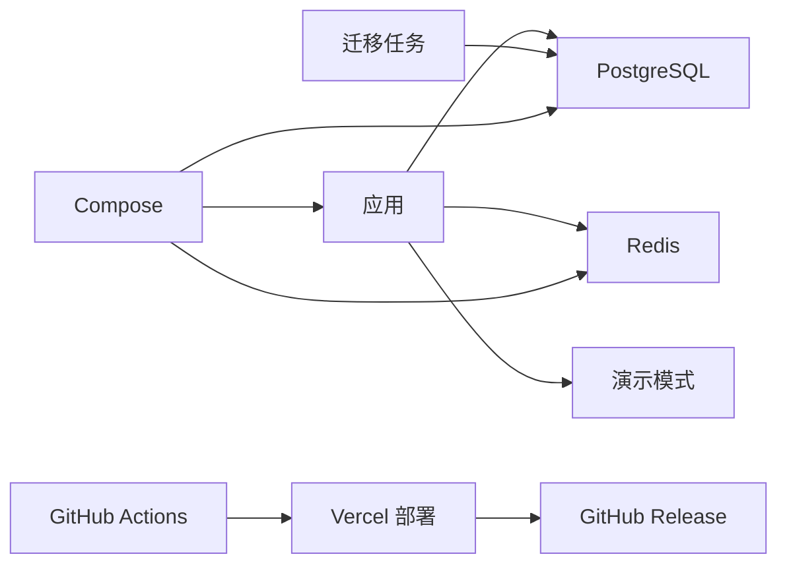

# 部署与运维

<cite>
**本文引用的文件**
- [.github/workflows/vercel-deploy.yml](file://.github/workflows/vercel-deploy.yml)
- [vercel.json](file://vercel.json)
- [package.json](file://package.json)
- [src/lib/demo-config.ts](file://src/lib/demo-config.ts)
- [src/app/login/page.tsx](file://src/app/login/page.tsx)
- [src/lib/logger.ts](file://src/lib/logger.ts)
- [Dockerfile](file://Dockerfile)
- [Dockerfile.migrate](file://Dockerfile.migrate)
- [docker-compose.yml](file://docker-compose.yml)
- [deploy.sh](file://deploy.sh)
- [download-images.sh](file://download-images.sh)
- [export-images.sh](file://export-images.sh)
- [next.config.ts](file://next.config.ts)
- [drizzle.config.ts](file://drizzle.config.ts)
- [src/lib/database.ts](file://src/lib/database.ts)
- [src/lib/schema.ts](file://src/lib/schema.ts)
- [src/lib/init-admin.ts](file://src/lib/init-admin.ts)
- [src/lib/redis.ts](file://src/lib/redis.ts)
- [src/lib/quota.ts](file://src/lib/quota.ts)
- [src/lib/cors.ts](file://src/lib/cors.ts)
</cite>

## 目录
1. [简介](#简介)
2. [项目结构](#项目结构)
3. [核心组件](#核心组件)
4. [架构总览](#架构总览)
5. [详细组件分析](#详细组件分析)
6. [依赖关系分析](#依赖关系分析)
7. [性能考虑](#性能考虑)
8. [故障排除指南](#故障排除指南)
9. [结论](#结论)
10. [附录](#附录)

## 简介
本指南面向 AIGate 的部署与运维团队，覆盖容器化部署、一键部署脚本工作原理、生产环境最佳实践（环境变量、健康检查、日志管理、性能调优）、故障排除、备份恢复、监控告警以及版本升级、数据库迁移与滚动更新流程。**新增** GitHub Actions 自动化部署系统，包括 Vercel 部署工作流、环境变量管理和 CI/CD 流程优化。文档基于仓库中的 Dockerfile、docker-compose.yml、部署脚本与应用内日志、数据库、配额与缓存等实现进行梳理与总结。

## 项目结构
AIGate 采用 Next.js 16 应用配合 Drizzle ORM、PostgreSQL 与 Redis 的架构。部署层通过 Docker 多阶段构建与 Compose 编排，提供一键部署脚本与镜像导出/导入能力，便于离线或受限网络环境部署。**新增** GitHub Actions 工作流实现自动化部署到 Vercel 平台。



**图表来源**
- [Dockerfile:1-54](file://Dockerfile#L1-L54)
- [Dockerfile.migrate:1-14](file://Dockerfile.migrate#L1-L14)
- [.github/workflows/vercel-deploy.yml:1-135](file://.github/workflows/vercel-deploy.yml#L1-L135)
- [vercel.json:1-6](file://vercel.json#L1-L6)

**章节来源**
- [Dockerfile:1-54](file://Dockerfile#L1-L54)
- [Dockerfile.migrate:1-14](file://Dockerfile.migrate#L1-L14)
- [docker-compose.yml:1-87](file://docker-compose.yml#L1-L87)
- [export-images.sh:1-49](file://export-images.sh#L1-L49)
- [download-images.sh:1-35](file://download-images.sh#L1-L35)
- [.github/workflows/vercel-deploy.yml:1-135](file://.github/workflows/vercel-deploy.yml#L1-L135)
- [vercel.json:1-6](file://vercel.json#L1-L6)

## 核心组件
- 容器镜像与多阶段构建：应用镜像基于 node:20-alpine，启用 pnpm、禁用 Telemetry，构建后输出独立可运行的 Next.js standalone，再在运行阶段复制静态资源与 standalone 目录，设置非 root 用户运行，暴露端口并通过环境变量控制。
- Compose 编排：定义 app、postgres、redis、migrate 四类服务，postgres 与 redis 提供健康检查，migrate 作为一次性任务在数据库初始化后执行，app 依赖数据库与缓存健康状态并完成数据库迁移后再启动。
- 一键部署脚本：封装依赖检查、镜像拉取/构建、基础设施启动、迁移执行、应用启动、日志查看、状态查询、清理等常用运维动作，支持交互式配置环境变量。
- **GitHub Actions 自动化部署**：基于标签触发的 Vercel 部署工作流，自动构建、部署到生产环境，生成发布说明并上传构建产物。
- 日志系统：Winston 控制台输出 + 生产环境按日轮转文件输出（错误、HTTP、综合），支持 LOG_DIR 与 LOG_LEVEL 环境变量。**新增** 演示模式下完全禁用日志输出。
- 数据与配额：Drizzle ORM + PostgreSQL 存储用户、API Key、用量记录、白名单规则与配额策略；Redis 缓存配额策略与每日用量、RPM 等，提升高并发场景下的响应速度。
- **演示模式配置**：通过 DEMO_MODE 和 NEXT_PUBLIC_DEMO_MODE 环境变量控制，提供演示账号、只读模式、自动重置等功能。
- CORS：统一设置 Access-Control 响应头，支持凭据传输与预检缓存。

**章节来源**
- [Dockerfile:1-54](file://Dockerfile#L1-L54)
- [docker-compose.yml:1-87](file://docker-compose.yml#L1-L87)
- [deploy.sh:1-382](file://deploy.sh#L1-L382)
- [.github/workflows/vercel-deploy.yml:1-135](file://.github/workflows/vercel-deploy.yml#L1-L135)
- [src/lib/logger.ts:1-192](file://src/lib/logger.ts#L1-L192)
- [src/lib/demo-config.ts:1-57](file://src/lib/demo-config.ts#L1-L57)
- [src/lib/database.ts:1-692](file://src/lib/database.ts#L1-L692)
- [src/lib/schema.ts:1-162](file://src/lib/schema.ts#L1-L162)
- [src/lib/redis.ts:1-43](file://src/lib/redis.ts#L1-L43)
- [src/lib/quota.ts:1-327](file://src/lib/quota.ts#L1-L327)
- [src/lib/cors.ts:1-54](file://src/lib/cors.ts#L1-L54)

## 架构总览
下图展示生产环境典型拓扑：客户端通过反向代理或直接访问应用，应用与 PostgreSQL、Redis 通信，日志按天轮转，迁移任务在首次部署或升级时执行。**新增** GitHub Actions 自动化部署流程，支持标签触发的 Vercel 部署。



**图表来源**
- [docker-compose.yml:1-87](file://docker-compose.yml#L1-L87)
- [src/lib/logger.ts:56-91](file://src/lib/logger.ts#L56-L91)
- [.github/workflows/vercel-deploy.yml:1-135](file://.github/workflows/vercel-deploy.yml#L1-L135)

## 详细组件分析

### GitHub Actions 自动化部署系统

**新增** AIGate 现已集成完整的 GitHub Actions 自动化部署系统，实现从代码提交到生产部署的全流程自动化。

#### 工作流触发机制
- **触发条件**：当推送标签时触发（支持 v*.*.* 和 release-* 格式）
- **运行环境**：ubuntu-latest 虚拟机，Node.js 20.x，pnpm 9.x
- **演示模式**：默认启用 NEXT_PUBLIC_DEMO_MODE 环境变量

#### 核心步骤流程
1. **代码检出**：获取完整历史记录，支持版本回溯
2. **依赖安装**：设置 pnpm 缓存，安装 Vercel CLI
3. **构建部署**：使用 vercel deploy 命令部署到生产环境
4. **发布管理**：自动生成发布说明并创建 GitHub Release
5. **产物保存**：上传构建产物到 GitHub Artifacts



**图表来源**
- [.github/workflows/vercel-deploy.yml:3-7](file://.github/workflows/vercel-deploy.yml#L3-L7)
- [.github/workflows/vercel-deploy.yml:51-70](file://.github/workflows/vercel-deploy.yml#L51-L70)
- [.github/workflows/vercel-deploy.yml:108-117](file://.github/workflows/vercel-deploy.yml#L108-L117)

#### 环境变量管理
工作流中管理的关键环境变量：
- **必需密钥**：VERCEL_TOKEN、VERCEL_ORG_ID、VERCEL_PROJECT_ID
- **数据库配置**：DATABASE_URL、REDIS_URL
- **演示模式**：NEXT_PUBLIC_DEMO_MODE=true、DEMO_MODE=true
- **平台配置**：VERCEL 环境变量由 Vercel 自动注入

#### 发布说明自动生成
工作流自动生成详细的发布说明，包含：
- 部署信息：Demo 地址、部署时间、构建状态
- 更新内容：自动化部署流程优化、Demo 模式配置完善
- 访问方式：演示账号信息
- 构建信息：Node.js 版本、构建工具、部署平台

**章节来源**
- [.github/workflows/vercel-deploy.yml:1-135](file://.github/workflows/vercel-deploy.yml#L1-L135)
- [vercel.json:1-6](file://vercel.json#L1-L6)

### Docker 容器化与多阶段构建
- 分层目标：基础镜像准备 pnpm；依赖安装层；构建层；运行层（standalone 输出）。
- 运行安全：创建非 root 用户 nextjs 并以该用户运行；暴露端口通过 ARG/ENV 注入。
- Next.js 独立运行：依赖 next.config.ts 的 output: 'standalone'，构建后复制 .next/standalone 与 .next/static 到根目录，CMD 启动 server.js。
- 迁移镜像：仅安装依赖与 drizzle 配置/Schema，执行 db:push 命令。



**图表来源**
- [Dockerfile:1-54](file://Dockerfile#L1-L54)
- [next.config.ts:1-9](file://next.config.ts#L1-L9)

**章节来源**
- [Dockerfile:1-54](file://Dockerfile#L1-L54)
- [next.config.ts:1-9](file://next.config.ts#L1-L9)

### docker-compose 编排与健康检查
- 服务定义：app、postgres、redis、migrate。
- 环境变量：DATABASE_URL、REDIS_URL、PORT、APP_PORT 等通过环境变量注入。
- 健康检查：postgres 使用 pg_isready；redis 使用 redis-cli ping。
- 依赖顺序：app 依赖 postgres 与 redis 健康，且等待 migrate 成功后启动。
- 数据卷：postgres_data、redis_data 持久化数据。



**图表来源**
- [docker-compose.yml:1-87](file://docker-compose.yml#L1-L87)
- [Dockerfile.migrate:1-14](file://Dockerfile.migrate#L1-L14)

**章节来源**
- [docker-compose.yml:1-87](file://docker-compose.yml#L1-L87)
- [Dockerfile.migrate:1-14](file://Dockerfile.migrate#L1-L14)

### 一键部署脚本工作原理与使用
- 功能清单：up（首次部署/全量启动）、update（重建+迁移+重启）、down/restart/logs/migrate/status/config/clean。
- 依赖检查：Docker 与 Docker Compose V2。
- 镜像管理：预拉取基础镜像，构建应用镜像，避免远程检查。
- 基础设施：先启动 postgres 与 redis，等待健康，再执行迁移并启动应用。
- 交互式配置：支持编辑 ADMIN_EMAIL、ADMIN_PASSWORD、DATABASE_URL、REDIS_URL、APP_PORT、LOG_DIR、LOG_LEVEL 等，并自动补齐 NEXTAUTH_SECRET、NEXTAUTH_URL、ADMIN_NAME。
- 日志与状态：提供 logs 与 status 快捷命令；clean 谨慎使用，会删除数据卷。



**图表来源**
- [deploy.sh:1-382](file://deploy.sh#L1-L382)

**章节来源**
- [deploy.sh:1-382](file://deploy.sh#L1-L382)

### 镜像导出/导入与离线部署
- export-images.sh：构建并导出应用镜像与基础镜像到 docker-images 目录，提供加载与启动说明。
- download-images.sh：批量拉取并保存基础镜像为 tar 文件，便于离线环境导入。

**章节来源**
- [export-images.sh:1-49](file://export-images.sh#L1-L49)
- [download-images.sh:1-35](file://download-images.sh#L1-L35)

### 环境变量与配置要点
- 应用端口：APP_PORT（默认 3000），通过环境变量 PORT 注入容器。
- 数据库：DATABASE_URL（PostgreSQL 连接串），迁移镜像同样使用该变量。
- 缓存：REDIS_URL（Redis 连接串）。
- 认证：NEXTAUTH_SECRET、NEXTAUTH_URL、ADMIN_NAME。
- 管理员：ADMIN_EMAIL、ADMIN_PASSWORD、ADMIN_NAME。
- **演示模式**：DEMO_MODE、NEXT_PUBLIC_DEMO_MODE 控制演示功能启用。
- 日志：LOG_DIR（默认 logs）、LOG_LEVEL（开发默认 debug，生产默认 info）。
- **Vercel 集成**：VERCEL、VERCEL_URL 等环境变量由 Vercel 自动注入。
- 其他：NODE_ENV=production（运行阶段设置）。

**章节来源**
- [docker-compose.yml:12-14](file://docker-compose.yml#L12-L14)
- [Dockerfile:28-29](file://Dockerfile#L28-L29)
- [deploy.sh:92-192](file://deploy.sh#L92-L192)
- [src/lib/logger.ts:14-18](file://src/lib/logger.ts#L14-L18)
- [src/lib/demo-config.ts:7-9](file://src/lib/demo-config.ts#L7-L9)
- [vercel.json:2-4](file://vercel.json#L2-L4)

### 健康检查与可观测性
- Postgres 健康检查：pg_isready，间隔与重试次数合理，适合 Compose 等编排工具。
- Redis 健康检查：redis-cli ping。
- 应用健康：建议在生产环境增加 HTTP 探针（如 GET /health），结合容器健康检查与编排工具实现自动重启与流量摘除。
- **演示模式日志**：演示模式下完全禁用日志输出，避免敏感信息泄露。

**章节来源**
- [docker-compose.yml:39-43](file://docker-compose.yml#L39-L43)
- [docker-compose.yml:56-60](file://docker-compose.yml#L56-L60)
- [src/lib/logger.ts:20-21](file://src/lib/logger.ts#L20-L21)

### 日志管理与性能
- 控制台输出：开发环境彩色输出，便于本地调试。
- 文件输出：生产环境按日轮转，分别记录 error、combined、http 三类日志，支持 LOG_DIR 与 LOG_LEVEL 调整。
- **演示模式优化**：演示模式下完全禁用日志输出，减少性能开销。
- 性能建议：日志级别在生产环境建议 info 或更高；按需开启 http 分类日志；定期清理旧日志，避免磁盘膨胀。

**章节来源**
- [src/lib/logger.ts:56-91](file://src/lib/logger.ts#L56-L91)
- [src/lib/logger.ts:20-21](file://src/lib/logger.ts#L20-L21)

### 数据库与配额缓存
- 数据模型：用户、API Key、用量记录、白名单规则、配额策略、NextAuth 相关表。
- 迁移：通过 drizzle.config.ts 指定 schema 与输出目录，迁移脚本执行 db:push。
- 配额策略：Redis 缓存策略与每日用量/RPM，降低数据库压力；用量记录异步写入数据库，保证高吞吐。



**图表来源**
- [src/lib/schema.ts:28-98](file://src/lib/schema.ts#L28-L98)

**章节来源**
- [src/lib/schema.ts:1-162](file://src/lib/schema.ts#L1-L162)
- [drizzle.config.ts:1-11](file://drizzle.config.ts#L1-L11)
- [src/lib/database.ts:1-692](file://src/lib/database.ts#L1-L692)
- [src/lib/quota.ts:1-327](file://src/lib/quota.ts#L1-L327)

### 演示模式配置与安全
**新增** AIGate 现已集成完整的演示模式系统，支持多种演示场景：

#### 演示模式特性
- **自动检测**：通过 DEMO_MODE 和 NEXT_PUBLIC_DEMO_MODE 环境变量控制
- **演示账号**：内置演示用户和默认凭据（demo@example.com/demo123）
- **只读模式**：默认限制写入和删除操作
- **自动重置**：支持定时重置演示数据
- **操作拦截**：对受限制操作提供明确的用户提示

#### 登录页面集成
演示模式下登录页面会自动填充演示账号信息，简化演示体验。

#### 权限控制
```typescript
// 演示模式下的权限检查
export const checkDemoPermission = (action: 'read' | 'write' | 'delete'): boolean => {
  if (!isDemoMode()) return true;
  
  // 默认允许读取操作
  if (action === 'read') return true;
  
  // 允许修改时才放行写入/删除
  if (demoConfig.allowMutations && (action === 'write' || action === 'delete')) {
    return true;
  }
  
  return false;
};
```

**章节来源**
- [src/lib/demo-config.ts:1-57](file://src/lib/demo-config.ts#L1-L57)
- [src/app/login/page.tsx:25-33](file://src/app/login/page.tsx#L25-L33)
- [src/lib/logger.ts:20-21](file://src/lib/logger.ts#L20-L21)

### CORS 与安全
- 统一设置 Access-Control 响应头，支持凭据传输与预检缓存，适用于前端跨域访问。
- 建议在生产环境限定 Access-Control-Allow-Origin，避免通配符带来的风险。
- **演示模式安全**：演示模式下禁用日志输出，防止敏感信息泄露。

**章节来源**
- [src/lib/cors.ts:1-54](file://src/lib/cors.ts#L1-L54)
- [src/lib/logger.ts:20-21](file://src/lib/logger.ts#L20-L21)

## 依赖关系分析
- 应用对数据库与缓存的耦合：配额检查与用量记录依赖 Redis 缓存与 PostgreSQL 持久化。
- 运行时依赖：PostgreSQL 与 Redis 的健康状态影响应用启动顺序。
- 迁移依赖：迁移镜像在应用启动前完成数据库结构初始化。
- **CI/CD 依赖**：GitHub Actions 工作流依赖 Vercel 平台和相关密钥配置。



**图表来源**
- [docker-compose.yml:1-87](file://docker-compose.yml#L1-L87)
- [Dockerfile.migrate:1-14](file://Dockerfile.migrate#L1-L14)
- [.github/workflows/vercel-deploy.yml:1-135](file://.github/workflows/vercel-deploy.yml#L1-L135)

**章节来源**
- [docker-compose.yml:1-87](file://docker-compose.yml#L1-L87)
- [Dockerfile.migrate:1-14](file://Dockerfile.migrate#L1-L14)
- [.github/workflows/vercel-deploy.yml:1-135](file://.github/workflows/vercel-deploy.yml#L1-L135)

## 性能考虑
- 高并发配额检查：Redis 缓存策略与每日用量/RPM，减少数据库热点压力。
- 日志轮转：按日切割，避免单文件过大；生产环境建议调整 LOG_LEVEL 降低开销。
- **演示模式优化**：演示模式下禁用日志输出，显著降低性能开销。
- 镜像与构建：多阶段构建减少镜像体积；pnpm 与 frozen lockfile 保证构建一致性。
- 独立运行：Next.js standalone 减少运行时依赖，提升启动与运行效率。
- **CI/CD 性能**：GitHub Actions 使用 pnpm 缓存，加速依赖安装过程。

**章节来源**
- [src/lib/quota.ts:1-327](file://src/lib/quota.ts#L1-L327)
- [src/lib/logger.ts:56-91](file://src/lib/logger.ts#L56-L91)
- [src/lib/demo-config.ts:20-36](file://src/lib/demo-config.ts#L20-L36)
- [Dockerfile:1-54](file://Dockerfile#L1-L54)
- [next.config.ts:1-9](file://next.config.ts#L1-L9)
- [.github/workflows/vercel-deploy.yml:39-45](file://.github/workflows/vercel-deploy.yml#L39-L45)

## 故障排除指南
- 无法启动应用
  - 检查数据库与 Redis 健康状态（compose ps）。
  - 查看应用日志（./deploy.sh logs）。
  - 确认 DATABASE_URL 与 REDIS_URL 正确。
- 迁移失败
  - 使用 ./deploy.sh migrate 单独执行迁移任务，定位错误。
  - 检查 drizzle 配置与 schema 路径。
- 管理员账户异常
  - 确认 ADMIN_EMAIL、ADMIN_PASSWORD、ADMIN_NAME 环境变量。
  - 应用启动时会同步管理员用户，若失败可在日志中查看错误。
- 日志不落盘
  - 确认生产环境且 LOG_DIR 存在可写权限。
  - **新增** 检查演示模式配置，演示模式下日志会被完全禁用。
- CORS 问题
  - 检查 Access-Control-Allow-Origin 设置，避免通配符导致的安全问题。
- **GitHub Actions 部署失败**
  - 检查 Vercel 密钥配置（VERCEL_TOKEN、VERCEL_ORG_ID、VERCEL_PROJECT_ID）。
  - 确认标签格式正确（v*.*.* 或 release-*）。
  - 查看工作流日志中的错误信息。
- **演示模式问题**
  - 确认 DEMO_MODE 和 NEXT_PUBLIC_DEMO_MODE 环境变量设置。
  - 检查演示账号凭据是否正确。
  - 验证只读模式是否按预期工作。

**章节来源**
- [deploy.sh:308-317](file://deploy.sh#L308-L317)
- [docker-compose.yml:39-43](file://docker-compose.yml#L39-L43)
- [docker-compose.yml:56-60](file://docker-compose.yml#L56-L60)
- [src/lib/init-admin.ts:1-79](file://src/lib/init-admin.ts#L1-L79)
- [src/lib/logger.ts:56-91](file://src/lib/logger.ts#L56-L91)
- [src/lib/cors.ts:1-54](file://src/lib/cors.ts#L1-L54)
- [.github/workflows/vercel-deploy.yml:71-74](file://.github/workflows/vercel-deploy.yml#L71-L74)
- [src/lib/demo-config.ts:7-9](file://src/lib/demo-config.ts#L7-L9)

## 结论
AIGate 提供了完善的容器化与一键部署能力，结合健康检查、日志轮转与 Redis 缓存，能够在生产环境中稳定运行。**新增** 的 GitHub Actions 自动化部署系统实现了从代码提交到生产部署的全流程自动化，支持 Vercel 平台的快速部署。建议在生产中补充 HTTP 健康探针、严格的 CORS 策略、定期备份与监控告警，并遵循滚动更新与数据库迁移规范，确保平滑升级与数据安全。演示模式的引入进一步提升了产品的易用性和安全性。

## 附录

### 生产环境部署最佳实践
- 环境变量
  - 必填项：DATABASE_URL、REDIS_URL、APP_PORT、NEXTAUTH_SECRET、NEXTAUTH_URL、ADMIN_EMAIL、ADMIN_PASSWORD、ADMIN_NAME。
  - **演示模式**：DEMO_MODE、NEXT_PUBLIC_DEMO_MODE（生产环境建议关闭）。
  - **Vercel 集成**：VERCEL、VERCEL_URL（由 Vercel 自动注入）。
  - 日志：LOG_DIR（建议挂载持久卷）、LOG_LEVEL（info/warn/error）。
- 健康检查
  - 在应用层增加 /health 探针，结合容器健康检查与编排工具。
- 日志管理
  - 生产环境启用文件轮转；定期清理旧日志；集中收集与索引。
  - **演示模式下禁用日志输出**，确保安全性和性能。
- 性能调优
  - Redis 与 PostgreSQL 资源预留与副本；连接池参数；慢查询与慢日志分析。
  - **演示模式优化**：利用演示模式的性能优势。
- 安全加固
  - 限定 CORS 来源；HTTPS 与证书；最小权限原则；密钥轮换。
  - **演示模式安全**：演示模式下自动禁用日志，防止信息泄露。

### 版本升级、数据库迁移与滚动更新
- 升级流程
  - 使用 ./deploy.sh update：重新构建镜像、执行迁移、重启应用。
  - **新增** GitHub Actions：推送版本标签自动触发 Vercel 部署。
  - 对于重大变更，建议先在测试环境验证。
- 数据库迁移
  - 迁移镜像通过 db:push 推送结构变更；生产前评估停机窗口。
- 滚动更新
  - 使用编排工具的滚动更新策略，设置最大不可用与最大额外实例，确保服务连续性。

**章节来源**
- [deploy.sh:275-291](file://deploy.sh#L275-L291)
- [Dockerfile.migrate:13-14](file://Dockerfile.migrate#L13-L14)
- [drizzle.config.ts:1-11](file://drizzle.config.ts#L1-L11)
- [.github/workflows/vercel-deploy.yml:4-7](file://.github/workflows/vercel-deploy.yml#L4-L7)

### 备份与恢复
- 备份
  - PostgreSQL：使用 pg_dump 或卷快照；Redis：RDB/AOF 或持久化数据卷备份。
  - 建议周期性全量 + 增量备份。
  - **演示模式数据**：演示模式下的临时数据会在重置后丢失。
- 恢复
  - 优先在隔离环境验证备份完整性；恢复后执行迁移镜像确保结构一致。
  - 恢复后验证关键功能（登录、配额、用量）。
  - **演示模式恢复**：恢复后演示模式配置需要重新设置。

**章节来源**
- [docker-compose.yml:37-38](file://docker-compose.yml#L37-L38)
- [docker-compose.yml:54-55](file://docker-compose.yml#L54-L55)
- [src/lib/demo-config.ts:34-36](file://src/lib/demo-config.ts#L34-L36)

### 监控与告警
- 指标
  - 应用：QPS、P95/P99 延迟、错误率、内存/CPU 使用。
  - 数据库：连接数、锁等待、慢查询、磁盘 IO。
  - 缓存：命中率、内存使用、连接数。
  - **演示模式**：监控演示模式的使用情况和性能影响。
- 告警
  - 健康检查失败、错误率突增、延迟超阈值、磁盘空间不足、备份失败。
  - **CI/CD 告警**：GitHub Actions 工作流失败、Vercel 部署失败。
- **新增** CI/CD 监控
  - 监控 GitHub Actions 工作流执行状态
  - 监控 Vercel 部署成功率和响应时间
  - 监控发布说明生成和 GitHub Release 创建状态

### GitHub Actions 工作流配置
**新增** 详细的工作流配置说明：

#### 触发配置
```yaml
on:
  push:
    tags:
      - 'v*.*.*'
      - 'release-*'
```

#### 环境变量配置
```yaml
env:
  NEXT_PUBLIC_DEMO_MODE: true
```

#### 关键步骤详解
1. **依赖缓存**：使用 pnpm store path 缓存依赖，提升构建速度
2. **Vercel 部署**：通过 vercel deploy 命令部署到生产环境
3. **发布管理**：自动生成发布说明并创建 GitHub Release
4. **产物保存**：上传构建产物到 GitHub Artifacts

**章节来源**
- [.github/workflows/vercel-deploy.yml:3-7](file://.github/workflows/vercel-deploy.yml#L3-L7)
- [.github/workflows/vercel-deploy.yml:13-14](file://.github/workflows/vercel-deploy.yml#L13-L14)
- [.github/workflows/vercel-deploy.yml:47-49](file://.github/workflows/vercel-deploy.yml#L47-L49)
- [.github/workflows/vercel-deploy.yml:108-117](file://.github/workflows/vercel-deploy.yml#L108-L117)