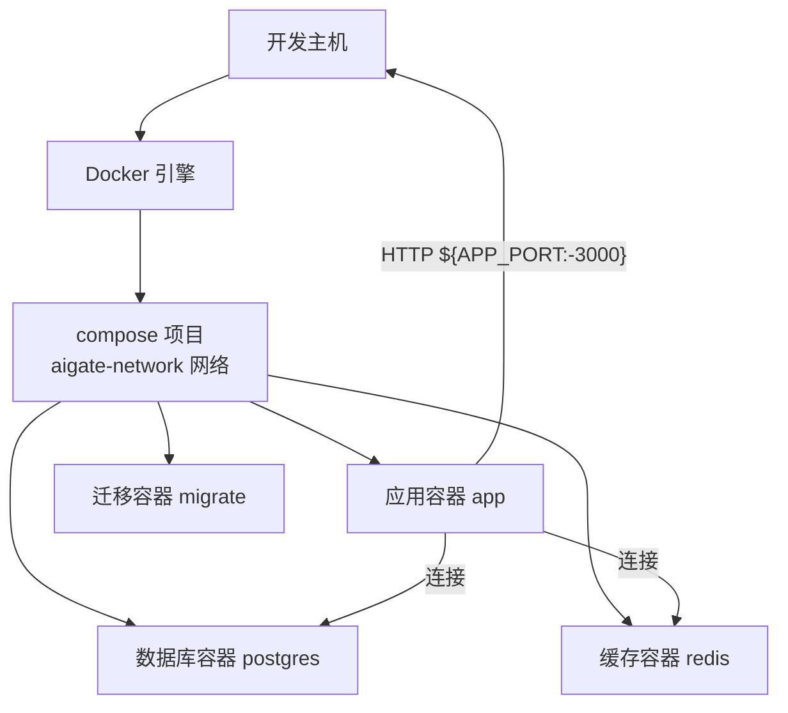
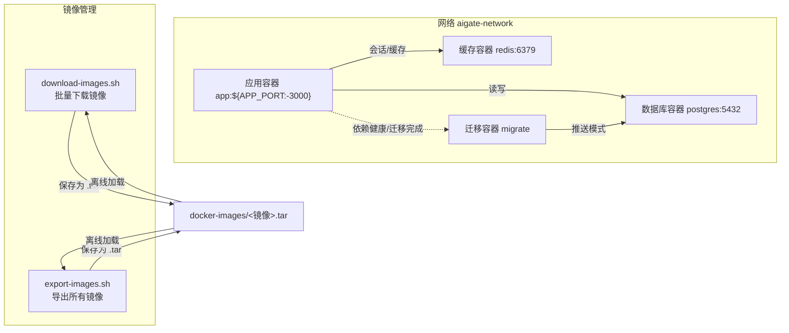
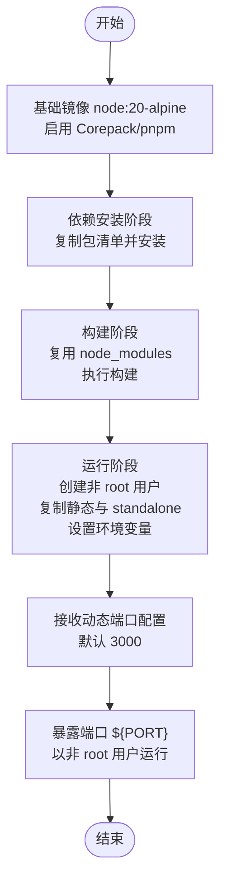
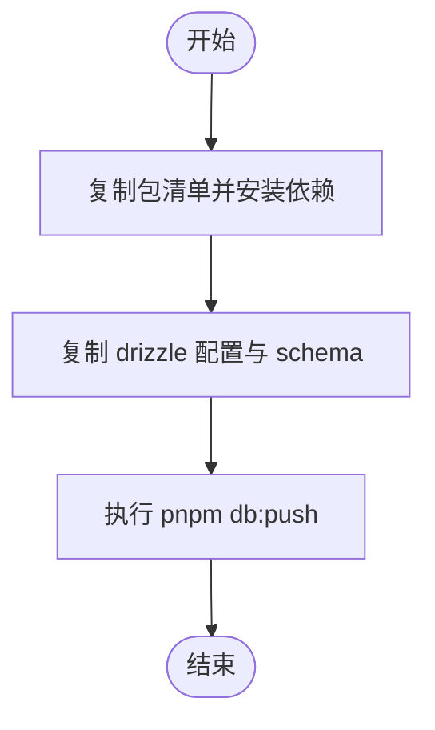
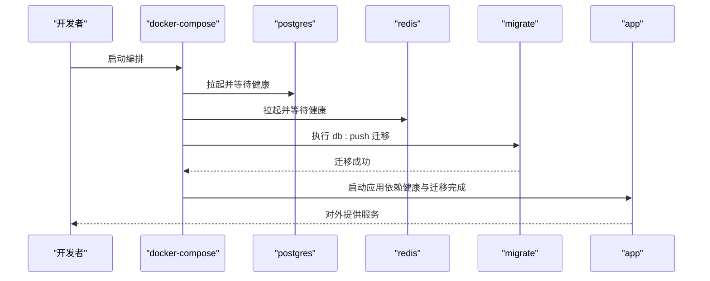
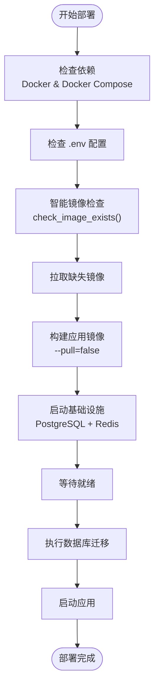
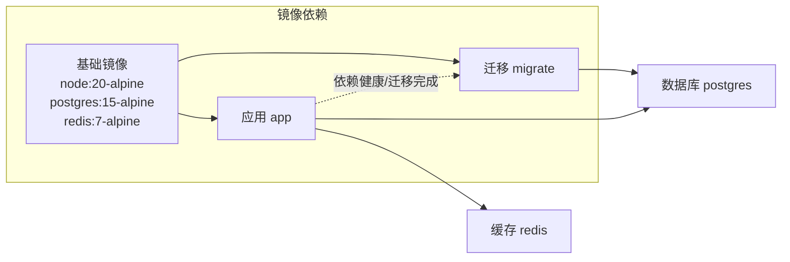

# Docker 容器化部署

<cite>
**本文引用的文件**
- [Dockerfile](file://Dockerfile)
- [Dockerfile.migrate](file://Dockerfile.migrate)
- [docker-compose.yml](file://docker-compose.yml)
- [.dockerignore](file://.dockerignore)
- [.gitignore](file://.gitignore)
- [deploy.sh](file://deploy.sh)
- [download-images.sh](file://download-images.sh)
- [export-images.sh](file://export-images.sh)
- [.env](file://.env)
- [drizzle.config.ts](file://drizzle.config.ts)
- [next.config.ts](file://next.config.ts)
- [package.json](file://package.json)
- [src/lib/schema.ts](file://src/lib/schema.ts)
- [src/lib/database.ts](file://src/lib/database.ts)
- [src/lib/drizzle.ts](file://src/lib/drizzle.ts)
</cite>

## 更新摘要
**变更内容**
- 智能镜像存在性检查：新增 `check_image_exists()` 函数，自动检测本地镜像并跳过重复拉取
- 构建性能优化：使用 `--pull=false` 参数跳过远程镜像检查，显著提升构建速度
- 镜像管理工具：新增 `download-images.sh` 和 `export-images.sh` 两个脚本，支持离线镜像管理
- 配置文件更新：`.gitignore` 新增对 `.tar` 文件的忽略规则
- 端口配置动态化：Dockerfile 和 docker-compose.yml 支持通过环境变量动态配置端口
- 交互式配置系统：新增完整的交互式环境变量配置功能，支持管理员账户、数据库连接、Redis 连接和应用端口的配置
- 数据库迁移流程简化：Dockerfile.migrate 从复杂的多步骤脚本简化为单命令执行，提升部署效率
- **新增**：完整的Docker镜像导出自动化功能，包括三阶段构建流程、应用镜像导出和基础镜像批量导出，增强离线部署能力

## 目录
1. [简介](#简介)
2. [项目结构](#项目结构)
3. [核心组件](#核心组件)
4. [架构总览](#架构总览)
5. [详细组件分析](#详细组件分析)
6. [依赖分析](#依赖分析)
7. [性能考虑](#性能考虑)
8. [故障排查指南](#故障排查指南)
9. [结论](#结论)
10. [附录](#附录)

## 简介
本文件面向 AIGate 的 Docker 容器化部署，系统性阐述以下内容：
- 多阶段 Dockerfile 的构建流程与优化点（基础镜像、依赖安装、构建与运行时配置）
- 数据库迁移专用镜像 Dockerfile.migrate 的构建与执行流程（现已简化为单命令执行）
- docker-compose.yml 的完整配置说明（服务、网络、卷、环境变量与健康检查）
- 容器编排最佳实践（服务依赖、健康检查、资源限制建议）
- 安全配置（非 root 用户运行、权限控制、网络安全）
- 调试与日志查看方法，以及性能监控建议
- **新增**：智能镜像存在性检查功能、构建优化（--pull=false）、镜像管理工具和交互式配置系统增强
- **新增**：完整的Docker镜像导出自动化功能，支持离线部署场景

## 项目结构
与容器化部署直接相关的关键文件如下：
- Dockerfile：多阶段构建（基础、依赖、构建、运行）
- Dockerfile.migrate：数据库迁移专用镜像（现已简化为单命令执行）
- docker-compose.yml：服务编排（应用、PostgreSQL、Redis、迁移任务）
- .dockerignore：构建上下文排除项
- **新增**：download-images.sh：批量下载并保存 Docker 镜像到本地文件
- **新增**：export-images.sh：构建并导出所有服务镜像，支持离线部署
- deploy.sh：一键部署脚本（封装常用操作，现包含智能镜像检查和交互式配置功能）
- 配置与环境：
  - .env：应用运行所需的数据库与认证等环境变量
  - drizzle.config.ts：Drizzle 迁移配置
  - next.config.ts：Next.js standalone 输出配置
  - package.json：脚本与依赖（含 db:push 和 db:migrate）



**图表来源**
- [docker-compose.yml](file://docker-compose.yml#L1-L87)

**章节来源**
- [Dockerfile](file://Dockerfile#L1-L54)
- [Dockerfile.migrate](file://Dockerfile.migrate#L1-L14)
- [docker-compose.yml](file://docker-compose.yml#L1-L87)
- [.dockerignore](file://.dockerignore#L1-L13)
- [download-images.sh](file://download-images.sh#L1-L35)
- [export-images.sh](file://export-images.sh#L1-L49)
- [deploy.sh](file://deploy.sh#L1-L364)

## 核心组件
- 多阶段构建镜像（应用）
  - 基础阶段：基于 node:20-alpine，启用 Corepack 与 pnpm
  - 依赖阶段：仅复制包清单并安装依赖，加速缓存
  - 构建阶段：复用 node_modules，执行构建，生成 Next.js standalone 输出
  - 运行阶段：创建非 root 用户，复制静态与 standalone 输出，以非 root 用户运行
- 数据库迁移镜像（migrate）
  - 基于 node:20-alpine，安装依赖后执行 pnpm db:push（**已简化**）
- 编排服务
  - app：Next.js 应用，暴露 ${APP_PORT:-3000}，依赖数据库与缓存健康状态，依赖迁移任务成功
  - postgres：PostgreSQL 15，持久化数据卷，健康检查
  - redis：Redis 7，持久化数据卷，健康检查
  - migrate：一次性任务，依赖数据库健康，完成后退出
- **新增**：智能镜像管理
  - download-images.sh：批量下载官方基础镜像并保存为 tar 文件
  - export-images.sh：构建应用镜像并导出所有依赖镜像，支持离线部署
- 环境与配置
  - .env 提供 DATABASE_URL、REDIS_URL、NEXTAUTH_SECRET、NEXTAUTH_URL
  - drizzle.config.ts 指定 schema 与迁移输出目录
  - next.config.ts 启用 output: 'standalone'

**章节来源**
- [Dockerfile](file://Dockerfile#L1-L54)
- [Dockerfile.migrate](file://Dockerfile.migrate#L1-L14)
- [docker-compose.yml](file://docker-compose.yml#L1-L87)
- [download-images.sh](file://download-images.sh#L1-L35)
- [export-images.sh](file://export-images.sh#L1-L49)
- [.env](file://.env#L1-L16)
- [drizzle.config.ts](file://drizzle.config.ts#L1-L11)
- [next.config.ts](file://next.config.ts#L1-L9)
- [package.json](file://package.json#L1-L76)

## 架构总览
下图展示容器化部署的整体交互：应用容器通过独立网络访问数据库与缓存；迁移任务在应用启动前完成数据库初始化。**新增**的镜像管理工具支持离线部署场景。



**图表来源**
- [docker-compose.yml](file://docker-compose.yml#L1-L87)
- [download-images.sh](file://download-images.sh#L1-L35)
- [export-images.sh](file://export-images.sh#L1-L49)

## 详细组件分析

### 多阶段 Dockerfile 分析
- 基础镜像与工具链
  - 使用 node:20-alpine，启用 Corepack 与 pnpm 固定版本，确保可重复构建
- 依赖安装阶段
  - 仅复制包清单并执行安装，避免不必要的文件拷贝，提升缓存命中率
- 构建阶段
  - 复用上一阶段的 node_modules，执行构建；设置 telemetry 禁用环境变量
  - 生成 Next.js standalone 输出，便于后续轻量运行
- 运行阶段
  - 创建系统用户组与用户，复制静态与 standalone 目录并赋予对应属主
  - 设置运行时环境变量（NODE_ENV、端口、主机绑定），以非 root 用户运行
  - **更新**：支持通过 ARG 接收动态端口配置，默认为 3000



**图表来源**
- [Dockerfile](file://Dockerfile#L1-L54)

**章节来源**
- [Dockerfile](file://Dockerfile#L1-L54)
- [next.config.ts](file://next.config.ts#L1-L9)

### 数据库迁移镜像 Dockerfile.migrate 分析
**更新** 迁移镜像已大幅简化，从复杂的多步骤迁移脚本改为单命令执行：

- 基础镜像与工具链
  - 同样基于 node:20-alpine，启用 pnpm
- 依赖安装
  - 复制包清单并安装依赖
- 迁移准备
  - 复制 drizzle 配置与 schema 文件
- 执行命令
  - 通过 pnpm db:push 执行迁移（**已移除 wait-and-push.sh 依赖**）

**简化优势**：
- 移除了复杂的等待逻辑和脚本依赖
- 直接使用 Drizzle Kit 的推送模式，更简洁可靠
- 减少了容器启动时间
- 降低了维护复杂度



**图表来源**
- [Dockerfile.migrate](file://Dockerfile.migrate#L1-L14)
- [drizzle.config.ts](file://drizzle.config.ts#L1-L11)
- [src/lib/schema.ts](file://src/lib/schema.ts#L1-L159)

**章节来源**
- [Dockerfile.migrate](file://Dockerfile.migrate#L1-L14)
- [drizzle.config.ts](file://drizzle.config.ts#L1-L11)
- [src/lib/schema.ts](file://src/lib/schema.ts#L1-L159)

### docker-compose.yml 配置详解
**更新** 端口配置已完全动态化：

- 服务定义与网络
  - app：构建上下文指向仓库根，使用 Dockerfile；映射端口；加入 aigate-network
  - postgres：使用官方 postgres:15-alpine，持久化数据卷，健康检查
  - redis：使用官方 redis:7-alpine，持久化数据卷，健康检查
  - migrate：构建上下文指向仓库根，使用 Dockerfile.migrate，完成后退出
- 环境变量管理
  - app：DATABASE_URL、REDIS_URL（均指向内部服务名与端口）
  - migrate：DATABASE_URL（与 app 相同）
  - postgres：POSTGRES_DB、POSTGRES_USER、POSTGRES_PASSWORD（来自环境变量）
- 依赖关系与健康检查
  - app 依赖 postgres 与 redis 的健康状态，且依赖 migrate 成功完成
  - postgres 与 redis 均配置健康检查，确保应用启动前基础设施可用
- 数据卷与端口映射
  - postgres_data、redis_data 用于持久化
  - **更新**：所有端口均可通过环境变量覆盖（APP_PORT、POSTGRES_PORT、REDIS_PORT）



**图表来源**
- [docker-compose.yml](file://docker-compose.yml#L1-L87)

**章节来源**
- [docker-compose.yml](file://docker-compose.yml#L1-L87)

### 智能镜像管理工具

**新增**：两个全新的镜像管理脚本，支持离线部署和镜像优化：

#### download-images.sh - 批量镜像下载器
- **功能**：自动下载官方基础镜像并保存为 tar 文件
- **镜像列表**：node:20-alpine、postgres:15-alpine、redis:7-alpine
- **工作流程**：
  1. 创建 docker-images 目录
  2. 遍历镜像列表，逐个拉取并保存
  3. 自动重命名文件（将冒号和斜杠替换为下划线）
  4. 显示保存结果和文件列表

#### export-images.sh - 应用镜像导出器
- **功能**：构建并导出所有服务镜像，支持完整的离线部署
- **工作流程**：
  1. 构建所有服务镜像
  2. 导出应用镜像（aigate-app）
  3. 导出基础镜像（node:20-alpine、postgres:15-alpine、redis:7-alpine）
  4. 生成使用说明，包含加载和启动命令

**章节来源**
- [download-images.sh](file://download-images.sh#L1-L35)
- [export-images.sh](file://export-images.sh#L1-L49)

### 一键部署脚本 deploy.sh
**更新** 交互式配置系统已全面增强，并新增智能镜像检查功能：

- **智能镜像检查**：新增 `check_image_exists()` 函数，自动检测本地镜像存在性
- **构建优化**：使用 `--pull=false` 参数跳过远程镜像检查，显著提升构建速度
- 功能概览
  - up：拉取基础镜像、构建应用镜像、启动基础设施、等待就绪、执行迁移并启动应用
  - update：重新构建应用与迁移镜像、执行迁移、重启应用
  - down/restart/logs/migrate/status/clean：停止、重启、查看日志、仅迁移、查看状态、清理数据
  - **新增**：config：交互式配置环境变量
- 依赖检查
  - 检测 Docker 与 Docker Compose 是否可用
- 环境提示
  - 若 .env 不存在，给出提示并建议复制示例文件
- **新增**：智能镜像管理
  - 检查本地是否存在所需的基础镜像
  - 仅在镜像不存在时才进行拉取，避免重复下载
  - 使用 `--pull=false` 构建，跳过远程检查
- **新增**：交互式配置功能
  - 支持管理员邮箱、密码、数据库 URL、Redis URL、应用端口的配置
  - 自动保存配置到 .env 文件
  - 自动生成 NEXTAUTH_SECRET 和 NEXTAUTH_URL
  - 支持配置预览和确认



**图表来源**
- [deploy.sh](file://deploy.sh#L190-L250)

**章节来源**
- [deploy.sh](file://deploy.sh#L51-L70)
- [deploy.sh](file://deploy.sh#L190-L250)
- [deploy.sh](file://deploy.sh#L235-L236)

### 数据库与迁移相关配置
- Drizzle 配置
  - schema 指向 src/lib/schema.ts，迁移输出目录为 drizzle，方言为 postgresql
- 数据库连接
  - src/lib/drizzle.ts 从 DATABASE_URL 读取连接字符串，使用 postgres-js 客户端
- 迁移执行
  - package.json 中提供 db:push 和 db:migrate 脚本，配合 drizzle.config.ts 与 schema 文件

**章节来源**
- [drizzle.config.ts](file://drizzle.config.ts#L1-L11)
- [src/lib/schema.ts](file://src/lib/schema.ts#L1-L159)
- [src/lib/drizzle.ts](file://src/lib/drizzle.ts#L1-L12)
- [package.json](file://package.json#L1-L76)

## 依赖分析
- 组件耦合
  - app 依赖数据库与缓存的健康状态，确保业务可用性
  - migrate 作为一次性任务，必须在应用启动前完成
- 外部依赖
  - PostgreSQL 与 Redis 官方镜像，具备健康检查能力
- **新增**：镜像依赖管理
  - 智能检查机制避免重复拉取
  - 支持离线部署场景
- 可能的循环依赖
  - 当前编排无循环依赖，依赖方向清晰（应用依赖基础设施，迁移依赖数据库）



**图表来源**
- [docker-compose.yml](file://docker-compose.yml#L1-L87)
- [deploy.sh](file://deploy.sh#L200-L232)

**章节来源**
- [docker-compose.yml](file://docker-compose.yml#L1-L87)
- [deploy.sh](file://deploy.sh#L200-L232)

## 性能考虑
- 构建性能
  - 多阶段构建与依赖缓存可显著减少重复安装时间
  - 使用 pnpm 固定版本与冻结锁文件，保证一致性与速度
  - **新增**：智能镜像检查避免重复拉取，构建时使用 `--pull=false` 跳过远程检查
- 运行性能
  - Next.js standalone 输出减少了运行时依赖，启动更快
  - 非 root 用户运行降低安全风险，同时不影响性能
- 资源限制建议
  - 在生产环境中，建议为各服务设置 CPU/内存限制与重启策略，以提升稳定性
  - 将数据库与缓存置于独立资源池或使用资源配额，避免争抢
- **迁移性能优化**
  - 简化的 db:push 命令减少了容器启动时间
  - 移除了复杂的等待逻辑，提升了整体部署效率
- **端口配置优化**
  - 动态端口配置减少了端口冲突的可能性
  - 支持在同一主机上运行多个实例
- **新增**：镜像管理性能优化
  - 离线部署支持，避免网络延迟影响
  - 批量镜像处理，提高部署效率

## 故障排查指南
- 健康检查失败
  - 检查 postgres 与 redis 的健康检查配置与端口映射
  - 确认 app 的 depends_on 条件满足（健康与迁移完成）
- 迁移失败
  - 使用 deploy.sh migrate 单独执行迁移任务，查看日志定位问题
  - 确认 DATABASE_URL 正确指向数据库服务与端口
  - **新增**：检查 db:push 命令是否正确执行，确认 schema 文件完整性
- 日志查看
  - 使用 deploy.sh logs 实时查看应用日志
  - 使用 docker compose logs -f 查看指定服务日志
- 数据清理
  - 使用 deploy.sh clean 谨慎清理容器与数据卷（含数据库数据）
- **新增**：镜像相关问题
  - 检查 docker-images 目录中的 tar 文件是否完整
  - 使用 `docker load -i <镜像文件>.tar` 加载离线镜像
  - 验证镜像存在性：`docker images | grep <镜像名>`
- **新增**：构建优化问题
  - 确认本地基础镜像已存在，避免重复拉取
  - 检查 `--pull=false` 参数是否正确传递给 docker compose build
- **新增**：端口冲突排查
  - 检查 APP_PORT、POSTGRES_PORT、REDIS_PORT 环境变量是否被其他服务占用
  - 使用 netstat 或 lsof 命令检查端口占用情况

**章节来源**
- [docker-compose.yml](file://docker-compose.yml#L1-L87)
- [deploy.sh](file://deploy.sh#L1-L364)
- [download-images.sh](file://download-images.sh#L1-L35)
- [export-images.sh](file://export-images.sh#L1-L49)

## 结论
本部署方案采用多阶段 Dockerfile 与独立迁移镜像，结合 docker-compose 的健康检查与依赖编排，实现了稳定、可重复的应用交付。**最新的智能镜像检查功能**通过 `check_image_exists()` 函数实现了高效的本地镜像管理，避免重复拉取并提升部署速度。**构建优化**通过 `--pull=false` 参数显著减少了构建时间。**新增的镜像管理工具**提供了完整的离线部署解决方案，支持批量镜像下载和应用镜像导出。**最新的简化版本**通过移除复杂的等待脚本，直接使用 `db:push` 命令，进一步提升了部署效率和可靠性。**新增的交互式配置系统**使得环境变量管理更加直观和便捷，支持管理员账户、数据库连接、Redis 连接和应用端口的动态配置。**端口配置动态化改进**消除了硬编码端口带来的冲突问题，支持在同一主机上灵活部署多个实例。**新增的export-images.sh脚本**提供了完整的Docker镜像导出自动化功能，包括三阶段构建流程、应用镜像导出和基础镜像批量导出，显著增强了离线部署能力。建议在生产环境中进一步完善资源限制、安全加固与监控告警体系。

## 附录

### 环境变量与默认值
- 应用容器 app
  - DATABASE_URL：默认指向内部 postgres 服务
  - REDIS_URL：默认指向内部 redis 服务
  - **新增**：APP_PORT：默认 3000，可通过环境变量覆盖
- 数据库容器 postgres
  - POSTGRES_DB、POSTGRES_USER、POSTGRES_PASSWORD：可通过环境变量覆盖
  - **新增**：POSTGRES_PORT：默认 5432，可通过环境变量覆盖
- 缓存容器 redis
  - 默认端口 6379，持久化路径 /data
  - **新增**：REDIS_PORT：默认 6379，可通过环境变量覆盖
- 迁移容器 migrate
  - DATABASE_URL：与 app 相同

**章节来源**
- [docker-compose.yml](file://docker-compose.yml#L1-L87)
- [.env](file://.env#L1-L16)

### 安全配置要点
- 非 root 运行
  - 运行阶段创建系统用户与用户组，以非 root 用户启动应用进程
- 网络隔离
  - 服务位于同一自定义桥接网络，避免不必要的外部暴露
- 最小权限
  - 仅暴露必要端口，数据库与缓存不对外暴露端口映射
- 凭据管理
  - 使用 .env 管理敏感信息，注意 .dockerignore 排除敏感文件
- **迁移安全**
  - 简化的 db:push 命令减少了脚本攻击面
  - 直接使用官方 Drizzle Kit 工具，安全性更高
- **端口安全**
  - 动态端口配置支持随机端口分配，降低端口扫描风险
  - 环境变量验证机制防止无效端口配置
- **新增**：镜像安全
  - 离线镜像文件的完整性验证
  - 镜像加载的安全检查机制

**章节来源**
- [Dockerfile](file://Dockerfile#L31-L44)
- [docker-compose.yml](file://docker-compose.yml#L1-L87)
- [.dockerignore](file://.dockerignore#L1-L13)
- [.gitignore](file://.gitignore#L3)

### 智能镜像管理使用指南
**新增**：使用镜像管理工具优化部署流程：

#### 智能镜像检查
使用 `./deploy.sh` 命令时，系统会自动：
1. 检查本地是否存在 node:20-alpine、postgres:15-alpine、redis:7-alpine
2. 仅在镜像不存在时才进行拉取
3. 使用 `--pull=false` 构建，跳过远程检查

#### 离线部署流程
1. **批量下载**：`./download-images.sh`
   - 下载官方基础镜像并保存为 tar 文件
   - 自动重命名文件格式：`<镜像名>.tar`
   - 保存到 docker-images/ 目录

2. **应用镜像导出**：`./export-images.sh`
   - 构建所有服务镜像
   - 导出应用镜像和基础镜像
   - 生成加载和启动命令说明

3. **离线加载**：
   ```bash
   docker load -i docker-images/aigate-app.tar
   docker load -i docker-images/node_20-alpine.tar
   docker load -i docker-images/postgres_15-alpine.tar
   docker load -i docker-images/redis_7-alpine.tar
   ```

4. **启动服务**：`docker compose up -d`

**章节来源**
- [deploy.sh](file://deploy.sh#L51-L70)
- [deploy.sh](file://deploy.sh#L200-L236)
- [download-images.sh](file://download-images.sh#L1-L35)
- [export-images.sh](file://export-images.sh#L1-L49)

### 交互式配置使用指南
**新增**：使用 `./deploy.sh config` 命令启动交互式配置：

1. **管理员配置**
   - 输入管理员邮箱和密码
   - 自动同步到 NEXT_PUBLIC_* 环境变量
2. **数据库连接**
   - 配置 DATABASE_URL，支持自定义主机、端口、数据库名
3. **Redis 连接**
   - 配置 REDIS_URL，支持自定义主机、端口
4. **应用端口**
   - 配置 APP_PORT，支持自定义端口号
5. **自动配置**
   - 自动生成 NEXTAUTH_SECRET 和 NEXTAUTH_URL
   - 设置默认管理员名称

**章节来源**
- [deploy.sh](file://deploy.sh#L92-L174)

### export-images.sh 脚本详细分析
**新增**：完整的Docker镜像导出自动化功能

#### 脚本功能概述
- **三阶段构建流程**：自动构建所有服务镜像，包括应用镜像和迁移镜像
- **应用镜像导出**：专门导出 aigate-app 应用镜像，便于独立部署
- **基础镜像批量导出**：同时导出 node:20-alpine、postgres:15-alpine、redis:7-alpine 三个基础镜像
- **离线部署支持**：生成完整的离线部署说明和使用指南

#### 详细执行流程
1. **构建阶段**（1/3）
   - 使用 `docker compose build` 构建所有服务镜像
   - 包括 app、migrate、postgres、redis 服务

2. **应用镜像导出**（2/3）
   - 专门构建应用镜像：`docker compose -p aigate build app`
   - 导出为 `docker-images/aigate-app.tar`
   - 使用 `docker save` 命令保存镜像

3. **基础镜像导出**（3/3）
   - 批量导出三个基础镜像
   - 自动重命名：将冒号和斜杠替换为下划线
   - 保存到 `docker-images/` 目录

#### 输出文件格式
- 应用镜像：`docker-images/aigate-app.tar`
- 基础镜像：`docker-images/node_20-alpine.tar`
- 基础镜像：`docker-images/postgres_15-alpine.tar`
- 基础镜像：`docker-images/redis_7-alpine.tar`

#### 离线部署使用说明
脚本最后提供完整的离线部署使用指南：
- **加载镜像**：使用 `docker load -i <镜像文件>.tar` 命令加载各个镜像
- **启动服务**：使用 `docker compose up -d` 启动所有服务
- **验证部署**：检查服务状态和日志输出

**章节来源**
- [export-images.sh](file://export-images.sh#L1-L49)