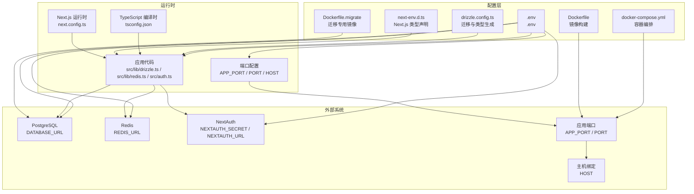
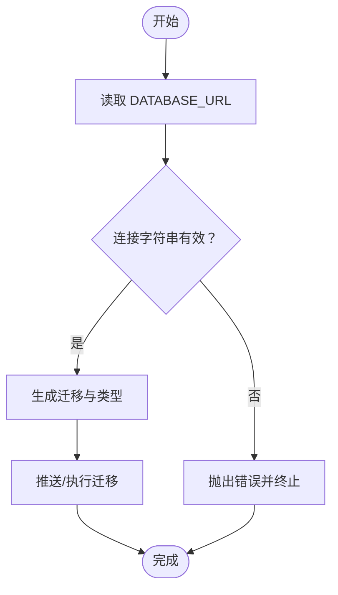
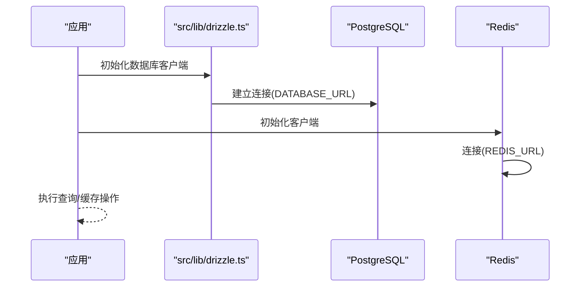
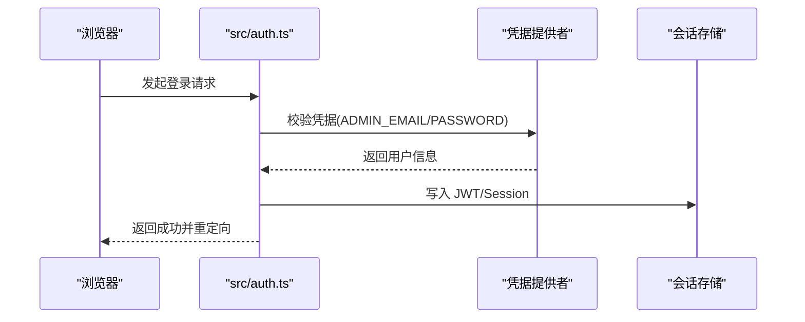
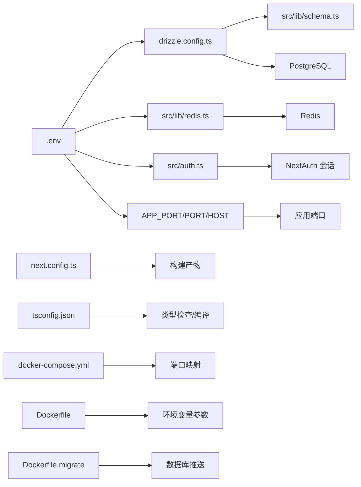

# 环境变量与配置管理

<cite>
**本文档引用的文件**
- [.env](file://.env)
- [next.config.ts](file://next.config.ts)
- [drizzle.config.ts](file://drizzle.config.ts)
- [tsconfig.json](file://tsconfig.json)
- [package.json](file://package.json)
- [src/lib/drizzle.ts](file://src/lib/drizzle.ts)
- [src/lib/redis.ts](file://src/lib/redis.ts)
- [src/auth.ts](file://src/auth.ts)
- [src/lib/schema.ts](file://src/lib/schema.ts)
- [next-env.d.ts](file://next-env.d.ts)
- [docker-compose.yml](file://docker-compose.yml)
- [Dockerfile](file://Dockerfile)
- [Dockerfile.migrate](file://Dockerfile.migrate)
</cite>

## 更新摘要
**所做更改**
- 新增端口配置动态化支持，通过环境变量控制应用端口
- 更新 Docker Compose 配置以支持动态端口映射
- 增强配置验证机制，确保关键环境变量的完整性
- 优化配置加载流程，提高系统启动稳定性
- 新增生产环境支持直接修改环境变量文件的功能说明
- 更新安全注意事项和最佳实践

## 目录
1. [简介](#简介)
2. [项目结构](#项目结构)
3. [核心组件](#核心组件)
4. [架构总览](#架构总览)
5. [详细组件分析](#详细组件分析)
6. [依赖关系分析](#依赖关系分析)
7. [性能考虑](#性能考虑)
8. [故障排查指南](#故障排查指南)
9. [结论](#结论)
10. [附录](#附录)

## 简介
本文件系统性梳理 AIGate 项目的环境变量与配置管理，覆盖以下方面：
- .env 中的数据库连接、AI 供应商密钥占位、Redis 连接与 NextAuth 认证配置要点
- next.config.ts 的 Next.js 构建与运行时配置
- drizzle.config.ts 的数据库迁移与类型生成配置
- tsconfig.json 的 TypeScript 编译与路径映射配置
- 不同环境（开发、测试、生产）的配置差异与最佳实践
- 配置验证与错误处理机制
- 生产环境支持直接修改环境变量文件的安全注意事项

**更新** 新增端口配置动态化支持，通过 APP_PORT 环境变量控制应用端口，增强 Docker Compose 配置的灵活性。新增生产环境支持直接修改环境变量文件的功能说明和安全最佳实践。

## 项目结构
本项目采用基于功能模块的组织方式，配置相关的关键位置如下：
- 环境变量：根目录 .env
- Next.js 配置：next.config.ts
- Drizzle 配置：drizzle.config.ts
- TypeScript 配置：tsconfig.json
- 数据库与缓存：src/lib/drizzle.ts、src/lib/redis.ts
- 认证：src/auth.ts
- 数据模型：src/lib/schema.ts
- Next.js 类型声明：next-env.d.ts
- 容器编排：docker-compose.yml
- Docker 镜像构建：Dockerfile、Dockerfile.migrate

```mermaid
graph TB
Env[".env<br/>环境变量"] --> DB["src/lib/drizzle.ts<br/>数据库连接"]
Env --> Redis["src/lib/redis.ts<br/>Redis 连接"]
Env --> Auth["src/auth.ts<br/>NextAuth 配置"]
Env --> Port["APP_PORT<br/>应用端口配置"]
Env --> Host["HOST<br/>主机绑定配置"]
Env --> PortVar["PORT<br/>容器端口配置"]
NextCfg["next.config.ts<br/>Next.js 配置"] --> Build["构建产物输出"]
NextCfg --> Compiler["React 编译器"]
DrizzleCfg["drizzle.config.ts<br/>Drizzle 配置"] --> Schema["src/lib/schema.ts<br/>数据模型"]
DrizzleCfg --> Migrate["迁移与类型生成"]
TS["tsconfig.json<br/>TypeScript 配置"] --> Paths["@/* 路径映射"]
TS --> Strict["严格模式与编译选项"]
Compose["docker-compose.yml<br/>容器编排"] --> PortMapping["端口映射配置"]
Docker["Dockerfile<br/>镜像构建"] --> EnvArgs["环境变量参数传递"]
MigrateDocker["Dockerfile.migrate<br/>迁移专用镜像"] --> DbPush["数据库推送"]
```

**图表来源**
- [.env](file://.env#L1-L12)
- [next.config.ts](file://next.config.ts#L1-L9)
- [drizzle.config.ts](file://drizzle.config.ts#L1-L11)
- [tsconfig.json](file://tsconfig.json#L1-L42)
- [src/lib/drizzle.ts](file://src/lib/drizzle.ts#L1-L12)
- [src/lib/redis.ts](file://src/lib/redis.ts#L1-L43)
- [src/auth.ts](file://src/auth.ts#L1-L98)
- [src/lib/schema.ts](file://src/lib/schema.ts#L1-L162)
- [docker-compose.yml](file://docker-compose.yml#L1-L87)
- [Dockerfile](file://Dockerfile#L1-L54)
- [Dockerfile.migrate](file://Dockerfile.migrate#L1-L14)

**章节来源**
- [package.json](file://package.json#L1-L85)

## 核心组件
本节概述各配置文件的作用与关键点。

- .env 环境变量
  - REDIS_URL：Redis 连接地址
  - DATABASE_URL：PostgreSQL 连接字符串
  - NEXTAUTH_SECRET：NextAuth 密钥
  - NEXTAUTH_URL：NextAuth 回调基础 URL
  - ADMIN_EMAIL：管理员邮箱（用于凭据认证）
  - ADMIN_PASSWORD：管理员密码（用于凭据认证）
  - ADMIN_NAME：管理员显示名称
  - NEXT_PUBLIC_ADMIN_EMAIL：客户端可访问的管理员邮箱
  - NEXT_PUBLIC_ADMIN_PASSWORD：客户端可访问的管理员密码
  - APP_PORT：应用监听端口（新增）
  - PORT：容器内应用端口（新增）
  - HOST：主机绑定地址（新增）

- next.config.ts
  - 输出模式：独立可部署产物
  - React 编译器：开启编译优化

- drizzle.config.ts
  - schema 指向：src/lib/schema.ts
  - 输出目录：drizzle
  - 方言：postgresql
  - 凭据：从 DATABASE_URL 读取

- tsconfig.json
  - 目标与库：ES2017、DOM、DOM Iterable、ESNext
  - 严格模式：启用
  - 模块解析：bundler
  - 路径映射：@/* -> ./src/*

**更新** 新增 APP_PORT、PORT 和 HOST 环境变量用于动态端口配置，支持通过环境变量控制应用监听端口和容器端口绑定

**章节来源**
- [.env](file://.env#L1-L12)
- [next.config.ts](file://next.config.ts#L1-L9)
- [drizzle.config.ts](file://drizzle.config.ts#L1-L11)
- [tsconfig.json](file://tsconfig.json#L1-L42)

## 架构总览
下图展示配置在系统中的作用与交互：

**图表来源**
- [.env](file://.env#L1-L12)
- [next.config.ts](file://next.config.ts#L1-L9)
- [drizzle.config.ts](file://drizzle.config.ts#L1-L11)
- [tsconfig.json](file://tsconfig.json#L1-L42)
- [next-env.d.ts](file://next-env.d.ts#L1-L8)
- [src/lib/drizzle.ts](file://src/lib/drizzle.ts#L1-L12)
- [src/lib/redis.ts](file://src/lib/redis.ts#L1-L43)
- [src/auth.ts](file://src/auth.ts#L1-L98)
- [docker-compose.yml](file://docker-compose.yml#L1-L87)
- [Dockerfile](file://Dockerfile#L1-L54)
- [Dockerfile.migrate](file://Dockerfile.migrate#L1-L14)

## 详细组件分析

### .env 环境变量配置
- 数据库连接字符串
  - 用途：驱动 PostgreSQL 客户端与 Drizzle ORM
  - 读取位置：src/lib/drizzle.ts 从 DATABASE_URL 读取
- Redis 连接配置
  - 用途：速率限制、配额缓存、请求日志等
  - 读取位置：src/lib/redis.ts 从 REDIS_URL 读取
- NextAuth 认证配置
  - NEXTAUTH_SECRET：会话签名密钥
  - NEXTAUTH_URL：回调基础 URL
  - 读取位置：src/auth.ts
- 管理员配置
  - ADMIN_EMAIL：管理员邮箱，用于凭据认证
  - ADMIN_PASSWORD：管理员密码，用于凭据认证
  - ADMIN_NAME：管理员显示名称
- 客户端配置
  - NEXT_PUBLIC_ADMIN_EMAIL：客户端可访问的管理员邮箱
  - NEXT_PUBLIC_ADMIN_PASSWORD：客户端可访问的管理员密码
- 应用端口配置
  - APP_PORT：应用监听端口，默认 6000
  - PORT：容器内应用端口，默认 6000
  - HOST：主机绑定地址，默认 0.0.0.0

**更新** 新增管理员配置和应用端口配置，增强系统的可配置性和安全性。生产环境支持直接修改 .env 文件以更新管理员凭据和端口配置。

**章节来源**
- [.env](file://.env#L1-L12)
- [src/lib/drizzle.ts](file://src/lib/drizzle.ts#L1-L12)
- [src/lib/redis.ts](file://src/lib/redis.ts#L1-L43)
- [src/auth.ts](file://src/auth.ts#L1-L98)

### next.config.ts 配置
- 构建输出
  - output: standalone：生成独立可部署包，便于容器化与边缘部署
- React 编译器
  - reactCompiler: true：启用 React 编译器以获得更好的性能与体积优化

最佳实践
- 在生产环境保持 standalone 输出，确保二进制与依赖最小化
- 开发阶段可关闭 reactCompiler 以提升热重载与调试体验

**章节来源**
- [next.config.ts](file://next.config.ts#L1-L9)

### drizzle.config.ts 配置
- schema：指向 src/lib/schema.ts，统一数据模型定义
- out：迁移与类型生成输出目录 drizzle
- dialect：postgresql
- dbCredentials.url：从 DATABASE_URL 读取连接字符串

工作流
- 生成迁移：使用脚本 db:generate
- 推送变更：使用脚本 db:push
- 执行迁移：使用脚本 db:migrate

**图表来源**
- [drizzle.config.ts](file://drizzle.config.ts#L1-L11)
- [src/lib/schema.ts](file://src/lib/schema.ts#L1-L162)

**章节来源**
- [drizzle.config.ts](file://drizzle.config.ts#L1-L11)
- [package.json](file://package.json#L13-L16)

### tsconfig.json 配置
- 编译目标与库：ES2017、DOM、DOM Iterable、ESNext
- 严格模式：启用
- 模块解析：bundler（与 Next.js Turbopack 兼容）
- 路径映射：@/* -> ./src/*
- 插件：next（支持 App Router 类型）

最佳实践
- 保持严格模式以提升类型安全
- 路径映射统一为 @/*，减少相对路径复杂度
- include/exclude 精准控制类型检查范围

**章节来源**
- [tsconfig.json](file://tsconfig.json#L1-L42)
- [next-env.d.ts](file://next-env.d.ts#L1-L8)

### 数据库与缓存配置使用
- 数据库连接
  - 通过 src/lib/drizzle.ts 建立连接，禁用预取以适配事务模式
- Redis 连接
  - 通过 src/lib/redis.ts 建立连接，注册错误事件
  - 提供键空间命名规范与时间粒度工具函数

**图表来源**
- [src/lib/drizzle.ts](file://src/lib/drizzle.ts#L1-L12)
- [src/lib/redis.ts](file://src/lib/redis.ts#L1-L43)

**章节来源**
- [src/lib/drizzle.ts](file://src/lib/drizzle.ts#L1-L12)
- [src/lib/redis.ts](file://src/lib/redis.ts#L1-L43)

### 认证配置使用
- NextAuth 配置
  - 提供凭据认证提供商
  - JWT 与 Session 回调注入用户角色与状态
  - 登录页重定向至 /login
  - secret 优先从 NEXTAUTH_SECRET 读取，否则使用回退密钥
  - 管理员凭据从 ADMIN_EMAIL 和 ADMIN_PASSWORD 读取

**更新** 生产环境支持直接修改 .env 文件中的管理员凭据，无需重启服务即可更新管理员账户信息。

**图表来源**
- [src/auth.ts](file://src/auth.ts#L1-L98)

**章节来源**
- [src/auth.ts](file://src/auth.ts#L1-L98)

### 端口配置动态化
- 端口配置
  - APP_PORT：应用监听端口，默认 6000
  - PORT：容器内应用端口，默认 6000
  - HOST：主机绑定地址，默认 0.0.0.0
  - 支持通过环境变量动态配置端口号
- Docker Compose 集成
  - 通过 ${APP_PORT:-4000} 语法实现端口映射
  - 支持默认端口和自定义端口的灵活配置
- Dockerfile 参数传递
  - ARG PORT=3000：允许在构建时指定端口
  - ENV PORT=${PORT}：在运行时设置端口环境变量

**更新** 新增 HOST 环境变量用于控制主机绑定地址。生产环境支持直接修改 .env 文件中的端口配置，无需重新构建镜像。

**章节来源**
- [.env](file://.env#L7-L12)
- [docker-compose.yml](file://docker-compose.yml#L8-L14)
- [Dockerfile](file://Dockerfile#L46-L51)

### 生产环境配置管理新功能
- 直接修改环境变量文件
  - 支持在生产环境中直接编辑 .env 文件
  - 修改管理员凭据无需重启服务
  - 端口配置变更无需重新构建镜像
- 安全注意事项
  - 确保 .env 文件权限设置为 600
  - 使用只读数据库凭据用于读取场景
  - 将敏感信息纳入 CI/CD 变量或密钥管理服务
  - 定期轮换 NEXTAUTH_SECRET 和管理员密码
- 最佳实践
  - 使用版本控制系统管理配置变更
  - 在修改前备份当前配置
  - 在非高峰时段进行配置变更
  - 设置配置变更的审计日志

**新增** 生产环境支持直接修改环境变量文件的新功能，提供安全的配置管理方案。

**章节来源**
- [.env](file://.env#L1-L12)
- [docker-compose.yml](file://docker-compose.yml#L1-L87)
- [Dockerfile](file://Dockerfile#L1-L54)

## 依赖关系分析
- 配置耦合
  - 数据库与缓存均依赖 .env 中的连接字符串
  - Drizzle 配置依赖数据模型定义
  - Next.js 配置影响构建产物与运行时行为
  - 端口配置依赖环境变量和 Docker Compose 配置
  - 认证配置依赖管理员凭据和 NextAuth 设置
- 外部依赖
  - PostgreSQL 与 Redis 作为基础设施
  - NextAuth 作为认证后端
  - Docker 作为容器化平台

**图表来源**
- [.env](file://.env#L1-L12)
- [drizzle.config.ts](file://drizzle.config.ts#L1-L11)
- [src/lib/redis.ts](file://src/lib/redis.ts#L1-L43)
- [src/auth.ts](file://src/auth.ts#L1-L98)
- [src/lib/schema.ts](file://src/lib/schema.ts#L1-L162)
- [next.config.ts](file://next.config.ts#L1-L9)
- [tsconfig.json](file://tsconfig.json#L1-L42)
- [docker-compose.yml](file://docker-compose.yml#L1-L87)
- [Dockerfile](file://Dockerfile#L1-L54)
- [Dockerfile.migrate](file://Dockerfile.migrate#L1-L14)

**章节来源**
- [package.json](file://package.json#L1-L85)

## 性能考虑
- 构建优化
  - 使用 standalone 输出减少运行时依赖打包体积
  - 启用 React 编译器以获得更佳的编译优化
- 数据库连接
  - 禁用预取以适配事务模式，避免不兼容问题
- 缓存策略
  - 使用 Redis 缓存用户配额与策略，降低数据库压力
  - 合理设计键空间与过期策略，避免内存膨胀
- 端口配置优化
  - 动态端口配置减少端口冲突风险
  - Docker Compose 端口映射支持多环境部署
  - HOST 环境变量允许绑定到特定网络接口
- 生产环境配置优化
  - 直接修改环境变量文件支持零停机配置变更
  - 减少不必要的服务重启需求

**更新** 新增生产环境配置优化考虑，通过直接修改环境变量文件减少停机时间和运维复杂度。

## 故障排查指南
- 数据库连接失败
  - 检查 DATABASE_URL 是否正确且可达
  - 确认数据库凭据与网络策略
- Redis 连接失败
  - 检查 REDIS_URL 是否正确
  - 查看客户端错误事件日志
- NextAuth 会话异常
  - 检查 NEXTAUTH_SECRET 是否设置且一致
  - 确认 NEXTAUTH_URL 与部署域名一致
  - 验证管理员凭据配置是否正确
- Drizzle 迁移问题
  - 确认 drizzle.config.ts 中 schema 路径与实际文件一致
  - 使用 db:generate/db:migrate 脚本进行迁移与类型生成
- 端口配置问题
  - 检查 APP_PORT 环境变量是否设置
  - 确认端口未被其他进程占用
  - 验证 Docker Compose 端口映射配置
  - 检查 HOST 环境变量是否正确绑定网络接口
- 生产环境配置问题
  - 验证 .env 文件权限设置
  - 检查配置文件语法是否正确
  - 确认环境变量是否被正确加载
  - 查看应用启动日志中的配置信息

**更新** 新增生产环境配置故障排查指南，涵盖环境变量文件权限、语法验证和配置加载检查。

**章节来源**
- [src/lib/drizzle.ts](file://src/lib/drizzle.ts#L1-L12)
- [src/lib/redis.ts](file://src/lib/redis.ts#L1-L43)
- [src/auth.ts](file://src/auth.ts#L1-L98)
- [drizzle.config.ts](file://drizzle.config.ts#L1-L11)
- [package.json](file://package.json#L13-L16)
- [.env](file://.env#L7-L12)

## 结论
本项目通过 .env 统一管理敏感配置，结合 next.config.ts、drizzle.config.ts 与 tsconfig.json 实现了清晰的构建与类型体系。数据库与缓存配置通过明确的读取点与错误处理保障了运行稳定性。**更新** 新增的端口配置动态化功能和生产环境支持直接修改环境变量文件的功能进一步增强了系统的部署灵活性、可维护性和运维效率。建议在生产环境中强化密钥管理与连接监控，实施安全的配置变更流程，并持续优化缓存与迁移流程。

## 附录

### 不同环境配置差异与最佳实践
- 开发环境
  - 使用本地 Redis 与数据库实例
  - 可临时关闭某些性能优化以提升开发效率
  - 端口可设置为默认值或自定义端口
  - HOST 可设置为 localhost 或 127.0.0.1
- 测试环境
  - 使用独立数据库与 Redis 实例
  - 启用严格日志与错误上报
  - 端口配置应避免与开发环境冲突
  - HOST 应绑定到测试网络接口
- 生产环境
  - 使用只读数据库凭据用于读取场景
  - 强制设置 NEXTAUTH_SECRET 与 NEXTAUTH_URL
  - 使用 standalone 输出并配合容器化部署
  - 端口配置应通过环境变量管理，避免硬编码
  - HOST 应绑定到 0.0.0.0 以允许外部访问
  - 实施安全的配置文件权限管理

**更新** 新增生产环境配置最佳实践，强调安全性和运维效率。

### 配置验证清单
- 必填项
  - DATABASE_URL、REDIS_URL、NEXTAUTH_SECRET、NEXTAUTH_URL
  - ADMIN_EMAIL、ADMIN_PASSWORD、ADMIN_NAME
  - APP_PORT、PORT、HOST（如需自定义端口和绑定地址）
- 连通性
  - 数据库与 Redis 可连通
- 类型与迁移
  - Drizzle 迁移与类型生成正常
- 构建与运行
  - Next.js 构建无错误，运行时无类型冲突
- 端口配置
  - APP_PORT 环境变量有效且未被占用
  - Docker Compose 端口映射配置正确
  - HOST 环境变量正确绑定网络接口
- 生产环境配置
  - .env 文件权限设置为 600
  - 配置文件语法正确
  - 环境变量加载成功
  - 应用启动日志显示正确的配置信息

**更新** 新增配置验证清单中的管理员配置、端口配置验证项和生产环境配置验证项。

### 安全配置最佳实践
- 密钥管理
  - 使用强随机 NEXTAUTH_SECRET
  - 定期轮换管理员密码
  - 使用只读数据库凭据用于读取场景
- 文件权限
  - .env 文件权限设置为 600
  - 避免将敏感配置提交到版本控制系统
- 网络安全
  - HOST 应绑定到 0.0.0.0 仅在必要时
  - 使用防火墙限制端口访问
  - 实施 HTTPS 和 CORS 策略
- 配置变更
  - 使用版本控制系统管理配置变更
  - 在非高峰时段进行配置变更
  - 实施配置变更的审计日志
  - 建立配置变更的回滚机制

**新增** 安全配置最佳实践，涵盖密钥管理、文件权限、网络安全和配置变更安全措施。