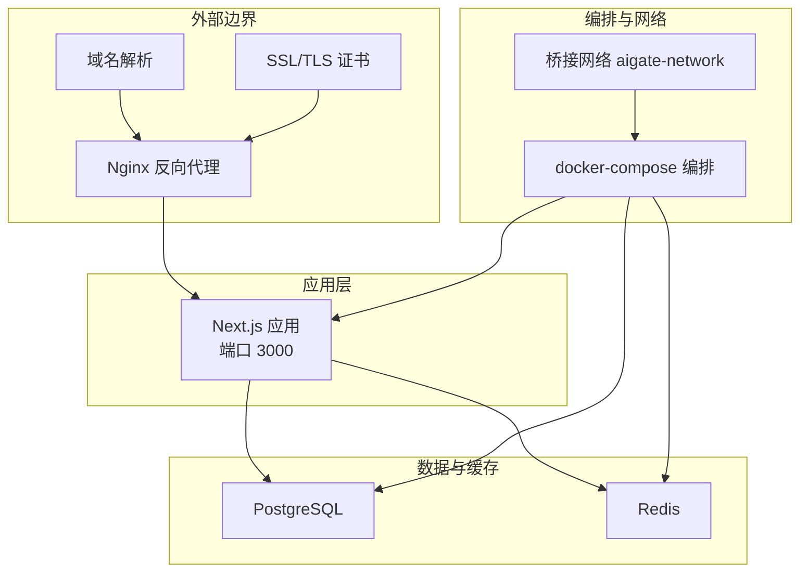
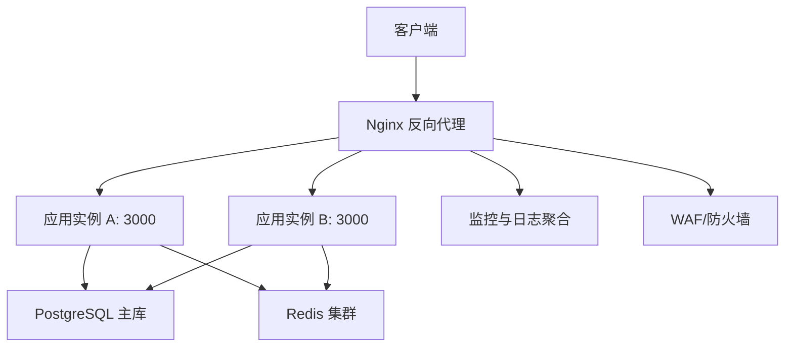
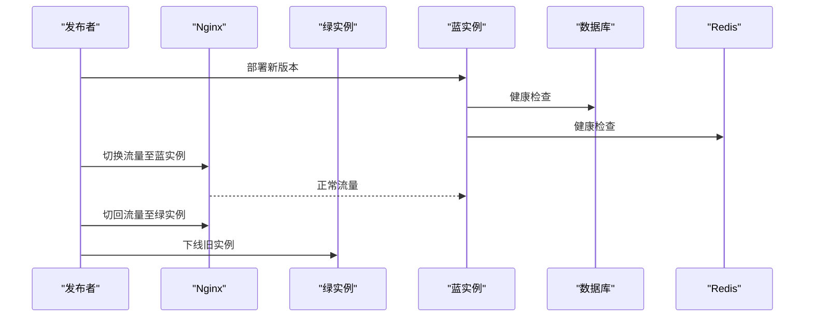
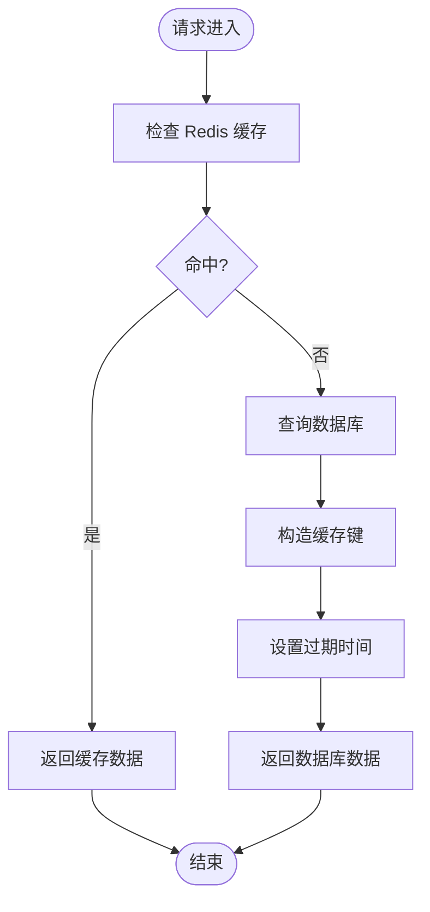
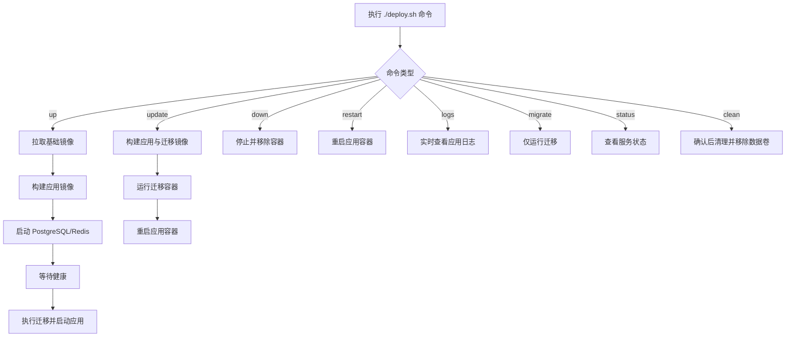
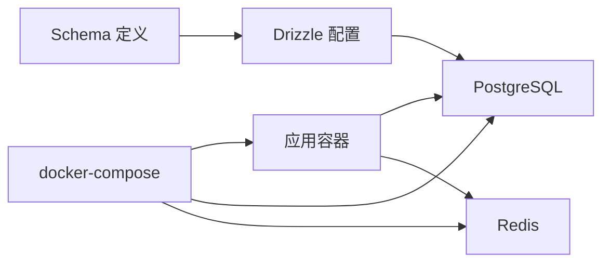

# 生产环境部署

<cite>
**本文引用的文件**
- [package.json](file://package.json)
- [Dockerfile](file://Dockerfile)
- [Dockerfile.migrate](file://Dockerfile.migrate)
- [docker-compose.yml](file://docker-compose.yml)
- [.env](file://.env)
- [next.config.ts](file://next.config.ts)
- [drizzle.config.ts](file://drizzle.config.ts)
- [src/lib/schema.ts](file://src/lib/schema.ts)
- [src/lib/database.ts](file://src/lib/database.ts)
- [src/lib/redis.ts](file://src/lib/redis.ts)
- [src/auth.ts](file://src/auth.ts)
- [deploy.sh](file://deploy.sh)
- [next-env.d.ts](file://next-env.d.ts)
- [readme/tech.md](file://readme/tech.md)
</cite>

## 目录
1. [简介](#简介)
2. [项目结构](#项目结构)
3. [核心组件](#核心组件)
4. [架构总览](#架构总览)
5. [详细组件分析](#详细组件分析)
6. [依赖关系分析](#依赖关系分析)
7. [性能考虑](#性能考虑)
8. [故障排查指南](#故障排查指南)
9. [结论](#结论)
10. [附录](#附录)

## 简介
本指南面向 AIGate 在生产环境的部署与运维，覆盖蓝绿部署、滚动更新、金丝雀发布等发布策略；Nginx 反向代理、SSL 证书与域名绑定；数据库高可用与灾备；性能调优（内存、连接池、缓存）；监控与告警；安全加固（防火墙、WAF、审计）以及自动化部署脚本的使用方法与流程。

## 项目结构
AIGate 是基于 Next.js 的全栈应用，采用 TypeScript 开发，使用 Drizzle ORM 访问 PostgreSQL，使用 Redis 缓存与限流，通过 Docker 与 docker-compose 进行本地与生产容器化编排。生产部署建议以容器化方式交付，并结合反向代理、数据库高可用与缓存集群、监控与安全策略共同实现稳定可靠的线上运行。

图表来源
- [docker-compose.yml](file://docker-compose.yml#L1-L84)
- [Dockerfile](file://Dockerfile#L1-L52)
- [src/lib/database.ts](file://src/lib/database.ts#L1-L524)
- [src/lib/redis.ts](file://src/lib/redis.ts#L1-L49)

章节来源
- [docker-compose.yml](file://docker-compose.yml#L1-L84)
- [Dockerfile](file://Dockerfile#L1-L52)
- [readme/tech.md](file://readme/tech.md#L1-L2)

## 核心组件
- 应用容器：基于 Node.js 20 Alpine，使用 Next.js Standalone 输出，暴露 3000 端口，默认监听 0.0.0.0。
- 数据库：PostgreSQL 15，健康检查，持久化卷，支持迁移容器一次性执行。
- 缓存：Redis 7，健康检查，持久化卷。
- 自动化：一键部署脚本，支持 up、update、down、restart、logs、migrate、status、clean 等命令。
- 配置：Next.js Standalone 输出、Drizzle ORM Schema、Redis 键空间设计、NextAuth 配置。

章节来源
- [Dockerfile](file://Dockerfile#L1-L52)
- [docker-compose.yml](file://docker-compose.yml#L1-L84)
- [deploy.sh](file://deploy.sh#L1-L168)
- [next.config.ts](file://next.config.ts#L1-L9)
- [drizzle.config.ts](file://drizzle.config.ts#L1-L11)
- [src/lib/schema.ts](file://src/lib/schema.ts#L1-L159)
- [src/lib/redis.ts](file://src/lib/redis.ts#L1-L49)
- [src/auth.ts](file://src/auth.ts#L1-L56)

## 架构总览
生产环境推荐以容器化为核心，配合 Nginx 反向代理统一入口、SSL 终端、健康检查与灰度流量控制；数据库采用主从或托管高可用方案；缓存使用 Redis 集群；通过监控与日志聚合实现可观测性；安全方面实施 WAF、防火墙与访问审计。

图表来源
- [docker-compose.yml](file://docker-compose.yml#L1-L84)
- [Dockerfile](file://Dockerfile#L1-L52)

## 详细组件分析

### 蓝绿部署
- 策略说明
  - 准备两套应用实例：绿（current）与蓝（next），通过 Nginx 将流量路由至 current。
  - 发布时先部署 next 实例，进行健康检查与冒烟测试，成功后切换 Nginx upstream 指向 next，再优雅下线旧实例。
- 与现有结构的契合
  - 当前 docker-compose 提供单一应用容器；生产可扩展为两个独立服务或通过不同容器组实现蓝绿。
  - 建议使用外部负载均衡（如云 LB 或 Nginx）管理多实例，避免单点。

图表来源
- [docker-compose.yml](file://docker-compose.yml#L1-L84)
- [Dockerfile](file://Dockerfile#L1-L52)

章节来源
- [docker-compose.yml](file://docker-compose.yml#L1-L84)
- [Dockerfile](file://Dockerfile#L1-L52)

### 滚动更新
- 策略说明
  - 逐批替换实例，保持最小可用副本，结合健康探针与超时重试，降低停机窗口。
- 与现有结构的契合
  - docker-compose 默认不支持滚动更新；可在编排平台（如 Kubernetes）上实现，或通过多实例+Nginx 轮询实现近似效果。

章节来源
- [docker-compose.yml](file://docker-compose.yml#L1-L84)

### 金丝雀发布
- 策略说明
  - 将小部分流量导入新版本（如 10%），观察指标与错误率，逐步提升比例直至全量。
- 与现有结构的契合
  - Nginx 可通过加权轮询或基于 Cookie/Header 的路由实现；也可借助外部网关或服务网格。

章节来源
- [docker-compose.yml](file://docker-compose.yml#L1-L84)

### 负载均衡与 Nginx 配置
- 反向代理
  - 使用 Nginx 作为入口，终止 TLS，转发到多个应用实例。
  - 建议开启健康检查、超时与重试策略，限制上传大小，启用压缩。
- SSL 证书与域名绑定
  - 使用 ACME 自动签发与续期（certbot 或类似工具），将证书路径映射到 Nginx。
  - 在 Nginx 中配置 server_name 与强制 HTTPS。
- 域名绑定
  - 将域名指向 Nginx 外网 IP，确保 DNS TTL 合理，便于快速切换。

章节来源
- [docker-compose.yml](file://docker-compose.yml#L1-L84)

### 数据库高可用与灾备
- 主从复制与只读副本
  - 使用托管数据库（如云厂商主备/高可用）或自建主从，读写分离，只读流量走从库。
- 备份策略
  - 定时逻辑备份（pg_dump）与增量备份（WAL），保留至少 7-14 天可恢复点。
- 灾难恢复
  - 定期演练恢复流程，验证备份完整性与 RTO/RPO 指标。

章节来源
- [src/lib/schema.ts](file://src/lib/schema.ts#L1-L159)
- [src/lib/database.ts](file://src/lib/database.ts#L1-L524)

### 性能调优
- Node.js 内存优化
  - 固定容器内存上限，合理设置 Node.js 堆大小参数；启用 Next.js Standalone 以减少冷启动开销。
- 连接池配置
  - PostgreSQL 连接池数量按并发与实例数规划；避免过度连接导致资源争用。
  - Redis 连接池复用，开启超时与重连策略。
- 缓存策略
  - 使用 Redis 缓存热点策略与配额信息；键空间命名规范见 RedisKeys 设计；设置合理的过期时间与淘汰策略。

图表来源
- [src/lib/redis.ts](file://src/lib/redis.ts#L1-L49)
- [src/lib/database.ts](file://src/lib/database.ts#L1-L524)

章节来源
- [Dockerfile](file://Dockerfile#L1-L52)
- [src/lib/redis.ts](file://src/lib/redis.ts#L1-L49)
- [src/lib/database.ts](file://src/lib/database.ts#L1-L524)

### 监控与告警
- 应用性能监控
  - 指标：CPU、内存、QPS、P95/P99 延迟、错误率、连接池使用率。
  - 建议：Prometheus + Grafana 或云监控。
- 错误追踪
  - 结合日志与 APM（如 OpenTelemetry），定位慢请求与异常堆栈。
- 日志聚合
  - 使用集中式日志系统（如 ELK/EFK 或云日志服务），按应用、实例、请求 ID 分类检索。

章节来源
- [docker-compose.yml](file://docker-compose.yml#L1-L84)

### 安全加固
- 防火墙
  - 仅开放 Nginx 外网端口，内网服务间通过桥接网络通信；限制数据库与 Redis 的访问源。
- WAF
  - 部署 WAF 对常见攻击（SQL 注入、XSS、CC）进行拦截。
- 安全审计
  - 记录管理员操作、登录行为与敏感 API 调用；定期审计日志与权限。

章节来源
- [docker-compose.yml](file://docker-compose.yml#L1-L84)

### 自动化部署脚本使用指南
- 命令概览
  - up：首次部署与全量启动（拉取镜像、构建、启动基础设施与应用、等待数据库就绪、执行迁移）。
  - update：重建镜像、执行迁移、重启应用。
  - down/restart/logs/migrate/status/clean：停止、重启、查看日志、仅迁移、查看状态、清理数据（含卷）。
- 使用建议
  - 在 CI/CD 中集成 update 流程，结合蓝绿或金丝雀策略。
  - 生产环境务必设置 .env 并禁用默认密钥。

图表来源
- [deploy.sh](file://deploy.sh#L1-L168)
- [docker-compose.yml](file://docker-compose.yml#L1-L84)

章节来源
- [deploy.sh](file://deploy.sh#L1-L168)
- [.env](file://.env#L1-L4)

## 依赖关系分析
- 应用对数据库与缓存的依赖通过环境变量注入，容器编排中通过 depends_on 与健康检查保证启动顺序与可用性。
- Drizzle ORM Schema 明确了表结构与枚举，迁移脚本驱动数据库演进。
- Next.js Standalone 输出与 Dockerfile 配合，确保运行时最小化与可移植性。

图表来源
- [docker-compose.yml](file://docker-compose.yml#L1-L84)
- [drizzle.config.ts](file://drizzle.config.ts#L1-L11)
- [src/lib/schema.ts](file://src/lib/schema.ts#L1-L159)
- [Dockerfile](file://Dockerfile#L1-L52)

章节来源
- [docker-compose.yml](file://docker-compose.yml#L1-L84)
- [drizzle.config.ts](file://drizzle.config.ts#L1-L11)
- [src/lib/schema.ts](file://src/lib/schema.ts#L1-L159)
- [Dockerfile](file://Dockerfile#L1-L52)

## 性能考虑
- 运行时
  - 使用 Next.js Standalone 与固定容器资源，避免内存抖动。
- 数据库
  - 合理索引与只读分离；连接池大小与超时参数按 QPS 与延迟目标调优。
- 缓存
  - 依据业务热点选择合适的 TTL；对高频读取的策略与配额进行缓存；注意缓存穿透与雪崩治理。

章节来源
- [next.config.ts](file://next.config.ts#L1-L9)
- [src/lib/redis.ts](file://src/lib/redis.ts#L1-L49)
- [src/lib/database.ts](file://src/lib/database.ts#L1-L524)

## 故障排查指南
- 常见问题
  - 应用无法启动：检查容器日志、端口占用、环境变量与数据库/Redis 连通性。
  - 数据库迁移失败：确认 DATABASE_URL、迁移镜像构建与执行、数据库健康状态。
  - 缓存不可用：检查 REDIS_URL、网络连通与权限。
- 排障步骤
  - 使用 ./deploy.sh logs 查看实时日志。
  - 使用 ./deploy.sh status 查看服务状态。
  - 使用 ./deploy.sh migrate 单独执行迁移。
  - 使用 ./deploy.sh clean 谨慎清理（含数据卷）。

章节来源
- [deploy.sh](file://deploy.sh#L1-L168)
- [docker-compose.yml](file://docker-compose.yml#L1-L84)
- [.env](file://.env#L1-L4)

## 结论
AIGate 的生产部署应以容器化为基础，结合 Nginx 反向代理、数据库高可用与缓存集群、完善的监控与安全策略，辅以蓝绿/金丝雀发布与自动化脚本，形成可重复、可观测、可恢复的线上体系。建议在上线前完成压测与演练，确保发布流程与应急预案完备。

## 附录
- 技术栈简述：Next.js + Redis + PostgreSQL + Docker + TypeScript + TailwindCSS + Drizzle + tRPC + shadcn。
- Next.js 类型声明文件：用于开发时类型增强与 IDE 支持。

章节来源
- [readme/tech.md](file://readme/tech.md#L1-L2)
- [next-env.d.ts](file://next-env.d.ts#L1-L8)