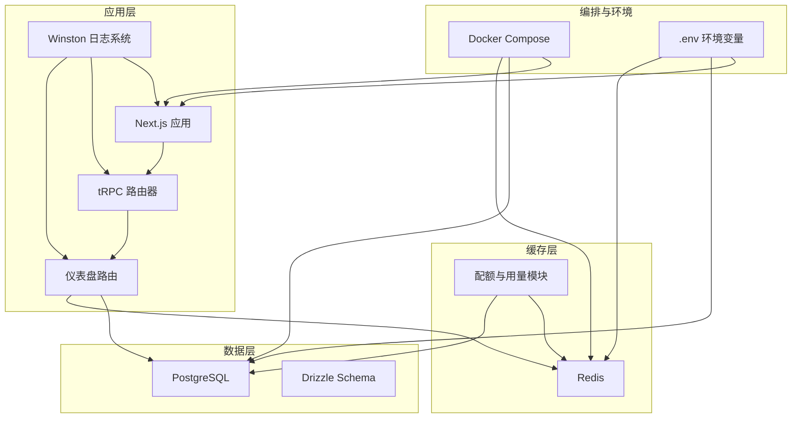
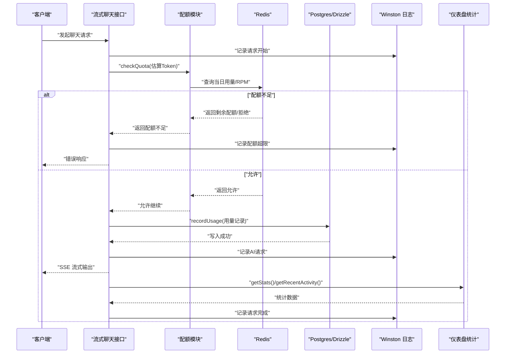
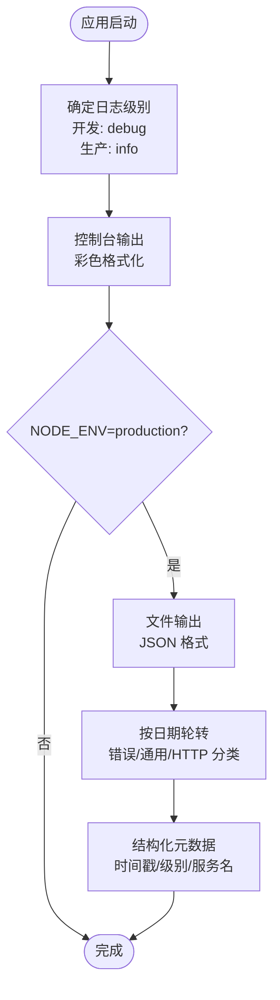
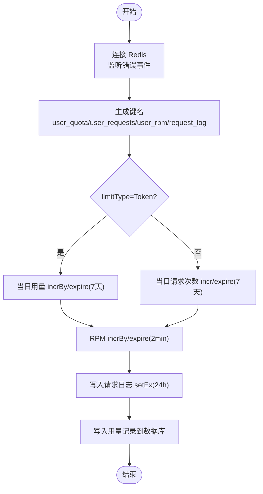
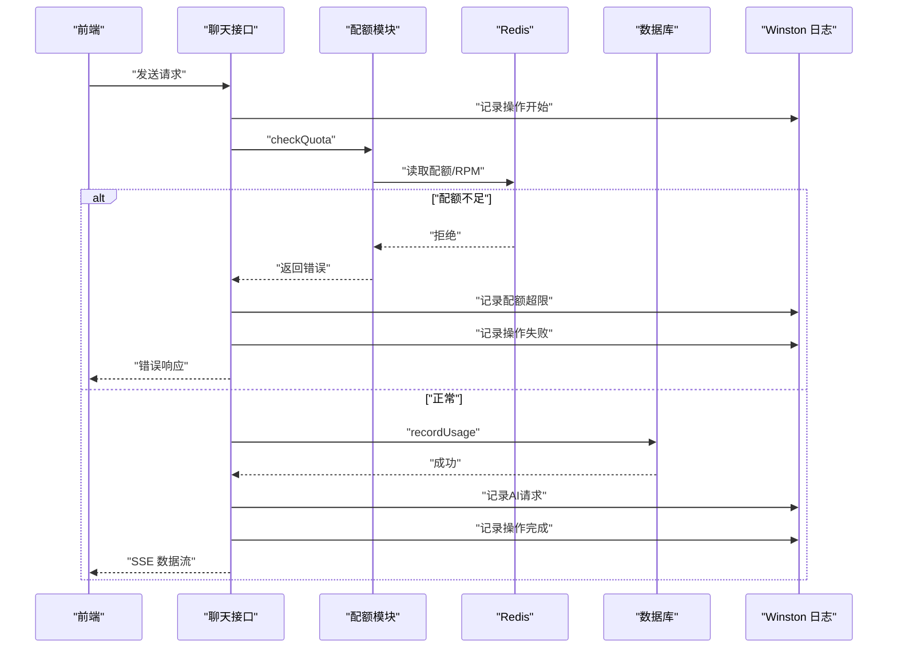
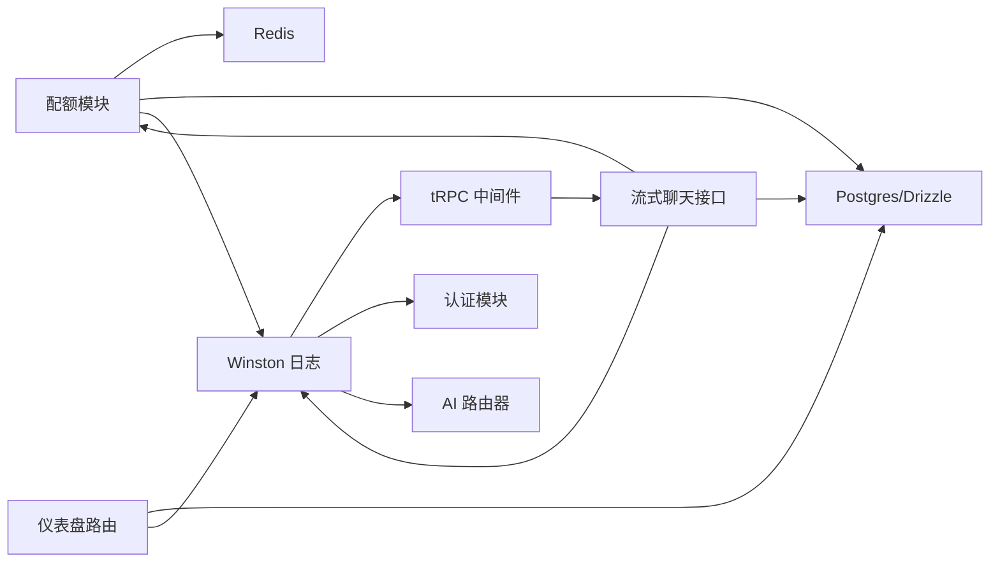

# 监控与日志管理

<cite>
**本文档引用的文件**
- [package.json](file://package.json)
- [next.config.ts](file://next.config.ts)
- [.env](file://.env)
- [docker-compose.yml](file://docker-compose.yml)
- [src/lib/redis.ts](file://src/lib/redis.ts)
- [src/lib/database.ts](file://src/lib/database.ts)
- [src/lib/schema.ts](file://src/lib/schema.ts)
- [src/lib/quota.ts](file://src/lib/quota.ts)
- [src/lib/logger.ts](file://src/lib/logger.ts)
- [src/lib/logger-middleware.ts](file://src/lib/logger-middleware.ts)
- [src/auth.ts](file://src/auth.ts)
- [src/server/api/trpc.ts](file://src/server/api/trpc.ts)
- [src/server/api/root.ts](file://src/server/api/root.ts)
- [src/server/api/routers/dashboard.ts](file://src/server/api/routers/dashboard.ts)
- [src/server/api/routers/ai.ts](file://src/server/api/routers/ai.ts)
- [src/pages/api/ai/chat/stream.ts](file://src/pages/api/ai/chat/stream.ts)
- [src/app/(dashboard)/debug/components/response-result.tsx](file://src/app/(dashboard)/debug/components/response-result.tsx)
</cite>

## 更新摘要
**变更内容**
- 新增完整的 Winston 结构化日志基础设施
- 添加专用日志中间件和便捷日志记录函数
- 更新配额检查、AI 请求、认证等关键路径的日志记录
- 增强日志级别管理和文件轮转配置

## 目录
1. [简介](#简介)
2. [项目结构](#项目结构)
3. [核心组件](#核心组件)
4. [架构总览](#架构总览)
5. [详细组件分析](#详细组件分析)
6. [依赖关系分析](#依赖关系分析)
7. [性能考量](#性能考量)
8. [故障排查指南](#故障排查指南)
9. [结论](#结论)
10. [附录](#附录)

## 简介
本文件面向 AIGate 的运维团队，提供一套完整的监控与日志管理方案。内容覆盖应用监控配置（性能指标、业务指标、系统资源）、日志管理策略（日志级别、格式、轮转）、Redis 监控（内存、连接、性能）、错误追踪与异常处理（错误日志、堆栈、告警）、APM 集成（New Relic/DataDog/自建）以及健康检查与外部监控对接、日志分析与可视化工具使用指南。

**更新** 新增完整的 Winston 结构化日志基础设施，提供统一的日志管理解决方案。

## 项目结构
AIGate 基于 Next.js 16 与 tRPC 构建，采用 Postgres + Redis 作为数据与缓存存储，配合 Docker Compose 提供本地与生产级编排。关键运行时组件包括：
- 应用服务：Next.js + tRPC 后端路由
- 数据存储：PostgreSQL（Drizzle ORM）
- 缓存与配额：Redis（基于 redis 客户端）
- **新增** 结构化日志：Winston + Daily Rotate File
- 运行环境：Docker Compose（含健康检查）

**图示来源**
- [docker-compose.yml](file://docker-compose.yml#L1-L84)
- [src/server/api/root.ts](file://src/server/api/root.ts#L1-L22)
- [src/server/api/routers/dashboard.ts](file://src/server/api/routers/dashboard.ts#L1-L141)
- [src/lib/database.ts](file://src/lib/database.ts#L1-L524)
- [src/lib/schema.ts](file://src/lib/schema.ts#L1-L159)
- [src/lib/redis.ts](file://src/lib/redis.ts#L1-L49)
- [src/lib/quota.ts](file://src/lib/quota.ts#L1-L334)
- [src/lib/logger.ts](file://src/lib/logger.ts#L1-L184)
- [.env](file://.env#L1-L13)

**章节来源**
- [docker-compose.yml](file://docker-compose.yml#L1-L84)
- [package.json](file://package.json#L1-L81)
- [next.config.ts](file://next.config.ts#L1-L9)
- [.env](file://.env#L1-L13)

## 核心组件
- Redis 客户端与键空间：负责配额与用量的实时统计、每分钟请求（RPM）控制、请求日志缓存。
- 数据库与模式：Drizzle ORM + Postgres，承载 API Key、配额策略、用量记录、白名单规则等。
- tRPC 中间件与上下文：统一错误格式化、会话注入、受保护/公开过程。
- **新增** Winston 结构化日志：统一日志格式、级别管理、文件轮转、业务日志记录。
- 仪表盘统计：基于用量记录聚合的业务指标（用户、请求、Token、活跃用户）。
- 流式聊天接口：SSE 输出与用量记录、错误处理。

**章节来源**
- [src/lib/redis.ts](file://src/lib/redis.ts#L1-L49)
- [src/lib/database.ts](file://src/lib/database.ts#L1-L524)
- [src/lib/schema.ts](file://src/lib/schema.ts#L1-L159)
- [src/server/api/trpc.ts](file://src/server/api/trpc.ts#L1-L142)
- [src/server/api/routers/dashboard.ts](file://src/server/api/routers/dashboard.ts#L1-L141)
- [src/pages/api/ai/chat/stream.ts](file://src/pages/api/ai/chat/stream.ts#L148-L166)
- [src/lib/logger.ts](file://src/lib/logger.ts#L1-L184)
- [src/lib/logger-middleware.ts](file://src/lib/logger-middleware.ts#L1-L142)

## 架构总览
AIGate 的监控与日志围绕"缓存 + 数据库 + 应用 + 日志"的四层协同展开：
- 缓存层（Redis）：高频配额检查、RPM 控制、当日用量累加、请求日志短期留存。
- 数据层（Postgres）：持久化用量记录、策略与规则，支撑仪表盘统计与报表。
- 应用层（Next.js + tRPC）：统一错误处理、指标采集入口、对外 API 与调试面板。
- **新增** 日志层（Winston）：统一日志格式、级别管理、文件轮转、业务日志记录。

**图示来源**
- [src/pages/api/ai/chat/stream.ts](file://src/pages/api/ai/chat/stream.ts#L148-L166)
- [src/lib/quota.ts](file://src/lib/quota.ts#L74-L190)
- [src/lib/redis.ts](file://src/lib/redis.ts#L1-L49)
- [src/lib/database.ts](file://src/lib/database.ts#L142-L277)
- [src/server/api/routers/dashboard.ts](file://src/server/api/routers/dashboard.ts#L1-L141)
- [src/lib/logger.ts](file://src/lib/logger.ts#L125-L163)

## 详细组件分析

### Winston 结构化日志基础设施
**新增** AIGate 现已集成完整的 Winston 结构化日志系统，提供统一的日志管理解决方案。

- **日志级别定义**
  - error: 0, warn: 1, info: 2, http: 3, debug: 4
  - 开发环境默认 debug，生产环境默认 info
- **输出格式**
  - 控制台：彩色时间戳 + 级别 + 消息
  - 文件：JSON 格式时间戳 + 结构化元数据
- **文件轮转策略**
  - 错误日志：按日期轮转，仅记录 error 级别，保留30天
  - 通用日志：按日期轮转，保留30天
  - HTTP 请求：按日期轮转，保留14天
- **日志目录**
  - 默认使用 LOG_DIR 环境变量，否则使用应用根目录/logs

**图示来源**
- [src/lib/logger.ts](file://src/lib/logger.ts#L15-L91)

**章节来源**
- [src/lib/logger.ts](file://src/lib/logger.ts#L1-L184)
- [package.json](file://package.json#L59-L60)

### 日志中间件与便捷函数
**新增** 提供专门的日志中间件和便捷函数，简化日志记录操作。

- **HTTP 请求日志中间件**
  - 自动记录请求方法、URL、状态码、响应时间、用户代理、IP等
  - 根据状态码自动选择日志级别（5xx:error, 4xx:warn, 2xx:http）
- **操作日志包装器**
  - withLogging：自动记录操作开始/完成/失败，包含执行时间和错误详情
  - logOperation：通用操作日志记录
- **业务专用日志函数**
  - logQuotaOperation：配额检查、更新、重置、超限记录
  - logAIRequest：AI 请求使用量统计
  - logAuth：认证相关操作记录

**章节来源**
- [src/lib/logger-middleware.ts](file://src/lib/logger-middleware.ts#L1-L142)

### Redis 监控与配置
- 连接与错误处理
  - 应用启动即连接 Redis，监听客户端错误事件，便于快速发现连接问题。
  - 环境变量 REDIS_URL 用于指定连接地址。
- 键空间与 TTL 策略
  - 用户每日用量（Token 或请求次数）：按日期键过期（7 天）。
  - 每分钟请求次数（RPM）：按分钟键过期（2 分钟）。
  - 请求日志：按请求 ID 键短期保留（24 小时）。
- 监控建议
  - 使用 Redis CLI 或第三方监控工具定期检查键数量、内存占用、命中率、慢查询。
  - 关注过期键比例与内存峰值，结合业务流量进行容量规划。
  - 对 Redis 实例启用持久化与备份策略，确保用量与配额不丢失。

**图示来源**
- [src/lib/redis.ts](file://src/lib/redis.ts#L1-L49)
- [src/lib/quota.ts](file://src/lib/quota.ts#L192-L255)

**章节来源**
- [src/lib/redis.ts](file://src/lib/redis.ts#L1-L49)
- [src/lib/quota.ts](file://src/lib/quota.ts#L1-L334)
- [.env](file://.env#L1-L13)

### 日志管理策略
**更新** 基于新的 Winston 结构化日志系统，提供更完善的日志管理策略。

- **日志级别**
  - 开发环境：debug（详细调试信息）
  - 生产环境：info（关键业务信息）
  - 特殊场景：error/warn/http/debug 等级细分
- **日志格式**
  - 统一结构化 JSON 格式，包含时间戳、级别、服务名、消息体、元数据
  - 控制台输出彩色格式，便于开发调试
  - 文件输出纯 JSON，便于机器解析和日志分析工具处理
- **日志轮转**
  - 按日期轮转，自动清理过期日志
  - 不同类型的日志分别存储，便于分类管理和检索
  - 支持日志文件大小限制和保留天数配置
- **业务日志记录**
  - 配额操作：check/update/reset/exceeded
  - AI 请求：模型、提供商、Token 使用量统计
  - 认证操作：login/logout/register/failed
  - HTTP 请求：方法、URL、状态码、响应时间、用户代理、IP

**章节来源**
- [src/lib/logger.ts](file://src/lib/logger.ts#L1-L184)
- [src/lib/logger-middleware.ts](file://src/lib/logger-middleware.ts#L1-L142)

### 错误追踪与异常处理
- tRPC 错误格式化
  - 统一返回形状，包含 Zod 校验错误扁平化，便于前端展示。
- API 层错误处理
  - 流式接口捕获内部错误，写入错误事件并终止 SSE。
  - 对数据库/Redis 异常进行降级处理（记录日志、返回通用错误）。
- **新增** 结构化错误日志
  - 使用 Winston 记录详细的错误信息，包含堆栈跟踪
  - 自动记录操作上下文和元数据，便于问题定位
- 堆栈与请求追踪
  - 在响应中附加请求 ID 与处理时间，便于跨系统关联。
  - 调试面板展示 AIGate 元数据，辅助定位问题。

**图示来源**
- [src/pages/api/ai/chat/stream.ts](file://src/pages/api/ai/chat/stream.ts#L148-L166)
- [src/lib/quota.ts](file://src/lib/quota.ts#L74-L190)
- [src/app/(dashboard)/debug/components/response-result.tsx](file://src/app/(dashboard)/debug/components/response-result.tsx#L131-L157)
- [src/lib/logger.ts](file://src/lib/logger.ts#L105-L123)

**章节来源**
- [src/server/api/trpc.ts](file://src/server/api/trpc.ts#L73-L84)
- [src/pages/api/ai/chat/stream.ts](file://src/pages/api/ai/chat/stream.ts#L148-L166)
- [src/app/(dashboard)/debug/components/response-result.tsx](file://src/app/(dashboard)/debug/components/response-result.tsx#L131-L157)

### 业务指标与系统资源监控
- 业务指标（Dashboard）
  - 用户总数、今日请求数、今日 Token 消耗、活跃用户数、新增用户趋势。
  - 仪表盘路由通过并发查询与 SQL 聚合实现高效统计。
- 系统资源
  - 容器层面：CPU、内存、网络、磁盘 IO。
  - 数据库与缓存：Postgres 连接数、查询延迟；Redis 内存、连接、命令耗时。
- 指标采集
  - Prometheus + Grafana：暴露指标端点，抓取容器与应用指标。
  - APM：New Relic/DataDog 自动探针或自建 Exporter。

**章节来源**
- [src/server/api/routers/dashboard.ts](file://src/server/api/routers/dashboard.ts#L1-L141)
- [src/lib/database.ts](file://src/lib/database.ts#L222-L277)
- [docker-compose.yml](file://docker-compose.yml#L1-L84)

### 健康检查与外部监控对接
- 健康检查
  - Postgres/Redis 健康检查已内置（Compose），应用可增加 HTTP 健康端点（/health）返回状态。
- 外部监控
  - Prometheus：抓取 /metrics（需在应用中实现）。
  - APM：New Relic/DataDog 探针自动注入；或通过 OpenTelemetry SDK 上报。
  - **新增** Winston 日志：统一的日志格式便于外部监控系统集成。

**章节来源**
- [docker-compose.yml](file://docker-compose.yml#L36-L57)
- [src/server/api/root.ts](file://src/server/api/root.ts#L1-L22)

### 日志分析与可视化工具使用
**更新** 基于新的结构化日志格式，提供更高效的日志分析与可视化方案。

- **收集**
  - Winston 文件输出：按日期轮转的 JSON 日志文件
  - 控制台输出：开发环境下的彩色日志
  - 支持多种日志后端（文件、控制台、远程服务）
- **查询与可视化**
  - Grafana + Loki：按服务、级别、请求 ID 筛选，构建仪表盘
  - Elasticsearch/Kibana：全文检索与聚合分析
  - Splunk：企业级日志分析平台
- **告警**
  - 基于错误关键字与异常模式设置告警规则
  - 结构化日志便于自动化告警和监控
- **日志轮转**
  - 自动文件轮转，避免单个日志文件过大
  - 支持日志压缩和清理策略

## 依赖关系分析
**更新** 新增 Winston 日志系统的依赖关系。

- 组件耦合
  - 配额模块依赖 Redis 与数据库；数据库模块依赖 Drizzle 与 Postgres；tRPC 路由器贯穿前后端。
  - **新增** 日志模块为所有业务模块提供统一的日志服务。
- 外部依赖
  - Redis、Postgres、Next.js、tRPC、Drizzle ORM、**Winston 日志系统**。
- 潜在风险
  - Redis 连接失败或不可用会导致配额检查与用量记录失败。
  - 数据库写入失败会影响统计与报表。
  - **新增** 日志系统故障可能影响问题诊断和系统可观测性。

**图示来源**
- [src/lib/quota.ts](file://src/lib/quota.ts#L1-L334)
- [src/lib/database.ts](file://src/lib/database.ts#L1-L524)
- [src/server/api/routers/dashboard.ts](file://src/server/api/routers/dashboard.ts#L1-L141)
- [src/pages/api/ai/chat/stream.ts](file://src/pages/api/ai/chat/stream.ts#L148-L166)
- [src/server/api/trpc.ts](file://src/server/api/trpc.ts#L1-L142)
- [src/lib/logger.ts](file://src/lib/logger.ts#L1-L184)
- [src/auth.ts](file://src/auth.ts#L1-L98)
- [src/server/api/routers/ai.ts](file://src/server/api/routers/ai.ts#L1-L301)

**章节来源**
- [src/lib/quota.ts](file://src/lib/quota.ts#L1-L334)
- [src/lib/database.ts](file://src/lib/database.ts#L1-L524)
- [src/server/api/root.ts](file://src/server/api/root.ts#L1-L22)

## 性能考量
- Redis
  - 使用原子操作（incr/incrBy）与合理 TTL，避免热点键竞争。
  - 将短期日志与用量键分离，降低过期风暴影响。
- 数据库
  - 并发统计使用 Promise.all 与 SQL 聚合，减少往返。
  - 用量记录写入异步化，不影响主流程。
- **新增** Winston 日志系统
  - 异步日志写入，避免阻塞主线程
  - 文件轮转在后台进行，不影响请求处理
  - 结构化 JSON 格式便于日志分析工具处理
- 应用
  - 启用 React Compiler（Next 配置）提升渲染性能。
  - 控制日志级别与格式，避免序列化开销。

## 故障排查指南
- Redis 连接失败
  - 检查 REDIS_URL 是否正确；确认容器网络与健康检查状态。
  - 查看应用日志中的 Redis Client Error。
- 配额检查异常
  - 核对 Redis 键是否存在与过期时间；检查策略缓存是否命中。
- 用量记录缺失
  - 确认 recordUsage 是否被调用；检查数据库写入异常与回滚。
- **新增** 日志系统问题
  - 检查 LOG_DIR 权限和磁盘空间
  - 验证日志文件轮转配置是否正确
  - 确认 Winston 配置是否符合预期
- 错误日志与堆栈
  - 在 tRPC 中间件与流式接口中定位错误位置；在调试面板查看请求 ID 与元数据。

**章节来源**
- [src/lib/redis.ts](file://src/lib/redis.ts#L7-L9)
- [src/lib/quota.ts](file://src/lib/quota.ts#L192-L255)
- [src/pages/api/ai/chat/stream.ts](file://src/pages/api/ai/chat/stream.ts#L148-L166)
- [src/server/api/trpc.ts](file://src/server/api/trpc.ts#L73-L84)
- [src/lib/logger.ts](file://src/lib/logger.ts#L45-L91)

## 结论
AIGate 的监控与日志体系以 Redis 与 Postgres 为核心，结合 tRPC 的统一错误处理与仪表盘统计，形成可观测、可追踪、可扩展的运维基础。**新增的 Winston 结构化日志系统**进一步增强了系统的可观测性和问题诊断能力。建议在现有基础上完善 APM 接入、健康检查端点、日志轮转与可视化告警，持续优化 Redis 与数据库的性能与稳定性。

## 附录
- **新增** 环境变量
  - LOG_DIR：日志文件存储目录，默认应用根目录/logs
  - NODE_ENV：环境变量，决定日志级别（development=debug, production=info）
- Docker Compose
  - 包含应用、Postgres、Redis、迁移任务与健康检查。
- Next 配置
  - standalone 输出与 React Compiler。
- **新增** 日志配置选项
  - 支持自定义日志目录和轮转策略
  - 可扩展的业务日志记录函数
  - 统一的错误处理和操作追踪

**章节来源**
- [.env](file://.env#L1-L13)
- [docker-compose.yml](file://docker-compose.yml#L1-L84)
- [next.config.ts](file://next.config.ts#L1-L9)
- [src/lib/logger.ts](file://src/lib/logger.ts#L45-L91)
- [src/lib/logger-middleware.ts](file://src/lib/logger-middleware.ts#L1-L142)